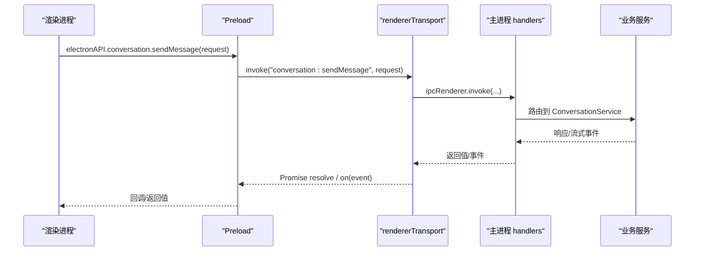
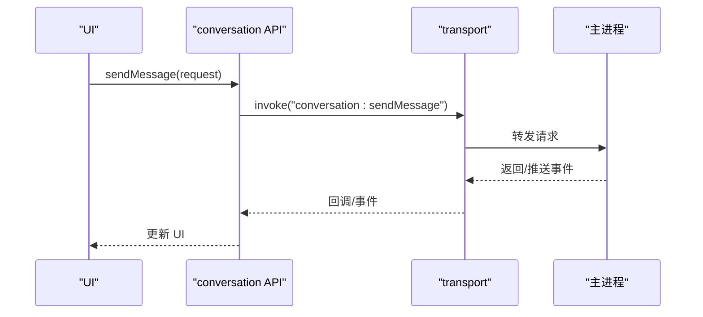

# API 参考

<cite>
**本文引用的文件**
- [src/main/ipc/README.md](file://src/main/ipc/README.md)
- [src/preload/index.ts](file://src/preload/index.ts)
- [src/preload/rendererTransport.ts](file://src/preload/rendererTransport.ts)
- [src/shared/renderer-api/index.ts](file://src/shared/renderer-api/index.ts)
- [src/shared/renderer-api/channels.ts](file://src/shared/renderer-api/channels.ts)
- [src/shared/renderer-api/createRendererApi.ts](file://src/shared/renderer-api/createRendererApi.ts)
- [src/shared/renderer-api/core.ts](file://src/shared/renderer-api/core.ts)
- [src/shared/renderer-api/workbench.ts](file://src/shared/renderer-api/workbench.ts)
- [src/shared/renderer-api/settings.ts](file://src/shared/renderer-api/settings.ts)
- [src/main/ipc/handlers.ts](file://src/main/ipc/handlers.ts)
</cite>

## 目录
1. [简介](#简介)
2. [项目结构](#项目结构)
3. [核心组件](#核心组件)
4. [架构总览](#架构总览)
5. [详细组件分析](#详细组件分析)
6. [依赖关系分析](#依赖关系分析)
7. [性能考虑](#性能考虑)
8. [故障排查指南](#故障排查指南)
9. [结论](#结论)
10. [附录](#附录)

## 简介
本文件为 RDC-Agent 的完整 API 参考，覆盖 Renderer 侧暴露给渲染进程的所有公共接口，包括 IPC 通道、Renderer API、Provider（LLM）API、工作区与运行时相关能力等。文档按“协议规范—消息格式—事件类型—调用示例—错误处理”的结构组织，并提供客户端实现指南、最佳实践、版本兼容性与迁移建议。

## 项目结构
RDC-Agent 通过 Electron 的 preload 脚本将安全的 API 暴露到渲染进程，并通过 IPC 与主进程通信。关键路径：
- 渲染进程入口：preload 暴露 electronAPI 与 rdcDesktop
- 共享 API 定义：shared/renderer-api 提供统一的通道与 API 构造器
- 主进程端：ipc handlers 注册并处理来自渲染进程的请求

```mermaid
graph TB
subgraph "渲染进程"
UI["应用界面"]
RT["rendererTransport<br/>IPC 传输层"]
end
subgraph "Preload"
EB["contextBridge.exposeInMainWorld"]
RA["createRendererApi<br/>组装各域 API"]
end
subgraph "主进程"
H["handlers.ts<br/>统一导出初始化/注册"]
D["各域 Handlers<br/>conversation/shell/..."]
end
UI --> RT
RT --> EB
EB --> RA
RA --> |invoke/subscribe| RT
RT <- --> |IPC| H
H --> D
```

图表来源
- [src/preload/index.ts:1-26](file://src/preload/index.ts#L1-L26)
- [src/shared/renderer-api/createRendererApi.ts:33-76](file://src/shared/renderer-api/createRendererApi.ts#L33-L76)
- [src/shared/renderer-api/channels.ts:1-244](file://src/shared/renderer-api/channels.ts#L1-L244)
- [src/main/ipc/handlers.ts:1-7](file://src/main/ipc/handlers.ts#L1-L7)

章节来源
- [src/main/ipc/README.md:1-10](file://src/main/ipc/README.md#L1-L10)
- [src/preload/index.ts:1-26](file://src/preload/index.ts#L1-L26)
- [src/shared/renderer-api/index.ts:1-18](file://src/shared/renderer-api/index.ts#L1-L18)

## 核心组件
- 传输层（RendererApiTransport）：封装 invoke 与事件订阅，基于 ipcRenderer 实现
- 通道定义（channels）：集中声明所有 RPC 通道名与事件通道名，并提供类型守卫
- API 构造器（createRendererApi + core/workbench/settings）：按领域聚合方法，形成稳定的对外 API 对象
- Preload 桥接：将 transport 注入 createRendererApi，并通过 contextBridge 暴露给渲染进程

章节来源
- [src/shared/renderer-api/transport.ts](file://src/shared/renderer-api/transport.ts)
- [src/shared/renderer-api/channels.ts:1-244](file://src/shared/renderer-api/channels.ts#L1-L244)
- [src/shared/renderer-api/createRendererApi.ts:33-76](file://src/shared/renderer-api/createRendererApi.ts#L33-L76)
- [src/preload/rendererTransport.ts:1-45](file://src/preload/rendererTransport.ts#L1-L45)

## 架构总览
渲染进程通过 electronAPI 调用各域方法；每个方法映射到一个 IPC 通道名；主进程 handlers 接收并路由到具体服务；结果以 Promise 或事件形式返回。



图表来源
- [src/shared/renderer-api/core.ts:55-77](file://src/shared/renderer-api/core.ts#L55-L77)
- [src/shared/renderer-api/channels.ts:18-32](file://src/shared/renderer-api/channels.ts#L18-L32)
- [src/preload/rendererTransport.ts:29-43](file://src/preload/rendererTransport.ts#L29-L43)
- [src/main/ipc/handlers.ts:1-7](file://src/main/ipc/handlers.ts#L1-L7)

## 详细组件分析

### 全局 API 对象（electronAPI）
- 平台信息：platform、isMac、isWindows、isLinux
- 子模块：appMeta、appShell、web、conversation、command、dialog、workflow、trace、agent、memory、investigation、knowledge、rdcRuntime、tool、mcp、evidence、llm、settings、project、device、session、run、runtimeLog、capture、context、events、windowControls
- 事件订阅：on(channel, callback)、off(channel, callback)

使用要点
- 仅通过 electronAPI 访问能力，避免直接操作 ipcRenderer
- 事件订阅需配合 isRendererEventChannel 校验（由 on/off 内部完成）

章节来源
- [src/shared/renderer-api/createRendererApi.ts:33-76](file://src/shared/renderer-api/createRendererApi.ts#L33-L76)
- [src/shared/renderer-api/channels.ts:178-218](file://src/shared/renderer-api/channels.ts#L178-L218)

### 应用外壳与系统能力（appShell/web/dialog/windowControls）
- appMeta.get：获取应用元信息
- appShell.selectAvatar/getAvatarDataUrl/openPath/copyText/readClipboardText
- web.resolveFavicon：解析域名 favicon
- dialog.selectFiles/selectRdcFiles/selectDirectory：文件选择
- windowControls.minimize/toggleMaximize/close/isMaximized：窗口控制

错误处理
- 若底层系统调用失败，Promise 将拒绝；建议在调用处捕获异常并提示用户

章节来源
- [src/shared/renderer-api/core.ts:20-53](file://src/shared/renderer-api/core.ts#L20-L53)
- [src/shared/renderer-api/channels.ts:2-17](file://src/shared/renderer-api/channels.ts#L2-L17)

### 会话与对话（conversation）
- sendMessage/rewriteFromMessage/cancelActiveTurn/answerUserInput/answerToolApproval
- getHistory/switchBranch/clearHistory/undoLastTurn
- getToolImagePreview/stageAttachments/releaseAttachments/getAttachmentPreview
- 事件：conversation:event（用于流式或增量更新）

调用流程


图表来源
- [src/shared/renderer-api/core.ts:55-77](file://src/shared/renderer-api/core.ts#L55-L77)
- [src/shared/renderer-api/channels.ts:18-32](file://src/shared/renderer-api/channels.ts#L18-L32)
- [src/preload/rendererTransport.ts:29-43](file://src/preload/rendererTransport.ts#L29-L43)

章节来源
- [src/shared/renderer-api/core.ts:55-77](file://src/shared/renderer-api/core.ts#L55-L77)
- [src/shared/renderer-api/channels.ts:18-32](file://src/shared/renderer-api/channels.ts#L18-L32)

### 工作流（workflow）
- getState/resume/stop/getRunUsage/listRuns/listActiveRuns
- 事件：workflow:stateChanged、workflow:runStatusChanged、workflow:runUsageChanged、workflow:blocked、trace:projectionChanged

章节来源
- [src/shared/renderer-api/core.ts:79-88](file://src/shared/renderer-api/core.ts#L79-L88)
- [src/shared/renderer-api/channels.ts:33-40](file://src/shared/renderer-api/channels.ts#L33-L40)
- [src/shared/renderer-api/channels.ts:189-195](file://src/shared/renderer-api/channels.ts#L189-L195)

### Agent（agent）
- sendMessage/sendState/getAllStates/configure
- 事件：agent:message、agent:statusChanged

章节来源
- [src/shared/renderer-api/core.ts:90-97](file://src/shared/renderer-api/core.ts#L90-L97)
- [src/shared/renderer-api/channels.ts:41-46](file://src/shared/renderer-api/channels.ts#L41-L46)
- [src/shared/renderer-api/channels.ts:200-203](file://src/shared/renderer-api/channels.ts#L200-L203)

### 记忆与权限（memory）
- issueApprovalToken/list/get/write/delete
- 说明：写删除等操作通常需要审批令牌，确保敏感操作可审计

章节来源
- [src/shared/renderer-api/settings.ts:6-16](file://src/shared/renderer-api/settings.ts#L6-L16)
- [src/shared/renderer-api/channels.ts:47-53](file://src/shared/renderer-api/channels.ts#L47-L53)

### 调查与知识（investigation/knowledge）
- investigation.read：读取调查记录
- knowledge.overview/query/card/compile/indexRebuild/candidates/candidateCreate/coldDataImport/issueApprovalToken/write/promote

章节来源
- [src/shared/renderer-api/core.ts:99-119](file://src/shared/renderer-api/core.ts#L99-L119)
- [src/shared/renderer-api/channels.ts:54-69](file://src/shared/renderer-api/channels.ts#L54-L69)

### 运行时资源（rdcRuntime）
- getOverview/validateResource/upsertResource/importResource/deleteResource/revealResource
- trustHook/revokeHook/trustMcp/revokeMcp/testHook
- listRequestSnapshots/getRequestSnapshot

章节来源
- [src/shared/renderer-api/settings.ts:18-46](file://src/shared/renderer-api/settings.ts#L18-L46)
- [src/shared/renderer-api/channels.ts:70-84](file://src/shared/renderer-api/channels.ts#L70-L84)

### 命令（command）
- list/category 过滤
- execute：执行命令

章节来源
- [src/shared/renderer-api/core.ts:121-126](file://src/shared/renderer-api/core.ts#L121-L126)
- [src/shared/renderer-api/channels.ts:85-88](file://src/shared/renderer-api/channels.ts#L85-L88)

### 工具与证据（tool/mcp/evidence）
- tool.getCatalog/getRuntimeSummary
- mcp.getStatusSummary
- evidence.getChain/getEvents

章节来源
- [src/shared/renderer-api/core.ts:128-144](file://src/shared/renderer-api/core.ts#L128-L144)
- [src/shared/renderer-api/channels.ts:89-95](file://src/shared/renderer-api/channels.ts#L89-L95)

### LLM Provider（llm）
- testProviderDraft/testModelCapability/connectProvider/refreshProviderModels/disconnectProvider
- startProviderAccountLogin/getProviderAccountStatus/finishProviderAccountLogin/logoutProviderAccount
- 事件：llm:stream、llm:effectiveCatalogChanged

章节来源
- [src/shared/renderer-api/settings.ts:48-60](file://src/shared/renderer-api/settings.ts#L48-L60)
- [src/shared/renderer-api/channels.ts:96-106](file://src/shared/renderer-api/channels.ts#L96-L106)
- [src/shared/renderer-api/channels.ts:196-199](file://src/shared/renderer-api/channels.ts#L196-L199)

### 设置（settings）
- get/getProviderCatalog/getEffectiveModel/getEffectiveCatalog/hasProviderSecret
- importAgentManifest/saveAgentDefinition/getAgentDefinitionCommit
- saveProviderDefinition/getProviderDefinitionCommit
- getModelsOverride/setModelsOverride/getResolvedShell/set

章节来源
- [src/shared/renderer-api/settings.ts:62-85](file://src/shared/renderer-api/settings.ts#L62-L85)
- [src/shared/renderer-api/channels.ts:107-122](file://src/shared/renderer-api/channels.ts#L107-L122)

### 工作区与工作项（project/device/session/run/runtimeLog/capture/context/trace）
- project：list/add/select/rename/remove；inputs.list/refresh/import/importPaths
- device：list/refresh/activate/watchStart/watchRenew/watchStop
- session：list/create/rename/remove/select/setModelOverride/setAgentId
- run：list(sessionId)
- runtimeLog：list(request)
- capture：list/select/openProjectInput/getOpenedState/clearOpenedState
- context：get/openHumanPreview/closeHumanPreview
- trace：getRun/getEvents/getProjection/exportRun/switchBranch

章节来源
- [src/shared/renderer-api/workbench.ts:14-92](file://src/shared/renderer-api/workbench.ts#L14-L92)
- [src/shared/renderer-api/channels.ts:123-176](file://src/shared/renderer-api/channels.ts#L123-L176)
- [src/shared/renderer-api/channels.ts:208-217](file://src/shared/renderer-api/channels.ts#L208-L217)

### 事件系统（events）
- 事件通道集中在 RENDERER_EVENT_CHANNEL，包含 shell/conversation/workflow/llm/agent/tools/workbench/runtime 等
- 通过 electronAPI.on/off 进行订阅与取消

章节来源
- [src/shared/renderer-api/channels.ts:178-218](file://src/shared/renderer-api/channels.ts#L178-L218)
- [src/shared/renderer-api/createRendererApi.ts:69-74](file://src/shared/renderer-api/createRendererApi.ts#L69-L74)

## 依赖关系分析
- 渲染进程依赖 shared/renderer-api 提供的稳定 API 与通道类型
- Preload 负责将 transport 注入 createRendererApi 并暴露到全局
- 主进程 handlers 通过 workbenchHandlers 统一注册，再分发到各域处理器

```mermaid
graph LR
A["rendererTransport.ts"] --> B["createRendererApi.ts"]
B --> C["core.ts"]
B --> D["workbench.ts"]
B --> E["settings.ts"]
F["channels.ts"] --> B
G["preload/index.ts"] --> B
H["main/ipc/handlers.ts"] --> I["各域 handlers"]
A <- --> H
```

图表来源
- [src/preload/rendererTransport.ts:1-45](file://src/preload/rendererTransport.ts#L1-L45)
- [src/shared/renderer-api/createRendererApi.ts:33-76](file://src/shared/renderer-api/createRendererApi.ts#L33-L76)
- [src/shared/renderer-api/channels.ts:1-244](file://src/shared/renderer-api/channels.ts#L1-L244)
- [src/main/ipc/handlers.ts:1-7](file://src/main/ipc/handlers.ts#L1-L7)

章节来源
- [src/preload/index.ts:1-26](file://src/preload/index.ts#L1-L26)
- [src/shared/renderer-api/index.ts:1-18](file://src/shared/renderer-api/index.ts#L1-L18)

## 性能考虑
- 批量操作：对频繁的小请求尽量合并（如 inputs.refresh），减少 IPC 次数
- 事件驱动：优先使用事件订阅（如 conversation/event、workflow/stateChanged）而非轮询
- 超时与重试：对网络或外部依赖（LLM Provider）增加超时与重试策略
- 资源释放：及时移除事件监听，避免内存泄漏
- 大对象传输：尽量避免在 IPC 中传递超大对象，必要时分片或使用文件句柄

[本节为通用指导，不直接引用具体文件]

## 故障排查指南
- 通道未注册：新增 IPC 需在 channels 登记，并在主进程 handlers 中注册对应处理器
- 事件未触发：确认 on/off 使用的 channel 属于 RENDERER_EVENT_CHANNEL，且主进程正确派发
- 权限问题：memory/knowledge 等写操作需要 approval token，先调用 issueApprovalToken
- 调试技巧：在主进程 handlers 中打印入参/出参；在渲染进程捕获 Promise 拒绝原因

章节来源
- [src/main/ipc/README.md:1-10](file://src/main/ipc/README.md#L1-L10)
- [src/shared/renderer-api/channels.ts:226-244](file://src/shared/renderer-api/channels.ts#L226-L244)

## 结论
RDC-Agent 通过清晰的通道定义与统一的 API 构造器，将复杂的主进程能力安全地暴露给渲染进程。遵循本文档的调用约定与最佳实践，可实现稳定、可扩展的跨进程交互。

[本节为总结性内容，不直接引用具体文件]

## 附录

### 协议与消息格式
- 请求：通过 rendererTransport.invoke(channel, ...args) 发送
- 响应：Promise<TResult> 返回
- 事件：通过 rendererTransport.subscribe(channel, callback) 订阅，返回取消函数

章节来源
- [src/preload/rendererTransport.ts:29-43](file://src/preload/rendererTransport.ts#L29-L43)
- [src/shared/renderer-api/channels.ts:226-244](file://src/shared/renderer-api/channels.ts#L226-L244)

### 客户端实现指南与最佳实践
- 始终通过 electronAPI 访问能力，不要直接调用 ipcRenderer
- 使用 isRendererEventChannel 保护事件订阅（on/off 已内置）
- 对异步调用增加 try/catch，区分网络错误与业务错误
- 对长耗时任务使用事件流（如 llm:stream、conversation:event）
- 合理管理事件生命周期，避免重复订阅与内存泄漏

章节来源
- [src/preload/index.ts:1-26](file://src/preload/index.ts#L1-L26)
- [src/shared/renderer-api/createRendererApi.ts:69-74](file://src/shared/renderer-api/createRendererApi.ts#L69-L74)

### 版本兼容性与废弃策略
- 新增通道：先在 channels 登记，再实现主/渲染两侧逻辑
- 废弃通道：保留旧通道一段时间，提供迁移提示与降级路径
- 事件变更：保持向后兼容，新增字段采用可选方式

[本节为通用策略，不直接引用具体文件]

### 迁移指南
- 从旧版 IPC 迁移：对照 channels 中的新通道名替换调用
- 事件升级：根据新的事件通道名调整订阅逻辑
- Provider 配置：使用 settings.getEffectiveCatalog 获取最终生效的配置

章节来源
- [src/shared/renderer-api/channels.ts:1-244](file://src/shared/renderer-api/channels.ts#L1-L244)
- [src/shared/renderer-api/settings.ts:62-85](file://src/shared/renderer-api/settings.ts#L62-L85)