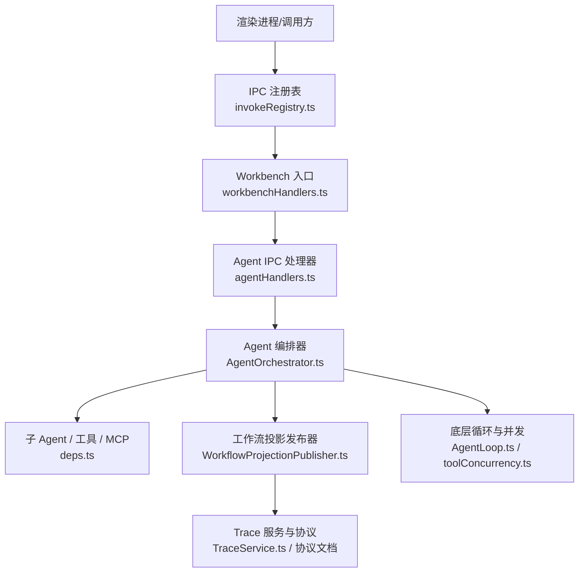
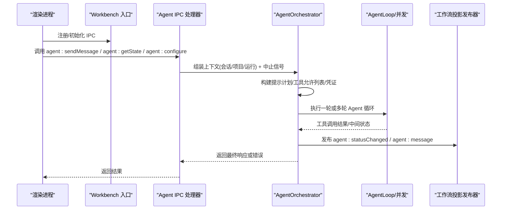
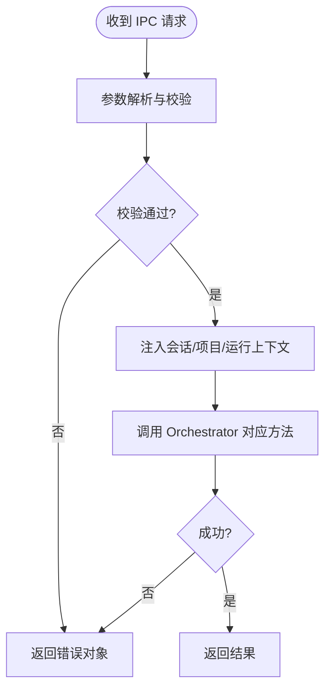
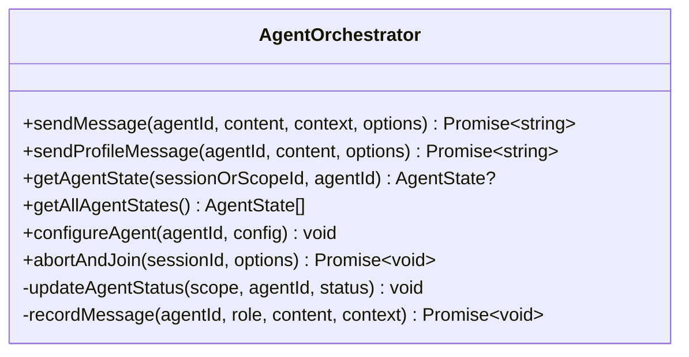
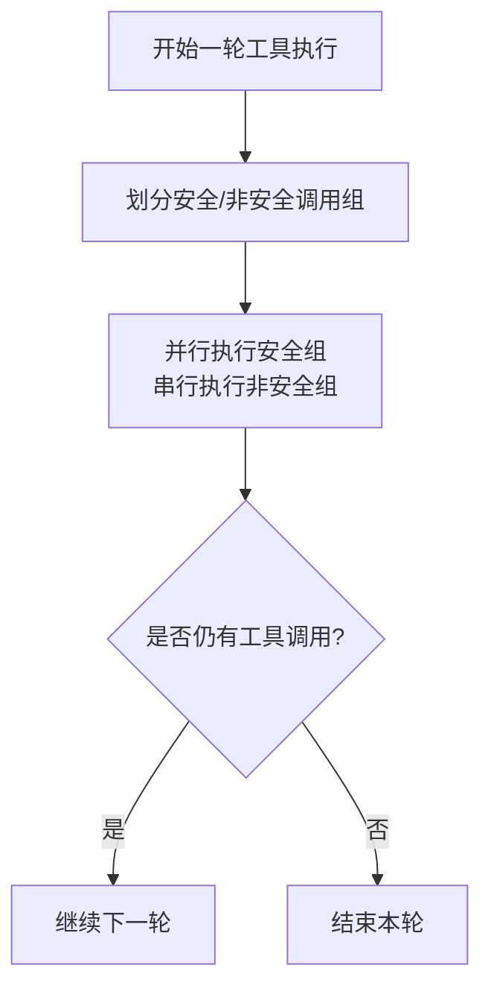
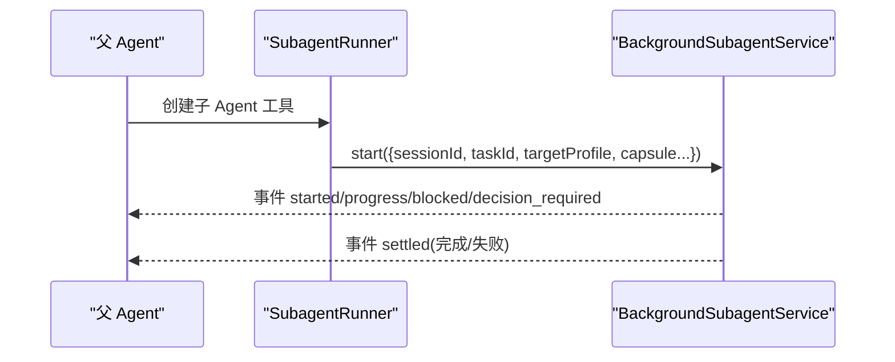
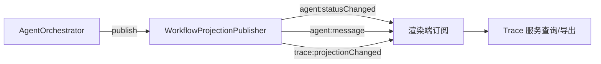
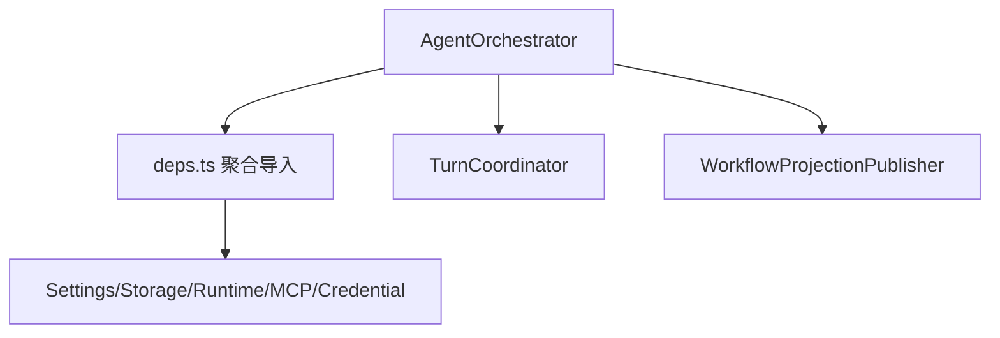

# Agent 操作 API

<cite>
**本文引用的文件**
- [src/main/ipc/agentHandlers.ts](file://src/main/ipc/agentHandlers.ts)
- [src/main/ipc/validation/agentSchemas.ts](file://src/main/ipc/validation/agentSchemas.ts)
- [src/main/workflow/debugger/AgentOrchestrator.ts](file://src/main/workflow/debugger/AgentOrchestrator.ts)
- [src/main/workflow/debugger/AgentOrchestrator.deps.ts](file://src/main/workflow/debugger/AgentOrchestrator.deps.ts)
- [src/main/ipc/invokeRegistry.ts](file://src/main/ipc/invokeRegistry.ts)
- [src/main/ipc/workbenchHandlers.ts](file://src/main/ipc/workbenchHandlers.ts)
- [src/main/workflow/debugger/WorkflowProjectionPublisher.ts](file://src/main/workflow/debugger/WorkflowProjectionPublisher.ts)
- [src/main/agent-runtime/agent/AgentLoop.ts](file://src/main/agent-runtime/agent/AgentLoop.ts)
- [src/main/agent-runtime/agent/toolConcurrency.ts](file://src/main/agent-runtime/agent/toolConcurrency.ts)
- [src/main/workflow/debugger/BackgroundSubagentService.ts](file://src/main/workflow/debugger/BackgroundSubagentService.ts)
- [src/main/agent-trace/TraceService.ts](file://src/main/agent-trace/TraceService.ts)
- [docs/architecture/agentic-trace-protocol.md](file://docs/architecture/agentic-trace-protocol.md)
</cite>

## 目录
1. [简介](#简介)
2. [项目结构](#项目结构)
3. [核心组件](#核心组件)
4. [架构总览](#架构总览)
5. [详细组件分析](#详细组件分析)
6. [依赖关系分析](#依赖关系分析)
7. [性能考虑](#性能考虑)
8. [故障排查指南](#故障排查指南)
9. [结论](#结论)
10. [附录：API 参考与调用示例](#附录api-参考与调用示例)

## 简介
本文件面向 RDC-Agent 的 Agent 操作 IPC 接口，覆盖 Agent 启动、停止、配置与状态查询；任务执行、子 Agent 协调与工具调用的通信协议；生命周期管理、资源分配与错误恢复机制；并提供完整的调用示例与监控事件说明。文档以实际源码为依据，确保可追溯与可验证。

## 项目结构
RDC-Agent 将 IPC 入口集中在主进程，通过统一的注册器安装处理器，再委派给 AgentOrchestrator 进行编排。关键路径如下：
- IPC 注册与广播：workbenchHandlers.ts
- Agent 专用 IPC：agentHandlers.ts + agentSchemas.ts
- 统一 invoke 注册表：invokeRegistry.ts
- Agent 编排与运行：AgentOrchestrator.ts（含 deps）
- 工作流投影与事件：WorkflowProjectionPublisher.ts
- 底层循环与并发控制：AgentLoop.ts、toolConcurrency.ts
- 后台子 Agent：BackgroundSubagentService.ts
- Trace 与监控：TraceService.ts 与 agentic-trace-protocol.md

图表来源
- [src/main/ipc/workbenchHandlers.ts:259-281](file://src/main/ipc/workbenchHandlers.ts#L259-L281)
- [src/main/ipc/agentHandlers.ts:14-88](file://src/main/ipc/agentHandlers.ts#L14-L88)
- [src/main/workflow/debugger/AgentOrchestrator.ts:75-145](file://src/main/workflow/debugger/AgentOrchestrator.ts#L75-L145)
- [src/main/workflow/debugger/WorkflowProjectionPublisher.ts:42-63](file://src/main/workflow/debugger/WorkflowProjectionPublisher.ts#L42-L63)
- [src/main/agent-runtime/agent/AgentLoop.ts:1-44](file://src/main/agent-runtime/agent/AgentLoop.ts#L1-L44)

章节来源
- [src/main/ipc/workbenchHandlers.ts:259-281](file://src/main/ipc/workbenchHandlers.ts#L259-L281)
- [src/main/ipc/agentHandlers.ts:14-88](file://src/main/ipc/agentHandlers.ts#L14-L88)
- [src/main/workflow/debugger/AgentOrchestrator.ts:75-145](file://src/main/workflow/debugger/AgentOrchestrator.ts#L75-L145)

## 核心组件
- AgentOrchestrator：对外暴露 sendMessage/getState/configureAgent/abortAndJoin 等能力，负责会话上下文、模型路由、提示计划、工具装配、权限与凭证、子 Agent 与后台任务、状态更新与消息记录。
- Agent IPC 处理器：将渲染进程的 IPC 请求解析并转发到 Orchestrator，同时注入当前会话/项目/运行上下文与中止信号。
- 工作流投影发布器：将 Agent 状态变更与消息推送到渲染端，用于 UI 实时展示。
- 底层循环与并发：AgentLoop 实现状态机式主循环，toolConcurrency 对工具调用进行安全分组与并发调度。
- 后台子 Agent：支持后台任务启动、进度/阻塞/决策事件上报与结果聚合。
- Trace：提供运行轨迹存储、导出与投影，配合协议文档定义 IPC 通道。

章节来源
- [src/main/workflow/debugger/AgentOrchestrator.ts:75-145](file://src/main/workflow/debugger/AgentOrchestrator.ts#L75-L145)
- [src/main/ipc/agentHandlers.ts:14-88](file://src/main/ipc/agentHandlers.ts#L14-L88)
- [src/main/workflow/debugger/WorkflowProjectionPublisher.ts:42-63](file://src/main/workflow/debugger/WorkflowProjectionPublisher.ts#L42-L63)
- [src/main/agent-runtime/agent/AgentLoop.ts:1-44](file://src/main/agent-runtime/agent/AgentLoop.ts#L1-L44)
- [src/main/agent-runtime/agent/toolConcurrency.ts:57-99](file://src/main/agent-runtime/agent/toolConcurrency.ts#L57-L99)
- [src/main/workflow/debugger/BackgroundSubagentService.ts:15-44](file://src/main/workflow/debugger/BackgroundSubagentService.ts#L15-L44)
- [src/main/agent-trace/TraceService.ts:103-125](file://src/main/agent-trace/TraceService.ts#L103-L125)
- [docs/architecture/agentic-trace-protocol.md:38-49](file://docs/architecture/agentic-trace-protocol.md#L38-L49)

## 架构总览
下图展示了从渲染进程发起 Agent 操作到后端执行的完整链路，包括参数校验、上下文注入、编排执行、状态与消息推送、以及终止流程。

图表来源
- [src/main/ipc/workbenchHandlers.ts:259-281](file://src/main/ipc/workbenchHandlers.ts#L259-L281)
- [src/main/ipc/agentHandlers.ts:17-88](file://src/main/ipc/agentHandlers.ts#L17-L88)
- [src/main/workflow/debugger/AgentOrchestrator.ts:195-366](file://src/main/workflow/debugger/AgentOrchestrator.ts#L195-L366)
- [src/main/workflow/debugger/WorkflowProjectionPublisher.ts:57-63](file://src/main/workflow/debugger/WorkflowProjectionPublisher.ts#L57-L63)
- [src/main/agent-runtime/agent/AgentLoop.ts:1-44](file://src/main/agent-runtime/agent/AgentLoop.ts#L1-L44)

## 详细组件分析

### Agent IPC 处理器与参数校验
- 暴露的 IPC 通道
  - agent:sendMessage：发送消息触发一次 Agent 执行，自动注入当前会话/项目/运行上下文与中止信号。
  - agent:getState：按 sessionId 与 agentId 查询 Agent 状态。
  - agent:getAllStates：获取所有 Agent 状态。
  - agent:configure：动态配置指定 Agent 的配置项（受限键集）。
- 参数校验
  - 使用 Zod Schema 对入参进行长度、类型与白名单校验，防止非法输入与过大负载。
- 错误处理
  - 捕获异常并以 { response/error } 或 { success/error } 形式返回，便于前端统一处理。

图表来源
- [src/main/ipc/agentHandlers.ts:17-88](file://src/main/ipc/agentHandlers.ts#L17-L88)
- [src/main/ipc/validation/agentSchemas.ts:4-31](file://src/main/ipc/validation/agentSchemas.ts#L4-L31)

章节来源
- [src/main/ipc/agentHandlers.ts:14-88](file://src/main/ipc/agentHandlers.ts#L14-L88)
- [src/main/ipc/validation/agentSchemas.ts:4-31](file://src/main/ipc/validation/agentSchemas.ts#L4-L31)

### AgentOrchestrator：生命周期、资源与错误恢复
- 生命周期管理
  - sendMessage/sendProfileMessage：完成“思考→准备→执行→记录→完成”的闭环，并在 finally 中释放临时状态与凭证租约。
  - abortAndJoin：优雅中止并等待子任务结束，支持宽限期与强制超时。
- 资源分配
  - 凭证租约：在需要时冻结并刷新提供者凭据，完成后释放。
  - MCP 连接：按需建立/释放，避免长期占用。
  - 工具与权限：基于角色与策略生成工具允许列表，延迟激活工具以减少冷启动开销。
- 错误恢复
  - 结合底层 AgentLoop 的错误恢复机制，支持重试、压缩上下文、切换模型或中止等动作，并通过诊断事件输出。
- 状态与消息
  - 每次状态变化与消息都会记录并发布到工作流投影，供 UI 订阅。

图表来源
- [src/main/workflow/debugger/AgentOrchestrator.ts:75-145](file://src/main/workflow/debugger/AgentOrchestrator.ts#L75-L145)
- [src/main/workflow/debugger/AgentOrchestrator.ts:195-366](file://src/main/workflow/debugger/AgentOrchestrator.ts#L195-L366)
- [src/main/workflow/debugger/AgentOrchestrator.ts:638-653](file://src/main/workflow/debugger/AgentOrchestrator.ts#L638-L653)
- [src/main/workflow/debugger/AgentOrchestrator.ts:725-741](file://src/main/workflow/debugger/AgentOrchestrator.ts#L725-L741)
- [src/main/workflow/debugger/AgentOrchestrator.ts:743-776](file://src/main/workflow/debugger/AgentOrchestrator.ts#L743-L776)

章节来源
- [src/main/workflow/debugger/AgentOrchestrator.ts:195-366](file://src/main/workflow/debugger/AgentOrchestrator.ts#L195-L366)
- [src/main/workflow/debugger/AgentOrchestrator.ts:638-653](file://src/main/workflow/debugger/AgentOrchestrator.ts#L638-L653)
- [src/main/workflow/debugger/AgentOrchestrator.ts:725-776](file://src/main/workflow/debugger/AgentOrchestrator.ts#L725-L776)

### 任务执行与工具调用协议
- 任务执行
  - 由 AgentLoop 驱动的状态机循环：init → next_turn → terminal，每轮读取当前工具集，执行工具并累积结果，直到无工具调用或达到上限。
- 工具并发
  - 根据工具声明的安全属性将同一轮的工具调用划分为连续安全组并行执行，非安全调用串行执行，保证一致性。
- 工具调用契约
  - ToolExecutor.execute 接收工具调用、中止信号与增量回调，返回工具结果消息；可选 isConcurrencySafe 与 reserveDispatchBudget 控制并发与预算。

图表来源
- [src/main/agent-runtime/agent/AgentLoop.ts:1-44](file://src/main/agent-runtime/agent/AgentLoop.ts#L1-L44)
- [src/main/agent-runtime/agent/toolConcurrency.ts:57-99](file://src/main/agent-runtime/agent/toolConcurrency.ts#L57-L99)

章节来源
- [src/main/agent-runtime/agent/AgentLoop.ts:1-44](file://src/main/agent-runtime/agent/AgentLoop.ts#L1-L44)
- [src/main/agent-runtime/agent/toolConcurrency.ts:57-99](file://src/main/agent-runtime/agent/toolConcurrency.ts#L57-L99)

### 子 Agent 协调与后台任务
- 子 Agent 启动
  - 通过 SubagentRunner 创建子 Agent 工具，支持立即父会话的能力与工件继承。
- 后台任务
  - BackgroundSubagentService 支持后台任务启动、进度/阻塞/决策事件上报、结果查询与 join。
- 事件与所有权
  - 子任务的审批请求会投影到父任务所有者会话，确保跨会话一致性与审计。

图表来源
- [src/main/workflow/debugger/BackgroundSubagentService.ts:15-44](file://src/main/workflow/debugger/BackgroundSubagentService.ts#L15-L44)

章节来源
- [src/main/workflow/debugger/BackgroundSubagentService.ts:15-44](file://src/main/workflow/debugger/BackgroundSubagentService.ts#L15-L44)

### 监控与 Trace 接口
- 工作流投影事件
  - agent:statusChanged：Agent 状态变更（thinking/complete/error）。
  - agent:message：Agent 消息（user/assistant/system）。
  - trace:projectionChanged：Trace 投影刷新。
  - evidence:eventAdded：证据事件追加。
- Trace 查询
  - trace:getRun / trace:getEvents / trace:exportRun / trace:switchBranch 等通道，用于回放与分析。

图表来源
- [src/main/workflow/debugger/WorkflowProjectionPublisher.ts:42-63](file://src/main/workflow/debugger/WorkflowProjectionPublisher.ts#L42-L63)
- [src/main/agent-trace/TraceService.ts:103-125](file://src/main/agent-trace/TraceService.ts#L103-L125)
- [docs/architecture/agentic-trace-protocol.md:38-49](file://docs/architecture/agentic-trace-protocol.md#L38-L49)

章节来源
- [src/main/workflow/debugger/WorkflowProjectionPublisher.ts:42-63](file://src/main/workflow/debugger/WorkflowProjectionPublisher.ts#L42-L63)
- [src/main/agent-trace/TraceService.ts:103-125](file://src/main/agent-trace/TraceService.ts#L103-L125)
- [docs/architecture/agentic-trace-protocol.md:38-49](file://docs/architecture/agentic-trace-protocol.md#L38-L49)

## 依赖关系分析
- 低耦合高内聚
  - AgentOrchestrator 通过 deps.ts 集中引入协作模块，降低直接 fan-out，提高可维护性。
- 外部依赖
  - 设置服务、存储适配器、运行时日志、路径服务、凭证服务、MCP 协调器等。
- 可能的环路与解耦点
  - 通过 TurnCoordinator 与 WorkflowProjectionPublisher 解耦执行与展示；通过 StorageAdapter 解耦持久化。

图表来源
- [src/main/workflow/debugger/AgentOrchestrator.deps.ts:1-64](file://src/main/workflow/debugger/AgentOrchestrator.deps.ts#L1-L64)

章节来源
- [src/main/workflow/debugger/AgentOrchestrator.deps.ts:1-64](file://src/main/workflow/debugger/AgentOrchestrator.deps.ts#L1-L64)

## 性能考虑
- 工具并发分组：将安全工具调用分组并行执行，减少端到端延迟。
- 延迟激活工具：仅在需要时激活工具，降低冷启动成本。
- 上下文压缩：根据设置与上下文窗口动态调整压缩阈值，避免超限。
- 凭证与 MCP 租约：按需获取与释放，避免长期占用。
- 批量与节流：渲染端可对频繁事件进行合并与节流，减轻主进程压力。

[本节为通用指导，不直接分析具体文件]

## 故障排查指南
- 常见错误码与场景
  - MODEL_UNAVAILABLE：模型不可用，检查模型路由与设置。
  - PROMPT_PLAN_UNAVAILABLE：提示计划构建失败，检查上下文与工具允许列表。
  - AGENT_PROFILE_UNAVAILABLE：未找到启用的 Agent 配置。
  - CONVERSATION_PROVIDER_STREAM_PROTOCOL_VIOLATION：流式协议完整性校验失败，属于客户端分段问题。
- 定位步骤
  - 查看 agent:statusChanged 与 agent:message 事件，确认状态流转。
  - 使用 trace:exportRun 导出运行轨迹，结合 trace:projectionChanged 观察时间线。
  - 检查工具调用结果与资源引用，确认是否存在权限或路径问题。
- 恢复策略
  - 利用 AgentLoop 的错误恢复机制，必要时触发重试、压缩或中止。
  - 通过 abortAndJoin 优雅终止长时间运行的任务。

章节来源
- [src/main/conversation/ConversationRoutePreflight.ts:549-574](file://src/main/conversation/ConversationRoutePreflight.ts#L549-L574)
- [src/main/agent-runtime/agent/AgentLoop.ts:378-442](file://src/main/agent-runtime/agent/AgentLoop.ts#L378-L442)
- [src/main/workflow/debugger/AgentOrchestrator.ts:195-366](file://src/main/workflow/debugger/AgentOrchestrator.ts#L195-L366)

## 结论
RDC-Agent 的 Agent 操作 IPC 体系以 AgentOrchestrator 为核心，围绕消息路由、工具执行、子 Agent 协调与后台任务，提供了完善的生命周期管理与错误恢复机制。通过工作流投影与 Trace 协议，实现了可观测、可回放、可审计的运行过程。建议在生产环境中结合并发分组、上下文压缩与租约管理，以获得更优的性能与稳定性。

[本节为总结，不直接分析具体文件]

## 附录：API 参考与调用示例

### IPC 通道清单
- agent:sendMessage
  - 作用：向指定 Agent 发送消息并执行一轮或多轮对话。
  - 参数：agentId（字符串）、content（字符串）。
  - 返回：{ response } 或 { response: undefined, error }。
  - 行为：自动注入当前会话/项目/运行上下文与中止信号。
- agent:getState
  - 作用：查询指定 Agent 在当前会话中的状态。
  - 参数：agentId（字符串）、sessionId（可选）。
  - 返回：AgentState 或 null。
- agent:getAllStates
  - 作用：获取所有 Agent 状态。
  - 参数：无。
  - 返回：AgentState[]。
- agent:configure
  - 作用：动态配置指定 Agent 的配置项（受限键集）。
  - 参数：agentId（字符串）、config（键值对，限制键与大小）。
  - 返回：{ success: true } 或 { success: false, error }。

章节来源
- [src/main/ipc/agentHandlers.ts:17-88](file://src/main/ipc/agentHandlers.ts#L17-L88)
- [src/main/ipc/validation/agentSchemas.ts:4-31](file://src/main/ipc/validation/agentSchemas.ts#L4-L31)

### 调用示例（概念性）
- 启动并发送消息
  - 调用 agent:sendMessage，传入 agentId 与内容，监听 agent:statusChanged 与 agent:message 事件，直至状态为 complete。
- 查询状态
  - 调用 agent:getState 或 agent:getAllStates，获取当前或全部 Agent 状态。
- 动态配置
  - 调用 agent:configure，仅允许配置的键集合，避免覆盖身份相关字段。
- 停止运行
  - 通过 workbench 提供的 stopAllActiveRuns 或 Orchestrator 的 abortAndJoin 中止正在进行的任务。

章节来源
- [src/main/ipc/workbenchHandlers.ts:287-289](file://src/main/ipc/workbenchHandlers.ts#L287-L289)
- [src/main/workflow/debugger/AgentOrchestrator.ts:638-653](file://src/main/workflow/debugger/AgentOrchestrator.ts#L638-L653)

### 监控与 Trace 接口
- 事件通道
  - agent:statusChanged：Agent 状态变更。
  - agent:message：Agent 消息。
  - trace:projectionChanged：Trace 投影刷新。
  - evidence:eventAdded：证据事件追加。
- Trace 查询
  - trace:getRun / trace:getEvents / trace:exportRun / trace:switchBranch。

章节来源
- [src/main/workflow/debugger/WorkflowProjectionPublisher.ts:42-63](file://src/main/workflow/debugger/WorkflowProjectionPublisher.ts#L42-L63)
- [docs/architecture/agentic-trace-protocol.md:38-49](file://docs/architecture/agentic-trace-protocol.md#L38-L49)