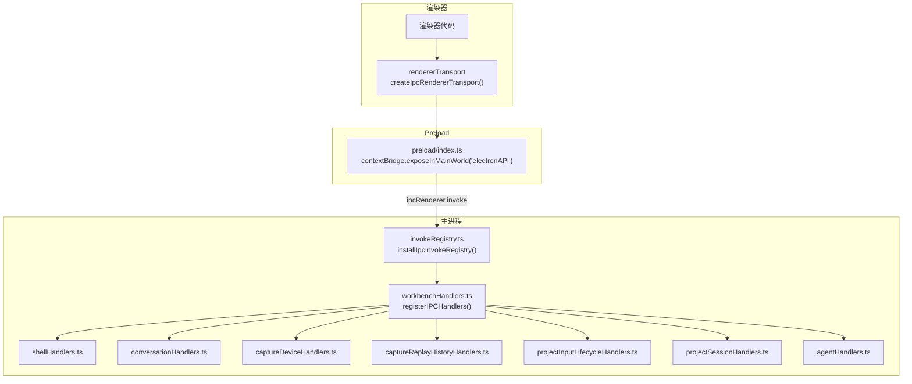
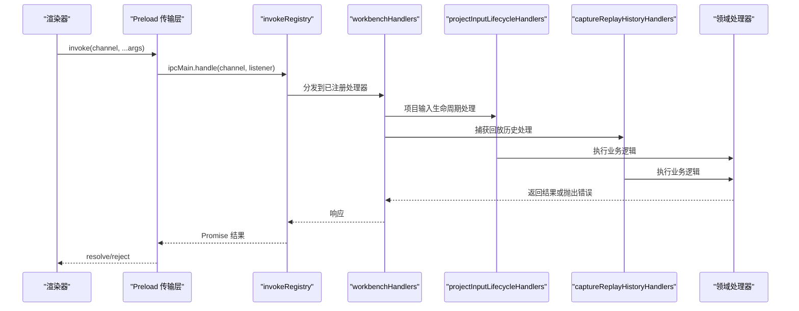
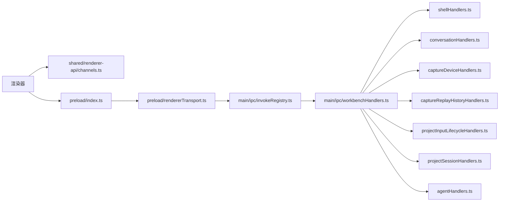

# IPC 接口

<cite>
**本文引用的文件**
- [src/main/ipc/README.md](file://src/main/ipc/README.md)
- [src/preload/index.ts](file://src/preload/index.ts)
- [src/preload/rendererTransport.ts](file://src/preload/rendererTransport.ts)
- [src/shared/renderer-api/channels.ts](file://src/shared/renderer-api/channels.ts)
- [src/shared/renderer-api/index.ts](file://src/shared/renderer-api/index.ts)
- [src/main/ipc/invokeRegistry.ts](file://src/main/ipc/invokeRegistry.ts)
- [src/main/ipc/workbenchHandlers.ts](file://src/main/ipc/workbenchHandlers.ts)
- [src/main/ipc/handlers.ts](file://src/main/ipc/handlers.ts)
- [src/main/ipc/shellHandlers.ts](file://src/main/ipc/shellHandlers.ts)
- [src/main/ipc/conversationHandlers.ts](file://src/main/ipc/conversationHandlers.ts)
- [src/main/ipc/captureDeviceHandlers.ts](file://src/main/ipc/captureDeviceHandlers.ts)
- [src/main/ipc/captureReplayHistoryHandlers.ts](file://src/main/ipc/captureReplayHistoryHandlers.ts)
- [src/main/ipc/projectInputLifecycleHandlers.ts](file://src/main/ipc/projectInputLifecycleHandlers.ts)
- [src/main/ipc/projectSessionHandlers.ts](file://src/main/ipc/projectSessionHandlers.ts)
- [src/main/ipc/agentHandlers.ts](file://src/main/ipc/agentHandlers.ts)
- [src/main/ipc/validation/IpcPayloadGuard.ts](file://src/main/ipc/validation/IpcPayloadGuard.ts)
- [src/main/ipc/validation/commonIpcSchemas.ts](file://src/main/ipc/validation/commonIpcSchemas.ts)
- [src/main/ipc/validation/projectSessionSchemas.ts](file://src/main/ipc/validation/projectSessionSchemas.ts)
- [src/main/ipc/validation/captureDeviceSchemas.ts](file://src/main/ipc/validation/captureDeviceSchemas.ts)
</cite>

## 更新摘要
**变更内容**
- 新增项目输入生命周期处理器，支持项目抓帧的删除准备、确认与执行流程
- 新增捕获回放历史处理器，提供回放选择、历史记录查询、图片读取和历史清理功能
- 扩展通道定义，在项目和设备领域新增多个 IPC 通道
- 增强事件系统，新增项目输入变更和错误事件广播
- 完善权限控制，引入审批令牌机制确保操作安全性

## 目录
1. [简介](#简介)
2. [项目结构](#项目结构)
3. [核心组件](#核心组件)
4. [架构总览](#架构总览)
5. [详细组件分析](#详细组件分析)
6. [依赖关系分析](#依赖关系分析)
7. [性能考虑](#性能考虑)
8. [故障排查指南](#故障排查指南)
9. [结论](#结论)
10. [附录：IPC 通道清单与调用示例](#附录ipc-通道清单与调用示例)

## 简介
本文件系统性记录 RDC-Agent 主进程与渲染器之间的 IPC 通信协议，覆盖消息格式、事件类型、参数校验与错误处理机制。文档聚焦于每个 IPC 通道的用途、调用方式、数据结构与响应格式，并给出安全考虑、权限控制与最佳实践，以及完整的 API 调用示例与错误处理模式。

**更新** 本次更新新增了项目输入生命周期管理和捕获回放历史管理功能，增强了项目的抓帧管理能力。

## 项目结构
RDC-Agent 的 IPC 边界由 Preload 脚本暴露给渲染器的 API 封装，通过统一的 Transport 层使用 ipcRenderer.invoke 与 ipcMain.handle 进行请求-响应式调用；同时通过事件通道实现主进程到渲染器的推送。所有可调用通道在共享模块中集中声明，主进程侧按领域拆分处理器注册，并在启动时完成装配与一致性校验。

**图表来源**
- [src/preload/rendererTransport.ts:9-44](file://src/preload/rendererTransport.ts#L9-L44)
- [src/preload/index.ts:8-15](file://src/preload/index.ts#L8-L15)
- [src/main/ipc/invokeRegistry.ts:9-39](file://src/main/ipc/invokeRegistry.ts#L9-L39)
- [src/main/ipc/workbenchHandlers.ts:259-281](file://src/main/ipc/workbenchHandlers.ts#L259-L281)
- [src/main/ipc/captureDeviceHandlers.ts:27-29](file://src/main/ipc/captureDeviceHandlers.ts#L27-L29)
- [src/main/ipc/projectSessionHandlers.ts:68-70](file://src/main/ipc/projectSessionHandlers.ts#L68-L70)

**章节来源**
- [src/main/ipc/README.md:1-10](file://src/main/ipc/README.md#L1-L10)
- [src/shared/renderer-api/channels.ts:1-255](file://src/shared/renderer-api/channels.ts#L1-L255)
- [src/main/ipc/workbenchHandlers.ts:259-281](file://src/main/ipc/workbenchHandlers.ts#L259-L281)

## 核心组件
- 渲染器传输层（rendererTransport）：封装 ipcRenderer.invoke 与事件订阅/取消订阅，提供统一调用与监听能力。
- 预加载桥接（preload/index.ts）：将 Electron API 与渲染器 API 绑定到全局对象，仅暴露最小必要能力。
- 通道清单（shared/renderer-api/channels.ts）：集中声明所有 invoke 与 event 通道名，供两端类型与校验使用。
- 主进程注册中心（invokeRegistry.ts）：拦截 ipcMain.handle 以维护已注册通道集合，并提供运行时一致性断言。
- 工作区装配（workbenchHandlers.ts）：初始化状态、注册各域处理器、广播事件、主题切换等。
- 领域处理器：shell、conversation、capture/device、agent、project input lifecycle、capture replay history 等，各自负责具体业务逻辑与数据持久化。
- 参数校验（validation/IpcPayloadGuard.ts + commonIpcSchemas.ts）：基于 Zod 的强类型校验、大小限制、ID 白名单与数组长度限制。

**更新** 新增项目输入生命周期处理器和捕获回放历史处理器，提供更完善的抓帧管理能力。

**章节来源**
- [src/preload/rendererTransport.ts:9-44](file://src/preload/rendererTransport.ts#L9-L44)
- [src/preload/index.ts:8-15](file://src/preload/index.ts#L8-L15)
- [src/shared/renderer-api/channels.ts:1-255](file://src/shared/renderer-api/channels.ts#L1-L255)
- [src/main/ipc/invokeRegistry.ts:9-51](file://src/main/ipc/invokeRegistry.ts#L9-L51)
- [src/main/ipc/workbenchHandlers.ts:52-77, 259-281:52-77](file://src/main/ipc/workbenchHandlers.ts#L52-L77)
- [src/main/ipc/validation/IpcPayloadGuard.ts:1-88](file://src/main/ipc/validation/IpcPayloadGuard.ts#L1-L88)
- [src/main/ipc/validation/commonIpcSchemas.ts:1-35](file://src/main/ipc/validation/commonIpcSchemas.ts#L1-L35)

## 架构总览
渲染器通过 preload 暴露的 electronAPI 发起调用，底层走 ipcRenderer.invoke；主进程通过 installIpcInvokeRegistry 拦截 handle 并路由到对应领域处理器。所有通道名在共享模块中声明，保证两端一致。主进程还通过事件通道向渲染器推送状态变更与工具执行结果等。

**图表来源**
- [src/preload/rendererTransport.ts:29-33](file://src/preload/rendererTransport.ts#L29-L33)
- [src/main/ipc/invokeRegistry.ts:14-39](file://src/main/ipc/invokeRegistry.ts#L14-L39)
- [src/main/ipc/workbenchHandlers.ts:259-281](file://src/main/ipc/workbenchHandlers.ts#L259-L281)
- [src/main/ipc/projectInputLifecycleHandlers.ts:40-65](file://src/main/ipc/projectInputLifecycleHandlers.ts#L40-L65)
- [src/main/ipc/captureReplayHistoryHandlers.ts:17-35](file://src/main/ipc/captureReplayHistoryHandlers.ts#L17-L35)

## 详细组件分析

### 预加载与渲染器传输层
- 职责：在 sandbox 环境下仅暴露 contextBridge 与 ipcRenderer，避免直接访问 Node 模块；提供 invoke 与 subscribe/unsubscribe 的统一抽象。
- 关键点：
  - 事件监听映射表用于正确移除监听器，防止内存泄漏。
  - 所有事件回调对原始 event 进行解包，仅传递业务参数。
  - 通过 createRendererApi 组合平台能力与传输层。

**章节来源**
- [src/preload/index.ts:8-15](file://src/preload/index.ts#L8-L15)
- [src/preload/rendererTransport.ts:9-44](file://src/preload/rendererTransport.ts#L9-L44)
- [src/shared/renderer-api/index.ts:1-18](file://src/shared/renderer-api/index.ts#L1-L18)

### 通道清单与类型
- 职责：集中定义所有 invoke 与 event 通道名，导出类型与判定函数，确保两端类型一致。
- 关键点：
  - 按领域分组（shell、conversation、workflow、agent、memory、investigation、knowledge、rdxRuntime、command、tools、llm、settings、project、device、session、run、runtime、capture、context、trace）。
  - 提供 isRendererInvokeChannel/isRendererEventChannel 用于运行时类型守卫。
  - 导出 RENDERER_INVOKE_CHANNELS/RENDERER_EVENT_CHANNELS 用于一致性检查。

**更新** 新增项目输入相关通道（prepareRemoveInput、removeInput）和捕获回放历史通道（getReplaySelection、listReplayHistory、readReplayImage、clearReplayHistory）。

**章节来源**
- [src/shared/renderer-api/channels.ts:1-255](file://src/shared/renderer-api/channels.ts#L1-L255)

### 主进程注册中心
- 职责：拦截 ipcMain.handle，维护已注册通道集合，提供查询与一致性断言。
- 关键点：
  - 安装一次后不再重复安装。
  - 为未注册的通道调用提供明确错误信息。
  - assertRendererIpcParity 在启动时检查缺失处理器。

**章节来源**
- [src/main/ipc/invokeRegistry.ts:9-51](file://src/main/ipc/invokeRegistry.ts#L9-L51)

### 工作区装配与上下文
- 职责：初始化 IPC 状态、恢复中断运行、注册所有领域处理器、广播主题变化、工具执行追踪等。
- 关键点：
  - initializeIpcState 从存储恢复当前 session/project/run。
  - registerIPCHandlers 顺序注册各域处理器并执行一致性断言。
  - broadcastToRenderer 统一向所有窗口与事件中心广播事件。

**更新** 新增项目输入生命周期处理器和捕获回放历史处理器的注册。

**章节来源**
- [src/main/ipc/workbenchHandlers.ts:52-77, 190-281:52-77](file://src/main/ipc/workbenchHandlers.ts#L52-L77)
- [src/main/ipc/workbenchHandlers.ts:259-281](file://src/main/ipc/workbenchHandlers.ts#L259-L281)
- [src/main/ipc/handlers.ts:1-7](file://src/main/ipc/handlers.ts#L1-L7)

### 项目输入生命周期处理器
- 职责：管理项目抓帧的生命周期，包括删除准备、确认对话框、授权令牌验证和实际删除操作。
- 关键通道：
  - project:inputs:prepareRemove：准备删除操作，显示确认对话框，生成审批令牌
  - project:inputs:remove：执行删除操作，需要有效的审批令牌
- 行为要点：
  - 删除前显示确认对话框，列出关联会话和影响范围
  - 使用 ipcApprovalTokenService 进行权限验证
  - 文件监控自动检测 .rdx/inputs 目录变化并刷新
  - 错误处理和日志记录完善

**新增** 这是全新的项目输入管理功能，提供了安全的抓帧删除流程。

**章节来源**
- [src/main/ipc/projectInputLifecycleHandlers.ts:14-117](file://src/main/ipc/projectInputLifecycleHandlers.ts#L14-L117)

### 捕获回放历史处理器
- 职责：管理捕获回放的历史记录，包括选择保存、历史列表查询、图片读取和历史清理。
- 关键通道：
  - capture:getReplaySelection：获取当前回放选择
  - capture:listReplayHistory：列出回放历史记录，支持分页
  - capture:readReplayImage：读取回放截图，返回 base64 编码
  - capture:clearReplayHistory：清理指定捕获的回放历史
- 行为要点：
  - 严格的会话和项目权限验证
  - 支持分页查询，默认限制 200 条记录
  - 图片以 base64 格式返回，便于前端直接显示
  - 清理操作会删除相关的回放足迹

**新增** 这是全新的回放历史管理功能，支持用户查看和管理回放历史。

**章节来源**
- [src/main/ipc/captureReplayHistoryHandlers.ts:1-36](file://src/main/ipc/captureReplayHistoryHandlers.ts#L1-L36)

### Shell 领域处理器
- 通道概览：app:getMeta、dialog:selectFiles、dialog:selectDirectory、dialog:selectRdcFiles、window:minimize、window:toggleMaximize、window:close、window:isMaximized、app:openPath、app:copyText、app:readClipboardText、app:selectAvatar、app:getAvatarDataUrl。
- 行为要点：
  - 所有入口均通过 parseIpcArgs 校验参数，空参使用 EmptyArgsSchema。
  - 文件选择对话框限定扩展名与多选能力。
  - 头像导入会复制到工作区并返回 data URL。
  - 路径打开优先尝试 shell.openPath，失败回退到 showItemInFolder。

**章节来源**
- [src/main/ipc/shellHandlers.ts:69-207](file://src/main/ipc/shellHandlers.ts#L69-L207)

### 对话领域处理器
- 通道概览：conversation:sendMessage、conversation:rewriteFromMessage、conversation:getHistory、conversation:switchBranch、conversation:clearHistory、conversation:undoLastTurn、conversation:cancelActiveTurn、conversation:answerUserInput、conversation:answerToolApproval、conversation:getToolImagePreview、conversation:stageAttachments、conversation:releaseAttachments、conversation:getAttachmentPreview。
- 行为要点：
  - 发送消息会更新当前 project/session/run 状态并持久化。
  - 图片预览受会话隔离与范围限制，越权返回特定错误码。
  - 附件暂存与释放通过 AttachmentStagingService 管理生命周期。

**章节来源**
- [src/main/ipc/conversationHandlers.ts:39-240](file://src/main/ipc/conversationHandlers.ts#L39-L240)

### 捕获与设备领域处理器
- 通道概览：context:get、context:openHumanPreview、context:closeHumanPreview、capture:list、capture:openProjectInput、capture:getOpenedState、capture:clearOpenedState、capture:select、device:list、device:refresh、device:activate、device:watch:start、device:watch:renew、device:watch:stop。
- 行为要点：
  - 上下文快照与打开状态变更会通过事件通道广播。
  - 打开项目输入需校验 session 归属与 replay device 有效性。
  - 设备监控支持 start/renew/stop 生命周期管理。

**更新** 新增捕获回放历史相关通道，集成到现有捕获设备处理器中。

**章节来源**
- [src/main/ipc/captureDeviceHandlers.ts:25-232](file://src/main/ipc/captureDeviceHandlers.ts#L25-L232)

### Agent 领域处理器
- 通道概览：agent:sendMessage、agent:getState、agent:getAllStates、agent:configure。
- 行为要点：
  - sendMessage 携带 agentId 与内容，自动注入 runContext（caseId/runId/sessionId/projectId/projectRootPath），并支持中止信号。
  - getState/getAllStates 读取代理状态。
  - configure 设置代理配置，失败返回结构化错误。

**章节来源**
- [src/main/ipc/agentHandlers.ts:14-88](file://src/main/ipc/agentHandlers.ts#L14-L88)

### 参数校验与错误模型
- 校验机制：
  - parseIpcArgs 强制使用 Zod schema 校验，支持 maxBytes、padTo、label。
  - 字符串与 ID 使用受限正则与长度限制，拒绝路径穿越字符。
  - 数组限制项数与单项长度。
- 错误模型：
  - IpcValidationError 包含 code=IPC_VALIDATION_ERROR，便于上层统一处理。
  - 各处理器 catch 后将错误转为结构化响应字段（如 error、success=false）。

**更新** 新增项目输入和捕获回放历史的专用校验模式。

**章节来源**
- [src/main/ipc/validation/IpcPayloadGuard.ts:1-88](file://src/main/ipc/validation/IpcPayloadGuard.ts#L1-L88)
- [src/main/ipc/validation/commonIpcSchemas.ts:1-35](file://src/main/ipc/validation/commonIpcSchemas.ts#L1-L35)
- [src/main/ipc/validation/projectSessionSchemas.ts:1-62](file://src/main/ipc/validation/projectSessionSchemas.ts#L1-L62)
- [src/main/ipc/validation/captureDeviceSchemas.ts:1-35](file://src/main/ipc/validation/captureDeviceSchemas.ts#L1-L35)

## 依赖关系分析
- 渲染器依赖 shared/renderer-api 中的通道常量与类型。
- Preload 依赖 electron 的 contextBridge 与 ipcRenderer。
- 主进程 workbenchHandlers 聚合各域处理器，并通过 invokeRegistry 维护通道注册。
- 各域处理器依赖存储服务、会话服务、运行时日志服务等。

**更新** 新增项目输入生命周期处理器和捕获回放历史处理器作为独立模块，通过工作区处理器统一注册。

**图表来源**
- [src/shared/renderer-api/channels.ts:1-255](file://src/shared/renderer-api/channels.ts#L1-L255)
- [src/preload/index.ts:8-15](file://src/preload/index.ts#L8-L15)
- [src/preload/rendererTransport.ts:9-44](file://src/preload/rendererTransport.ts#L9-L44)
- [src/main/ipc/invokeRegistry.ts:9-51](file://src/main/ipc/invokeRegistry.ts#L9-L51)
- [src/main/ipc/workbenchHandlers.ts:259-281](file://src/main/ipc/workbenchHandlers.ts#L259-L281)
- [src/main/ipc/captureDeviceHandlers.ts:27-29](file://src/main/ipc/captureDeviceHandlers.ts#L27-L29)
- [src/main/ipc/projectSessionHandlers.ts:68-70](file://src/main/ipc/projectSessionHandlers.ts#L68-L70)

## 性能考虑
- 参数大小限制：通过 parseIpcArgs 的 maxBytes 限制 JSON 序列化后的字节长度，避免大消息阻塞事件循环。
- 事件广播：主进程通过统一广播方法向所有窗口推送事件，注意控制事件频率与负载。
- 资源生命周期：附件暂存与会话隔离减少不必要的数据拷贝与跨会话访问。
- 一致性检查：启动时断言通道完整性，尽早发现遗漏处理器导致的运行时异常。
- 文件监控：项目输入文件变化使用防抖机制，避免频繁刷新。

**更新** 新增文件监控和防抖机制，优化项目输入变化的处理性能。

## 故障排查指南
- 常见错误类型：
  - 参数校验失败：IpcValidationError，包含字段路径与问题描述，建议检查传入结构与长度限制。
  - 通道未注册：assertRendererIpcParity 或 invokeRegisteredIpcChannel 抛出缺失处理器错误，需补充注册。
  - 会话越权：图片预览等敏感操作返回特定错误码（如 IMAGE_PREVIEW_SESSION_DENIED），需确认当前会话上下文。
  - 权限验证失败：项目输入删除需要有效的审批令牌，令牌过期或无效会导致操作失败。
- 定位步骤：
  - 查看调用栈与错误 message，定位具体通道与参数。
  - 检查 shared/renderer-api/channels.ts 是否包含该通道。
  - 核对领域处理器是否已注册且参数 schema 匹配。
  - 对于事件类问题，检查主进程广播事件是否触发。

**更新** 新增项目输入删除权限验证和审批令牌相关的故障排查指导。

**章节来源**
- [src/main/ipc/validation/IpcPayloadGuard.ts:7-14, 26-57:7-14](file://src/main/ipc/validation/IpcPayloadGuard.ts#L7-L14)
- [src/main/ipc/invokeRegistry.ts:32-51](file://src/main/ipc/invokeRegistry.ts#L32-L51)
- [src/main/ipc/conversationHandlers.ts:180-239](file://src/main/ipc/conversationHandlers.ts#L180-L239)
- [src/main/ipc/projectInputLifecycleHandlers.ts:43-63](file://src/main/ipc/projectInputLifecycleHandlers.ts#L43-L63)

## 结论
RDC-Agent 的 IPC 体系通过共享通道清单、严格的参数校验与清晰的领域划分，实现了稳定、可扩展的主进程-渲染器通信。Preload 层最小化暴露能力，invokeRegistry 保障通道一致性，workbenchHandlers 作为装配中心统一管理生命周期与事件广播。新增的项目输入生命周期管理和捕获回放历史管理功能进一步增强了系统的抓帧管理能力。遵循本文的安全与最佳实践可有效降低风险并提升可维护性。

**更新** 新增的功能提供了更完善的抓帧生命周期管理和回放历史管理能力，提升了用户体验。

## 附录：IPC 通道清单与调用示例

### 通道清单（按领域）
- Shell：app:getMeta、dialog:selectFiles、dialog:selectDirectory、dialog:selectRdcFiles、window:minimize、window:toggleMaximize、window:close、window:isMaximized、app:openPath、app:copyText、app:readClipboardText、app:selectAvatar、app:getAvatarDataUrl
- Conversation：conversation:sendMessage、conversation:rewriteFromMessage、conversation:getHistory、conversation:switchBranch、conversation:clearHistory、conversation:undoLastTurn、conversation:cancelActiveTurn、conversation:answerUserInput、conversation:answerToolApproval、conversation:getToolImagePreview、conversation:stageAttachments、conversation:releaseAttachments、conversation:getAttachmentPreview
- Capture/Device：context:get、context:openHumanPreview、context:closeHumanPreview、capture:list、capture:openProjectInput、capture:getOpenedState、capture:clearOpenedState、capture:select、capture:getReplaySelection、capture:listReplayHistory、capture:readReplayImage、capture:clearReplayHistory、capture:getReplayState、capture:applyReplayEvent、capture:refreshFrame、device:list、device:refresh、device:activate、device:watch:start、device:watch:renew、device:watch:stop
- Project Input Lifecycle：project:inputs:prepareRemove、project:inputs:remove
- Agent：agent:sendMessage、agent:getState、agent:getAllStates、agent:configure
- 其他：workflow、memory、investigation、knowledge、rdxRuntime、command、tools、llm、settings、project、session、run、runtime、trace（详见 shared/renderer-api/channels.ts）

**更新** 新增项目输入生命周期通道和捕获回放历史通道。

**章节来源**
- [src/shared/renderer-api/channels.ts:1-255](file://src/shared/renderer-api/channels.ts#L1-L255)

### 调用示例与响应格式（说明性）
- 发送对话消息
  - 调用：invoke('conversation:sendMessage', request)
  - 请求体：ConversationSendRequest（含 requestId、sessionId、content 等）
  - 响应：ConversationSendResult（status='accepted'、requestId、turn、preparedContext）
  - 参考：[conversationHandlers.ts:43-78](file://src/main/ipc/conversationHandlers.ts#L43-L78)

- 获取会话历史
  - 调用：invoke('conversation:getHistory', sessionId)
  - 响应：{ messages, branchState }
  - 参考：[conversationHandlers.ts:106-115](file://src/main/ipc/conversationHandlers.ts#L106-L115)

- 打开项目输入
  - 调用：invoke('capture:openProjectInput', { projectId, sessionId, inputId, filePath, replayDeviceId })
  - 响应：{ success, openedCapture, contextSnapshot } 或 { success: false, error }
  - 参考：[captureDeviceHandlers.ts:91-161](file://src/main/ipc/captureDeviceHandlers.ts#L91-L161)

- 选择捕获
  - 调用：invoke('capture:select', { projectId, sessionId, captureId })
  - 响应：{ success }
  - 参考：[captureDeviceHandlers.ts:186-201](file://src/main/ipc/captureDeviceHandlers.ts#L186-L201)

- 发送 Agent 消息
  - 调用：invoke('agent:sendMessage', [agentId, content])
  - 响应：{ response } 或 { response: undefined, error }
  - 参考：[agentHandlers.ts:17-57](file://src/main/ipc/agentHandlers.ts#L17-L57)

- 应用元信息
  - 调用：invoke('app:getMeta')
  - 响应：{ version, productName, systemTheme, testMode }
  - 参考：[shellHandlers.ts:124-132](file://src/main/ipc/shellHandlers.ts#L124-L132)

- **新增** 准备删除项目输入
  - 调用：invoke('project:inputs:prepareRemove', { projectId, inputId })
  - 响应：{ success: true, approvalToken, input, affectedSessionIds } 或 { success: false }
  - 参考：[projectInputLifecycleHandlers.ts:43-52](file://src/main/ipc/projectInputLifecycleHandlers.ts#L43-L52)

- **新增** 执行删除项目输入
  - 调用：invoke('project:inputs:remove', { projectId, inputId, approvalToken })
  - 响应：{ success, inputs, fileDeleted } 或 { success: false, inputs: [], error }
  - 参考：[projectInputLifecycleHandlers.ts:53-63](file://src/main/ipc/projectInputLifecycleHandlers.ts#L53-L63)

- **新增** 获取回放选择
  - 调用：invoke('capture:getReplaySelection', { projectId, sessionId })
  - 响应：回放选择信息或 null
  - 参考：[captureReplayHistoryHandlers.ts:18-21](file://src/main/ipc/captureReplayHistoryHandlers.ts#L18-L21)

- **新增** 列出回放历史
  - 调用：invoke('capture:listReplayHistory', { projectId, sessionId, captureHash, afterSequence, limit })
  - 响应：回放历史记录列表
  - 参考：[captureReplayHistoryHandlers.ts:22-25](file://src/main/ipc/captureReplayHistoryHandlers.ts#L22-L25)

- **新增** 读取回放图片
  - 调用：invoke('capture:readReplayImage', { projectId, sessionId, captureHash, imageHash })
  - 响应：base64 编码的图片数据
  - 参考：[captureReplayHistoryHandlers.ts:26-30](file://src/main/ipc/captureReplayHistoryHandlers.ts#L26-L30)

- **新增** 清理回放历史
  - 调用：invoke('capture:clearReplayHistory', { projectId, sessionId, captureHash })
  - 响应：清理结果
  - 参考：[captureReplayHistoryHandlers.ts:31-34](file://src/main/ipc/captureReplayHistoryHandlers.ts#L31-L34)

### 事件类型（主进程→渲染器）
- 工作流：workflow:stateChanged、workflow:runStatusChanged、workflow:runUsageChanged、workflow:blocked、trace:projectionChanged
- 对话：conversation:event
- 工具：tool:executionComplete、evidence:eventAdded
- 设备/捕获：device:statusChanged、capture:statusChanged、context:changed、project:inputsChanged、project:inputsError、capture:openedStateChanged、capture:replayChanged
- 运行时：runtime:logAppended
- 应用：app:themeChanged、file:open、case:new、settings:open、window:maximized-changed

**更新** 新增项目输入变更和错误事件，以及捕获回放状态变更事件。

**章节来源**
- [src/shared/renderer-api/channels.ts:187-229](file://src/shared/renderer-api/channels.ts#L187-L229)
- [src/main/ipc/workbenchHandlers.ts:79-106, 248-257:79-106](file://src/main/ipc/workbenchHandlers.ts#L79-L106)
- [src/main/ipc/projectInputLifecycleHandlers.ts:41-42, 77, 85:41-42](file://src/main/ipc/projectInputLifecycleHandlers.ts#L41-L42)

### 安全与权限控制
- 参数校验：所有入口必须通过 parseIpcArgs 校验，禁止绕过。
- 大小限制：maxBytes 限制消息体积，避免滥用。
- 会话隔离：图片预览等敏感操作需校验当前会话上下文，越权返回特定错误码。
- 路径安全：ID 与路径使用严格正则与长度限制，拒绝路径穿越。
- 最小暴露：Preload 仅暴露必要能力，避免直接访问 Node 模块。
- **新增** 审批令牌机制：项目输入删除操作需要两步验证，先准备再执行，确保用户明确确认。

**更新** 新增审批令牌机制，增强项目输入删除操作的安全性。

**章节来源**
- [src/main/ipc/validation/IpcPayloadGuard.ts:26-88](file://src/main/ipc/validation/IpcPayloadGuard.ts#L26-L88)
- [src/main/ipc/conversationHandlers.ts:180-239](file://src/main/ipc/conversationHandlers.ts#L180-L239)
- [src/preload/index.ts:1-26](file://src/preload/index.ts#L1-L26)
- [src/main/ipc/projectInputLifecycleHandlers.ts:48-58](file://src/main/ipc/projectInputLifecycleHandlers.ts#L48-L58)

### 最佳实践
- 新增 IPC：先在 shared/renderer-api/channels.ts 登记通道，再同步 preload、shared types 与浏览器 fallback。
- 处理器注册：在 workbenchHandlers.registerIPCHandlers 中按领域注册，保持单一职责。
- 错误处理：统一返回结构化错误字段，便于前端展示与重试。
- 事件广播：控制事件频率，避免频繁刷新 UI。
- 一致性检查：启动时调用 assertRendererIpcParity 确保通道完整。
- **新增** 文件监控：使用防抖机制处理文件变化，避免频繁刷新。
- **新增** 权限验证：敏感操作使用审批令牌机制，确保用户明确确认。

**更新** 新增文件监控和权限验证的最佳实践指导。

**章节来源**
- [src/main/ipc/README.md:1-10](file://src/main/ipc/README.md#L1-L10)
- [src/main/ipc/workbenchHandlers.ts:259-281](file://src/main/ipc/workbenchHandlers.ts#L259-L281)
- [src/main/ipc/invokeRegistry.ts:45-51](file://src/main/ipc/invokeRegistry.ts#L45-L51)
- [src/main/ipc/projectInputLifecycleHandlers.ts:67-116](file://src/main/ipc/projectInputLifecycleHandlers.ts#L67-L116)