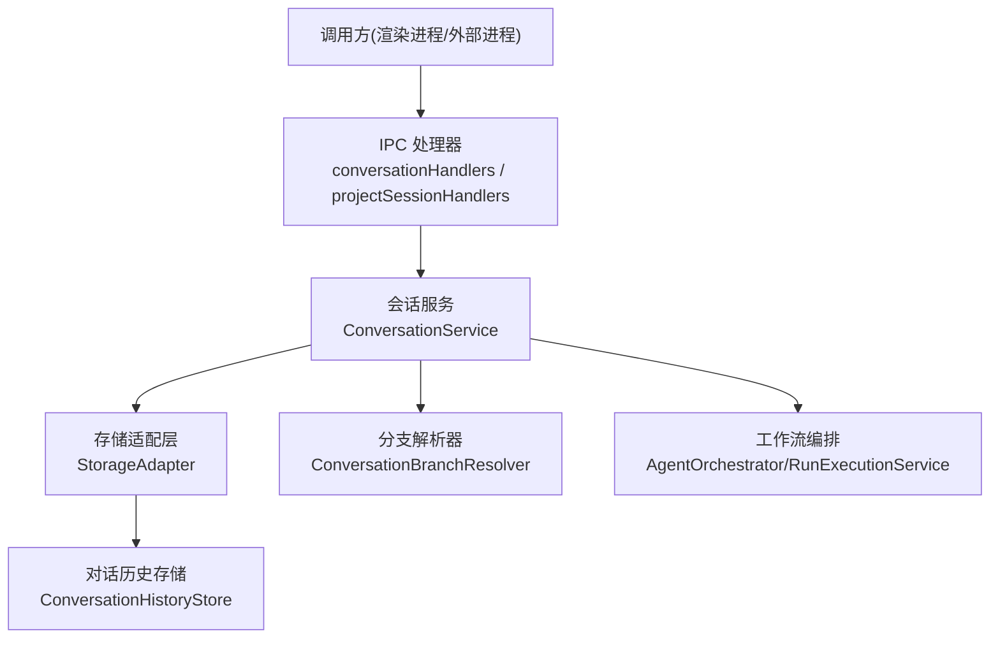
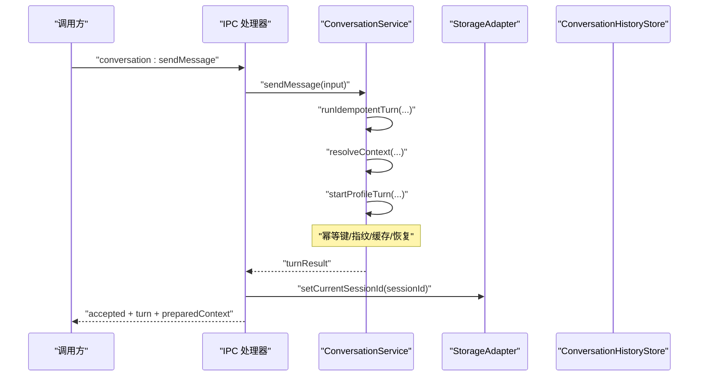
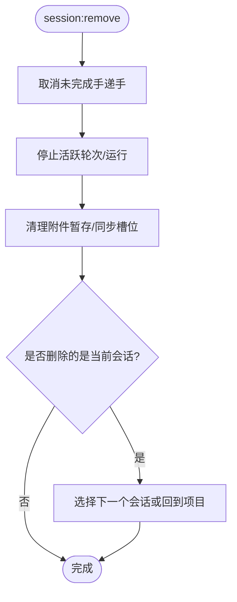
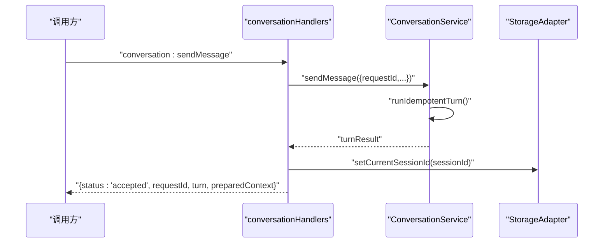
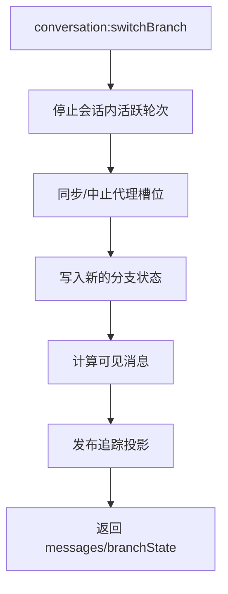
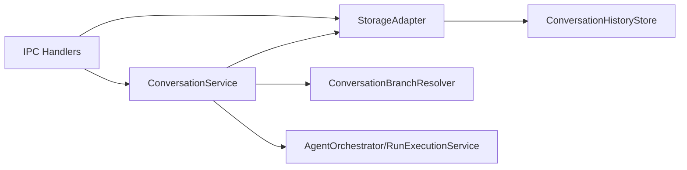

# 会话管理 API

<cite>
**本文引用的文件**
- [conversationHandlers.ts](file://src/main/ipc/conversationHandlers.ts)
- [projectSessionHandlers.ts](file://src/main/ipc/projectSessionHandlers.ts)
- [ConversationService.ts](file://src/main/conversation/ConversationService.ts)
- [StorageAdapter.ts](file://src/main/sessions/StorageAdapter.ts)
- [ConversationHistoryStore.ts](file://src/main/sessions/ConversationHistoryStore.ts)
- [conversationSchemas.ts](file://src/main/ipc/validation/conversationSchemas.ts)
- [projectSessionSchemas.ts](file://src/main/ipc/validation/projectSessionSchemas.ts)
- [ConversationBranchResolver.ts](file://src/main/conversation/ConversationBranchResolver.ts)
</cite>

## 目录
1. [简介](#简介)
2. [项目结构](#项目结构)
3. [核心组件](#核心组件)
4. [架构总览](#架构总览)
5. [详细组件分析](#详细组件分析)
6. [依赖关系分析](#依赖关系分析)
7. [性能与并发特性](#性能与并发特性)
8. [故障排查指南](#故障排查指南)
9. [结论](#结论)
10. [附录：API 规范与调用示例](#附录api-规范与调用示例)

## 简介
本文件面向主进程 IPC 层，系统化记录会话管理的接口规范与实现要点，覆盖会话创建、销毁、切换、历史管理与分支操作；说明消息发送/接收流程、会话状态同步、持久化与恢复机制、以及并发控制策略。文档同时提供调用示例与错误处理模式，帮助前端或外部进程通过 IPC 安全、可靠地操控会话。

## 项目结构
会话管理相关代码主要分布在以下模块：
- IPC 注册与参数校验：ipc 目录下的 handlers 与 validation schemas
- 会话业务编排：conversation 目录下的 ConversationService
- 存储与持久化：sessions 目录下的 StorageAdapter 及 ConversationHistoryStore
- 分支逻辑：conversation 目录下的 ConversationBranchResolver（共享实现）

图表来源
- [conversationHandlers.ts:39-241](file://src/main/ipc/conversationHandlers.ts#L39-L241)
- [projectSessionHandlers.ts:66-403](file://src/main/ipc/projectSessionHandlers.ts#L66-L403)
- [ConversationService.ts:78-800](file://src/main/conversation/ConversationService.ts#L78-L800)
- [StorageAdapter.ts:41-459](file://src/main/sessions/StorageAdapter.ts#L41-L459)
- [ConversationHistoryStore.ts:33-796](file://src/main/sessions/ConversationHistoryStore.ts#L33-L796)
- [ConversationBranchResolver.ts:1-16](file://src/main/conversation/ConversationBranchResolver.ts#L1-L16)

章节来源
- [conversationHandlers.ts:39-241](file://src/main/ipc/conversationHandlers.ts#L39-L241)
- [projectSessionHandlers.ts:66-403](file://src/main/ipc/projectSessionHandlers.ts#L66-L403)

## 核心组件
- IPC 处理器
  - conversationHandlers：暴露会话消息、历史、分支、附件预览等能力
  - projectSessionHandlers：暴露项目与会话的 CRUD、选择、运行列表等能力
- 会话服务 ConversationService
  - 统一编排发送消息、重写消息、取消进行中的轮次、回答用户输入/工具审批、切换分支等
  - 负责幂等性、请求指纹、后台续跑、上下文准备、追踪发布
- 存储适配层 StorageAdapter
  - 统一管理项目、会话、运行、上下文、手递手状态、附件等持久化路径与读写
  - 维护当前项目/会话选择、会话上下文日志、使用统计等
- 对话历史存储 ConversationHistoryStore
  - JSONL 追加与压缩、增量 delta、原子写入、提交/回滚日志、崩溃恢复
  - 分支状态持久化、附件清单管理
- 分支解析 ConversationBranchResolver
  - 可见消息计算、分支导航、修复分支状态、默认分支构建

章节来源
- [ConversationService.ts:78-800](file://src/main/conversation/ConversationService.ts#L78-L800)
- [StorageAdapter.ts:41-459](file://src/main/sessions/StorageAdapter.ts#L41-L459)
- [ConversationHistoryStore.ts:33-796](file://src/main/sessions/ConversationHistoryStore.ts#L33-L796)
- [ConversationBranchResolver.ts:1-16](file://src/main/conversation/ConversationBranchResolver.ts#L1-L16)

## 架构总览
IPC 层仅做参数校验与路由转发，真正的会话生命周期与一致性由 ConversationService 与 StorageAdapter 保障。会话历史采用 JSONL 追加 + delta 压缩，分支状态独立文件，提交过程通过 journal 保证原子性与可恢复。

图表来源
- [conversationHandlers.ts:43-78](file://src/main/ipc/conversationHandlers.ts#L43-L78)
- [ConversationService.ts:545-568](file://src/main/conversation/ConversationService.ts#L545-L568)
- [StorageAdapter.ts:437-446](file://src/main/sessions/StorageAdapter.ts#L437-L446)

## 详细组件分析

### 会话创建、选择与删除
- 创建会话
  - IPC：session:create
  - 行为：创建会话记录，设置当前项目/会话，持久化当前会话选择
  - 返回：成功标志与会话对象
- 选择会话
  - IPC：session:select
  - 行为：校验存在性，更新当前项目/会话/运行，恢复可能停滞的运行状态
  - 返回：会话与当前运行摘要
- 删除会话
  - IPC：session:remove
  - 行为：取消未完成的手递手、停止活跃轮次、停止并标记运行、清理附件暂存、同步代理槽位、重置当前选择为下一个会话或项目
  - 返回：成功标志与下一个会话/运行

图表来源
- [projectSessionHandlers.ts:254-307](file://src/main/ipc/projectSessionHandlers.ts#L254-L307)

章节来源
- [projectSessionHandlers.ts:214-333](file://src/main/ipc/projectSessionHandlers.ts#L214-L333)
- [projectSessionHandlers.ts:254-307](file://src/main/ipc/projectSessionHandlers.ts#L254-L307)

### 消息发送与接收流程
- 发送消息
  - IPC：conversation:sendMessage
  - 参数：requestId、projectId/sessionId/currentRunId、message、attachments、turnControls、configurationCommit 等
  - 行为：进入幂等执行，计算请求指纹，查找已持久化的相同请求结果，否则启动一轮对话；成功后更新当前会话/运行并持久化选择
  - 返回：accepted 结果包含 turn、preparedContext
- 从消息重写
  - IPC：conversation:rewriteFromMessage
  - 行为：定位目标用户消息，终止下游轮次，建立新分支并重新发起
- 获取历史
  - IPC：conversation:getHistory
  - 行为：读取完整历史与分支状态，必要时修复委托交互请求
- 取消活跃轮次
  - IPC：conversation:cancelActiveTurn
  - 行为：中止正在准备或运行的轮次，清理后台续跑与代理资源
- 回答用户输入/工具审批
  - IPC：conversation:answerUserInput / conversation:answerToolApproval
  - 行为：将用户答案投递到对应轮次

图表来源
- [conversationHandlers.ts:43-78](file://src/main/ipc/conversationHandlers.ts#L43-L78)
- [ConversationService.ts:545-568](file://src/main/conversation/ConversationService.ts#L545-L568)
- [StorageAdapter.ts:437-446](file://src/main/sessions/StorageAdapter.ts#L437-L446)

章节来源
- [conversationHandlers.ts:43-178](file://src/main/ipc/conversationHandlers.ts#L43-L178)
- [ConversationService.ts:128-239](file://src/main/conversation/ConversationService.ts#L128-L239)
- [conversationSchemas.ts:79-130](file://src/main/ipc/validation/conversationSchemas.ts#L79-L130)

### 分支操作与历史管理
- 切换分支
  - IPC：conversation:switchBranch
  - 行为：停止该会话下所有活跃轮次，同步/中止代理槽位，更新分支状态为选中分支，计算可见消息并发布追踪投影
  - 返回：success、messages、branchState、tracePresentation
- 清空历史
  - IPC：conversation:clearHistory
  - 行为：停止活跃轮次，清空历史与上下文，发布空追踪
- 撤销最后一轮
  - IPC：conversation:undoLastTurn
  - 行为：找到最后一个用户消息，移除其所在 turn 的消息与上下文条目，发布追踪

图表来源
- [ConversationService.ts:704-741](file://src/main/conversation/ConversationService.ts#L704-L741)
- [ConversationHistoryStore.ts:139-166](file://src/main/sessions/ConversationHistoryStore.ts#L139-L166)

章节来源
- [conversationHandlers.ts:117-153](file://src/main/ipc/conversationHandlers.ts#L117-L153)
- [ConversationService.ts:704-741](file://src/main/conversation/ConversationService.ts#L704-L741)
- [ConversationBranchResolver.ts:1-16](file://src/main/conversation/ConversationBranchResolver.ts#L1-L16)

### 附件与预览
- 暂存/释放附件
  - IPC：conversation:stageAttachments / conversation:releaseAttachments
  - 行为：按 composerScopeKey 暂存文件或字节，生成 stagingId；释放时按 stagingIds 回收
- 获取附件预览
  - IPC：conversation:getAttachmentPreview
  - 行为：若指定 sessionId，则校验当前会话权限并从会话附件清单中读取图片预览；否则按 composerScopeKey 从暂存区读取
- 获取工具图片预览
  - IPC：conversation:getToolImagePreview
  - 行为：校验当前会话权限后读取工具生成的图片预览

章节来源
- [conversationHandlers.ts:180-239](file://src/main/ipc/conversationHandlers.ts#L180-L239)
- [conversationSchemas.ts:23-65](file://src/main/ipc/validation/conversationSchemas.ts#L23-L65)

## 依赖关系分析
- IPC 处理器依赖
  - 参数校验 schema：conversationSchemas、projectSessionSchemas
  - 会话服务：ConversationService
  - 存储适配：StorageAdapter
  - 附件暂存：AttachmentStagingService
- 会话服务依赖
  - 存储适配：StorageAdapter
  - 分支解析：ConversationBranchResolver
  - 工作流编排：AgentOrchestrator、RunExecutionService
  - 追踪发布：TraceService、WorkflowProjectionPublisher
- 存储适配依赖
  - 子存储：ProjectWorkspaceStore、SessionRecordStore、ConversationHistoryStore、SessionContextStore、HandoffStateStore
  - IO：StorageIo（JSONL/JSON 原子写入）

图表来源
- [conversationHandlers.ts:39-241](file://src/main/ipc/conversationHandlers.ts#L39-L241)
- [projectSessionHandlers.ts:66-403](file://src/main/ipc/projectSessionHandlers.ts#L66-L403)
- [ConversationService.ts:78-800](file://src/main/conversation/ConversationService.ts#L78-L800)
- [StorageAdapter.ts:41-459](file://src/main/sessions/StorageAdapter.ts#L41-L459)
- [ConversationHistoryStore.ts:33-796](file://src/main/sessions/ConversationHistoryStore.ts#L33-L796)

## 性能与并发特性
- 幂等与去重
  - 基于 requestId 与请求指纹（含会话/项目、消息、附件哈希、配置版本、分支锚点等）避免重复执行
  - 内存缓存 pending 请求与指纹，限制大小防止泄漏
- 并发控制
  - 会话级互斥：同一会话不允许并行准备/运行
  - 项目级作用域保护：同项目作用域内并发准备冲突会拒绝
  - 活跃轮次集合 activeTurns 跟踪，支持按 requestId/turnId/sessionId 精确取消
- 历史写入优化
  - JSONL 追加 + delta 增量，达到阈值触发压缩
  - 原子写入与临时文件 rename 保证一致性
- 分支与可见视图
  - 分支状态独立文件，切换时只改指针与可见消息计算，不复制历史
- 后台续跑
  - 会话空闲时自动继续后台子任务，避免阻塞主流程

章节来源
- [ConversationService.ts:279-543](file://src/main/conversation/ConversationService.ts#L279-L543)
- [ConversationHistoryStore.ts:230-323](file://src/main/sessions/ConversationHistoryStore.ts#L230-L323)

## 故障排查指南
- 常见错误码与含义
  - IMAGE_PREVIEW_SESSION_DENIED：请求的会话与当前会话不一致，禁止访问
  - IMAGE_PREVIEW_NOT_FOUND：未找到图片或非图片类型
  - IMAGE_PREVIEW_SCOPE_DENIED：缺少 composerScopeKey
  - REQUEST_ID_CONFLICT：requestId 已被其他不同指纹的请求占用
  - CONVERSATION_BUSY：会话已有活跃轮次或正在准备
  - SHUTTING_DOWN：会话服务关闭中，不再接受新轮次
  - No active conversation turn：无可取消的活跃轮次
- 恢复机制
  - 应用重启后对“计划/排队/运行/停止中”的运行进行恢复标记为中断
  - 对话轮次提交/终端提交失败时通过 journal 恢复或回滚
  - 分支状态在读取时自动修复
- 建议排查步骤
  - 确认 requestId 唯一且指纹一致
  - 检查当前会话选择是否正确
  - 查看是否有活跃轮次未取消
  - 检查附件路径与权限
  - 查看 journal 文件是否存在未完成阶段

章节来源
- [projectSessionHandlers.ts:41-64](file://src/main/ipc/projectSessionHandlers.ts#L41-L64)
- [ConversationHistoryStore.ts:565-657](file://src/main/sessions/ConversationHistoryStore.ts#L565-L657)
- [conversationHandlers.ts:180-239](file://src/main/ipc/conversationHandlers.ts#L180-L239)

## 结论
本会话管理 IPC 体系以 ConversationService 为核心，结合 StorageAdapter 与 ConversationHistoryStore 提供高可靠、可恢复、高性能的会话操作能力。通过严格的参数校验、幂等控制、原子写入与分支状态管理，确保跨进程调用的安全性与一致性。推荐调用方遵循 requestId 幂等、正确处理错误码、并在异常场景下利用恢复机制保证数据一致。

## 附录：API 规范与调用示例

### 项目与会话管理
- project:list
  - 入参：无
  - 出参：projects 列表
- project:add
  - 入参：rootPath
  - 出参：{ success, project }
- project:select
  - 入参：projectId
  - 出参：{ success, project, currentSession, currentRun }
- project:rename
  - 入参：projectId, newName
  - 出参：{ success, project }
- project:remove
  - 入参：projectId
  - 出参：{ success }
- session:list
  - 入参：可选 projectId
  - 出参：{ sessions }
- session:create
  - 入参：projectId, title(可选)
  - 出参：{ success, session }
- session:rename
  - 入参：sessionId, title
  - 出参：{ success, session }
- session:remove
  - 入参：sessionId
  - 出参：{ success, nextSession?, nextRun? }
- session:select
  - 入参：sessionId
  - 出参：{ success, session, currentRun }
- session:setModelOverride
  - 入参：sessionId, { providerId, modelId } | null
  - 出参：{ success, session? }
- session:setAgentId
  - 入参：sessionId, agentId
  - 出参：{ success, session? }
- run:list
  - 入参：sessionId
  - 出参：{ runs }

章节来源
- [projectSessionHandlers.ts:69-401](file://src/main/ipc/projectSessionHandlers.ts#L69-L401)
- [projectSessionSchemas.ts:5-60](file://src/main/ipc/validation/projectSessionSchemas.ts#L5-L60)

### 会话消息与历史
- conversation:sendMessage
  - 入参：{ requestId, projectId?, sessionId?, currentRunId?, replayDeviceId?, agentId?, profileId?, message, attachments?, preloadSkillIds?, turnControls, configurationCommit? }
  - 出参：{ status:"accepted", requestId, turn, preparedContext }
  - 注意：成功后会更新当前项目/会话/运行并持久化选择
- conversation:rewriteFromMessage
  - 入参：同 sendMessage，额外 messageId
  - 出参：turn 结果
- conversation:getHistory
  - 入参：sessionId
  - 出参：{ messages, branchState }
- conversation:clearHistory
  - 入参：sessionId
  - 出参：{ success, messages[], error? }
- conversation:undoLastTurn
  - 入参：sessionId
  - 出参：{ success, messages[], error? }
- conversation:cancelActiveTurn
  - 入参：{ requestId?, sessionId?, turnId? }
  - 出参：取消结果
- conversation:answerUserInput / conversation:answerToolApproval
  - 入参：见 schema
  - 出参：应答结果

章节来源
- [conversationHandlers.ts:43-178](file://src/main/ipc/conversationHandlers.ts#L43-L178)
- [conversationSchemas.ts:79-158](file://src/main/ipc/validation/conversationSchemas.ts#L79-L158)

### 附件与预览
- conversation:stageAttachments
  - 入参：{ items:[{ sourcePath|bytesBase64, fileName, mimeType? }], composerScopeKey }
  - 出参：{ attachments }
- conversation:releaseAttachments
  - 入参：{ stagingIds[] }
  - 出参：{ released }
- conversation:getAttachmentPreview
  - 入参：{ previewId, sessionId?, composerScopeKey? }
  - 出参：{ dataUrl, error? }
- conversation:getToolImagePreview
  - 入参：{ sessionId, previewId }
  - 出参：{ dataUrl, error? }

章节来源
- [conversationHandlers.ts:180-239](file://src/main/ipc/conversationHandlers.ts#L180-L239)
- [conversationSchemas.ts:23-65](file://src/main/ipc/validation/conversationSchemas.ts#L23-L65)

### 分支操作
- conversation:switchBranch
  - 入参：{ sessionId, forkId, branchId }
  - 出参：{ success, messages[], branchState, tracePresentation? }

章节来源
- [conversationHandlers.ts:117-123](file://src/main/ipc/conversationHandlers.ts#L117-L123)
- [ConversationService.ts:704-741](file://src/main/conversation/ConversationService.ts#L704-L741)

### 典型调用示例（描述性）
- 创建会话并发送消息
  - 调用 session:create 获得 sessionId
  - 调用 conversation:sendMessage，传入 requestId、sessionId、message、turnControls
  - 根据返回的 turn 与 preparedContext 渲染界面
- 切换分支并重试
  - 调用 conversation:getHistory 获取 branchState
  - 调用 conversation:switchBranch 切换到目标分支
  - 如需重试，调用 conversation:rewriteFromMessage 并传入 messageId
- 清理与恢复
  - 调用 conversation:clearHistory 清空历史
  - 应用重启后，系统会自动恢复中断运行并修正分支状态

[本节为概念性示例，不直接引用具体代码行]