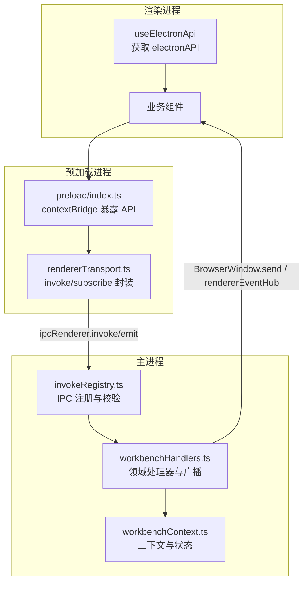
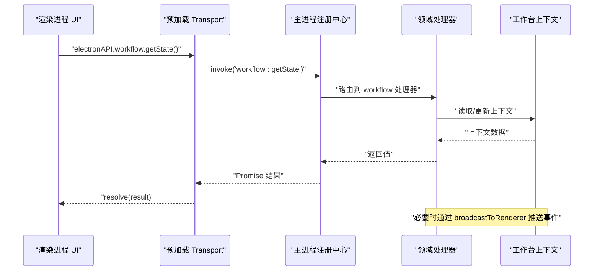
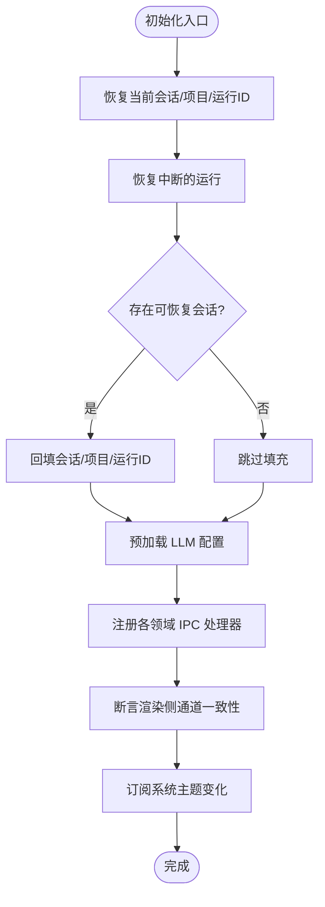
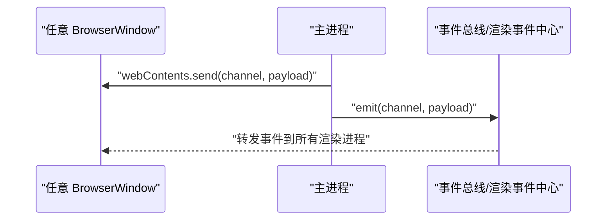
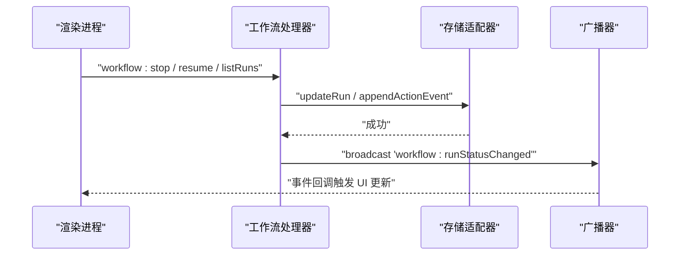

# 工作台 API

<cite>
**本文引用的文件**
- [src/main/ipc/workbenchHandlers.ts](file://src/main/ipc/workbenchHandlers.ts)
- [src/main/ipc/workbenchContext.ts](file://src/main/ipc/workbenchContext.ts)
- [src/main/ipc/invokeRegistry.ts](file://src/main/ipc/invokeRegistry.ts)
- [src/preload/index.ts](file://src/preload/index.ts)
- [src/preload/rendererTransport.ts](file://src/preload/rendererTransport.ts)
- [src/shared/renderer-api/channels.ts](file://src/shared/renderer-api/channels.ts)
- [src/shared/renderer-api/createRendererApi.ts](file://src/shared/renderer-api/createRendererApi.ts)
- [src/renderer/hooks/useElectronApi.ts](file://src/renderer/hooks/useElectronApi.ts)
- [src/renderer/hooks/useWindowControls.ts](file://src/renderer/hooks/useWindowControls.ts)
</cite>

## 目录
1. [简介](#简介)
2. [项目结构](#项目结构)
3. [核心组件](#核心组件)
4. [架构总览](#架构总览)
5. [详细组件分析](#详细组件分析)
6. [依赖分析](#依赖分析)
7. [性能考虑](#性能考虑)
8. [故障排查指南](#故障排查指南)
9. [结论](#结论)
10. [附录：调用示例与集成指南](#附录调用示例与集成指南)

## 简介
本文件面向工作台（Workbench）的 IPC 接口，覆盖工作区初始化、窗口管理、面板控制等能力，并说明上下文传递、状态同步与事件广播机制。文档同时给出多窗口协调、焦点管理与生命周期钩子的实现要点，以及完整的调用示例与集成步骤，帮助前端渲染进程通过安全桥接调用主进程能力。

## 项目结构
工作台 IPC 由“共享通道定义 + 预加载桥接 + 主进程注册中心 + 领域处理器”构成：
- 共享层：统一声明所有可被渲染进程调用的 IPC 通道与事件类型，保证前后端契约一致。
- 预加载层：在沙箱环境中暴露安全的 Electron API，封装 invoke/subscribe 传输。
- 主进程层：集中注册 IPC 处理器，维护工作台上下文与全局状态，负责跨窗口广播与持久化。
- 渲染层：通过 React Hook 获取 electronAPI，调用工作区相关能力。

图表来源
- [src/shared/renderer-api/channels.ts:1-244](file://src/shared/renderer-api/channels.ts#L1-L244)
- [src/preload/rendererTransport.ts:1-45](file://src/preload/rendererTransport.ts#L1-L45)
- [src/main/ipc/invokeRegistry.ts:1-51](file://src/main/ipc/invokeRegistry.ts#L1-L51)
- [src/main/ipc/workbenchHandlers.ts:1-290](file://src/main/ipc/workbenchHandlers.ts#L1-L290)
- [src/main/ipc/workbenchContext.ts:1-40](file://src/main/ipc/workbenchContext.ts#L1-L40)

章节来源
- [src/shared/renderer-api/channels.ts:1-244](file://src/shared/renderer-api/channels.ts#L1-L244)
- [src/preload/index.ts:1-26](file://src/preload/index.ts#L1-L26)
- [src/preload/rendererTransport.ts:1-45](file://src/preload/rendererTransport.ts#L1-L45)
- [src/main/ipc/invokeRegistry.ts:1-51](file://src/main/ipc/invokeRegistry.ts#L1-L51)
- [src/main/ipc/workbenchHandlers.ts:1-290](file://src/main/ipc/workbenchHandlers.ts#L1-L290)
- [src/main/ipc/workbenchContext.ts:1-40](file://src/main/ipc/workbenchContext.ts#L1-L40)

## 核心组件
- 通道与事件契约：集中声明所有渲染进程可调用的方法名与事件名，提供类型化约束与覆盖率校验。
- 预加载桥接：将 ipcRenderer 包装为统一的 transport，并提供 subscribe/unsubscribe 能力。
- 主进程注册中心：拦截 ipcMain.handle，收集已注册通道，支持运行时按通道分发，并在启动时断言渲染侧与主进程通道一致性。
- 工作台上下文：维护当前会话/项目/运行实例等上下文，提供选择项目、更新运行生命周期、广播状态变更等能力。
- 领域处理器：按功能域（会话、工作流、设备、捕获、知识、设置等）注册具体处理逻辑，并通过上下文进行协作。

章节来源
- [src/shared/renderer-api/channels.ts:1-244](file://src/shared/renderer-api/channels.ts#L1-L244)
- [src/preload/rendererTransport.ts:1-45](file://src/preload/rendererTransport.ts#L1-L45)
- [src/main/ipc/invokeRegistry.ts:1-51](file://src/main/ipc/invokeRegistry.ts#L1-L51)
- [src/main/ipc/workbenchContext.ts:1-40](file://src/main/ipc/workbenchContext.ts#L1-L40)
- [src/main/ipc/workbenchHandlers.ts:1-290](file://src/main/ipc/workbenchHandlers.ts#L1-L290)

## 架构总览
工作台 IPC 采用“请求-响应 + 事件广播”的双通道模型：
- 请求-响应：渲染进程通过 electronAPI 调用对应 channel，主进程根据注册表路由到具体处理器，返回结果。
- 事件广播：主进程通过 BrowserWindow.webContents.send 或内部事件总线向所有渲染进程推送事件，用于状态同步与跨窗口通知。

图表来源
- [src/shared/renderer-api/createRendererApi.ts:1-77](file://src/shared/renderer-api/createRendererApi.ts#L1-L77)
- [src/preload/rendererTransport.ts:1-45](file://src/preload/rendererTransport.ts#L1-L45)
- [src/main/ipc/invokeRegistry.ts:1-51](file://src/main/ipc/invokeRegistry.ts#L1-L51)
- [src/main/ipc/workbenchHandlers.ts:1-290](file://src/main/ipc/workbenchHandlers.ts#L1-L290)
- [src/main/ipc/workbenchContext.ts:1-40](file://src/main/ipc/workbenchContext.ts#L1-L40)

## 详细组件分析

### 工作区初始化与上下文
- 初始化流程：
  - 恢复当前会话、项目、运行实例；尝试恢复中断的运行；检测可恢复会话并回填上下文。
  - 预加载 LLM 配置；注册主题变化监听；注册各领域 IPC 处理器；断言渲染侧与主进程通道一致性。
- 上下文对象：
  - 包含当前会话/项目/运行 ID、广播函数、LLM 配置应用、运行生命周期更新、项目选择、初始化入口等。
- 项目选择：
  - 清空或设置当前项目后，自动清理不匹配会话与运行；返回所选项目、当前会话与最新运行摘要。

图表来源
- [src/main/ipc/workbenchHandlers.ts:52-77](file://src/main/ipc/workbenchHandlers.ts#L52-L77)
- [src/main/ipc/workbenchHandlers.ts:259-281](file://src/main/ipc/workbenchHandlers.ts#L259-L281)
- [src/main/ipc/workbenchContext.ts:7-39](file://src/main/ipc/workbenchContext.ts#L7-L39)

章节来源
- [src/main/ipc/workbenchHandlers.ts:52-77](file://src/main/ipc/workbenchHandlers.ts#L52-L77)
- [src/main/ipc/workbenchHandlers.ts:259-281](file://src/main/ipc/workbenchHandlers.ts#L259-L281)
- [src/main/ipc/workbenchContext.ts:7-39](file://src/main/ipc/workbenchContext.ts#L7-L39)

### 窗口管理与多窗口协调
- 最小化/最大化/关闭：
  - 渲染侧通过 windowControls 调用对应通道；主进程执行系统级窗口操作。
- 多窗口广播：
  - 主进程通过遍历所有非销毁窗口发送事件，确保多窗口间状态一致。
- 焦点管理：
  - 主进程在处理 invoke 时优先使用聚焦窗口作为 sender，若无则回退到首个可用窗口。

图表来源
- [src/main/ipc/workbenchHandlers.ts:79-87](file://src/main/ipc/workbenchHandlers.ts#L79-L87)
- [src/main/ipc/invokeRegistry.ts:23-30](file://src/main/ipc/invokeRegistry.ts#L23-L30)

章节来源
- [src/main/ipc/workbenchHandlers.ts:79-87](file://src/main/ipc/workbenchHandlers.ts#L79-L87)
- [src/main/ipc/invokeRegistry.ts:23-30](file://src/main/ipc/invokeRegistry.ts#L23-L30)

### 面板控制与工作流状态
- 工作流状态查询与控制：
  - 渲染进程可通过 workflow 相关通道获取状态、恢复、停止、列举运行等。
- 运行生命周期更新：
  - 主进程更新运行状态后，持久化并广播 runStatusChanged 事件，供 UI 实时刷新。
- 工具执行追踪：
  - 工具调用完成后，记录证据事件并广播 tool:executionComplete，同时写入日志。

图表来源
- [src/main/ipc/workbenchHandlers.ts:108-134](file://src/main/ipc/workbenchHandlers.ts#L108-L134)
- [src/main/ipc/workbenchHandlers.ts:190-237](file://src/main/ipc/workbenchHandlers.ts#L190-L237)
- [src/shared/renderer-api/channels.ts:33-40](file://src/shared/renderer-api/channels.ts#L33-L40)

章节来源
- [src/main/ipc/workbenchHandlers.ts:108-134](file://src/main/ipc/workbenchHandlers.ts#L108-L134)
- [src/main/ipc/workbenchHandlers.ts:190-237](file://src/main/ipc/workbenchHandlers.ts#L190-L237)
- [src/shared/renderer-api/channels.ts:33-40](file://src/shared/renderer-api/channels.ts#L33-L40)

### 上下文传递与状态同步
- 上下文传递：
  - 通过 WorkbenchIpcContext 将 state、广播、LLM 配置应用、运行生命周期更新、项目选择等能力注入到各处理器。
- 状态同步：
  - 项目切换时清理不匹配的会话与运行；会话/运行状态变更后持久化并广播。
- 事件订阅：
  - 渲染侧通过 events 订阅工作区事件，如设备状态、捕获状态、上下文变化、项目输入变化等。

章节来源
- [src/main/ipc/workbenchContext.ts:7-39](file://src/main/ipc/workbenchContext.ts#L7-L39)
- [src/main/ipc/workbenchHandlers.ts:136-178](file://src/main/ipc/workbenchHandlers.ts#L136-L178)
- [src/shared/renderer-api/channels.ts:178-218](file://src/shared/renderer-api/channels.ts#L178-L218)

### 生命周期钩子
- 应用级：
  - 主题变化监听：系统主题切换时广播 app:themeChanged。
  - 工具执行追踪：工具调用完成后记录证据与日志。
- 会话/运行级：
  - 运行生命周期状态变更：持久化并广播 runStatusChanged。
  - 会话恢复：启动时检测可恢复会话并回填上下文。

章节来源
- [src/main/ipc/workbenchHandlers.ts:248-257](file://src/main/ipc/workbenchHandlers.ts#L248-L257)
- [src/main/ipc/workbenchHandlers.ts:190-237](file://src/main/ipc/workbenchHandlers.ts#L190-L237)
- [src/main/ipc/workbenchHandlers.ts:52-77](file://src/main/ipc/workbenchHandlers.ts#L52-L77)

## 依赖分析
- 通道契约依赖：
  - 渲染侧通过 createRendererApi 组装各能力模块，依赖 channels 中定义的通道常量。
- 预加载依赖：
  - preload/index 暴露 electronAPI，基于 createRendererApi 与自定义 transport。
- 主进程依赖：
  - invokeRegistry 拦截 ipcMain.handle，集中管理通道注册与校验。
  - workbenchHandlers 聚合各领域处理器，使用 workbenchContext 提供的上下文能力。

图表来源
- [src/shared/renderer-api/channels.ts:1-244](file://src/shared/renderer-api/channels.ts#L1-L244)
- [src/shared/renderer-api/createRendererApi.ts:1-77](file://src/shared/renderer-api/createRendererApi.ts#L1-L77)
- [src/preload/rendererTransport.ts:1-45](file://src/preload/rendererTransport.ts#L1-L45)
- [src/main/ipc/invokeRegistry.ts:1-51](file://src/main/ipc/invokeRegistry.ts#L1-L51)
- [src/main/ipc/workbenchHandlers.ts:1-290](file://src/main/ipc/workbenchHandlers.ts#L1-L290)
- [src/main/ipc/workbenchContext.ts:1-40](file://src/main/ipc/workbenchContext.ts#L1-L40)

章节来源
- [src/shared/renderer-api/channels.ts:1-244](file://src/shared/renderer-api/channels.ts#L1-L244)
- [src/shared/renderer-api/createRendererApi.ts:1-77](file://src/shared/renderer-api/createRendererApi.ts#L1-L77)
- [src/preload/rendererTransport.ts:1-45](file://src/preload/rendererTransport.ts#L1-L45)
- [src/main/ipc/invokeRegistry.ts:1-51](file://src/main/ipc/invokeRegistry.ts#L1-L51)
- [src/main/ipc/workbenchHandlers.ts:1-290](file://src/main/ipc/workbenchHandlers.ts#L1-L290)
- [src/main/ipc/workbenchContext.ts:1-40](file://src/main/ipc/workbenchContext.ts#L1-L40)

## 性能考虑
- 批量广播：
  - 对频繁的状态变更（如工具执行、运行状态）采用事件广播，避免重复请求。
- 懒加载与去重：
  - 主题订阅与工具追踪订阅采用防重复注册，减少内存占用与事件风暴。
- 异步持久化：
  - 运行状态与证据事件写入存储适配器，采用异步 IO 降低阻塞。
- 通道一致性校验：
  - 启动时断言渲染侧与主进程通道一致性，提前发现缺失处理器，避免运行时错误。

[本节为通用指导，无需特定文件引用]

## 故障排查指南
- 通道未注册：
  - 现象：调用时报错提示缺少处理器。
  - 排查：检查 RENDERER_INVOKE_CHANNELS 是否包含该通道，确认主进程已注册对应处理器。
- 多窗口事件丢失：
  - 现象：某些窗口未收到事件。
  - 排查：确认窗口未被销毁；检查广播函数是否正确遍历所有窗口。
- 主题变化无响应：
  - 现象：系统主题切换后 UI 未更新。
  - 排查：确认主题订阅已注册；检查广播事件名称是否与渲染侧订阅一致。
- 运行状态不同步：
  - 现象：UI 显示的运行状态与实际不一致。
  - 排查：确认运行生命周期更新后是否持久化并广播；检查渲染侧是否订阅了相应事件。

章节来源
- [src/main/ipc/invokeRegistry.ts:45-51](file://src/main/ipc/invokeRegistry.ts#L45-L51)
- [src/main/ipc/workbenchHandlers.ts:79-87](file://src/main/ipc/workbenchHandlers.ts#L79-L87)
- [src/main/ipc/workbenchHandlers.ts:248-257](file://src/main/ipc/workbenchHandlers.ts#L248-L257)
- [src/main/ipc/workbenchHandlers.ts:108-134](file://src/main/ipc/workbenchHandlers.ts#L108-L134)

## 结论
工作台 IPC 通过清晰的通道契约、安全的预加载桥接、集中的主进程注册与上下文管理，实现了稳定可靠的工作区初始化、窗口管理、面板控制与状态同步。事件广播机制保障了多窗口间的协同与实时性，生命周期钩子提供了扩展点以接入更多能力。遵循本文档的调用示例与集成指南，可快速在主进程与渲染进程之间建立高效、可维护的通信链路。

[本节为总结，无需特定文件引用]

## 附录：调用示例与集成指南

### 集成步骤
- 在渲染进程中通过 Hook 获取 electronAPI：
  - 使用 useElectronApi 获取 electronAPI，再调用其工作区能力。
- 订阅事件：
  - 使用 electronAPI.events.on/off 订阅工作区事件，如设备状态、捕获状态、上下文变化、项目输入变化等。
- 调用工作区能力：
  - 通过 electronAPI 的对话、工作流、项目、会话、运行、设备、捕获、上下文、跟踪、运行时日志等模块调用对应通道。

章节来源
- [src/renderer/hooks/useElectronApi.ts:1-7](file://src/renderer/hooks/useElectronApi.ts#L1-L7)
- [src/shared/renderer-api/channels.ts:178-218](file://src/shared/renderer-api/channels.ts#L178-L218)
- [src/shared/renderer-api/createRendererApi.ts:33-77](file://src/shared/renderer-api/createRendererApi.ts#L33-L77)

### 窗口管理调用示例
- 最小化窗口：
  - 调用 electronAPI.windowControls.minimizeWindow()。
- 切换最大化：
  - 调用 electronAPI.windowControls.toggleMaximizeWindow()，并根据返回值更新本地状态。
- 关闭窗口：
  - 调用 electronAPI.windowControls.closeWindow()。

章节来源
- [src/renderer/hooks/useWindowControls.ts:1-19](file://src/renderer/hooks/useWindowControls.ts#L1-L19)
- [src/shared/renderer-api/channels.ts:1-17](file://src/shared/renderer-api/channels.ts#L1-L17)

### 工作区初始化调用示例
- 初始化入口：
  - 在主进程启动时调用 initializeIpcState，恢复上下文并准备环境。
- 注册处理器：
  - 调用 registerIPCHandlers 完成各领域处理器注册与通道一致性校验。

章节来源
- [src/main/ipc/workbenchHandlers.ts:52-77](file://src/main/ipc/workbenchHandlers.ts#L52-L77)
- [src/main/ipc/workbenchHandlers.ts:259-281](file://src/main/ipc/workbenchHandlers.ts#L259-L281)

### 面板控制与工作流调用示例
- 获取工作流状态：
  - 调用 electronAPI.workflow.getState()。
- 恢复/停止运行：
  - 调用 electronAPI.workflow.resume() 或 electronAPI.workflow.stop()。
- 列举运行：
  - 调用 electronAPI.workflow.listRuns() 或 electronAPI.workflow.listActiveRuns()。

章节来源
- [src/shared/renderer-api/channels.ts:33-40](file://src/shared/renderer-api/channels.ts#L33-L40)

### 上下文与状态同步调用示例
- 订阅工作区事件：
  - 使用 electronAPI.events.on('device:statusChanged', handler) 等订阅事件。
- 项目选择：
  - 调用 project:select 后，等待 context:changed 或相关事件以刷新 UI。

章节来源
- [src/shared/renderer-api/channels.ts:178-218](file://src/shared/renderer-api/channels.ts#L178-L218)
- [src/main/ipc/workbenchHandlers.ts:136-178](file://src/main/ipc/workbenchHandlers.ts#L136-L178)