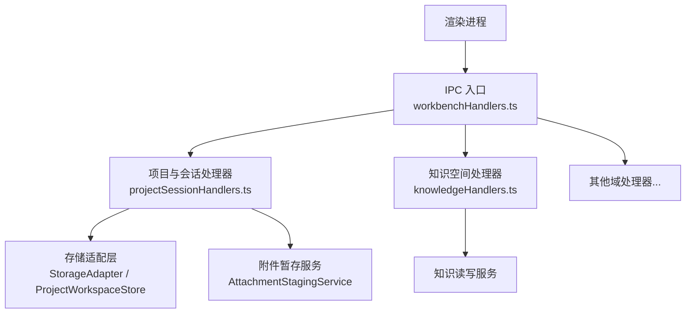
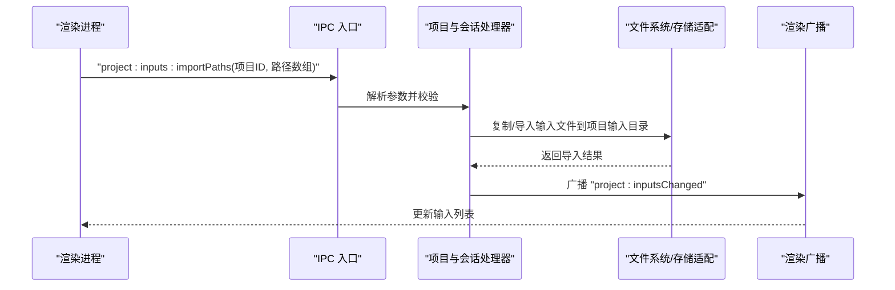
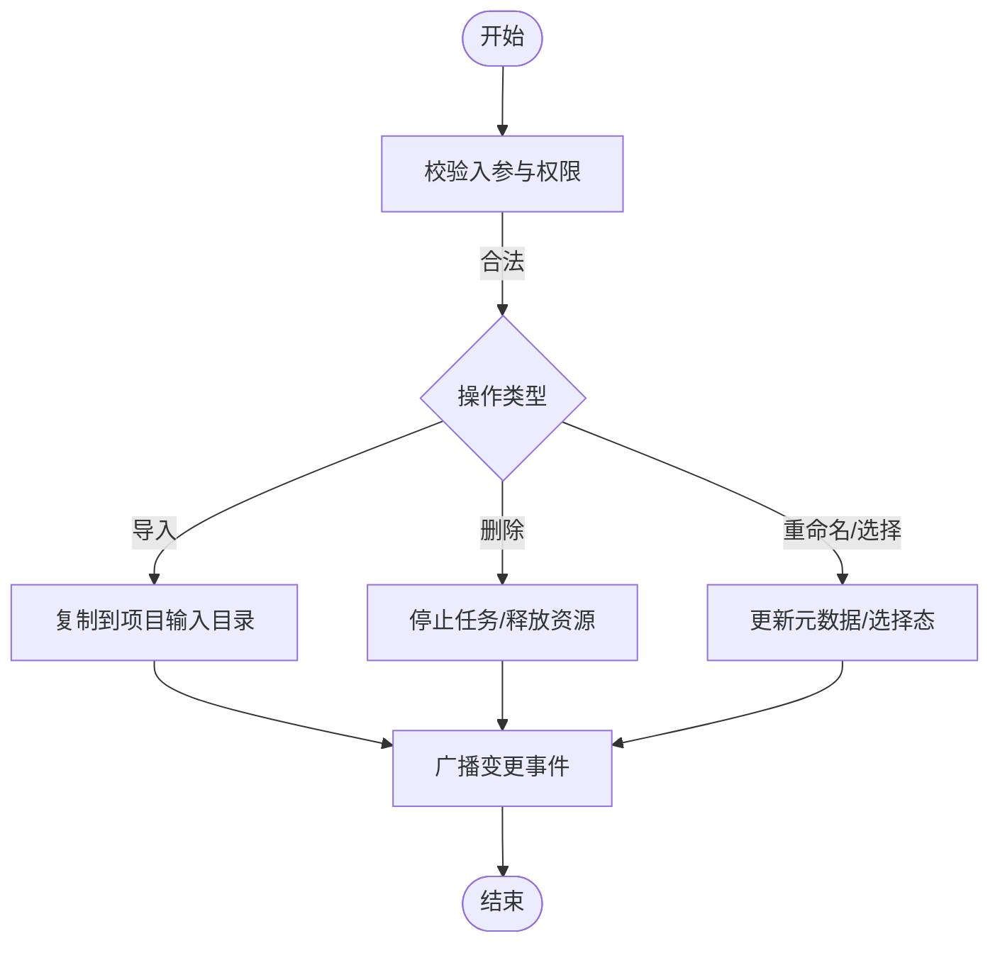
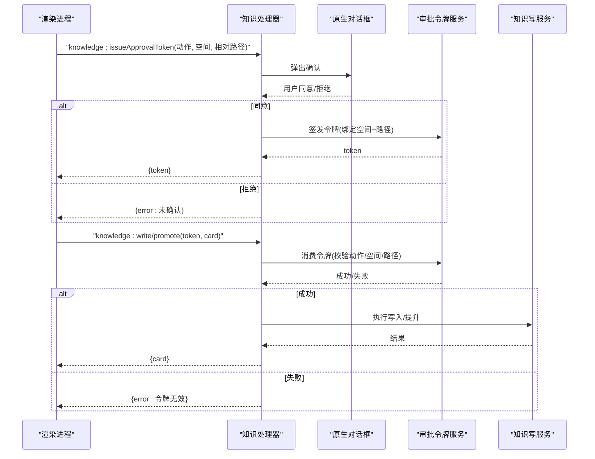
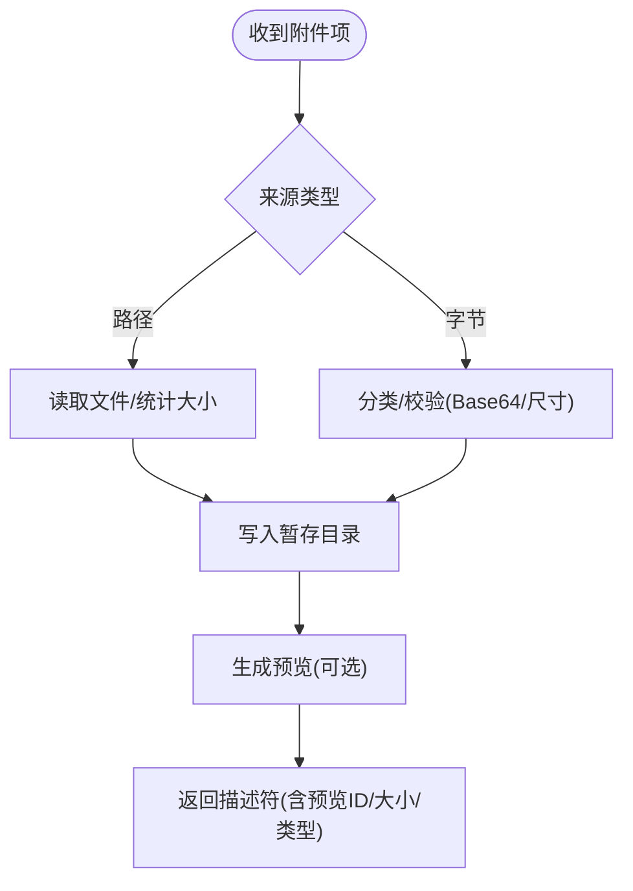
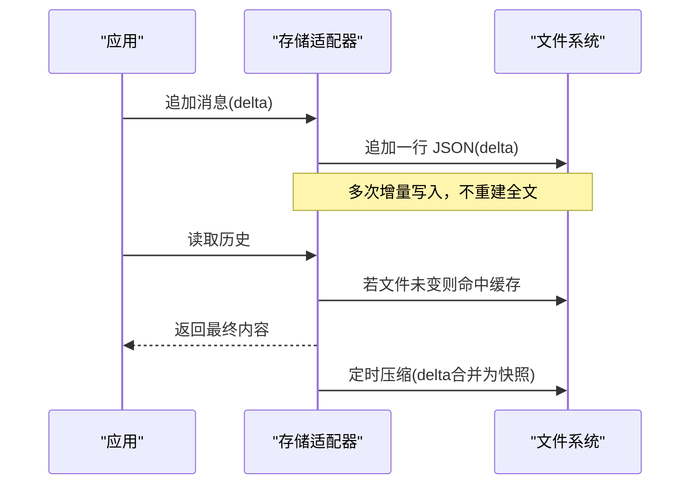
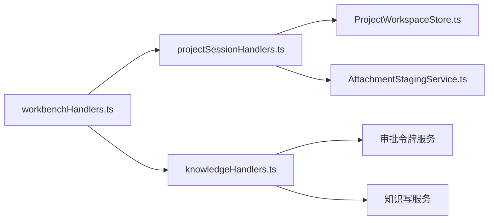

# 文件操作 API

<cite>
**本文引用的文件**
- [src/main/ipc/README.md](file://src/main/ipc/README.md)
- [src/main/ipc/handlers.ts](file://src/main/ipc/handlers.ts)
- [src/main/ipc/workbenchHandlers.ts](file://src/main/ipc/workbenchHandlers.ts)
- [src/main/ipc/projectSessionHandlers.ts](file://src/main/ipc/projectSessionHandlers.ts)
- [src/main/ipc/knowledgeHandlers.ts](file://src/main/ipc/knowledgeHandlers.ts)
- [src/main/conversation/AttachmentStagingService.ts](file://src/main/conversation/AttachmentStagingService.ts)
- [src/main/sessions/StorageAdapter.streamingIo.test.ts](file://src/main/sessions/StorageAdapter.streamingIo.test.ts)
- [src/main/sessions/ProjectWorkspaceStore.ts](file://src/main/sessions/ProjectWorkspaceStore.ts)
- [src/main/settings/projectRegistryLookup.ts](file://src/main/settings/projectRegistryLookup.ts)
- [src/main/agent-runtime/tools/ToolResultArtifactizer.test.ts](file://src/main/agent-runtime/tools/ToolResultArtifactizer.test.ts)
- [src/main/agent-runtime/permissions/PolicyCompiler.ts](file://src/main/agent-runtime/permissions/PolicyCompiler.ts)
</cite>

## 目录
1. [简介](#简介)
2. [项目结构](#项目结构)
3. [核心组件](#核心组件)
4. [架构总览](#架构总览)
5. [详细组件分析](#详细组件分析)
6. [依赖关系分析](#依赖关系分析)
7. [性能考量](#性能考量)
8. [故障排查指南](#故障排查指南)
9. [结论](#结论)
10. [附录：API 参考与调用示例](#附录api-参考与调用示例)

## 简介
本文件面向 RDC-Agent 的“文件操作相关 IPC API”，覆盖读取、写入、移动、删除等能力，并重点说明沙箱机制、路径验证、权限控制与错误处理。同时给出大文件处理、流式传输与进度反馈的实现要点与安全最佳实践。文档基于仓库中 main 进程 IPC 处理器、会话存储适配器、附件暂存服务与知识空间写保护等实现进行归纳。

## 项目结构
IPC 是渲染进程与主进程的 API 边界。新增 IPC 需登记域，并与 preload、共享类型及浏览器 fallback 保持一致。工作区入口统一注册各域处理器，形成清晰的请求路由与广播通道。

图表来源
- [src/main/ipc/README.md:1-10](file://src/main/ipc/README.md#L1-L10)
- [src/main/ipc/workbenchHandlers.ts:259-280](file://src/main/ipc/workbenchHandlers.ts#L259-L280)
- [src/main/ipc/projectSessionHandlers.ts:66-200](file://src/main/ipc/projectSessionHandlers.ts#L66-L200)
- [src/main/ipc/knowledgeHandlers.ts:170-348](file://src/main/ipc/knowledgeHandlers.ts#L170-L348)

章节来源
- [src/main/ipc/README.md:1-10](file://src/main/ipc/README.md#L1-L10)
- [src/main/ipc/workbenchHandlers.ts:259-280](file://src/main/ipc/workbenchHandlers.ts#L259-L280)

## 核心组件
- IPC 入口与上下文
  - 统一注册所有 IPC 处理器，维护当前项目/会话/运行状态，提供向渲染端广播事件的能力。
- 项目与会话文件管理
  - 提供项目增删改查、会话创建/重命名/删除、输入文件导入与刷新等能力，底层通过存储适配层完成持久化。
- 知识空间写保护
  - 对知识卡片的写入/提升操作实施人类确认与令牌校验，限制任意自动写入。
- 附件暂存与预览
  - 支持从路径或字节流暂存附件，限制数量与大小，生成预览数据 URL，并在会话关闭时释放。
- 会话存储与流式 I/O
  - 会话消息以增量 delta 追加写入，压缩后落盘；避免全量快照放大，保证流式更新性能。

章节来源
- [src/main/ipc/workbenchHandlers.ts:43-188](file://src/main/ipc/workbenchHandlers.ts#L43-L188)
- [src/main/ipc/projectSessionHandlers.ts:66-200](file://src/main/ipc/projectSessionHandlers.ts#L66-L200)
- [src/main/ipc/knowledgeHandlers.ts:39-122](file://src/main/ipc/knowledgeHandlers.ts#L39-L122)
- [src/main/conversation/AttachmentStagingService.ts:19-41](file://src/main/conversation/AttachmentStagingService.ts#L19-L41)
- [src/main/sessions/StorageAdapter.streamingIo.test.ts:103-151](file://src/main/sessions/StorageAdapter.streamingIo.test.ts#L103-L151)

## 架构总览
下图展示一次典型“导入项目输入文件”的端到端流程：渲染进程发起 IPC，主进程校验参数、打开系统对话框或接收路径列表，复制到项目输入目录，刷新索引并广播变更。

图表来源
- [src/main/ipc/projectSessionHandlers.ts:183-199](file://src/main/ipc/projectSessionHandlers.ts#L183-L199)
- [src/main/sessions/ProjectWorkspaceStore.ts:166-171](file://src/main/sessions/ProjectWorkspaceStore.ts#L166-L171)
- [src/main/ipc/workbenchHandlers.ts:79-87](file://src/main/ipc/workbenchHandlers.ts#L79-L87)

## 详细组件分析

### 项目与会话文件操作（读取/写入/移动/删除）
- 读取
  - 列出项目、会话、运行记录；读取会话详情；刷新项目输入清单。
- 写入
  - 创建项目、会话；重命名项目/会话；导入输入文件（支持多选对话框或直接传入路径）。
- 移动
  - 通过导入流程将外部文件复制到项目输入目录，形成受控副本。
- 删除
  - 删除会话时会终止活跃对话与运行任务，清理关联资源；删除项目前会停止其下所有会话的活跃任务。

安全与校验
- 所有 IPC 入参均经过 schema 校验与长度限制，防止过大载荷注入。
- 删除/移除类操作具备前置检查与副作用清理（取消对话、停止运行、释放附件等）。

图表来源
- [src/main/ipc/projectSessionHandlers.ts:69-200](file://src/main/ipc/projectSessionHandlers.ts#L69-L200)
- [src/main/ipc/projectSessionHandlers.ts:254-307](file://src/main/ipc/projectSessionHandlers.ts#L254-L307)
- [src/main/sessions/ProjectWorkspaceStore.ts:166-171](file://src/main/sessions/ProjectWorkspaceStore.ts#L166-L171)

章节来源
- [src/main/ipc/projectSessionHandlers.ts:69-200](file://src/main/ipc/projectSessionHandlers.ts#L69-L200)
- [src/main/ipc/projectSessionHandlers.ts:254-307](file://src/main/ipc/projectSessionHandlers.ts#L254-L307)
- [src/main/sessions/ProjectWorkspaceStore.ts:166-171](file://src/main/sessions/ProjectWorkspaceStore.ts#L166-L171)

### 知识空间写保护（沙箱与权限）
- 人类确认
  - 写入/提升知识卡片前弹出原生对话框，仅用户明确允许才放行。
- 令牌绑定
  - 通过一次性令牌绑定“动作 + 空间 + 相对路径”，消费后失效，防止重放。
- 空间白名单
  - 仅允许已知的知识空间 ID，未知空间直接拒绝。

图表来源
- [src/main/ipc/knowledgeHandlers.ts:39-122](file://src/main/ipc/knowledgeHandlers.ts#L39-L122)
- [src/main/ipc/knowledgeHandlers.ts:288-348](file://src/main/ipc/knowledgeHandlers.ts#L288-L348)

章节来源
- [src/main/ipc/knowledgeHandlers.ts:39-122](file://src/main/ipc/knowledgeHandlers.ts#L39-L122)
- [src/main/ipc/knowledgeHandlers.ts:288-348](file://src/main/ipc/knowledgeHandlers.ts#L288-L348)

### 附件暂存与预览（读取/写入/删除）
- 读取
  - 支持从本地路径或 base64 字节流暂存为附件，识别文本/图片等类型，生成预览数据 URL。
- 写入
  - 限制单次暂存数量与总字节数，限制单文件大小，过滤 Windows 保留文件名，严格 Base64 校验。
- 删除
  - 会话关闭时按会话 ID 释放暂存附件，避免残留。

图表来源
- [src/main/conversation/AttachmentStagingService.ts:19-41](file://src/main/conversation/AttachmentStagingService.ts#L19-L41)

章节来源
- [src/main/conversation/AttachmentStagingService.ts:19-41](file://src/main/conversation/AttachmentStagingService.ts#L19-L41)

### 会话存储与流式 I/O（大文件与增量写入）
- 流式写入
  - 会话消息以增量 delta 追加写入，避免每次全量重写，降低磁盘放大与延迟。
- 压缩归档
  - 定期压缩历史，合并 delta 为完整快照，减少后续读取成本。
- 缓存命中
  - 文件未变更时直接返回缓存结果，避免重复 IO。

图表来源
- [src/main/sessions/StorageAdapter.streamingIo.test.ts:103-151](file://src/main/sessions/StorageAdapter.streamingIo.test.ts#L103-L151)

章节来源
- [src/main/sessions/StorageAdapter.streamingIo.test.ts:103-151](file://src/main/sessions/StorageAdapter.streamingIo.test.ts#L103-L151)

### 大结果分片与引用（工具输出）
- 当工具返回结果超过阈值时，自动分片写入会话产物目录，并以 session:// 协议引用，避免 IPC 载荷过大。
- 产物包含哈希与所有者信息，便于校验与访问控制。

章节来源
- [src/main/agent-runtime/tools/ToolResultArtifactizer.test.ts:48-79](file://src/main/agent-runtime/tools/ToolResultArtifactizer.test.ts#L48-L79)

## 依赖关系分析
- IPC 入口依赖各域处理器，处理器再依赖存储适配、服务层与系统对话框。
- 项目/会话操作强依赖存储适配层与项目工作区存储，确保一致性。
- 知识写保护依赖审批令牌服务与知识读写服务，形成“确认-授权-执行”的三段式链路。
- 附件暂存依赖分类与预览模块，并在会话生命周期内释放。

图表来源
- [src/main/ipc/workbenchHandlers.ts:259-280](file://src/main/ipc/workbenchHandlers.ts#L259-L280)
- [src/main/ipc/projectSessionHandlers.ts:66-200](file://src/main/ipc/projectSessionHandlers.ts#L66-L200)
- [src/main/ipc/knowledgeHandlers.ts:170-348](file://src/main/ipc/knowledgeHandlers.ts#L170-L348)
- [src/main/sessions/ProjectWorkspaceStore.ts:166-171](file://src/main/sessions/ProjectWorkspaceStore.ts#L166-L171)
- [src/main/conversation/AttachmentStagingService.ts:19-41](file://src/main/conversation/AttachmentStagingService.ts#L19-L41)

章节来源
- [src/main/ipc/workbenchHandlers.ts:259-280](file://src/main/ipc/workbenchHandlers.ts#L259-L280)
- [src/main/ipc/projectSessionHandlers.ts:66-200](file://src/main/ipc/projectSessionHandlers.ts#L66-L200)
- [src/main/ipc/knowledgeHandlers.ts:170-348](file://src/main/ipc/knowledgeHandlers.ts#L170-L348)
- [src/main/sessions/ProjectWorkspaceStore.ts:166-171](file://src/main/sessions/ProjectWorkspaceStore.ts#L166-L171)
- [src/main/conversation/AttachmentStagingService.ts:19-41](file://src/main/conversation/AttachmentStagingService.ts#L19-L41)

## 性能考量
- 使用增量 delta 写入会话消息，显著降低频繁更新的 IO 开销。
- 对超大工具结果进行分片与引用，避免 IPC 消息体膨胀。
- 附件暂存限制数量与大小，防止内存与磁盘压力。
- 读取路径时优先命中缓存，减少重复 IO。

[本节为通用性能建议，无需特定文件引用]

## 故障排查指南
- 参数校验失败
  - 现象：返回错误消息或抛出校验异常。
  - 排查：检查 IPC 入参是否符合对应 schema，注意最大字节限制。
- 知识写入被拒绝
  - 现象：提示需要人类确认或令牌无效。
  - 排查：确认是否已通过对话框授权，且令牌未被重复消费。
- 会话删除失败
  - 现象：无法删除会话或残留运行任务。
  - 排查：检查是否存在活跃任务，先取消/停止后再删除。
- 附件暂存失败
  - 现象：上传失败或预览不可用。
  - 排查：检查文件大小、Base64 格式、Windows 保留名限制。

章节来源
- [src/main/ipc/knowledgeHandlers.ts:39-122](file://src/main/ipc/knowledgeHandlers.ts#L39-L122)
- [src/main/ipc/projectSessionHandlers.ts:254-307](file://src/main/ipc/projectSessionHandlers.ts#L254-L307)
- [src/main/conversation/AttachmentStagingService.ts:19-41](file://src/main/conversation/AttachmentStagingService.ts#L19-L41)

## 结论
本项目通过统一的 IPC 入口与各域处理器，结合存储适配层、附件暂存与知识写保护，提供了安全可控的文件操作能力。通过增量写入、分片引用与严格的参数校验，兼顾了性能与安全。建议在调用时遵循最小权限原则，始终通过 IPC 接口访问文件系统，并对敏感写入启用人类确认与令牌校验。

[本节为总结性内容，无需特定文件引用]

## 附录：API 参考与调用示例

### 项目与会会话文件操作
- 列出项目
  - 方法：project:list
  - 入参：无
  - 返回：项目列表
  - 用途：枚举可用项目根
- 添加项目
  - 方法：project:add
  - 入参：项目根路径
  - 返回：是否成功、项目对象
  - 用途：将外部目录纳入项目管理
- 选择项目
  - 方法：project:select
  - 入参：项目 ID
  - 返回：选中项目、当前会话、当前运行
  - 用途：切换工作区上下文
- 重命名项目
  - 方法：project:rename
  - 入参：项目 ID、新名称
  - 返回：项目对象
  - 用途：修改项目显示名
- 删除项目
  - 方法：project:remove
  - 入参：项目 ID
  - 返回：是否成功
  - 用途：移除项目及其会话（会先停止活跃任务）
- 列出项目输入
  - 方法：project:inputs:list
  - 入参：项目 ID
  - 返回：输入文件清单
  - 用途：查看已导入的捕获/数据文件
- 刷新项目输入
  - 方法：project:inputs:refresh
  - 入参：项目 ID
  - 返回：输入文件清单
  - 用途：重新扫描项目输入目录
- 导入输入文件（对话框）
  - 方法：project:inputs:import
  - 入参：项目 ID
  - 返回：输入文件清单
  - 用途：通过系统对话框选择 rdc 文件导入
- 导入输入文件（路径列表）
  - 方法：project:inputs:importPaths
  - 入参：项目 ID、文件路径数组
  - 返回：输入文件清单
  - 用途：批量导入指定路径文件
- 列出会话
  - 方法：session:list
  - 入参：项目 ID（可选）
  - 返回：会话列表
  - 用途：枚举会话
- 创建会话
  - 方法：session:create
  - 入参：项目 ID、标题
  - 返回：会话对象
  - 用途：新建会话
- 重命名会话
  - 方法：session:rename
  - 入参：会话 ID、标题
  - 返回：会话对象
  - 用途：修改会话标题
- 删除会话
  - 方法：session:remove
  - 入参：会话 ID
  - 返回：下一个会话/运行
  - 用途：关闭会话并清理资源
- 选择会话
  - 方法：session:select
  - 入参：会话 ID
  - 返回：会话与当前运行
  - 用途：切换会话上下文
- 设置模型覆盖
  - 方法：session:setModelOverride
  - 入参：会话 ID、模型覆盖配置
  - 返回：会话对象
  - 用途：为会话指定可执行模型
- 设置代理 ID
  - 方法：session:setAgentId
  - 入参：会话 ID、代理 ID
  - 返回：会话对象
  - 用途：为会话选择代理
- 列出运行
  - 方法：run:list
  - 入参：会话 ID
  - 返回：运行列表
  - 用途：查看会话下的运行记录

调用示例（概念）
- 导入输入文件（路径列表）
  - 渲染进程调用 project:inputs:importPaths，传入项目 ID 与文件路径数组
  - 主进程校验参数后复制文件至项目输入目录，刷新并广播变更
  - 渲染进程接收 project:inputsChanged 事件更新 UI

章节来源
- [src/main/ipc/projectSessionHandlers.ts:69-200](file://src/main/ipc/projectSessionHandlers.ts#L69-L200)
- [src/main/ipc/projectSessionHandlers.ts:201-403](file://src/main/ipc/projectSessionHandlers.ts#L201-L403)

### 知识空间写保护
- 获取概览
  - 方法：knowledge:overview
  - 入参：无
  - 返回：空间列表、索引概览
- 查询知识
  - 方法：knowledge:query
  - 入参：查询条件（空间、文本、卡片 ID 等）
  - 返回：匹配结果
- 读取卡片
  - 方法：knowledge:card
  - 入参：空间 ID、相对路径
  - 返回：卡片内容
- 编译知识
  - 方法：knowledge:compile
  - 入参：查询条件、限制条数
  - 返回：编译结果
- 重建索引
  - 方法：knowledge:index:rebuild
  - 入参：无
  - 返回：索引版本、构建时间、卡片数
- 获取候选
  - 方法：knowledge:candidates
  - 入参：会话 ID
  - 返回：候选与草稿
- 创建候选
  - 方法：knowledge:candidateCreate
  - 入参：会话 ID、卡片
  - 返回：创建结果
- 冷数据导入
  - 方法：knowledge:coldDataImport
  - 入参：会话 ID、空间 ID（可选）、文件或源字符串
  - 返回：导入结果
- 签发审批令牌
  - 方法：knowledge:issueApprovalToken
  - 入参：动作、空间 ID、相对路径
  - 返回：一次性令牌或未确认错误
- 写入知识
  - 方法：knowledge:write
  - 入参：令牌、确认标志、卡片
  - 返回：卡片
- 提升知识
  - 方法：knowledge:promote
  - 入参：令牌、确认标志、卡片
  - 返回：卡片

调用示例（概念）
- 写入知识卡片
  - 渲染进程先调用 knowledge:issueApprovalToken，弹出确认并获得令牌
  - 随后调用 knowledge:write，携带令牌与卡片
  - 主进程校验令牌并执行写入，返回结果

章节来源
- [src/main/ipc/knowledgeHandlers.ts:170-348](file://src/main/ipc/knowledgeHandlers.ts#L170-L348)

### 安全与最佳实践
- 路径与权限
  - 所有文件操作通过 IPC 进入主进程，由主进程统一校验与执行，避免渲染进程直接访问文件系统。
  - 项目/会话选择通过工作区存储与注册表维护，确保只访问受管路径。
- 沙箱与确认
  - 知识写入/提升必须经人类确认与令牌校验，禁止自动化绕过。
  - 策略编译阶段对批准级别与限制键进行严格校验，防止非法配置。
- 大文件与流式
  - 工具结果超阈值自动分片并引用，避免 IPC 过载。
  - 会话消息采用增量写入与压缩归档，保障高吞吐场景的性能。
- 错误处理
  - 所有 IPC 返回统一的成功/错误结构，错误消息应清晰可定位。
  - 删除/移除类操作需先清理活跃任务与资源，避免悬挂状态。

章节来源
- [src/main/settings/projectRegistryLookup.ts:1-28](file://src/main/settings/projectRegistryLookup.ts#L1-L28)
- [src/main/agent-runtime/permissions/PolicyCompiler.ts:72-102](file://src/main/agent-runtime/permissions/PolicyCompiler.ts#L72-L102)
- [src/main/agent-runtime/tools/ToolResultArtifactizer.test.ts:48-79](file://src/main/agent-runtime/tools/ToolResultArtifactizer.test.ts#L48-L79)
- [src/main/sessions/StorageAdapter.streamingIo.test.ts:103-151](file://src/main/sessions/StorageAdapter.streamingIo.test.ts#L103-L151)