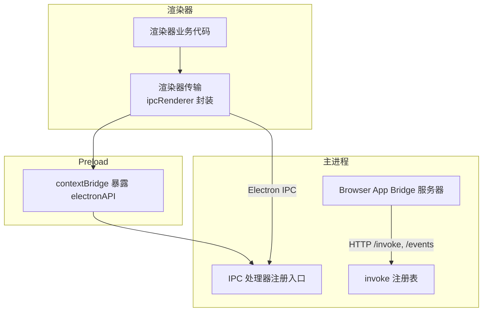
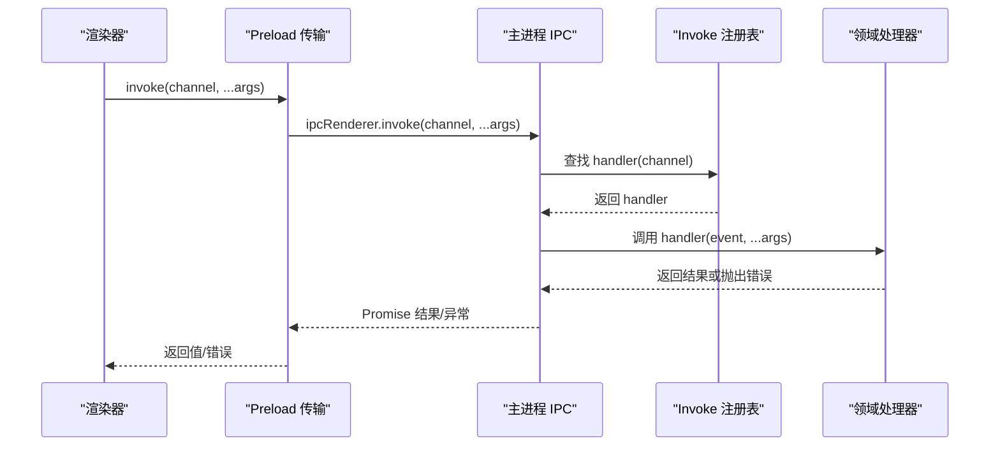
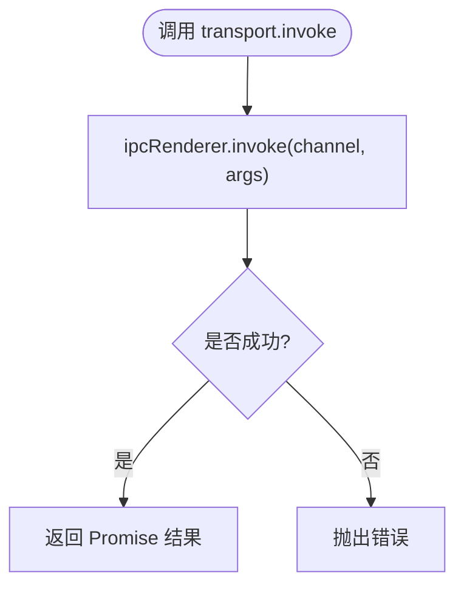
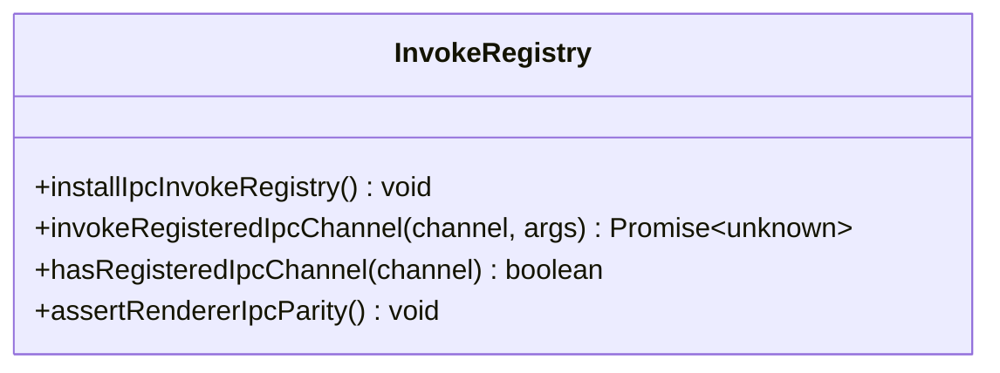
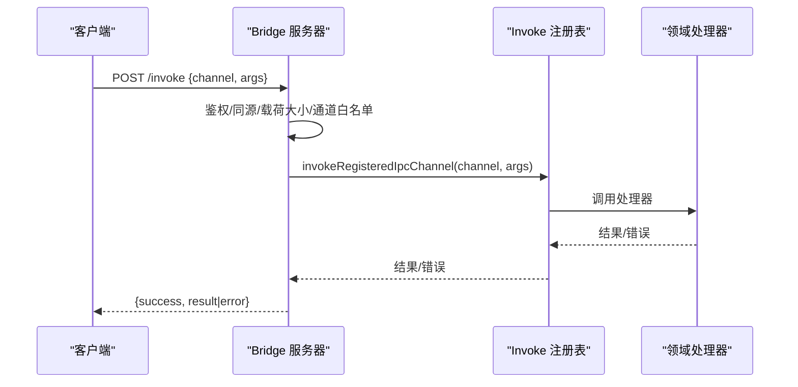
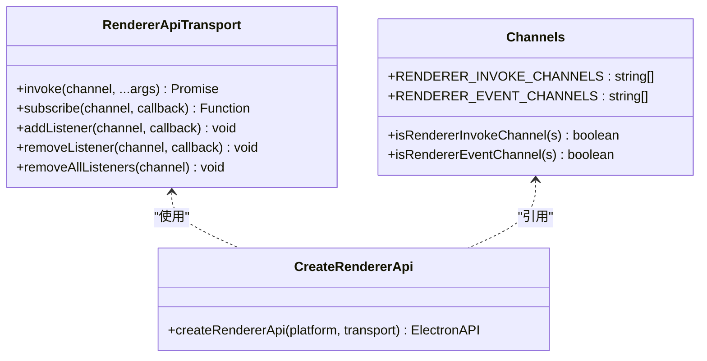
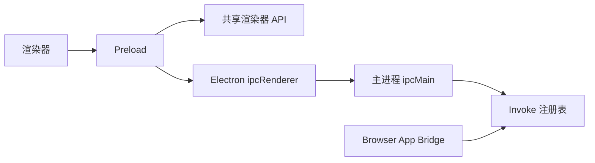

# 消息协议规范

<cite>
**本文引用的文件**
- [src/main/ipc/README.md](file://src/main/ipc/README.md)
- [src/main/ipc/handlers.ts](file://src/main/ipc/handlers.ts)
- [src/main/ipc/invokeRegistry.ts](file://src/main/ipc/invokeRegistry.ts)
- [src/preload/index.ts](file://src/preload/index.ts)
- [src/preload/rendererTransport.ts](file://src/preload/rendererTransport.ts)
- [src/shared/renderer-api/index.ts](file://src/shared/renderer-api/index.ts)
- [src/shared/renderer-api/channels.ts](file://src/shared/renderer-api/channels.ts)
- [src/shared/renderer-api/transport.ts](file://src/shared/renderer-api/transport.ts)
- [src/shared/renderer-api/createRendererApi.ts](file://src/shared/renderer-api/createRendererApi.ts)
- [src/main/browserAppBridge/BrowserAppBridgeServer.ts](file://src/main/browserAppBridge/BrowserAppBridgeServer.ts)
</cite>

## 目录
1. [简介](#简介)
2. [项目结构](#项目结构)
3. [核心组件](#核心组件)
4. [架构总览](#架构总览)
5. [详细组件分析](#详细组件分析)
6. [依赖关系分析](#依赖关系分析)
7. [性能与可靠性](#性能与可靠性)
8. [故障排查指南](#故障排查指南)
9. [结论](#结论)
10. [附录：消息示例与校验规则](#附录消息示例与校验规则)

## 简介
本规范定义 RDC-Agent 中主进程（main）与渲染器（renderer）之间的 IPC 消息协议，覆盖以下方面：
- 消息格式、事件类型、参数验证与错误处理
- 数据类型定义、序列化格式与版本兼容性
- 消息路由机制、超时处理、重试策略与断线重连逻辑
- 完整的消息示例与校验规则说明

该协议通过 Electron 的 ipcMain/ipcRenderer 通道实现，并在浏览器应用桥（Browser App Bridge）中以 HTTP 形式暴露 invoke/events 能力，用于 QA/调试场景。

## 项目结构
IPC 相关代码主要分布在如下位置：
- 共享层：定义渲染器 API 的通道枚举、传输抽象与能力声明
- Preload：将渲染器 API 注入到页面上下文，并封装 ipcRenderer 调用
- Main：注册 IPC 处理器、提供统一入口与路由分发
- Browser App Bridge：在浏览器环境下以 HTTP 方式代理 IPC 调用与事件推送

**图示来源**
- [src/preload/rendererTransport.ts:9-44](file://src/preload/rendererTransport.ts#L9-L44)
- [src/preload/index.ts:8-15](file://src/preload/index.ts#L8-L15)
- [src/main/ipc/handlers.ts:1-7](file://src/main/ipc/handlers.ts#L1-L7)
- [src/main/ipc/invokeRegistry.ts:9-39](file://src/main/ipc/invokeRegistry.ts#L9-L39)
- [src/main/browserAppBridge/BrowserAppBridgeServer.ts:357-396](file://src/main/browserAppBridge/BrowserAppBridgeServer.ts#L357-L396)

**章节来源**
- [src/main/ipc/README.md:1-10](file://src/main/ipc/README.md#L1-L10)
- [src/main/ipc/handlers.ts:1-7](file://src/main/ipc/handlers.ts#L1-L7)
- [src/main/ipc/invokeRegistry.ts:1-51](file://src/main/ipc/invokeRegistry.ts#L1-L51)
- [src/preload/index.ts:1-26](file://src/preload/index.ts#L1-L26)
- [src/preload/rendererTransport.ts:1-45](file://src/preload/rendererTransport.ts#L1-L45)
- [src/shared/renderer-api/index.ts:1-18](file://src/shared/renderer-api/index.ts#L1-L18)

## 核心组件
- 渲染器传输层（Renderer Transport）
  - 封装 ipcRenderer.invoke 与订阅/取消订阅事件的能力
  - 维护事件监听映射，支持 removeListener/removeAllListeners
- 预加载脚本（Preload）
  - 使用 contextBridge 暴露统一的 electronAPI
  - 基于共享渲染器 API 创建具体平台实现
- 主进程 IPC 注册与路由
  - 统一安装 ipcMain.handle 拦截，集中记录已注册的 channel
  - 提供按 channel 调用的分发函数，供外部（如 Browser App Bridge）调用
- Browser App Bridge
  - 提供 /invoke（POST）与 /events（POST）接口
  - 对请求进行鉴权、CORS、载荷大小限制、通道白名单校验后，转发到主进程 IPC 路由
  - 提供健康检查与静态资源服务

**章节来源**
- [src/preload/rendererTransport.ts:9-44](file://src/preload/rendererTransport.ts#L9-L44)
- [src/preload/index.ts:8-15](file://src/preload/index.ts#L8-L15)
- [src/main/ipc/invokeRegistry.ts:9-39](file://src/main/ipc/invokeRegistry.ts#L9-L39)
- [src/main/browserAppBridge/BrowserAppBridgeServer.ts:116-135](file://src/main/browserAppBridge/BrowserAppBridgeServer.ts#L116-L135)
- [src/main/browserAppBridge/BrowserAppBridgeServer.ts:357-396](file://src/main/browserAppBridge/BrowserAppBridgeServer.ts#L357-L396)

## 架构总览
渲染器通过 preload 暴露的 electronAPI 发起调用；preload 使用 ipcRenderer 与主进程通信；主进程通过统一注册表将 channel 路由到对应处理器。Browser App Bridge 在浏览器环境中以 HTTP 方式复用同一套路由。

**图示来源**
- [src/preload/rendererTransport.ts:29-32](file://src/preload/rendererTransport.ts#L29-L32)
- [src/main/ipc/invokeRegistry.ts:32-39](file://src/main/ipc/invokeRegistry.ts#L32-L39)

## 详细组件分析

### 渲染器传输层（ipcRenderer 封装）
- 功能要点
  - invoke：透传 channel 与参数至 ipcRenderer.invoke
  - subscribe/addListener/removeListener/removeAllListeners：管理事件订阅生命周期
  - 内部维护 channel -> callback 映射，避免重复监听与内存泄漏
- 数据流
  - 渲染器侧调用 createIpcRendererTransport() 获取 transport
  - 通过 transport.invoke 发送请求，通过 transport.subscribe 接收事件
- 错误传播
  - 由 ipcRenderer 传递的错误直接上抛给调用方

**图示来源**
- [src/preload/rendererTransport.ts:29-32](file://src/preload/rendererTransport.ts#L29-L32)

**章节来源**
- [src/preload/rendererTransport.ts:1-45](file://src/preload/rendererTransport.ts#L1-L45)

### 预加载脚本（contextBridge 暴露）
- 功能要点
  - 使用 createRendererApi 创建平台无关的渲染器 API
  - 通过 contextBridge.exposeInMainWorld 暴露 electronAPI 给页面
  - 额外暴露 rdcDesktop.getPathForFile 等安全能力
- 安全边界
  - 仅允许使用 contextBridge、webUtils、process.platform 等受限能力

**章节来源**
- [src/preload/index.ts:1-26](file://src/preload/index.ts#L1-L26)

### 主进程 IPC 注册与路由（invokeRegistry）
- 功能要点
  - installIpcInvokeRegistry：拦截 ipcMain.handle，集中记录所有已注册 channel
  - invokeRegisteredIpcChannel：根据 channel 查找并调用处理器
  - hasRegisteredIpcChannel/assertRendererIpcParity：用于测试与一致性校验
- 事件对象构造
  - 自动构造 IpcMainInvokeEvent.sender，优先取聚焦窗口，否则取任意可用窗口

**图示来源**
- [src/main/ipc/invokeRegistry.ts:9-39](file://src/main/ipc/invokeRegistry.ts#L9-L39)
- [src/main/ipc/invokeRegistry.ts:41-51](file://src/main/ipc/invokeRegistry.ts#L41-L51)

**章节来源**
- [src/main/ipc/invokeRegistry.ts:1-51](file://src/main/ipc/invokeRegistry.ts#L1-L51)

### Browser App Bridge（HTTP 代理）
- 端点
  - POST /invoke：将 HTTP 请求转换为 IPC 调用
  - POST /events：建立事件推送连接
  - GET /health：健康检查
  - GET /app/*：静态资源服务
- 安全与校验
  - CORS 设置与同源校验
  - Bearer Token/Cookie 鉴权
  - 通道白名单校验（isBridgeChannelAllowed）
  - 请求体大小限制（MAX_JSON_BODY_BYTES，特定通道放宽）
  - INVOKE_CHANNEL_HEADER 与 body.channel 一致性校验
- 错误处理
  - 载荷过大返回 413
  - 未授权返回 401
  - 通道不允许返回 403
  - 其他异常返回 500

**图示来源**
- [src/main/browserAppBridge/BrowserAppBridgeServer.ts:116-135](file://src/main/browserAppBridge/BrowserAppBridgeServer.ts#L116-L135)
- [src/main/browserAppBridge/BrowserAppBridgeServer.ts:220-239](file://src/main/browserAppBridge/BrowserAppBridgeServer.ts#L220-L239)
- [src/main/browserAppBridge/BrowserAppBridgeServer.ts:357-396](file://src/main/browserAppBridge/BrowserAppBridgeServer.ts#L357-L396)

**章节来源**
- [src/main/browserAppBridge/BrowserAppBridgeServer.ts:72-135](file://src/main/browserAppBridge/BrowserAppBridgeServer.ts#L72-L135)
- [src/main/browserAppBridge/BrowserAppBridgeServer.ts:212-239](file://src/main/browserAppBridge/BrowserAppBridgeServer.ts#L212-L239)
- [src/main/browserAppBridge/BrowserAppBridgeServer.ts:335-396](file://src/main/browserAppBridge/BrowserAppBridgeServer.ts#L335-L396)

### 共享渲染器 API（通道与能力）
- 通道枚举
  - RENDERER_INVOKE_CHANNEL / RENDERER_EVENT_CHANNEL 及其数组集合
  - 提供 isRendererInvokeChannel/isRendererEventChannel 类型守卫
- 能力与兼容
  - resolveBridgeChannelCapability：为 Bridge 暴露能力分类
  - assertChannelCapabilityCoverage/listUnclassifiedInvokeChannels：覆盖率与未分类检测
- 传输抽象
  - RendererApiTransport：定义 invoke/subscribe/addListener/removeListener/removeAllListeners
  - createRendererApi：组合 transport 生成统一 API

**图示来源**
- [src/shared/renderer-api/index.ts:1-18](file://src/shared/renderer-api/index.ts#L1-L18)
- [src/shared/renderer-api/transport.ts:1-200](file://src/shared/renderer-api/transport.ts#L1-L200)
- [src/shared/renderer-api/channels.ts:1-200](file://src/shared/renderer-api/channels.ts#L1-L200)
- [src/shared/renderer-api/createRendererApi.ts:1-200](file://src/shared/renderer-api/createRendererApi.ts#L1-L200)

**章节来源**
- [src/shared/renderer-api/index.ts:1-18](file://src/shared/renderer-api/index.ts#L1-L18)
- [src/shared/renderer-api/transport.ts:1-200](file://src/shared/renderer-api/transport.ts#L1-L200)
- [src/shared/renderer-api/channels.ts:1-200](file://src/shared/renderer-api/channels.ts#L1-L200)
- [src/shared/renderer-api/createRendererApi.ts:1-200](file://src/shared/renderer-api/createRendererApi.ts#L1-L200)

## 依赖关系分析
- 渲染器依赖 preload 暴露的 electronAPI
- preload 依赖共享渲染器 API 与 ipcRenderer
- main 的 invokeRegistry 依赖 Electron ipcMain，并为外部（如 Bridge）提供统一调用入口
- Browser App Bridge 依赖 invokeRegistry 与通道能力白名单

**图示来源**
- [src/preload/rendererTransport.ts:1-45](file://src/preload/rendererTransport.ts#L1-L45)
- [src/main/ipc/invokeRegistry.ts:1-51](file://src/main/ipc/invokeRegistry.ts#L1-L51)
- [src/main/browserAppBridge/BrowserAppBridgeServer.ts:357-396](file://src/main/browserAppBridge/BrowserAppBridgeServer.ts#L357-L396)

**章节来源**
- [src/preload/index.ts:8-15](file://src/preload/index.ts#L8-L15)
- [src/main/ipc/invokeRegistry.ts:9-39](file://src/main/ipc/invokeRegistry.ts#L9-L39)
- [src/main/browserAppBridge/BrowserAppBridgeServer.ts:357-396](file://src/main/browserAppBridge/BrowserAppBridgeServer.ts#L357-L396)

## 性能与可靠性
- 请求体大小限制
  - 默认最大 JSON 主体大小受 MAX_JSON_BODY_BYTES 限制
  - conversation:stageAttachments 通道放宽至 STAGE_ATTACHMENTS_JSON_BODY_BYTES
  - 超过限制立即销毁请求并返回 413
- 超时与可达性
  - 开发渲染器探测存在超时（约 1.5s），不可达时返回 503
- 鉴权与同源
  - 非白名单 Origin 直接拒绝
  - Bearer/Cookie 双重鉴权，必要时要求 Cookie 同源
- 通道白名单
  - 仅允许的通道可通过 Bridge 调用，防止越权
- 事件推送
  - /events 用于服务端主动推送事件，需正确配置 CORS 与鉴权

**章节来源**
- [src/main/browserAppBridge/BrowserAppBridgeServer.ts:72-75](file://src/main/browserAppBridge/BrowserAppBridgeServer.ts#L72-L75)
- [src/main/browserAppBridge/BrowserAppBridgeServer.ts:212-239](file://src/main/browserAppBridge/BrowserAppBridgeServer.ts#L212-L239)
- [src/main/browserAppBridge/BrowserAppBridgeServer.ts:179-210](file://src/main/browserAppBridge/BrowserAppBridgeServer.ts#L179-L210)
- [src/main/browserAppBridge/BrowserAppBridgeServer.ts:282-333](file://src/main/browserAppBridge/BrowserAppBridgeServer.ts#L282-L333)
- [src/main/browserAppBridge/BrowserAppBridgeServer.ts:393-396](file://src/main/browserAppBridge/BrowserAppBridgeServer.ts#L393-L396)

## 故障排查指南
- 401 Unauthorized
  - 检查是否携带有效 Bearer Token 或 Cookie
  - 确认 origin 在白名单内
- 403 Origin not allowed / Channel not allowed
  - 检查请求 Origin 是否在允许列表
  - 确认 channel 在 Bridge 白名单中
- 413 Payload too large
  - 检查请求体大小是否超过限制
  - 对于大附件通道，确保使用 conversation:stageAttachments
- 500 Internal Server Error
  - 检查主进程处理器是否抛出异常
  - 查看日志定位具体错误信息
- 503 Dev renderer is not reachable
  - 检查开发渲染器地址是否可访问
  - 调整网络或代理设置

**章节来源**
- [src/main/browserAppBridge/BrowserAppBridgeServer.ts:282-333](file://src/main/browserAppBridge/BrowserAppBridgeServer.ts#L282-L333)
- [src/main/browserAppBridge/BrowserAppBridgeServer.ts:357-396](file://src/main/browserAppBridge/BrowserAppBridgeServer.ts#L357-L396)
- [src/main/browserAppBridge/BrowserAppBridgeServer.ts:398-415](file://src/main/browserAppBridge/BrowserAppBridgeServer.ts#L398-L415)

## 结论
本规范明确了 RDC-Agent 的主进程与渲染器之间的 IPC 协议：
- 通过共享渲染器 API 统一通道与传输抽象
- 通过主进程 invoke 注册表集中路由与分发
- 通过 Browser App Bridge 在浏览器环境复用同一套路由与安全策略
- 提供了严格的鉴权、同源、载荷限制与错误码约定
建议后续新增 IPC 时遵循“先登记域、再同步 preload/shared/types 与浏览器 fallback”的流程，确保端到端一致性与可维护性。

## 附录：消息示例与校验规则

### 通用消息结构
- 请求（渲染器 -> 主进程）
  - 方法：ipcRenderer.invoke
  - 参数：
    - channel：字符串，必须为已注册的渲染器调用通道
    - args：任意参数数组，由具体处理器校验
- 响应（主进程 -> 渲染器）
  - 成功：Promise 解析为处理器返回值
  - 失败：Promise 拒绝为错误对象或错误消息

- 请求（浏览器客户端 -> Bridge）
  - 方法：POST /invoke
  - 头部：
    - Authorization: Bearer <token>
    - x-rdc-invoke-channel: <channel>
    - Content-Type: application/json
  - 主体：
    - channel：字符串，必须与头部一致（当启用严格模式时）
    - args：任意参数数组
- 响应（Bridge -> 客户端）
  - 成功：{ success: true, result: any }
  - 失败：{ success: false, error: string }

**章节来源**
- [src/preload/rendererTransport.ts:29-32](file://src/preload/rendererTransport.ts#L29-L32)
- [src/main/browserAppBridge/BrowserAppBridgeServer.ts:357-396](file://src/main/browserAppBridge/BrowserAppBridgeServer.ts#L357-L396)

### 事件订阅
- 渲染器侧
  - 使用 transport.subscribe(channel, callback) 订阅事件
  - 返回取消订阅函数，用于移除监听
- 主进程侧
  - 通过 Electron 事件通道向渲染器推送事件
- Bridge 侧
  - 客户端 POST /events 建立事件推送连接（需鉴权与 CORS）

**章节来源**
- [src/preload/rendererTransport.ts:21-27](file://src/preload/rendererTransport.ts#L21-L27)
- [src/main/browserAppBridge/BrowserAppBridgeServer.ts:393-396](file://src/main/browserAppBridge/BrowserAppBridgeServer.ts#L393-L396)

### 参数验证与错误处理
- 通道校验
  - 渲染器侧：通过共享通道的类型守卫保证 channel 合法
  - Bridge 侧：isBridgeChannelAllowed 白名单校验
- 载荷大小
  - 默认限制 MAX_JSON_BODY_BYTES，conversation:stageAttachments 放宽
  - 超限返回 413 并终止读取
- 鉴权与同源
  - Bearer/Cookie 鉴权
  - Origin 白名单与 Cookie 同源要求
- 错误码约定
  - 400：请求格式错误（如缺少 channel）
  - 401：未授权
  - 403：Origin 或通道不允许
  - 413：载荷过大
  - 500：服务器内部错误
  - 503：开发渲染器不可达

**章节来源**
- [src/main/browserAppBridge/BrowserAppBridgeServer.ts:220-239](file://src/main/browserAppBridge/BrowserAppBridgeServer.ts#L220-L239)
- [src/main/browserAppBridge/BrowserAppBridgeServer.ts:282-333](file://src/main/browserAppBridge/BrowserAppBridgeServer.ts#L282-L333)
- [src/main/browserAppBridge/BrowserAppBridgeServer.ts:357-396](file://src/main/browserAppBridge/BrowserAppBridgeServer.ts#L357-L396)

### 版本与兼容性
- 健康检查包含 schema 版本信息（settings、effectiveCatalog、providerCatalog）
- 构建指纹包含 appVersion、rendererFingerprint、mainFingerprint
- 建议客户端在升级前比对 schema 版本，必要时进行降级或提示

**章节来源**
- [src/main/browserAppBridge/BrowserAppBridgeServer.ts:90-114](file://src/main/browserAppBridge/BrowserAppBridgeServer.ts#L90-L114)
- [src/main/browserAppBridge/BrowserAppBridgeServer.ts:341-355](file://src/main/browserAppBridge/BrowserAppBridgeServer.ts#L341-L355)