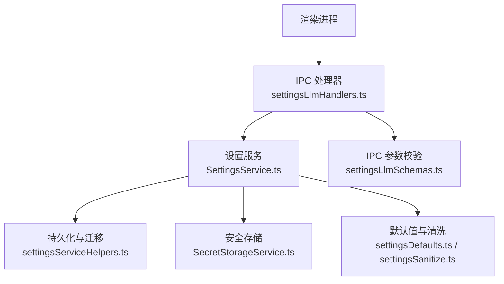
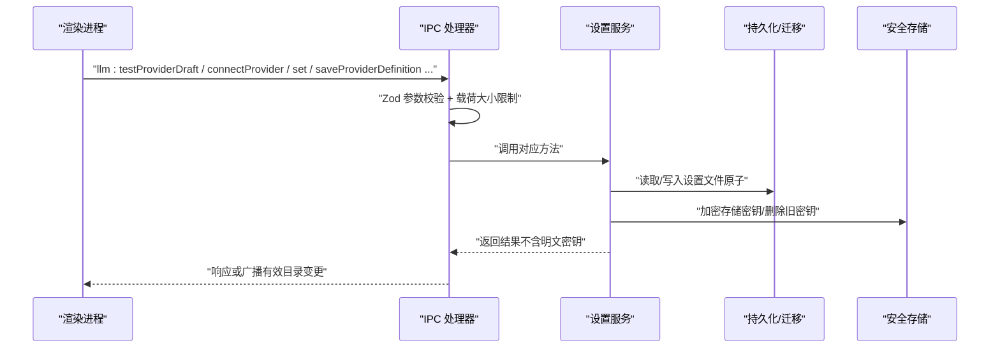
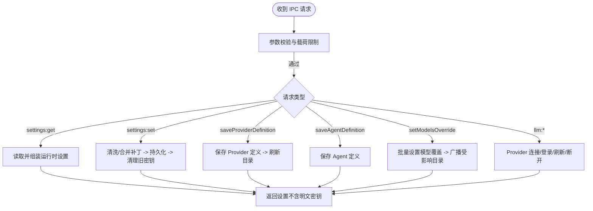
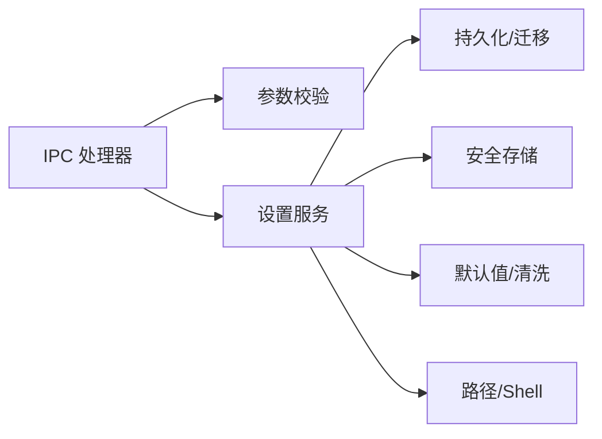

# 设置管理 API

<cite>
**本文引用的文件**
- [src/main/ipc/settingsLlmHandlers.ts](file://src/main/ipc/settingsLlmHandlers.ts)
- [src/main/settings/SettingsService.ts](file://src/main/settings/SettingsService.ts)
- [src/main/settings/SecretStorageService.ts](file://src/main/settings/SecretStorageService.ts)
- [src/main/settings/settingsDefaults.ts](file://src/main/settings/settingsDefaults.ts)
- [src/main/settings/settingsSanitize.ts](file://src/main/settings/settingsSanitize.ts)
- [src/main/settings/settingsServiceHelpers.ts](file://src/main/settings/settingsServiceHelpers.ts)
- [src/main/ipc/validation/settingsLlmSchemas.ts](file://src/main/ipc/validation/settingsLlmSchemas.ts)
</cite>

## 目录
1. [简介](#简介)
2. [项目结构](#项目结构)
3. [核心组件](#核心组件)
4. [架构总览](#架构总览)
5. [详细组件分析](#详细组件分析)
6. [依赖关系分析](#依赖关系分析)
7. [性能考量](#性能考量)
8. [故障排查指南](#故障排查指南)
9. [结论](#结论)
10. [附录：API 参考与调用示例](#附录api-参考与调用示例)

## 简介
本文件面向“设置管理”的 IPC 接口，覆盖应用配置、Provider 设置、Agent 配置的读写能力。文档重点说明：
- 设置验证与默认值处理
- 配置迁移机制（含 schema 版本升级）
- 权限控制与敏感信息加密存储
- 配置备份与恢复（基于持久化文件与原子写入）
- 批量操作支持（如 Provider 列表更新、模型覆盖批量生效）
- 完整调用示例与校验规则

该 API 通过 Electron 主进程的 IPC 通道暴露，前端渲染进程通过统一的消息协议进行调用。

## 项目结构
设置管理相关代码主要分布在以下模块：
- IPC 层：负责参数校验、路由分发、事件广播
- 服务层：SettingsService 提供统一的设置读取/写入、Provider 连接、Agent 定义等能力
- 安全存储：SecretStorageService 使用系统安全存储加密保存密钥
- 默认值与清理：settingsDefaults、settingsSanitize 提供默认值、类型与范围清洗
- 持久化与迁移：settingsServiceHelpers 负责 JSON 文件的读写、schema 版本检查与重建
- 校验模式：IPC 入参使用 Zod Schema 严格校验，防止非法数据进入系统

图表来源
- [src/main/ipc/settingsLlmHandlers.ts:52-387](file://src/main/ipc/settingsLlmHandlers.ts#L52-L387)
- [src/main/settings/SettingsService.ts:94-518](file://src/main/settings/SettingsService.ts#L94-L518)
- [src/main/settings/SecretStorageService.ts:72-262](file://src/main/settings/SecretStorageService.ts#L72-L262)
- [src/main/settings/settingsDefaults.ts:33-193](file://src/main/settings/settingsDefaults.ts#L33-L193)
- [src/main/settings/settingsSanitize.ts:42-278](file://src/main/settings/settingsSanitize.ts#L42-L278)
- [src/main/settings/settingsServiceHelpers.ts:100-408](file://src/main/settings/settingsServiceHelpers.ts#L100-L408)
- [src/main/ipc/validation/settingsLlmSchemas.ts:1-104](file://src/main/ipc/validation/settingsLlmSchemas.ts#L1-L104)

章节来源
- [src/main/ipc/settingsLlmHandlers.ts:52-387](file://src/main/ipc/settingsLlmHandlers.ts#L52-L387)
- [src/main/settings/SettingsService.ts:94-518](file://src/main/settings/SettingsService.ts#L94-L518)

## 核心组件
- IPC 处理器（settingsLlmHandlers.ts）
  - 注册并实现所有设置相关的 IPC 通道，包括获取/设置应用设置、Provider 连接与状态、Agent 定义保存与查询、模型覆盖等
  - 对入参进行严格校验，限制最大载荷大小，避免 DoS
  - 在关键变更后广播有效目录快照，保持 UI 同步
- 设置服务（SettingsService.ts）
  - 初始化时加载并重建持久化设置，执行 schema 版本检查与迁移
  - 提供 get/set 全局设置、Provider 连接、Agent 定义、模型覆盖等能力
  - 将敏感字段（如 apiKey）写入安全存储，并在返回给上层时剥离明文
- 安全存储（SecretStorageService.ts）
  - 使用系统 safeStorage 加密存储密钥，文件级权限加固
  - 提供创建引用、读写、删除、掩码预览等能力
- 默认值与清洗（settingsDefaults.ts、settingsSanitize.ts）
  - 定义各模块默认值、布局约束、权限模式集合
  - 提供严格的清洗函数，确保非法输入被归一化为安全默认值
- 持久化与迁移（settingsServiceHelpers.ts）
  - 原子写入设置文件，保证崩溃一致性
  - 读取旧版设置并进行重建，清理废弃字段与无效 Provider
  - 提供运行时设置组装、哈希计算、版本断言等工具

章节来源
- [src/main/ipc/settingsLlmHandlers.ts:52-387](file://src/main/ipc/settingsLlmHandlers.ts#L52-L387)
- [src/main/settings/SettingsService.ts:94-518](file://src/main/settings/SettingsService.ts#L94-L518)
- [src/main/settings/SecretStorageService.ts:72-262](file://src/main/settings/SecretStorageService.ts#L72-L262)
- [src/main/settings/settingsDefaults.ts:33-193](file://src/main/settings/settingsDefaults.ts#L33-L193)
- [src/main/settings/settingsSanitize.ts:42-278](file://src/main/settings/settingsSanitize.ts#L42-L278)
- [src/main/settings/settingsServiceHelpers.ts:100-408](file://src/main/settings/settingsServiceHelpers.ts#L100-L408)

## 架构总览
设置管理的请求从渲染进程发起，经 IPC 处理器校验后交由设置服务处理。设置服务负责：
- 读取/写入持久化文件（原子写入）
- 清洗与合并默认值
- 将敏感信息存入安全存储
- 在变更时触发有效目录刷新与 UI 广播

图表来源
- [src/main/ipc/settingsLlmHandlers.ts:87-387](file://src/main/ipc/settingsLlmHandlers.ts#L87-L387)
- [src/main/settings/SettingsService.ts:249-383](file://src/main/settings/SettingsService.ts#L249-L383)
- [src/main/settings/settingsServiceHelpers.ts:327-349](file://src/main/settings/settingsServiceHelpers.ts#L327-L349)
- [src/main/settings/SecretStorageService.ts:182-227](file://src/main/settings/SecretStorageService.ts#L182-L227)

## 详细组件分析

### IPC 处理器：设置与 LLM Provider
- 职责
  - 注册并处理设置读取、Provider 连接、Agent 定义保存、模型覆盖等 IPC
  - 对变更后的 Provider 广播有效目录快照，使渲染端及时刷新
- 关键行为
  - settings:get：返回包含路径信息的完整设置，并对 Agent 选项进行有效模型解析
  - settings:set：合并补丁、清洗字段、持久化、清理旧密钥、必要时广播目录变更
  - settings:saveProviderDefinition/saveAgentDefinition：保存定义并刷新有效目录
  - settings:getModelsOverride/settings:setModelsOverride：批量模型覆盖，影响多个 Provider 的有效目录
  - llm:* 系列：测试草稿、连接、刷新模型、断开、账号登录流程等

图表来源
- [src/main/ipc/settingsLlmHandlers.ts:87-387](file://src/main/ipc/settingsLlmHandlers.ts#L87-L387)

章节来源
- [src/main/ipc/settingsLlmHandlers.ts:87-387](file://src/main/ipc/settingsLlmHandlers.ts#L87-L387)

### 设置服务：读取、写入、Provider 与 Agent
- 读取
  - getAll：读取持久化设置，执行 schema 版本检查与重建，转换为运行时设置
  - getProviderCatalog/getLlmConfig：提供目录与运行时 LLM 配置视图
- 写入
  - setAll：合并补丁、清洗字段、持久化、清理旧密钥、返回运行时设置
  - saveProviderDefinition/saveAgentDefinition：委托子模块完成保存与冲突检测
  - persistWindowLayout/persistWindowLayoutAsync：窗口布局快速写入（跳过 Provider 归一化）
- Provider 与 Agent
  - 连接/断开/刷新模型、账号登录流程、旋转凭证、标记刷新失败
  - 模型覆盖：批量设置并广播受影响 Provider 的有效目录

章节来源
- [src/main/settings/SettingsService.ts:103-518](file://src/main/settings/SettingsService.ts#L103-L518)

### 安全存储：敏感信息加密与访问控制
- 加密存储
  - 使用系统 safeStorage 加密字符串，以 base64 形式持久化到 provider-secrets.json
  - 写文件采用临时文件+重命名，确保原子性；Windows 下尝试收紧 ACL
- 访问控制
  - 仅允许 safeStorage 编码的密钥，拒绝未知编码
  - 提供掩码预览，便于 UI 显示但不泄露明文
- 错误处理
  - 不可用时抛出专用异常，阻止明文落盘
  - 损坏文件自动隔离并重抛错误，避免污染

章节来源
- [src/main/settings/SecretStorageService.ts:18-262](file://src/main/settings/SecretStorageService.ts#L18-L262)

### 默认值与清洗：类型、范围与合法性保障
- 默认值
  - 外观、布局、用户资料、工具链、Agent 运行时权限等均有明确默认值
- 清洗规则
  - 字符串数组去空与去重
  - 数值范围钳制（如超时、窗口尺寸、终端高度）
  - 枚举值白名单校验（如权限模式）
  - 路径展开与规范化（支持 ~ 与 %USERPROFILE%）
- 作用
  - 确保脏数据不会破坏系统稳定性
  - 为迁移与回退提供稳定基线

章节来源
- [src/main/settings/settingsDefaults.ts:33-193](file://src/main/settings/settingsDefaults.ts#L33-L193)
- [src/main/settings/settingsSanitize.ts:42-278](file://src/main/settings/settingsSanitize.ts#L42-L278)

### 持久化与迁移：原子写入与版本升级
- 原子写入
  - 先写临时文件再重命名为目标文件，失败时清理临时文件
- 版本检查与重建
  - 读取时检查 schemaVersion，禁止高于当前支持的版本
  - 重建过程清理废弃字段、重复 Provider、fixture Provider，并记录修复与警告
- 运行时设置组装
  - 将持久化设置转换为运行时设置，注入路径、资源目录、Agent 路由等

章节来源
- [src/main/settings/settingsServiceHelpers.ts:100-408](file://src/main/settings/settingsServiceHelpers.ts#L100-L408)

### 权限控制与 Agent 运行时
- 权限模式
  - 支持 default、auto-review、full-access、custom 等模式
  - 可配置可读/可写根目录、命令前缀白/黑名单
- 上下文压缩阈值
  - 可配置上下文压缩百分比，影响 Agent 运行时的上下文预算
- 清洗与默认值
  - 通过清洗函数确保非法值被替换为安全默认值

章节来源
- [src/main/settings/settingsSanitize.ts:183-216](file://src/main/settings/settingsSanitize.ts#L183-L216)
- [src/main/settings/settingsDefaults.ts:167-178](file://src/main/settings/settingsDefaults.ts#L167-L178)

## 依赖关系分析
- IPC 处理器依赖
  - 参数校验：settingsLlmSchemas.ts
  - 设置服务：SettingsService.ts
  - 有效目录服务与 Provider 连接服务（由处理器间接调用）
- 设置服务依赖
  - 持久化与迁移：settingsServiceHelpers.ts
  - 安全存储：SecretStorageService.ts
  - 默认值与清洗：settingsDefaults.ts、settingsSanitize.ts
  - 路径与 Shell 解析：AppPathService、ShellResolver
- 安全存储依赖
  - 系统 safeStorage、文件系统、平台特定 ACL 加固

图表来源
- [src/main/ipc/settingsLlmHandlers.ts:52-387](file://src/main/ipc/settingsLlmHandlers.ts#L52-L387)
- [src/main/settings/SettingsService.ts:94-518](file://src/main/settings/SettingsService.ts#L94-L518)
- [src/main/settings/settingsServiceHelpers.ts:100-408](file://src/main/settings/settingsServiceHelpers.ts#L100-L408)
- [src/main/settings/SecretStorageService.ts:72-262](file://src/main/settings/SecretStorageService.ts#L72-L262)
- [src/main/settings/settingsDefaults.ts:33-193](file://src/main/settings/settingsDefaults.ts#L33-L193)
- [src/main/settings/settingsSanitize.ts:42-278](file://src/main/settings/settingsSanitize.ts#L42-L278)

章节来源
- [src/main/ipc/settingsLlmHandlers.ts:52-387](file://src/main/ipc/settingsLlmHandlers.ts#L52-L387)
- [src/main/settings/SettingsService.ts:94-518](file://src/main/settings/SettingsService.ts#L94-L518)

## 性能考量
- 参数校验与载荷限制
  - 每个 IPC 入口均限制最大字节数，防止恶意大负载导致内存压力
- 原子写入与最小化 I/O
  - 设置文件与安全存储均采用临时文件+重命名，减少损坏风险
- 批量操作优化
  - 模型覆盖批量生效，按受影响 Provider 广播目录变更，避免全量刷新
- 缓存与失效
  - Shell 解析器在可执行路径变更时清除缓存，避免不一致

[本节为通用指导，不直接分析具体文件]

## 故障排查指南
- 安全存储不可用
  - 现象：无法加密存储密钥
  - 处理：抛出专用异常，拒绝明文落盘；检查系统安全存储可用性
- 密钥文件损坏
  - 现象：读取失败或格式错误
  - 处理：自动隔离损坏文件并抛出错误；建议清理隔离文件后重试
- 设置文件 schema 不支持
  - 现象：schemaVersion 高于当前支持
  - 处理：抛出存储 schema 错误；需降级或升级应用版本
- Provider 未配置或无效
  - 现象：调试模式无可用 Provider
  - 处理：重建设置时会给出警告；请重新连接或配置 Provider

章节来源
- [src/main/settings/SecretStorageService.ts:18-85](file://src/main/settings/SecretStorageService.ts#L18-L85)
- [src/main/settings/settingsServiceHelpers.ts:112-126](file://src/main/settings/settingsServiceHelpers.ts#L112-L126)
- [src/main/settings/settingsServiceHelpers.ts:176-289](file://src/main/settings/settingsServiceHelpers.ts#L176-L289)

## 结论
设置管理 API 通过严格的参数校验、安全的密钥存储、健壮的默认值与清洗、以及可靠的持久化与迁移机制，提供了稳定、安全、可扩展的配置管理能力。IPC 层将复杂逻辑封装为清晰的接口，既满足前端易用性，又保证后端安全性与一致性。

[本节为总结，不直接分析具体文件]

## 附录：API 参考与调用示例

### 应用设置
- 获取设置
  - 通道：settings:get
  - 入参：无
  - 出参：完整 AppSettings（已注入路径、Agent 路由、资源目录等）
  - 注意：返回中不包含明文密钥
  - 示例：调用后根据返回的 agents.modelOptions 选择可用模型
- 设置应用设置
  - 通道：settings:set
  - 入参：AppSettingsPatch（支持 appearance/layout/profile/tooling/agentRuntime/llm.providers 等）
  - 出参：AppSettings（不含明文密钥）
  - 注意：若修改 llm.providers，将触发有效目录广播

章节来源
- [src/main/ipc/settingsLlmHandlers.ts:189-205](file://src/main/ipc/settingsLlmHandlers.ts#L189-L205)
- [src/main/ipc/settingsLlmHandlers.ts:321-341](file://src/main/ipc/settingsLlmHandlers.ts#L321-L341)
- [src/main/settings/SettingsService.ts:249-383](file://src/main/settings/SettingsService.ts#L249-L383)

### Provider 设置
- 测试草稿
  - 通道：llm:testProviderDraft
  - 入参：LlmProviderDraftRequest（providerId、authMode、apiKey/baseUrl/connectionValues/modelPreferences）
  - 出参：测试结果
  - 校验：providerId 非空且长度受限；connectionValue 键名长度受限；modelPreferences 条目上限
- 连接 Provider
  - 通道：llm:connectProvider
  - 入参：LlmProviderDraftRequest
  - 出参：连接结果；成功后应用当前 LLM 配置并广播有效目录
- 刷新 Provider 模型
  - 通道：llm:refreshProviderModels
  - 入参：providerId
  - 出参：刷新结果；成功后广播有效目录
- 断开 Provider
  - 通道：llm:disconnectProvider
  - 入参：providerId
  - 出参：断开结果；成功后广播有效目录
- 账号登录
  - 开始：llm:startProviderAccountLogin（providerId、authMode、accountLoginMode）
  - 结束：llm:finishProviderAccountLogin（providerId、code/state/flowId）
  - 状态：llm:getProviderAccountStatus（providerId）
  - 登出：llm:logoutProviderAccount（providerId）
- 检查是否拥有密钥
  - 通道：settings:hasProviderSecret
  - 入参：providerId
  - 出参：{ hasSecret, maskedPreview? }

章节来源
- [src/main/ipc/settingsLlmHandlers.ts:87-187](file://src/main/ipc/settingsLlmHandlers.ts#L87-L187)
- [src/main/ipc/validation/settingsLlmSchemas.ts:10-50](file://src/main/ipc/validation/settingsLlmSchemas.ts#L10-L50)
- [src/main/settings/SettingsService.ts:411-456](file://src/main/settings/SettingsService.ts#L411-L456)

### Agent 配置
- 导入 Agent 清单
  - 通道：settings:importAgentManifest
  - 入参：filePath
  - 出参：更新后的 AppSettings（含有效模型选项）
- 保存 Agent 定义
  - 通道：settings:saveAgentDefinition
  - 入参：AgentDefinitionSaveRequest（draft、clientRevision、scope、projectId、sourceHash）
  - 出参：保存结果（含冲突检测）
- 查询 Agent 定义提交
  - 通道：settings:getAgentDefinitionCommit
  - 入参：{ agentId, scope, projectId? }
  - 出参：提交快照

章节来源
- [src/main/ipc/settingsLlmHandlers.ts:262-286](file://src/main/ipc/settingsLlmHandlers.ts#L262-L286)
- [src/main/ipc/validation/settingsLlmSchemas.ts:52-90](file://src/main/ipc/validation/settingsLlmSchemas.ts#L52-L90)
- [src/main/settings/SettingsService.ts:385-395](file://src/main/settings/SettingsService.ts#L385-L395)

### 模型覆盖（批量）
- 获取模型覆盖
  - 通道：settings:getModelsOverride
  - 入参：无
  - 出参：ModelsOverride
- 设置模型覆盖
  - 通道：settings:setModelsOverride
  - 入参：ModelsOverride
  - 出参：保存结果；受影响 Provider 的有效目录将被广播

章节来源
- [src/main/ipc/settingsLlmHandlers.ts:366-386](file://src/main/ipc/settingsLlmHandlers.ts#L366-L386)
- [src/main/ipc/validation/settingsLlmSchemas.ts:99-104](file://src/main/ipc/validation/settingsLlmSchemas.ts#L99-L104)

### 其他设置
- 获取 Provider 目录
  - 通道：settings:getProviderCatalog
  - 入参：无
  - 出参：Provider 目录
- 获取有效模型
  - 通道：settings:getEffectiveModel
  - 入参：agentId
  - 出参：有效模型能力信息
- 获取有效目录
  - 通道：settings:getEffectiveCatalog
  - 入参：providerId, accountId?
  - 出参：有效目录快照
- 解析 Shell
  - 通道：settings:getResolvedShell
  - 入参：executable
  - 出参：解析结果（ok/kind/version/executable/label）

章节来源
- [src/main/ipc/settingsLlmHandlers.ts:207-260](file://src/main/ipc/settingsLlmHandlers.ts#L207-L260)
- [src/main/ipc/settingsLlmHandlers.ts:343-365](file://src/main/ipc/settingsLlmHandlers.ts#L343-L365)

### 验证规则与默认值
- 参数校验
  - 所有 IPC 入参均通过 Zod Schema 严格校验，包含长度限制、枚举白名单、必填项等
- 默认值
  - 外观、布局、工具链、Agent 运行时权限等均有默认值；非法输入会被清洗为默认值
- 迁移
  - 启动或写入时执行 schema 版本检查与重建；移除废弃字段与无效 Provider，记录修复与警告

章节来源
- [src/main/ipc/validation/settingsLlmSchemas.ts:1-104](file://src/main/ipc/validation/settingsLlmSchemas.ts#L1-L104)
- [src/main/settings/settingsDefaults.ts:33-193](file://src/main/settings/settingsDefaults.ts#L33-L193)
- [src/main/settings/settingsSanitize.ts:42-278](file://src/main/settings/settingsSanitize.ts#L42-L278)
- [src/main/settings/settingsServiceHelpers.ts:112-289](file://src/main/settings/settingsServiceHelpers.ts#L112-L289)

### 敏感信息加密存储
- 存储位置
  - 密钥以加密形式保存在 secretsPath/provider-secrets.json
- 加密方式
  - 使用系统 safeStorage 加密，base64 编码存储
- 访问控制
  - 仅允许 safeStorage 编码；未知编码拒绝访问
  - 提供掩码预览用于 UI 显示
- 文件安全
  - 写文件采用临时文件+重命名；Windows 下尝试收紧 ACL

章节来源
- [src/main/settings/SecretStorageService.ts:72-262](file://src/main/settings/SecretStorageService.ts#L72-L262)

### 配置备份与恢复
- 备份
  - 设置文件位于 settingsPath，可通过复制该文件进行备份
  - 密钥文件位于 secretsPath/provider-secrets.json，同样可备份
- 恢复
  - 将备份文件放回原路径即可恢复
  - 应用启动或写入时会执行 schema 版本检查与重建，确保兼容性
- 原子写入
  - 所有写入均通过临时文件+重命名，降低损坏风险

章节来源
- [src/main/settings/settingsServiceHelpers.ts:327-349](file://src/main/settings/settingsServiceHelpers.ts#L327-L349)