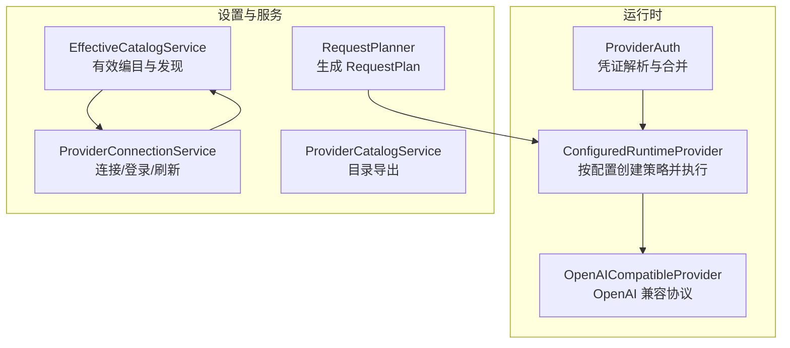
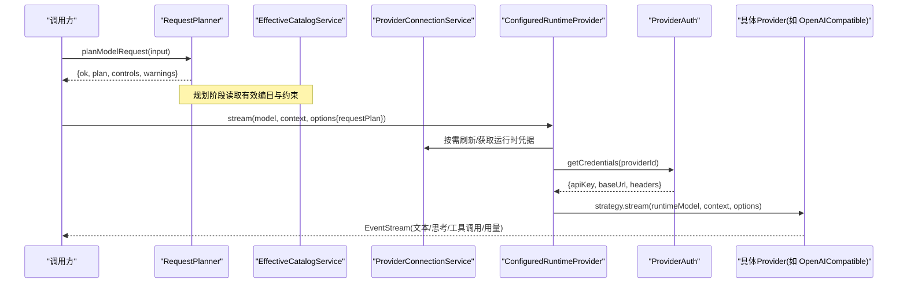
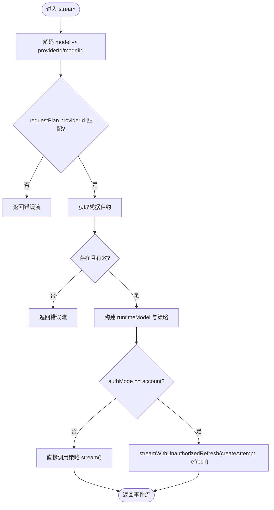
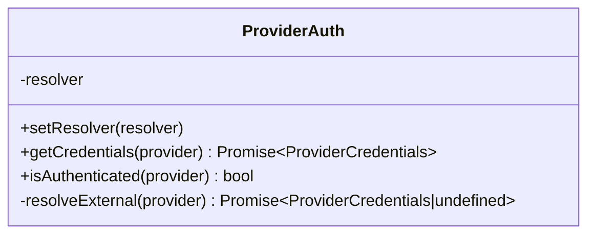
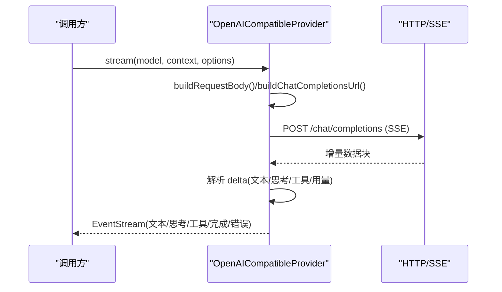
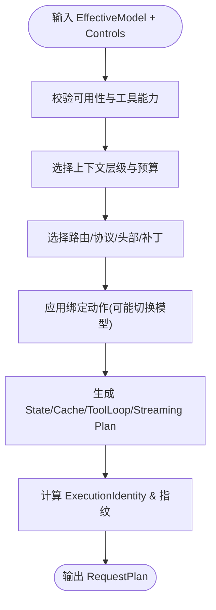
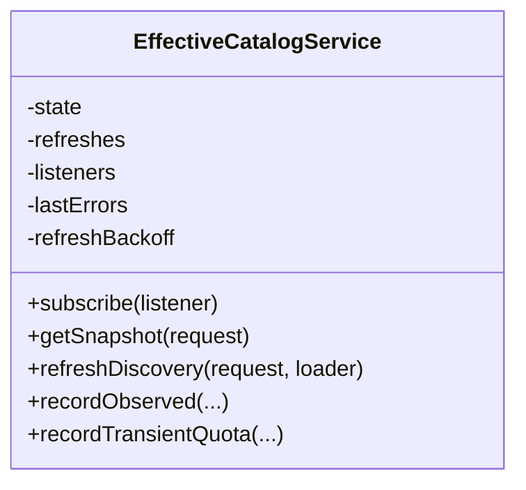
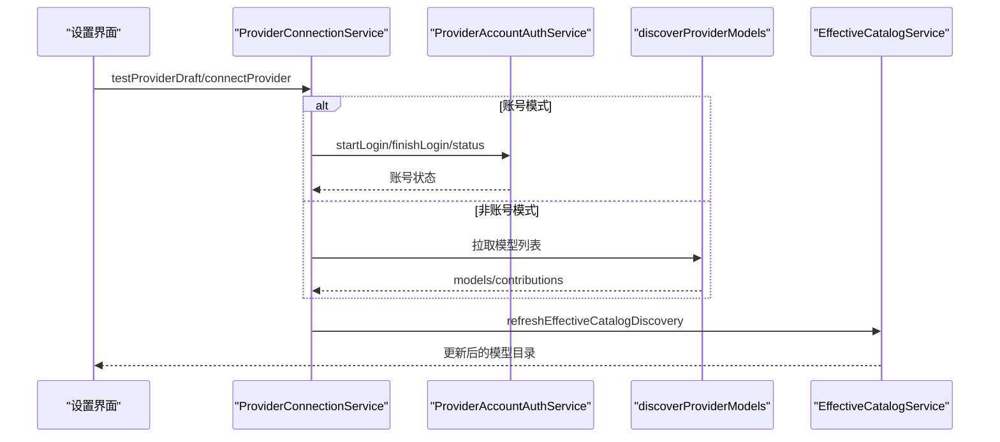
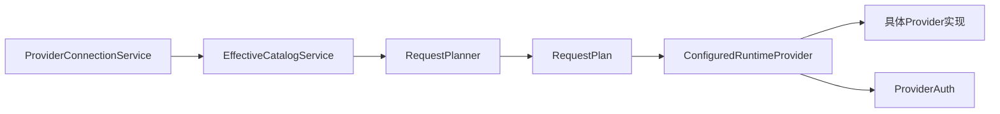

# Provider API

<cite>
**本文引用的文件**
- [src/main/agent-runtime/providers/index.ts](file://src/main/agent-runtime/providers/index.ts)
- [src/main/agent-runtime/providers/ProviderAuth.ts](file://src/main/agent-runtime/providers/ProviderAuth.ts)
- [src/main/agent-runtime/providers/ConfiguredRuntimeProvider.ts](file://src/main/agent-runtime/providers/ConfiguredRuntimeProvider.ts)
- [src/main/agent-runtime/providers/OpenAICompatibleProvider.ts](file://src/main/agent-runtime/providers/OpenAICompatibleProvider.ts)
- [src/main/agent-runtime/providers/AccountStreamRetry.ts](file://src/main/agent-runtime/providers/AccountStreamRetry.ts)
- [src/main/settings/RequestPlanner.ts](file://src/main/settings/RequestPlanner.ts)
- [src/main/settings/EffectiveCatalogService.ts](file://src/main/settings/EffectiveCatalogService.ts)
- [src/main/settings/ProviderConnectionService.ts](file://src/main/settings/ProviderConnectionService.ts)
- [src/main/settings/ProviderCatalogService.ts](file://src/main/settings/ProviderCatalogService.ts)
</cite>

## 目录
1. [简介](#简介)
2. [项目结构](#项目结构)
3. [核心组件](#核心组件)
4. [架构总览](#架构总览)
5. [详细组件分析](#详细组件分析)
6. [依赖关系分析](#依赖关系分析)
7. [性能与可靠性](#性能与可靠性)
8. [故障排查指南](#故障排查指南)
9. [结论](#结论)
10. [附录：自定义 Provider 开发指南](#附录自定义-provider-开发指南)

## 简介
本文件为 RDC-Agent 的 Provider API 提供统一接口规范与实现说明，覆盖 LLM 提供商的统一接入、连接管理、认证处理、请求规划、响应处理、注册发现、配置与生命周期管理。文档同时给出多提供商支持、负载均衡（路由选择）、错误重试与性能监控的实践建议，并提供自定义 Provider 的开发指南与集成示例路径。

## 项目结构
Provider 相关能力主要分布在以下模块：
- 运行时 Provider 层：封装具体厂商协议适配与流式调用
- 设置与服务层：负责目录发现、模型编目、连接管理与凭证服务
- 请求规划器：将高层意图转化为可执行的请求计划（含路由、头部、缓存、状态等）

图表来源
- [src/main/agent-runtime/providers/ConfiguredRuntimeProvider.ts:119-244](file://src/main/agent-runtime/providers/ConfiguredRuntimeProvider.ts#L119-L244)
- [src/main/agent-runtime/providers/OpenAICompatibleProvider.ts:109-177](file://src/main/agent-runtime/providers/OpenAICompatibleProvider.ts#L109-L177)
- [src/main/agent-runtime/providers/ProviderAuth.ts:34-83](file://src/main/agent-runtime/providers/ProviderAuth.ts#L34-L83)
- [src/main/settings/RequestPlanner.ts:123-539](file://src/main/settings/RequestPlanner.ts#L123-L539)
- [src/main/settings/EffectiveCatalogService.ts:84-163](file://src/main/settings/EffectiveCatalogService.ts#L84-L163)
- [src/main/settings/ProviderConnectionService.ts:53-109](file://src/main/settings/ProviderConnectionService.ts#L53-L109)
- [src/main/settings/ProviderCatalogService.ts:57-73](file://src/main/settings/ProviderCatalogService.ts#L57-L73)

章节来源
- [src/main/agent-runtime/providers/index.ts:1-40](file://src/main/agent-runtime/providers/index.ts#L1-L40)
- [src/main/agent-runtime/providers/ConfiguredRuntimeProvider.ts:1-352](file://src/main/agent-runtime/providers/ConfiguredRuntimeProvider.ts#L1-L352)
- [src/main/settings/RequestPlanner.ts:1-540](file://src/main/settings/RequestPlanner.ts#L1-L540)
- [src/main/settings/EffectiveCatalogService.ts:1-453](file://src/main/settings/EffectiveCatalogService.ts#L1-L453)
- [src/main/settings/ProviderConnectionService.ts:1-356](file://src/main/settings/ProviderConnectionService.ts#L1-L356)
- [src/main/settings/ProviderCatalogService.ts:1-73](file://src/main/settings/ProviderCatalogService.ts#L1-L73)

## 核心组件
- 运行时 Provider 抽象与注册
  - 通过 ProviderRegistry 注册内置 Provider 策略，并在运行时根据配置动态选择具体实现
  - 入口导出与内置注册函数用于集中装配
- 配置化运行时 Provider
  - 根据 Model 与 RequestPlan 动态构造具体 Provider 实例，注入密钥、Base URL、协议与请求头
  - 对账户模式进行自动刷新与重试
- 凭证桥接层
  - 统一从外部解析器或环境变量获取 apiKey、baseUrl、headers，并合并优先级
- 请求规划器
  - 将 EffectiveModel、控制参数、上下文预算、工具循环、推理模式等综合为 RequestPlan
  - 输出稳定标识、路由、头部补丁、缓存策略、状态模式等
- 编目与连接服务
  - 发现与合并模型目录，持久化快照与失效策略
  - 提供连接测试、账号登录、刷新模型列表等能力
  - 对外暴露 Provider 目录摘要

章节来源
- [src/main/agent-runtime/providers/index.ts:21-40](file://src/main/agent-runtime/providers/index.ts#L21-L40)
- [src/main/agent-runtime/providers/ConfiguredRuntimeProvider.ts:119-244](file://src/main/agent-runtime/providers/ConfiguredRuntimeProvider.ts#L119-L244)
- [src/main/agent-runtime/providers/ProviderAuth.ts:21-83](file://src/main/agent-runtime/providers/ProviderAuth.ts#L21-L83)
- [src/main/settings/RequestPlanner.ts:123-539](file://src/main/settings/RequestPlanner.ts#L123-L539)
- [src/main/settings/EffectiveCatalogService.ts:84-163](file://src/main/settings/EffectiveCatalogService.ts#L84-L163)
- [src/main/settings/ProviderConnectionService.ts:53-109](file://src/main/settings/ProviderConnectionService.ts#L53-L109)
- [src/main/settings/ProviderCatalogService.ts:57-73](file://src/main/settings/ProviderCatalogService.ts#L57-L73)

## 架构总览
下图展示从“请求规划”到“Provider 执行”的关键流程，以及“编目发现”和“连接管理”的支撑作用。

图表来源
- [src/main/settings/RequestPlanner.ts:123-539](file://src/main/settings/RequestPlanner.ts#L123-L539)
- [src/main/settings/EffectiveCatalogService.ts:150-163](file://src/main/settings/EffectiveCatalogService.ts#L150-L163)
- [src/main/settings/ProviderConnectionService.ts:53-109](file://src/main/settings/ProviderConnectionService.ts#L53-L109)
- [src/main/agent-runtime/providers/ConfiguredRuntimeProvider.ts:257-348](file://src/main/agent-runtime/providers/ConfiguredRuntimeProvider.ts#L257-L348)
- [src/main/agent-runtime/providers/ProviderAuth.ts:42-52](file://src/main/agent-runtime/providers/ProviderAuth.ts#L42-L52)
- [src/main/agent-runtime/providers/OpenAICompatibleProvider.ts:127-177](file://src/main/agent-runtime/providers/OpenAICompatibleProvider.ts#L127-L177)

## 详细组件分析

### 配置化运行时 Provider（ConfiguredRuntimeProvider）
- 职责
  - 解码 Model 中的 providerId/modelId，校验 requestPlan 一致性
  - 通过运行时凭据服务获取冻结的凭据租约，构建最终 runtimeModel
  - 根据协议与适配器 ID 创建具体 Provider 策略，注入 baseUrl、headers、授权方式等
  - 对账户模式启用未授权刷新与重试
- 关键点
  - 本地 Ollama Base URL 规范化
  - Bedrock 使用请求级签名授权器而非显式 apiKey
  - 账户模式下失败时触发强制刷新并重试一次

图表来源
- [src/main/agent-runtime/providers/ConfiguredRuntimeProvider.ts:257-348](file://src/main/agent-runtime/providers/ConfiguredRuntimeProvider.ts#L257-L348)
- [src/main/agent-runtime/providers/AccountStreamRetry.ts:22-70](file://src/main/agent-runtime/providers/AccountStreamRetry.ts#L22-L70)

章节来源
- [src/main/agent-runtime/providers/ConfiguredRuntimeProvider.ts:1-352](file://src/main/agent-runtime/providers/ConfiguredRuntimeProvider.ts#L1-L352)
- [src/main/agent-runtime/providers/AccountStreamRetry.ts:1-71](file://src/main/agent-runtime/providers/AccountStreamRetry.ts#L1-L71)

### 凭证桥接（ProviderAuth）
- 职责
  - 提供统一的凭证查询入口，优先外部解析器，回退环境变量
  - 支持通用键名映射与已知厂商默认值
  - 提供快速同步认证检查
- 行为
  - getCredentials 合并 resolver 与 env 的 apiKey/baseUrl/headers
  - wellKnownApiKey/BaseUrl 对常见厂商提供默认值与回退

图表来源
- [src/main/agent-runtime/providers/ProviderAuth.ts:34-83](file://src/main/agent-runtime/providers/ProviderAuth.ts#L34-L83)

章节来源
- [src/main/agent-runtime/providers/ProviderAuth.ts:1-168](file://src/main/agent-runtime/providers/ProviderAuth.ts#L1-L168)

### OpenAI 兼容 Provider（OpenAICompatibleProvider）
- 职责
  - 以原生 fetch + SSE 实现 Chat Completions 协议族
  - 组装消息体、工具定义、推理内容、提示词缓存键/断点
  - 解析增量流，产出文本、思考、工具调用与用量统计
- 关键逻辑
  - 构建 URL 与请求头，支持 Bearer 或无鉴权（由外部授权器签名）
  - 流式解析中维护“思考/文本”通道切换与工具调用分片
  - 异常归一化与空流检测

图表来源
- [src/main/agent-runtime/providers/OpenAICompatibleProvider.ts:127-177](file://src/main/agent-runtime/providers/OpenAICompatibleProvider.ts#L127-L177)
- [src/main/agent-runtime/providers/OpenAICompatibleProvider.ts:327-366](file://src/main/agent-runtime/providers/OpenAICompatibleProvider.ts#L327-L366)
- [src/main/agent-runtime/providers/OpenAICompatibleProvider.ts:369-377](file://src/main/agent-runtime/providers/OpenAICompatibleProvider.ts#L369-L377)

章节来源
- [src/main/agent-runtime/providers/OpenAICompatibleProvider.ts:1-536](file://src/main/agent-runtime/providers/OpenAICompatibleProvider.ts#L1-L536)

### 请求规划器（RequestPlanner）
- 职责
  - 校验模型可用性、工具能力、上下文层级与预算
  - 选择路由与协议版本，应用绑定动作（请求体补丁、头部、模型切换）
  - 生成 ExecutionIdentity、StatePlan、CachePlan、ToolLoopPlan、StreamingPlan
  - 输出稳定的 variantKey、fingerprint 等标识
- 关键决策
  - 上下文层级激活（header/body 两种载体）
  - 推理模式选择与 wire 控制
  - 工具循环续传与兼容性组

图表来源
- [src/main/settings/RequestPlanner.ts:123-539](file://src/main/settings/RequestPlanner.ts#L123-L539)

章节来源
- [src/main/settings/RequestPlanner.ts:1-540](file://src/main/settings/RequestPlanner.ts#L1-L540)

### 编目服务（EffectiveCatalogService）
- 职责
  - 聚合 discovery/entitlement/observed 多层贡献，生成有效模型快照
  - 支持 TTL、失效、指数退避刷新、持久化状态
  - 记录瞬时配额与观察证据，避免频繁刷新
- 关键特性
  - 订阅机制通知渲染端最新快照
  - 去抖与并发刷新保护
  - 安全过滤与规范化

图表来源
- [src/main/settings/EffectiveCatalogService.ts:84-163](file://src/main/settings/EffectiveCatalogService.ts#L84-L163)
- [src/main/settings/EffectiveCatalogService.ts:246-298](file://src/main/settings/EffectiveCatalogService.ts#L246-L298)
- [src/main/settings/EffectiveCatalogService.ts:300-340](file://src/main/settings/EffectiveCatalogService.ts#L300-L340)

章节来源
- [src/main/settings/EffectiveCatalogService.ts:1-453](file://src/main/settings/EffectiveCatalogService.ts#L1-L453)

### 连接服务（ProviderConnectionService）
- 职责
  - 创建有效编目的 DiscoveryLoader
  - 测试/连接/刷新/断开 Provider
  - 账号登录流程（开始/结束/状态/登出）
- 关键流程
  - 账号模式走 AccountAuthService；非账号模式走 discoverProviderModels
  - 连接成功后刷新有效编目并保存模型偏好

图表来源
- [src/main/settings/ProviderConnectionService.ts:53-109](file://src/main/settings/ProviderConnectionService.ts#L53-L109)
- [src/main/settings/ProviderConnectionService.ts:111-198](file://src/main/settings/ProviderConnectionService.ts#L111-L198)
- [src/main/settings/ProviderConnectionService.ts:200-314](file://src/main/settings/ProviderConnectionService.ts#L200-L314)

章节来源
- [src/main/settings/ProviderConnectionService.ts:1-356](file://src/main/settings/ProviderConnectionService.ts#L1-L356)

### 目录服务（ProviderCatalogService）
- 职责
  - 汇总分类、协议定义与 Provider 摘要
  - 排序与标准化字段，供上层展示与消费

章节来源
- [src/main/settings/ProviderCatalogService.ts:1-73](file://src/main/settings/ProviderCatalogService.ts#L1-L73)

## 依赖关系分析
- 低耦合分层
  - 运行时 Provider 仅依赖抽象策略与事件流，不直接访问设置或存储
  - 凭证桥接解耦了密钥来源（外部解析器 vs 环境变量）
  - 请求规划器与编目服务通过共享类型与契约协作
- 关键依赖链
  - ConfiguredRuntimeProvider → 具体 Provider（OpenAI/Azure/Gemini/Anthropic/Ollama 等）
  - RequestPlanner → EffectiveCatalogService（模型与路由信息）
  - ProviderConnectionService → EffectiveCatalogService（刷新与持久化）
  - ProviderAuth → 外部解析器/环境变量

图表来源
- [src/main/settings/RequestPlanner.ts:123-539](file://src/main/settings/RequestPlanner.ts#L123-L539)
- [src/main/agent-runtime/providers/ConfiguredRuntimeProvider.ts:257-348](file://src/main/agent-runtime/providers/ConfiguredRuntimeProvider.ts#L257-L348)
- [src/main/settings/EffectiveCatalogService.ts:150-163](file://src/main/settings/EffectiveCatalogService.ts#L150-L163)
- [src/main/settings/ProviderConnectionService.ts:53-109](file://src/main/settings/ProviderConnectionService.ts#L53-L109)

章节来源
- [src/main/agent-runtime/providers/ConfiguredRuntimeProvider.ts:1-352](file://src/main/agent-runtime/providers/ConfiguredRuntimeProvider.ts#L1-L352)
- [src/main/settings/RequestPlanner.ts:1-540](file://src/main/settings/RequestPlanner.ts#L1-L540)
- [src/main/settings/EffectiveCatalogService.ts:1-453](file://src/main/settings/EffectiveCatalogService.ts#L1-L453)
- [src/main/settings/ProviderConnectionService.ts:1-356](file://src/main/settings/ProviderConnectionService.ts#L1-L356)

## 性能与可靠性
- 流式处理与背压
  - 基于 EventStream 的事件驱动流，天然支持取消与背压
  - 在 OpenAI 兼容 Provider 中使用 AbortSignal 组合，确保中断及时传播
- 重试与恢复
  - 账户模式下 401 自动刷新凭据并重试一次
  - 编目刷新采用指数退避，避免雪崩
- 缓存与预算
  - 请求规划器计算上下文预算与压缩阈值，减少无效请求
  - 提示词缓存键/断点与用量统计结合，降低重复成本
- 监控与度量
  - 用量统计从响应 usage 字段提取并写入事件流
  - 编目服务记录最后错误与刷新时间戳，便于观测

[本节为通用指导，不直接分析具体文件]

## 故障排查指南
- 401 未授权
  - 现象：首次尝试失败，随后自动刷新并重试
  - 定位：检查 ProviderAuth 解析器是否注入成功、环境变量是否正确
  - 参考路径
    - [src/main/agent-runtime/providers/AccountStreamRetry.ts:10-16](file://src/main/agent-runtime/providers/AccountStreamRetry.ts#L10-L16)
    - [src/main/agent-runtime/providers/ConfiguredRuntimeProvider.ts:340-347](file://src/main/agent-runtime/providers/ConfiguredRuntimeProvider.ts#L340-L347)
- 空流或无输出
  - 现象：流结束但未产生任何语义内容
  - 定位：OpenAI 兼容 Provider 会抛出空流错误
  - 参考路径
    - [src/main/agent-runtime/providers/OpenAICompatibleProvider.ts:312-314](file://src/main/agent-runtime/providers/OpenAICompatibleProvider.ts#L312-L314)
- 请求规划冲突
  - 现象：执行绑定或上下文层级导致 PLAN_CONFLICT
  - 定位：检查 binding 的 header/patch 冲突与模型切换限制
  - 参考路径
    - [src/main/settings/RequestPlanner.ts:281-326](file://src/main/settings/RequestPlanner.ts#L281-L326)
- 编目刷新失败
  - 现象：catalog 长时间 stale 或 lastRefreshError 存在
  - 定位：查看刷新退避窗口与错误日志
  - 参考路径
    - [src/main/settings/EffectiveCatalogService.ts:390-415](file://src/main/settings/EffectiveCatalogService.ts#L390-L415)

章节来源
- [src/main/agent-runtime/providers/AccountStreamRetry.ts:1-71](file://src/main/agent-runtime/providers/AccountStreamRetry.ts#L1-L71)
- [src/main/agent-runtime/providers/ConfiguredRuntimeProvider.ts:340-347](file://src/main/agent-runtime/providers/ConfiguredRuntimeProvider.ts#L340-L347)
- [src/main/agent-runtime/providers/OpenAICompatibleProvider.ts:312-314](file://src/main/agent-runtime/providers/OpenAICompatibleProvider.ts#L312-L314)
- [src/main/settings/RequestPlanner.ts:281-326](file://src/main/settings/RequestPlanner.ts#L281-L326)
- [src/main/settings/EffectiveCatalogService.ts:390-415](file://src/main/settings/EffectiveCatalogService.ts#L390-L415)

## 结论
RDC-Agent 的 Provider API 通过“请求规划 + 配置化运行时 + 凭证桥接 + 编目服务”的分层设计，实现了多厂商 LLM 的统一接入与高可靠运行。其优势在于：
- 强类型与契约化的请求计划，保证跨层一致性
- 灵活的凭证与路由注入，支持多种认证与协议变体
- 完善的流式处理、重试与监控，提升用户体验与可观测性
- 可扩展的编目与连接服务，便于新增 Provider 与协议

[本节为总结性内容，不直接分析具体文件]

## 附录：自定义 Provider 开发指南
- 目标
  - 实现一个符合 ProviderStrategy 的新 Provider，并通过注册表暴露给运行时
- 步骤
  1. 新建 Provider 类，实现 stream(model, context, options) 方法，返回 EventStream
  2. 在运行时注册表中注册该 Provider 策略
  3. 如需支持特定协议，完善协议到适配器的映射与头部/查询参数处理
  4. 若需要账号登录或编目发现，对接 ProviderConnectionService 与 EffectiveCatalogService
- 参考路径
  - 内置注册入口
    - [src/main/agent-runtime/providers/index.ts:21-40](file://src/main/agent-runtime/providers/index.ts#L21-L40)
  - 运行时策略接口与事件流
    - [src/main/agent-runtime/providers/ConfiguredRuntimeProvider.ts:119-244](file://src/main/agent-runtime/providers/ConfiguredRuntimeProvider.ts#L119-L244)
  - 流式实现参考（OpenAI 兼容）
    - [src/main/agent-runtime/providers/OpenAICompatibleProvider.ts:127-177](file://src/main/agent-runtime/providers/OpenAICompatibleProvider.ts#L127-L177)
  - 凭证注入与合并
    - [src/main/agent-runtime/providers/ProviderAuth.ts:42-52](file://src/main/agent-runtime/providers/ProviderAuth.ts#L42-L52)
  - 编目与连接
    - [src/main/settings/ProviderConnectionService.ts:53-109](file://src/main/settings/ProviderConnectionService.ts#L53-L109)
    - [src/main/settings/EffectiveCatalogService.ts:150-163](file://src/main/settings/EffectiveCatalogService.ts#L150-L163)

[本节为实践指引，不直接分析具体文件]