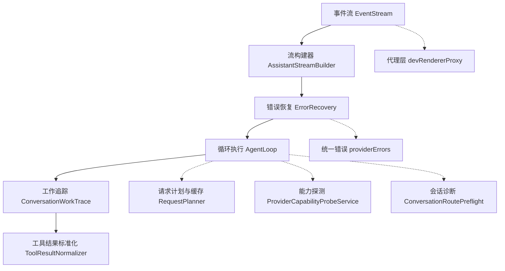
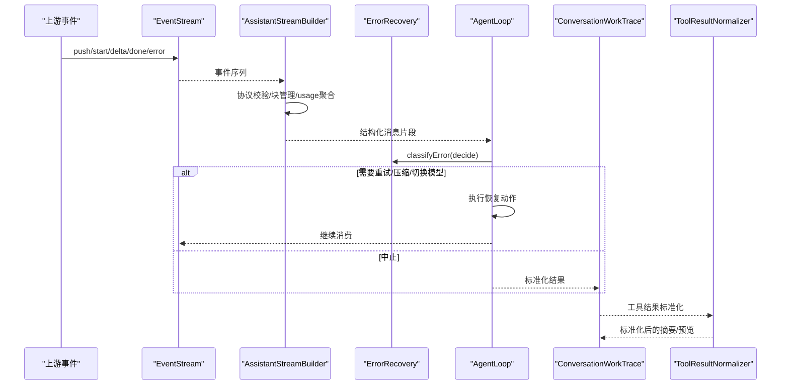
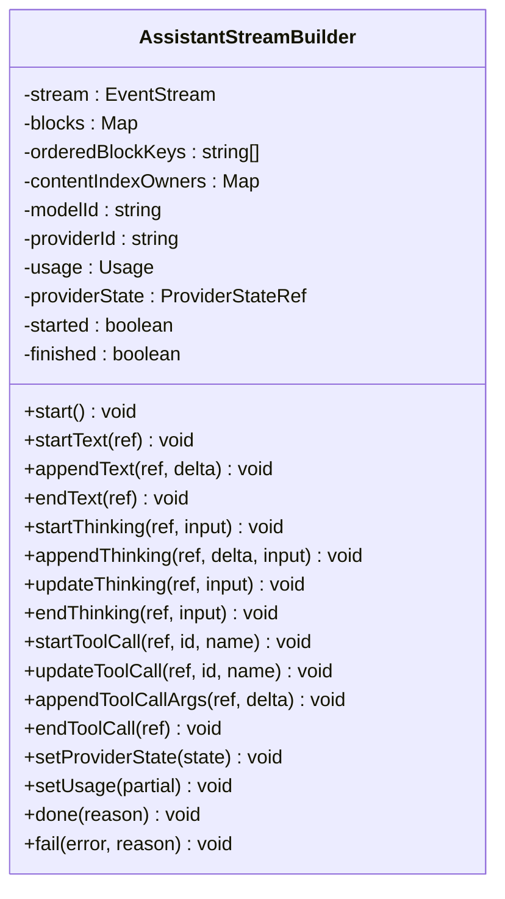
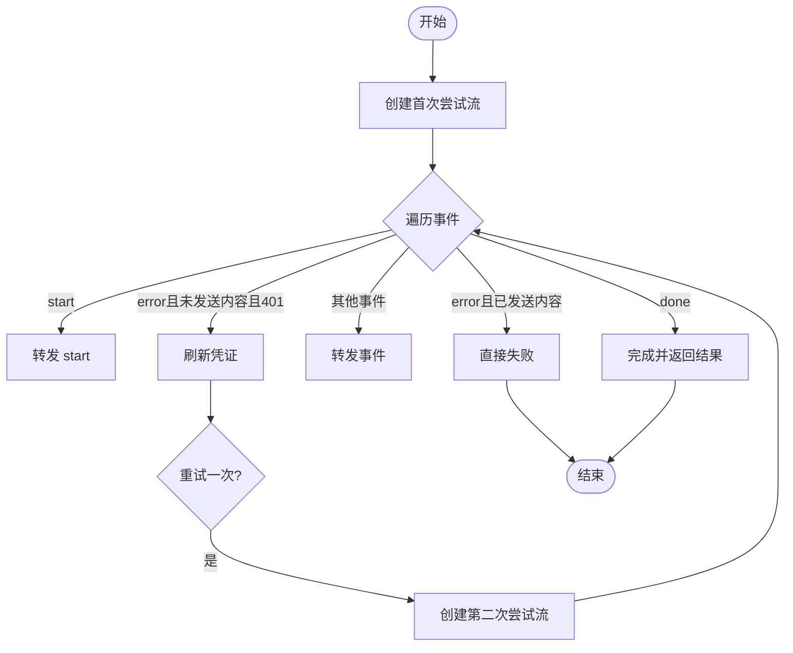
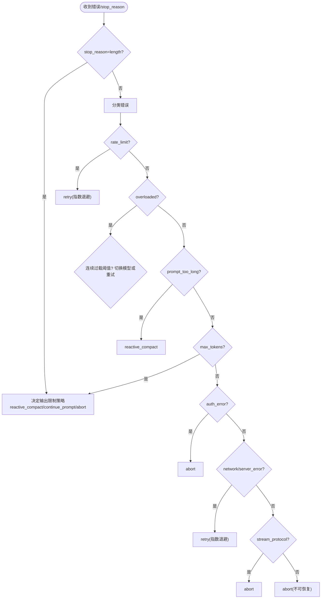
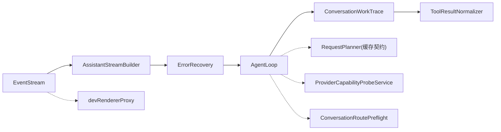

# 响应处理

<cite>
**本文引用的文件**
- [EventStream.ts](file://src/main/agent-runtime/core/EventStream.ts)
- [AssistantStreamBuilder.ts](file://src/main/agent-runtime/providers/internal/AssistantStreamBuilder.ts)
- [AccountStreamRetry.ts](file://src/main/agent-runtime/providers/AccountStreamRetry.ts)
- [ErrorRecovery.ts](file://src/main/agent-runtime/agent/ErrorRecovery.ts)
- [AgentLoop.ts](file://src/main/agent-runtime/agent/AgentLoop.ts)
- [ToolResultNormalizer.ts](file://src/main/agent-trace/ToolResultNormalizer.ts)
- [ConversationWorkTrace.ts](file://src/main/conversation/ConversationWorkTrace.ts)
- [providerErrors.ts](file://src/shared/types/providerErrors.ts)
- [RequestPlanner.test.ts](file://src/main/settings/RequestPlanner.test.ts)
- [ProviderCapabilityProbeService.ts](file://src/main/settings/ProviderCapabilityProbeService.ts)
- [devRendererProxy.ts](file://src/main/browserAppBridge/devRendererProxy.ts)
- [ConversationRoutePreflight.ts](file://src/main/conversation/ConversationRoutePreflight.ts)
</cite>

## 目录
1. [简介](#简介)
2. [项目结构](#项目结构)
3. [核心组件](#核心组件)
4. [架构总览](#架构总览)
5. [详细组件分析](#详细组件分析)
6. [依赖关系分析](#依赖关系分析)
7. [性能考虑](#性能考虑)
8. [故障排查指南](#故障排查指南)
9. [结论](#结论)
10. [附录](#附录)

## 简介
本文件聚焦于“响应处理”全链路，覆盖以下目标：
- 响应数据标准化与结果投影
- 流式处理、错误转换与诊断
- 元数据处理（模型、提供者、时间戳等）
- 成本计算与使用统计（用量、缓存命中、推理令牌等）
- 响应缓存、重试机制与降级策略
- 响应处理管道配置与自定义处理器开发指南
- 性能优化技巧与调试方法

## 项目结构
响应处理贯穿“事件流 → 构建器 → 错误恢复 → 工作追踪 → 工具结果标准化”的链路。关键位置如下：
- 通用异步事件流：EventStream
- 流式消息构建与协议校验：AssistantStreamBuilder
- 账户认证失败时的流重试：AccountStreamRetry
- 错误分类与恢复策略：ErrorRecovery
- 循环执行与恢复调度：AgentLoop
- 工作追踪中的结果规范化：ConversationWorkTrace
- 工具结果标准化：ToolResultNormalizer
- 统一错误码与诊断类型：providerErrors
- 请求计划与缓存契约：RequestPlanner.test
- 能力探测与观测记录：ProviderCapabilityProbeService
- 代理层超时与错误响应：devRendererProxy
- 会话级流协议违规诊断：ConversationRoutePreflight

图表来源
- [EventStream.ts:1-273](file://src/main/agent-runtime/core/EventStream.ts#L1-L273)
- [AssistantStreamBuilder.ts:1-474](file://src/main/agent-runtime/providers/internal/AssistantStreamBuilder.ts#L1-L474)
- [ErrorRecovery.ts:1-488](file://src/main/agent-runtime/agent/ErrorRecovery.ts#L1-L488)
- [AgentLoop.ts:487-534](file://src/main/agent-runtime/agent/AgentLoop.ts#L487-L534)
- [ConversationWorkTrace.ts:522-552](file://src/main/conversation/ConversationWorkTrace.ts#L522-L552)
- [ToolResultNormalizer.ts:1-71](file://src/main/agent-trace/ToolResultNormalizer.ts#L1-L71)
- [providerErrors.ts:1-39](file://src/shared/types/providerErrors.ts#L1-L39)
- [RequestPlanner.test.ts:463-503](file://src/main/settings/RequestPlanner.test.ts#L463-L503)
- [ProviderCapabilityProbeService.ts:184-246](file://src/main/settings/ProviderCapabilityProbeService.ts#L184-L246)
- [devRendererProxy.ts:122-166](file://src/main/browserAppBridge/devRendererProxy.ts#L122-L166)
- [ConversationRoutePreflight.ts:549-574](file://src/main/conversation/ConversationRoutePreflight.ts#L549-L574)

章节来源
- [EventStream.ts:1-273](file://src/main/agent-runtime/core/EventStream.ts#L1-L273)
- [AssistantStreamBuilder.ts:1-474](file://src/main/agent-runtime/providers/internal/AssistantStreamBuilder.ts#L1-L474)
- [ErrorRecovery.ts:1-488](file://src/main/agent-runtime/agent/ErrorRecovery.ts#L1-L488)
- [AgentLoop.ts:487-534](file://src/main/agent-runtime/agent/AgentLoop.ts#L487-L534)
- [ConversationWorkTrace.ts:522-552](file://src/main/conversation/ConversationWorkTrace.ts#L522-L552)
- [ToolResultNormalizer.ts:1-71](file://src/main/agent-trace/ToolResultNormalizer.ts#L1-L71)
- [providerErrors.ts:1-39](file://src/shared/types/providerErrors.ts#L1-L39)
- [RequestPlanner.test.ts:463-503](file://src/main/settings/RequestPlanner.test.ts#L463-L503)
- [ProviderCapabilityProbeService.ts:184-246](file://src/main/settings/ProviderCapabilityProbeService.ts#L184-L246)
- [devRendererProxy.ts:122-166](file://src/main/browserAppBridge/devRendererProxy.ts#L122-L166)
- [ConversationRoutePreflight.ts:549-574](file://src/main/conversation/ConversationRoutePreflight.ts#L549-L574)

## 核心组件
- 事件流 EventStream：提供可迭代与一次性获取最终结果的两种消费方式；支持 map/filter/tap 链式转换；内置完成、错误、中止语义；对外暴露 AbortSignal 以配合网络取消。
- 流构建器 AssistantStreamBuilder：将底层事件转换为统一的 AssistantMessage 流；维护文本、思考、工具调用块的生命周期；聚合 usage（输入/输出/总计、缓存命中/写入、推理令牌、速度）、providerState、stopReason、时间戳等元数据；对协议违规抛出结构化错误。
- 账户流重试 AccountStreamRetry：在首次尝试未发出任何内容前遇到 401 时刷新凭证并重试一次；一旦已有内容则不再回放。
- 错误恢复 ErrorRecovery：对异常进行分类（限流、过载、提示过长、最大令牌、认证、网络、服务器、空流、流协议、未知），并给出 retry/switch_model/reactive_compact/continue_prompt/abort 等动作；提供指数退避抖动与最大尝试次数控制。
- 循环执行 AgentLoop：根据 ErrorRecovery 决策执行重试、上下文压缩、切换模型、继续提示或中止；集成熔断保护。
- 工作追踪 ConversationWorkTrace：将循环结果标准化为统一结构，合并 toolCallIds、输出阶段、停止原因等。
- 工具结果标准化 ToolResultNormalizer：将工具返回的结构化/非结构化结果归一为摘要、预览（文本/日志/代码/JSON）与原始对象。
- 统一错误 providerErrors：定义标准化错误码、是否可重试、HTTP 状态、消息与详情，以及附加到消息的诊断信息。
- 请求计划与缓存 RequestPlanner.test：展示模型级缓存契约优先于路由默认契约，体现缓存键载体、断点载体、遥测字段与 TTL 的组合。
- 能力探测 ProviderCapabilityProbeService：执行最小探针，成功/失败分别记录有效计划与观测证据，并在配额耗尽时延迟重试。
- 代理层 devRendererProxy：上游超时/错误时写出标准 JSON 错误响应，避免半写响应。
- 会话诊断 ConversationRoutePreflight：将流协议违规转换为会话级诊断，便于前端呈现与开发者定位。

章节来源
- [EventStream.ts:1-273](file://src/main/agent-runtime/core/EventStream.ts#L1-L273)
- [AssistantStreamBuilder.ts:1-474](file://src/main/agent-runtime/providers/internal/AssistantStreamBuilder.ts#L1-L474)
- [AccountStreamRetry.ts:1-71](file://src/main/agent-runtime/providers/AccountStreamRetry.ts#L1-L71)
- [ErrorRecovery.ts:1-488](file://src/main/agent-runtime/agent/ErrorRecovery.ts#L1-L488)
- [AgentLoop.ts:487-534](file://src/main/agent-runtime/agent/AgentLoop.ts#L487-L534)
- [ConversationWorkTrace.ts:522-552](file://src/main/conversation/ConversationWorkTrace.ts#L522-L552)
- [ToolResultNormalizer.ts:1-71](file://src/main/agent-trace/ToolResultNormalizer.ts#L1-L71)
- [providerErrors.ts:1-39](file://src/shared/types/providerErrors.ts#L1-L39)
- [RequestPlanner.test.ts:463-503](file://src/main/settings/RequestPlanner.test.ts#L463-L503)
- [ProviderCapabilityProbeService.ts:184-246](file://src/main/settings/ProviderCapabilityProbeService.ts#L184-L246)
- [devRendererProxy.ts:122-166](file://src/main/browserAppBridge/devRendererProxy.ts#L122-L166)
- [ConversationRoutePreflight.ts:549-574](file://src/main/conversation/ConversationRoutePreflight.ts#L549-L574)

## 架构总览
响应处理采用“流式 + 协议校验 + 错误恢复 + 标准化投影”的分层架构。上游事件经 EventStream 传递，由 AssistantStreamBuilder 组装为结构化消息；错误在 ErrorRecovery 中分类并驱动 AgentLoop 进行恢复；最终结果进入 ConversationWorkTrace 进行投影与合并；工具结果通过 ToolResultNormalizer 标准化；缓存与能力探测在请求规划与探测阶段参与；代理层保证传输侧的错误与超时一致性。

图表来源
- [EventStream.ts:1-273](file://src/main/agent-runtime/core/EventStream.ts#L1-L273)
- [AssistantStreamBuilder.ts:1-474](file://src/main/agent-runtime/providers/internal/AssistantStreamBuilder.ts#L1-L474)
- [ErrorRecovery.ts:1-488](file://src/main/agent-runtime/agent/ErrorRecovery.ts#L1-L488)
- [AgentLoop.ts:487-534](file://src/main/agent-runtime/agent/AgentLoop.ts#L487-L534)
- [ConversationWorkTrace.ts:522-552](file://src/main/conversation/ConversationWorkTrace.ts#L522-L552)
- [ToolResultNormalizer.ts:1-71](file://src/main/agent-trace/ToolResultNormalizer.ts#L1-L71)

## 详细组件分析

### 事件流 EventStream
- 设计要点：同时支持 for-await-of 与 result()；生产者通过 push/complete/error/abort 控制；map/filter/tap 仅作用于事件序列，不改变最终结果；内部队列与等待消费者列表确保背压与有序交付；AbortSignal 用于外部取消。
- 复杂度：push O(1)，result 等待 O(1) 入队；整体线性于事件数。
- 错误与中止：error 会拒绝所有等待消费者；abort 设置 AbortError 并终止流；提前退出迭代会触发 abort。
- 适用场景：SSE/JSONL 解析、多源事件合并、流式中间件。

章节来源
- [EventStream.ts:1-273](file://src/main/agent-runtime/core/EventStream.ts#L1-L273)

### 流构建器 AssistantStreamBuilder
- 职责：维护 text/thinking/tool_call 三类块；按 contentIndex 与 providerBlockKey 唯一标识；每次变更推送 partial 快照；done 时生成完整 AssistantMessage；fail 时推送 error 事件并结束流。
- 元数据：model、provider、usage（含缓存读写/命中、推理令牌、速度）、providerState、timestamp、stopReason。
- 协议校验：禁止终端后事件、重复开始、通道冲突、关闭后操作、delta 早于 start；违反时抛出 ProviderStreamProtocolError。
- 成本与统计：setUsage 增量合并 usage，totalTokens 可由输入+输出推导；cacheHit/cacheWrite 等字段用于后续计费与洞察。

图表来源
- [AssistantStreamBuilder.ts:1-474](file://src/main/agent-runtime/providers/internal/AssistantStreamBuilder.ts#L1-L474)

章节来源
- [AssistantStreamBuilder.ts:1-474](file://src/main/agent-runtime/providers/internal/AssistantStreamBuilder.ts#L1-L474)

### 账户流重试 streamWithUnauthorizedRefresh
- 行为：若第一次尝试在发出任何内容前遇到 401，则刷新凭证并重试一次；若已发出内容，则直接透传错误。
- 适用性：适用于 token 过期但可在无状态中断点恢复的场景。

图表来源
- [AccountStreamRetry.ts:1-71](file://src/main/agent-runtime/providers/AccountStreamRetry.ts#L1-L71)

章节来源
- [AccountStreamRetry.ts:1-71](file://src/main/agent-runtime/providers/AccountStreamRetry.ts#L1-L71)

### 错误恢复 ErrorRecovery
- 分类规则：基于 HTTP 状态码、消息关键字、错误名等识别 rate_limit/overloaded/prompt_too_long/max_tokens/auth_error/network_error/server_error/empty_stream/stream_protocol/unknown。
- 决策优先级：长度限制先走 reactive_compact/continue_prompt；rate_limit/overloaded/network/server_error 支持有限重试；auth_error 直接中止；stream_protocol 直接中止。
- 退避策略：指数退避 + 随机抖动；不同类别有不同最大尝试次数。
- 输出：RecoveryAction 供上层调度；可构造带脱敏片段的中止错误。

图表来源
- [ErrorRecovery.ts:1-488](file://src/main/agent-runtime/agent/ErrorRecovery.ts#L1-L488)

章节来源
- [ErrorRecovery.ts:1-488](file://src/main/agent-runtime/agent/ErrorRecovery.ts#L1-L488)

### 循环执行 AgentLoop
- 作用：根据 ErrorRecovery.decide 的结果执行重试、上下文压缩、切换模型、继续提示或中止；集成熔断保护防止无限压缩。
- 与流协作：sleep 期间监听流中止信号，避免阻塞。

章节来源
- [AgentLoop.ts:487-534](file://src/main/agent-runtime/agent/AgentLoop.ts#L487-L534)

### 工作追踪 ConversationWorkTrace
- 标准化：normalizeLoopResult 将循环结果转为统一结构，包含 status、text、stopReason、outputPhase、providerOutputRefs、toolCallIds；同步 toolCallIds 与 block.toolCalls。
- 用途：作为会话级投影的基础，确保 UI 与下游系统一致消费。

章节来源
- [ConversationWorkTrace.ts:522-552](file://src/main/conversation/ConversationWorkTrace.ts#L522-L552)

### 工具结果标准化 ToolResultNormalizer
- 功能：从 ToolCallResult 或 ActionEvent 提取摘要与预览（文本/日志/代码/JSON），保留原始对象以便审计。
- 价值：统一工具输出格式，便于右侧栏与审计面板展示。

章节来源
- [ToolResultNormalizer.ts:1-71](file://src/main/agent-trace/ToolResultNormalizer.ts#L1-L71)

### 统一错误与诊断 providerErrors
- 定义：ProviderErrorCode 涵盖 auth、限流、配额、网络、超时、上下文溢出、流协议、中止等；ProviderErrorInfo 携带是否可重试、HTTP 状态、消息与详情；AssistantMessageDiagnostic 用于附加到消息的诊断条目。
- 价值：跨模块一致的错误语义与展示。

章节来源
- [providerErrors.ts:1-39](file://src/shared/types/providerErrors.ts#L1-L39)

### 请求计划与缓存契约 RequestPlanner.test
- 关键点：模型级缓存契约优先于路由默认契约；支持多种模式（如 implicit-prefix、automatic-and-explicit-breakpoints）；可配置 keyCarrier、breakpointCarrier、telemetry、TTL。
- 影响：直接影响响应缓存命中与成本优化。

章节来源
- [RequestPlanner.test.ts:463-503](file://src/main/settings/RequestPlanner.test.ts#L463-L503)

### 能力探测 ProviderCapabilityProbeService
- 成功：记录有效计划与观测证据，用于后续路由选择。
- 失败：区分配额耗尽（延迟重试）与其他拒绝（记录观测），避免频繁探测。

章节来源
- [ProviderCapabilityProbeService.ts:184-246](file://src/main/settings/ProviderCapabilityProbeService.ts#L184-L246)

### 代理层 devRendererProxy
- 行为：上游超时或错误时写出标准 JSON 错误响应；避免部分响应泄露；WebSocket 升级路径做白名单校验。
- 价值：保障传输层错误的一致性与安全性。

章节来源
- [devRendererProxy.ts:122-166](file://src/main/browserAppBridge/devRendererProxy.ts#L122-L166)

### 会话级流协议诊断 ConversationRoutePreflight
- 行为：将流协议完整性失败转换为会话诊断，标注 severity、用户可见信息与脱敏技术消息。
- 价值：帮助定位客户端流分段问题，与账号/额度无关。

章节来源
- [ConversationRoutePreflight.ts:549-574](file://src/main/conversation/ConversationRoutePreflight.ts#L549-L574)

## 依赖关系分析
- 低耦合高内聚：EventStream 作为基础抽象被多处复用；AssistantStreamBuilder 依赖 EventStream 与 reasoning 工具；ErrorRecovery 独立于具体 Provider；AgentLoop 组合 ErrorRecovery 与上下文变换；ConversationWorkTrace 与 ToolResultNormalizer 负责投影与标准化。
- 外部依赖：HTTP 错误、SSE/JSONL 解析、存储与缓存契约、能力探测服务。
- 潜在环：无直接循环依赖；ErrorRecovery 与 AgentLoop 通过接口解耦。

图表来源
- [EventStream.ts:1-273](file://src/main/agent-runtime/core/EventStream.ts#L1-L273)
- [AssistantStreamBuilder.ts:1-474](file://src/main/agent-runtime/providers/internal/AssistantStreamBuilder.ts#L1-L474)
- [ErrorRecovery.ts:1-488](file://src/main/agent-runtime/agent/ErrorRecovery.ts#L1-L488)
- [AgentLoop.ts:487-534](file://src/main/agent-runtime/agent/AgentLoop.ts#L487-L534)
- [ConversationWorkTrace.ts:522-552](file://src/main/conversation/ConversationWorkTrace.ts#L522-L552)
- [ToolResultNormalizer.ts:1-71](file://src/main/agent-trace/ToolResultNormalizer.ts#L1-L71)
- [RequestPlanner.test.ts:463-503](file://src/main/settings/RequestPlanner.test.ts#L463-L503)
- [ProviderCapabilityProbeService.ts:184-246](file://src/main/settings/ProviderCapabilityProbeService.ts#L184-L246)
- [devRendererProxy.ts:122-166](file://src/main/browserAppBridge/devRendererProxy.ts#L122-L166)
- [ConversationRoutePreflight.ts:549-574](file://src/main/conversation/ConversationRoutePreflight.ts#L549-L574)

## 性能考虑
- 流式处理：优先使用 EventStream 的 for-await-of 消费，避免一次性缓冲；利用 map/filter/tap 实现轻量中间件。
- 用量与缓存：通过 setUsage 累积 usage，结合 RequestPlanner 的缓存契约提升命中率；合理设置 TTL 与断点载体。
- 重试与退避：ErrorRecovery 的指数退避减少雪崩；对 overloaded/rate_limit 限制重试次数；对 stream_protocol 直接中止避免无效重试。
- 资源释放：及时调用 abort 或 return 以释放上游资源；注意流结束后 push 的事件会被丢弃。
- 诊断开销：tap 中捕获指标但不抛错；避免在热路径中进行昂贵序列化。

[本节为通用指导，无需特定文件引用]

## 故障排查指南
- 流协议违规：检查 AssistantStreamBuilder 抛出的 PROVIDER_STREAM_* 错误；确认 start/delta/end 顺序与 contentIndex 唯一性。
- 401 未刷新：确认 AccountStreamRetry 是否在内容前触发 refresh；若已发送内容则不会回放。
- 限流/过载：观察 ErrorRecovery 的分类与重试次数；必要时 switch_model 或启用 reactive_compact。
- 空流：empty_stream 允许有限重试；若持续为空需检查上游适配器。
- 代理层错误：devRendererProxy 超时/错误会返回标准 JSON；检查 upstream 连接与 URL 解析。
- 会话诊断：ConversationRoutePreflight 会将流协议问题转化为诊断条目，便于前端展示与定位。

章节来源
- [AssistantStreamBuilder.ts:1-474](file://src/main/agent-runtime/providers/internal/AssistantStreamBuilder.ts#L1-L474)
- [AccountStreamRetry.ts:1-71](file://src/main/agent-runtime/providers/AccountStreamRetry.ts#L1-L71)
- [ErrorRecovery.ts:1-488](file://src/main/agent-runtime/agent/ErrorRecovery.ts#L1-L488)
- [devRendererProxy.ts:122-166](file://src/main/browserAppBridge/devRendererProxy.ts#L122-L166)
- [ConversationRoutePreflight.ts:549-574](file://src/main/conversation/ConversationRoutePreflight.ts#L549-L574)

## 结论
该响应处理体系以 EventStream 为基础，通过 AssistantStreamBuilder 实现强约束的流式协议与元数据聚合；借助 ErrorRecovery 与 AgentLoop 形成稳健的重试与降级闭环；ConversationWorkTrace 与 ToolResultNormalizer 确保结果投影与工具输出的标准化；结合 RequestPlanner 的缓存契约与 ProviderCapabilityProbeService 的能力探测，实现成本与性能的平衡。整体架构清晰、可扩展，适合复杂 LLM 交互场景。

[本节为总结，无需特定文件引用]

## 附录

### 响应处理管道配置建议
- 启用缓存：在模型级配置 cache 契约（模式、keyCarrier、breakpointCarrier、telemetry、TTL），优先于路由默认。
- 设置重试上限：根据业务容忍度调整 maxRetries 与 maxRecoveryRetries；对 empty_stream 使用更保守的重试。
- 启用能力探测：在生产环境开启 capability probe，记录成功/失败观测，辅助路由选择。
- 监控用量：通过 setUsage 收集 usage，包括缓存命中/写入、推理令牌、速度等，用于计费与优化。

章节来源
- [RequestPlanner.test.ts:463-503](file://src/main/settings/RequestPlanner.test.ts#L463-L503)
- [ErrorRecovery.ts:1-488](file://src/main/agent-runtime/agent/ErrorRecovery.ts#L1-L488)
- [ProviderCapabilityProbeService.ts:184-246](file://src/main/settings/ProviderCapabilityProbeService.ts#L184-L246)
- [AssistantStreamBuilder.ts:1-474](file://src/main/agent-runtime/providers/internal/AssistantStreamBuilder.ts#L1-L474)

### 自定义处理器开发指南
- 基于 EventStream 的中间件：使用 map/filter/tap 实现事件转换、过滤与观测；确保不改变最终结果语义。
- 接入 AssistantStreamBuilder：遵循 start/delta/end 生命周期；为每个 contentIndex 分配唯一 ref；谨慎更新 usage。
- 错误处理：捕获 ProviderStreamProtocolError 并转换为会话诊断；对 401 使用 streamWithUnauthorizedRefresh 包装。
- 结果投影：在 ConversationWorkTrace 中合并 toolCallIds 与输出阶段；在 ToolResultNormalizer 中标准化工具输出。

章节来源
- [EventStream.ts:1-273](file://src/main/agent-runtime/core/EventStream.ts#L1-L273)
- [AssistantStreamBuilder.ts:1-474](file://src/main/agent-runtime/providers/internal/AssistantStreamBuilder.ts#L1-L474)
- [AccountStreamRetry.ts:1-71](file://src/main/agent-runtime/providers/AccountStreamRetry.ts#L1-L71)
- [ConversationWorkTrace.ts:522-552](file://src/main/conversation/ConversationWorkTrace.ts#L522-L552)
- [ToolResultNormalizer.ts:1-71](file://src/main/agent-trace/ToolResultNormalizer.ts#L1-L71)