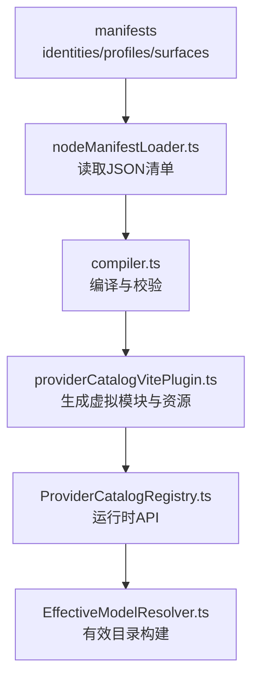
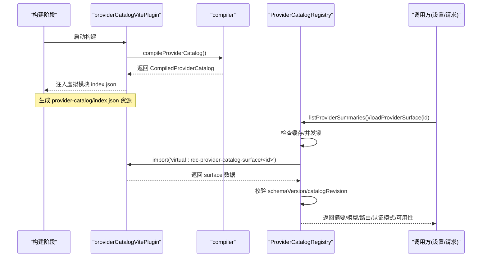
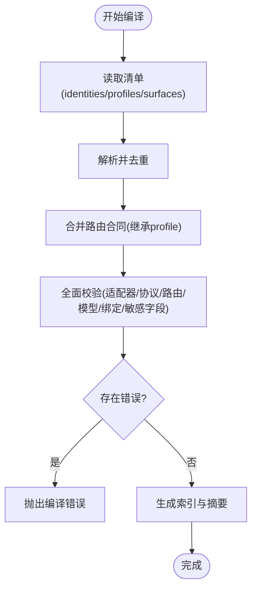
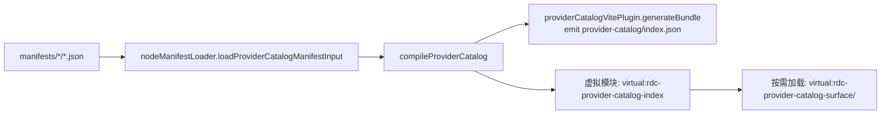
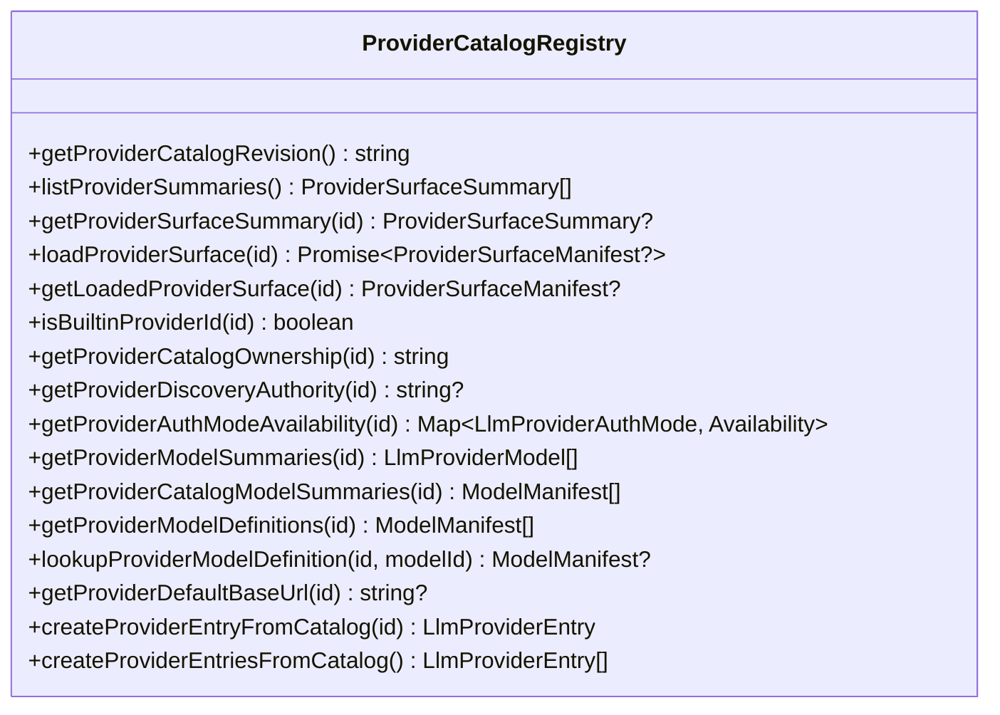
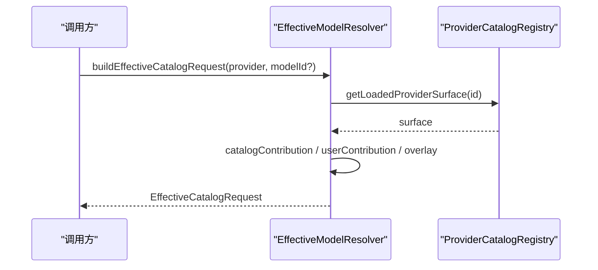
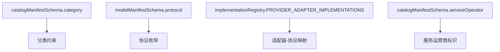
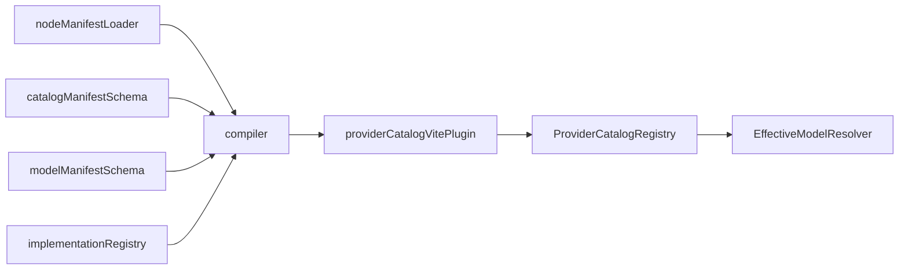

# 提供商注册与发现

<cite>
**本文引用的文件**
- [ProviderCatalogRegistry.ts](file://src/main/provider-catalog/ProviderCatalogRegistry.ts)
- [providerCatalogVitePlugin.ts](file://src/main/provider-catalog/providerCatalogVitePlugin.ts)
- [compiler.ts](file://src/shared/provider-catalog/compiler.ts)
- [catalogManifestSchema.ts](file://src/shared/provider-catalog/catalogManifestSchema.ts)
- [modelManifestSchema.ts](file://src/shared/provider-catalog/modelManifestSchema.ts)
- [implementationRegistry.ts](file://src/shared/provider-catalog/implementationRegistry.ts)
- [nodeManifestLoader.ts](file://src/shared/provider-catalog/nodeManifestLoader.ts)
- [index.ts](file://scripts/provider-catalog-index.cjs)
- [EffectiveModelResolver.ts](file://src/main/settings/EffectiveModelResolver.ts)
- [check-provider-system.mjs](file://scripts/check-provider-system.mjs)
</cite>

## 目录
1. [简介](#简介)
2. [项目结构](#项目结构)
3. [核心组件](#核心组件)
4. [架构总览](#架构总览)
5. [详细组件分析](#详细组件分析)
6. [依赖关系分析](#依赖关系分析)
7. [性能考量](#性能考量)
8. [故障排查指南](#故障排查指南)
9. [结论](#结论)
10. [附录](#附录)

## 简介
本文件系统性阐述 RDC-Agent 的“提供商注册与发现”机制，覆盖以下主题：
- 提供商清单解析、编译与校验
- 目录扫描与动态加载（构建期编译、运行期按需加载）
- ProviderCatalogRegistry 的核心能力：摘要查询、模型定义查找、默认路由推导、认证模式映射、可用性合并、条目创建等
- 生命周期管理：从清单到索引、再到表面（surface）的懒加载与缓存
- 分类、协议、服务运营商信息的管理方式
- 自定义提供商注册示例与最佳实践

## 项目结构
提供商系统由“声明式清单 + 编译期校验 + 运行期注册”三部分构成：
- 清单位于共享目录 manifests（identities/profiles/surfaces），以 JSON 描述身份、配置模板与提供商表面
- 编译期通过 Vite 插件或脚本将清单编译为紧凑的索引与可懒加载的表面模块
- 运行期通过 ProviderCatalogRegistry 暴露统一 API，供设置层、请求规划器、UI 等消费

**图表来源**
- [nodeManifestLoader.ts:12-18](file://src/shared/provider-catalog/nodeManifestLoader.ts#L12-L18)
- [compiler.ts:622-715](file://src/shared/provider-catalog/compiler.ts#L622-L715)
- [providerCatalogVitePlugin.ts:13-58](file://src/main/provider-catalog/providerCatalogVitePlugin.ts#L13-L58)
- [ProviderCatalogRegistry.ts:1-284](file://src/main/provider-catalog/ProviderCatalogRegistry.ts#L1-L284)
- [EffectiveModelResolver.ts:207-231](file://src/main/settings/EffectiveModelResolver.ts#L207-L231)

**章节来源**
- [nodeManifestLoader.ts:1-27](file://src/shared/provider-catalog/nodeManifestLoader.ts#L1-L27)
- [providerCatalogVitePlugin.ts:1-60](file://src/main/provider-catalog/providerCatalogVitePlugin.ts#L1-L60)
- [compiler.ts:622-715](file://src/shared/provider-catalog/compiler.ts#L622-L715)
- [ProviderCatalogRegistry.ts:1-284](file://src/main/provider-catalog/ProviderCatalogRegistry.ts#L1-L284)

## 核心组件
- 清单与模式
  - catalogManifestSchema.ts：定义 Surface、Route、Discovery、Connection、AuthModes、Category、EndpointClass、ServiceOperator 等字段及约束
  - modelManifestSchema.ts：定义协议枚举、模型清单、执行绑定、上下文层级、能力契约等
  - implementationRegistry.ts：维护适配器实现、协议支持、认证方案与发现策略白名单
- 编译与加载
  - compiler.ts：对清单进行去重、校验、合并合同、生成索引与表面摘要
  - nodeManifestLoader.ts：递归读取 manifests 下的 JSON 清单
  - providerCatalogVitePlugin.ts：在构建期编译清单，提供虚拟模块 virtual:rdc-provider-catalog-index 与按 surface id 懒加载
  - scripts/provider-catalog-index.cjs：独立脚本输出 index.json 与 loadProviderSurface
- 运行时注册与发现
  - ProviderCatalogRegistry.ts：提供列表、摘要、模型定义、默认路由、认证模式、可用性、条目创建等 API；维护内存缓存与并发加载保护
  - EffectiveModelResolver.ts：基于已加载 surface 与用户配置构建“有效目录”，并处理协议覆盖、用户贡献、账户授权等

**章节来源**
- [catalogManifestSchema.ts:148-235](file://src/shared/provider-catalog/catalogManifestSchema.ts#L148-L235)
- [modelManifestSchema.ts:43-60](file://src/shared/provider-catalog/modelManifestSchema.ts#L43-L60)
- [implementationRegistry.ts:31-178](file://src/shared/provider-catalog/implementationRegistry.ts#L31-L178)
- [compiler.ts:622-715](file://src/shared/provider-catalog/compiler.ts#L622-L715)
- [nodeManifestLoader.ts:12-18](file://src/shared/provider-catalog/nodeManifestLoader.ts#L12-L18)
- [providerCatalogVitePlugin.ts:13-58](file://src/main/provider-catalog/providerCatalogVitePlugin.ts#L13-L58)
- [index.ts:1-19](file://scripts/provider-catalog-index.cjs#L1-L19)
- [ProviderCatalogRegistry.ts:106-269](file://src/main/provider-catalog/ProviderCatalogRegistry.ts#L106-L269)
- [EffectiveModelResolver.ts:207-231](file://src/main/settings/EffectiveModelResolver.ts#L207-L231)

## 架构总览
提供商注册与发现的关键流程如下：
- 构建期：读取 manifests → 编译校验 → 生成 index 与可懒加载的 surface 模块
- 运行期：导入虚拟 index → 按需加载 surface → 解析并缓存 → 对外暴露 API
- 上层消费：根据 provider id 获取摘要/模型/路由/认证模式/可用性，并构造 LlmProviderEntry

**图表来源**
- [providerCatalogVitePlugin.ts:20-58](file://src/main/provider-catalog/providerCatalogVitePlugin.ts#L20-L58)
- [compiler.ts:622-715](file://src/shared/provider-catalog/compiler.ts#L622-L715)
- [ProviderCatalogRegistry.ts:119-138](file://src/main/provider-catalog/ProviderCatalogRegistry.ts#L119-L138)

## 详细组件分析

### 清单编译与校验（compiler.ts）
- 输入：identities、profiles、surfaces 三个 JSON 目录
- 关键步骤
  - 解析并去重 identities/profiles/surfaces
  - 合并 route 的 contracts（继承 profile 的 mechanism，并应用 contractOverrides）
  - 严格校验：适配器与协议匹配、默认路由唯一性、fact source 引用、模型别名与主模型关系、执行绑定冲突检测、公开 patch 中禁止敏感字段等
  - 生成 catalogRevision（稳定哈希）、索引 surfaces 摘要、压缩模型计数
- 复杂度与性能
  - 去重与校验为 O(N log N) 或 O(N)，N 为清单项数量
  - 校验包含多层嵌套对象遍历，但仅构建期执行

**图表来源**
- [compiler.ts:108-165](file://src/shared/provider-catalog/compiler.ts#L108-L165)
- [compiler.ts:166-452](file://src/shared/provider-catalog/compiler.ts#L166-L452)
- [compiler.ts:454-620](file://src/shared/provider-catalog/compiler.ts#L454-L620)
- [compiler.ts:622-715](file://src/shared/provider-catalog/compiler.ts#L622-L715)

**章节来源**
- [compiler.ts:622-715](file://src/shared/provider-catalog/compiler.ts#L622-L715)

### 目录扫描与动态加载（providerCatalogVitePlugin.ts + nodeManifestLoader.ts）
- 目录扫描：nodeManifestLoader 递归读取 manifests/identities、profiles、surfaces 下所有 JSON
- 动态加载：Vite 插件在构建时生成虚拟模块
  - virtual:rdc-provider-catalog-index：导出 index 与 loadProviderSurface(id)
  - virtual:rdc-provider-catalog-surface/<id>：按需引入对应 surface 的编译结果
- 产物：generateBundle 输出 provider-catalog/index.json 作为静态资源

**图表来源**
- [nodeManifestLoader.ts:12-18](file://src/shared/provider-catalog/nodeManifestLoader.ts#L12-L18)
- [providerCatalogVitePlugin.ts:20-58](file://src/main/provider-catalog/providerCatalogVitePlugin.ts#L20-L58)

**章节来源**
- [nodeManifestLoader.ts:1-27](file://src/shared/provider-catalog/nodeManifestLoader.ts#L1-L27)
- [providerCatalogVitePlugin.ts:1-60](file://src/main/provider-catalog/providerCatalogVitePlugin.ts#L1-L60)

### ProviderCatalogRegistry 核心功能
- 清单索引与版本兼容
  - 校验 bundled index 的 schemaVersion 与必要字段
  - 解析 surface 时校验 schemaVersion 与 catalogRevision 一致
- 摘要与模型
  - listProviderSummaries/getProviderSurfaceSummary：返回精简摘要（不含完整 models/routes）
  - getProviderModelDefinitions/lookupProviderModelDefinition：按 id/alias 精确查找模型定义
- 路由与默认端点
  - defaultRoute：优先取标记 default 的路由，否则取第一个
  - getProviderDefaultBaseUrl：返回默认 baseUrl（去除尾部斜杠）
- 认证模式与可用性
  - mapAuthMode/toAuthModeOptions：将 surface.authModes 映射为 LlmProviderAuthMode 集合
  - getProviderAuthModeAvailability：按认证模式聚合可用性，并与 surface.availability 合并
- 条目创建
  - createProviderEntryFromCatalog/createProviderEntriesFromCatalog：将 surface 转换为 LlmProviderEntry，填充 protocol、authMode、models、connectionSchema、baseUrl、status、capabilities 等
- 缓存与并发
  - loadedSurfaces：缓存已加载的 surface
  - surfaceLoads：防止同一 surface 重复并发加载
  - __testing.reset：测试用清理

**图表来源**
- [ProviderCatalogRegistry.ts:106-269](file://src/main/provider-catalog/ProviderCatalogRegistry.ts#L106-L269)

**章节来源**
- [ProviderCatalogRegistry.ts:1-284](file://src/main/provider-catalog/ProviderCatalogRegistry.ts#L1-L284)

### 有效目录构建与协议覆盖（EffectiveModelResolver.ts）
- 基于已加载 surface 与用户配置，构建 catalog/user/userOverride 等多层贡献
- 支持协议覆盖（protocolOverrides）与首选路由选项（preferredRouteOptionId）
- 记录观察时间、刷新时间、修订号，用于追踪数据来源与时效性

**图表来源**
- [EffectiveModelResolver.ts:207-231](file://src/main/settings/EffectiveModelResolver.ts#L207-L231)
- [EffectiveModelResolver.ts:438-478](file://src/main/settings/EffectiveModelResolver.ts#L438-L478)

**章节来源**
- [EffectiveModelResolver.ts:207-231](file://src/main/settings/EffectiveModelResolver.ts#L207-L231)
- [EffectiveModelResolver.ts:438-478](file://src/main/settings/EffectiveModelResolver.ts#L438-L478)

### 分类、协议与服务运营商管理
- 分类（category）：login-authorization、official-direct、cloud-platform、coding-token-plan、compatible-access、local
- 协议（protocol）：OpenAICompatibleChatCompletions、OpenAIResponses、AnthropicMessages、Azure*、Google*、Ollama、Mistral、Bedrock 等
- 服务运营商（serviceOperator）：标识提供方运营主体，用于归属与审计
- 适配器与协议映射：implementationRegistry 维护 adapterId 与协议集合的闭表，确保 manifest 只能引用已实现的适配器

**图表来源**
- [catalogManifestSchema.ts:161-182](file://src/shared/provider-catalog/catalogManifestSchema.ts#L161-L182)
- [modelManifestSchema.ts:43-60](file://src/shared/provider-catalog/modelManifestSchema.ts#L43-L60)
- [implementationRegistry.ts:31-118](file://src/shared/provider-catalog/implementationRegistry.ts#L31-L118)

**章节来源**
- [catalogManifestSchema.ts:148-235](file://src/shared/provider-catalog/catalogManifestSchema.ts#L148-L235)
- [modelManifestSchema.ts:43-60](file://src/shared/provider-catalog/modelManifestSchema.ts#L43-L60)
- [implementationRegistry.ts:31-178](file://src/shared/provider-catalog/implementationRegistry.ts#L31-L178)

## 依赖关系分析
- 编译期依赖
  - nodeManifestLoader 读取 manifests
  - compiler 依赖 catalogManifestSchema、modelManifestSchema、implementationRegistry
  - providerCatalogVitePlugin 依赖 compiler 与 nodeManifestLoader
- 运行期依赖
  - ProviderCatalogRegistry 依赖虚拟模块 index 与 surface 懒加载
  - EffectiveModelResolver 依赖 ProviderCatalogRegistry 提供的 surface 与模型定义
- 外部集成
  - scripts/provider-catalog-index.cjs 复用 compiler 与 nodeManifestLoader，输出 index.json 与 loadProviderSurface

**图表来源**
- [nodeManifestLoader.ts:12-18](file://src/shared/provider-catalog/nodeManifestLoader.ts#L12-L18)
- [compiler.ts:622-715](file://src/shared/provider-catalog/compiler.ts#L622-L715)
- [providerCatalogVitePlugin.ts:13-58](file://src/main/provider-catalog/providerCatalogVitePlugin.ts#L13-L58)
- [ProviderCatalogRegistry.ts:1-284](file://src/main/provider-catalog/ProviderCatalogRegistry.ts#L1-L284)
- [EffectiveModelResolver.ts:207-231](file://src/main/settings/EffectiveModelResolver.ts#L207-L231)

**章节来源**
- [providerCatalogVitePlugin.ts:1-60](file://src/main/provider-catalog/providerCatalogVitePlugin.ts#L1-L60)
- [compiler.ts:622-715](file://src/shared/provider-catalog/compiler.ts#L622-L715)
- [ProviderCatalogRegistry.ts:1-284](file://src/main/provider-catalog/ProviderCatalogRegistry.ts#L1-L284)
- [EffectiveModelResolver.ts:207-231](file://src/main/settings/EffectiveModelResolver.ts#L207-L231)

## 性能考量
- 构建期一次性编译与校验，避免运行期开销
- 运行期按需懒加载 surface，减少初始包体积与启动时间
- 内存缓存 loadedSurfaces 与并发锁 surfaceLoads，避免重复 IO 与解析
- 摘要（summary）与完整 surface 分离，降低 UI 渲染与网络传输成本
- 使用稳定哈希生成 catalogRevision，便于缓存失效与一致性校验

[本节为通用指导，不直接分析具体文件]

## 故障排查指南
- 构建失败
  - 清单校验错误：查看 compiler 抛出的错误详情，定位重复 ID、缺失 fact source、非法协议/适配器、敏感字段等
  - 适配器未注册：确保 surface.routes.adapterId 在 implementationRegistry 中存在且支持对应协议
- 运行期异常
  - 索引无效：ProviderCatalogRegistry 会校验 bundled index 的 schemaVersion 与关键字段
  - 版本不一致：解析 surface 时若 schemaVersion 或 catalogRevision 不匹配，将抛出错误
  - 缺少 surface：当虚拟模块未找到对应 surface id，会报错提示缺失
- 规范检查
  - check-provider-system.mjs 强制要求 ProviderCatalogRegistry 必须消费虚拟 index，且不得回退到源码清单或编译函数

**章节来源**
- [compiler.ts:652-654](file://src/shared/provider-catalog/compiler.ts#L652-L654)
- [ProviderCatalogRegistry.ts:28-53](file://src/main/provider-catalog/ProviderCatalogRegistry.ts#L28-L53)
- [ProviderCatalogRegistry.ts:126-128](file://src/main/provider-catalog/ProviderCatalogRegistry.ts#L126-L128)
- [check-provider-system.mjs:87-101](file://scripts/check-provider-system.mjs#L87-L101)

## 结论
该机制通过“清单即配置、编译即校验、运行即发现”的设计，实现了：
- 强类型与强约束的提供商元数据管理
- 构建期集中校验与优化，运行期高效按需加载
- 统一的注册与发现 API，支撑设置、请求规划与 UI 的多场景消费
- 可扩展的分类、协议与运营商治理体系，以及清晰的依赖与生命周期管理

[本节为总结，不直接分析具体文件]

## 附录

### 自定义 Provider 注册示例与最佳实践
- 新增清单
  - 在 manifests/surfaces 下新增 JSON，遵循 catalogManifestSchema 的 ProviderSurfaceManifestSchema
  - 明确 category、endpointClass、endpointOwnership、serviceOperator、authModes、routes、models、discovery 等
- 适配器与协议
  - 如需新协议，先在 implementationRegistry 中添加适配器与协议映射
  - 确保 routes.adapterId 与协议匹配
- 编译与验证
  - 运行构建或脚本 scripts/provider-catalog-index.cjs，确认无校验错误
  - 使用 check-provider-system.mjs 确保符合工程规范
- 运行期使用
  - 通过 ProviderCatalogRegistry.createProviderEntryFromCatalog 生成 LlmProviderEntry
  - 结合 EffectiveModelResolver 构建有效目录，处理协议覆盖与用户配置
- 最佳实践
  - 保持 schemaVersion 与 catalogRevision 的一致性
  - 避免在公开 patch 中嵌入敏感字段
  - 合理设置 discovery.authority 与 strategy，控制模型可见性与来源
  - 使用 connectionSchema 明确密钥字段与替代方案
  - 通过 capabilities 与 controls 显式声明模型能力与控制项

**章节来源**
- [catalogManifestSchema.ts:148-235](file://src/shared/provider-catalog/catalogManifestSchema.ts#L148-L235)
- [implementationRegistry.ts:31-178](file://src/shared/provider-catalog/implementationRegistry.ts#L31-L178)
- [compiler.ts:220-239](file://src/shared/provider-catalog/compiler.ts#L220-L239)
- [ProviderCatalogRegistry.ts:210-269](file://src/main/provider-catalog/ProviderCatalogRegistry.ts#L210-L269)
- [EffectiveModelResolver.ts:438-478](file://src/main/settings/EffectiveModelResolver.ts#L438-L478)
- [check-provider-system.mjs:87-101](file://scripts/check-provider-system.mjs#L87-L101)