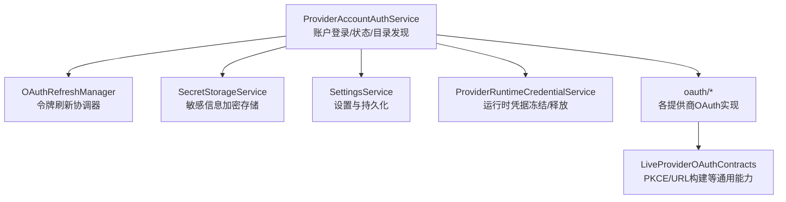
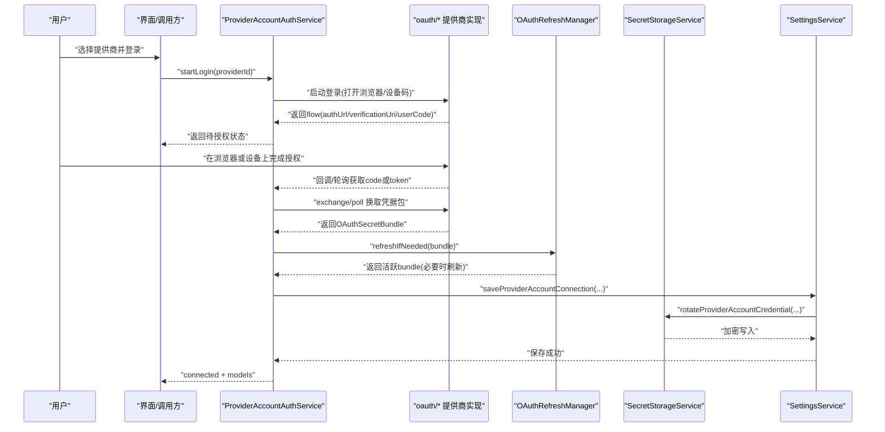
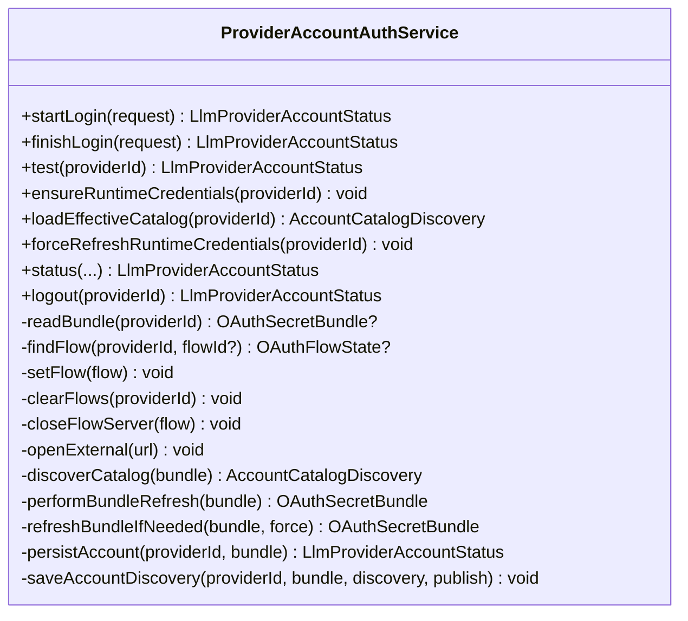
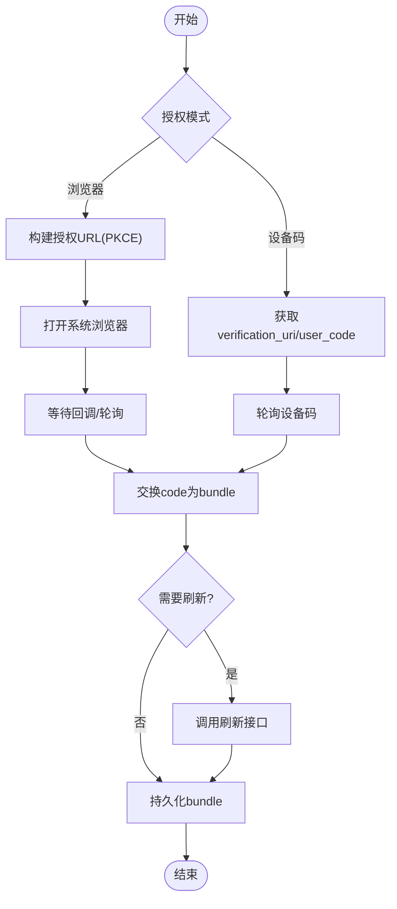
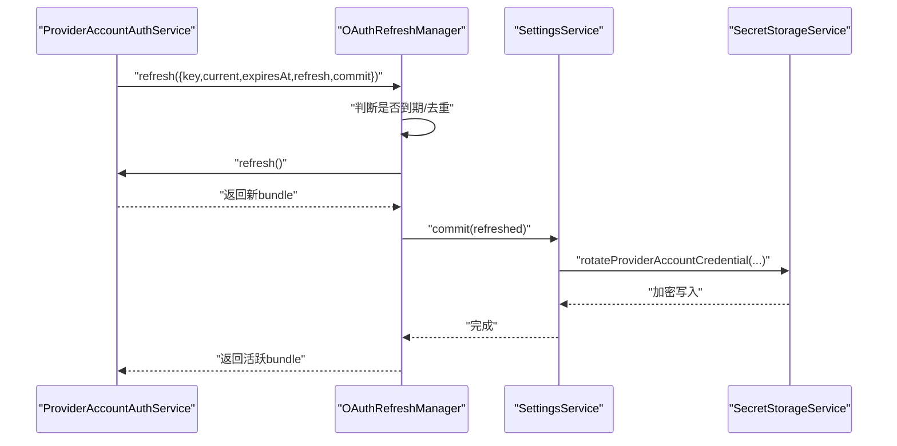
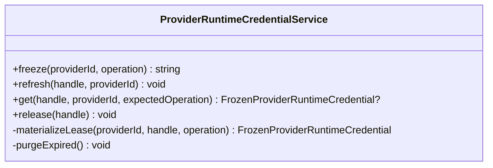
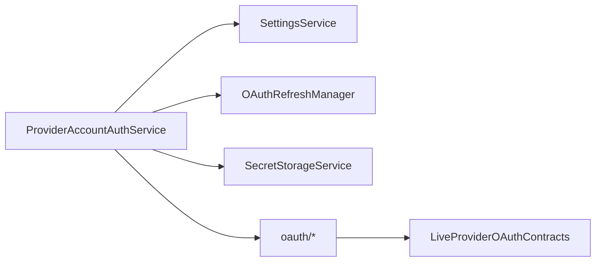

# 认证处理

<cite>
**本文引用的文件**
- [ProviderAccountAuthService.ts](file://src/main/settings/ProviderAccountAuthService.ts)
- [OAuthRefreshManager.ts](file://src/main/settings/OAuthRefreshManager.ts)
- [SecretStorageService.ts](file://src/main/settings/SecretStorageService.ts)
- [CredentialStoreInterface.ts](file://src/main/settings/CredentialStoreInterface.ts)
- [LiveProviderOAuthContracts.ts](file://src/main/settings/LiveProviderOAuthContracts.ts)
- [SettingsService.ts](file://src/main/settings/SettingsService.ts)
- [ProviderRuntimeCredentialService.ts](file://src/main/settings/ProviderRuntimeCredentialService.ts)
- [chatGptAccountOAuth.ts](file://src/main/settings/oauth/chatGptAccountOAuth.ts)
- [claudeAccountOAuth.ts](file://src/main/settings/oauth/claudeAccountOAuth.ts)
- [copilotAccountOAuth.ts](file://src/main/settings/oauth/copilotAccountOAuth.ts)
- [grokAccountOAuth.ts](file://src/main/settings/oauth/grokAccountOAuth.ts)
- [nousAccountOAuth.ts](file://src/main/settings/oauth/nousAccountOAuth.ts)
- [openRouterAccountOAuth.ts](file://src/main/settings/oauth/openRouterAccountOAuth.ts)
</cite>

## 目录
1. [简介](#简介)
2. [项目结构](#项目结构)
3. [核心组件](#核心组件)
4. [架构总览](#架构总览)
5. [详细组件分析](#详细组件分析)
6. [依赖关系分析](#依赖关系分析)
7. [性能考量](#性能考量)
8. [故障排查指南](#故障排查指南)
9. [结论](#结论)
10. [附录：配置与集成示例](#附录：配置与集成示例)

## 简介
本文件系统性说明 RDC Agent 的认证处理机制，覆盖支持的认证模式（API Key、OAuth、JWT/令牌类）、认证流程、OAuth 2.0 授权码流程、令牌刷新、会话管理、多账户支持、敏感信息加密存储、凭据轮换与安全传输，以及不同认证方式的配置与集成方式。同时提供认证失败处理与用户交互流程说明，帮助开发者与运维人员快速定位问题并安全地集成第三方服务。

## 项目结构
认证相关代码集中在主进程 settings 模块中，围绕“账户登录”、“令牌刷新”、“密钥存储”和“运行时凭据”四大职责进行组织：
- 账户登录与状态管理：ProviderAccountAuthService
- OAuth 令牌刷新：OAuthRefreshManager
- 敏感信息加密存储：SecretStorageService
- 运行时凭据冻结与释放：ProviderRuntimeCredentialService
- 设置与持久化：SettingsService
- 各提供商 OAuth 实现：oauth/* 目录下的具体实现
- 通用 OAuth 工具与协议：LiveProviderOAuthContracts.ts

图表来源
- [ProviderAccountAuthService.ts:99-527](file://src/main/settings/ProviderAccountAuthService.ts#L99-L527)
- [OAuthRefreshManager.ts:49-85](file://src/main/settings/OAuthRefreshManager.ts#L49-L85)
- [SecretStorageService.ts:72-262](file://src/main/settings/SecretStorageService.ts#L72-L262)
- [SettingsService.ts:94-200](file://src/main/settings/SettingsService.ts#L94-L200)
- [ProviderRuntimeCredentialService.ts:51-146](file://src/main/settings/ProviderRuntimeCredentialService.ts#L51-L146)
- [LiveProviderOAuthContracts.ts:1-35](file://src/main/settings/LiveProviderOAuthContracts.ts#L1-L35)

章节来源
- [ProviderAccountAuthService.ts:99-527](file://src/main/settings/ProviderAccountAuthService.ts#L99-L527)
- [OAuthRefreshManager.ts:49-85](file://src/main/settings/OAuthRefreshManager.ts#L49-L85)
- [SecretStorageService.ts:72-262](file://src/main/settings/SecretStorageService.ts#L72-L262)
- [SettingsService.ts:94-200](file://src/main/settings/SettingsService.ts#L94-L200)
- [ProviderRuntimeCredentialService.ts:51-146](file://src/main/settings/ProviderRuntimeCredentialService.ts#L51-L146)
- [LiveProviderOAuthContracts.ts:1-35](file://src/main/settings/LiveProviderOAuthContracts.ts#L1-L35)

## 核心组件
- ProviderAccountAuthService：统一入口，负责启动登录流程、完成授权码交换、刷新凭据、发现模型目录、登出与状态查询。
- OAuthRefreshManager：按账号维度去重并发刷新，识别无效授权错误并触发重新登录。
- SecretStorageService：基于 Electron safeStorage 对 API Key、OAuth 凭据等进行加密存储，并提供掩码预览。
- SettingsService：加载/保存设置、解析连接值、读取/写入 OAuth 秘密、标记刷新失败等。
- ProviderRuntimeCredentialService：为运行期任务冻结凭据句柄，避免泄露，支持刷新与过期清理。
- oauth/*：针对 ChatGPT、Claude、GitHub Copilot、Grok、Nous、OpenRouter 等提供商的具体 OAuth 流程实现。
- LiveProviderOAuthContracts：提供 PKCE 生成、OpenRouter 授权/交换 URL 构建等通用能力。

章节来源
- [ProviderAccountAuthService.ts:99-527](file://src/main/settings/ProviderAccountAuthService.ts#L99-L527)
- [OAuthRefreshManager.ts:49-85](file://src/main/settings/OAuthRefreshManager.ts#L49-L85)
- [SecretStorageService.ts:72-262](file://src/main/settings/SecretStorageService.ts#L72-L262)
- [SettingsService.ts:94-200](file://src/main/settings/SettingsService.ts#L94-L200)
- [ProviderRuntimeCredentialService.ts:51-146](file://src/main/settings/ProviderRuntimeCredentialService.ts#L51-L146)
- [LiveProviderOAuthContracts.ts:1-35](file://src/main/settings/LiveProviderOAuthContracts.ts#L1-L35)

## 架构总览
下图展示了从用户发起登录到最终获得可用模型目录的端到端流程，包括浏览器跳转、回调/设备码轮询、令牌交换、刷新、持久化与发布。

图表来源
- [ProviderAccountAuthService.ts:108-248](file://src/main/settings/ProviderAccountAuthService.ts#L108-L248)
- [OAuthRefreshManager.ts:54-82](file://src/main/settings/OAuthRefreshManager.ts#L54-L82)
- [SecretStorageService.ts:182-227](file://src/main/settings/SecretStorageService.ts#L182-L227)
- [SettingsService.ts:199-200](file://src/main/settings/SettingsService.ts#L199-L200)

## 详细组件分析

### 账户登录与状态管理（ProviderAccountAuthService）
- 支持的登录模式
  - 浏览器授权码模式：ChatGPT、OpenRouter、Claude（部分）、Grok（browser）
  - 设备码模式：GitHub Copilot、Grok（device）、Nous
- 关键流程
  - startLogin：根据 providerId 路由到对应 oauth/* 实现，打开系统浏览器或进入设备码流程，维护 pendingFlows。
  - finishLogin：根据 flow 类型执行 exchange/poll，得到 OAuthSecretBundle。
  - refreshBundleIfNeeded：通过 OAuthRefreshManager 统一刷新，必要时调用 performBundleRefresh。
  - discoverCatalog：加载提供商 surface 并拉取可用模型目录，保存到设置并发布给上层。
  - status/logout：计算当前状态（pending/connected/failed/unavailable），支持撤销 Grok 凭据并断开。
- 多账户支持
  - 使用 accountId 区分同一提供商的不同账户；刷新时以 {providerId, accountId} 作为 key。
- 会话管理
  - pendingFlows 内存中维护临时授权流，支持超时清理与服务端回调关闭。

图表来源
- [ProviderAccountAuthService.ts:99-527](file://src/main/settings/ProviderAccountAuthService.ts#L99-L527)

章节来源
- [ProviderAccountAuthService.ts:108-248](file://src/main/settings/ProviderAccountAuthService.ts#L108-L248)
- [ProviderAccountAuthService.ts:250-527](file://src/main/settings/ProviderAccountAuthService.ts#L250-L527)

### OAuth 2.0 授权码流程与令牌刷新
- 授权码流程
  - 浏览器模式：构造授权 URL（含 PKCE challenge），打开系统浏览器，回调服务器接收 code，再交换 token/bundle。
  - 设备码模式：获取 verification_uri 与 user_code，轮询获取 token/bundle。
- 令牌刷新
  - OAuthRefreshManager 按 {providerId, accountId} 去重并发刷新，支持提前刷新（skew）。
  - 识别 invalid_grant 错误，触发 onInvalidGrant 回调以便提示重新登录。
- OpenRouter 示例
  - 使用 PKCE，构建授权 URL 与交换请求体，解析返回的 apiKey。

图表来源
- [LiveProviderOAuthContracts.ts:3-35](file://src/main/settings/LiveProviderOAuthContracts.ts#L3-L35)
- [ProviderAccountAuthService.ts:108-248](file://src/main/settings/ProviderAccountAuthService.ts#L108-L248)
- [OAuthRefreshManager.ts:54-82](file://src/main/settings/OAuthRefreshManager.ts#L54-L82)

章节来源
- [LiveProviderOAuthContracts.ts:1-35](file://src/main/settings/LiveProviderOAuthContracts.ts#L1-L35)
- [ProviderAccountAuthService.ts:108-248](file://src/main/settings/ProviderAccountAuthService.ts#L108-L248)
- [OAuthRefreshManager.ts:49-85](file://src/main/settings/OAuthRefreshManager.ts#L49-L85)

### 敏感信息加密存储与凭据轮换
- 加密存储
  - SecretStorageService 使用 Electron safeStorage 加密 API Key 与 OAuth 凭据，落盘为 JSON 记录，包含 encoding、payload、updatedAt。
  - 写盘采用原子替换（临时文件+rename），并尝试设置严格文件权限（POSIX 与 Windows ACL）。
  - 提供 maskSecretPreview 用于 UI 显示掩码。
- 凭据轮换
  - SettingsService.rotateProviderAccountCredential 在刷新成功后更新持久化的凭据与元数据（如 expiresAt、oauthRefreshAvailable）。
  - ProviderAccountAuthService.refreshBundleIfNeeded 在刷新后 commit 新 bundle。

图表来源
- [OAuthRefreshManager.ts:54-82](file://src/main/settings/OAuthRefreshManager.ts#L54-L82)
- [ProviderAccountAuthService.ts:406-427](file://src/main/settings/ProviderAccountAuthService.ts#L406-L427)
- [SecretStorageService.ts:182-227](file://src/main/settings/SecretStorageService.ts#L182-L227)
- [SettingsService.ts:199-200](file://src/main/settings/SettingsService.ts#L199-L200)

章节来源
- [SecretStorageService.ts:72-262](file://src/main/settings/SecretStorageService.ts#L72-L262)
- [ProviderAccountAuthService.ts:406-427](file://src/main/settings/ProviderAccountAuthService.ts#L406-L427)
- [SettingsService.ts:199-200](file://src/main/settings/SettingsService.ts#L199-L200)

### 运行时凭据与会话管理
- ProviderRuntimeCredentialService 将凭据冻结为不可变句柄，限制生命周期（最长 24 小时），并在刷新时替换内部值。
- 适用于 chat/embed 等操作，避免在运行期直接持有明文凭据。
- 自动清理过期租约，防止内存泄漏。

图表来源
- [ProviderRuntimeCredentialService.ts:51-146](file://src/main/settings/ProviderRuntimeCredentialService.ts#L51-L146)

章节来源
- [ProviderRuntimeCredentialService.ts:51-146](file://src/main/settings/ProviderRuntimeCredentialService.ts#L51-L146)

### 多账户支持与提供商差异
- 多账户
  - 以 {providerId, accountId} 作为刷新键，支持同一提供商下多个独立账户的令牌管理与刷新。
- 提供商差异
  - GitHub Copilot：设备码模式，需 accessToken 且特殊刷新逻辑。
  - Grok：支持 browser/device 两种模式，具备诊断信息收集与展示。
  - Claude/OpenRouter/ChatGPT/Nous：各自实现登录、回调/轮询与交换逻辑。

章节来源
- [ProviderAccountAuthService.ts:108-248](file://src/main/settings/ProviderAccountAuthService.ts#L108-L248)
- [ProviderAccountAuthService.ts:429-473](file://src/main/settings/ProviderAccountAuthService.ts#L429-L473)
- [LiveProviderOAuthContracts.ts:10-35](file://src/main/settings/LiveProviderOAuthContracts.ts#L10-L35)

## 依赖关系分析
- ProviderAccountAuthService 依赖：
  - SettingsService：读写设置、保存账户连接、旋转凭据、标记刷新失败。
  - OAuthRefreshManager：统一刷新与无效授权处理。
  - SecretStorageService：加密存储 API Key 与 OAuth 凭据。
  - oauth/*：具体提供商登录与交换实现。
  - LiveProviderOAuthContracts：PKCE 与 OpenRouter 协议工具。
- 耦合与内聚
  - 账户登录与刷新解耦，便于扩展新提供商。
  - 凭据存储与业务逻辑分离，提升安全性与可测试性。

图表来源
- [ProviderAccountAuthService.ts:99-527](file://src/main/settings/ProviderAccountAuthService.ts#L99-L527)
- [SettingsService.ts:94-200](file://src/main/settings/SettingsService.ts#L94-L200)
- [OAuthRefreshManager.ts:49-85](file://src/main/settings/OAuthRefreshManager.ts#L49-L85)
- [SecretStorageService.ts:72-262](file://src/main/settings/SecretStorageService.ts#L72-L262)
- [LiveProviderOAuthContracts.ts:1-35](file://src/main/settings/LiveProviderOAuthContracts.ts#L1-L35)

章节来源
- [ProviderAccountAuthService.ts:99-527](file://src/main/settings/ProviderAccountAuthService.ts#L99-L527)
- [SettingsService.ts:94-200](file://src/main/settings/SettingsService.ts#L94-L200)
- [OAuthRefreshManager.ts:49-85](file://src/main/settings/OAuthRefreshManager.ts#L49-L85)
- [SecretStorageService.ts:72-262](file://src/main/settings/SecretStorageService.ts#L72-L262)
- [LiveProviderOAuthContracts.ts:1-35](file://src/main/settings/LiveProviderOAuthContracts.ts#L1-L35)

## 性能考量
- 令牌刷新去重与并发控制：OAuthRefreshManager 在同一 key 上合并并发请求，避免重复网络调用。
- 提前刷新策略：默认提前 60 秒刷新，降低过期导致的请求失败。
- 目录发现缓存：ProviderAccountAuthService 在短时间窗口内复用模型目录结果，减少频繁网络请求。
- 凭据冻结：ProviderRuntimeCredentialService 限制凭据驻留时间，降低泄露面。

[本节为通用指导，不直接分析具体文件]

## 故障排查指南
- 常见错误与处理
  - 无效授权（invalid_grant）：OAuthRefreshManager 识别并抛出 OAuthRefreshError，调用 onInvalidGrant 标记失败，提示重新登录。
  - 提供商未支持账户登录：ProviderAccountAuthService 返回 unavailable/failed 状态。
  - 无可用模型：discoverCatalog 返回空模型列表时抛出错误，需检查账户权限或提供商状态。
  - 存储不可用：SecretStorageService 检测 safeStorage 不可用时拒绝存储，需检查系统环境。
- 用户交互
  - 待授权状态：返回 authUrl/verificationUri/userCode，引导用户在浏览器或设备上完成授权。
  - 失败诊断：Grok 提供商提供诊断信息渲染，便于定位问题。

章节来源
- [OAuthRefreshManager.ts:49-85](file://src/main/settings/OAuthRefreshManager.ts#L49-L85)
- [ProviderAccountAuthService.ts:186-194](file://src/main/settings/ProviderAccountAuthService.ts#L186-L194)
- [ProviderAccountAuthService.ts:250-269](file://src/main/settings/ProviderAccountAuthService.ts#L250-L269)
- [SecretStorageService.ts:38-42](file://src/main/settings/SecretStorageService.ts#L38-L42)

## 结论
RDC Agent 的认证体系以 ProviderAccountAuthService 为核心，结合 OAuthRefreshManager、SecretStorageService 与 SettingsService，实现了统一的账户登录、令牌刷新、多账户支持与安全的凭据存储。通过 oauth/* 模块化实现各提供商差异，配合 PKCE、设备码与回调等多种授权模式，满足复杂场景需求。运行时凭据冻结进一步提升了安全性与可控性。建议在生产环境中启用最小权限原则、定期轮换凭据，并监控刷新失败与无效授权事件。

[本节为总结，不直接分析具体文件]

## 附录：配置与集成示例
- API Key 认证
  - 通过 SettingsService.getProviderSecret/getProviderConnectionValues 读取已加密的 API Key 或连接字段。
  - 使用 ProviderRuntimeCredentialService.freeze 获取运行时凭据句柄，避免直接暴露明文。
  - 参考路径：[SettingsService.ts:141-197](file://src/main/settings/SettingsService.ts#L141-L197)、[ProviderRuntimeCredentialService.ts:58-115](file://src/main/settings/ProviderRuntimeCredentialService.ts#L58-L115)
- OAuth 授权码（浏览器）
  - 使用 live provider 的 PKCE 工具构建授权 URL，打开系统浏览器，回调后交换 code 为 bundle。
  - 参考路径：[LiveProviderOAuthContracts.ts:10-35](file://src/main/settings/LiveProviderOAuthContracts.ts#L10-L35)、[ProviderAccountAuthService.ts:108-184](file://src/main/settings/ProviderAccountAuthService.ts#L108-L184)
- OAuth 设备码
  - 获取 verification_uri 与 user_code，轮询获取 token/bundle。
  - 参考路径：[ProviderAccountAuthService.ts:135-167](file://src/main/settings/ProviderAccountAuthService.ts#L135-L167)
- 令牌刷新
  - 调用 OAuthRefreshManager.refresh，传入 key/current/expiresAt/refresh/commit/onInvalidGrant。
  - 参考路径：[OAuthRefreshManager.ts:54-82](file://src/main/settings/OAuthRefreshManager.ts#L54-L82)
- 多账户
  - 以 {providerId, accountId} 区分账户，刷新与持久化均使用该 key。
  - 参考路径：[ProviderAccountAuthService.ts:406-427](file://src/main/settings/ProviderAccountAuthService.ts#L406-L427)
- 安全传输
  - 所有网络请求由 oauth/* 实现负责，确保使用 HTTPS 与必要的签名/校验。
  - 凭据仅通过加密存储与运行时句柄传递，避免日志与 UI 泄露。
  - 参考路径：[SecretStorageService.ts:182-227](file://src/main/settings/SecretStorageService.ts#L182-L227)

章节来源
- [SettingsService.ts:141-197](file://src/main/settings/SettingsService.ts#L141-L197)
- [ProviderRuntimeCredentialService.ts:58-115](file://src/main/settings/ProviderRuntimeCredentialService.ts#L58-L115)
- [LiveProviderOAuthContracts.ts:10-35](file://src/main/settings/LiveProviderOAuthContracts.ts#L10-L35)
- [ProviderAccountAuthService.ts:108-184](file://src/main/settings/ProviderAccountAuthService.ts#L108-L184)
- [ProviderAccountAuthService.ts:135-167](file://src/main/settings/ProviderAccountAuthService.ts#L135-L167)
- [OAuthRefreshManager.ts:54-82](file://src/main/settings/OAuthRefreshManager.ts#L54-L82)
- [ProviderAccountAuthService.ts:406-427](file://src/main/settings/ProviderAccountAuthService.ts#L406-L427)
- [SecretStorageService.ts:182-227](file://src/main/settings/SecretStorageService.ts#L182-L227)