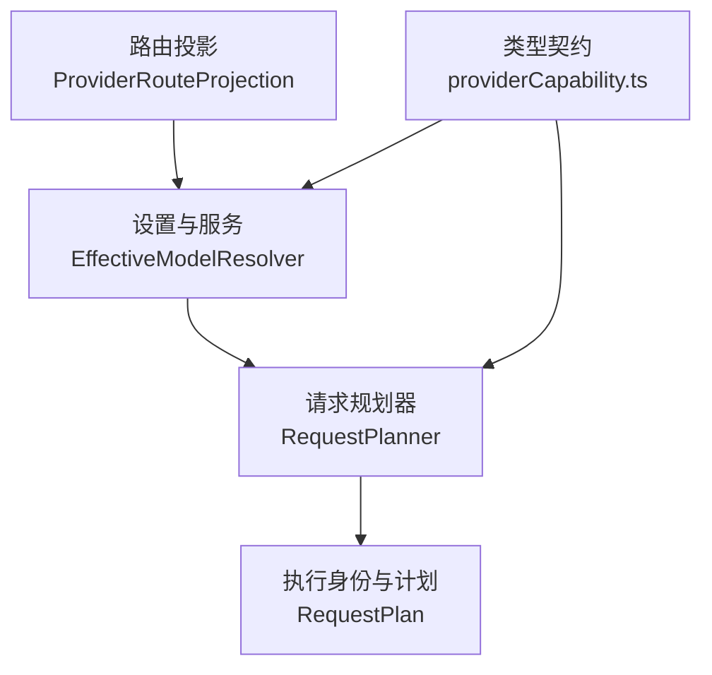
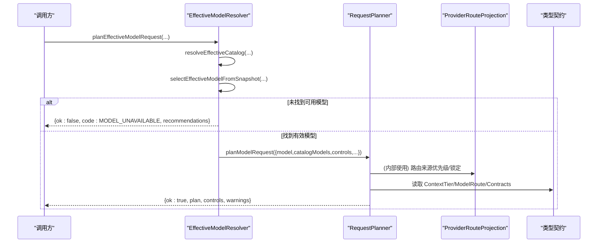
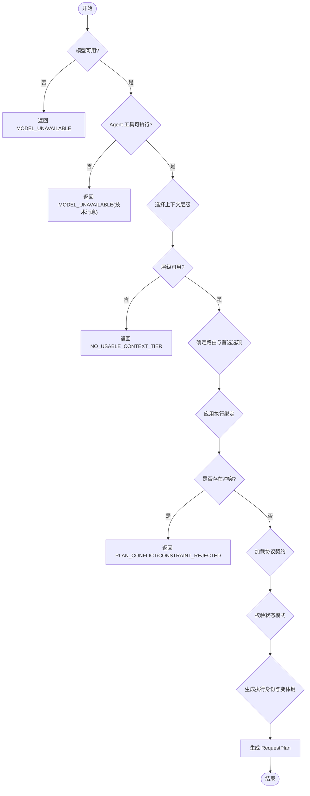
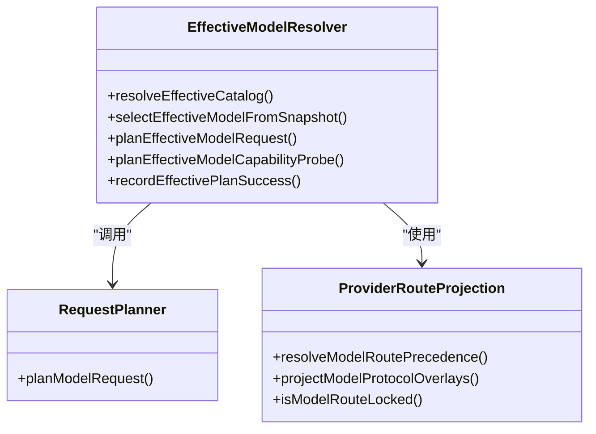
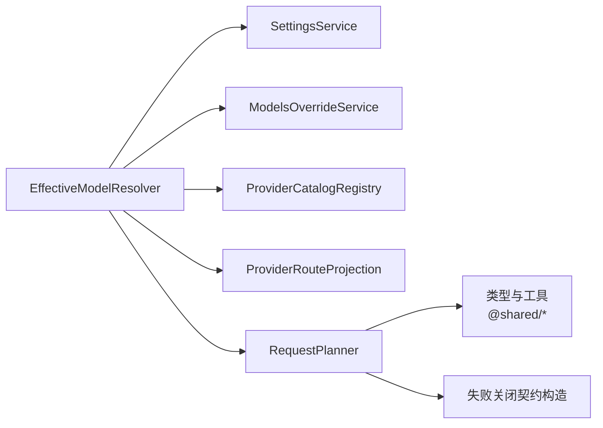
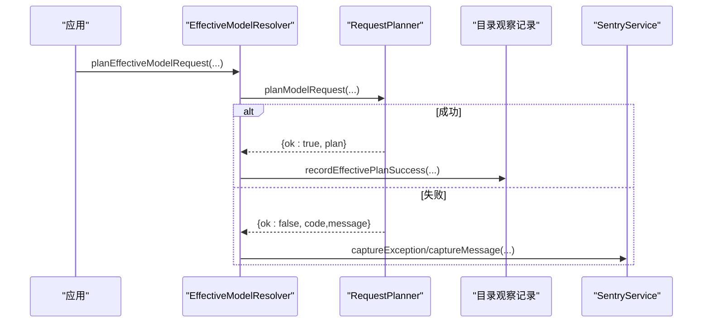

# 请求规划

<cite>
**本文引用的文件**
- [RequestPlanner.ts](file://src/main/settings/RequestPlanner.ts)
- [EffectiveModelResolver.ts](file://src/main/settings/EffectiveModelResolver.ts)
- [ProviderRouteProjection.ts](file://src/main/settings/ProviderRouteProjection.ts)
- [providerCapability.ts](file://src/shared/types/providerCapability.ts)
- [settingsDefaults.ts](file://src/main/settings/settingsDefaults.ts)
- [SentryService.ts](file://src/main/telemetry/SentryService.ts)
</cite>

## 目录
1. [简介](#简介)
2. [项目结构](#项目结构)
3. [核心组件](#核心组件)
4. [架构总览](#架构总览)
5. [详细组件分析](#详细组件分析)
6. [依赖关系分析](#依赖关系分析)
7. [性能与成本优化](#性能与成本优化)
8. [限流、缓存与批量处理](#限流缓存与批量处理)
9. [故障转移与负载均衡](#故障转移与负载均衡)
10. [配置示例](#配置示例)
11. [监控与排障](#监控与排障)
12. [结论](#结论)

## 简介
本文件围绕“请求规划”能力，系统性说明请求路由选择、模型优先级、上下文层级（Context Tier）与能力匹配、成本与性能优化、状态模式、工具循环（Tool Loop）续传、以及可观测性与排障。内容基于代码库中的请求规划实现与类型契约进行梳理，帮助读者理解从“用户选择的模型”到“最终执行计划”的完整决策链路。

## 项目结构
请求规划由“有效模型解析 + 请求计划生成 + 路由投影 + 类型契约”共同组成：
- 有效模型解析：聚合目录、覆盖层、用户配置、授权等来源，得到 EffectiveModel。
- 请求计划生成：在 EffectiveModel 基础上，结合控制参数、上下文层级、协议契约，输出 RequestPlan。
- 路由投影：决定 ModelRoute 的来源优先级与协议覆盖。
- 类型契约：定义 ContextTier、ModelRoute、ExecutionBinding、ProviderContractBundle 等关键数据结构。

图表来源
- [EffectiveModelResolver.ts:421-479](file://src/main/settings/EffectiveModelResolver.ts#L421-L479)
- [RequestPlanner.ts:123-539](file://src/main/settings/RequestPlanner.ts#L123-L539)
- [ProviderRouteProjection.ts:11-52](file://src/main/settings/ProviderRouteProjection.ts#L11-L52)
- [providerCapability.ts:44-200](file://src/shared/types/providerCapability.ts#L44-L200)

章节来源
- [EffectiveModelResolver.ts:421-479](file://src/main/settings/EffectiveModelResolver.ts#L421-L479)
- [RequestPlanner.ts:123-539](file://src/main/settings/RequestPlanner.ts#L123-L539)
- [ProviderRouteProjection.ts:11-52](file://src/main/settings/ProviderRouteProjection.ts#L11-L52)
- [providerCapability.ts:44-200](file://src/shared/types/providerCapability.ts#L44-L200)

## 核心组件
- 有效模型选择与合成：将目录、覆盖层、用户配置、授权与发现结果合并为 EffectiveModel，并给出推荐模型列表。
- 请求计划生成：校验可用性、能力绑定、上下文层级、协议契约、状态模式、工具循环策略，产出稳定可复现的 RequestPlan。
- 路由选择与锁定：按来源优先级合并 headers/contracts，支持按模型固定 route。
- 类型契约：统一描述 ContextTier、ModelRoute、ExecutionBinding、ProviderContractBundle 等。

章节来源
- [EffectiveModelResolver.ts:526-640](file://src/main/settings/EffectiveModelResolver.ts#L526-L640)
- [RequestPlanner.ts:123-539](file://src/main/settings/RequestPlanner.ts#L123-L539)
- [ProviderRouteProjection.ts:11-52](file://src/main/settings/ProviderRouteProjection.ts#L11-L52)
- [providerCapability.ts:44-200](file://src/shared/types/providerCapability.ts#L44-L200)

## 架构总览
下图展示一次“请求规划”的关键调用链：从高层入口 planEffectiveModelRequest 开始，先解析有效模型，再进入 RequestPlanner 生成计划；过程中涉及路由投影、上下文层级、协议契约、状态模式与工具循环策略。

图表来源
- [EffectiveModelResolver.ts:593-640](file://src/main/settings/EffectiveModelResolver.ts#L593-L640)
- [RequestPlanner.ts:123-539](file://src/main/settings/RequestPlanner.ts#L123-L539)
- [ProviderRouteProjection.ts:11-52](file://src/main/settings/ProviderRouteProjection.ts#L11-L52)
- [providerCapability.ts:44-200](file://src/shared/types/providerCapability.ts#L44-L200)

## 详细组件分析

### 请求计划生成（RequestPlanner）
- 输入：EffectiveModel、可选 catalogModels、对话轮次控制、温度、压缩阈值、凭据范围、状态模式、工具循环阶段、是否要求 Agent 工具可执行等。
- 主要流程：
  - 可用性检查：模型不可用或禁用直接失败。
  - Agent 工具可执行性：默认路径要求模型可被 Agent 执行，否则返回不可用。
  - 上下文层级（Context Tier）：根据 maxMode 与普通模式选择 tier，校验 entitlement 与窗口预算。
  - 路由与首选选项：优先使用 preferredRouteOptionId，否则回退到协议匹配；支持 routeRevision 稳定性。
  - 执行绑定（Execution Binding）：应用 request-patch、request-headers、model-switch、client-tier 等动作，冲突检测严格。
  - 协议契约（Provider Contract）：合并 route 与 effectiveModel 的 cache contract；校验 state mode、toolLoop.requestPatch 续传兼容性。
  - 推理控制（Reasoning Control）：根据模型能力与用户控制计算 reasoningLevel，必要时抑制推理线。
  - 身份与变体：生成 ExecutionIdentity，包含 providerId、endpointHash、catalog/route revision、compatibilityGroup、variantKey 等，保证计划可追踪与幂等。
  - 计划输出：statePlan、cachePlan、toolLoopPlan、streamingPlan、contextTransitionPlan、bodyPatch、预算与窗口、activeTierId、fastMode、reasoningWire、temperature 等。

图表来源
- [RequestPlanner.ts:123-539](file://src/main/settings/RequestPlanner.ts#L123-L539)

章节来源
- [RequestPlanner.ts:123-539](file://src/main/settings/RequestPlanner.ts#L123-L539)

### 有效模型解析（EffectiveModelResolver）
- 职责：
  - 构建有效目录请求：聚合 catalog、overlay、entitlement、user、userOverride 等贡献。
  - 选择有效模型：精确匹配或别名映射，过滤 internal/pickerVisibility，提供同提供商推荐模型。
  - 规划入口：planEffectiveModelRequest 封装 catalog 快照与 selection，调用 RequestPlanner。
  - 能力探测：planEffectiveModelCapabilityProbe 绕过部分缓存证据，模拟 fast/max-context 授权以探测能力。
  - 观察记录：recordEffectivePlanSuccess 等函数将成功激活的 tier/fast/binding 写回目录服务，用于后续快速判定。

图表来源
- [EffectiveModelResolver.ts:421-745](file://src/main/settings/EffectiveModelResolver.ts#L421-L745)
- [ProviderRouteProjection.ts:11-52](file://src/main/settings/ProviderRouteProjection.ts#L11-L52)
- [RequestPlanner.ts:123-539](file://src/main/settings/RequestPlanner.ts#L123-L539)

章节来源
- [EffectiveModelResolver.ts:421-745](file://src/main/settings/EffectiveModelResolver.ts#L421-L745)

### 路由选择与锁定（ProviderRouteProjection）
- 路由来源优先级：model > user > catalog，headers 合并时以后者覆盖前者。
- 协议覆盖：按模型首选协议或默认协议生成 overlay 贡献，影响后续路由选择。
- 路由锁定：source === 'model' 表示被模型固定，避免后续覆盖。

章节来源
- [ProviderRouteProjection.ts:11-52](file://src/main/settings/ProviderRouteProjection.ts#L11-L52)

### 类型契约（providerCapability.ts）
- ContextTier：标识上下文层级、激活方式（implicit/header/body）、配额与成本乘数、授权状态。
- ModelRoute/ModelRouteOption：协议、baseUrl、headers、contracts、来源、可用性、认证模式等。
- ExecutionBindingDefinition：条件与动作（unsupported/request-patch/request-headers/model-switch/client-tier）。
- ResolvedModelControls：fast/maxContext/reasoning 的解析结果。
- EffectiveModel：模型元数据、路由、上下文层级、控制项、工具调用/视觉/结构化输出能力、温度、成本、配额等。

章节来源
- [providerCapability.ts:44-200](file://src/shared/types/providerCapability.ts#L44-L200)

## 依赖关系分析
- EffectiveModelResolver 依赖：
  - EffectiveCatalogService（外部服务，负责目录快照与刷新）
  - ModelsOverrideService（用户覆盖）
  - SettingsService（读取设置）
  - ProviderCatalogRegistry（加载 provider surface、模型定义）
  - RequestPlanner（生成计划）
  - ProviderRouteProjection（路由投影）
- RequestPlanner 依赖：
  - 共享类型与工具（modelCapability、contextTiers、contextBudget、agentToolCapability）
  - 提供者适配器 ID 映射（implementationRegistry）
  - 失败关闭的契约构造（createFailClosedProviderContracts）

图表来源
- [EffectiveModelResolver.ts:1-38](file://src/main/settings/EffectiveModelResolver.ts#L1-L38)
- [RequestPlanner.ts:1-39](file://src/main/settings/RequestPlanner.ts#L1-L39)

章节来源
- [EffectiveModelResolver.ts:1-38](file://src/main/settings/EffectiveModelResolver.ts#L1-L38)
- [RequestPlanner.ts:1-39](file://src/main/settings/RequestPlanner.ts#L1-L39)

## 性能与成本优化
- 上下文层级（Context Tier）：
  - 通过 contextTierPromptCap/contextTierWindowTokens/contextTierBudgetTokens 计算提示词预算与窗口，确保不超限。
  - 支持 header/body 激活方式，避免不必要的额外开销。
- 压缩阈值：
  - 使用 sanitizeCompactionThresholdPercent 与 resolveCompactionThresholdTokens 控制压缩触发点，平衡质量与成本。
- Fast Mode：
  - 当 controls.fast.state 为 selectable 且 entitlement granted 时启用，降低延迟与成本。
- 推理控制：
  - 根据模型能力与用户控制计算 reasoningLevel，必要时抑制推理线（wireProfile none），减少带宽与成本。
- 温度：
  - 优先采用 fixedTemperature，其次 model.fixedTemperature，最后 requestedTemperature，保证一致性。
- 协议契约：
  - 通过 contracts.cache/streaming/toolLoop/state 等字段指导缓存、流式、工具循环与状态管理，提升吞吐与稳定性。

章节来源
- [RequestPlanner.ts:153-387](file://src/main/settings/RequestPlanner.ts#L153-L387)
- [RequestPlanner.ts:388-539](file://src/main/settings/RequestPlanner.ts#L388-L539)

## 限流、缓存与批量处理
- 限流：
  - 当前仓库未实现集中式请求限流逻辑；建议在网关或上层调度器实现速率限制与熔断。
- 缓存：
  - 通过 ProviderContractBundle['cache'] 声明缓存模式、键载体、断点载体、遥测与 TTL；RequestPlanner 将其纳入 cachePlan。
- 批量处理：
  - 工具循环（Tool Loop）通过 toolLoopPlan 的 ordering/artifactPolicy/artifactScope 约束批处理顺序与产物作用域；continuationModelAdmitted 与 toolLoop.requestPatch 支持跨轮续传。

章节来源
- [RequestPlanner.ts:388-490](file://src/main/settings/RequestPlanner.ts#L388-L490)
- [providerCapability.ts:44-200](file://src/shared/types/providerCapability.ts#L44-L200)

## 故障转移与负载均衡
- 故障转移：
  - 首选路由不可用时，RequestPlanner 会尝试 protocol 匹配的 routeOptions；若仍不可用则返回 MODEL_UNAVAILABLE。
  - 执行绑定支持 model-switch，可在运行时切换到替代模型（需满足协议兼容与授权）。
- 负载均衡：
  - 当前实现未内置多端点轮询；可通过 routeOptions 的多 endpoint 与协议覆盖，在上层调度器实现负载分发。
  - 建议结合 ProviderRouteProjection 的 overlay 机制，按模型/账户动态切换协议与端点。

章节来源
- [RequestPlanner.ts:164-258](file://src/main/settings/RequestPlanner.ts#L164-L258)
- [ProviderRouteProjection.ts:27-52](file://src/main/settings/ProviderRouteProjection.ts#L27-L52)

## 配置示例
以下为常见配置要点（以字段名与取值为主，非代码片段）：
- 模型选择与路由
  - modelId：目标模型标识
  - preferredRouteOptionId：首选路由选项（若不存在或不可用，规划失败）
  - route.source：model/user/catalog 来源优先级
- 上下文层级
  - contextTiers[].id/label/activation.kind：implicit/header/body
  - contextTiers[].entitlement：granted/denied/unknown
  - defaultBudgetTokens：默认上下文预算
- 控制项
  - controls.fast.maxContext.reasoning：布尔/枚举控制，含 state/defaultValue/entitlement
- 状态模式
  - stateMode：local-stateless 或 provider-managed（受 contracts.state.supportedModes 约束）
- 工具循环
  - toolLoopPhase：top-level 或其他阶段
  - contracts.toolLoop.ordering/artifactPolicy/artifactScope：批处理策略
- 缓存
  - contracts.cache.mode/keyCarrier/breakpointCarrier/telemetry/ttl：缓存行为
- 温度
  - fixedTemperature/requestedTemperature：优先固定温度，其次请求温度

章节来源
- [providerCapability.ts:44-200](file://src/shared/types/providerCapability.ts#L44-L200)
- [RequestPlanner.ts:153-539](file://src/main/settings/RequestPlanner.ts#L153-L539)
- [settingsDefaults.ts:167-178](file://src/main/settings/settingsDefaults.ts#L167-L178)

## 监控与排障
- 错误码与警告
  - 规划失败返回 code：MODEL_UNAVAILABLE、PLAN_CONFLICT、NO_USABLE_CONTEXT_TIER、CONSTRAINT_REJECTED
  - 返回 controls 与 warnings，便于上层诊断与降级
- 观察记录
  - recordEffectivePlanSuccess：记录成功激活的 tier/fast/binding，更新目录服务，加速后续规划
  - recordObservedToolCallingSupport/Unsupported：记录工具调用能力观察结果
- 崩溃与异常上报
  - SentryService：初始化后捕获异常与消息，辅助定位问题

图表来源
- [EffectiveModelResolver.ts:689-745](file://src/main/settings/EffectiveModelResolver.ts#L689-L745)
- [SentryService.ts:10-48](file://src/main/telemetry/SentryService.ts#L10-L48)
- [RequestPlanner.ts:96-151](file://src/main/settings/RequestPlanner.ts#L96-L151)

章节来源
- [EffectiveModelResolver.ts:689-745](file://src/main/settings/EffectiveModelResolver.ts#L689-L745)
- [SentryService.ts:10-48](file://src/main/telemetry/SentryService.ts#L10-L48)
- [RequestPlanner.ts:96-151](file://src/main/settings/RequestPlanner.ts#L96-L151)

## 结论
该请求规划体系以“有效模型 + 协议契约 + 上下文层级 + 执行绑定”为核心，实现了从模型选择到可执行计划的稳定推导。其优势在于：
- 强一致的身份与版本化（catalog/route/effectiveModel snapshot）
- 严格的冲突检测与失败关闭策略
- 灵活的上下文层级与推理控制，兼顾质量与成本
- 可扩展的路由投影与协议覆盖，支持多端点与多协议
- 完善的观察记录与错误上报，便于持续优化

在生产环境中，建议结合网关级限流与熔断、上层负载均衡与重试策略，配合目录服务的观察记录，形成闭环的性能与成本优化体系。