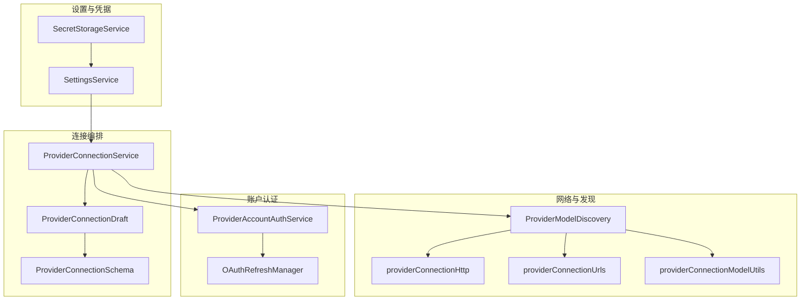
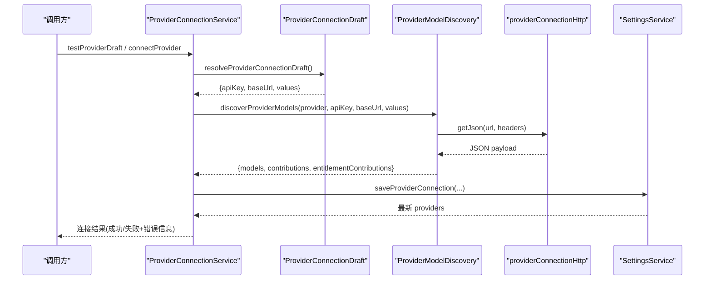
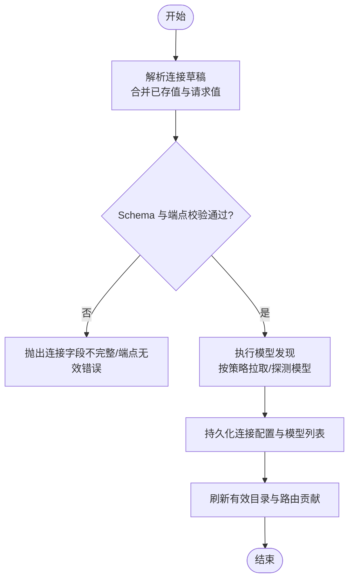
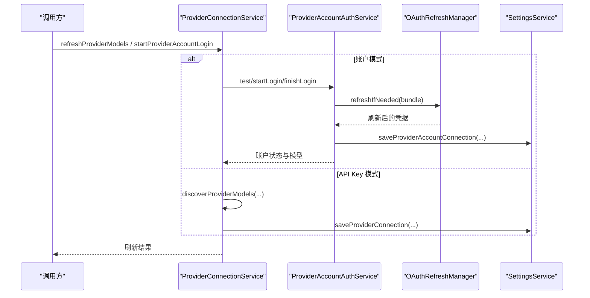
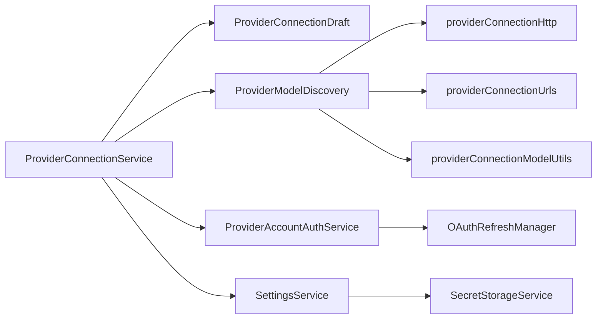

# 连接管理

<cite>
**本文引用的文件**
- [ProviderConnectionService.ts](file://src/main/settings/ProviderConnectionService.ts)
- [ProviderConnectionDraft.ts](file://src/main/settings/ProviderConnectionDraft.ts)
- [ProviderConnectionSchema.ts](file://src/main/settings/ProviderConnectionSchema.ts)
- [providerConnectionHttp.ts](file://src/main/settings/providerConnectionHttp.ts)
- [ProviderModelDiscovery.ts](file://src/main/settings/ProviderModelDiscovery.ts)
- [providerConnectionUrls.ts](file://src/main/settings/providerConnectionUrls.ts)
- [providerConnectionModelUtils.ts](file://src/main/settings/providerConnectionModelUtils.ts)
- [ProviderAccountAuthService.ts](file://src/main/settings/ProviderAccountAuthService.ts)
- [SettingsService.ts](file://src/main/settings/SettingsService.ts)
- [SecretStorageService.ts](file://src/main/settings/SecretStorageService.ts)
- [OAuthRefreshManager.ts](file://src/main/settings/OAuthRefreshManager.ts)
</cite>

## 目录
1. [简介](#简介)
2. [项目结构](#项目结构)
3. [核心组件](#核心组件)
4. [架构总览](#架构总览)
5. [详细组件分析](#详细组件分析)
6. [依赖关系分析](#依赖关系分析)
7. [性能与可靠性](#性能与可靠性)
8. [故障排查指南](#故障排查指南)
9. [结论](#结论)
10. [附录：配置示例与安全要点](#附录：配置示例与安全要点)

## 简介
本文件面向 Provider 连接管理的完整生命周期，涵盖连接的建立、维护、监控与销毁；详细说明连接配置的校验、凭据管理、模型发现与路由映射、超时与重试策略、错误恢复与状态跟踪；并提供安全连接（SSL/TLS）与代理支持的实践建议。内容基于代码实现进行梳理，便于开发者与运维人员理解与排障。

## 项目结构
连接管理相关能力集中在 settings 模块中，围绕“连接草稿解析”“HTTP 请求封装”“模型发现与路由投影”“账户登录与刷新”“设置与凭据存储”等职责划分清晰。

图表来源
- [ProviderConnectionService.ts:53-356](file://src/main/settings/ProviderConnectionService.ts#L53-L356)
- [ProviderConnectionDraft.ts:18-77](file://src/main/settings/ProviderConnectionDraft.ts#L18-L77)
- [ProviderConnectionSchema.ts:5-86](file://src/main/settings/ProviderConnectionSchema.ts#L5-L86)
- [providerConnectionHttp.ts:1-105](file://src/main/settings/providerConnectionHttp.ts#L1-L105)
- [ProviderModelDiscovery.ts:261-525](file://src/main/settings/ProviderModelDiscovery.ts#L261-L525)
- [providerConnectionUrls.ts:5-218](file://src/main/settings/providerConnectionUrls.ts#L5-L218)
- [providerConnectionModelUtils.ts:9-163](file://src/main/settings/providerConnectionModelUtils.ts#L9-L163)
- [ProviderAccountAuthService.ts:99-530](file://src/main/settings/ProviderAccountAuthService.ts#L99-L530)
- [SettingsService.ts:94-200](file://src/main/settings/SettingsService.ts#L94-L200)
- [SecretStorageService.ts:72-262](file://src/main/settings/SecretStorageService.ts#L72-L262)
- [OAuthRefreshManager.ts:49-86](file://src/main/settings/OAuthRefreshManager.ts#L49-L86)

章节来源
- [ProviderConnectionService.ts:53-356](file://src/main/settings/ProviderConnectionService.ts#L53-L356)
- [SettingsService.ts:94-200](file://src/main/settings/SettingsService.ts#L94-L200)

## 核心组件
- ProviderConnectionService：对外暴露连接测试、连接、刷新、断开、账户登录流程入口，协调模型发现与有效目录更新。
- ProviderConnectionDraft：将用户输入与已保存值合并为连接草稿，并校验必填字段与端点模板。
- ProviderConnectionSchema：提供连接字段校验、端点模板展开、头部映射生成等工具。
- providerConnectionHttp：统一 HTTP 请求封装，包含超时控制、错误格式化、模型负载解析。
- ProviderModelDiscovery：根据 Provider 协议与目录策略，拉取并标准化模型列表，生成路由贡献。
- providerConnectionUrls：不同 Provider 的 URL 构建与路由投影（如 Google Vertex、Bedrock）。
- providerConnectionModelUtils：模型归一化、别名索引、可用性合并与筛选。
- ProviderAccountAuthService：账户模式登录、授权码交换、目录发现、凭据刷新与持久化。
- SettingsService：Provider 配置读写、连接值与密钥解析、账号连接持久化。
- SecretStorageService：系统级安全存储（safeStorage），加密/解密凭据，权限加固。
- OAuthRefreshManager：OAuth 凭据刷新去重、失效处理与提交。

章节来源
- [ProviderConnectionService.ts:53-356](file://src/main/settings/ProviderConnectionService.ts#L53-L356)
- [ProviderConnectionDraft.ts:18-77](file://src/main/settings/ProviderConnectionDraft.ts#L18-L77)
- [ProviderConnectionSchema.ts:5-86](file://src/main/settings/ProviderConnectionSchema.ts#L5-L86)
- [providerConnectionHttp.ts:1-105](file://src/main/settings/providerConnectionHttp.ts#L1-L105)
- [ProviderModelDiscovery.ts:261-525](file://src/main/settings/ProviderModelDiscovery.ts#L261-L525)
- [providerConnectionUrls.ts:5-218](file://src/main/settings/providerConnectionUrls.ts#L5-L218)
- [providerConnectionModelUtils.ts:9-163](file://src/main/settings/providerConnectionModelUtils.ts#L9-L163)
- [ProviderAccountAuthService.ts:99-530](file://src/main/settings/ProviderAccountAuthService.ts#L99-L530)
- [SettingsService.ts:94-200](file://src/main/settings/SettingsService.ts#L94-L200)
- [SecretStorageService.ts:72-262](file://src/main/settings/SecretStorageService.ts#L72-L262)
- [OAuthRefreshManager.ts:49-86](file://src/main/settings/OAuthRefreshManager.ts#L49-L86)

## 架构总览
连接管理以“服务编排 + 策略发现 + 安全存储”为核心。连接建立时先解析草稿并校验，再调用模型发现获取可用模型与路由贡献，最后写入设置并刷新有效目录。账户模式通过 OAuth 流程完成登录与凭据刷新，并复用相同的目录发现机制。

图表来源
- [ProviderConnectionService.ts:111-198](file://src/main/settings/ProviderConnectionService.ts#L111-L198)
- [ProviderConnectionDraft.ts:18-53](file://src/main/settings/ProviderConnectionDraft.ts#L18-L53)
- [ProviderModelDiscovery.ts:261-525](file://src/main/settings/ProviderModelDiscovery.ts#L261-L525)
- [providerConnectionHttp.ts:11-26](file://src/main/settings/providerConnectionHttp.ts#L11-L26)
- [SettingsService.ts:169-197](file://src/main/settings/SettingsService.ts#L169-L197)

## 详细组件分析

### 连接建立与验证流程
- 草稿解析：合并请求参数与已保存值，识别主密钥字段，校验 schema 必填项与端点模板变量是否缺失。
- 端点校验：仅允许 http/https 绝对地址，自动清理尾部斜杠，支持模板变量替换。
- 模型发现：按 Provider 协议与目录策略选择解析器，必要时进行候选模型探测（如 Anthropic/Azure/Gemini/Coding Plan）。
- 结果持久化：保存 models、baseUrl、authMode、connectionValues 等，并刷新有效目录。

图表来源
- [ProviderConnectionDraft.ts:18-53](file://src/main/settings/ProviderConnectionDraft.ts#L18-L53)
- [ProviderConnectionSchema.ts:18-75](file://src/main/settings/ProviderConnectionSchema.ts#L18-L75)
- [ProviderModelDiscovery.ts:261-525](file://src/main/settings/ProviderModelDiscovery.ts#L261-L525)
- [ProviderConnectionService.ts:111-198](file://src/main/settings/ProviderConnectionService.ts#L111-L198)

章节来源
- [ProviderConnectionDraft.ts:18-53](file://src/main/settings/ProviderConnectionDraft.ts#L18-L53)
- [ProviderConnectionSchema.ts:18-75](file://src/main/settings/ProviderConnectionSchema.ts#L18-L75)
- [ProviderModelDiscovery.ts:261-525](file://src/main/settings/ProviderModelDiscovery.ts#L261-L525)
- [ProviderConnectionService.ts:111-198](file://src/main/settings/ProviderConnectionService.ts#L111-L198)

### 连接维护与刷新
- 刷新模型：对账户模式先检测登录态，对 API Key 模式重新发现并更新 models。
- 账户登录：启动浏览器或设备码流程，交换授权码，持久化凭据并发现目录。
- 凭据刷新：基于过期时间与抖动窗口进行刷新，失败时标记刷新失败并提示重新登录。

图表来源
- [ProviderConnectionService.ts:200-314](file://src/main/settings/ProviderConnectionService.ts#L200-L314)
- [ProviderAccountAuthService.ts:108-248](file://src/main/settings/ProviderAccountAuthService.ts#L108-L248)
- [OAuthRefreshManager.ts:54-86](file://src/main/settings/OAuthRefreshManager.ts#L54-L86)
- [SettingsService.ts:169-197](file://src/main/settings/SettingsService.ts#L169-L197)

章节来源
- [ProviderConnectionService.ts:200-314](file://src/main/settings/ProviderConnectionService.ts#L200-L314)
- [ProviderAccountAuthService.ts:108-248](file://src/main/settings/ProviderAccountAuthService.ts#L108-L248)
- [OAuthRefreshManager.ts:54-86](file://src/main/settings/OAuthRefreshManager.ts#L54-L86)

### 连接状态跟踪与监控
- 状态来源：Provider 条目中的 isConfigured、status、oauthExpiresAt、oauthRefreshAvailable 等。
- 账户状态：登录进行中、待确认、已连接、未连接、不可用等，附带诊断信息与授权模式。
- 目录刷新：连接成功后刷新有效目录，确保路由贡献与模型列表一致。

章节来源
- [ProviderAccountAuthService.ts:317-360](file://src/main/settings/ProviderAccountAuthService.ts#L317-L360)
- [ProviderConnectionService.ts:53-109](file://src/main/settings/ProviderConnectionService.ts#L53-L109)

### 超时处理、重试策略与错误恢复
- 超时：HTTP 层统一超时（默认 20 秒），AbortController 中断请求，错误消息友好化。
- 重试：当前未发现全局重试逻辑；对候选模型探测采用逐个尝试并继续的策略，避免单点失败阻断整体发现。
- 错误恢复：
  - 连接字段不完整、端点非法、缺少 Base URL、无可用模型等明确错误。
  - OAuth 刷新失败时记录刷新失败并提示重新登录。
  - 账户登录失败时输出诊断信息（如 Grok 的授权范围、回调地址等）。

章节来源
- [providerConnectionHttp.ts:7-39](file://src/main/settings/providerConnectionHttp.ts#L7-L39)
- [ProviderModelDiscovery.ts:127-165](file://src/main/settings/ProviderModelDiscovery.ts#L127-L165)
- [ProviderAccountAuthService.ts:406-446](file://src/main/settings/ProviderAccountAuthService.ts#L406-L446)

### 凭据管理与安全
- 存储位置：使用 safeStorage 加密存储，文件权限加固（Unix 600，Windows ACL）。
- 访问路径：SettingsService 根据 schema 的主密钥字段与其他 secret 字段分别读取。
- 安全约束：若系统安全存储不可用则拒绝写入；损坏文件隔离并重命名。

章节来源
- [SecretStorageService.ts:38-61](file://src/main/settings/SecretStorageService.ts#L38-L61)
- [SecretStorageService.ts:72-144](file://src/main/settings/SecretStorageService.ts#L72-L144)
- [SecretStorageService.ts:182-227](file://src/main/settings/SecretStorageService.ts#L182-L227)
- [SettingsService.ts:141-197](file://src/main/settings/SettingsService.ts#L141-L197)

### 连接池与故障转移
- 连接池：未发现显式连接池实现；每次请求通过 fetch 发起，由 HTTP 层统一管理超时与错误。
- 故障转移：
  - 多路由投影：Google Vertex 同时提供原生与 OpenAI 兼容路由；Bedrock 提供 ChatCompletions 与 Responses 两种路由。
  - 模型过滤与可用性合并：当目录返回元模型或受限模型时，结合 managed models 与别名索引决定启用状态。

章节来源
- [providerConnectionUrls.ts:5-108](file://src/main/settings/providerConnectionUrls.ts#L5-L108)
- [providerConnectionModelUtils.ts:92-163](file://src/main/settings/providerConnectionModelUtils.ts#L92-L163)

### 安全连接、SSL/TLS 与代理支持
- SSL/TLS：URL 强制要求 https 或 http；建议使用 https 保障传输安全。
- 代理支持：代码未内置代理配置；可通过环境变量或底层网络栈配置代理（例如 Node.js 环境下的 HTTPS_PROXY/HTTP_PROXY），或在宿主环境中配置系统代理。
- 头部注入：支持通过 schema 的 headerMappings 将连接值映射到请求头，用于鉴权或租户标识。

章节来源
- [ProviderConnectionSchema.ts:39-85](file://src/main/settings/ProviderConnectionSchema.ts#L39-L85)
- [ProviderModelDiscovery.ts:104-125](file://src/main/settings/ProviderModelDiscovery.ts#L104-L125)

## 依赖关系分析
- ProviderConnectionService 依赖 ProviderConnectionDraft、ProviderModelDiscovery、SettingsService、ProviderAccountAuthService。
- ProviderModelDiscovery 依赖 providerConnectionHttp、providerConnectionUrls、providerConnectionModelUtils 以及各 Provider 的目录解析器。
- SettingsService 依赖 SecretStorageService 与 provider-catalog 注册表，负责配置与凭据的读写。
- ProviderAccountAuthService 依赖 OAuth 子模块与 OAuthRefreshManager，负责账户登录与凭据刷新。

图表来源
- [ProviderConnectionService.ts:53-356](file://src/main/settings/ProviderConnectionService.ts#L53-L356)
- [ProviderModelDiscovery.ts:261-525](file://src/main/settings/ProviderModelDiscovery.ts#L261-L525)
- [SettingsService.ts:94-200](file://src/main/settings/SettingsService.ts#L94-L200)
- [ProviderAccountAuthService.ts:99-530](file://src/main/settings/ProviderAccountAuthService.ts#L99-L530)

章节来源
- [ProviderConnectionService.ts:53-356](file://src/main/settings/ProviderConnectionService.ts#L53-L356)
- [ProviderModelDiscovery.ts:261-525](file://src/main/settings/ProviderModelDiscovery.ts#L261-L525)
- [SettingsService.ts:94-200](file://src/main/settings/SettingsService.ts#L94-L200)
- [ProviderAccountAuthService.ts:99-530](file://src/main/settings/ProviderAccountAuthService.ts#L99-L530)

## 性能与可靠性
- 超时控制：统一 20 秒超时，避免长尾请求阻塞。
- 并发优化：部分目录发现并行拉取（如 Free Model Catalog 的多个源）。
- 模型探测：对候选模型逐一探测，失败不阻断整体流程，提升鲁棒性。
- 缓存与刷新：账户凭据刷新具备抖动窗口与去重，减少重复刷新压力。

[本节为通用指导，无需特定文件引用]

## 故障排查指南
- 连接字段不完整：检查 schema 必填字段与主密钥字段是否正确填写。
- 端点无效：确保 Base URL 为绝对 http/https 地址，且模板变量均已提供。
- 无可用模型：确认 Provider 返回的模型列表是否包含可路由模型；必要时调整推荐模型或路由策略。
- 账户登录失败：查看诊断信息（授权范围、回调地址、设备码等），确认网络与浏览器可达。
- 凭据刷新失败：检查刷新令牌是否过期或被撤销，必要时重新登录。

章节来源
- [ProviderConnectionDraft.ts:18-53](file://src/main/settings/ProviderConnectionDraft.ts#L18-L53)
- [ProviderConnectionSchema.ts:39-75](file://src/main/settings/ProviderConnectionSchema.ts#L39-L75)
- [ProviderModelDiscovery.ts:261-525](file://src/main/settings/ProviderModelDiscovery.ts#L261-L525)
- [ProviderAccountAuthService.ts:108-248](file://src/main/settings/ProviderAccountAuthService.ts#L108-L248)
- [OAuthRefreshManager.ts:54-86](file://src/main/settings/OAuthRefreshManager.ts#L54-L86)

## 结论
该连接管理体系以清晰的职责分层与强大的目录发现能力，支撑多种 Provider 的连接与路由。通过严格的配置校验、安全的凭据存储、统一的超时与错误处理，以及灵活的故障转移策略，确保了连接过程的稳定性与可观测性。对于生产环境，建议优先使用 https、合理配置代理、定期刷新凭据并关注模型可用性变化。

[本节为总结性内容，无需特定文件引用]

## 附录：配置示例与安全要点
- 连接配置示例（API Key 模式）
  - 提供者 ID：openai-compatible
  - Base URL：https://api.openai.com/v1
  - 主密钥字段：apiKey（从安全存储读取）
  - 其他连接值：可选（如租户标识）
  - 协议：OpenAICompatibleChatCompletions 或 OpenAIResponses（根据 Provider 定义）
- 连接配置示例（账户模式）
  - 提供者 ID：chatgpt-account / claude-account / github-copilot / grok-account / nous / openrouter
  - 登录流程：浏览器或设备码，完成后自动发现目录并持久化凭据
- 安全要点
  - 始终使用 https 端点
  - 通过 schema 的 headerMappings 注入必要请求头
  - 使用系统安全存储保存敏感凭据，避免明文
  - 在宿主环境或 Node 运行时配置代理（如 HTTPS_PROXY/HTTP_PROXY）以满足企业网络要求

[本节为概念性说明，无需特定文件引用]