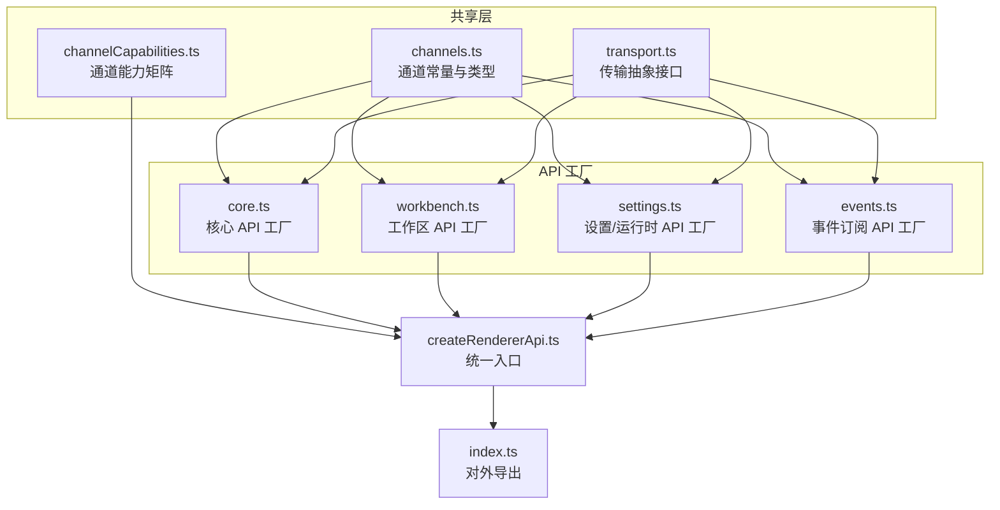
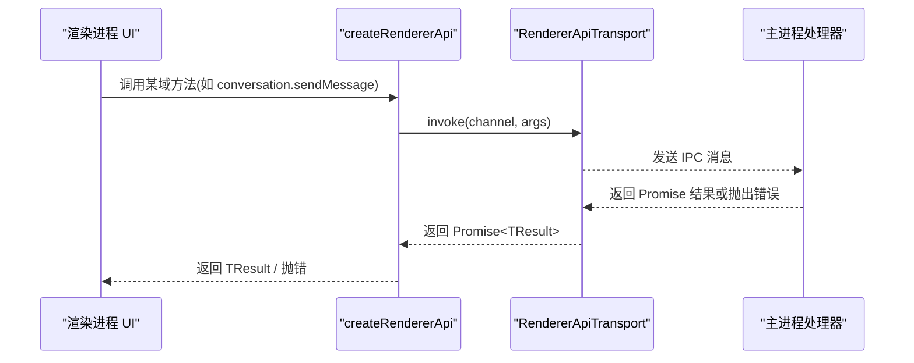
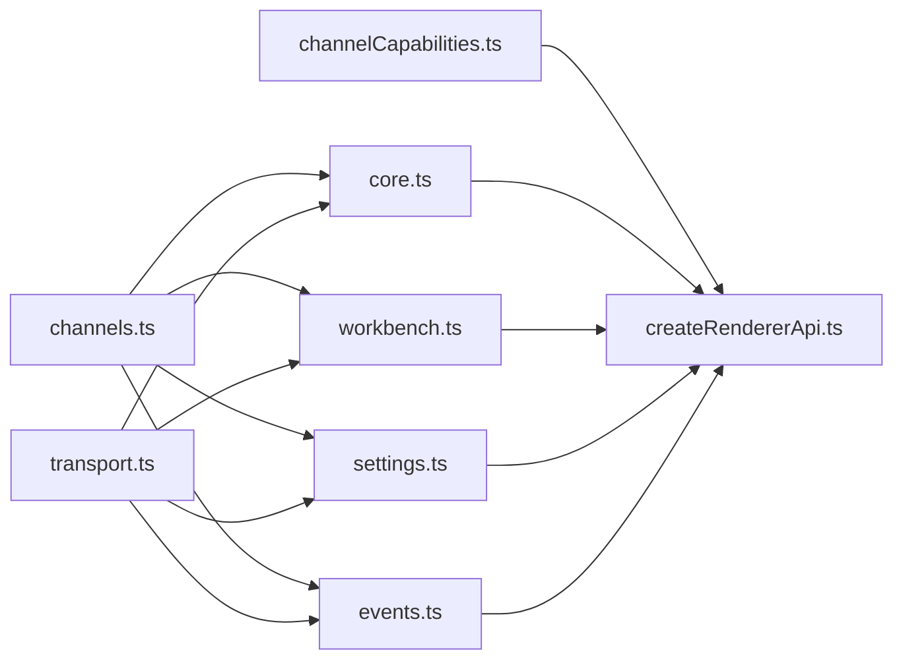

# 渲染器 API

<cite>
**本文引用的文件**
- [src/shared/renderer-api/index.ts](file://src/shared/renderer-api/index.ts)
- [src/shared/renderer-api/createRendererApi.ts](file://src/shared/renderer-api/createRendererApi.ts)
- [src/shared/renderer-api/core.ts](file://src/shared/renderer-api/core.ts)
- [src/shared/renderer-api/workbench.ts](file://src/shared/renderer-api/workbench.ts)
- [src/shared/renderer-api/settings.ts](file://src/shared/renderer-api/settings.ts)
- [src/shared/renderer-api/events.ts](file://src/shared/renderer-api/events.ts)
- [src/shared/renderer-api/channels.ts](file://src/shared/renderer-api/channels.ts)
- [src/shared/renderer-api/transport.ts](file://src/shared/renderer-api/transport.ts)
- [src/shared/renderer-api/channelCapabilities.ts](file://src/shared/renderer-api/channelCapabilities.ts)
- [scripts/renderer-contract.mjs](file://scripts/renderer-contract.mjs)
- [src/shared/types/electron-api.ts](file://src/shared/types/electron-api.ts)
- [src/shared/types/electron/index.ts](file://src/shared/types/electron/index.ts)
</cite>

## 目录
1. [简介](#简介)
2. [项目结构](#项目结构)
3. [核心组件](#核心组件)
4. [架构总览](#架构总览)
5. [详细组件分析](#详细组件分析)
6. [依赖关系分析](#依赖关系分析)
7. [性能与可靠性](#性能与可靠性)
8. [故障排查指南](#故障排查指南)
9. [结论](#结论)
10. [附录：API 参考](#附录api-参考)

## 简介
本文件为 Renderer API 的完整参考文档，面向需要在渲染进程（浏览器端）集成 RDC-Agent 能力的开发者。文档覆盖向渲染器暴露的所有公共接口，包括：
- 核心 API：应用元信息、对话框、窗口控制、Web 能力等
- 工作区 API：项目、设备、会话、运行、捕获、上下文、追踪日志等
- 设置与运行时 API：记忆、LLM 提供商、设置、RDX 运行时资源等
- 事件订阅：工作流状态、设备/捕获/上下文变更、运行时日志、主题变化等

每个方法均说明用途、参数类型、返回值、异步处理与错误处理要点，并提供使用示例、最佳实践与兼容性说明，以及客户端集成指南和常见问题解决方案。

## 项目结构
渲染器 API 由“通道定义 + 传输抽象 + 各域 API 工厂 + 统一入口”构成：
- 通道定义：集中声明所有 IPC 调用与事件通道名，提供类型化校验工具
- 传输抽象：定义 invoke/subscribe/listener 的统一接口，屏蔽底层实现差异
- 各域 API 工厂：按功能域创建具体 API 对象，内部通过 transport.invoke 调用对应通道
- 统一入口：createRendererApi 聚合所有域 API，并暴露 on/off 事件订阅

图表来源
- [src/shared/renderer-api/channels.ts:1-244](file://src/shared/renderer-api/channels.ts#L1-L244)
- [src/shared/renderer-api/transport.ts:1-12](file://src/shared/renderer-api/transport.ts#L1-L12)
- [src/shared/renderer-api/channelCapabilities.ts:1-179](file://src/shared/renderer-api/channelCapabilities.ts#L1-L179)
- [src/shared/renderer-api/core.ts:1-145](file://src/shared/renderer-api/core.ts#L1-L145)
- [src/shared/renderer-api/workbench.ts:1-92](file://src/shared/renderer-api/workbench.ts#L1-L92)
- [src/shared/renderer-api/settings.ts:1-86](file://src/shared/renderer-api/settings.ts#L1-L86)
- [src/shared/renderer-api/events.ts:1-84](file://src/shared/renderer-api/events.ts#L1-L84)
- [src/shared/renderer-api/createRendererApi.ts:1-77](file://src/shared/renderer-api/createRendererApi.ts#L1-L77)
- [src/shared/renderer-api/index.ts:1-18](file://src/shared/renderer-api/index.ts#L1-L18)

章节来源
- [src/shared/renderer-api/index.ts:1-18](file://src/shared/renderer-api/index.ts#L1-L18)
- [src/shared/renderer-api/createRendererApi.ts:1-77](file://src/shared/renderer-api/createRendererApi.ts#L1-L77)

## 核心组件
- 通道与类型：集中管理所有 IPC 通道名与类型，提供 isRendererInvokeChannel/isRendererEventChannel 校验
- 传输抽象：RendererApiTransport 定义 invoke/subscribe/listener 的统一契约
- 能力矩阵：对每个通道标注 read/mutation/high-impact/desktop-only，用于安全策略与平台限制
- API 工厂：按域创建 typed API，封装 transport.invoke 调用
- 统一入口：createRendererApi 组装 ElectronAPI 形态的对象，供渲染进程直接使用

章节来源
- [src/shared/renderer-api/channels.ts:1-244](file://src/shared/renderer-api/channels.ts#L1-L244)
- [src/shared/renderer-api/transport.ts:1-12](file://src/shared/renderer-api/transport.ts#L1-L12)
- [src/shared/renderer-api/channelCapabilities.ts:1-179](file://src/shared/renderer-api/channelCapabilities.ts#L1-L179)
- [src/shared/renderer-api/core.ts:1-145](file://src/shared/renderer-api/core.ts#L1-L145)
- [src/shared/renderer-api/workbench.ts:1-92](file://src/shared/renderer-api/workbench.ts#L1-L92)
- [src/shared/renderer-api/settings.ts:1-86](file://src/shared/renderer-api/settings.ts#L1-L86)
- [src/shared/renderer-api/events.ts:1-84](file://src/shared/renderer-api/events.ts#L1-L84)
- [src/shared/renderer-api/createRendererApi.ts:1-77](file://src/shared/renderer-api/createRendererApi.ts#L1-L77)

## 架构总览
渲染器通过 createRendererApi 获取统一的 ElectronAPI 对象，所有方法最终通过 transport.invoke 或 transport.subscribe/listener 与主进程通信。通道名在 channels.ts 中统一定义，能力矩阵在 channelCapabilities.ts 中约束。

图表来源
- [src/shared/renderer-api/createRendererApi.ts:33-76](file://src/shared/renderer-api/createRendererApi.ts#L33-L76)
- [src/shared/renderer-api/channels.ts:1-244](file://src/shared/renderer-api/channels.ts#L1-L244)
- [src/shared/renderer-api/transport.ts:5-11](file://src/shared/renderer-api/transport.ts#L5-L11)

## 详细组件分析

### 核心 API（应用、对话框、窗口、Web）
- appMeta：获取应用元信息
- appShell：选择头像、打开路径、复制/读取剪贴板
- dialog：选择文件/目录/RDC 文件
- windowControls：最小化、最大化切换、关闭、查询最大化状态
- web：解析 favicon

这些方法均为异步调用，通过 transport.invoke 执行，返回 Promise<TResult>。错误由主进程侧抛出，渲染侧需 try/catch 或 .catch 处理。

章节来源
- [src/shared/renderer-api/core.ts:20-53](file://src/shared/renderer-api/core.ts#L20-L53)
- [src/shared/renderer-api/channels.ts:1-17](file://src/shared/renderer-api/channels.ts#L1-L17)

### 对话与工作流 API
- conversation：发送消息、重写、取消轮次、回答用户输入/工具审批、历史操作、附件暂存与预览、分支切换等；支持 onEvent/offEvent 订阅对话事件
- workflow：获取状态、恢复/停止运行、查询用量、列出运行/活跃运行

注意：conversation.onEvent/on off 基于 transport.addListener/removeListener，需在合适时机解绑以避免内存泄漏。

章节来源
- [src/shared/renderer-api/core.ts:55-88](file://src/shared/renderer-api/core.ts#L55-L88)
- [src/shared/renderer-api/channels.ts:18-46](file://src/shared/renderer-api/channels.ts#L18-L46)

### 工作区 API（项目、设备、会话、运行、捕获、上下文、追踪）
- project：增删改查项目与输入项
- device：列表、刷新、激活、watch 生命周期
- session：增删改查、选择、模型覆盖、Agent 配置
- run：列出运行
- runtimeLog：列出运行时日志
- capture：列表、选择、打开项目输入、查询/清理已打开状态
- context：获取上下文快照、打开/关闭人类预览
- trace：获取运行、事件、投影、导出、分支切换

章节来源
- [src/shared/renderer-api/workbench.ts:14-91](file://src/shared/renderer-api/workbench.ts#L14-L91)
- [src/shared/renderer-api/channels.ts:123-175](file://src/shared/renderer-api/channels.ts#L123-L175)

### 设置与运行时 API（记忆、LLM、设置、RDX 运行时）
- memory：颁发批准令牌、列举/读写/删除
- rdxRuntime：概览、资源验证/增删改查、导入、揭示、信任/撤销 Hook/MCP、测试 Hook、请求快照
- llm：测试草稿/能力、连接/断开、账号登录流程、刷新模型、登出
- settings：获取设置/目录/有效模型/目录、检查密钥、导入 Agent 清单、保存定义、查询提交、模型覆盖、解析 Shell、批量设置

章节来源
- [src/shared/renderer-api/settings.ts:6-85](file://src/shared/renderer-api/settings.ts#L6-L85)
- [src/shared/renderer-api/channels.ts:47-122](file://src/shared/renderer-api/channels.ts#L47-L122)

### 事件订阅 API
提供一系列 onXxx 方法，订阅工作流状态、运行状态/用量、追踪投影、有效目录、Agent 消息/状态、工具执行完成、证据事件、设备/捕获/上下文变更、项目输入变更、运行时日志追加、主题变化等。同时提供 removeAllListeners 以批量移除监听。

章节来源
- [src/shared/renderer-api/events.ts:14-83](file://src/shared/renderer-api/events.ts#L14-L83)
- [src/shared/renderer-api/channels.ts:178-218](file://src/shared/renderer-api/channels.ts#L178-L218)

### 统一入口与平台能力
createRendererApi 根据 platform 注入 isMac/isWindows/isLinux，并聚合所有域 API。顶层暴露 on/off 用于原始事件通道订阅，内部会进行通道类型校验。

章节来源
- [src/shared/renderer-api/createRendererApi.ts:33-76](file://src/shared/renderer-api/createRendererApi.ts#L33-L76)
- [src/shared/renderer-api/channels.ts:237-243](file://src/shared/renderer-api/channels.ts#L237-L243)

## 依赖关系分析
- channels.ts 是所有通道的单一事实来源，被 core/workbench/settings/events 共同引用
- transport.ts 定义抽象接口，所有 API 工厂仅依赖该接口，便于替换底层实现
- channelCapabilities.ts 维护通道能力矩阵，用于构建期/运行期校验
- createRendererApi.ts 聚合所有工厂，形成 ElectronAPI 形态
- types 层将各域类型重新导出，保持对外稳定

图表来源
- [src/shared/renderer-api/channels.ts:1-244](file://src/shared/renderer-api/channels.ts#L1-L244)
- [src/shared/renderer-api/transport.ts:1-12](file://src/shared/renderer-api/transport.ts#L1-L12)
- [src/shared/renderer-api/channelCapabilities.ts:1-179](file://src/shared/renderer-api/channelCapabilities.ts#L1-L179)
- [src/shared/renderer-api/createRendererApi.ts:1-77](file://src/shared/renderer-api/createRendererApi.ts#L1-L77)

章节来源
- [src/shared/renderer-api/channels.ts:1-244](file://src/shared/renderer-api/channels.ts#L1-L244)
- [src/shared/renderer-api/createRendererApi.ts:1-77](file://src/shared/renderer-api/createRendererApi.ts#L1-L77)

## 性能与可靠性
- 异步 I/O：所有方法均为异步，避免阻塞 UI；建议合理并发与重试
- 事件去重与节流：高频事件（如日志追加、运行状态）建议在 UI 层做节流/合并
- 资源释放：及时移除事件监听，避免内存泄漏
- 能力矩阵：high-impact 通道应谨慎调用，必要时增加确认与限流
- 平台限制：desktop-only 通道在非桌面环境不应调用

[本节为通用指导，不直接分析具体文件]

## 故障排查指南
- 未知通道：若出现 BRIDGE_CAPABILITY_MISSING，请检查是否在 channelCapabilities.ts 中登记了该通道
- 未注册路径：构建脚本 renderer-contract.mjs 会校验合同文件完整性，缺失或废弃路径会导致失败
- 事件未触发：确认通道名与订阅方法匹配，且未在组件卸载前移除监听
- 权限/平台错误：desktop-only 通道在非桌面环境不可用；mutation/high-impact 通道可能被安全策略拦截

章节来源
- [src/shared/renderer-api/channelCapabilities.ts:148-176](file://src/shared/renderer-api/channelCapabilities.ts#L148-L176)
- [scripts/renderer-contract.mjs:111-118](file://scripts/renderer-contract.mjs#L111-L118)

## 结论
Renderer API 通过清晰的通道定义、传输抽象与能力矩阵，提供了稳定、可审计、可扩展的跨进程接口集合。遵循本文的最佳实践与兼容性说明，可在渲染进程中安全高效地集成 RDC-Agent 的各项能力。

[本节为总结性内容，不直接分析具体文件]

## 附录：API 参考

### 统一入口
- createRendererApi(platform, transport): 返回 ElectronAPI 对象，包含所有域 API 与 on/off 事件订阅

章节来源
- [src/shared/renderer-api/createRendererApi.ts:33-76](file://src/shared/renderer-api/createRendererApi.ts#L33-L76)

### 核心 API
- appMeta.get(): Promise<AppMeta>
- appShell.selectAvatar(): Promise<void>
- appShell.getAvatarDataUrl(avatarPath): Promise<string>
- appShell.openPath(targetPath): Promise<void>
- appShell.copyText(text): Promise<void>
- appShell.readClipboardText(): Promise<string>
- web.resolveFavicon(domain): Promise<string>
- dialog.selectFiles(): Promise<string[]>
- dialog.selectRdcFiles(): Promise<string[]>
- dialog.selectDirectory(): Promise<string>
- windowControls.minimize(): Promise<void>
- windowControls.toggleMaximize(): Promise<void>
- windowControls.close(): Promise<void>
- windowControls.isMaximized(): Promise<boolean>

章节来源
- [src/shared/renderer-api/core.ts:20-53](file://src/shared/renderer-api/core.ts#L20-L53)
- [src/shared/renderer-api/channels.ts:1-17](file://src/shared/renderer-api/channels.ts#L1-L17)

### 对话与工作流
- conversation.sendMessage(request): Promise<void>
- conversation.rewriteFromMessage(request): Promise<void>
- conversation.cancelActiveTurn(request): Promise<void>
- conversation.answerUserInput(request): Promise<void>
- conversation.answerToolApproval(request): Promise<void>
- conversation.getHistory(sessionId): Promise<ConversationHistory>
- conversation.switchBranch(request): Promise<void>
- conversation.clearHistory(sessionId): Promise<void>
- conversation.undoLastTurn(sessionId): Promise<void>
- conversation.getToolImagePreview(request): Promise<ImagePreview>
- conversation.stageAttachments(request): Promise<void>
- conversation.releaseAttachments(request): Promise<void>
- conversation.getAttachmentPreview(request): Promise<AttachmentPreview>
- conversation.onEvent(callback): void
- conversation.offEvent(callback): void

- workflow.getState(): Promise<WorkflowState>
- workflow.resume(sessionId): Promise<void>
- workflow.stop(runId): Promise<void>
- workflow.getRunUsage(request): Promise<RunContextUsageSummary>
- workflow.listRuns(): Promise<RunList>
- workflow.listActiveRuns(): Promise<ActiveRunList>

章节来源
- [src/shared/renderer-api/core.ts:55-88](file://src/shared/renderer-api/core.ts#L55-L88)
- [src/shared/renderer-api/channels.ts:18-46](file://src/shared/renderer-api/channels.ts#L18-L46)

### 工作区 API
- project.list(): Promise<ProjectList>
- project.add(rootPath): Promise<void>
- project.select(projectId): Promise<void>
- project.rename(projectId, newName): Promise<void>
- project.remove(projectId): Promise<void>
- project.inputs.list(projectId): Promise<InputList>
- project.inputs.refresh(projectId): Promise<void>
- project.inputs.import(projectId): Promise<void>
- project.inputs.importPaths(projectId, filePaths): Promise<void>

- device.list(): Promise<DeviceList>
- device.refresh(): Promise<void>
- device.activate(deviceId): Promise<void>
- device.watchStart(): Promise<void>
- device.watchRenew(): Promise<void>
- device.watchStop(): Promise<void>

- session.list(projectId): Promise<SessionList>
- session.create(projectId, title): Promise<Session>
- session.rename(id, title): Promise<void>
- session.remove(id): Promise<void>
- session.select(id): Promise<void>
- session.setModelOverride(id, modelOverride): Promise<void>
- session.setAgentId(id, agentId): Promise<void>

- run.list(sessionId): Promise<RunList>

- runtimeLog.list(request): Promise<RuntimeLogEntry[]>

- capture.list(scope): Promise<CaptureList>
- capture.select(request): Promise<void>
- capture.openProjectInput(request): Promise<void>
- capture.getOpenedState(scope): Promise<OpenedCaptureState>
- capture.clearOpenedState(scope): Promise<void>

- context.get(scope): Promise<ContextSnapshot | null>
- context.openHumanPreview(scope): Promise<void>
- context.closeHumanPreview(scope): Promise<void>

- trace.getRun(runId): Promise<TraceRun>
- trace.getEvents(runId, afterSeq): Promise<TraceEvent[]>
- trace.getProjection(sessionId): Promise<TraceProjection>
- trace.exportRun(runId): Promise<void>
- trace.switchBranch(sessionId, branchId): Promise<void>

章节来源
- [src/shared/renderer-api/workbench.ts:14-91](file://src/shared/renderer-api/workbench.ts#L14-L91)
- [src/shared/renderer-api/channels.ts:123-175](file://src/shared/renderer-api/channels.ts#L123-L175)

### 设置与运行时 API
- memory.issueApprovalToken(request): Promise<Token>
- memory.list(scope, projectRoot): Promise<MemoryRecord[]>
- memory.get(scope, name, projectRoot): Promise<MemoryRecord>
- memory.write(request): Promise<void>
- memory.delete(scope, name, approvalToken, projectRoot): Promise<void>

- rdxRuntime.getOverview(projectRoot?): Promise<RdxRuntimeOverview>
- rdxRuntime.validateResource(request): Promise<ValidationResult>
- rdxRuntime.upsertResource(request): Promise<ResourceHandle>
- rdxRuntime.importResource(request): Promise<ResourceHandle>
- rdxRuntime.deleteResource(kind, scope, id, projectRoot): Promise<void>
- rdxRuntime.revealResource(sourcePath): Promise<void>
- rdxRuntime.trustHook(projectRoot, hookId): Promise<void>
- rdxRuntime.revokeHook(projectRoot, hookId): Promise<void>
- rdxRuntime.trustMcp(projectRoot, descriptorId): Promise<void>
- rdxRuntime.revokeMcp(projectRoot, descriptorId): Promise<void>
- rdxRuntime.testHook(event, projectRoot, hookId): Promise<TestResult>
- rdxRuntime.listRequestSnapshots(sessionId, turnId): Promise<SnapshotList>
- rdxRuntime.getRequestSnapshot(sessionId, turnId, snapshotId): Promise<RequestSnapshot>

- llm.testProviderDraft(request): Promise<TestResult>
- llm.testModelCapability(request): Promise<ModelCapability>
- llm.connectProvider(request): Promise<void>
- llm.refreshProviderModels(providerId): Promise<void>
- llm.disconnectProvider(providerId): Promise<void>
- llm.startProviderAccountLogin(request): Promise<void>
- llm.getProviderAccountStatus(providerId): Promise<AccountStatus>
- llm.finishProviderAccountLogin(request): Promise<void>
- llm.logoutProviderAccount(providerId): Promise<void>

- settings.get(): Promise<Settings>
- settings.getProviderCatalog(): Promise<ProviderCatalog>
- settings.getEffectiveModel(agentId): Promise<EffectiveModel>
- settings.getEffectiveCatalog(providerId, accountId?): Promise<EffectiveCatalog>
- settings.hasProviderSecret(providerId): Promise<boolean>
- settings.importAgentManifest(filePath): Promise<void>
- settings.saveAgentDefinition(request): Promise<void>
- settings.getAgentDefinitionCommit(query): Promise<CommitInfo>
- settings.saveProviderDefinition(request): Promise<void>
- settings.getProviderDefinitionCommit(providerId): Promise<CommitInfo>
- settings.getModelsOverride(): Promise<ModelOverrides>
- settings.setModelsOverride(overrides): Promise<void>
- settings.getResolvedShell(executable): Promise<ResolvedShell>
- settings.set(settings): Promise<void>

章节来源
- [src/shared/renderer-api/settings.ts:6-85](file://src/shared/renderer-api/settings.ts#L6-L85)
- [src/shared/renderer-api/channels.ts:47-122](file://src/shared/renderer-api/channels.ts#L47-L122)

### 事件订阅 API
- events.onWorkflowStateChanged(callback): () => void
- events.onRunStatusChanged(callback): () => void
- events.onRunUsageChanged(callback): () => void
- events.onTraceProjectionChanged(callback): () => void
- events.onEffectiveCatalogChanged(callback): () => void
- events.onAgentMessage(callback): () => void
- events.onAgentStatusChanged(callback): () => void
- events.onToolExecutionComplete(callback): () => void
- events.onEvidenceEventAdded(callback): () => void
- events.onDeviceStatusChanged(callback): () => void
- events.onCaptureStatusChanged(callback): () => void
- events.onContextChanged(callback): () => void
- events.onProjectInputsChanged(callback): () => void
- events.onOpenedCaptureStateChanged(callback): () => void
- events.onRuntimeLogAppended(callback): () => void
- events.onAppThemeChanged(callback): () => void
- events.removeAllListeners(channel): void

章节来源
- [src/shared/renderer-api/events.ts:14-83](file://src/shared/renderer-api/events.ts#L14-L83)
- [src/shared/renderer-api/channels.ts:178-218](file://src/shared/renderer-api/channels.ts#L178-L218)

### 传输与通道
- RendererApiTransport.invoke(channel, ...args): Promise<TResult>
- RendererApiTransport.subscribe(channel, callback): () => void
- RendererApiTransport.addListener(channel, callback): void
- RendererApiTransport.removeListener(channel, callback): void
- RendererApiTransport.removeAllListeners(channel): void
- isRendererInvokeChannel(channel): boolean
- isRendererEventChannel(channel): boolean
- RENDERER_INVOKE_CHANNELS / RENDERER_EVENT_CHANNELS：只读通道列表

章节来源
- [src/shared/renderer-api/transport.ts:1-12](file://src/shared/renderer-api/transport.ts#L1-L12)
- [src/shared/renderer-api/channels.ts:220-244](file://src/shared/renderer-api/channels.ts#L220-L244)

### 类型与导出
- electron-api.ts 重新导出各域类型别名
- electron/index.ts 汇总导出各域类型

章节来源
- [src/shared/types/electron-api.ts:1-32](file://src/shared/types/electron-api.ts#L1-L32)
- [src/shared/types/electron/index.ts:1-19](file://src/shared/types/electron/index.ts#L1-L19)

### 使用示例（路径指引）
- 初始化与调用：参见 [createRendererApi.ts:33-76](file://src/shared/renderer-api/createRendererApi.ts#L33-L76)
- 对话发送消息：参见 [core.ts:55-77](file://src/shared/renderer-api/core.ts#L55-L77)
- 工作区项目操作：参见 [workbench.ts:14-30](file://src/shared/renderer-api/workbench.ts#L14-L30)
- 设置与 LLM：参见 [settings.ts:48-85](file://src/shared/renderer-api/settings.ts#L48-L85)
- 事件订阅：参见 [events.ts:14-83](file://src/shared/renderer-api/events.ts#L14-L83)

### 最佳实践
- 始终使用 createRendererApi 获取 API，不要直接拼接通道字符串
- 对 high-impact 与 mutation 通道进行必要的前置校验与用户确认
- 事件监听在组件卸载时及时移除，避免内存泄漏
- 对网络/IO 密集的操作进行节流与重试，提升用户体验
- 利用能力矩阵与平台判断，避免在不支持的环境调用 desktop-only 通道

### 兼容性说明
- 平台相关：isMac/isWindows/isLinux 可用于条件渲染与行为分支
- 桌面专属：部分通道标记为 desktop-only，非桌面环境不应调用
- 构建期校验：renderer-contract.mjs 确保合同文件完整性与废弃路径不被引入

章节来源
- [scripts/renderer-contract.mjs:111-118](file://scripts/renderer-contract.mjs#L111-L118)
- [src/shared/renderer-api/channelCapabilities.ts:11-146](file://src/shared/renderer-api/channelCapabilities.ts#L11-L146)