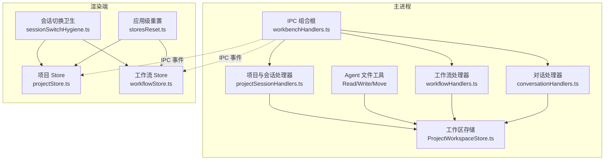
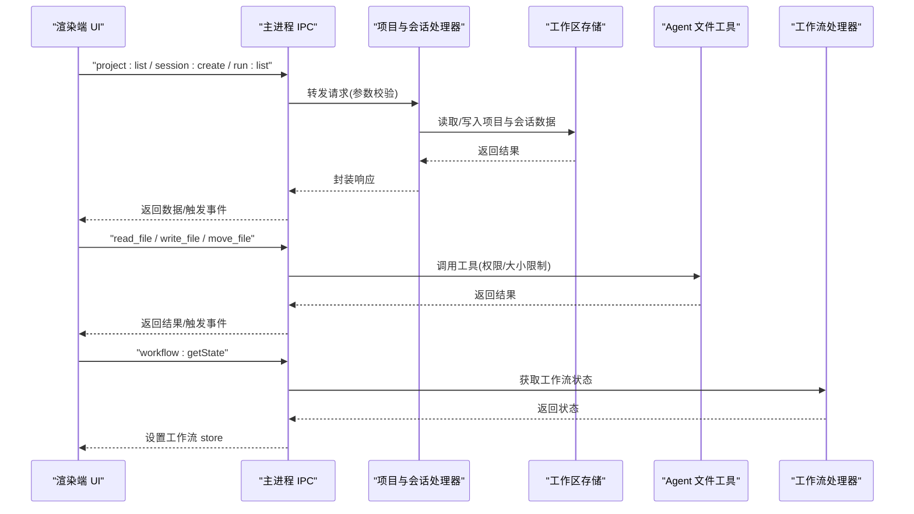
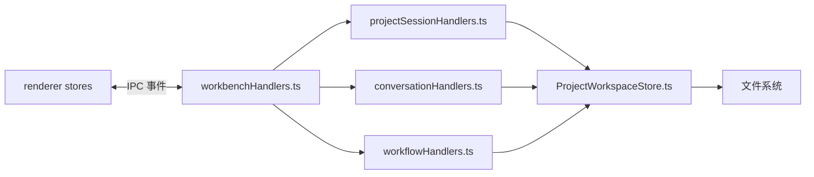
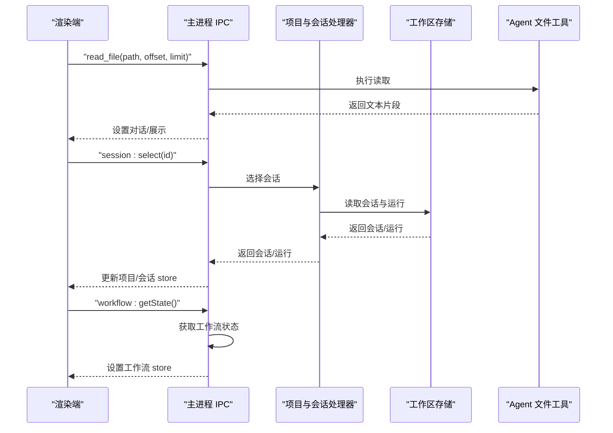

# 工作区 API

<cite>
**本文引用的文件**
- [workbenchHandlers.ts](file://src/main/ipc/workbenchHandlers.ts)
- [projectSessionHandlers.ts](file://src/main/ipc/projectSessionHandlers.ts)
- [ProjectWorkspaceStore.ts](file://src/main/sessions/ProjectWorkspaceStore.ts)
- [ReadFileTool.ts](file://src/main/agent-runtime/tools/primitives/ReadFileTool.ts)
- [WriteFileTool.ts](file://src/main/agent-runtime/tools/primitives/WriteFileTool.ts)
- [MoveFileTool.ts](file://src/main/agent-runtime/tools/file/MoveFileTool.ts)
- [workflowHandlers.ts](file://src/main/ipc/workflowHandlers.ts)
- [conversationHandlers.ts](file://src/main/ipc/conversationHandlers.ts)
- [workbenchContext.ts](file://src/main/ipc/workbenchContext.ts)
- [projectStore.ts](file://src/renderer/stores/projectStore.ts)
- [workflowStore.ts](file://src/renderer/stores/workflowStore.ts)
- [sessionSwitchHygiene.ts](file://src/renderer/stores/sessionSwitchHygiene.ts)
- [storesReset.ts](file://src/renderer/app/storesReset.ts)
- [session-projection.md](file://docs/contracts/session-projection.md)
</cite>

## 目录
1. [简介](#简介)
2. [项目结构](#项目结构)
3. [核心组件](#核心组件)
4. [架构总览](#架构总览)
5. [详细组件分析](#详细组件分析)
6. [依赖关系分析](#依赖关系分析)
7. [性能考量](#性能考量)
8. [故障排查指南](#故障排查指南)
9. [结论](#结论)
10. [附录](#附录)

## 简介
本参考文档面向“工作区 API”，覆盖与项目、会话、运行以及界面状态相关的主要操作方法，包括：
- 项目文件操作（读取、写入、移动等）
- 会话管理（创建、选择、重命名、删除、输入资源导入刷新）
- 运行生命周期（列表、状态变更广播）
- 界面状态控制（渲染端 store 重置与切换卫生）

文档提供每个方法的参数类型、返回值与异步行为说明，并给出完整示例、错误处理模式与性能优化建议。

## 项目结构
工作区能力由主进程 IPC 层统一暴露，后端通过存储适配器与持久化层交互，前端通过 Electron IPC 调用并更新本地 store。关键入口与职责如下：
- 主进程 IPC 组合根：注册所有领域处理器，维护当前工作区上下文（项目、会话、运行）。
- 项目与会话处理器：提供项目 CRUD、会话 CRUD、运行列表等能力。
- 工作区存储：负责项目注册表、选择态、输入资源扫描与导入。
- Agent 工具：提供工作区内文件读写的细粒度能力，带权限与大小限制。
- 渲染端 Store：维护项目、会话、工作流等 UI 状态，并在切换时执行清理与激活。

**图表来源**
- [workbenchHandlers.ts:1-290](file://src/main/ipc/workbenchHandlers.ts#L1-L290)
- [projectSessionHandlers.ts:1-403](file://src/main/ipc/projectSessionHandlers.ts#L1-L403)
- [ProjectWorkspaceStore.ts:1-510](file://src/main/sessions/ProjectWorkspaceStore.ts#L1-L510)
- [ReadFileTool.ts:1-136](file://src/main/agent-runtime/tools/primitives/ReadFileTool.ts#L1-L136)
- [WriteFileTool.ts:1-95](file://src/main/agent-runtime/tools/primitives/WriteFileTool.ts#L1-L95)
- [MoveFileTool.ts:1-51](file://src/main/agent-runtime/tools/file/MoveFileTool.ts#L1-L51)
- [workflowHandlers.ts:1-33](file://src/main/ipc/workflowHandlers.ts#L1-L33)
- [conversationHandlers.ts:1-78](file://src/main/ipc/conversationHandlers.ts#L1-L78)
- [projectStore.ts:1-98](file://src/renderer/stores/projectStore.ts#L1-L98)
- [workflowStore.ts:1-24](file://src/renderer/stores/workflowStore.ts#L1-L24)
- [sessionSwitchHygiene.ts:1-38](file://src/renderer/stores/sessionSwitchHygiene.ts#L1-L38)
- [storesReset.ts:1-40](file://src/renderer/app/storesReset.ts#L1-L40)

**章节来源**
- [workbenchHandlers.ts:1-290](file://src/main/ipc/workbenchHandlers.ts#L1-L290)
- [projectSessionHandlers.ts:1-403](file://src/main/ipc/projectSessionHandlers.ts#L1-L403)
- [ProjectWorkspaceStore.ts:1-510](file://src/main/sessions/ProjectWorkspaceStore.ts#L1-L510)

## 核心组件
- 工作区存储 ProjectWorkspaceStore
  - 职责：初始化工作区、项目注册表读写、选择态管理、输入资源扫描与导入、路径解析与元数据写入。
  - 关键点：原子写、目录锁、预算限制（深度/条目数）、规范化路径。
- IPC 组合根 workbenchHandlers
  - 职责：注册各域处理器、维护当前项目/会话/运行上下文、广播事件到渲染端。
- 项目与会话处理器 projectSessionHandlers
  - 职责：项目与会话的增删改查、输入资源导入/刷新、运行列表查询、会话选择恢复。
- Agent 文件工具 Read/Write/Move
  - 职责：在工作区范围内安全地读取/写入/移动文件，包含大小限制、权限标记与失败关闭策略。
- 工作流处理器 workflowHandlers
  - 职责：获取工作流状态、恢复中断运行、停止运行等。
- 对话处理器 conversationHandlers
  - 职责：发送消息、分支切换、历史获取、附件预览等。
- 渲染端 Store 与切换卫生
  - 职责：维护项目/会话/工作流等 UI 状态；在会话切换时进行清理与激活；应用级重置用于新用例或测试。

**章节来源**
- [ProjectWorkspaceStore.ts:1-510](file://src/main/sessions/ProjectWorkspaceStore.ts#L1-L510)
- [workbenchHandlers.ts:1-290](file://src/main/ipc/workbenchHandlers.ts#L1-L290)
- [projectSessionHandlers.ts:1-403](file://src/main/ipc/projectSessionHandlers.ts#L1-L403)
- [ReadFileTool.ts:1-136](file://src/main/agent-runtime/tools/primitives/ReadFileTool.ts#L1-L136)
- [WriteFileTool.ts:1-95](file://src/main/agent-runtime/tools/primitives/WriteFileTool.ts#L1-L95)
- [MoveFileTool.ts:1-51](file://src/main/agent-runtime/tools/file/MoveFileTool.ts#L1-L51)
- [workflowHandlers.ts:1-33](file://src/main/ipc/workflowHandlers.ts#L1-L33)
- [conversationHandlers.ts:1-78](file://src/main/ipc/conversationHandlers.ts#L1-L78)
- [projectStore.ts:1-98](file://src/renderer/stores/projectStore.ts#L1-L98)
- [workflowStore.ts:1-24](file://src/renderer/stores/workflowStore.ts#L1-L24)
- [sessionSwitchHygiene.ts:1-38](file://src/renderer/stores/sessionSwitchHygiene.ts#L1-L38)
- [storesReset.ts:1-40](file://src/renderer/app/storesReset.ts#L1-L40)

## 架构总览
工作区 API 采用“主进程 IPC + 存储适配 + Agent 工具”的分层设计。IPC 层仅做参数校验、上下文管理与事件广播；业务逻辑下沉至存储与工具层；渲染端通过 store 订阅变化并驱动 UI。

**图表来源**
- [projectSessionHandlers.ts:69-403](file://src/main/ipc/projectSessionHandlers.ts#L69-L403)
- [ProjectWorkspaceStore.ts:25-510](file://src/main/sessions/ProjectWorkspaceStore.ts#L25-L510)
- [ReadFileTool.ts:33-136](file://src/main/agent-runtime/tools/primitives/ReadFileTool.ts#L33-L136)
- [WriteFileTool.ts:27-95](file://src/main/agent-runtime/tools/primitives/WriteFileTool.ts#L27-L95)
- [MoveFileTool.ts:18-51](file://src/main/agent-runtime/tools/file/MoveFileTool.ts#L18-L51)
- [workflowHandlers.ts:18-33](file://src/main/ipc/workflowHandlers.ts#L18-L33)

## 详细组件分析

### 项目与会话管理（IPC 方法）
- 项目
  - project:list
    - 参数：无
    - 返回：{ projects: ProjectRecord[] }
    - 异步：否
  - project:add
    - 参数：{ rootPath: string }
    - 返回：{ success: boolean, project?: ProjectRecord, error?: string }
    - 异步：是
  - project:select
    - 参数：{ projectId: string }
    - 返回：{ success: boolean, project?: ProjectRecord, currentSession?: SessionRecord, currentRun?: RunSummary, error?: string }
    - 异步：是
  - project:rename
    - 参数：{ projectId: string, newName: string }
    - 返回：{ success: boolean, project?: ProjectRecord, error?: string }
    - 异步：否
  - project:remove
    - 参数：{ projectId: string }
    - 返回：{ success: boolean, error?: string }
    - 异步：是
  - project:inputs:list
    - 参数：{ projectId: string }
    - 返回：{ inputs: ProjectInputRecord[] }
    - 异步：是
  - project:inputs:refresh
    - 参数：{ projectId: string }
    - 返回：{ inputs: ProjectInputRecord[] }
    - 异步：是
  - project:inputs:import
    - 参数：{ projectId: string }
    - 返回：{ success: boolean, inputs: ProjectInputRecord[], error?: string }
    - 异步：是
  - project:inputs:importPaths
    - 参数：{ projectId: string, filePaths: string[] }
    - 返回：{ success: boolean, inputs: ProjectInputRecord[], error?: string }
    - 异步：是

- 会话
  - session:list
    - 参数：{ projectId?: string }
    - 返回：{ sessions: SessionRecord[] }
    - 异步：是
  - session:create
    - 参数：{ projectId: string, title: string }
    - 返回：{ success: boolean, session?: SessionRecord, error?: string }
    - 异步：是
  - session:rename
    - 参数：{ id: string, title: string }
    - 返回：{ success: boolean, session?: SessionRecord, error?: string }
    - 异步：是
  - session:remove
    - 参数：{ id: string }
    - 返回：{ success: boolean, nextSession?: SessionRecord, nextRun?: RunSummary, error?: string }
    - 异步：是
  - session:select
    - 参数：{ id: string }
    - 返回：{ success: boolean, session?: SessionRecord, currentRun?: RunSummary, error?: string }
    - 异步：是
  - session:setModelOverride
    - 参数：{ id: string, modelOverride?: { providerId: string, modelId: string } }
    - 返回：{ success: boolean, session?: SessionRecord, error?: string }
    - 异步：是
  - session:setAgentId
    - 参数：{ id: string, agentId: string }
    - 返回：{ success: boolean, session?: SessionRecord, error?: string }
    - 异步：是

- 运行
  - run:list
    - 参数：{ sessionId: string }
    - 返回：{ runs: RunSummary[] }
    - 异步：是

- 工作流
  - workflow:getState
    - 参数：无
    - 返回：WorkflowState | null
    - 异步：是

- 对话
  - conversation:sendMessage
    - 参数：ConversationSendRequest
    - 返回：ConversationSendResult
    - 异步：是

**章节来源**
- [projectSessionHandlers.ts:69-403](file://src/main/ipc/projectSessionHandlers.ts#L69-L403)
- [workflowHandlers.ts:18-33](file://src/main/ipc/workflowHandlers.ts#L18-L33)
- [conversationHandlers.ts:43-78](file://src/main/ipc/conversationHandlers.ts#L43-L78)

### 工作区存储（ProjectWorkspaceStore）
- initializeWorkspace
  - 作用：确保数据目录、项目目录、全局知识目录存在，恢复对话提交。
  - 异步：是
- listProjects
  - 作用：列出项目并按更新时间倒序排序。
  - 异步：否
- createProject
  - 作用：创建项目、构建资源布局、收集输入资源、写入元数据、设置当前项目。
  - 参数：rootPath: string
  - 返回：ProjectRecord
  - 异步：是
- renameProject / removeProject / getProjectById
  - 作用：重命名、删除、按 ID 查找项目。
  - 异步：否
- listProjectInputs / refreshProjectInputs / importProjectInputs
  - 作用：列举、刷新、导入 .rdc 输入资源；导入时复制文件并去重命名。
  - 异步：是
- getCurrentProjectId / setCurrentProjectId / getCurrentSessionId / setCurrentSessionId
  - 作用：读写选择态（项目/会话），保证一致性。
  - 异步：部分为是（会话选择）
- collectProjectInputs
  - 作用：递归扫描输入目录，限制最大深度与条目数，定期让出事件循环。
  - 异步：是
- 其他：registry/selection 读写、原子写、目录锁、路径规范化与元数据写入。

**章节来源**
- [ProjectWorkspaceStore.ts:15-510](file://src/main/sessions/ProjectWorkspaceStore.ts#L15-L510)

### Agent 文件工具（工作区文件操作）
- read_file
  - 参数：path: string, offset?: number, limit?: number
  - 返回：{ content: [{ type: 'text', text }], details: { path, totalLines, offset, limit, truncated } }
  - 行为：文本文件分段读取，二进制/.rdc/超大文件拒绝；支持中止信号。
  - 异步：是
- write_file
  - 参数：path: string, content: string
  - 返回：{ content: [{ type: 'text', text }], details: { path, bytesWritten, created, overwritten } }
  - 行为：父目录不存在则创建；内容大小受限；拒绝写入目录路径；可覆盖。
  - 异步：是
- move_file
  - 参数：source: string, destination: string
  - 返回：{ content: [{ type: 'text', text }], details: { source, destination, overwritten: false } }
  - 行为：目标已存在则拒绝；自动创建父目录；支持中止信号。
  - 异步：是

**章节来源**
- [ReadFileTool.ts:33-136](file://src/main/agent-runtime/tools/primitives/ReadFileTool.ts#L33-L136)
- [WriteFileTool.ts:27-95](file://src/main/agent-runtime/tools/primitives/WriteFileTool.ts#L27-L95)
- [MoveFileTool.ts:18-51](file://src/main/agent-runtime/tools/file/MoveFileTool.ts#L18-L51)

### 界面状态控制（渲染端）
- 会话切换卫生 applySessionSwitchHygiene
  - 作用：切换会话时清理对话、工作流、捕获、使用量快照等状态，并激活新会话。
  - 参数：previousSessionId?, nextSessionId?
  - 异步：否
- 应用级重置 resetWorkbenchStores
  - 作用：重置项目、会话、对话、证据、工作流、投影等 store，用于新建用例或测试。
  - 参数：无
  - 异步：否
- 项目与工作流 Store
  - 作用：维护当前项目/会话、右侧面板目标、项目输入资源；工作流状态与呈现。
  - 异步：否（store 更新同步）

**章节来源**
- [sessionSwitchHygiene.ts:8-38](file://src/renderer/stores/sessionSwitchHygiene.ts#L8-L38)
- [storesReset.ts:11-40](file://src/renderer/app/storesReset.ts#L11-L40)
- [projectStore.ts:25-98](file://src/renderer/stores/projectStore.ts#L25-L98)
- [workflowStore.ts:5-24](file://src/renderer/stores/workflowStore.ts#L5-L24)

## 依赖关系分析
- IPC 组合根依赖各域处理器，并通过 context 共享当前项目/会话/运行状态。
- 项目与会话处理器依赖存储适配器与持久化层（ProjectWorkspaceStore）。
- Agent 文件工具依赖文件系统与安全校验，受权限与大小限制约束。
- 渲染端 store 通过 IPC 事件与主进程保持同步；会话切换时执行清理与激活。

**图表来源**
- [workbenchHandlers.ts:18-280](file://src/main/ipc/workbenchHandlers.ts#L18-L280)
- [projectSessionHandlers.ts:66-403](file://src/main/ipc/projectSessionHandlers.ts#L66-L403)
- [ProjectWorkspaceStore.ts:25-510](file://src/main/sessions/ProjectWorkspaceStore.ts#L25-L510)

**章节来源**
- [workbenchHandlers.ts:18-280](file://src/main/ipc/workbenchHandlers.ts#L18-L280)
- [projectSessionHandlers.ts:66-403](file://src/main/ipc/projectSessionHandlers.ts#L66-L403)
- [ProjectWorkspaceStore.ts:25-510](file://src/main/sessions/ProjectWorkspaceStore.ts#L25-L510)

## 性能考量
- 文件读取
  - 使用行窗口流式读取，避免整文件入内存；限制输出字节与行数，防止大文件阻塞。
- 输入资源扫描
  - 限制最大深度与条目数；每固定数量让出事件循环，避免长时间阻塞 UI。
- 原子写与目录锁
  - 注册表与选择态使用原子写与目录锁，减少并发竞争与损坏风险。
- 会话切换
  - 切换时批量清理与激活，避免残留状态影响 UI；按需缓存与回灌。
- 工作流状态
  - 仅在必要时拉取与广播，减少不必要的数据传输。

[本节为通用指导，不直接分析具体文件]

## 故障排查指南
- 常见错误与定位
  - 项目不存在/路径无效：检查 project:select 与 createProject 的参数与返回值中的 error 字段。
  - 会话不存在/名称为空：检查 session:rename 与 session:select 的错误信息。
  - 文件写入失败：检查 write_file 的内容大小限制与目标是否为目录。
  - 文件移动冲突：move_file 对目标已存在会拒绝覆盖。
  - 输入资源导入失败：确认文件扩展名与路径有效性。
- 调试建议
  - 查看 IPC 返回值中的 success/error 字段。
  - 关注主进程日志与运行时日志（工具调用成功/失败、时长）。
  - 使用会话切换卫生与应用级重置恢复异常状态。

**章节来源**
- [projectSessionHandlers.ts:74-403](file://src/main/ipc/projectSessionHandlers.ts#L74-L403)
- [WriteFileTool.ts:49-95](file://src/main/agent-runtime/tools/primitives/WriteFileTool.ts#L49-L95)
- [MoveFileTool.ts:34-51](file://src/main/agent-runtime/tools/file/MoveFileTool.ts#L34-L51)
- [workbenchHandlers.ts:190-237](file://src/main/ipc/workbenchHandlers.ts#L190-L237)

## 结论
工作区 API 以 IPC 为统一入口，结合稳健的存储层与安全的 Agent 工具，提供了完整的项目、会话、运行与文件操作能力。通过严格的参数校验、权限与大小限制、原子写与目录锁，以及渲染端的会话切换卫生机制，确保了系统的可靠性与用户体验。建议在大规模文件操作与输入资源扫描中充分利用限流与让出机制，以获得更佳的性能表现。

[本节为总结性内容，不直接分析具体文件]

## 附录

### 完整示例：文件浏览、会话切换与界面更新
- 文件浏览
  - 调用 read_file 指定路径与可选 offset/limit，获取分页文本内容；若 truncated 为真，继续读取后续片段。
- 会话切换
  - 调用 session:select 切换到目标会话；渲染端调用 applySessionSwitchHygiene 清理旧状态并激活新会话；根据返回的 currentRun 更新工作流 store。
- 界面更新
  - 监听 IPC 事件（如 workflow:runStatusChanged、project:inputsChanged）；在主进程广播后，渲染端更新对应 store（如 workflowStore、projectStore）。

**图表来源**
- [ReadFileTool.ts:33-136](file://src/main/agent-runtime/tools/primitives/ReadFileTool.ts#L33-L136)
- [projectSessionHandlers.ts:309-333](file://src/main/ipc/projectSessionHandlers.ts#L309-L333)
- [workflowHandlers.ts:18-33](file://src/main/ipc/workflowHandlers.ts#L18-L33)

### 会话投影契约要点
- 渲染端 Active Session Projection：主进程允许多会话并行 turn，但 UI 只投影当前活动会话；后台事件写入旁路缓存，切回时再水合。
- IPC 门控：所有带 sessionId 的事件在进入 active UI store 前需经门禁，确保只有活动会话的更新直接驱动 UI。

**章节来源**
- [session-projection.md:1-23](file://docs/contracts/session-projection.md#L1-L23)