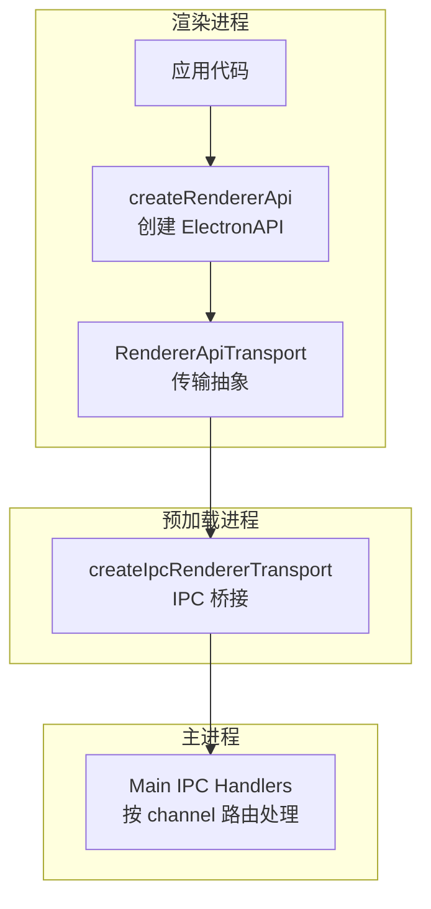
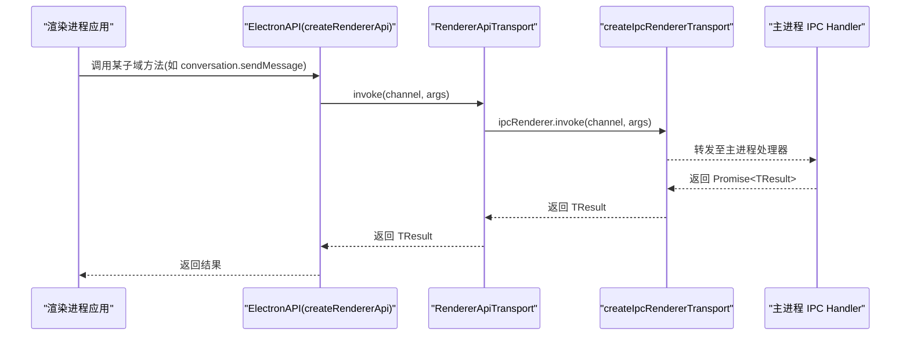
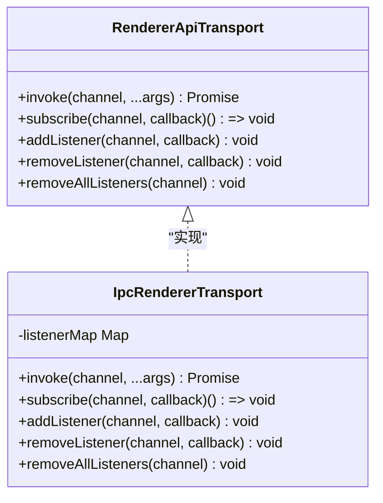
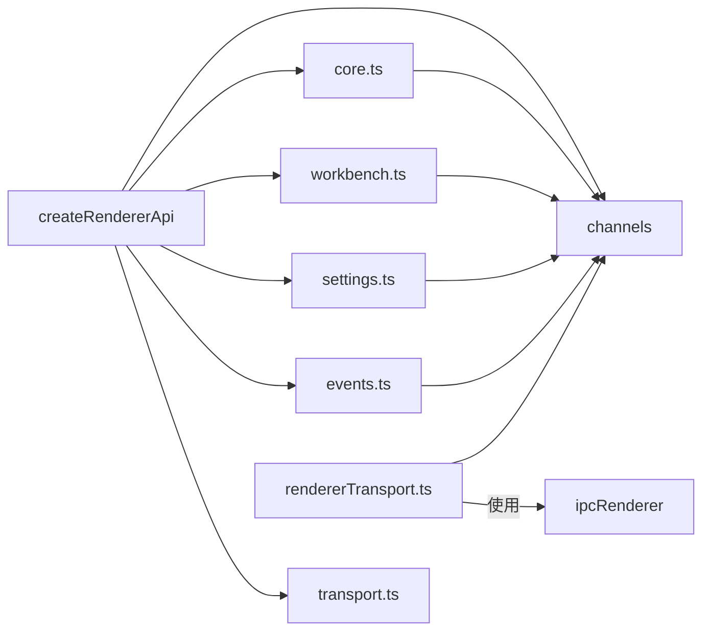

# 核心 API

<cite>
**本文引用的文件**
- [createRendererApi.ts](file://src/shared/renderer-api/createRendererApi.ts)
- [transport.ts](file://src/shared/renderer-api/transport.ts)
- [rendererTransport.ts](file://src/preload/rendererTransport.ts)
- [channels.ts](file://src/shared/renderer-api/channels.ts)
- [events.ts](file://src/shared/renderer-api/events.ts)
- [core.ts](file://src/shared/renderer-api/core.ts)
- [workbench.ts](file://src/shared/renderer-api/workbench.ts)
- [settings.ts](file://src/shared/renderer-api/settings.ts)
- [index.ts](file://src/shared/renderer-api/index.ts)
- [electron.ts](file://src/shared/types/electron.ts)
</cite>

## 目录
1. [简介](#简介)
2. [项目结构](#项目结构)
3. [核心组件](#核心组件)
4. [架构总览](#架构总览)
5. [详细组件分析](#详细组件分析)
6. [依赖关系分析](#依赖关系分析)
7. [性能考虑](#性能考虑)
8. [故障排查指南](#故障排查指南)
9. [结论](#结论)
10. [附录：API 调用示例与最佳实践](#附录api-调用示例与最佳实践)

## 简介
本文件聚焦 Renderer 侧对外暴露的“核心 API”能力，围绕 createRendererApi 函数展开，说明其参数、返回值结构以及内部 transport 传输层的工作机制。文档同时给出完整的 API 调用示例（以文字步骤为主），并总结异步操作、错误重试与资源清理的最佳实践。该 API 是渲染进程与主进程通信的统一入口，所有业务域（对话、工作流、会话、设备、知识、设置等）均通过此入口进行 RPC 调用与事件订阅。

## 项目结构
Renderer API 由共享类型定义、通道常量、传输抽象、各子域 API 工厂以及预加载桥接组成：
- 共享类型与导出：在 shared/renderer-api 下集中管理通道、传输接口、API 工厂与统一导出。
- 预加载桥接：在 preload/rendererTransport.ts 中基于 Electron ipcRenderer 实现具体传输。
- 类型契约：shared/types/electron.ts 定义了最终对外暴露的 ElectronAPI 完整结构。

图表来源
- [createRendererApi.ts:33-76](file://src/shared/renderer-api/createRendererApi.ts#L33-L76)
- [transport.ts:5-11](file://src/shared/renderer-api/transport.ts#L5-L11)
- [rendererTransport.ts:9-44](file://src/preload/rendererTransport.ts#L9-L44)
- [channels.ts:1-244](file://src/shared/renderer-api/channels.ts#L1-L244)

章节来源
- [createRendererApi.ts:33-76](file://src/shared/renderer-api/createRendererApi.ts#L33-L76)
- [index.ts:1-18](file://src/shared/renderer-api/index.ts#L1-L18)
- [channels.ts:1-244](file://src/shared/renderer-api/channels.ts#L1-L244)

## 核心组件
- createRendererApi：组装并返回 ElectronAPI 实例，聚合平台信息与各子域 API（appMeta、appShell、web、conversation、workflow、agent、memory、investigation、knowledge、rdxRuntime、tool、mcp、evidence、llm、settings、project、device、session、run、runtimeLog、capture、context、events、windowControls），并提供 on/off 事件订阅。
- RendererApiTransport：定义 invoke/subscribe/addListener/removeListener/removeAllListeners 等传输抽象，屏蔽底层 IPC 细节。
- createIpcRendererTransport：基于 Electron ipcRenderer 的具体实现，负责消息转发、监听器管理与生命周期。
- channels：集中声明所有可被调用的 invoke channel 与 event channel，提供类型化枚举与校验工具。
- events：为事件订阅提供领域化的便捷方法（如 workflow、agent、tools、workbench、runtime 等）。
- core/workbench/settings：按领域拆分 API 工厂，将高层方法映射到具体的 invoke channel。

章节来源
- [createRendererApi.ts:33-76](file://src/shared/renderer-api/createRendererApi.ts#L33-L76)
- [transport.ts:5-11](file://src/shared/renderer-api/transport.ts#L5-L11)
- [rendererTransport.ts:9-44](file://src/preload/rendererTransport.ts#L9-L44)
- [channels.ts:1-244](file://src/shared/renderer-api/channels.ts#L1-L244)
- [events.ts:14-83](file://src/shared/renderer-api/events.ts#L14-L83)
- [core.ts:20-145](file://src/shared/renderer-api/core.ts#L20-L145)
- [workbench.ts:14-92](file://src/shared/renderer-api/workbench.ts#L14-L92)
- [settings.ts:6-86](file://src/shared/renderer-api/settings.ts#L6-L86)

## 架构总览
渲染进程通过 createRendererApi 获取 ElectronAPI；每个子域 API 方法内部调用 transport.invoke(channel, ...args)。预加载层将 invoke 转为 ipcRenderer.invoke，将事件转为 ipcRenderer.on/off。主进程根据 channel 路由到对应处理器执行逻辑并返回结果或推送事件。

图表来源
- [createRendererApi.ts:33-76](file://src/shared/renderer-api/createRendererApi.ts#L33-L76)
- [core.ts:55-77](file://src/shared/renderer-api/core.ts#L55-L77)
- [rendererTransport.ts:29-43](file://src/preload/rendererTransport.ts#L29-L43)

## 详细组件分析

### createRendererApi：参数、返回值与装配
- 参数
  - platform：NodeJS.Platform，用于标识当前操作系统。
  - transport：RendererApiTransport，注入传输实现（通常为 IPC）。
- 返回值
  - ElectronAPI：包含平台属性与各子域 API 对象，以及全局 on/off 事件订阅。
- 装配要点
  - 通过多个 createXxxApi 工厂组合出完整 API。
  - 对事件订阅提供统一的 on/off 包装，内部使用 isRendererEventChannel 校验 channel。

章节来源
- [createRendererApi.ts:33-76](file://src/shared/renderer-api/createRendererApi.ts#L33-L76)
- [channels.ts:234-244](file://src/shared/renderer-api/channels.ts#L234-L244)
- [electron.ts:135-545](file://src/shared/types/electron.ts#L135-L545)

### transport 传输层：抽象与实现
- 抽象 RendererApiTransport
  - invoke：发起一次请求，返回 Promise<TResult>。
  - subscribe：订阅事件，返回取消订阅函数。
  - addListener/removeListener/removeAllListeners：细粒度事件管理。
- 实现 createIpcRendererTransport
  - 使用 Map 维护 channel -> callback 的映射，避免重复注册。
  - invoke 直接委托给 ipcRenderer.invoke。
  - subscribe/addListener/removeListener/removeAllListeners 封装 ipcRenderer 的事件系统。

图表来源
- [transport.ts:5-11](file://src/shared/renderer-api/transport.ts#L5-L11)
- [rendererTransport.ts:9-44](file://src/preload/rendererTransport.ts#L9-L44)

章节来源
- [transport.ts:5-11](file://src/shared/renderer-api/transport.ts#L5-L11)
- [rendererTransport.ts:9-44](file://src/preload/rendererTransport.ts#L9-L44)

### 通道与事件：类型安全与校验
- RENDERER_INVOKE_CHANNEL / RENDERER_EVENT_CHANNEL：集中声明所有可用通道，保证类型安全。
- isRendererInvokeChannel / isRendererEventChannel：运行时校验传入 channel 是否合法。
- 各子域 API 仅通过 INVOKE/EVENT 引用这些常量，避免硬编码字符串。

章节来源
- [channels.ts:1-244](file://src/shared/renderer-api/channels.ts#L1-L244)

### 子域 API 映射：core / workbench / settings
- core：覆盖 appMeta、appShell、web、dialog、windowControls、conversation、workflow、agent、investigation、knowledge、command、tool、mcp、evidence 等。
- workbench：覆盖 project、device、session、run、runtimeLog、capture、context、trace。
- settings：覆盖 memory、rdxRuntime、llm、settings。
- 所有方法均通过 transport.invoke 调用对应 channel，保持单一职责与高内聚。

章节来源
- [core.ts:20-145](file://src/shared/renderer-api/core.ts#L20-L145)
- [workbench.ts:14-92](file://src/shared/renderer-api/workbench.ts#L14-L92)
- [settings.ts:6-86](file://src/shared/renderer-api/settings.ts#L6-L86)

### 事件订阅：events 模块
- 提供领域化订阅方法，如 onWorkflowStateChanged、onAgentMessage、onDeviceStatusChanged 等。
- 内部统一通过 transport.subscribe 绑定到相应 EVENT.* 通道，并返回取消订阅函数。
- 支持 removeAllListeners(channel) 批量清理。

章节来源
- [events.ts:14-83](file://src/shared/renderer-api/events.ts#L14-L83)
- [channels.ts:178-218](file://src/shared/renderer-api/channels.ts#L178-L218)

## 依赖关系分析
- createRendererApi 依赖：
  - channels：用于事件通道校验。
  - core/workbench/settings：各子域 API 工厂。
  - events：事件订阅 API。
  - transport：注入式依赖，便于测试与替换。
- rendererTransport 依赖：
  - Electron ipcRenderer。
  - shared/renderer-api 的类型与通道常量。
- 类型契约：
  - electron.ts 定义 ElectronAPI 的完整结构，确保上层调用类型安全。

图表来源
- [createRendererApi.ts:33-76](file://src/shared/renderer-api/createRendererApi.ts#L33-L76)
- [core.ts:20-145](file://src/shared/renderer-api/core.ts#L20-L145)
- [workbench.ts:14-92](file://src/shared/renderer-api/workbench.ts#L14-L92)
- [settings.ts:6-86](file://src/shared/renderer-api/settings.ts#L6-L86)
- [events.ts:14-83](file://src/shared/renderer-api/events.ts#L14-L83)
- [channels.ts:1-244](file://src/shared/renderer-api/channels.ts#L1-L244)
- [rendererTransport.ts:9-44](file://src/preload/rendererTransport.ts#L9-L44)

章节来源
- [createRendererApi.ts:33-76](file://src/shared/renderer-api/createRendererApi.ts#L33-L76)
- [rendererTransport.ts:9-44](file://src/preload/rendererTransport.ts#L9-L44)
- [electron.ts:135-545](file://src/shared/types/electron.ts#L135-L545)

## 性能考虑
- 通道复用：所有子域 API 共用同一 transport 实例，减少重复初始化开销。
- 事件去重：预加载层使用 Map 缓存回调，避免重复注册导致内存增长与重复触发。
- 按需订阅：仅在需要时调用 subscribe/addListener，并在组件卸载时调用返回的取消函数或 removeAllListeners。
- 批量操作：对于频繁读取的场景，优先使用批量接口（如 listRuns、listSnapshots）以减少往返次数。
- 序列化成本：尽量传递结构化数据而非超大对象，避免阻塞主线程。

[本节为通用指导，不直接分析具体文件]

## 故障排查指南
- 通道未注册或拼写错误
  - 现象：invoke 无响应或报错。
  - 排查：确认 channel 是否在 RENDERER_INVOKE_CHANNEL 中定义，并通过 isRendererInvokeChannel 校验。
- 事件未触发
  - 现象：订阅后无回调。
  - 排查：确认 channel 是否在 RENDERER_EVENT_CHANNEL 中定义，并使用 isRendererEventChannel 校验；检查是否正确调用 removeListener/removeAllListeners。
- 多次订阅导致重复回调
  - 现象：同一事件多次触发。
  - 排查：确保每次订阅都保存取消函数，或在合适时机调用 removeAllListeners。
- 主进程异常
  - 现象：Promise 拒绝或返回错误字段。
  - 排查：捕获 Promise 错误，检查主进程日志；关注返回结构中 error 字段。

章节来源
- [channels.ts:234-244](file://src/shared/renderer-api/channels.ts#L234-L244)
- [rendererTransport.ts:9-44](file://src/preload/rendererTransport.ts#L9-L44)
- [electron.ts:135-545](file://src/shared/types/electron.ts#L135-L545)

## 结论
Renderer API 通过 createRendererApi 将多领域能力统一暴露为 ElectronAPI，并以 RendererApiTransport 抽象跨进程通信细节。通道与事件集中管理，保证了类型安全与可维护性。结合预加载层的 IPC 实现，形成清晰、可扩展且易于测试的通信架构。遵循本文的最佳实践，可有效提升稳定性与性能。

[本节为总结，不直接分析具体文件]

## 附录：API 调用示例与最佳实践

### 建立与主进程的通信连接（步骤示例）
- 在渲染进程中引入 createRendererApi 与 createIpcRendererTransport。
- 调用 createIpcRendererTransport() 获取 transport 实例。
- 调用 createRendererApi(platform, transport) 得到 ElectronAPI。
- 通过 ElectronAPI 的子域方法发起调用，例如：
  - 对话：conversation.sendMessage(...)
  - 工作流：workflow.getState()、workflow.resume(sessionId)
  - 会话：session.list(projectId)、session.create(projectId, title)
  - 设备：device.list()、device.activate(deviceId)
  - 知识：knowledge.overview()、knowledge.query(request)
  - 设置：settings.get()、settings.set(patch)
  - 追踪：trace.getRun(runId)、trace.exportRun(runId)
- 事件订阅：
  - 使用 events.onWorkflowStateChanged(...)、events.onAgentMessage(...) 等方法订阅。
  - 保存返回的取消函数，在组件卸载时调用以释放资源。

章节来源
- [createRendererApi.ts:33-76](file://src/shared/renderer-api/createRendererApi.ts#L33-L76)
- [rendererTransport.ts:9-44](file://src/preload/rendererTransport.ts#L9-L44)
- [events.ts:14-83](file://src/shared/renderer-api/events.ts#L14-L83)
- [core.ts:55-77](file://src/shared/renderer-api/core.ts#L55-L77)
- [workbench.ts:14-92](file://src/shared/renderer-api/workbench.ts#L14-L92)
- [settings.ts:6-86](file://src/shared/renderer-api/settings.ts#L6-L86)

### 异步操作与错误处理
- 所有子域方法返回 Promise，应使用 try/catch 或 .catch 捕获异常。
- 部分方法返回结构中包含 success/error 字段，需先判断 success 再处理数据。
- 对长耗时操作（如 exportRun、indexRebuild）建议添加超时与进度反馈。

章节来源
- [electron.ts:135-545](file://src/shared/types/electron.ts#L135-L545)

### 错误重试策略
- 网络或主进程繁忙导致的瞬时失败可采用指数退避重试。
- 对幂等操作（如 list、getState）适合重试；对副作用操作（如 resume、stop）需谨慎重试并记录状态。
- 重试上限与退避间隔应在配置中可管理。

[本节为通用指导，不直接分析具体文件]

### 资源清理与生命周期
- 事件订阅：保存 subscribe 返回的取消函数，在组件卸载时调用。
- 批量清理：必要时调用 events.removeAllListeners(channel) 清理指定通道的所有监听。
- 窗口控制：关闭或最小化窗口前，确保已停止不必要的后台任务（如 watchStart）。

章节来源
- [events.ts:78-83](file://src/shared/renderer-api/events.ts#L78-L83)
- [rendererTransport.ts:29-44](file://src/preload/rendererTransport.ts#L29-L44)