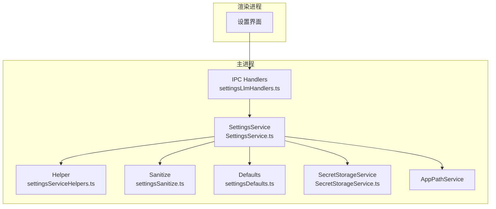
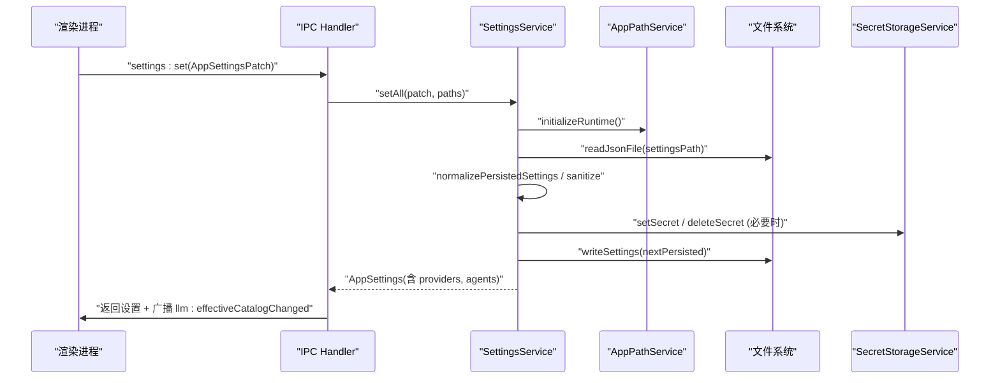
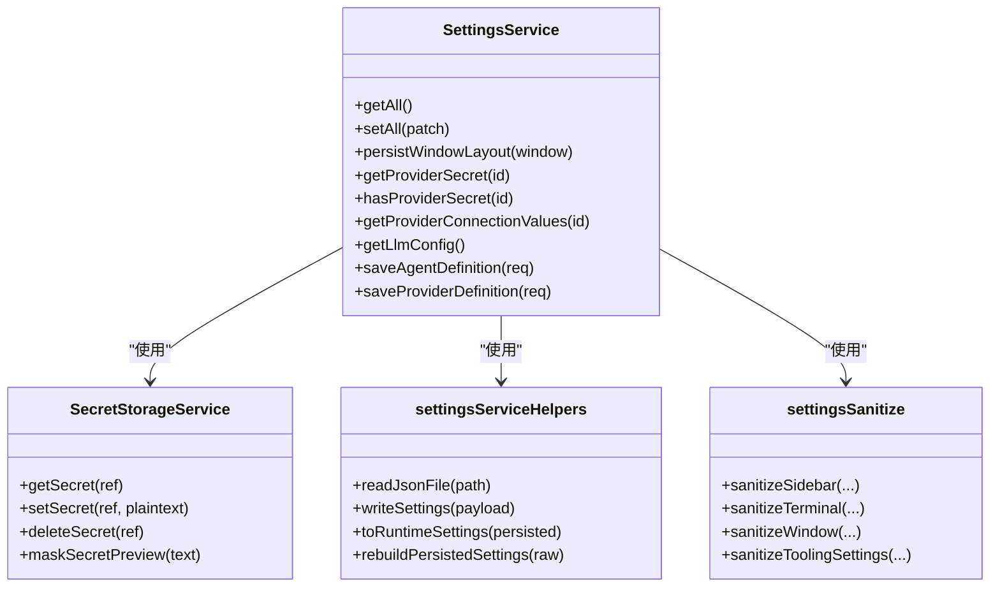
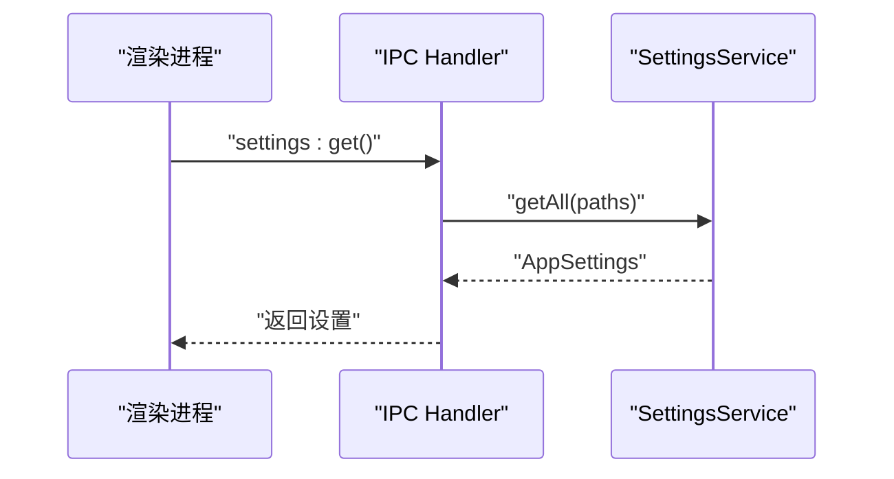
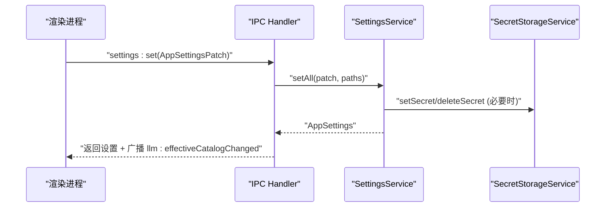
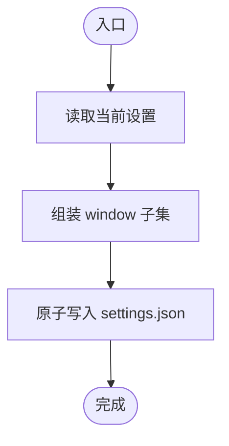

# 设置 API

<cite>
**本文引用的文件**
- [SettingsService.ts](file://src/main/settings/SettingsService.ts)
- [settingsDefaults.ts](file://src/main/settings/settingsDefaults.ts)
- [settingsSanitize.ts](file://src/main/settings/settingsSanitize.ts)
- [settingsServiceHelpers.ts](file://src/main/settings/settingsServiceHelpers.ts)
- [SecretStorageService.ts](file://src/main/settings/SecretStorageService.ts)
- [settingsLlmHandlers.ts](file://src/main/ipc/settingsLlmHandlers.ts)
- [settings.ts](file://src/shared/types/settings.ts)
</cite>

## 目录
1. [简介](#简介)
2. [项目结构](#项目结构)
3. [核心组件](#核心组件)
4. [架构总览](#架构总览)
5. [详细组件分析](#详细组件分析)
6. [依赖关系分析](#依赖关系分析)
7. [性能与一致性](#性能与一致性)
8. [故障排查指南](#故障排查指南)
9. [结论](#结论)
10. [附录：API 参考与示例](#附录api-参考与示例)

## 简介
本文件为“设置 API”的完整技术文档，覆盖应用设置的读取、写入与管理方法；详细说明设置项的数据结构、验证规则与持久化机制；提供设置操作的示例路径与调用流程；并阐述设置同步机制与冲突解决策略。该 API 通过主进程服务暴露 IPC 接口，供渲染进程（前端）调用以获取和修改用户偏好与应用配置，并在变更时广播有效模型目录等事件，确保多端一致。

## 项目结构
设置系统由以下关键部分组成：
- 类型定义：集中描述所有设置项的结构与约束
- 默认值与迁移：提供默认配置、版本兼容与重建逻辑
- 校验与清洗：对输入进行严格校验、裁剪与规范化
- 持久化与密钥存储：JSON 配置文件 + 安全存储（OS safeStorage）
- 服务层：统一封装读取、写入、合并、发布事件等能力
- IPC 层：将服务方法暴露给渲染进程，并处理参数校验与事件广播

图表来源
- [settingsLlmHandlers.ts:52-387](file://src/main/ipc/settingsLlmHandlers.ts#L52-L387)
- [SettingsService.ts:94-518](file://src/main/settings/SettingsService.ts#L94-L518)
- [settingsServiceHelpers.ts:100-408](file://src/main/settings/settingsServiceHelpers.ts#L100-L408)
- [settingsSanitize.ts:42-278](file://src/main/settings/settingsSanitize.ts#L42-L278)
- [settingsDefaults.ts:33-193](file://src/main/settings/settingsDefaults.ts#L33-L193)
- [SecretStorageService.ts:72-262](file://src/main/settings/SecretStorageService.ts#L72-L262)

章节来源
- [settingsLlmHandlers.ts:52-387](file://src/main/ipc/settingsLlmHandlers.ts#L52-L387)
- [SettingsService.ts:94-518](file://src/main/settings/SettingsService.ts#L94-L518)

## 核心组件
- SettingsService：设置的核心服务，负责初始化、读取、写入、合并、清理与发布事件。对外暴露 getAll、setAll、persistWindowLayout*、getProvider*、saveAgentDefinition/saveProviderDefinition 等方法。
- settingsServiceHelpers：持久化读写、默认构建、数据重建、运行时设置组装、哈希与序列化等工具。
- settingsSanitize：字段级校验与归一化，包括布局、工具链、权限、终端、窗口等。
- settingsDefaults：全局默认值、布局常量、Schema 版本号、默认负载结构。
- SecretStorageService：安全的密钥存储，使用 OS safeStorage 加密，支持增删改查、掩码预览、损坏隔离。
- settingsLlmHandlers：IPC 处理器，将渲染进程的请求路由到服务方法，并进行参数校验、结果广播与错误上报。

章节来源
- [SettingsService.ts:94-518](file://src/main/settings/SettingsService.ts#L94-L518)
- [settingsServiceHelpers.ts:100-408](file://src/main/settings/settingsServiceHelpers.ts#L100-L408)
- [settingsSanitize.ts:42-278](file://src/main/settings/settingsSanitize.ts#L42-L278)
- [settingsDefaults.ts:33-193](file://src/main/settings/settingsDefaults.ts#L33-L193)
- [SecretStorageService.ts:72-262](file://src/main/settings/SecretStorageService.ts#L72-L262)
- [settingsLlmHandlers.ts:52-387](file://src/main/ipc/settingsLlmHandlers.ts#L52-L387)

## 架构总览
设置 API 采用“渲染进程 -> IPC -> 主进程服务 -> 持久化/密钥存储”的分层架构。IPC 层负责参数校验与事件广播；服务层负责业务逻辑与数据装配；持久化层保证原子写入与数据安全；密钥存储层保障敏感信息的安全性与可恢复性。

图表来源
- [settingsLlmHandlers.ts:321-341](file://src/main/ipc/settingsLlmHandlers.ts#L321-L341)
- [SettingsService.ts:249-383](file://src/main/settings/SettingsService.ts#L249-L383)
- [settingsServiceHelpers.ts:327-349](file://src/main/settings/settingsServiceHelpers.ts#L327-L349)
- [SecretStorageService.ts:206-227](file://src/main/settings/SecretStorageService.ts#L206-L227)

## 详细组件分析

### 数据结构与默认值
- 持久化负载 PersistedSettingsPayload：包含 schemaVersion、appearance、layout、profile、llm.providers、tooling、agentRuntime 等字段。
- 运行时 AppSettings：在持久化基础上注入资源目录、代理路由、诊断信息等，便于上层消费。
- 默认值：DEFAULT_APPEARANCE、DEFAULT_LAYOUT、DEFAULT_PROFILE、DEFAULT_TOOLING、DEFAULT_AGENT_RUNTIME 等，用于缺失或非法值回退。
- Schema 版本：SETTINGS_SCHEMA_VERSION 用于兼容性检查与升级修复。

章节来源
- [settingsDefaults.ts:33-193](file://src/main/settings/settingsDefaults.ts#L33-L193)
- [settingsServiceHelpers.ts:142-174](file://src/main/settings/settingsServiceHelpers.ts#L142-L174)
- [settingsServiceHelpers.ts:291-325](file://src/main/settings/settingsServiceHelpers.ts#L291-L325)

### 校验与清洗规则
- 布局：侧边栏宽度、折叠状态、终端高度、窗口尺寸均在合理范围内裁剪，避免越界。
- 工具链：命令、工作目录、环境变量、超时时间等严格类型与范围校验。
- 权限：模式枚举限制、路径列表展开与去重、命令前缀白/黑名单过滤。
- 窗口：最小/最大宽高、坐标取整、最大化标志布尔化。
- 通用：字符串去空白、数组去空、记录键名规范化。

章节来源
- [settingsSanitize.ts:42-278](file://src/main/settings/settingsSanitize.ts#L42-L278)

### 持久化机制
- 原子写入：先写临时文件再 rename，失败清理临时文件，避免损坏。
- 异步写入：事件循环友好，适合高频场景（如窗口移动/调整大小）。
- 版本兼容：启动时读取并校验 schemaVersion，必要时执行重建与修复。
- 路径解析：基于 AppPathService 动态获取用户根目录与设置文件路径。

章节来源
- [settingsServiceHelpers.ts:100-140](file://src/main/settings/settingsServiceHelpers.ts#L100-L140)
- [settingsServiceHelpers.ts:327-349](file://src/main/settings/settingsServiceHelpers.ts#L327-L349)
- [SettingsService.ts:103-139](file://src/main/settings/SettingsService.ts#L103-L139)

### 密钥存储与安全
- 使用 OS safeStorage 加密存储 API Key、OAuth 令牌等敏感信息。
- 支持创建不同粒度的密钥引用（provider、account、connection field）。
- 提供掩码预览，便于 UI 显示是否已配置但不泄露明文。
- 损坏保护：当密钥文件损坏时自动隔离并重命名，抛出明确错误。

章节来源
- [SecretStorageService.ts:72-262](file://src/main/settings/SecretStorageService.ts#L72-L262)
- [SettingsService.ts:141-206](file://src/main/settings/SettingsService.ts#L141-L206)

### 设置变更与事件同步
- 当 LLM 提供商配置发生变更时，IPC 层会触发 effective catalog 刷新并广播事件，使渲染进程更新可用模型与选项。
- 窗口布局变更提供窄通道写入，仅更新 layout.window，减少不必要的全量处理。
- 代理与提供者定义保存后，会计算并缓存有效目录修订号，确保前后端一致。

章节来源
- [settingsLlmHandlers.ts:52-86](file://src/main/ipc/settingsLlmHandlers.ts#L52-L86)
- [settingsLlmHandlers.ts:104-143](file://src/main/ipc/settingsLlmHandlers.ts#L104-L143)
- [settingsLlmHandlers.ts:288-319](file://src/main/ipc/settingsLlmHandlers.ts#L288-L319)
- [SettingsService.ts:208-247](file://src/main/settings/SettingsService.ts#L208-L247)

### 冲突解决策略
- 代理定义保存：基于 agentDefinitionRevisions 与 clientRevision 进行并发控制，防止覆盖未提交的更改。
- 提供商连接：根据 authMode 与 activeAccountId 管理密钥引用，避免重复与泄漏；删除旧引用并清理无用密钥。
- 窗口布局：窄通道写入避免全量 provider 归一化开销，降低竞争条件影响。

章节来源
- [SettingsService.ts:392-409](file://src/main/settings/SettingsService.ts#L392-L409)
- [SettingsService.ts:249-383](file://src/main/settings/SettingsService.ts#L249-L383)
- [SettingsService.ts:208-247](file://src/main/settings/SettingsService.ts#L208-L247)

## 依赖关系分析
- SettingsService 依赖：
  - AppPathService：获取运行时路径
  - ExecutionProfileService：确保资源目录存在
  - AgentManifestService：代理指令与路由
  - ProviderCatalogService：提供商目录
  - SecretStorageService：密钥存取
  - ShellResolver：Shell 可执行解析与缓存
- IPC 层依赖：
  - EffectiveCatalogService：有效目录订阅与广播
  - ProviderConnectionService：连接、登录、刷新等操作
  - ModelsOverrideService：模型覆盖配置

图表来源
- [SettingsService.ts:94-518](file://src/main/settings/SettingsService.ts#L94-L518)
- [settingsServiceHelpers.ts:100-408](file://src/main/settings/settingsServiceHelpers.ts#L100-L408)
- [settingsSanitize.ts:42-278](file://src/main/settings/settingsSanitize.ts#L42-L278)
- [SecretStorageService.ts:72-262](file://src/main/settings/SecretStorageService.ts#L72-L262)

章节来源
- [SettingsService.ts:94-518](file://src/main/settings/SettingsService.ts#L94-L518)
- [settingsServiceHelpers.ts:100-408](file://src/main/settings/settingsServiceHelpers.ts#L100-L408)
- [settingsSanitize.ts:42-278](file://src/main/settings/settingsSanitize.ts#L42-L278)
- [SecretStorageService.ts:72-262](file://src/main/settings/SecretStorageService.ts#L72-L262)

## 性能与一致性
- 原子写入与临时文件：避免部分写入导致的设置损坏，提升可靠性。
- 异步写入：窗口布局等高频操作使用异步写入，减少阻塞。
- 最小化归一化：窗口布局窄通道跳过 provider 归一化与密钥水合，降低开销。
- 缓存与失效：Shell 解析器在可执行变更时清除缓存，确保最新行为。
- 事件广播：仅在相关变更时广播有效目录，减少不必要的渲染重算。

[本节为一般性指导，不直接分析具体文件]

## 故障排查指南
- 无法读取设置文件：检查路径是否存在、权限是否正确；若 JSON 格式错误，将尝试重建默认设置。
- 密钥解密失败：确认 OS safeStorage 可用；若密钥文件损坏，将被隔离并抛出明确错误。
- 提供商连接失败：检查 API Key/OAuth 是否已正确存储；查看 hasProviderSecret 返回值与掩码预览。
- 模型目录不一致：确认有效目录刷新是否成功；检查 IPC 广播事件是否到达渲染进程。
- 窗口布局异常：确认 sanitizeWindow 裁剪逻辑；检查最小/最大宽高与坐标合法性。

章节来源
- [settingsServiceHelpers.ts:100-140](file://src/main/settings/settingsServiceHelpers.ts#L100-L140)
- [SecretStorageService.ts:77-105](file://src/main/settings/SecretStorageService.ts#L77-L105)
- [settingsSanitize.ts:256-278](file://src/main/settings/settingsSanitize.ts#L256-L278)
- [settingsLlmHandlers.ts:212-236](file://src/main/ipc/settingsLlmHandlers.ts#L212-L236)

## 结论
设置 API 通过清晰的分层设计与严格的校验、持久化与密钥管理机制，提供了稳定可靠的设置管理能力。IPC 层确保了跨进程通信的安全与一致性，服务层实现了复杂业务逻辑的封装，持久化与密钥存储保障了数据的完整性与安全性。通过事件广播与冲突解决策略，系统在多端与并发场景下仍能保持一致的用户体验。

[本节为总结性内容，不直接分析具体文件]

## 附录：API 参考与示例

### IPC 接口概览
- settings:get：获取当前设置（含有效代理模型选项）
- settings:set：批量更新设置（支持外观、布局、工具链、权限、LLM 提供商等）
- settings:getProviderCatalog：获取提供商目录
- settings:getEffectiveModel：按代理 ID 解析有效模型
- settings:getEffectiveCatalog：按提供商 ID 获取有效目录快照
- settings:hasProviderSecret：查询提供商是否已配置密钥
- settings:importAgentManifest：导入代理清单
- settings:saveAgentDefinition：保存代理定义（带冲突检测）
- settings:getAgentDefinitionCommit：查询代理定义提交
- settings:saveProviderDefinition：保存提供商定义（带目录修订）
- settings:getProviderDefinitionCommit：查询提供商定义提交
- settings:getResolvedShell：解析 Shell 可执行信息
- settings:getModelsOverride / settings:setModelsOverride：模型覆盖配置

章节来源
- [settingsLlmHandlers.ts:189-387](file://src/main/ipc/settingsLlmHandlers.ts#L189-L387)

### 典型调用序列

#### 获取设置

图表来源
- [settingsLlmHandlers.ts:189-205](file://src/main/ipc/settingsLlmHandlers.ts#L189-L205)
- [SettingsService.ts:132-139](file://src/main/settings/SettingsService.ts#L132-L139)

#### 更新设置（含 LLM 提供商）

图表来源
- [settingsLlmHandlers.ts:321-341](file://src/main/ipc/settingsLlmHandlers.ts#L321-L341)
- [SettingsService.ts:249-383](file://src/main/settings/SettingsService.ts#L249-L383)
- [SecretStorageService.ts:206-227](file://src/main/settings/SecretStorageService.ts#L206-L227)

#### 窗口布局快速保存

图表来源
- [SettingsService.ts:208-247](file://src/main/settings/SettingsService.ts#L208-L247)
- [settingsServiceHelpers.ts:327-349](file://src/main/settings/settingsServiceHelpers.ts#L327-L349)

### 示例代码路径
- 获取用户偏好与修改应用配置：参见 [settingsLlmHandlers.ts:189-205](file://src/main/ipc/settingsLlmHandlers.ts#L189-L205)、[settingsLlmHandlers.ts:321-341](file://src/main/ipc/settingsLlmHandlers.ts#L321-L341)
- 处理设置变更事件：参见 [settingsLlmHandlers.ts:52-86](file://src/main/ipc/settingsLlmHandlers.ts#L52-L86)、[settingsLlmHandlers.ts:104-143](file://src/main/ipc/settingsLlmHandlers.ts#L104-L143)
- 设置同步与冲突解决：参见 [SettingsService.ts:392-409](file://src/main/settings/SettingsService.ts#L392-L409)、[SettingsService.ts:249-383](file://src/main/settings/SettingsService.ts#L249-L383)

### 数据类型参考
- 应用设置类型与布局偏好：参见 [settings.ts:245-398](file://src/shared/types/settings.ts#L245-L398)
- 提供商协议与认证模式：参见 [settings.ts:116-144](file://src/shared/types/settings.ts#L116-L144)
- 连接字段与目录来源：参见 [settings.ts:177-227](file://src/shared/types/settings.ts#L177-L227)

章节来源
- [settings.ts:116-227](file://src/shared/types/settings.ts#L116-L227)
- [settings.ts:245-398](file://src/shared/types/settings.ts#L245-L398)