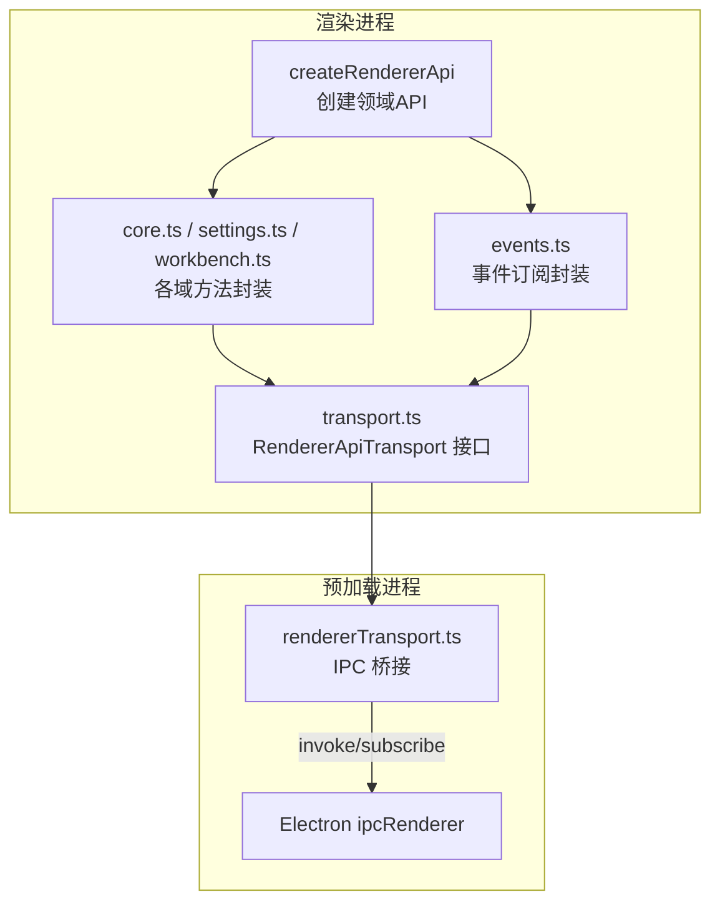
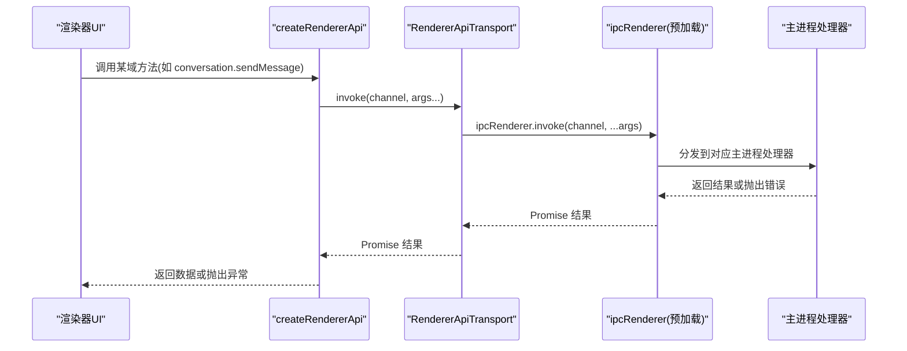
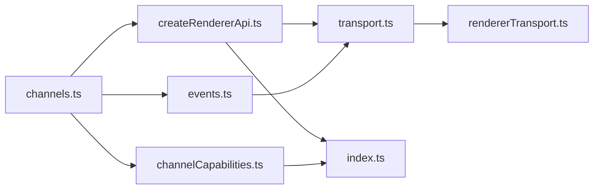

# 通道接口

<cite>
**本文引用的文件**
- [channels.ts](file://src/shared/renderer-api/channels.ts)
- [channelCapabilities.ts](file://src/shared/renderer-api/channelCapabilities.ts)
- [createRendererApi.ts](file://src/shared/renderer-api/createRendererApi.ts)
- [events.ts](file://src/shared/renderer-api/events.ts)
- [transport.ts](file://src/shared/renderer-api/transport.ts)
- [rendererTransport.ts](file://src/preload/rendererTransport.ts)
- [index.ts](file://src/shared/renderer-api/index.ts)
</cite>

## 目录
1. [简介](#简介)
2. [项目结构](#项目结构)
3. [核心组件](#核心组件)
4. [架构总览](#架构总览)
5. [详细组件分析](#详细组件分析)
6. [依赖关系分析](#依赖关系分析)
7. [性能考量](#性能考量)
8. [故障排查指南](#故障排查指南)
9. [结论](#结论)
10. [附录](#附录)

## 简介
本文件系统化说明渲染器侧“通道接口”的设计与使用，包括：
- 渲染器事件通道与调用通道的类型定义、常量用途与枚举集合
- 通道能力的发现、校验与覆盖检查机制
- 通过 createRendererApi 暴露的 API 如何基于通道进行调用与事件订阅
- 错误处理模式与最佳实践

该机制确保所有跨进程通信（IPC）均通过白名单通道进行，并以能力矩阵约束每个通道的权限级别，实现“默认拒绝”的安全模型。

## 项目结构
渲染器通道相关代码集中在 shared/renderer-api 模块中，preload 层提供 IPC 传输桥接，主进程通过 Electron IPC 路由到具体处理器。

图表来源
- [createRendererApi.ts:33-76](file://src/shared/renderer-api/createRendererApi.ts#L33-L76)
- [events.ts:14-83](file://src/shared/renderer-api/events.ts#L14-L83)
- [transport.ts:5-11](file://src/shared/renderer-api/transport.ts#L5-L11)
- [rendererTransport.ts:9-44](file://src/preload/rendererTransport.ts#L9-L44)

章节来源
- [createRendererApi.ts:33-76](file://src/shared/renderer-api/createRendererApi.ts#L33-L76)
- [events.ts:14-83](file://src/shared/renderer-api/events.ts#L14-L83)
- [transport.ts:5-11](file://src/shared/renderer-api/transport.ts#L5-L11)
- [rendererTransport.ts:9-44](file://src/preload/rendererTransport.ts#L9-L44)

## 核心组件
- 通道常量与类型
  - RENDERER_INVOKE_CHANNEL：按领域分组的调用通道字典
  - RENDERER_EVENT_CHANNEL：按领域分组的事件通道字典
  - RendererInvokeChannel / RendererEventChannel：由上述字典推导出的联合类型
  - RENDERER_INVOKE_CHANNELS / RENDERER_EVENT_CHANNELS：冻结的通道字符串数组，用于遍历与校验
  - isRendererInvokeChannel / isRendererEventChannel：运行时通道名校验工具
- 通道能力矩阵
  - CHANNEL_CAPABILITY：将每个调用通道映射到能力等级（read/mutation/high-impact/desktop-only）
  - hasBridgeChannelCapability / resolveBridgeChannelCapability：能力查询与解析
  - listUnclassifiedInvokeChannels / assertChannelCapabilityCoverage：覆盖率检查与断言
- API 构建与事件订阅
  - createRendererApi：组装各域 API，统一通过 transport.invoke 发送调用，通过 transport.subscribe/addListener/removeListener 管理事件
  - events.ts：为各类事件提供语义化订阅方法
- 传输层
  - RendererApiTransport：抽象 invoke/subscribe/listener 等能力
  - rendererTransport.ts：基于 Electron ipcRenderer 的具体实现

章节来源
- [channels.ts:1-244](file://src/shared/renderer-api/channels.ts#L1-L244)
- [channelCapabilities.ts:1-179](file://src/shared/renderer-api/channelCapabilities.ts#L1-L179)
- [createRendererApi.ts:33-76](file://src/shared/renderer-api/createRendererApi.ts#L33-L76)
- [events.ts:14-83](file://src/shared/renderer-api/events.ts#L14-L83)
- [transport.ts:5-11](file://src/shared/renderer-api/transport.ts#L5-L11)
- [rendererTransport.ts:9-44](file://src/preload/rendererTransport.ts#L9-L44)

## 架构总览
渲染器通过 createRendererApi 获得一组领域 API；这些 API 内部仅做参数转发，实际通信通过 RendererApiTransport 完成。预加载层将 transport 绑定到 Electron ipcRenderer，从而实现安全、可审计的 IPC。

图表来源
- [createRendererApi.ts:33-76](file://src/shared/renderer-api/createRendererApi.ts#L33-L76)
- [rendererTransport.ts:29-32](file://src/preload/rendererTransport.ts#L29-L32)

## 详细组件分析

### 通道常量与类型
- 调用通道字典 RENDERER_INVOKE_CHANNEL
  - 按领域（shell/conversation/workflow/agent/memory/knowledge/rdcRuntime/command/tools/llm/settings/project/device/session/run/runtime/capture/context/trace）组织
  - 每个键为领域对象，值为具体的通道字符串常量
- 事件通道字典 RENDERER_EVENT_CHANNEL
  - 同样按领域组织，包含应用主题变化、工作流状态变更、设备/捕获状态变更等事件
- 类型推导
  - RendererInvokeChannel / RendererEventChannel 由字典值推导，保证类型安全
- 集合与校验
  - RENDERER_INVOKE_CHANNELS / RENDERER_EVENT_CHANNELS：冻结数组，便于测试与校验
  - isRendererInvokeChannel / isRendererEventChannel：基于 Set 的快速存在性检查

章节来源
- [channels.ts:1-244](file://src/shared/renderer-api/channels.ts#L1-L244)

### 通道能力矩阵与覆盖检查
- 能力等级
  - read：只读操作
  - mutation：写操作
  - high-impact：高影响操作（需更严格审查）
  - desktop-only：仅限桌面端
- 关键函数
  - hasBridgeChannelCapability：判断通道是否在能力矩阵中
  - resolveBridgeChannelCapability：解析能力等级，未知通道抛出 BRIDGE_CAPABILITY_MISSING
  - listUnclassifiedInvokeChannels：列出未在矩阵中分类的调用通道
  - assertChannelCapabilityCoverage：断言所有调用通道均已分类且无多余项
- 设计要点
  - “关闭式”安全：未声明的通道一律拒绝
  - 编译期+运行期双重保障：TypeScript 类型 + 运行时断言

章节来源
- [channelCapabilities.ts:1-179](file://src/shared/renderer-api/channelCapabilities.ts#L1-L179)

### API 构建与事件订阅
- createRendererApi
  - 聚合各域 API（appMeta、conversation、workflow、agent、knowledge、settings、project、device、session、capture、context、trace、tool、mcp、evidence、runtimeLog、windowControls、events）
  - on/off 方法仅允许已声明的事件通道，防止任意事件监听
- 事件订阅封装（events.ts）
  - 为每类事件提供语义化订阅方法（如 onWorkflowStateChanged、onAgentMessage 等）
  - 内部通过 transport.subscribe/addListener/removeListener 管理生命周期
- 传输层（transport.ts）
  - 定义 invoke/subscribe/addListener/removeListener/removeAllListeners 的统一接口
  - 屏蔽底层 IPC 细节，便于替换与测试

章节来源
- [createRendererApi.ts:33-76](file://src/shared/renderer-api/createRendererApi.ts#L33-L76)
- [events.ts:14-83](file://src/shared/renderer-api/events.ts#L14-L83)
- [transport.ts:5-11](file://src/shared/renderer-api/transport.ts#L5-L11)

### 预加载层传输实现
- createIpcRendererTransport
  - 将 RendererApiTransport 绑定到 Electron ipcRenderer
  - invoke：调用主进程处理器并返回 Promise
  - subscribe/addListener/removeListener/removeAllListeners：管理事件监听与清理
  - 维护 listenerMap 避免重复监听与内存泄漏

章节来源
- [rendererTransport.ts:9-44](file://src/preload/rendererTransport.ts#L9-L44)

### 使用示例与错误处理模式
- 调用通道示例
  - 通过 createRendererApi 获取 API 后，直接调用领域方法（如 conversation.sendMessage），底层自动转换为对应通道调用
  - 参考路径：[createRendererApi.ts:33-76](file://src/shared/renderer-api/createRendererApi.ts#L33-L76)、[core.ts:20-145](file://src/shared/renderer-api/core.ts#L20-L145)
- 事件订阅示例
  - 使用 events.ts 提供的 onXxx 方法进行订阅，或在顶层使用 api.on/off 配合 isRendererEventChannel 校验
  - 参考路径：[events.ts:14-83](file://src/shared/renderer-api/events.ts#L14-L83)、[createRendererApi.ts:69-74](file://src/shared/renderer-api/createRendererApi.ts#L69-L74)
- 错误处理模式
  - 未知通道：resolveBridgeChannelCapability 会抛出 BRIDGE_CAPABILITY_MISSING，应在调用前使用 hasBridgeChannelCapability 检查
  - 覆盖检查：在启动或测试阶段调用 assertChannelCapabilityCoverage，确保所有调用通道均有能力分类
  - 事件过滤：on/off 仅接受 isRendererEventChannel 为 true 的通道，避免非法事件监听
  - 参考路径：[channelCapabilities.ts:148-176](file://src/shared/renderer-api/channelCapabilities.ts#L148-L176)、[channels.ts:237-243](file://src/shared/renderer-api/channels.ts#L237-L243)

章节来源
- [channelCapabilities.ts:148-176](file://src/shared/renderer-api/channelCapabilities.ts#L148-L176)
- [channels.ts:237-243](file://src/shared/renderer-api/channels.ts#L237-L243)
- [createRendererApi.ts:69-74](file://src/shared/renderer-api/createRendererApi.ts#L69-L74)
- [events.ts:14-83](file://src/shared/renderer-api/events.ts#L14-L83)

## 依赖关系分析
- channels.ts 是基础，提供通道常量、类型与校验工具
- channelCapabilities.ts 依赖 channels.ts，建立能力矩阵并提供覆盖检查
- createRendererApi.ts 依赖 channels.ts 与各域 API 构建器，组合成完整 API
- events.ts 依赖 channels.ts，提供事件订阅封装
- transport.ts 定义抽象接口，rendererTransport.ts 实现 IPC 桥接
- index.ts 统一导出公共 API 与类型

图表来源
- [channels.ts:1-244](file://src/shared/renderer-api/channels.ts#L1-L244)
- [channelCapabilities.ts:1-179](file://src/shared/renderer-api/channelCapabilities.ts#L1-L179)
- [createRendererApi.ts:33-76](file://src/shared/renderer-api/createRendererApi.ts#L33-L76)
- [events.ts:14-83](file://src/shared/renderer-api/events.ts#L14-L83)
- [transport.ts:5-11](file://src/shared/renderer-api/transport.ts#L5-L11)
- [rendererTransport.ts:9-44](file://src/preload/rendererTransport.ts#L9-L44)
- [index.ts:1-17](file://src/shared/renderer-api/index.ts#L1-L17)

章节来源
- [index.ts:1-17](file://src/shared/renderer-api/index.ts#L1-L17)

## 性能考量
- 通道校验使用 Set 进行 O(1) 查找，适合高频调用场景
- 事件监听采用 Map 管理回调，避免重复注册与内存泄漏
- 能力矩阵为静态对象，解析开销极低
- 建议在生产环境启用 assertChannelCapabilityCoverage 以尽早发现配置错误

## 故障排查指南
- 现象：调用未知通道抛出 BRIDGE_CAPABILITY_MISSING
  - 原因：通道未在 CHANNEL_CAPABILITY 中声明
  - 处理：在 channelCapabilities.ts 中添加映射，或通过 hasBridgeChannelCapability 提前检查
  - 参考路径：[channelCapabilities.ts:152-157](file://src/shared/renderer-api/channelCapabilities.ts#L152-L157)
- 现象：assertChannelCapabilityCoverage 失败
  - 原因：存在未分类通道或多余能力项
  - 处理：根据提示补齐或移除通道映射
  - 参考路径：[channelCapabilities.ts:163-176](file://src/shared/renderer-api/channelCapabilities.ts#L163-L176)
- 现象：事件无法触发或内存增长
  - 原因：未正确移除监听或未使用统一的 removeListener/removeAllListeners
  - 处理：确保在组件卸载时调用 off/removeAllListeners
  - 参考路径：[rendererTransport.ts:12-27](file://src/preload/rendererTransport.ts#L12-L27)、[events.ts:78-81](file://src/shared/renderer-api/events.ts#L78-L81)

章节来源
- [channelCapabilities.ts:152-176](file://src/shared/renderer-api/channelCapabilities.ts#L152-L176)
- [rendererTransport.ts:12-27](file://src/preload/rendererTransport.ts#L12-L27)
- [events.ts:78-81](file://src/shared/renderer-api/events.ts#L78-L81)

## 结论
通道接口通过“常量枚举 + 类型推导 + 能力矩阵 + 传输抽象”的组合，实现了安全、可验证、易扩展的渲染器 IPC 机制。新增通道需同时更新通道定义与能力矩阵，并通过覆盖检查确保一致性。事件系统提供语义化订阅与严格的通道白名单，降低误用风险。

## 附录
- 常用工具函数速查
  - isRendererInvokeChannel / isRendererEventChannel：通道名校验
  - hasBridgeChannelCapability / resolveBridgeChannelCapability：能力查询与解析
  - listUnclassifiedInvokeChannels / assertChannelCapabilityCoverage：覆盖率检查
  - createRendererApi：构建渲染器 API
  - createIpcRendererTransport：预加载层 IPC 桥接
- 参考路径
  - [channels.ts:223-243](file://src/shared/renderer-api/channels.ts#L223-L243)
  - [channelCapabilities.ts:148-176](file://src/shared/renderer-api/channelCapabilities.ts#L148-L176)
  - [createRendererApi.ts:33-76](file://src/shared/renderer-api/createRendererApi.ts#L33-L76)
  - [rendererTransport.ts:9-44](file://src/preload/rendererTransport.ts#L9-L44)