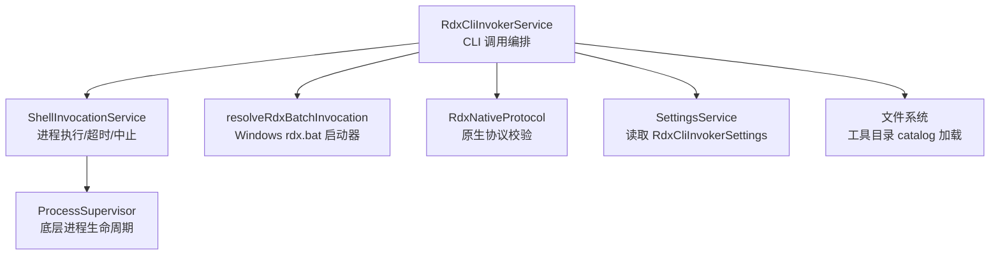
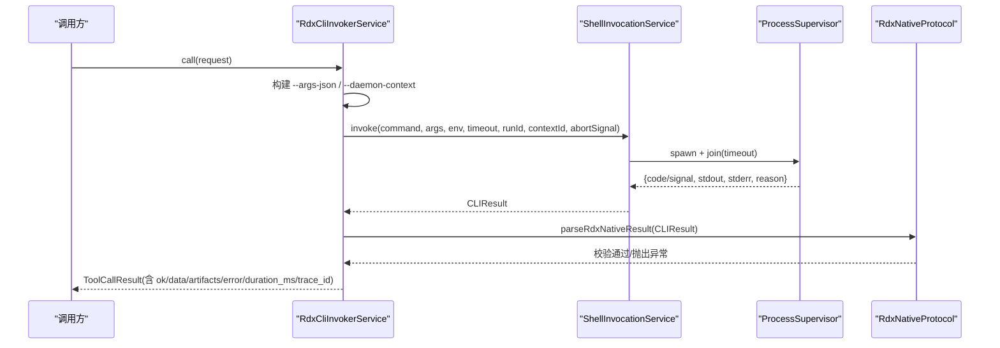
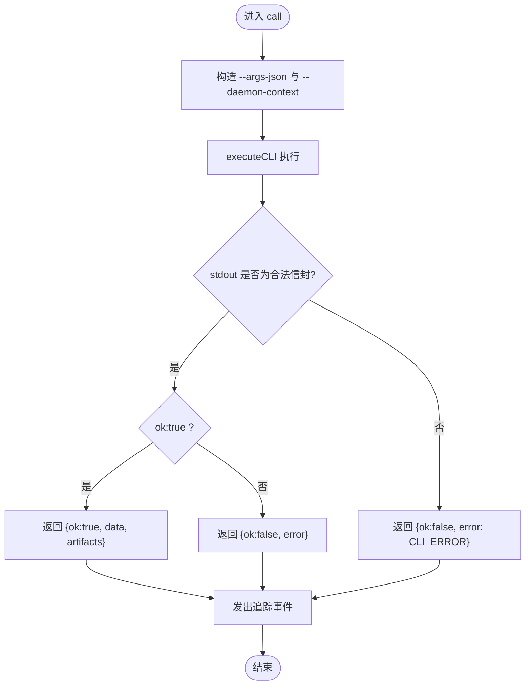
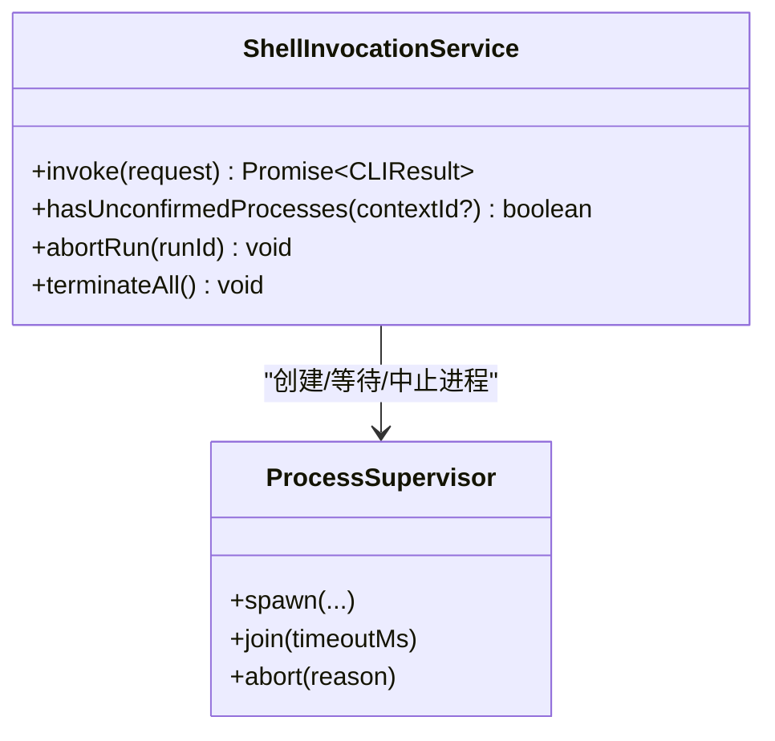
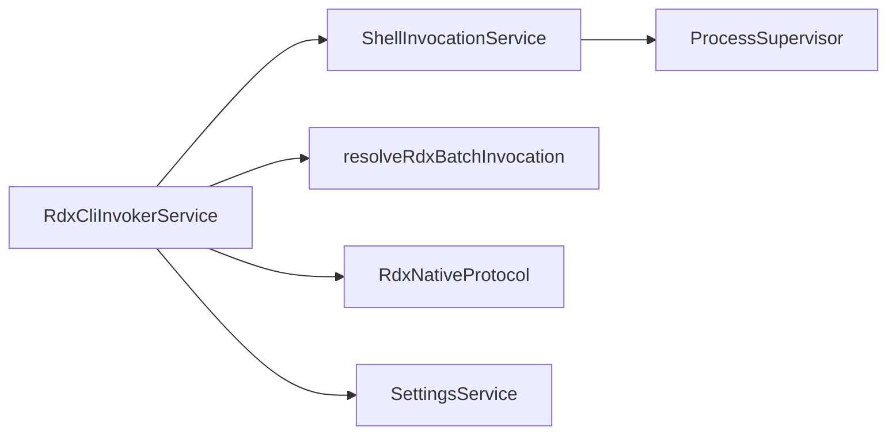

# CLI 工具接口

<cite>
**本文引用的文件**
- [src/main/tools/RdxCliInvokerService.ts](file://src/main/tools/RdxCliInvokerService.ts)
- [src/main/tools/ShellInvocationService.ts](file://src/main/tools/ShellInvocationService.ts)
- [src/main/tools/RdxNativeProtocol.ts](file://src/main/tools/RdxNativeProtocol.ts)
- [src/main/tools/resolveRdxBatchInvocation.ts](file://src/main/tools/resolveRdxBatchInvocation.ts)
- [src/shared/types/settings.ts](file://src/shared/types/settings.ts)
- [src/renderer/i18n/locales/en/settings.ts](file://src/renderer/i18n/locales/en/settings.ts)
</cite>

## 目录
1. [简介](#简介)
2. [项目结构](#项目结构)
3. [核心组件](#核心组件)
4. [架构总览](#架构总览)
5. [详细组件分析](#详细组件分析)
6. [依赖关系分析](#依赖关系分析)
7. [性能考虑](#性能考虑)
8. [故障排查指南](#故障排查指南)
9. [结论](#结论)
10. [附录：开发指南与最佳实践](#附录开发指南与最佳实践)

## 简介
本文件面向需要集成或扩展 RDX CLI 能力的开发者，系统化说明 RdxCliInvokerService 的完整 API、配置项、参数处理、结果解析、超时控制、环境变量注入、进程管理与错误处理机制。同时提供调用示例、工具目录加载流程、以及本地 RDX CLI 工具的集成与调试建议。

## 项目结构
围绕 CLI 工具调用的关键代码位于 src/main/tools 下，包含服务层、协议校验、进程调度与平台适配等模块；类型定义位于 shared/types；设置项在 settings 中集中管理，并在 UI 侧提供国际化文案。

图表来源
- [src/main/tools/RdxCliInvokerService.ts:42-221](file://src/main/tools/RdxCliInvokerService.ts#L42-L221)
- [src/main/tools/ShellInvocationService.ts:29-127](file://src/main/tools/ShellInvocationService.ts#L29-L127)
- [src/main/tools/resolveRdxBatchInvocation.ts:4-20](file://src/main/tools/resolveRdxBatchInvocation.ts#L4-L20)
- [src/main/tools/RdxNativeProtocol.ts:1-35](file://src/main/tools/RdxNativeProtocol.ts#L1-L35)

章节来源
- [src/main/tools/RdxCliInvokerService.ts:42-221](file://src/main/tools/RdxCliInvokerService.ts#L42-L221)
- [src/main/tools/ShellInvocationService.ts:29-127](file://src/main/tools/ShellInvocationService.ts#L29-L127)
- [src/main/tools/resolveRdxBatchInvocation.ts:4-20](file://src/main/tools/resolveRdxBatchInvocation.ts#L4-L20)
- [src/main/tools/RdxNativeProtocol.ts:1-35](file://src/main/tools/RdxNativeProtocol.ts#L1-L35)

## 核心组件
- RdxCliInvokerService：对外暴露的工具调用入口，负责参数拼装、命令执行、结果解析、追踪事件与运行摘要。
- ShellInvocationService：封装子进程创建、超时、中止、孤儿进程隔离与退出码归一化。
- resolveRdxBatchInvocation：在 Windows 上把 rdx.bat 转换为 PowerShell 启动器调用。
- RdxNativeProtocol：对 RDX CLI 返回的原生 JSON 信封进行严格校验。
- Settings 与 UI 文案：提供启用开关、命令路径、默认参数、工作目录、环境变量、超时、工具目录等配置项。

章节来源
- [src/main/tools/RdxCliInvokerService.ts:42-367](file://src/main/tools/RdxCliInvokerService.ts#L42-L367)
- [src/main/tools/ShellInvocationService.ts:29-127](file://src/main/tools/ShellInvocationService.ts#L29-L127)
- [src/main/tools/RdxNativeProtocol.ts:1-35](file://src/main/tools/RdxNativeProtocol.ts#L1-L35)
- [src/renderer/i18n/locales/en/settings.ts:150-157](file://src/renderer/i18n/locales/en/settings.ts#L150-L157)

## 架构总览
RdxCliInvokerService 作为“编排层”，将上层工具调用请求转化为外部 RDX CLI 进程调用，并通过 ShellInvocationService 完成进程生命周期管理；通过 RdxNativeProtocol 保证返回数据符合契约；支持工具目录（catalog）加载以提供能力发现与运行时元信息。

图表来源
- [src/main/tools/RdxCliInvokerService.ts:248-355](file://src/main/tools/RdxCliInvokerService.ts#L248-L355)
- [src/main/tools/ShellInvocationService.ts:32-105](file://src/main/tools/ShellInvocationService.ts#L32-L105)
- [src/main/tools/RdxNativeProtocol.ts:12-34](file://src/main/tools/RdxNativeProtocol.ts#L12-L34)

## 详细组件分析

### RdxCliInvokerService API 与行为
- 可用性检查与元信息
  - isAvailable：根据启用状态、命令是否配置、命令路径是否存在判断可用。
  - getRuntimeMetadata：返回 source/command/workingDirectory/version/catalog 等信息。
  - getRuntimeSummary：汇总命名空间数量、可用性原因与运行时元信息。
- 工具目录加载
  - loadCatalog：从配置的 catalogPath 读取并缓存；不存在或未配置时返回空目录。
- 参数处理与命令组装
  - normalizeCliArgs：将 --context-id 标准化为 --daemon-context。
  - buildCommandArgs：合并全局参数（如 --daemon-context）、默认前缀参数、命令名与命令参数。
  - executeCLI：统一执行入口，支持 cwd/env/timeout/runId/contextId/abortSignal/settings。
- 工具调用
  - call：将 ToolCallRequest 转为 RDX CLI 的 call 子命令，自动注入 context/runtime_owner/owner_lease_id，并以 --args-json 传递参数；随后解析原生协议并包装为标准 ToolCallResult。
- 追踪与终止
  - onInvocationTrace：订阅每次调用的追踪事件。
  - abortRun/terminateAll：委托 ShellInvocationService 中止指定 run 或全部进程。

图表来源
- [src/main/tools/RdxCliInvokerService.ts:248-355](file://src/main/tools/RdxCliInvokerService.ts#L248-L355)

章节来源
- [src/main/tools/RdxCliInvokerService.ts:42-367](file://src/main/tools/RdxCliInvokerService.ts#L42-L367)

### ShellInvocationService 进程管理
- 进程创建与隔离
  - 在 Windows 上对 .bat/.cmd 使用 shell 模式；非 Windows 使用进程组隔离。
  - 强制设置 PYTHONIOENCODING=utf-8，避免编码问题。
- 超时与退出码
  - 超时返回 exitCode=124；spawn 失败返回 2；信号退出按 128+signal 计算。
- 孤儿进程与清理
  - 未确认退出的进程标记为 orphaned，延迟清理；提供 hasUnconfirmedProcesses 查询。
- 中止与终止
  - abortRun：按 runId 中止对应进程。
  - terminateAll：中止所有受管进程。

图表来源
- [src/main/tools/ShellInvocationService.ts:29-127](file://src/main/tools/ShellInvocationService.ts#L29-L127)

章节来源
- [src/main/tools/ShellInvocationService.ts:29-127](file://src/main/tools/ShellInvocationService.ts#L29-L127)

### RdxNativeProtocol 协议校验
- 要求：exitCode=0；stdout 可解析为 JSON 对象；必须包含 ok=true、result_kind、data 字段；可选 context_id 用于上下文归属校验。
- 失败场景：非零退出码、非法 JSON、缺少关键字段、上下文不匹配等，均会抛出异常并被上层捕获为错误结果。

章节来源
- [src/main/tools/RdxNativeProtocol.ts:1-35](file://src/main/tools/RdxNativeProtocol.ts#L1-L35)

### resolveRdxBatchInvocation 平台适配
- 仅在 Windows 且命令为 rdx.bat 时，替换为 powershell.exe 调用内置脚本 rdx_bat_launcher.ps1，并追加 -NonInteractive（当传入 --non-interactive）。
- 其他平台或命令直接透传。

章节来源
- [src/main/tools/resolveRdxBatchInvocation.ts:4-20](file://src/main/tools/resolveRdxBatchInvocation.ts#L4-L20)

## 依赖关系分析
- RdxCliInvokerService 依赖：
  - SettingsService：读取 RdxCliInvokerSettings（enabled/command/argsPrefix/workingDirectory/env/timeoutMs/catalogPath）。
  - ShellInvocationService：进程执行与生命周期管理。
  - resolveRdxBatchInvocation：Windows 批处理启动器适配。
  - RdxNativeProtocol：结果契约校验。
  - fs/path：工具目录加载与路径处理。
- 外部依赖：
  - ProcessSupervisor：底层进程抽象（由 ShellInvocationService 使用）。
  - 操作系统：Windows 与非 Windows 的行为差异（shell 模式、进程组隔离）。

图表来源
- [src/main/tools/RdxCliInvokerService.ts:42-221](file://src/main/tools/RdxCliInvokerService.ts#L42-L221)
- [src/main/tools/ShellInvocationService.ts:29-127](file://src/main/tools/ShellInvocationService.ts#L29-L127)

章节来源
- [src/main/tools/RdxCliInvokerService.ts:42-221](file://src/main/tools/RdxCliInvokerService.ts#L42-L221)
- [src/main/tools/ShellInvocationService.ts:29-127](file://src/main/tools/ShellInvocationService.ts#L29-L127)

## 性能考虑
- 目录加载缓存：loadCatalog 会缓存已加载的 catalog，避免重复 IO。
- 进程隔离与超时：通过超时与进程组隔离降低长时间任务对主进程的影响。
- 参数最小化：仅当存在有效参数时才附加 --args-json，减少命令行长度。
- 批量启动优化：Windows 上使用 PowerShell 启动器减少环境初始化开销。

[本节为通用指导，无需特定文件引用]

## 故障排查指南
- 不可用原因
  - 未启用或未配置命令：getAvailabilityFailure 会返回明确提示；executeCLI 直接返回 exitCode=2 与错误消息。
- 进程级错误
  - spawn 失败：返回 exitCode=2 与错误信息。
  - 超时：返回 exitCode=124 与超时描述。
  - 孤儿进程：返回 processExitReason='unconfirmed_orphan' 并记录 stderr。
- 协议错误
  - 非零退出码、非 JSON、缺少 result_kind/data、上下文不匹配：parseRdxNativeResult 抛错，上层捕获后返回标准错误结构。
- 诊断建议
  - 查看 ToolCallResult.error.details 中的 stdout/stderr/exitCode。
  - 使用 onInvocationTrace 订阅追踪事件，定位具体调用链路与参数。
  - 检查 Settings 中的 command、argsPrefix、env、workingDirectory、timeoutMs、catalogPath。

章节来源
- [src/main/tools/RdxCliInvokerService.ts:70-221](file://src/main/tools/RdxCliInvokerService.ts#L70-L221)
- [src/main/tools/ShellInvocationService.ts:32-105](file://src/main/tools/ShellInvocationService.ts#L32-L105)
- [src/main/tools/RdxNativeProtocol.ts:12-34](file://src/main/tools/RdxNativeProtocol.ts#L12-L34)

## 结论
RdxCliInvokerService 提供了稳定、可观测、可配置的 RDX CLI 调用能力，覆盖参数处理、进程管理、超时控制、环境变量注入、工具目录加载与结果解析等关键环节。配合 ShellInvocationService 与 RdxNativeProtocol，能够在多平台上安全高效地执行外部工具，并提供完善的错误与追踪信息，便于集成与排障。

[本节为总结性内容，无需特定文件引用]

## 附录：开发指南与最佳实践

### 配置选项（RdxCliInvokerSettings）
- enabled：是否启用本地 RDX 工具链。
- command：RDX CLI 可执行文件或脚本路径。
- argsPrefix：默认启动参数前缀。
- workingDirectory：默认工作目录。
- env：环境变量映射。
- timeoutMs：默认超时毫秒数。
- catalogPath：工具目录 JSON 路径（用于能力发现）。

章节来源
- [src/main/tools/RdxCliInvokerService.ts:49-67](file://src/main/tools/RdxCliInvokerService.ts#L49-L67)
- [src/renderer/i18n/locales/en/settings.ts:150-157](file://src/renderer/i18n/locales/en/settings.ts#L150-L157)

### 典型调用示例（概念流程）
- 调用工具
  - 构造 ToolCallRequest，包含 toolName、args、contextId、runId、abortSignal。
  - 调用 call，内部会自动注入 context/runtime_owner/owner_lease_id，并以 --args-json 传递参数。
  - 获取 ToolCallResult，检查 ok/data/artifacts/error。
- 直接执行 CLI
  - 使用 executeCLI 指定 command/args/cwd/env/timeout/runId/contextId/abortSignal/settings。
  - 适用于绕过 call 包装，直接调用 RDX CLI 子命令的场景。
- 工具目录加载
  - 调用 loadCatalog 获取工具清单与命名空间统计；未配置或不存在时返回空目录。
- 运行时摘要
  - 调用 getRuntimeSummary 获取可用性、命名空间计数与运行时元信息。

章节来源
- [src/main/tools/RdxCliInvokerService.ts:92-141](file://src/main/tools/RdxCliInvokerService.ts#L92-L141)
- [src/main/tools/RdxCliInvokerService.ts:178-221](file://src/main/tools/RdxCliInvokerService.ts#L178-L221)
- [src/main/tools/RdxCliInvokerService.ts:248-355](file://src/main/tools/RdxCliInvokerService.ts#L248-L355)

### 超时控制与环境变量
- 超时
  - 优先使用 options.timeout，否则回退到 settings.timeoutMs。
  - 超时返回 exitCode=124，stderr 包含超时信息。
- 环境变量
  - 合并 settings.env 与 options.env，并强制设置 PYTHONIOENCODING=utf-8。
- 工作目录
  - 优先使用 options.cwd，否则回退到 settings.workingDirectory。

章节来源
- [src/main/tools/RdxCliInvokerService.ts:208-221](file://src/main/tools/RdxCliInvokerService.ts#L208-L221)
- [src/main/tools/ShellInvocationService.ts:44-57](file://src/main/tools/ShellInvocationService.ts#L44-L57)

### 进程管理与中止
- 跟踪活跃进程
  - ShellInvocationService 维护 activeProcesses，支持查询未确认退出的进程。
- 中止指定运行
  - abortRun(runId)：按 runId 中止对应进程。
- 终止全部
  - terminateAll()：中止所有受管进程。

章节来源
- [src/main/tools/ShellInvocationService.ts:107-123](file://src/main/tools/ShellInvocationService.ts#L107-L123)
- [src/main/tools/RdxCliInvokerService.ts:357-363](file://src/main/tools/RdxCliInvokerService.ts#L357-L363)

### 工具开发与集成要点
- 输出契约
  - 确保 stdout 输出符合 RdxNativeProtocol 要求的信封格式（ok/result_kind/data）。
- 上下文一致性
  - 若使用 daemon 上下文，请确保返回数据中包含正确的 context_id，避免上下文不匹配错误。
- 参数约定
  - 使用 --args-json 传递结构化参数；如需指定 daemon 上下文，使用 --daemon-context。
- Windows 兼容
  - 若使用 rdx.bat，系统会自动切换至 PowerShell 启动器；必要时添加 --non-interactive 以禁用交互。

章节来源
- [src/main/tools/RdxNativeProtocol.ts:12-34](file://src/main/tools/RdxNativeProtocol.ts#L12-L34)
- [src/main/tools/resolveRdxBatchInvocation.ts:4-20](file://src/main/tools/resolveRdxBatchInvocation.ts#L4-L20)
- [src/main/tools/RdxCliInvokerService.ts:143-176](file://src/main/tools/RdxCliInvokerService.ts#L143-L176)