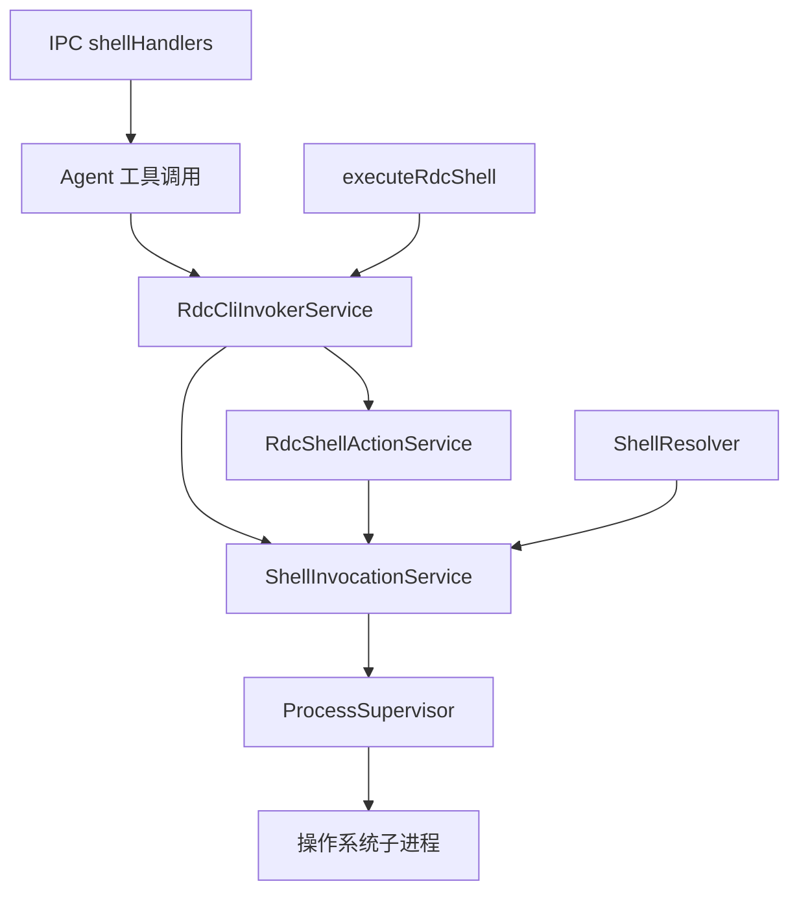
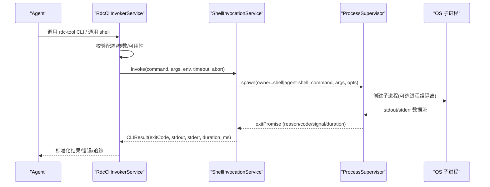
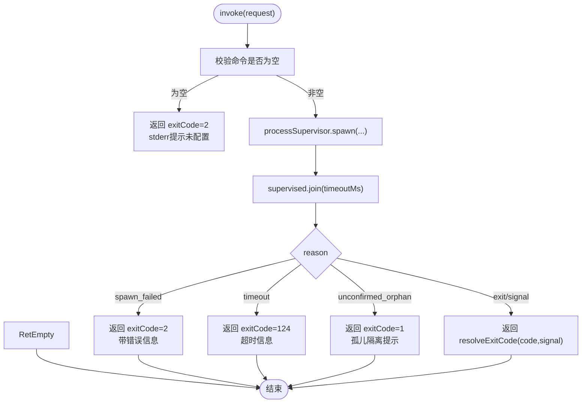
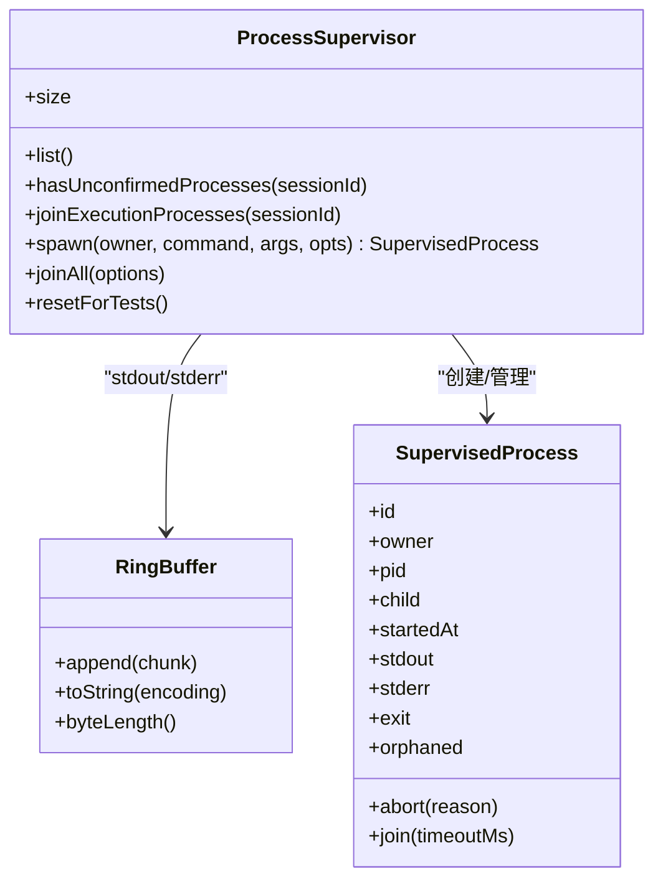
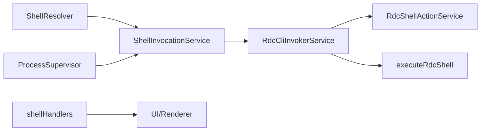

# Shell 工具接口

<cite>
**本文引用的文件**
- [ShellInvocationService.ts](file://src/main/tools/ShellInvocationService.ts)
- [ProcessSupervisor.ts](file://src/main/runtime/ProcessSupervisor.ts)
- [RdcCliInvokerService.ts](file://src/main/tools/RdcCliInvokerService.ts)
- [RdcShellActionService.ts](file://src/main/tools/RdcShellActionService.ts)
- [executeRdcShell.ts](file://src/main/tools/executeRdcShell.ts)
- [ShellResolver.ts](file://src/main/runtime/ShellResolver.ts)
- [shellHandlers.ts](file://src/main/ipc/shellHandlers.ts)
- [permissions.md](file://docs/contracts/permissions.md)
</cite>

## 目录
1. [简介](#简介)
2. [项目结构](#项目结构)
3. [核心组件](#核心组件)
4. [架构总览](#架构总览)
5. [详细组件分析](#详细组件分析)
6. [依赖关系分析](#依赖关系分析)
7. [性能与资源限制](#性能与资源限制)
8. [故障排查指南](#故障排查指南)
9. [结论](#结论)
10. [附录：安全与使用指南](#附录：安全与使用指南)

## 简介
本文件面向 RDC-Agent 的 Shell 工具接口，系统性说明命令执行、管道操作、文件处理与进程控制能力；重点阐述安全沙箱机制、权限控制与资源限制；并覆盖异步执行、输出流处理、错误恢复与性能优化策略。同时提供 Shell 脚本集成与安全使用建议，帮助开发者在 Agent 工作流中安全、可靠地调用系统 Shell 与 rdc-tool CLI。

## 项目结构
围绕 Shell 工具的核心代码主要分布在以下模块：
- 工具层：ShellInvocationService、RdcCliInvokerService、RdcShellActionService、executeRdcShell
- 运行时：ProcessSupervisor（进程生命周期与隔离）、ShellResolver（解释器解析）
- IPC 层：shellHandlers（Electron 主进程交互）
- 策略与契约：permissions.md（权限与安全边界）

图表来源
- [ShellInvocationService.ts:29-124](file://src/main/tools/ShellInvocationService.ts#L29-L124)
- [ProcessSupervisor.ts:167-394](file://src/main/runtime/ProcessSupervisor.ts#L167-L394)
- [RdcCliInvokerService.ts:178-221](file://src/main/tools/RdcCliInvokerService.ts#L178-L221)
- [RdcShellActionService.ts:154-270](file://src/main/tools/RdcShellActionService.ts#L154-L270)
- [executeRdcShell.ts:16-70](file://src/main/tools/executeRdcShell.ts#L16-L70)
- [ShellResolver.ts:84-135](file://src/main/runtime/ShellResolver.ts#L84-L135)
- [shellHandlers.ts:69-208](file://src/main/ipc/shellHandlers.ts#L69-L208)

章节来源
- [ShellInvocationService.ts:29-124](file://src/main/tools/ShellInvocationService.ts#L29-L124)
- [ProcessSupervisor.ts:167-394](file://src/main/runtime/ProcessSupervisor.ts#L167-L394)
- [RdcCliInvokerService.ts:178-221](file://src/main/tools/RdcCliInvokerService.ts#L178-L221)
- [RdcShellActionService.ts:154-270](file://src/main/tools/RdcShellActionService.ts#L154-L270)
- [executeRdcShell.ts:16-70](file://src/main/tools/executeRdcShell.ts#L16-L70)
- [ShellResolver.ts:84-135](file://src/main/runtime/ShellResolver.ts#L84-L135)
- [shellHandlers.ts:69-208](file://src/main/ipc/shellHandlers.ts#L69-L208)

## 核心组件
- ShellInvocationService：统一封装 Shell 命令执行，负责参数校验、环境注入、超时/中止、退出码归一化、孤儿进程处理与活跃进程跟踪。
- ProcessSupervisor：统一的子进程注册表，提供树杀、环形缓冲区输出、超时、AbortSignal 支持、进程组隔离与“未确认孤儿”检测。
- RdcCliInvokerService：将 rdc-tool CLI 配置、参数拼装、可用性检查、编解码与追踪整合为可复用的 CLI 调用入口。
- RdcShellActionService：基于配置的 RDC Action 运行器，变量替换、JSON 信封解析、诊断格式化与日志记录。
- executeRdcShell：受严格上下文与租约约束的原生 RDC 执行入口，包含输入校验、所有权校验、协议一致性校验与回执生成。
- ShellResolver：跨平台 Shell 解释器探测与选择，保证非交互式执行与版本信息。
- shellHandlers：Electron 主进程的 Shell 相关 IPC 能力（对话框、窗口、剪贴板、路径打开等），用于 UI 与主进程交互。

章节来源
- [ShellInvocationService.ts:29-124](file://src/main/tools/ShellInvocationService.ts#L29-L124)
- [ProcessSupervisor.ts:167-394](file://src/main/runtime/ProcessSupervisor.ts#L167-L394)
- [RdcCliInvokerService.ts:178-221](file://src/main/tools/RdcCliInvokerService.ts#L178-L221)
- [RdcShellActionService.ts:154-270](file://src/main/tools/RdcShellActionService.ts#L154-L270)
- [executeRdcShell.ts:16-70](file://src/main/tools/executeRdcShell.ts#L16-L70)
- [ShellResolver.ts:84-135](file://src/main/runtime/ShellResolver.ts#L84-L135)
- [shellHandlers.ts:69-208](file://src/main/ipc/shellHandlers.ts#L69-L208)

## 架构总览
下图展示从 Agent 到 OS 子进程的完整调用链，包括权限校验、CLI 装配、进程监督与结果回传。

图表来源
- [RdcCliInvokerService.ts:178-221](file://src/main/tools/RdcCliInvokerService.ts#L178-L221)
- [ShellInvocationService.ts:32-104](file://src/main/tools/ShellInvocationService.ts#L32-L104)
- [ProcessSupervisor.ts:167-394](file://src/main/runtime/ProcessSupervisor.ts#L167-L394)

## 详细组件分析

### ShellInvocationService
职责
- 命令执行：统一入口，支持 Windows 批处理自动走 shell。
- 环境变量：合并进程环境与请求环境，强制设置编码。
- 进程管理：通过 ProcessSupervisor 启动并 join，支持超时与 AbortSignal。
- 退出码：规范化 code/signal 为数字退出码。
- 孤儿进程：对未确认退出的进程进行隔离标记与清理。
- 活跃进程跟踪：按 runId/contextId 支持批量中止与终止。

关键流程
- 空命令快速失败。
- 根据平台与扩展名决定是否使用 shell。
- 启动进程并加入活跃表，等待退出或超时。
- 根据不同 reason 返回不同 exitCode 与消息。
- finally 中清理活跃表，必要时延迟删除以观察 close。

图表来源
- [ShellInvocationService.ts:32-104](file://src/main/tools/ShellInvocationService.ts#L32-L104)

章节来源
- [ShellInvocationService.ts:29-124](file://src/main/tools/ShellInvocationService.ts#L29-L124)

### ProcessSupervisor
职责
- 子进程注册与生命周期管理：统一 spawn、join、abort、list、shutdown。
- 输出缓冲：RingBuffer 限制内存占用，避免大输出导致 OOM。
- 超时与中止：支持 timeoutMs 与 AbortSignal，超时后发送 SIGTERM 并在宽限期内升级为 SIGKILL。
- 进程组隔离：POSIX 下 detached 进程组，便于整树 kill；Windows 使用 taskkill /T。
- 孤儿检测：若强制终止后未在宽限期内观察到 close，标记 unconfirmed_orphan。

关键点
- terminateTree：跨平台安全终止子进程树。
- join：支持可选超时，内部使用 Promise.race 与观察定时器。
- shutdown：joinAll 对所有进程发出 abort，并等待退出。

图表来源
- [ProcessSupervisor.ts:77-102](file://src/main/runtime/ProcessSupervisor.ts#L77-L102)
- [ProcessSupervisor.ts:140-165](file://src/main/runtime/ProcessSupervisor.ts#L140-L165)
- [ProcessSupervisor.ts:167-394](file://src/main/runtime/ProcessSupervisor.ts#L167-L394)

章节来源
- [ProcessSupervisor.ts:167-394](file://src/main/runtime/ProcessSupervisor.ts#L167-L394)

### RdcCliInvokerService
职责
- 配置与可用性：读取设置，校验命令、工作目录、catalog 存在性。
- 参数组装：规范化 --context-id -> --daemon-context，拼接全局前缀与命令参数。
- 执行：委托 ShellInvocationService 执行，并返回标准 CLIResult。
- 工具调用封装：call 方法将 ToolCallRequest 转换为 CLI 调用，解析 JSON 信封，构造 ToolCallResult 并触发追踪回调。

要点
- 失败快速返回：不可用或未配置时直接返回 exitCode=2。
- 追踪：onInvocationTrace 监听每次调用的入参与结果。
- 中止与终止：转发到 ShellInvocationService。

章节来源
- [RdcCliInvokerService.ts:42-221](file://src/main/tools/RdcCliInvokerService.ts#L42-L221)
- [RdcCliInvokerService.ts:248-363](file://src/main/tools/RdcCliInvokerService.ts#L248-L363)

### RdcShellActionService
职责
- 动作运行：根据 actionId 加载配置，变量替换，构建命令与环境，调用 ShellInvocationService。
- 结果解析：要求 stdout 为标准 JSON 信封，解析 data/ok/error/diagnostic。
- 诊断格式化：将结构化诊断转为可读字符串，便于日志与用户可见。
- 日志记录：成功/失败均记录到 RuntimeLogService。

要点
- 变量替换：支持 {{var}} 语法，缺失值替换为空串。
- 工作目录与环境：支持相对/绝对路径与变量替换。
- 错误分类：区分解析错误、payload 错误、命令行错误。

章节来源
- [RdcShellActionService.ts:154-270](file://src/main/tools/RdcShellActionService.ts#L154-L270)

### executeRdcShell
职责
- 严格上下文校验：仅 General agent 且具备有效租约时可执行原生 RDC 操作。
- 输入校验：operation 白名单、args 白名单字段保护、实验 ID 准备回执。
- 执行与一致性：调用 RdcCliInvokerService，校验 result_kind 与 replaySessionId 一致。
- 回执：可选写入签名回执，记录操作、参数指纹、结果哈希与时间戳。
- 异常恢复：异常时隔离上下文，提示后续需通过捕获生命周期恢复。

要点
- 防篡改：禁止传入 session/context/daemon/owner 等敏感字段。
- 幂等与审计：receipt 提供可验证的执行证据。

章节来源
- [executeRdcShell.ts:16-70](file://src/main/tools/executeRdcShell.ts#L16-L70)

### ShellResolver
职责
- 解释器探测：优先 pwsh 7，其次 Windows PowerShell 5.1；POSIX 优先 $SHELL（限定 zsh/bash/sh/dash），否则回退到常见路径。
- 非交互式参数：PowerShell 使用 -EncodedCommand 确保稳定；POSIX 使用 -lc。
- 版本探测：通过最小命令探测版本，缓存结果。
- 安全过滤：拒绝 fish/csh/nu 等不受支持的 POSIX shell。

要点
- 缓存：resolve 结果缓存，避免重复探测。
- 兼容性：buildNonInteractiveArgs 适配不同解释器的稳定执行方式。

章节来源
- [ShellResolver.ts:84-135](file://src/main/runtime/ShellResolver.ts#L84-L135)
- [ShellResolver.ts:105-113](file://src/main/runtime/ShellResolver.ts#L105-L113)
- [ShellResolver.ts:191-276](file://src/main/runtime/ShellResolver.ts#L191-L276)

### shellHandlers（IPC）
职责
- 文件与对话框：选择 .rdc 文件、任意文件、目录。
- 窗口控制：最小化、最大化切换、关闭、查询状态。
- 应用元信息：获取版本、产品名称、主题、测试模式。
- 头像处理：选择头像、复制到工作区、读取 Data URL。
- 路径打开：打开文件或文件夹。
- 剪贴板：复制文本、读取文本。

要点
- 参数校验：所有 handler 使用 parseIpcArgs 进行严格校验。
- 安全：路径与类型校验，失败时 fail-closed。

章节来源
- [shellHandlers.ts:69-208](file://src/main/ipc/shellHandlers.ts#L69-L208)

## 依赖关系分析
- ShellInvocationService 依赖 ProcessSupervisor 完成进程生命周期管理。
- RdcCliInvokerService 依赖 ShellInvocationService 执行具体命令，并依赖 SettingsService 获取配置。
- RdcShellActionService 依赖 ShellInvocationService 与 SettingsService/AppPathService。
- executeRdcShell 依赖 RdcCliInvokerService、RdcNativeProtocol、RdcExecutionReceipts 以及会话租约服务。
- ShellResolver 被上层用于确定解释器，但当前 ShellInvocationService 直接使用 processSupervisor.spawn 的 shell 选项；当需要非交互式参数时可使用 ShellResolver。
- shellHandlers 独立于上述工具链，提供 Electron 主进程能力。

图表来源
- [ShellInvocationService.ts:29-124](file://src/main/tools/ShellInvocationService.ts#L29-L124)
- [ProcessSupervisor.ts:167-394](file://src/main/runtime/ProcessSupervisor.ts#L167-L394)
- [RdcCliInvokerService.ts:178-221](file://src/main/tools/RdcCliInvokerService.ts#L178-L221)
- [RdcShellActionService.ts:154-270](file://src/main/tools/RdcShellActionService.ts#L154-L270)
- [executeRdcShell.ts:16-70](file://src/main/tools/executeRdcShell.ts#L16-L70)
- [shellHandlers.ts:69-208](file://src/main/ipc/shellHandlers.ts#L69-L208)

章节来源
- [ShellInvocationService.ts:29-124](file://src/main/tools/ShellInvocationService.ts#L29-L124)
- [RdcCliInvokerService.ts:178-221](file://src/main/tools/RdcCliInvokerService.ts#L178-L221)
- [RdcShellActionService.ts:154-270](file://src/main/tools/RdcShellActionService.ts#L154-L270)
- [executeRdcShell.ts:16-70](file://src/main/tools/executeRdcShell.ts#L16-L70)
- [shellHandlers.ts:69-208](file://src/main/ipc/shellHandlers.ts#L69-L208)

## 性能与资源限制
- 输出缓冲：ProcessSupervisor 使用 RingBuffer 限制 stdout/stderr 最大字节数，防止大输出导致内存膨胀。默认上限为固定值，可通过 ringBufferBytes 调整。
- 超时控制：支持 timeoutMs，超时后先 SIGTERM，再在宽限期后 SIGKILL；若未观察到 close，标记为 unconfirmed_orphan。
- 进程组隔离：POSIX 下 detached 进程组，便于整树终止；Windows 使用 taskkill /T。
- 中止信号：支持 AbortSignal，可在调用方取消时立即中断子进程。
- 活跃进程跟踪：ShellInvocationService 维护 activeProcesses，支持按 runId 中止与全局 terminateAll。
- 配置缓存：ShellResolver 缓存解释器探测结果，减少重复开销。

[本节为通用性能指导，不直接分析具体文件]

## 故障排查指南
常见问题与定位
- 命令未配置或不可用：检查 ShellInvocationService 的空命令分支与 RdcCliInvokerService 的可用性检查。
- 子进程启动失败：关注 ProcessSupervisor 的 spawn_failed 原因与错误对象。
- 超时：检查 timeoutMs 设置与 ProcessSupervisor 的超时逻辑；确认是否需要增大超时或优化命令。
- 孤儿进程：若出现 unconfirmed_orphan，检查子进程是否响应 SIGTERM/SIGKILL，必要时调整宽限期或修复子进程行为。
- RDC 执行被拒绝：检查 executeRdcShell 的上下文与租约校验，确保 General agent、拥有会话/项目租约、非 default context。
- 权限不足：参考 permissions.md 中的 Permission Mode、shellHardDeny、沙箱与 IPC 限制。

章节来源
- [ShellInvocationService.ts:32-104](file://src/main/tools/ShellInvocationService.ts#L32-L104)
- [ProcessSupervisor.ts:167-394](file://src/main/runtime/ProcessSupervisor.ts#L167-L394)
- [executeRdcShell.ts:16-70](file://src/main/tools/executeRdcShell.ts#L16-L70)
- [permissions.md:78-112](file://docs/contracts/permissions.md#L78-L112)

## 结论
Shell 工具接口通过分层设计实现了安全的命令执行与进程控制：
- ShellInvocationService 提供统一的执行入口与健壮的错误处理。
- ProcessSupervisor 保障进程生命周期、资源限制与跨平台终止。
- RdcCliInvokerService 与 RdcShellActionService 将配置、参数与结果标准化，便于追踪与复用。
- executeRdcShell 在严格上下文与租约约束下执行原生 RDC 操作，并提供可验证的回执。
- ShellResolver 确保跨平台解释器的一致性与稳定性。
- shellHandlers 提供 Electron 主进程能力，配合 UI 完成文件、窗口与剪贴板操作。
结合权限策略与安全边界，整体方案在保证功能的同时，最大限度降低风险。

[本节为总结性内容，不直接分析具体文件]

## 附录：安全与使用指南
安全边界
- 权限模式：Default/Auto-review/Full access/Custom，决定审批与自动许可范围。
- 沙箱：Electron sandbox 启用，IPC 全量 Zod 校验，fail-closed。
- Shell 策略：硬拒绝危险命令（如 rm -rf /、dd if=、diskpart、shutdown /s、format 等），POSIX 与 cmd 均有覆盖；PowerShell 有编码器与嵌套调用防护。
- RDC 上下文：仅 per-session lease，禁止全局镜像；工具执行前必须校验所有权。
- 秘密隔离：safeStorage 不可用则 fail-closed，对外仅返回掩码预览。

最佳实践
- 始终设置合理的 timeoutMs 与 AbortSignal，避免长时间阻塞。
- 使用 RdcShellActionService 的变量替换，避免硬编码敏感信息。
- 对大输出使用 RingBuffer 限制，避免内存压力。
- 对 RDC 原生操作，确保具备租约与权限，并使用 executeRdcShell 以获得回执。
- 谨慎配置 ShellResolver 的覆盖路径，避免指向不受信任的可执行文件。
- 使用 shellHandlers 提供的受限能力，不要绕过 IPC 直接访问系统 API。

章节来源
- [permissions.md:78-112](file://docs/contracts/permissions.md#L78-L112)
- [RdcShellActionService.ts:154-270](file://src/main/tools/RdcShellActionService.ts#L154-L270)
- [ProcessSupervisor.ts:167-394](file://src/main/runtime/ProcessSupervisor.ts#L167-L394)
- [executeRdcShell.ts:16-70](file://src/main/tools/executeRdcShell.ts#L16-L70)
- [shellHandlers.ts:69-208](file://src/main/ipc/shellHandlers.ts#L69-L208)