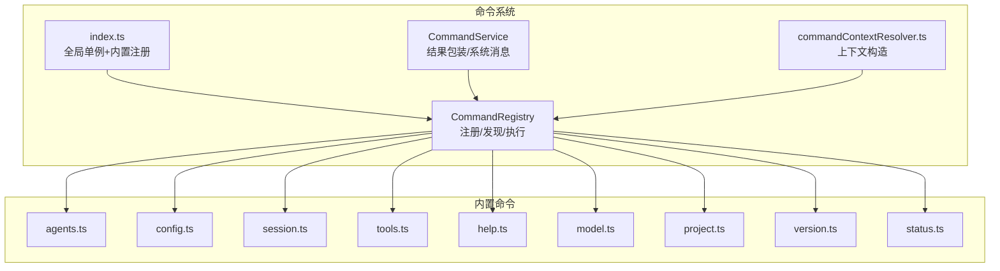
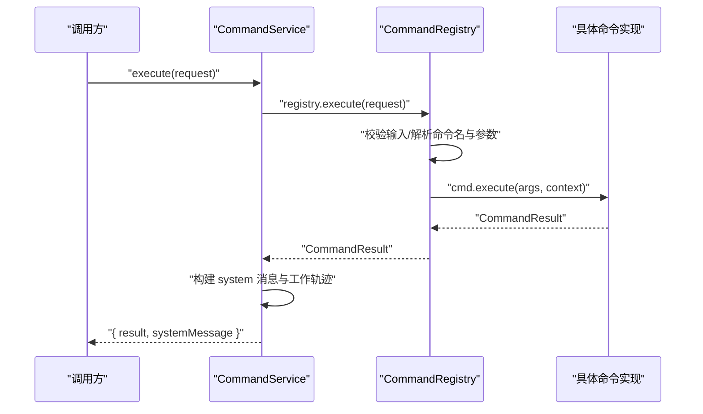
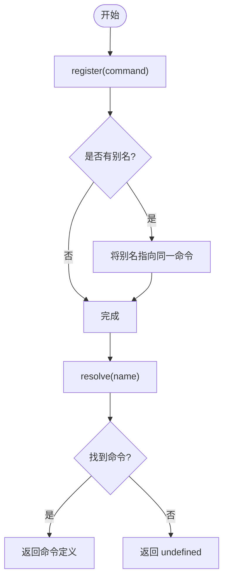
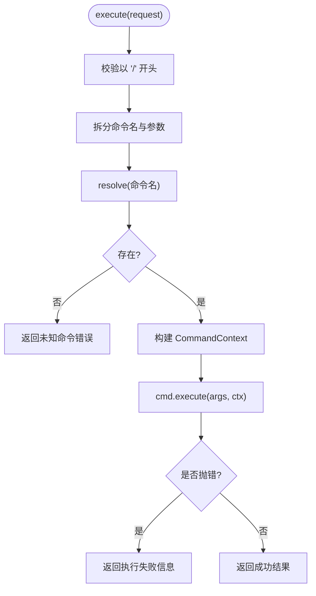
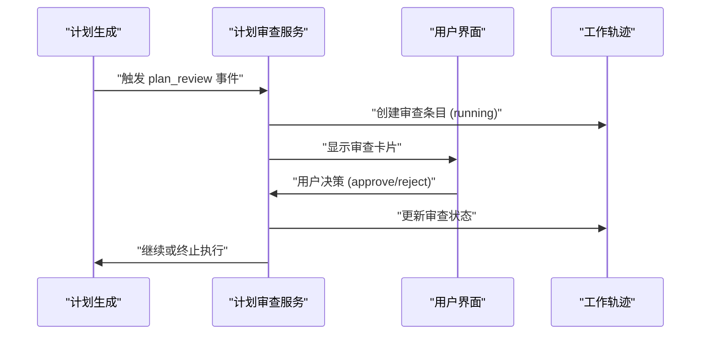
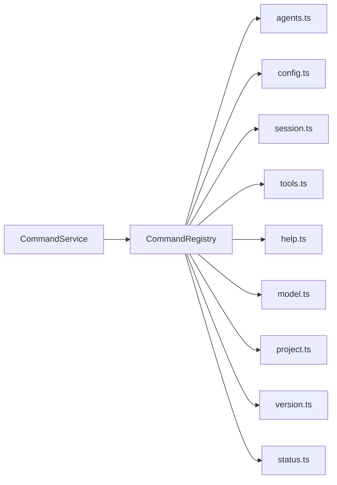

# 命令系统

<cite>
**本文引用的文件**
- [CommandRegistry.ts](file://src/main/commands/CommandRegistry.ts)
- [CommandService.ts](file://src/main/commands/CommandService.ts)
- [index.ts](file://src/main/commands/index.ts)
- [commandContextResolver.ts](file://src/main/commands/commandContextResolver.ts)
- [agents.ts](file://src/main/commands/builtins/agents.ts)
- [config.ts](file://src/main/commands/builtins/config.ts)
- [session.ts](file://src/main/commands/builtins/session.ts)
- [tools.ts](file://src/main/commands/builtins/tools.ts)
- [help.ts](file://src/main/commands/builtins/help.ts)
- [model.ts](file://src/main/commands/builtins/model.ts)
- [project.ts](file://src/main/commands/builtins/project.ts)
- [version.ts](file://src/main/commands/builtins/version.ts)
- [status.ts](file://src/main/commands/builtins/status.ts)
- [ConversationPlanReviewEvents.ts](file://src/main/conversation/ConversationPlanReviewEvents.ts)
- [plan-handoff-acceptance-continuation.md](file://docs/workflows/plan-handoff-acceptance-continuation.md)
</cite>

## 更新摘要
**所做更改**
- 移除了对已删除的 `/plan` 内置命令的引用和说明
- 更新了计划操作的工作流程说明，强调通过标准化的计划审查工作流进行
- 添加了计划审查事件处理的相关文档
- 更新了内置命令列表以反映当前可用的命令集合

## 目录
1. [简介](#简介)
2. [项目结构](#项目结构)
3. [核心组件](#核心组件)
4. [架构总览](#架构总览)
5. [详细组件分析](#详细组件分析)
6. [依赖关系分析](#依赖关系分析)
7. [性能考量](#性能考量)
8. [故障排查指南](#故障排查指南)
9. [结论](#结论)
10. [附录](#附录)

## 简介
本文件系统性梳理 RDC Agent 主进程中的"命令系统"，覆盖命令注册、发现、参数解析与执行流程，详细说明内置命令（如 agents、config、session、tools 等）的功能与用法，并提供自定义命令开发指南、命令上下文管理与错误处理机制，以及扩展与插件开发的最佳实践。**注意：计划操作现在通过标准化的计划审查工作流进行，而不是直接命令调用。**

## 项目结构
命令系统位于 src/main/commands 目录下，采用"核心引擎 + 内置命令"的分层组织：
- 核心引擎
  - CommandRegistry：命令注册表，负责注册、注销、查找、列举与执行入口
  - CommandService：命令执行桥接层，封装结果并生成系统消息
  - index：全局单例注册表初始化与内置命令自动注册
  - commandContextResolver：命令上下文构造器
- 内置命令
  - builtins/*：各命令实现，遵循统一的 CommandDefinition 接口



**图表来源**
- [CommandRegistry.ts:18-115](file://src/main/commands/CommandRegistry.ts#L18-L115)
- [CommandService.ts:17-73](file://src/main/commands/CommandService.ts#L17-L73)
- [index.ts:29-68](file://src/main/commands/index.ts#L29-L68)
- [commandContextResolver.ts:7-25](file://src/main/commands/commandContextResolver.ts#L7-L25)

**章节来源**
- [CommandRegistry.ts:1-116](file://src/main/commands/CommandRegistry.ts#L1-L116)
- [CommandService.ts:1-74](file://src/main/commands/CommandService.ts#L1-L74)
- [index.ts:1-69](file://src/main/commands/index.ts#L1-L69)
- [commandContextResolver.ts:1-26](file://src/main/commands/commandContextResolver.ts#L1-L26)

## 核心组件
- CommandRegistry
  - 维护命令映射（支持别名），提供 register/unregister/resolve/list/execute
  - execute 负责输入校验、路由到具体命令、构建上下文、异常捕获与统一返回
- CommandService
  - 调用 registry.execute，将结果转换为 ConversationMessage（system role），附带 workTrace 块
- index.ts
  - 提供 getRegistry() 获取全局单例，并在首次创建时注册所有内置命令
- commandContextResolver
  - 将外部传入的会话、项目、工作区、Agent、模式、模型、主题等信息组装为 CommandContext

**章节来源**
- [CommandRegistry.ts:18-115](file://src/main/commands/CommandRegistry.ts#L18-L115)
- [CommandService.ts:17-73](file://src/main/commands/CommandService.ts#L17-L73)
- [index.ts:29-68](file://src/main/commands/index.ts#L29-L68)
- [commandContextResolver.ts:7-25](file://src/main/commands/commandContextResolver.ts#L7-L25)

## 架构总览
命令系统的执行链路如下：
- 调用方通过 CommandService.execute 发起请求
- CommandService 委托 CommandRegistry.execute 进行解析与执行
- CommandRegistry 根据命令名查找对应 CommandDefinition，并调用其 execute
- 命令实现返回 CommandResult；CommandService 将其包装为 system 消息并附加 workTrace



**图表来源**
- [CommandService.ts:20-32](file://src/main/commands/CommandService.ts#L20-L32)
- [CommandRegistry.ts:74-114](file://src/main/commands/CommandRegistry.ts#L74-L114)

**章节来源**
- [CommandService.ts:1-74](file://src/main/commands/CommandService.ts#L1-L74)
- [CommandRegistry.ts:1-116](file://src/main/commands/CommandRegistry.ts#L1-L116)

## 详细组件分析

### 命令注册与发现
- 注册：CommandRegistry.register 支持同名覆盖与别名映射
- 注销：unregister 会清理主名称与相关别名
- 查找：resolve 支持别名解析
- 列举：list 可按类别过滤，去重并按名称排序



**图表来源**
- [CommandRegistry.ts:21-52](file://src/main/commands/CommandRegistry.ts#L21-L52)

**章节来源**
- [CommandRegistry.ts:21-52](file://src/main/commands/CommandRegistry.ts#L21-L52)

### 命令执行流程与上下文管理
- 输入校验：必须以 "/" 开头
- 参数解析：按空白分割，首段为命令名，其余为参数数组
- 上下文构建：从 request.context 提取 sessionId、projectId、workspaceRoot、agentId、currentMode、currentModelId、currentTheme
- 执行与异常：try/catch 捕获命令执行异常，统一返回失败结果



**图表来源**
- [CommandRegistry.ts:74-114](file://src/main/commands/CommandRegistry.ts#L74-L114)

**章节来源**
- [CommandRegistry.ts:74-114](file://src/main/commands/CommandRegistry.ts#L74-L114)
- [commandContextResolver.ts:7-25](file://src/main/commands/commandContextResolver.ts#L7-L25)

### 结果包装与系统消息
- CommandService 在收到 CommandResult 后，若包含 message/systemMessage，则构建 system 角色消息
- 同时生成 workTrace 块，记录命令标题、状态、摘要与工具调用占位

```mermaid
classDiagram
class CommandService {
+execute(request) Promise~{result, systemMessage?}~
-buildSystemMessage(result, request) ConversationMessage
}
class CommandRegistry {
+execute(request) Promise~CommandResult~
}
CommandService --> CommandRegistry : "委托执行"
```

**图表来源**
- [CommandService.ts:20-73](file://src/main/commands/CommandService.ts#L20-L73)
- [CommandRegistry.ts:74-114](file://src/main/commands/CommandRegistry.ts#L74-L114)

**章节来源**
- [CommandService.ts:20-73](file://src/main/commands/CommandService.ts#L20-L73)

### 内置命令一览与用法
以下命令均遵循统一的 CommandDefinition 接口，具备 id/name/description/category/aliases/execute 等字段。

- /agents
  - 功能：列出可用 Agent profiles 或切换到指定 Agent
  - 用法：/agents 或 /agents <agentId>
  - 行为：无参返回可用列表；有参触发 UI 动作切换模式

- /config
  - 功能：打开设置或查看/修改配置项
  - 用法：/config 或 /config <section>
  - 行为：触发打开设置界面，可选携带 section

- /session
  - 功能：会话管理（list/new/rename/resume）
  - 用法：/session list|new|rename <name>|resume <id>
  - 行为：根据子命令返回相应操作结果，部分使用上下文中的 sessionId

- /tools
  - 功能：列出或描述可用工具
  - 用法：/tools 或 /tools <toolId>
  - 行为：无参列出内置工具集合；有参返回工具详情占位

- /help
  - 功能：列出所有命令或查看某命令详情
  - 用法：/help 或 /help <command>
  - 行为：读取注册表，按类别分组输出或展示单个命令说明

- /model
  - 功能：查看或切换当前对话模型
  - 用法：/model 或 /model default|<modelId>
  - 行为：无参显示当前模型；default 或指定模型触发 UI 切换

- /project
  - 功能：项目管理（list/create/switch/rename/delete）
  - 用法：/project list|create <name>|switch <id>
  - 行为：根据子命令返回操作结果，部分使用上下文 projectId

- /version
  - 功能：显示应用版本信息
  - 用法：/version
  - 行为：输出 Electron/Node/Chrome 版本信息

- /status
  - 功能：系统状态与诊断信息
  - 用法：/status
  - 行为：输出会话、项目、工作区、Agent、模式、模型及运行环境信息

**注意**：原 `/plan` 命令已被移除，计划操作现在通过标准化的计划审查工作流进行。

**章节来源**
- [agents.ts:6-27](file://src/main/commands/builtins/agents.ts#L6-L27)
- [config.ts:6-19](file://src/main/commands/builtins/config.ts#L6-L19)
- [session.ts:6-28](file://src/main/commands/builtins/session.ts#L6-L28)
- [tools.ts:7-26](file://src/main/commands/builtins/tools.ts#L7-L26)
- [help.ts:7-48](file://src/main/commands/builtins/help.ts#L7-L48)
- [model.ts:3-30](file://src/main/commands/builtins/model.ts#L3-L30)
- [project.ts:6-26](file://src/main/commands/builtins/project.ts#L6-L26)
- [version.ts:15-28](file://src/main/commands/builtins/version.ts#L15-L28)
- [status.ts:6-31](file://src/main/commands/builtins/status.ts#L6-L31)

### 计划操作工作流程
**重要更新**：计划操作不再通过直接的 `/plan` 命令执行，而是通过标准化的计划审查工作流进行。

计划审查工作流的核心组件：
- `ConversationPlanReviewEvents`：处理计划审查事件的请求和响应
- `applyPlanReviewRequested`：处理计划审查请求，创建工作轨迹条目
- `applyPlanReviewAnswered`：处理计划审查决策，更新审查状态

计划审查流程：
1. 计划生成后触发 `plan_review` 类型的事件
2. 系统创建计划审查条目，状态为 `running`
3. 用户通过 UI 进行审查决策（批准/拒绝/修订）
4. 系统更新计划审查状态并持久化决策
5. 根据决策继续或终止执行流程



**图表来源**
- [ConversationPlanReviewEvents.ts:11-33](file://src/main/conversation/ConversationPlanReviewEvents.ts#L11-L33)
- [ConversationPlanReviewEvents.ts:35-74](file://src/main/conversation/ConversationPlanReviewEvents.ts#L35-L74)

**章节来源**
- [ConversationPlanReviewEvents.ts:1-74](file://src/main/conversation/ConversationPlanReviewEvents.ts#L1-L74)
- [plan-handoff-acceptance-continuation.md:24-38](file://docs/workflows/plan-handoff-acceptance-continuation.md#L24-L38)

### 自定义命令开发指南
- 新建命令文件：在 builtins 下新增 .ts 文件，导出一个 CommandDefinition 对象
- 必填字段：id、name、description、category、execute
- 可选字段：aliases（别名）、uiAction（UI 动作，如 switch-mode/open-settings/switch-model）
- 参数解析：args 为字符串数组，由调用方按空白切分；命令内部自行解析语义
- 上下文使用：通过 execute 的第二个参数获取 CommandContext（sessionId、projectId、workspaceRoot、agentId、currentMode、currentModelId、currentTheme）
- 返回值：CommandResult，至少包含 success 与 message；可附加 data 与 uiAction
- 注册方式：在 index.ts 的 registerBuiltins 中导入并加入列表，或通过运行时 registry.register 动态注册

最佳实践
- 保持命令幂等与健壮性，对非法参数给出明确提示
- 使用 category 分类便于 UI 自动补全与帮助页分组
- 尽量通过 uiAction 驱动界面变化，避免直接耦合渲染逻辑
- 对可能抛错的异步操作使用 try/catch，统一返回失败结果

**章节来源**
- [index.ts:41-68](file://src/main/commands/index.ts#L41-L68)
- [CommandRegistry.ts:21-32](file://src/main/commands/CommandRegistry.ts#L21-L32)
- [CommandRegistry.ts:74-114](file://src/main/commands/CommandRegistry.ts#L74-L114)

### 命令扩展与插件开发
- 动态注册：通过 getRegistry().register(...) 在运行时注入新命令，无需重启
- 动态卸载：通过 unregister(name) 移除命令及其别名
- 命名冲突：同名命令会被覆盖，最后注册者胜出；建议通过唯一 id 与规范命名避免冲突
- 插件化建议：将插件命令独立模块导出，在主进程启动时按需加载并注册

**章节来源**
- [CommandRegistry.ts:21-47](file://src/main/commands/CommandRegistry.ts#L21-L47)
- [index.ts:31-38](file://src/main/commands/index.ts#L31-L38)

## 依赖关系分析
- CommandService 依赖 CommandRegistry 执行命令
- 内置命令依赖共享类型与常量（如 agentToolTokens），并通过 CommandContext 访问运行时上下文
- index.ts 聚合所有内置命令并统一注册



**图表来源**
- [CommandService.ts:17-32](file://src/main/commands/CommandService.ts#L17-L32)
- [CommandRegistry.ts:74-114](file://src/main/commands/CommandRegistry.ts#L74-L114)
- [index.ts:41-68](file://src/main/commands/index.ts#L41-L68)

**章节来源**
- [CommandService.ts:1-74](file://src/main/commands/CommandService.ts#L1-L74)
- [CommandRegistry.ts:1-116](file://src/main/commands/CommandRegistry.ts#L1-L116)
- [index.ts:1-69](file://src/main/commands/index.ts#L1-L69)

## 性能考量
- 命令解析为 O(1) 查找（Map），列举为 O(n) 排序，整体开销低
- 命令执行应尽量避免阻塞主线程的重计算；必要时将耗时任务下沉至后台服务
- 批量列举命令时注意去重与缓存，减少重复计算
- 系统消息构建轻量，避免在高频路径中进行大对象序列化

## 故障排查指南
- 未知命令：检查命令名是否正确、是否已注册（含别名）
- 未以 "/" 开头：确保输入符合协议要求
- 执行异常：CommandRegistry 会捕获异常并返回失败结果；检查命令实现中的 try/catch 与错误信息
- 上下文缺失：确认调用方正确传递 CommandContext 字段
- 结果不可见：检查 CommandService 是否构建了 systemMessage（当 result.message 或 systemMessage 存在时才会生成）
- **计划操作问题**：如果计划操作不工作，检查计划审查工作流是否正确触发，而非尝试使用已移除的 `/plan` 命令

**章节来源**
- [CommandRegistry.ts:74-114](file://src/main/commands/CommandRegistry.ts#L74-L114)
- [CommandService.ts:20-73](file://src/main/commands/CommandService.ts#L20-L73)

## 结论
命令系统以 CommandRegistry 为核心，配合 CommandService 的结果包装与系统消息生成，实现了可扩展、易用的命令行能力。内置命令覆盖了工作流、导航、调试与系统诊断等常见场景。**重要更新**：计划操作已从直接命令调用迁移到标准化的计划审查工作流，提供更好的用户体验和更严格的控制流程。通过统一的 CommandDefinition 接口与上下文机制，开发者可以便捷地扩展命令体系，并以最小成本集成到现有会话与 UI 流程中。

## 附录
- 命令上下文字段
  - sessionId：当前会话标识
  - projectId：当前项目标识
  - workspaceRoot：工作区根路径
  - agentId：当前 Agent 标识
  - currentMode：当前模式
  - currentModelId：当前模型标识
  - currentTheme：当前主题
- 命令结果字段
  - success：布尔，表示是否成功
  - message：用户可见的消息文本
  - data：可选数据，用于工作轨迹摘要
  - systemMessage：可选，替代默认消息的系统内容
  - uiAction：可选，驱动界面行为的动作对象
- **计划审查工作流字段**
  - planReview：计划审查对象，包含标题、摘要、状态和决策信息
  - approvalId：审批标识符
  - decision：最终决策（approve/reject）
  - status：审查状态（running/approved/rejected）

**章节来源**
- [commandContextResolver.ts:7-25](file://src/main/commands/commandContextResolver.ts#L7-L25)
- [CommandService.ts:34-73](file://src/main/commands/CommandService.ts#L34-L73)
- [ConversationPlanReviewEvents.ts:11-74](file://src/main/conversation/ConversationPlanReviewEvents.ts#L11-L74)