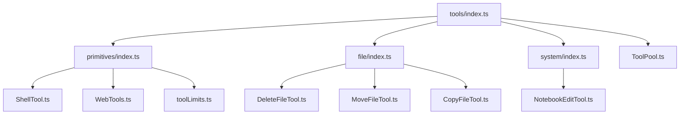
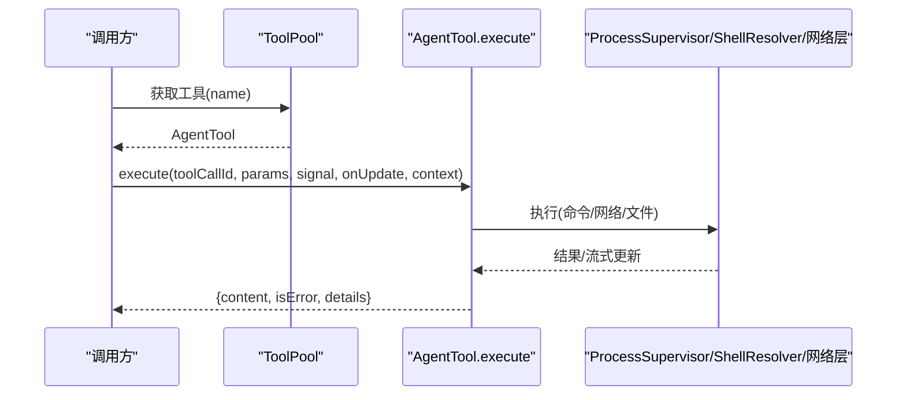
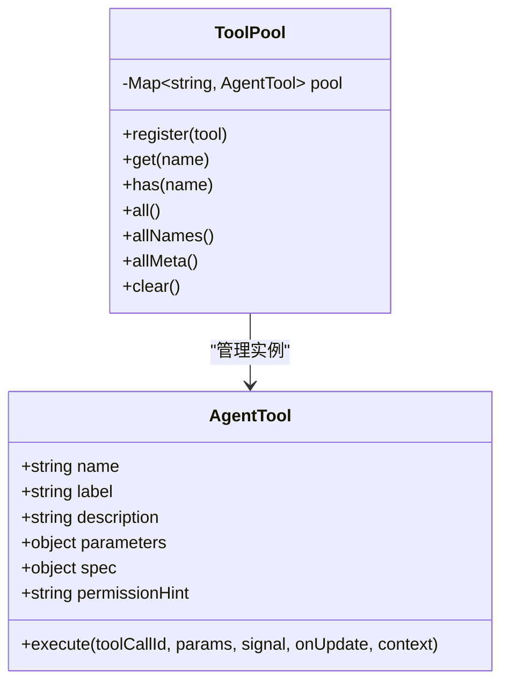
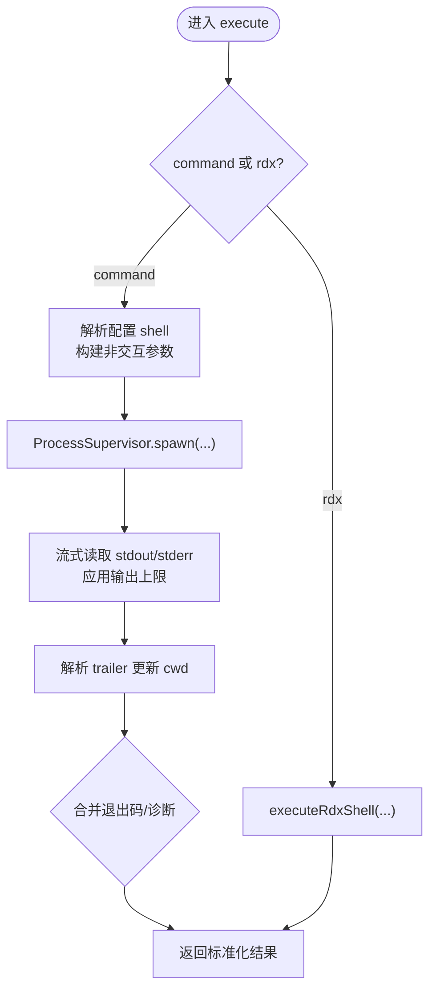
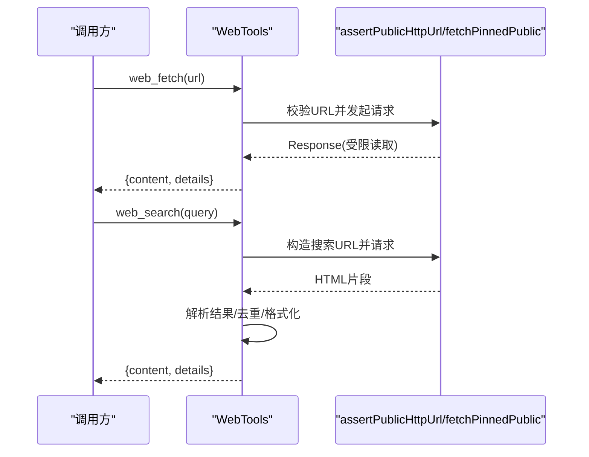
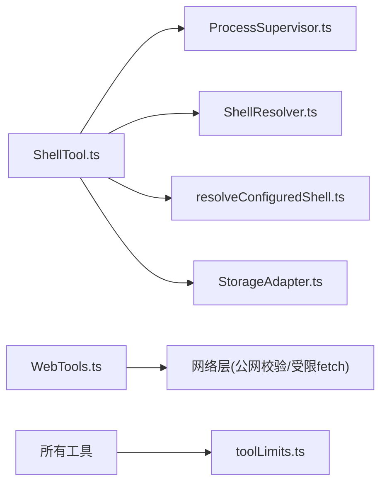

# 工具 API

<cite>
**本文引用的文件**
- [src/main/agent-runtime/tools/index.ts](file://src/main/agent-runtime/tools/index.ts)
- [src/main/agent-runtime/tools/ToolPool.ts](file://src/main/agent-runtime/tools/ToolPool.ts)
- [src/main/agent-runtime/tools/primitives/index.ts](file://src/main/agent-runtime/tools/primitives/index.ts)
- [src/main/agent-runtime/tools/file/index.ts](file://src/main/agent-runtime/tools/file/index.ts)
- [src/main/agent-runtime/tools/system/index.ts](file://src/main/agent-runtime/tools/system/index.ts)
- [src/main/agent-runtime/tools/primitives/ShellTool.ts](file://src/main/agent-runtime/tools/primitives/ShellTool.ts)
- [src/main/agent-runtime/tools/primitives/WebTools.ts](file://src/main/agent-runtime/tools/primitives/WebTools.ts)
- [src/main/agent-runtime/tools/primitives/toolLimits.ts](file://src/main/agent-runtime/tools/primitives/toolLimits.ts)
- [src/main/agent-runtime/agent/AgentTool.ts](file://src/main/agent-runtime/agent/AgentTool.ts)
- [src/main/tools/executeRdxShell.ts](file://src/main/tools/executeRdxShell.ts)
- [src/main/runtime/ProcessSupervisor.ts](file://src/main/runtime/ProcessSupervisor.ts)
- [src/main/runtime/ShellResolver.ts](file://src/main/runtime/ShellResolver.ts)
- [src/main/runtime/resolveConfiguredShell.ts](file://src/main/runtime/resolveConfiguredShell.ts)
- [src/main/sessions/StorageAdapter.ts](file://src/main/sessions/StorageAdapter.ts)
</cite>

## 目录
1. [简介](#简介)
2. [项目结构](#项目结构)
3. [核心组件](#核心组件)
4. [架构总览](#架构总览)
5. [详细组件分析](#详细组件分析)
6. [依赖关系分析](#依赖关系分析)
7. [性能考量](#性能考量)
8. [故障排查指南](#故障排查指南)
9. [结论](#结论)
10. [附录](#附录)

## 简介
本参考文档面向 RDC-Agent 的工具系统，提供统一接口与使用规范，覆盖工具注册、执行、权限控制与结果处理；说明内置工具的用法与自定义工具开发方法；并给出工具链集成、命令执行、文件操作、网络请求等能力的最佳实践与安全注意事项。

## 项目结构
工具子系统位于 agent-runtime 的 tools 目录，采用分层组织：
- primitives：基础能力（Shell、文件读写、搜索、Git、Web 等）
- file：文件级操作（删除、移动、复制）
- system：系统级能力（如 Notebook 编辑）
- ToolPool：工具实例缓存池
- index：统一导出入口，聚合各子模块并提供 getPrimitiveTools 工厂

图表来源
- [src/main/agent-runtime/tools/index.ts:1-12](file://src/main/agent-runtime/tools/index.ts#L1-L12)
- [src/main/agent-runtime/tools/primitives/index.ts:1-60](file://src/main/agent-runtime/tools/primitives/index.ts#L1-L60)
- [src/main/agent-runtime/tools/file/index.ts:1-4](file://src/main/agent-runtime/tools/file/index.ts#L1-L4)
- [src/main/agent-runtime/tools/system/index.ts:1-2](file://src/main/agent-runtime/tools/system/index.ts#L1-L2)

章节来源
- [src/main/agent-runtime/tools/index.ts:1-12](file://src/main/agent-runtime/tools/index.ts#L1-L12)
- [src/main/agent-runtime/tools/primitives/index.ts:1-60](file://src/main/agent-runtime/tools/primitives/index.ts#L1-L60)

## 核心组件
- AgentTool 统一契约：所有工具实现统一的 name、label、description、parameters、spec、permissionHint、execute 等字段，便于调度、权限校验与结果标准化。
- ToolPool：工具实例缓存池，避免重复创建有状态工具，支持注册、获取、枚举、清理。
- 内置工具集合：通过 getPrimitiveTools 一次性装配 Shell、文件、搜索、Git、Web、代码解释器等能力。
- 资源限制：toolLimits 集中定义输出大小、超时、重定向次数等硬限制，确保安全性与稳定性。

章节来源
- [src/main/agent-runtime/agent/AgentTool.ts](file://src/main/agent-runtime/agent/AgentTool.ts)
- [src/main/agent-runtime/tools/ToolPool.ts:1-38](file://src/main/agent-runtime/tools/ToolPool.ts#L1-L38)
- [src/main/agent-runtime/tools/primitives/index.ts:34-59](file://src/main/agent-runtime/tools/primitives/index.ts#L34-L59)
- [src/main/agent-runtime/tools/primitives/toolLimits.ts:1-49](file://src/main/agent-runtime/tools/primitives/toolLimits.ts#L1-L49)

## 架构总览
工具执行的关键路径：
- 上层调用工具 execute，传入 toolCallId、参数、AbortSignal、进度回调与上下文
- 工具内部根据能力选择具体实现（如 shell/web/file）
- 受权限策略与 spec 约束（只读/可写、是否需审批、并发安全、破坏性标记）
- 通过 ProcessSupervisor、ShellResolver、网络层等基础设施完成实际工作
- 返回标准化的 AgentToolResult，包含 content、isError、details

图表来源
- [src/main/agent-runtime/tools/ToolPool.ts:10-24](file://src/main/agent-runtime/tools/ToolPool.ts#L10-L24)
- [src/main/agent-runtime/tools/primitives/ShellTool.ts:83-137](file://src/main/agent-runtime/tools/primitives/ShellTool.ts#L83-L137)
- [src/main/runtime/ProcessSupervisor.ts](file://src/main/runtime/ProcessSupervisor.ts)
- [src/main/runtime/ShellResolver.ts](file://src/main/runtime/ShellResolver.ts)

## 详细组件分析

### 统一工具契约与注册
- 工具契约：每个工具暴露 name、label、description、parameters(JSON Schema)、spec(只读/并发/破坏性/副作用/分类/是否需要审批)、permissionHint、execute
- 注册与发现：ToolPool 维护 name -> AgentTool 映射，支持 all/allNames/allMeta 用于能力清单与元数据展示
- 内置装配：getPrimitiveTools 将 primitives、file、system 下的工具统一组装为可用列表

图表来源
- [src/main/agent-runtime/agent/AgentTool.ts](file://src/main/agent-runtime/agent/AgentTool.ts)
- [src/main/agent-runtime/tools/ToolPool.ts:7-37](file://src/main/agent-runtime/tools/ToolPool.ts#L7-L37)
- [src/main/agent-runtime/tools/primitives/index.ts:34-59](file://src/main/agent-runtime/tools/primitives/index.ts#L34-L59)

章节来源
- [src/main/agent-runtime/tools/ToolPool.ts:1-38](file://src/main/agent-runtime/tools/ToolPool.ts#L1-L38)
- [src/main/agent-runtime/tools/primitives/index.ts:1-60](file://src/main/agent-runtime/tools/primitives/index.ts#L1-L60)

### Shell 工具（命令执行）
- 功能：在会话工作目录下执行 shell 命令或原生 rdx 操作，支持超时、输出截断、进程隔离、会话级 cwd 持久化
- 输入：command 或 rdx（二选一），可选 timeout
- 权限与规格：非只读、非并发安全、具破坏性、需要审批、副作用为 process
- 执行流程：解析 shell、构建非交互参数、通过 ProcessSupervisor 启动子进程、流式收集输出、解析 trailer 更新 cwd、合并退出码与诊断信息
- 安全：强制输出上限、最大超时、工作目录必须在项目根内、孤儿进程与 spawn 失败处理

图表来源
- [src/main/agent-runtime/tools/primitives/ShellTool.ts:83-137](file://src/main/agent-runtime/tools/primitives/ShellTool.ts#L83-L137)
- [src/main/agent-runtime/tools/primitives/ShellTool.ts:140-270](file://src/main/agent-runtime/tools/primitives/ShellTool.ts#L140-L270)
- [src/main/tools/executeRdxShell.ts](file://src/main/tools/executeRdxShell.ts)
- [src/main/runtime/ProcessSupervisor.ts](file://src/main/runtime/ProcessSupervisor.ts)
- [src/main/runtime/ShellResolver.ts](file://src/main/runtime/ShellResolver.ts)
- [src/main/runtime/resolveConfiguredShell.ts](file://src/main/runtime/resolveConfiguredShell.ts)
- [src/main/sessions/StorageAdapter.ts](file://src/main/sessions/StorageAdapter.ts)

章节来源
- [src/main/agent-runtime/tools/primitives/ShellTool.ts:1-308](file://src/main/agent-runtime/tools/primitives/ShellTool.ts#L1-L308)

### Web 工具（网络请求与搜索）
- web_fetch：以只读方式抓取公开 HTTP(S) URL，限制响应大小与跳转次数，自动提取标题与截断提示
- web_search：基于零配置的公开搜索引擎（DuckDuckGo/Bing）进行检索，解析结构化结果并去重
- 安全：仅允许公网地址，禁止本地与私有网络；严格的重定向限制与超时；响应体按字节流限制读取
- 输出：标准化文本内容 + details（状态码、字节数、是否截断、提供者、查询等）

图表来源
- [src/main/agent-runtime/tools/primitives/WebTools.ts:77-127](file://src/main/agent-runtime/tools/primitives/WebTools.ts#L77-L127)
- [src/main/agent-runtime/tools/primitives/WebTools.ts:136-263](file://src/main/agent-runtime/tools/primitives/WebTools.ts#L136-L263)
- [src/main/agent-runtime/tools/primitives/WebTools.ts:265-328](file://src/main/agent-runtime/tools/primitives/WebTools.ts#L265-L328)

章节来源
- [src/main/agent-runtime/tools/primitives/WebTools.ts:1-476](file://src/main/agent-runtime/tools/primitives/WebTools.ts#L1-L476)

### 文件工具（删除/移动/复制）
- 能力：deleteFileTool、moveFileTool、copyFileTool
- 限制：遵循统一的文件大小上限（如 copy/move 源文件上限、写入内容上限等）
- 权限：通常属于变更类操作，需结合权限策略与审批机制

章节来源
- [src/main/agent-runtime/tools/file/index.ts:1-4](file://src/main/agent-runtime/tools/file/index.ts#L1-L4)
- [src/main/agent-runtime/tools/primitives/toolLimits.ts:19-26](file://src/main/agent-runtime/tools/primitives/toolLimits.ts#L19-L26)

### 系统工具（Notebook 编辑）
- notebookEditTool：对 Notebook 文件进行编辑，受文件大小上限保护
- 权限：视具体实现而定，通常涉及写入，需审批

章节来源
- [src/main/agent-runtime/tools/system/index.ts:1-2](file://src/main/agent-runtime/tools/system/index.ts#L1-L2)
- [src/main/agent-runtime/tools/primitives/toolLimits.ts:25-26](file://src/main/agent-runtime/tools/primitives/toolLimits.ts#L25-L26)

### 内置工具装配
- getPrimitiveTools：集中返回 Shell、文件读写、图像读取、代码解释器、Glob/Grep、Git、Web、文件管理、Notebook 编辑等
- 用途：供上层快速初始化可用工具集，无需逐个导入

章节来源
- [src/main/agent-runtime/tools/primitives/index.ts:34-59](file://src/main/agent-runtime/tools/primitives/index.ts#L34-L59)

## 依赖关系分析
- 工具层依赖运行时基础设施：
  - Shell 工具依赖 ProcessSupervisor、ShellResolver、resolveConfiguredShell、StorageAdapter（会话 cwd 持久化）
  - Web 工具依赖网络层的公网校验与受限 fetch
  - 所有工具共享 toolLimits 中的硬限制
- 工具与权限：
  - spec 描述工具行为属性（只读/并发/破坏性/副作用/分类/是否需要审批）
  - permissionHint 辅助权限策略判断（readonly/mutation）

图表来源
- [src/main/agent-runtime/tools/primitives/ShellTool.ts:1-27](file://src/main/agent-runtime/tools/primitives/ShellTool.ts#L1-L27)
- [src/main/agent-runtime/tools/primitives/WebTools.ts:1-5](file://src/main/agent-runtime/tools/primitives/WebTools.ts#L1-L5)
- [src/main/agent-runtime/tools/primitives/toolLimits.ts:1-49](file://src/main/agent-runtime/tools/primitives/toolLimits.ts#L1-L49)

章节来源
- [src/main/agent-runtime/tools/primitives/ShellTool.ts:1-308](file://src/main/agent-runtime/tools/primitives/ShellTool.ts#L1-L308)
- [src/main/agent-runtime/tools/primitives/WebTools.ts:1-476](file://src/main/agent-runtime/tools/primitives/WebTools.ts#L1-L476)
- [src/main/agent-runtime/tools/primitives/toolLimits.ts:1-49](file://src/main/agent-runtime/tools/primitives/toolLimits.ts#L1-L49)

## 性能考量
- 输出限制：所有工具均对输出进行字节级限制，防止大响应阻塞内存与渲染
- 超时控制：Shell/Web/Git 等具备明确超时上限，避免长时间占用资源
- 流式处理：Shell 与 Web 读取采用流式/分块读取，及时截断与丢弃多余数据
- 并发与锁：Shell 在同一会话中串行执行，避免竞态与状态污染
- 进程隔离：子进程隔离运行，降低对主进程影响

[本节为通用指导，不直接分析具体文件]

## 故障排查指南
- Shell 执行失败
  - 检查 command/rdx 是否二选一且格式正确
  - 关注 reason（timeout/abort/unconfirmed_orphan/spawn_failed）与 exitCode
  - 确认工作目录未越界项目根，trailer 缺失会阻止 cwd 更新
- 网络请求失败
  - 确认 URL 为公网地址，避免本地/私有网络
  - 注意重定向次数超限与超时错误
  - 查看 details 中的 status、bytes、truncated 等信息
- 权限与审批
  - 若工具 spec.requiresApproval 为 true，需在权限策略中放行
  - 区分 readonly 与 mutation 两类权限提示

章节来源
- [src/main/agent-runtime/tools/primitives/ShellTool.ts:128-137](file://src/main/agent-runtime/tools/primitives/ShellTool.ts#L128-L137)
- [src/main/agent-runtime/tools/primitives/ShellTool.ts:219-264](file://src/main/agent-runtime/tools/primitives/ShellTool.ts#L219-L264)
- [src/main/agent-runtime/tools/primitives/WebTools.ts:221-263](file://src/main/agent-runtime/tools/primitives/WebTools.ts#L221-L263)

## 结论
该工具系统通过统一的 AgentTool 契约与 ToolPool 管理，提供了可扩展、可审计、可限流的工具执行框架。内置工具覆盖了命令执行、文件操作、网络访问与代码解释等常见场景，并通过严格的资源限制与权限控制保障安全性与稳定性。建议在此基础上按需扩展自定义工具，复用现有基础设施与限制策略。

## 附录

### 内置工具一览与用途
- 命令执行：shell（终端命令、原生 rdx 操作）
- 文件操作：read/write/edit/delete/move/copy、glob/grep、artifact/read image
- 版本控制：git(status/diff/log/add/unstage/commit)
- 网络：web_fetch、web_search
- 系统：notebook_edit
- 其他：code_interpreter

章节来源
- [src/main/agent-runtime/tools/primitives/index.ts:34-59](file://src/main/agent-runtime/tools/primitives/index.ts#L34-L59)
- [src/main/agent-runtime/tools/file/index.ts:1-4](file://src/main/agent-runtime/tools/file/index.ts#L1-L4)
- [src/main/agent-runtime/tools/system/index.ts:1-2](file://src/main/agent-runtime/tools/system/index.ts#L1-L2)

### 自定义工具开发指南
- 实现 AgentTool 接口：提供 name、label、description、parameters(JSON Schema)、spec、permissionHint、execute
- 注册到 ToolPool：在合适位置调用 register 或通过 getPrimitiveTools 扩展
- 遵守限制：引用 toolLimits 中的常量，避免绕过预算
- 权限与审批：根据 spec 设置 requiresApproval，配合权限策略
- 错误与结果：返回标准化结果，包含 content、isError、details，便于上层统一处理

章节来源
- [src/main/agent-runtime/agent/AgentTool.ts](file://src/main/agent-runtime/agent/AgentTool.ts)
- [src/main/agent-runtime/tools/ToolPool.ts:10-24](file://src/main/agent-runtime/tools/ToolPool.ts#L10-L24)
- [src/main/agent-runtime/tools/primitives/toolLimits.ts:1-49](file://src/main/agent-runtime/tools/primitives/toolLimits.ts#L1-L49)

### 安全与最佳实践
- 最小权限：仅声明必要的 spec 与 permissionHint
- 输入校验：使用 JSON Schema 严格约束参数
- 资源预算：始终使用 toolLimits 中的上限，避免内存与时间滥用
- 网络安全：仅允许公网访问，限制重定向与响应大小
- 进程安全：子进程隔离、超时与中止信号传播
- 可观测性：通过 details 记录关键指标（耗时、退出码、截断标志等）

[本节为通用指导，不直接分析具体文件]