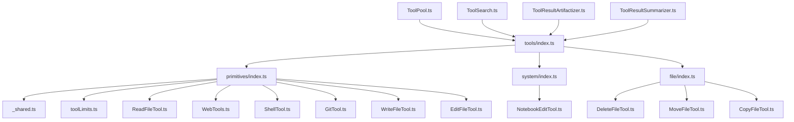
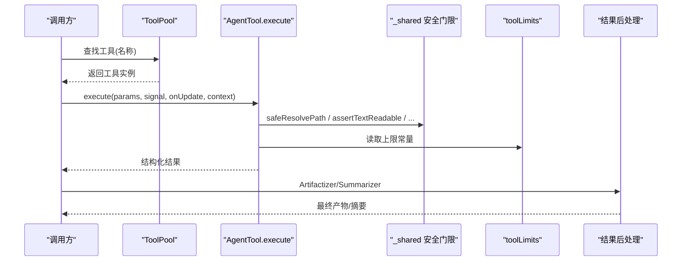
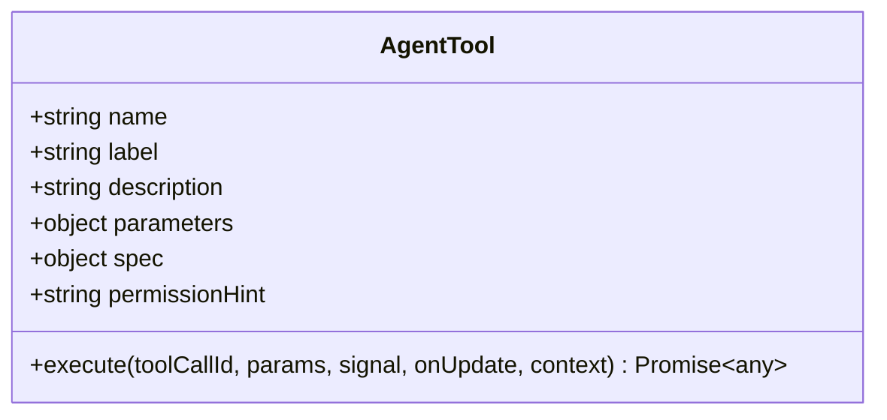
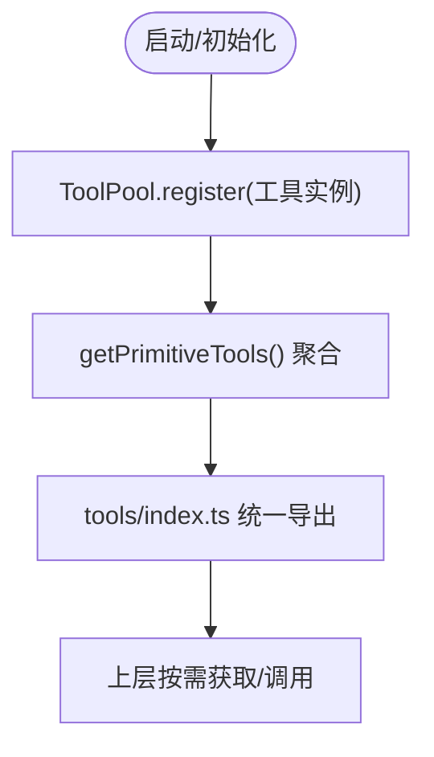
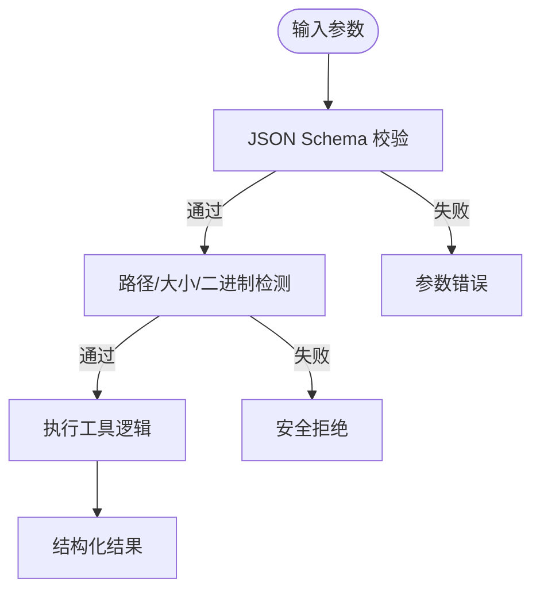
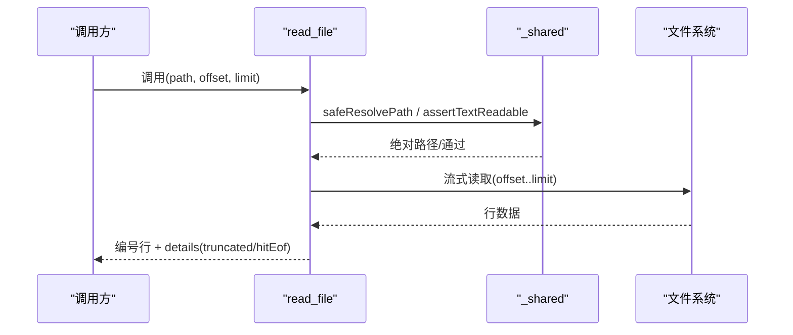
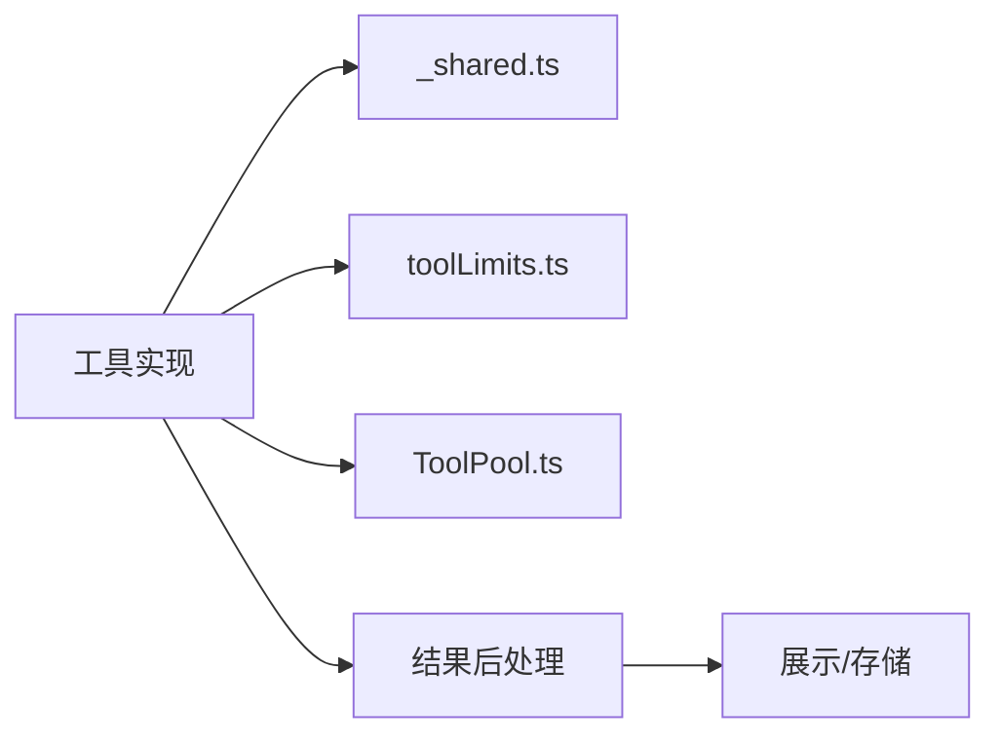

# 工具开发指南

<cite>
**本文引用的文件**
- [README.md](file://README.md)
- [AgentTool.ts](file://src/main/agent-runtime/agent/AgentTool.ts)
- [tools/index.ts](file://src/main/agent-runtime/tools/index.ts)
- [ToolPool.ts](file://src/main/agent-runtime/tools/ToolPool.ts)
- [primitives/index.ts](file://src/main/agent-runtime/tools/primitives/index.ts)
- [_shared.ts](file://src/main/agent-runtime/tools/primitives/_shared.ts)
- [toolLimits.ts](file://src/main/agent-runtime/tools/primitives/toolLimits.ts)
- [ReadFileTool.ts](file://src/main/agent-runtime/tools/primitives/ReadFileTool.ts)
- [WebTools.ts](file://src/main/agent-runtime/tools/primitives/WebTools.ts)
- [ShellTool.ts](file://src/main/agent-runtime/tools/primitives/ShellTool.ts)
- [GitTool.ts](file://src/main/agent-runtime/tools/primitives/GitTool.ts)
- [WriteFileTool.ts](file://src/main/agent-runtime/tools/primitives/WriteFileTool.ts)
- [EditFileTool.ts](file://src/main/agent-runtime/tools/primitives/EditFileTool.ts)
- [DeleteFileTool.ts](file://src/main/agent-runtime/tools/file/DeleteFileTool.ts)
- [MoveFileTool.ts](file://src/main/agent-runtime/tools/file/MoveFileTool.ts)
- [CopyFileTool.ts](file://src/main/agent-runtime/tools/file/CopyFileTool.ts)
- [NotebookEditTool.ts](file://src/main/agent-runtime/tools/system/NotebookEditTool.ts)
- [RdcNativeProtocol.ts](file://src/main/tools/RdcNativeProtocol.ts)
- [RdcExecutionReceipts.ts](file://src/main/tools/RdcExecutionReceipts.ts)
- [RdcShellActionService.ts](file://src/main/tools/RdcShellActionService.ts)
- [executeRdcShell.ts](file://src/main/tools/executeRdcShell.ts)
- [ToolResultArtifactizer.ts](file://src/main/agent-runtime/tools/ToolResultArtifactizer.ts)
- [ToolResultSummarizer.ts](file://src/main/agent-runtime/tools/ToolResultSummarizer.ts)
- [ToolSearch.ts](file://src/main/agent-runtime/tools/ToolSearch.ts)
- [permissions.md](file://docs/contracts/permissions.md)
</cite>

## 目录
1. [简介](#简介)
2. [项目结构](#项目结构)
3. [核心组件](#核心组件)
4. [架构总览](#架构总览)
5. [详细组件分析](#详细组件分析)
6. [依赖关系分析](#依赖关系分析)
7. [性能考量](#性能考量)
8. [故障排查指南](#故障排查指南)
9. [结论](#结论)
10. [附录](#附录)

## 简介
本指南面向在 RDC-Agent 中开发“工具”的工程师，覆盖工具接口规范、参数校验、错误处理与结果格式化；说明工具注册机制、权限模型、生命周期管理与测试方法；提供常见工具类型（文件操作、网络请求、外部进程调用）的实现模式、调试技巧与性能优化建议。读者无需深入底层即可按图索骥完成高质量工具开发与集成。

## 项目结构
RDC-Agent 的工具子系统位于主进程的 agent-runtime 下，采用分层组织：
- 统一入口与导出：tools/index.ts
- 基础能力集合：tools/primitives/*（文件、搜索、代码解释器、Web、Shell、Git 等）
- 系统级工具：tools/system/*（如 Notebook 编辑）
- 文件类工具：tools/file/*（删除、移动、复制）
- 工具池与元数据：ToolPool.ts、ToolSearch.ts
- 结果后处理：ToolResultArtifactizer.ts、ToolResultSummarizer.ts
- 外部能力桥接：src/main/tools/*（rdc-tool CLI、Shell Action、执行回执等）

图表来源
- [tools/index.ts:1-12](file://src/main/agent-runtime/tools/index.ts#L1-L12)
- [primitives/index.ts:1-60](file://src/main/agent-runtime/tools/primitives/index.ts#L1-L60)
- [_shared.ts:1-469](file://src/main/agent-runtime/tools/primitives/_shared.ts#L1-L469)
- [toolLimits.ts:1-49](file://src/main/agent-runtime/tools/primitives/toolLimits.ts#L1-L49)
- [ToolPool.ts:1-38](file://src/main/agent-runtime/tools/ToolPool.ts#L1-L38)
- [ToolSearch.ts:1-200](file://src/main/agent-runtime/tools/ToolSearch.ts#L1-L200)
- [ToolResultArtifactizer.ts:1-200](file://src/main/agent-runtime/tools/ToolResultArtifactizer.ts#L1-L200)
- [ToolResultSummarizer.ts:1-200](file://src/main/agent-runtime/tools/ToolResultSummarizer.ts#L1-L200)

章节来源
- [README.md:1-90](file://README.md#L1-L90)
- [tools/index.ts:1-12](file://src/main/agent-runtime/tools/index.ts#L1-L12)

## 核心组件
- AgentTool 接口：定义工具的名称、标签、描述、参数 Schema、规格元信息（只读/并发安全/破坏性/副作用/分类/是否需要审批）、权限提示以及 execute 执行函数。
- ToolPool：工具实例缓存池，避免重复创建有状态工具，支持注册、获取、枚举与清理。
- primitives 工厂：集中暴露所有内置 primitive 工具，并提供 getPrimitiveTools 聚合列表。
- 共享安全与限制：路径解析、符号链接拒绝、大小限制、输出截断、二进制检测等。
- 结果后处理：将工具结果转换为可展示/可归档的产物或摘要。

章节来源
- [AgentTool.ts:1-200](file://src/main/agent-runtime/agent/AgentTool.ts#L1-L200)
- [ToolPool.ts:1-38](file://src/main/agent-runtime/tools/ToolPool.ts#L1-L38)
- [primitives/index.ts:1-60](file://src/main/agent-runtime/tools/primitives/index.ts#L1-L60)
- [_shared.ts:1-469](file://src/main/agent-runtime/tools/primitives/_shared.ts#L1-L469)
- [toolLimits.ts:1-49](file://src/main/agent-runtime/tools/primitives/toolLimits.ts#L1-L49)
- [ToolResultArtifactizer.ts:1-200](file://src/main/agent-runtime/tools/ToolResultArtifactizer.ts#L1-L200)
- [ToolResultSummarizer.ts:1-200](file://src/main/agent-runtime/tools/ToolResultSummarizer.ts#L1-L200)

## 架构总览
工具从上层被调度执行，经过参数校验与安全门禁，进入具体实现，最终产出结构化结果并进入后处理管线。

图表来源
- [ToolPool.ts:1-38](file://src/main/agent-runtime/tools/ToolPool.ts#L1-L38)
- [ReadFileTool.ts:1-136](file://src/main/agent-runtime/tools/primitives/ReadFileTool.ts#L1-L136)
- [_shared.ts:1-469](file://src/main/agent-runtime/tools/primitives/_shared.ts#L1-L469)
- [toolLimits.ts:1-49](file://src/main/agent-runtime/tools/primitives/toolLimits.ts#L1-L49)
- [ToolResultArtifactizer.ts:1-200](file://src/main/agent-runtime/tools/ToolResultArtifactizer.ts#L1-L200)
- [ToolResultSummarizer.ts:1-200](file://src/main/agent-runtime/tools/ToolResultSummarizer.ts#L1-L200)

## 详细组件分析

### 工具接口与元数据规范
- 名称与标识：name、label、description 用于 UI 与检索。
- 参数 Schema：使用 JSON Schema 风格 properties/required/type/description，便于前端生成表单与运行时校验。
- 规格 spec：isReadOnly、isConcurrencySafe、isDestructive、sideEffect、category、requiresApproval，决定权限策略与执行约束。
- 权限提示 permissionHint：为上游权限系统提供可读提示。
- 执行签名：execute(toolCallId, params, signal, onUpdate, context)，支持取消信号、增量更新与工作上下文。

图表来源
- [AgentTool.ts:1-200](file://src/main/agent-runtime/agent/AgentTool.ts#L1-L200)

章节来源
- [AgentTool.ts:1-200](file://src/main/agent-runtime/agent/AgentTool.ts#L1-L200)

### 工具注册与发现
- ToolPool 提供注册与查询，避免重复创建有状态工具。
- primitives/index.ts 通过 getPrimitiveTools 聚合全部内置工具，供上层一次性注入。
- tools/index.ts 作为统一出口，对外暴露 primitives、file、system 及任务工具工厂。

图表来源
- [ToolPool.ts:1-38](file://src/main/agent-runtime/tools/ToolPool.ts#L1-L38)
- [primitives/index.ts:1-60](file://src/main/agent-runtime/tools/primitives/index.ts#L1-L60)
- [tools/index.ts:1-12](file://src/main/agent-runtime/tools/index.ts#L1-L12)

章节来源
- [ToolPool.ts:1-38](file://src/main/agent-runtime/tools/ToolPool.ts#L1-L38)
- [primitives/index.ts:1-60](file://src/main/agent-runtime/tools/primitives/index.ts#L1-L60)
- [tools/index.ts:1-12](file://src/main/agent-runtime/tools/index.ts#L1-L12)

### 权限模型与执行约束
- 基于 spec 字段控制：只读/可并发/是否破坏性/副作用类别/是否需要审批。
- 结合 _shared 的路径白名单、符号链接拒绝、敏感目录保护等，形成“最小权限+默认拒绝”的安全基线。
- 对于需要变更工作区内容的工具，要求显式指定 project root，禁止隐式写入进程当前目录。

章节来源
- [AgentTool.ts:1-200](file://src/main/agent-runtime/agent/AgentTool.ts#L1-L200)
- [_shared.ts:1-469](file://src/main/agent-runtime/tools/primitives/_shared.ts#L1-L469)
- [toolLimits.ts:1-49](file://src/main/agent-runtime/tools/primitives/toolLimits.ts#L1-L49)
- [permissions.md:1-200](file://docs/contracts/permissions.md#L1-L200)

### 参数验证与错误处理
- 参数校验：由上层根据 parameters 进行 JSON Schema 校验；工具内部对业务参数做二次校验（如 offset/limit 范围）。
- 安全校验：safeResolvePath 确保目标在 workspace 内且无符号链接逃逸；assertTextReadable 拒绝二进制/超大文件；assertNotSensitiveDeletePath 保护 .git 等敏感目录。
- 错误形式：抛出 Error，由上层捕获并转为工具错误结果；部分场景返回 details 标记 truncated/hitEof 等。

图表来源
- [ReadFileTool.ts:1-136](file://src/main/agent-runtime/tools/primitives/ReadFileTool.ts#L1-L136)
- [_shared.ts:1-469](file://src/main/agent-runtime/tools/primitives/_shared.ts#L1-L469)
- [toolLimits.ts:1-49](file://src/main/agent-runtime/tools/primitives/toolLimits.ts#L1-L49)

章节来源
- [ReadFileTool.ts:1-136](file://src/main/agent-runtime/tools/primitives/ReadFileTool.ts#L1-L136)
- [_shared.ts:1-469](file://src/main/agent-runtime/tools/primitives/_shared.ts#L1-L469)

### 结果格式化与产物化
- 文本输出：read_file 等工具以编号行方式返回，并通过 truncateOutput 限制字节数。
- 产物化：ToolResultArtifactizer 将结果转为可持久化的产物（如图片、报告片段），便于后续展示与审计。
- 摘要化：ToolResultSummarizer 对长输出进行摘要，降低下游负载。

章节来源
- [ReadFileTool.ts:1-136](file://src/main/agent-runtime/tools/primitives/ReadFileTool.ts#L1-L136)
- [ToolResultArtifactizer.ts:1-200](file://src/main/agent-runtime/tools/ToolResultArtifactizer.ts#L1-L200)
- [ToolResultSummarizer.ts:1-200](file://src/main/agent-runtime/tools/ToolResultSummarizer.ts#L1-L200)

### 常见工具类型实现模式

#### 文件操作工具
- 读取：read_file 支持 offset/limit 分段读取，流式避免整文件入内存；二进制与 .rdc 拒绝。
- 写入：write_file/edit_file 使用原子写（临时文件 + fsync + rename），拒绝符号链接路径，保障一致性。
- 删除/移动/复制：遵循大小限制与路径白名单，保护敏感目录。

图表来源
- [ReadFileTool.ts:1-136](file://src/main/agent-runtime/tools/primitives/ReadFileTool.ts#L1-L136)
- [_shared.ts:1-469](file://src/main/agent-runtime/tools/primitives/_shared.ts#L1-L469)

章节来源
- [ReadFileTool.ts:1-136](file://src/main/agent-runtime/tools/primitives/ReadFileTool.ts#L1-L136)
- [WriteFileTool.ts:1-200](file://src/main/agent-runtime/tools/primitives/WriteFileTool.ts#L1-L200)
- [EditFileTool.ts:1-200](file://src/main/agent-runtime/tools/primitives/EditFileTool.ts#L1-L200)
- [DeleteFileTool.ts:1-200](file://src/main/agent-runtime/tools/file/DeleteFileTool.ts#L1-L200)
- [MoveFileTool.ts:1-200](file://src/main/agent-runtime/tools/file/MoveFileTool.ts#L1-L200)
- [CopyFileTool.ts:1-200](file://src/main/agent-runtime/tools/file/CopyFileTool.ts#L1-L200)

#### 网络请求工具
- web_fetch/web_search 提供受限的网络访问，包含响应大小上限与重定向次数限制，防止资源滥用。

章节来源
- [WebTools.ts:1-200](file://src/main/agent-runtime/tools/primitives/WebTools.ts#L1-L200)
- [toolLimits.ts:1-49](file://src/main/agent-runtime/tools/primitives/toolLimits.ts#L1-L49)

#### Shell 与 Git 工具
- shell_tool：执行命令受超时与输出上限限制，支持取消信号；输出经截断。
- git_*：封装常用 Git 操作，限制输出与超时，保证交互稳定性。

章节来源
- [ShellTool.ts:1-200](file://src/main/agent-runtime/tools/primitives/ShellTool.ts#L1-L200)
- [GitTool.ts:1-200](file://src/main/agent-runtime/tools/primitives/GitTool.ts#L1-L200)
- [toolLimits.ts:1-49](file://src/main/agent-runtime/tools/primitives/toolLimits.ts#L1-L49)

#### 外部进程与 RDC 能力
- RdcNativeProtocol/RdcExecutionReceipts：定义与外部 RDC 工具的协议与执行回执结构。
- RdcShellActionService/executeRdcShell：封装 Shell Action 与 rdc-tool CLI 调用，统一错误与日志。

章节来源
- [RdcNativeProtocol.ts:1-200](file://src/main/tools/RdcNativeProtocol.ts#L1-L200)
- [RdcExecutionReceipts.ts:1-200](file://src/main/tools/RdcExecutionReceipts.ts#L1-L200)
- [RdcShellActionService.ts:1-200](file://src/main/tools/RdcShellActionService.ts#L1-L200)
- [executeRdcShell.ts:1-200](file://src/main/tools/executeRdcShell.ts#L1-L200)

### 生命周期管理
- 工具实例：ToolPool 负责生命周期内的复用与清理，避免连接泄漏。
- 执行期：execute 接收 AbortSignal，支持中断；onUpdate 可用于流式进度上报。
- 资源释放：文件句柄、流、子进程需在 finally/清理回调中释放。

章节来源
- [ToolPool.ts:1-38](file://src/main/agent-runtime/tools/ToolPool.ts#L1-L38)
- [ReadFileTool.ts:1-136](file://src/main/agent-runtime/tools/primitives/ReadFileTool.ts#L1-L136)

### 测试方法
- 单元测试：各工具均提供 *.test.ts，覆盖边界条件（空路径、越界、二进制、大小限制、超时、取消）。
- 契约测试：通过脚本检查工具能力与覆盖率，确保新增工具符合规范。
- 端到端：结合 rdc-tool CLI 与 Shell Action 的集成测试，验证外部进程调用链路。

章节来源
- [ReadFileTool.test.ts:1-200](file://src/main/agent-runtime/tools/primitives/ReadFileTool.test.ts#L1-L200)
- [WebTools.test.ts:1-200](file://src/main/agent-runtime/tools/primitives/WebTools.test.ts#L1-L200)
- [ShellTool.test.ts:1-200](file://src/main/agent-runtime/tools/primitives/ShellTool.test.ts#L1-L200)
- [GitTool.test.ts:1-200](file://src/main/agent-runtime/tools/primitives/GitTool.test.ts#L1-L200)

## 依赖关系分析
- 工具实现强依赖 _shared 提供的路径与大小安全能力，以及 toolLimits 中的硬上限。
- 工具注册与发现依赖 ToolPool 与 primitives/index.ts 的统一聚合。
- 结果后处理依赖 Artifactizer/Summarizer，与上层展示/存储解耦。
- 外部能力依赖 src/main/tools 下的协议与服务，保持工具层稳定。

图表来源
- [_shared.ts:1-469](file://src/main/agent-runtime/tools/primitives/_shared.ts#L1-L469)
- [toolLimits.ts:1-49](file://src/main/agent-runtime/tools/primitives/toolLimits.ts#L1-L49)
- [ToolPool.ts:1-38](file://src/main/agent-runtime/tools/ToolPool.ts#L1-L38)
- [ToolResultArtifactizer.ts:1-200](file://src/main/agent-runtime/tools/ToolResultArtifactizer.ts#L1-L200)
- [ToolResultSummarizer.ts:1-200](file://src/main/agent-runtime/tools/ToolResultSummarizer.ts#L1-L200)

章节来源
- [_shared.ts:1-469](file://src/main/agent-runtime/tools/primitives/_shared.ts#L1-L469)
- [toolLimits.ts:1-49](file://src/main/agent-runtime/tools/primitives/toolLimits.ts#L1-L49)
- [ToolPool.ts:1-38](file://src/main/agent-runtime/tools/ToolPool.ts#L1-L38)
- [ToolResultArtifactizer.ts:1-200](file://src/main/agent-runtime/tools/ToolResultArtifactizer.ts#L1-L200)
- [ToolResultSummarizer.ts:1-200](file://src/main/agent-runtime/tools/ToolResultSummarizer.ts#L1-L200)

## 性能考量
- 流式读取：read_file 使用 readline 流式读取，避免大文件内存占用。
- 输出截断：truncateOutput 按 UTF-8 字节上限裁剪，减少传输与渲染压力。
- 硬上限：toolLimits 统一限制各类操作的输出与超时，防止资源耗尽。
- 原子写：write_file 使用临时文件 + fsync + rename，降低损坏风险与回滚成本。
- 并发安全：spec.isConcurrencySafe 指示工具可并发调用，避免锁竞争。

章节来源
- [ReadFileTool.ts:1-136](file://src/main/agent-runtime/tools/primitives/ReadFileTool.ts#L1-L136)
- [_shared.ts:1-469](file://src/main/agent-runtime/tools/primitives/_shared.ts#L1-L469)
- [toolLimits.ts:1-49](file://src/main/agent-runtime/tools/primitives/toolLimits.ts#L1-L49)

## 故障排查指南
- 路径越界：检查 safeResolvePath 与 isWithinRootAllowingAliases，确认 workspace 根与临时允许根配置。
- 符号链接拒绝：若出现 SYMLINK_PATH_REJECTED，需调整目标路径或解除中间符号链接。
- 二进制拒绝：read_file 拒绝 .rdc 与含 NUL/高控制字符的文件，改用专用工具或二进制读取流程。
- 大小超限：超出 TEXT_FILE_MAX_BYTES/WRITE_FILE_MAX_CONTENT_BYTES 等限制时，拆分或流式处理。
- 超时/取消：shell/git/web 等工具支持超时与取消，检查信号传递与 onAbort 分支。
- 外部进程：rdc-tool CLI/Shell Action 调用失败时，查看回执结构与错误码，定位权限或环境问题。

章节来源
- [_shared.ts:1-469](file://src/main/agent-runtime/tools/primitives/_shared.ts#L1-L469)
- [toolLimits.ts:1-49](file://src/main/agent-runtime/tools/primitives/toolLimits.ts#L1-L49)
- [RdcExecutionReceipts.ts:1-200](file://src/main/tools/RdcExecutionReceipts.ts#L1-L200)
- [RdcShellActionService.ts:1-200](file://src/main/tools/RdcShellActionService.ts#L1-L200)

## 结论
RDC-Agent 的工具体系以 AgentTool 为核心，配合 ToolPool 的生命周期管理、严格的安全门禁与统一的限制策略，提供了可扩展、可审计、高性能的工具生态。遵循本指南的接口规范、权限模型与最佳实践，可快速实现文件、网络、外部进程等常见工具类型，并通过完善的测试与后处理管线保障质量与可维护性。

## 附录

### 工具开发模板（步骤清单）
- 定义工具元数据：name、label、description、parameters(JSON Schema)、spec、permissionHint。
- 实现 execute：参数校验 → 安全门禁 → 核心逻辑 → 结构化结果。
- 使用共享能力：safeResolvePath、assertTextReadable、truncateOutput、withTemporaryPathAccess。
- 遵守限制：引用 toolLimits 中的硬上限，避免绕过。
- 注册与导出：在 primitives/index.ts 或对应模块 index.ts 中导出，必要时加入 getPrimitiveTools。
- 编写测试：覆盖正常路径、边界条件、错误分支与取消场景。
- 集成验证：结合 rdc-tool CLI/Shell Action 进行端到端测试。

章节来源
- [AgentTool.ts:1-200](file://src/main/agent-runtime/agent/AgentTool.ts#L1-L200)
- [primitives/index.ts:1-60](file://src/main/agent-runtime/tools/primitives/index.ts#L1-L60)
- [_shared.ts:1-469](file://src/main/agent-runtime/tools/primitives/_shared.ts#L1-L469)
- [toolLimits.ts:1-49](file://src/main/agent-runtime/tools/primitives/toolLimits.ts#L1-L49)

### 调试技巧
- 启用增量更新：在 execute 中使用 onUpdate 推送中间结果，便于观察长耗时任务进展。
- 打印上下文：记录 toolCallId、workspace root、实际解析路径，便于复现问题。
- 模拟外部依赖：对 Web/Shell/RDC 调用使用桩或沙箱环境，隔离不稳定因素。
- 逐步放宽限制：在测试环境中临时提高限制，定位瓶颈后再恢复生产限制。

章节来源
- [ReadFileTool.ts:1-136](file://src/main/agent-runtime/tools/primitives/ReadFileTool.ts#L1-L136)
- [WebTools.ts:1-200](file://src/main/agent-runtime/tools/primitives/WebTools.ts#L1-L200)
- [ShellTool.ts:1-200](file://src/main/agent-runtime/tools/primitives/ShellTool.ts#L1-L200)
- [RdcShellActionService.ts:1-200](file://src/main/tools/RdcShellActionService.ts#L1-L200)

### 性能优化建议
- 优先流式 IO：大文件读取/写入使用流与缓冲，避免整块加载。
- 合理设置 limit/offset：减少不必要的数据传输与渲染。
- 利用并发安全：对纯计算型工具开启并发，提升吞吐。
- 结果摘要：对超长输出使用 Summarizer 生成摘要，降低 UI 与存储压力。
- 外部调用批量化：合并多次小请求为批量，减少握手与序列化开销。

章节来源
- [toolLimits.ts:1-49](file://src/main/agent-runtime/tools/primitives/toolLimits.ts#L1-L49)
- [ToolResultSummarizer.ts:1-200](file://src/main/agent-runtime/tools/ToolResultSummarizer.ts#L1-L200)
- [ReadFileTool.ts:1-136](file://src/main/agent-runtime/tools/primitives/ReadFileTool.ts#L1-L136)