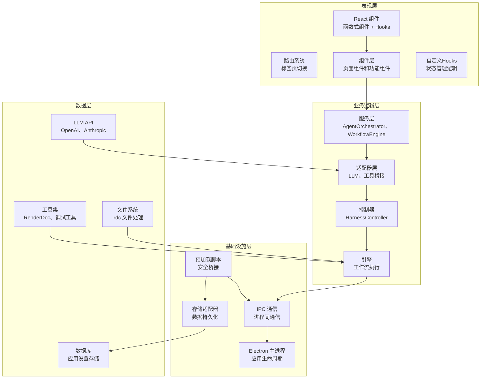

# Electron + React + TypeScript 桌面应用架构

<cite>
**本文档引用的文件**
- [src/renderer/App.tsx](file://src/renderer/App.tsx)
- [src/renderer/main.tsx](file://src/renderer/main.tsx)
- [src/renderer/index.html](file://src/renderer/index.html)
- [src/renderer/pages/Debugger/index.tsx](file://src/renderer/pages/Debugger/index.tsx)
- [src/renderer/pages/Analyzer/index.tsx](file://src/renderer/pages/Analyzer/index.tsx)
- [src/renderer/pages/Optimizer/index.tsx](file://src/renderer/pages/Optimizer/index.tsx)
- [src/renderer/components/AgentChat/index.tsx](file://src/renderer/components/AgentChat/index.tsx)
- [src/renderer/components/ArtifactViewer/index.tsx](file://src/renderer/components/ArtifactViewer/index.tsx)
- [src/renderer/components/EvidencePanel/index.tsx](file://src/renderer/components/EvidencePanel/index.tsx)
- [src/renderer/components/WorkflowPanel/index.tsx](file://src/renderer/components/WorkflowPanel/index.tsx)
- [src/main/index.ts](file://src/main/index.ts)
- [src/preload/index.ts](file://src/preload/index.ts)
- [electron.vite.config.ts](file://electron.vite.config.ts)
- [package.json](file://package.json)
- [src/types/electron.d.ts](file://src/types/electron.d.ts)
- [src/shared/constants/agents.ts](file://src/shared/constants/agents.ts)
- [src/shared/types/agent.ts](file://src/shared/types/agent.ts)
- [src/shared/types/workflow.ts](file://src/shared/types/workflow.ts)
- [src/shared/types/evidence.ts](file://src/shared/types/evidence.ts)
- [src/shared/types/tool.ts](file://src/shared/types/tool.ts)
- [src/shared/types/llm.ts](file://src/shared/types/llm.ts)
- [src/main/ipc/handlers.ts](file://src/main/ipc/handlers.ts)
- [src/main/services/AgentOrchestrator.ts](file://src/main/services/AgentOrchestrator.ts)
- [src/main/services/HarnessController.ts](file://src/main/services/HarnessController.ts)
- [src/main/services/StorageAdapter.ts](file://src/main/services/StorageAdapter.ts)
- [src/main/services/ToolBridge.ts](file://src/main/services/ToolBridge.ts)
- [src/main/services/WorkflowEngine.ts](file://src/main/services/WorkflowEngine.ts)
- [src/main/adapters/providers/LlmAdapter.ts](file://src/main/adapters/providers/LlmAdapter.ts)
</cite>

## 目录
1. [简介](#简介)
2. [项目结构](#项目结构)
3. [核心组件](#核心组件)
4. [架构总览](#架构总览)
5. [详细组件分析](#详细组件分析)
6. [Electron 主进程架构](#electron-主进程架构)
7. [预加载脚本与安全桥接](#预加载脚本与安全桥接)
8. [状态管理与数据流](#状态管理与数据流)
9. [依赖关系分析](#依赖关系分析)
10. [性能考虑](#性能考虑)
11. [故障排除指南](#故障排除指南)
12. [结论](#结论)
13. [附录](#附录)

## 简介
本项目是一个基于 Electron + React + TypeScript 的现代化桌面应用，专为 RenderDoc 调试代理而设计。应用采用前后端分离的架构模式，通过 Vite 构建工具链实现快速开发和高效构建。核心功能包括：
- **React 前端界面**：采用函数式组件和 Hooks 模式，提供现代化的用户界面
- **Electron 主进程**：管理应用生命周期、窗口管理和系统级功能
- **预加载脚本**：建立安全的渲染进程与主进程通信桥梁
- **微服务架构**：AgentOrchestrator、WorkflowEngine 等服务模块化设计
- **类型安全**：完整的 TypeScript 类型定义确保编译期安全

该架构强调模块化、可维护性和跨平台兼容性，适合构建复杂的桌面调试工具。

## 项目结构
项目采用清晰的分层目录组织方式，主要目录说明如下：
- **src/renderer**：React 前端应用源码，包含页面组件和共享组件
- **src/main**：Electron 主进程代码，包含服务层和 IPC 处理器
- **src/preload**：预加载脚本，提供安全的 API 暴露机制
- **src/shared**：共享类型定义和常量，确保前后端一致性
- **src/types**：TypeScript 类型声明文件
- **electron.vite.config.ts**：Electron-Vite 构建配置
- **package.json**：项目依赖和构建脚本配置

```mermaid
graph TB
subgraph "前端层"
RENDERER["src/renderer<br/>React 应用"]
PAGES["pages/<br/>页面组件"]
COMPONENTS["components/<br/>共享组件"]
HOOKS["hooks/<br/>自定义Hooks"]
STORES["stores/<br/>状态管理"]
STYLES["styles/<br/>样式文件"]
end
subgraph "主进程层"
MAIN["src/main<br/>Electron 主进程"]
SERVICES["services/<br/>业务服务"]
ADAPTERS["adapters/<br/>适配器层"]
IPC["ipc/<br/>IPC 处理器"]
end
subgraph "预加载层"
PRELOAD["src/preload<br/>预加载脚本"]
TYPES["types/<br/>类型定义"]
end
subgraph "共享层"
SHARED["src/shared<br/>共享资源"]
CONSTANTS["constants/<br/>常量定义"]
TYPES["types/<br/>类型定义"]
UTILS["utils/<br/>工具函数"]
end
subgraph "构建配置"
CONFIG["electron.vite.config.ts<br/>构建配置"]
PACKAGE["package.json<br/>依赖管理"]
HTML["src/renderer/index.html<br/>HTML 入口"]
END
RENDERER --> PAGES
RENDERER --> COMPONENTS
RENDERER --> HOOKS
RENDERER --> STORES
RENDERER --> STYLES
MAIN --> SERVICES
MAIN --> ADAPTERS
MAIN --> IPC
PRELOAD --> TYPES
SHARED --> CONSTANTS
SHARED --> TYPES
SHARED --> UTILS
CONFIG --> RENDERER
CONFIG --> MAIN
CONFIG --> PRELOAD
PACKAGE --> CONFIG
HTML --> RENDERER
```

**图表来源**
- [electron.vite.config.ts:1-54](file://electron.vite.config.ts#L1-L54)
- [package.json:1-67](file://package.json#L1-L67)
- [src/renderer/index.html:1-14](file://src/renderer/index.html#L1-L14)

**章节来源**
- [electron.vite.config.ts:1-54](file://electron.vite.config.ts#L1-L54)
- [package.json:1-67](file://package.json#L1-L67)

## 核心组件
本节深入分析应用的核心组件及其设计理念和实现细节。

### App 根组件
App 组件作为应用的根组件，承担以下职责：
- **标签页管理**：通过 useState 管理三个主要标签页（debugger、analyzer、optimizer）
- **应用初始化**：在 useEffect 中检查 Electron API 可用性并加载设置
- **状态管理**：管理应用加载状态和活动标签页状态
- **UI 布局**：提供完整的应用头部、内容区和底部状态栏布局

组件采用 React.FC 函数式组件模式，使用 TypeScript 类型定义确保类型安全。标签栏按钮使用条件禁用和提示信息，体现了渐进式功能发布策略。

### React 组件架构
应用采用组件化设计模式，主要组件包括：
- **页面级组件**：DebuggerPage、AnalyzerPage、OptimizerPage
- **功能组件**：AgentChat、EvidencePanel、ArtifactViewer、WorkflowPanel
- **共享组件**：Button、Input、Modal 等基础 UI 组件

每个组件都遵循单一职责原则，通过 Props 和事件回调实现组件间通信。

**章节来源**
- [src/renderer/App.tsx:9-112](file://src/renderer/App.tsx#L9-L112)
- [src/renderer/main.tsx:1-11](file://src/renderer/main.tsx#L1-L11)

## 架构总览
应用采用三层架构设计，各层职责清晰分离：



**图表来源**
- [src/main/index.ts:1-209](file://src/main/index.ts#L1-L209)
- [src/preload/index.ts:1-131](file://src/preload/index.ts#L1-L131)
- [src/renderer/App.tsx:6-112](file://src/renderer/App.tsx#L6-L112)

## 详细组件分析

### Debugger 页面组件分析
DebuggerPage 是应用的核心页面，实现复杂的工作流管理：
- **文件处理**：支持拖拽上传和文件选择两种 .rdc 文件导入方式
- **工作流启动**：通过 Electron API 启动调试会话
- **状态管理**：使用 useState 管理欢迎界面和调试界面的切换
- **组件组合**：整合 WorkflowPanel、AgentChat、EvidencePanel、ArtifactViewer

组件采用 useCallback 优化性能，避免不必要的重渲染。文件处理逻辑包含类型检查和错误处理。

**章节来源**
- [src/renderer/pages/Debugger/index.tsx:10-119](file://src/renderer/pages/Debugger/index.tsx#L10-L119)

### AgentChat 组件分析
AgentChat 组件实现智能代理对话功能：
- **消息管理**：使用 useState 管理对话历史和输入状态
- **实时通信**：通过 window.electronAPI.on 监听代理消息事件
- **打字指示**：实现智能打字状态指示器
- **键盘快捷键**：支持 Enter 键发送消息

组件设计采用响应式布局，支持滚动到底部和消息工具调用显示。

**章节来源**
- [src/renderer/components/AgentChat/index.tsx:13-155](file://src/renderer/components/AgentChat/index.tsx#L13-L155)

### 共享组件架构
应用包含多个共享组件，提供一致的用户体验：
- **EvidencePanel**：显示调试证据链和事件
- **ArtifactViewer**：可视化渲染管道工件
- **WorkflowPanel**：展示工作流状态和进度
- **AgentChat**：智能代理对话界面

每个组件都遵循统一的样式规范和交互模式，确保界面一致性。

**章节来源**
- [src/renderer/components/EvidencePanel/index.tsx](file://src/renderer/components/EvidencePanel/index.tsx)
- [src/renderer/components/ArtifactViewer/index.tsx](file://src/renderer/components/ArtifactViewer/index.tsx)
- [src/renderer/components/WorkflowPanel/index.tsx](file://src/renderer/components/WorkflowPanel/index.tsx)

## Electron 主进程架构
Electron 主进程负责应用的核心管理和系统集成：

### 主窗口管理
主进程通过 createMainWindow() 函数创建和管理主窗口：
- **窗口配置**：设置尺寸、最小尺寸、标题栏样式和背景色
- **开发模式**：自动加载 Vite 开发服务器
- **生产模式**：加载打包后的 HTML 文件
- **菜单系统**：构建完整的应用菜单，包含文件、编辑、视图、窗口、帮助菜单

### 安全策略
主进程实施严格的安全策略：
- **上下文隔离**：启用 contextIsolation 和 nodeIntegration: false
- **URL 白名单**：限制导航到受信任的 URL
- **外部链接处理**：使用默认浏览器打开外部链接
- **沙箱配置**：合理配置沙箱选项

**章节来源**
- [src/main/index.ts:23-73](file://src/main/index.ts#L23-L73)
- [src/main/index.ts:78-174](file://src/main/index.ts#L78-L174)
- [src/main/index.ts:195-203](file://src/main/index.ts#L195-L203)

## 预加载脚本与安全桥接
预加载脚本通过 contextBridge API 暴露受限的 Electron 功能：

### API 暴露策略
electronAPI 对象暴露精心设计的 API 集合：
- **平台信息**：检测操作系统类型
- **文件操作**：选择 .rdc 文件和目录
- **工作流操作**：状态查询、启动、推进阶段、回溯
- **Agent 操作**：消息发送、状态查询、配置管理
- **工具操作**：工具目录获取、执行
- **证据链操作**：事件获取和链路查询
- **LLM 操作**：配置、连接测试、模型获取
- **设置操作**：应用设置的读取和写入

### 事件系统
预加载脚本实现完整的事件监听系统：
- **有效频道验证**：防止非法事件监听
- **动态事件注册**：支持运行时事件监听
- **内存泄漏防护**：提供 off 方法移除事件监听器

**章节来源**
- [src/preload/index.ts:8-127](file://src/preload/index.ts#L8-L127)
- [src/preload/index.ts:103-123](file://src/preload/index.ts#L103-L123)

## 状态管理与数据流
应用采用多层状态管理模式：

### React 状态管理
- **组件内部状态**：使用 useState 和 useEffect 管理组件局部状态
- **回调优化**：使用 useCallback 防止不必要的重渲染
- **副作用处理**：在 useEffect 中处理异步操作和清理逻辑

### Electron 状态同步
- **IPC 通信**：通过 invoke 和 send 实现双向通信
- **事件驱动**：使用 on 监听主进程事件
- **状态推送**：主进程主动推送状态变更到渲染进程

### 类型安全的状态管理
应用使用 TypeScript 类型定义确保状态的类型安全：
- **AgentMessage**：代理消息类型
- **WorkflowState**：工作流状态类型
- **Evidence**：证据链类型
- **Tool**：工具类型

**章节来源**
- [src/renderer/components/AgentChat/index.tsx:14-45](file://src/renderer/components/AgentChat/index.tsx#L14-L45)
- [src/preload/index.ts:25-100](file://src/preload/index.ts#L25-L100)

## 依赖关系分析

### 技术栈依赖
应用采用现代化的技术栈组合：
- **前端框架**：React 18.2 + TypeScript 5.3
- **构建工具**：Vite 5.0 + Electron-Vite 2.0
- **状态管理**：Zustand 4.5（通过 hooks 实现）
- **UI 组件**：原生 React 组件
- **工具库**：UUID 9.0、YAML 2.3.4、Electron Store 8.1

### 模块依赖图
应用的模块依赖关系如下：

```mermaid
graph TB
subgraph "前端依赖"
REACT["react@18.2.0"]
REACT_DOM["react-dom@18.2.0"]
TYPES_REACT["@types/react@18.2.0"]
TYPES_REACT_DOM["@types/react-dom@18.2.0"]
TYPES_NODE["@types/node@20.11.0"]
TYPES_UUID["@types/uuid@9.0.0"]
VITE["vite@5.0.0"]
ELECTRON_VITE["electron-vite@2.0.0"]
REACT_PLUGIN["@vitejs/plugin-react@4.2.0"]
END
subgraph "应用依赖"
ELECTRON["electron@28.0.0"]
ELECTRON_STORE["electron-store@8.1.0"]
UUID["uuid@9.0.0"]
YAML["yaml@2.3.4"]
ZUSTAND["zustand@4.5.0"]
ELECTRON_BUILDER["electron-builder@24.9.1"]
END
REACT --> REACT_DOM
REACT --> TYPES_REACT
REACT_DOM --> TYPES_REACT_DOM
TYPES_REACT --> TYPES_NODE
TYPES_REACT_DOM --> TYPES_NODE
ELECTRON_VITE --> VITE
ELECTRON_VITE --> REACT_PLUGIN
ELECTRON --> ELECTRON_STORE
ELECTRON --> ELECTRON_BUILDER
```

**图表来源**
- [package.json:16-35](file://package.json#L16-L35)

### 组件间通信模式
应用采用多种组件间通信模式：
- **Props 传递**：父子组件间的数据传递
- **事件回调**：子组件向父组件传递事件
- **IPC 通信**：渲染进程与主进程间的消息传递
- **状态提升**：共享状态通过父组件管理
- **事件总线**：通过 window.electronAPI.on 实现松耦合通信

### 数据绑定最佳实践
应用实现了以下数据绑定策略：
- **单向数据流**：模板中使用 props 和 state 进行单向数据绑定
- **受控组件**：表单控件使用 value 和 onChange 实现受控绑定
- **事件处理**：使用事件处理器处理用户交互
- **类型约束**：通过 TypeScript 确保数据类型的正确性

**章节来源**
- [src/renderer/components/AgentChat/index.tsx:69-74](file://src/renderer/components/AgentChat/index.tsx#L69-L74)
- [package.json:22-35](file://package.json#L22-L35)

## 性能考虑
基于当前实现，建议关注以下性能优化点：
- **组件懒加载**：对于大型组件考虑实现懒加载
- **图片和资源优化**：压缩和格式优化静态资源
- **状态更新优化**：使用 React.memo 和 useMemo 优化重渲染
- **IPC 通信优化**：批量处理 IPC 请求，避免频繁通信
- **内存管理**：及时清理事件监听器和定时器
- **构建优化**：启用生产环境构建和代码分割
- **渲染性能**：使用 requestAnimationFrame 优化动画

## 故障排除指南
常见问题及解决方案：

### Electron 环境检测失败
- 检查 window.electronAPI 是否正确暴露
- 确认预加载脚本已正确加载
- 验证 CSP 策略配置是否允许脚本执行

### IPC 通信异常
- 确认主进程已正确注册 IPC 处理器
- 检查渲染进程中的 ipcRenderer 实例
- 验证 invoke 调用的通道名称是否正确

### React 组件渲染问题
- 检查组件的依赖数组是否正确
- 确认 useCallback 的依赖项是否完整
- 验证 TypeScript 类型定义是否正确

### 构建配置问题
- 检查 electron.vite.config.ts 配置是否正确
- 确认别名配置指向正确的目录
- 验证构建输出路径配置

**章节来源**
- [src/preload/index.ts:126-127](file://src/preload/index.ts#L126-L127)
- [src/renderer/App.tsx:17-23](file://src/renderer/App.tsx#L17-L23)
- [electron.vite.config.ts:47-51](file://electron.vite.config.ts#L47-L51)

## 结论
本项目展示了现代 Electron 桌面应用的最佳实践，通过 React + TypeScript 的组合实现了类型安全和现代化开发体验。Electron 主进程架构提供了强大的系统集成功能，预加载脚本确保了安全的 API 暴露机制。整体架构清晰、模块化程度高，为构建复杂的 RenderDoc 调试工具奠定了坚实基础。

## 附录

### 组件扩展指导原则
- **新增组件时保持一致的命名约定**：使用语义化的组件名称
- **遵循单一职责原则**：每个组件专注特定功能
- **使用 TypeScript 类型定义**：确保类型安全
- **实现标准化的生命周期管理**：使用 useEffect 和清理逻辑
- **提供适当的错误处理**：实现健壮的错误边界

### 自定义开发规范
- **文件组织**：按功能分组存放相关文件
- **样式管理**：使用 CSS Modules 或 styled-components
- **类型定义**：为所有公共接口提供 TypeScript 类型
- **测试覆盖**：为关键功能编写单元测试
- **文档编写**：为复杂组件编写使用文档

**章节来源**
- [src/renderer/components/AgentChat/index.tsx:13-155](file://src/renderer/components/AgentChat/index.tsx#L13-L155)
- [src/main/index.ts:177-186](file://src/main/index.ts#L177-L186)