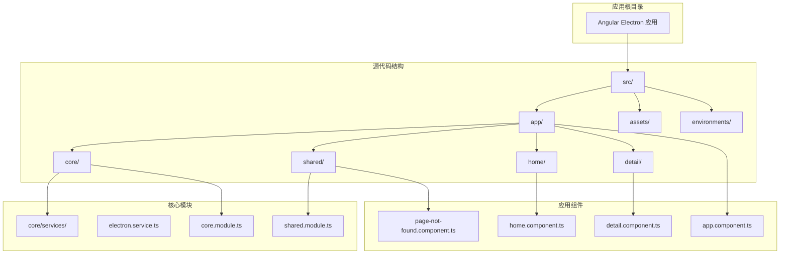
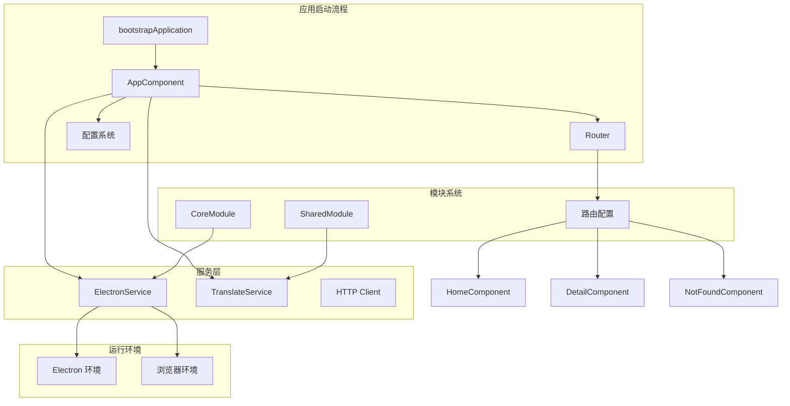
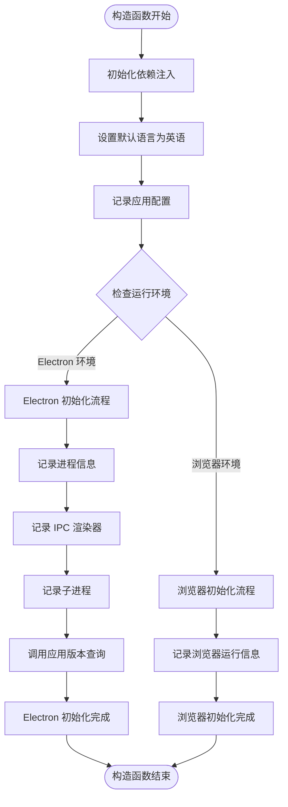
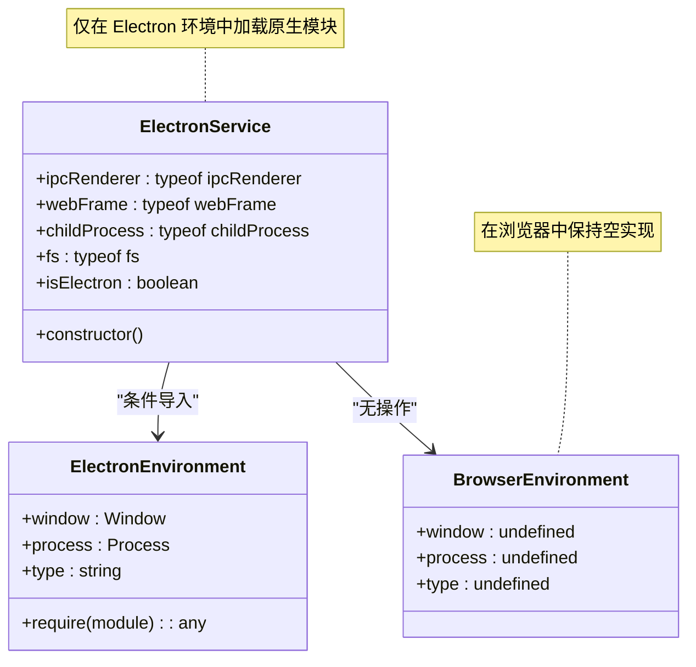
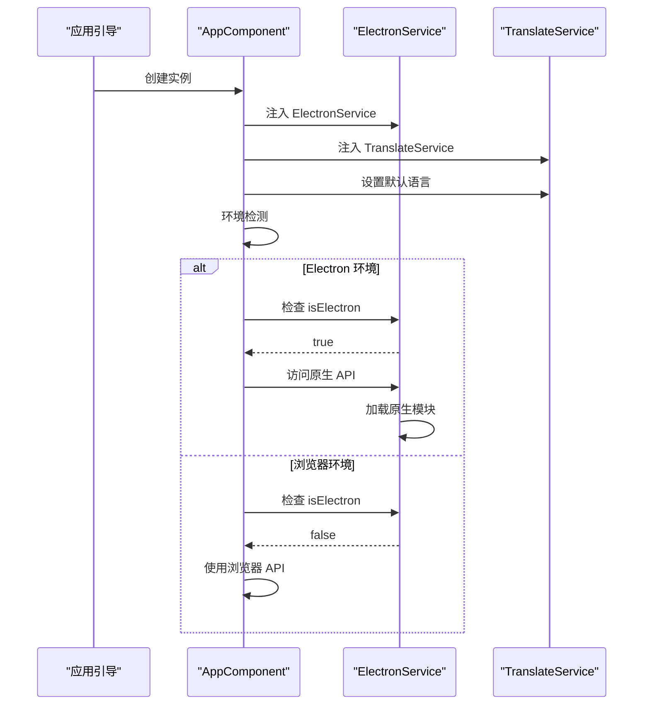
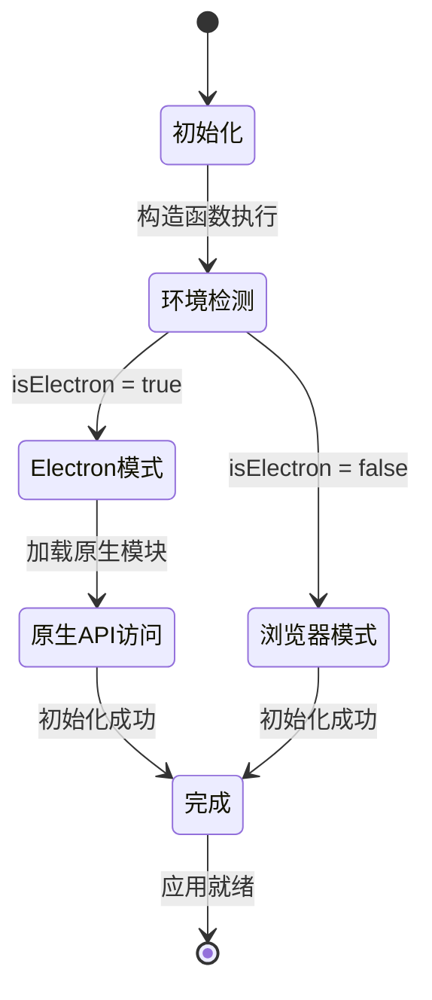
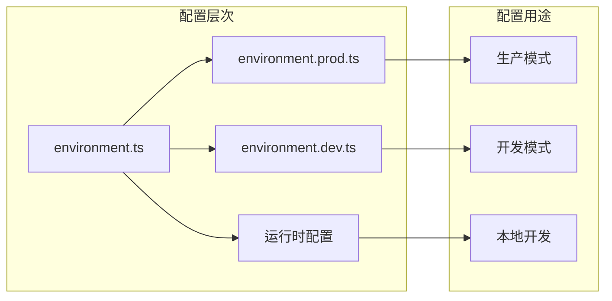
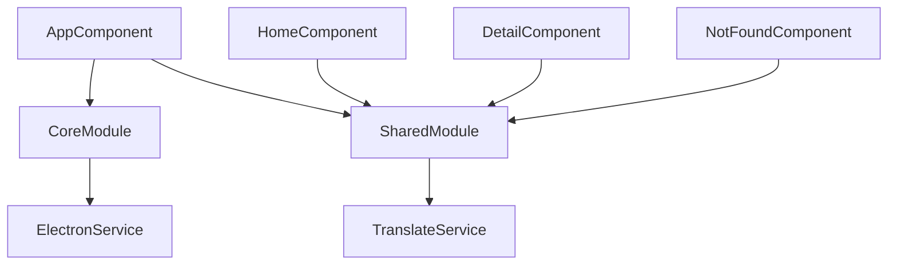

# 根组件 AppComponent

<cite>
**本文档引用的文件**
- [src/app/app.component.ts](file://src/app/app.component.ts)
- [src/app/app.component.html](file://src/app/app.component.html)
- [src/app/app.component.scss](file://src/app/app.component.scss)
- [src/app/core/services/electron/electron.service.ts](file://src/app/core/services/electron/electron.service.ts)
- [src/environments/environment.ts](file://src/environments/environment.ts)
- [src/main.ts](file://src/main.ts)
- [angular.json](file://angular.json)
- [src/app/core/core.module.ts](file://src/app/core/core.module.ts)
- [src/app/shared/shared.module.ts](file://src/app/shared/shared.module.ts)
- [src/app/home/home.component.ts](file://src/app/home/home.component.ts)
- [src/app/detail/detail.component.ts](file://src/app/detail/detail.component.ts)
- [src/app/shared/components/page-not-found/page-not-found.component.ts](file://src/app/shared/components/page-not-found/page-not-found.component.ts)
- [package.json](file://package.json)
- [electron-builder.json](file://electron-builder.json)
</cite>

## 目录
1. [简介](#简介)
2. [项目结构](#项目结构)
3. [核心组件](#核心组件)
4. [架构概览](#架构概览)
5. [详细组件分析](#详细组件分析)
6. [依赖分析](#依赖分析)
7. [性能考虑](#性能考虑)
8. [故障排除指南](#故障排除指南)
9. [结论](#结论)
10. [附录](#附录)

## 简介

AppComponent 是 Angular Electron 应用程序的根组件，作为整个应用的入口点和容器组件。该组件采用现代 Angular 架构模式，使用基于功能模块的组织方式和依赖注入系统。AppComponent 的设计目标是在 Electron 和浏览器两种环境中提供一致的应用体验，同时利用 Electron 的原生能力。

该组件通过条件导入机制智能区分运行环境，根据是否在 Electron 环境中自动调整初始化逻辑。它集成了国际化服务、配置管理系统和路由系统，为应用程序提供了完整的基础设施支持。

## 项目结构

该项目遵循 Angular 官方推荐的项目结构，采用按功能分层的方式组织代码：



**图表来源**
- [angular.json:10-187](file://angular.json#L10-L187)
- [src/app/app.component.ts:1-35](file://src/app/app.component.ts#L1-L35)

**章节来源**
- [angular.json:1-188](file://angular.json#L1-L188)
- [src/app/app.component.ts:1-35](file://src/app/app.component.ts#L1-L35)

## 核心组件

AppComponent 作为应用的根组件，承担着以下关键职责：

### 组件定义与配置
- 使用 `standalone: true` 模式，避免了传统 NgModule 的复杂性
- 配置了 `RouterOutlet` 作为路由出口
- 采用 SCSS 样式表进行样式管理

### 依赖注入模式
组件使用 Angular 18+ 的 `inject()` 函数进行依赖注入：
- ElectronService：提供 Electron 环境检测和原生 API 访问
- TranslateService：提供国际化功能支持

### 环境检测与初始化
构造函数中实现了智能的环境检测逻辑，根据运行环境执行不同的初始化策略。

**章节来源**
- [src/app/app.component.ts:7-13](file://src/app/app.component.ts#L7-L13)
- [src/app/app.component.ts:15-16](file://src/app/app.component.ts#L15-L16)
- [src/app/app.component.ts:18-33](file://src/app/app.component.ts#L18-L33)

## 架构概览

AppComponent 的架构设计体现了现代前端应用的最佳实践：



**图表来源**
- [src/main.ts:21-56](file://src/main.ts#L21-L56)
- [src/app/app.component.ts:18-33](file://src/app/app.component.ts#L18-L33)
- [src/app/core/services/electron/electron.service.ts:18-55](file://src/app/core/services/electron/electron.service.ts#L18-L55)

## 详细组件分析

### 构造函数逻辑分析

AppComponent 的构造函数实现了精巧的条件初始化逻辑：



**图表来源**
- [src/app/app.component.ts:18-33](file://src/app/app.component.ts#L18-L33)

#### 条件导入机制详解

ElectronService 实现了智能的条件导入机制：



**图表来源**
- [src/app/core/services/electron/electron.service.ts:18-55](file://src/app/core/services/electron/electron.service.ts#L18-L55)

#### 依赖注入模式分析

AppComponent 展示了现代 Angular 的依赖注入最佳实践：



**图表来源**
- [src/app/app.component.ts:15-33](file://src/app/app.component.ts#L15-L33)
- [src/app/core/services/electron/electron.service.ts:53-55](file://src/app/core/services/electron/electron.service.ts#L53-L55)

**章节来源**
- [src/app/app.component.ts:18-33](file://src/app/app.component.ts#L18-L33)
- [src/app/core/services/electron/electron.service.ts:18-55](file://src/app/core/services/electron/electron.service.ts#L18-L55)

### 生命周期管理

AppComponent 采用了最小化的生命周期管理模式：



**图表来源**
- [src/app/app.component.ts:18-33](file://src/app/app.component.ts#L18-L33)
- [src/app/core/services/electron/electron.service.ts:53-55](file://src/app/core/services/electron/electron.service.ts#L53-L55)

### 配置系统集成

应用配置通过环境变量系统进行管理：



**图表来源**
- [src/environments/environment.ts:1-5](file://src/environments/environment.ts#L1-L5)
- [angular.json:47-82](file://angular.json#L47-L82)

**章节来源**
- [src/environments/environment.ts:1-5](file://src/environments/environment.ts#L1-L5)
- [angular.json:47-82](file://angular.json#L47-L82)

## 依赖分析

### 外部依赖关系

AppComponent 的依赖关系体现了清晰的关注点分离：

```mermaid
graph TB
subgraph "外部依赖"
Angular[Angular 核心]
Electron[Electron 框架]
NGXTranslate[@ngx-translate]
RxJS[RxJS]
end
subgraph "内部模块"
CoreModule[CoreModule]
SharedModule[SharedModule]
ElectronService[ElectronService]
TranslateService[TranslateService]
end
subgraph "应用组件"
AppComponent[AppComponent]
HomeComponent[HomeComponent]
DetailComponent[DetailComponent]
NotFoundComponent[PageNotFoundComponent]
end
Angular --> CoreModule
Angular --> SharedModule
Angular --> AppComponent
Electron --> ElectronService
NGXTranslate --> TranslateService
CoreModule --> ElectronService
SharedModule --> TranslateService
AppComponent --> HomeComponent
AppComponent --> DetailComponent
AppComponent --> NotFoundComponent
```

**图表来源**
- [package.json:49-95](file://package.json#L49-L95)
- [src/app/app.component.ts:1-5](file://src/app/app.component.ts#L1-L5)

### 内部模块耦合

模块间的依赖关系设计合理，避免了循环依赖：



**图表来源**
- [src/app/core/core.module.ts:1-11](file://src/app/core/core.module.ts#L1-L11)
- [src/app/shared/shared.module.ts:1-14](file://src/app/shared/shared.module.ts#L1-L14)

**章节来源**
- [package.json:49-95](file://package.json#L49-L95)
- [src/app/core/core.module.ts:1-11](file://src/app/core/core.module.ts#L1-L11)
- [src/app/shared/shared.module.ts:1-14](file://src/app/shared/shared.module.ts#L1-L14)

## 性能考虑

### 启动性能优化

AppComponent 的设计考虑了启动性能：
- 使用 `standalone` 组件减少模块解析开销
- 条件导入避免在浏览器环境中加载不必要的 Electron 模块
- 最小化的构造函数逻辑减少初始化时间

### 运行时性能

- ElectronService 的懒加载机制确保只有在需要时才加载原生模块
- 依赖注入使用 `inject()` 函数提供更好的 Tree-shaking 支持
- 路由预加载策略优化页面切换性能

## 故障排除指南

### 常见问题诊断

#### Electron 环境检测失败
当 `isElectron` 返回 `false` 时，检查以下配置：
- 确保 Electron 主进程正确配置
- 验证 `window.process.type` 是否可用
- 检查 CSP 设置是否阻止了原生模块加载

#### 国际化服务初始化问题
如果翻译服务无法正常工作：
- 确认 `@ngx-translate/http-loader` 已正确安装
- 检查 `./assets/i18n/` 目录下的 JSON 文件格式
- 验证 `fallbackLang` 和 `lang` 配置

#### 路由配置错误
路由问题通常由以下原因引起：
- 检查路由路径配置是否正确
- 确认组件导入路径有效
- 验证 `RouterOutlet` 在模板中的存在

**章节来源**
- [src/app/core/services/electron/electron.service.ts:53-55](file://src/app/core/services/electron/electron.service.ts#L53-L55)
- [src/main.ts:24-31](file://src/main.ts#L24-L31)

## 结论

AppComponent 作为 Angular Electron 应用的根组件，展现了现代前端开发的最佳实践。其设计特点包括：

1. **环境适配性**：通过条件导入机制智能区分 Electron 和浏览器环境
2. **依赖注入**：采用现代化的 `inject()` 函数模式
3. **模块化设计**：清晰的模块边界和依赖关系
4. **配置管理**：灵活的环境配置系统
5. **性能优化**：最小化的初始化逻辑和懒加载策略

该组件为开发者提供了一个可扩展的基础架构，可以轻松添加新的功能和服务，同时保持代码的可维护性和性能。

## 附录

### 扩展和自定义最佳实践

#### 添加新服务
1. 在 `CoreModule` 中注册服务
2. 在 `AppComponent` 中注入新服务
3. 在构造函数中添加相应的初始化逻辑

#### 自定义环境配置
1. 在 `src/environments/` 目录下创建新的环境文件
2. 更新 `angular.json` 中的 `fileReplacements`
3. 在应用中使用新的配置常量

#### 集成第三方库
1. 通过 `package.json` 添加依赖
2. 在 `CoreModule` 中配置相关服务
3. 在 `AppComponent` 中注入和使用

**章节来源**
- [src/app/core/core.module.ts:1-11](file://src/app/core/core.module.ts#L1-L11)
- [angular.json:47-82](file://angular.json#L47-L82)
- [package.json:49-95](file://package.json#L49-L95)