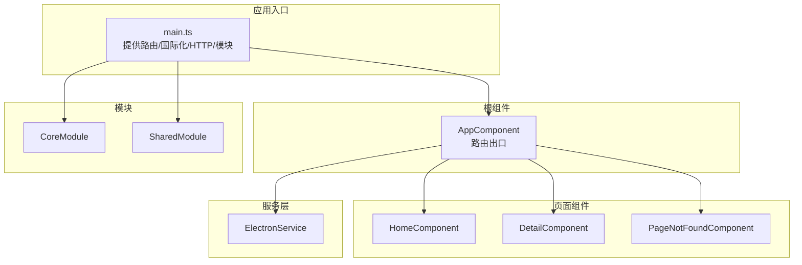
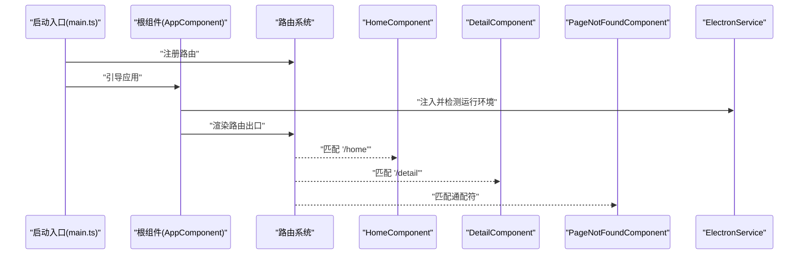
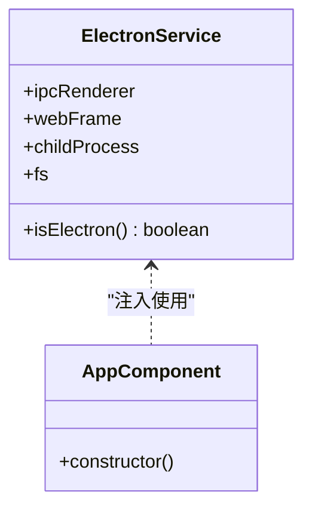
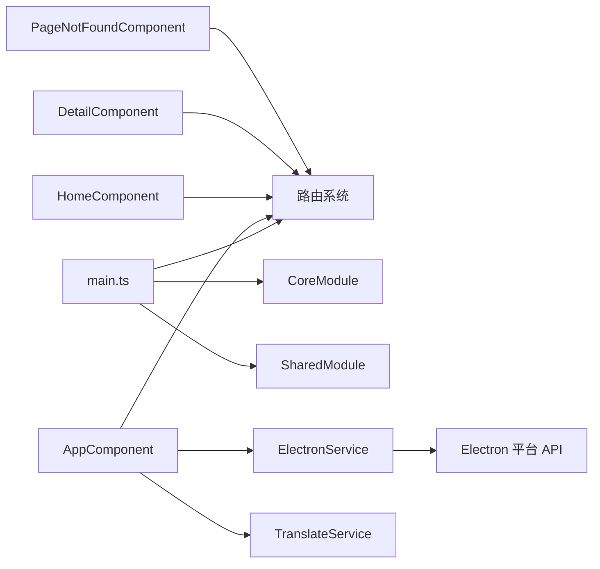

# 组件通信与数据流

<cite>
**本文档引用的文件**
- [src/app/app.component.ts](file://src/app/app.component.ts)
- [src/app/app.component.html](file://src/app/app.component.html)
- [src/app/home/home.component.ts](file://src/app/home/home.component.ts)
- [src/app/detail/detail.component.ts](file://src/app/detail/detail.component.ts)
- [src/app/shared/components/page-not-found/page-not-found.component.ts](file://src/app/shared/components/page-not-found/page-not-found.component.ts)
- [src/app/core/services/electron/electron.service.ts](file://src/app/core/services/electron/electron.service.ts)
- [src/app/shared/shared.module.ts](file://src/app/shared/shared.module.ts)
- [src/app/core/core.module.ts](file://src/app/core/core.module.ts)
- [src/main.ts](file://src/main.ts)
- [angular.json](file://angular.json)
- [src/environments/environment.ts](file://src/environments/environment.ts)
- [src/app/shared/directives/webview/webview.directive.ts](file://src/app/shared/directives/webview/webview.directive.ts)
</cite>

## 目录
1. [简介](#简介)
2. [项目结构](#项目结构)
3. [核心组件](#核心组件)
4. [架构总览](#架构总览)
5. [详细组件分析](#详细组件分析)
6. [依赖关系分析](#依赖关系分析)
7. [性能考虑](#性能考虑)
8. [故障排查指南](#故障排查指南)
9. [结论](#结论)
10. [附录](#附录)

## 简介
本文件聚焦于该 Angular 项目的组件通信与数据流，系统梳理以下主题：
- 组件间通信模式：父子、兄弟、跨层级通信
- 服务注入与依赖注入最佳实践
- 数据流管理策略：单向数据流、状态提升、局部状态管理
- 事件发射器、观察者模式与响应式编程的应用
- 组件解耦、接口设计与通信协议的指导原则

当前仓库以路由驱动的页面级组件为主，组件间通过路由参数与服务进行松耦合通信；同时提供 ElectronService 作为平台能力注入点，体现服务层对视图层的解耦。

## 项目结构
该项目采用 Angular 应用标准目录结构，关键通信相关位置如下：
- 根组件与路由出口：根组件包含路由出口，负责页面切换与顶层初始化
- 页面组件：home、detail、page-not-found 三个页面组件通过路由注册
- 服务层：ElectronService 提供跨平台（浏览器/Electron）能力注入
- 模块：CoreModule、SharedModule 提供基础能力与共享导出
- 启动入口：main.ts 配置路由、国际化、HTTP 客户端与模块导入

图表来源
- [src/main.ts:21-56](file://src/main.ts#L21-L56)
- [src/app/app.component.ts:7-13](file://src/app/app.component.ts#L7-L13)
- [src/app/home/home.component.ts:5-11](file://src/app/home/home.component.ts#L5-L11)
- [src/app/detail/detail.component.ts:5-11](file://src/app/detail/detail.component.ts#L5-L11)
- [src/app/shared/components/page-not-found/page-not-found.component.ts:3-8](file://src/app/shared/components/page-not-found/page-not-found.component.ts#L3-L8)
- [src/app/core/services/electron/electron.service.ts:9-11](file://src/app/core/services/electron/electron.service.ts#L9-L11)
- [src/app/core/core.module.ts:4-10](file://src/app/core/core.module.ts#L4-L10)
- [src/app/shared/shared.module.ts:8-13](file://src/app/shared/shared.module.ts#L8-L13)

章节来源
- [src/main.ts:21-56](file://src/main.ts#L21-L56)
- [src/app/app.component.ts:7-13](file://src/app/app.component.ts#L7-L13)
- [src/app/home/home.component.ts:5-11](file://src/app/home/home.component.ts#L5-L11)
- [src/app/detail/detail.component.ts:5-11](file://src/app/detail/detail.component.ts#L5-L11)
- [src/app/shared/components/page-not-found/page-not-found.component.ts:3-8](file://src/app/shared/components/page-not-found/page-not-found.component.ts#L3-L8)
- [src/app/core/services/electron/electron.service.ts:9-11](file://src/app/core/services/electron/electron.service.ts#L9-L11)
- [src/app/core/core.module.ts:4-10](file://src/app/core/core.module.ts#L4-L10)
- [src/app/shared/shared.module.ts:8-13](file://src/app/shared/shared.module.ts#L8-L13)

## 核心组件
- 根组件 AppComponent：声明路由出口，注入 ElectronService 与 TranslateService，完成默认语言设置与环境判断逻辑
- 页面组件：HomeComponent、DetailComponent、PageNotFoundComponent 均为独立页面，通过路由进行导航
- ElectronService：以根作用域注入，提供跨平台能力（条件性加载 Electron API），用于与主进程通信或访问 Node 能力
- Shared/ Core 模块：提供共享功能与基础模块化组织

章节来源
- [src/app/app.component.ts:14-34](file://src/app/app.component.ts#L14-L34)
- [src/app/home/home.component.ts:12-18](file://src/app/home/home.component.ts#L12-L18)
- [src/app/detail/detail.component.ts:12-20](file://src/app/detail/detail.component.ts#L12-L20)
- [src/app/shared/components/page-not-found/page-not-found.component.ts:9-15](file://src/app/shared/components/page-not-found/page-not-found.component.ts#L9-L15)
- [src/app/core/services/electron/electron.service.ts:12-56](file://src/app/core/services/electron/electron.service.ts#L12-L56)
- [src/app/shared/shared.module.ts:8-13](file://src/app/shared/shared.module.ts#L8-L13)
- [src/app/core/core.module.ts:4-10](file://src/app/core/core.module.ts#L4-L10)

## 架构总览
该应用采用“路由驱动 + 服务注入”的通信架构：
- 路由层：通过 provideRouter 注册页面路由，根组件使用 router-outlet 承载页面
- 服务层：ElectronService 在根作用域提供跨平台能力，避免在组件中直接处理平台差异
- 国际化与网络：通过 provideTranslateService 与 HttpClient 提供国际化与 HTTP 请求能力
- 模块化：CoreModule、SharedModule 将通用能力集中管理，减少重复导入

图表来源
- [src/main.ts:32-50](file://src/main.ts#L32-L50)
- [src/app/app.component.ts:14-34](file://src/app/app.component.ts#L14-L34)
- [src/app/app.component.html:1-1](file://src/app/app.component.html#L1-L1)

章节来源
- [src/main.ts:21-56](file://src/main.ts#L21-L56)
- [src/app/app.component.ts:7-13](file://src/app/app.component.ts#L7-L13)
- [src/app/app.component.html:1-1](file://src/app/app.component.html#L1-L1)

## 详细组件分析

### 根组件与路由出口
- 角色：承载路由出口，统一初始化（国际化、环境判断）
- 通信方式：通过 RouterOutlet 与路由系统协作，实现页面级切换
- 依赖注入：注入 ElectronService 与 TranslateService，体现服务层对视图层的解耦

章节来源
- [src/app/app.component.ts:7-13](file://src/app/app.component.ts#L7-L13)
- [src/app/app.component.ts:14-34](file://src/app/app.component.ts#L14-L34)
- [src/app/app.component.html:1-1](file://src/app/app.component.html#L1-L1)

### 页面组件（Home、Detail、PageNotFound）
- 角色：各自代表一个页面，独立初始化
- 通信方式：通过路由进行导航切换；若需跨页面传递数据，建议使用路由参数/查询参数或服务
- 状态管理：当前组件未展示复杂状态，适合采用局部状态管理策略

章节来源
- [src/app/home/home.component.ts:5-11](file://src/app/home/home.component.ts#L5-L11)
- [src/app/home/home.component.ts:12-18](file://src/app/home/home.component.ts#L12-L18)
- [src/app/detail/detail.component.ts:5-11](file://src/app/detail/detail.component.ts#L5-L11)
- [src/app/detail/detail.component.ts:12-20](file://src/app/detail/detail.component.ts#L12-L20)
- [src/app/shared/components/page-not-found/page-not-found.component.ts:3-8](file://src/app/shared/components/page-not-found/page-not-found.component.ts#L3-L8)
- [src/app/shared/components/page-not-found/page-not-found.component.ts:9-15](file://src/app/shared/components/page-not-found/page-not-found.component.ts#L9-L15)

### ElectronService 服务注入与跨平台通信
- 作用域：根作用域注入，全局可用
- 功能：条件性加载 Electron API（如 ipcRenderer、childProcess、fs），并在浏览器环境下安全降级
- 通信模式：通过 IPC 与主进程交互，实现渲染进程与主进程的数据交换
- 最佳实践：
  - 使用条件访问属性，避免在非 Electron 环境调用
  - 将平台差异封装在服务内部，组件仅消费抽象接口
  - 对外部依赖进行严格类型约束与错误处理

图表来源
- [src/app/core/services/electron/electron.service.ts:12-56](file://src/app/core/services/electron/electron.service.ts#L12-L56)
- [src/app/app.component.ts:14-34](file://src/app/app.component.ts#L14-L34)

章节来源
- [src/app/core/services/electron/electron.service.ts:9-11](file://src/app/core/services/electron/electron.service.ts#L9-L11)
- [src/app/core/services/electron/electron.service.ts:12-56](file://src/app/core/services/electron/electron.service.ts#L12-L56)
- [src/app/app.component.ts:14-34](file://src/app/app.component.ts#L14-L34)

### 模块与共享能力
- CoreModule：基础模块，集中声明核心能力
- SharedModule：导出国际化与表单等常用模块，便于复用
- 通信策略：通过模块化组织，减少组件对第三方库的直接依赖，提升可测试性与可维护性

章节来源
- [src/app/core/core.module.ts:4-10](file://src/app/core/core.module.ts#L4-L10)
- [src/app/shared/shared.module.ts:8-13](file://src/app/shared/shared.module.ts#L8-L13)

### 指令与扩展点
- WebviewDirective：声明式选择器 webview，作为未来扩展的占位（当前为空实现）
- 通信建议：若需要在模板中嵌入原生 webview 行为，可在指令中封装事件与生命周期，避免在组件中直接操作 DOM

章节来源
- [src/app/shared/directives/webview/webview.directive.ts:1-9](file://src/app/shared/directives/webview/webview.directive.ts#L1-L9)

## 依赖关系分析
- 入口依赖：main.ts 提供路由、国际化、HTTP 与模块导入
- 根组件依赖：RouterOutlet、ElectronService、TranslateService
- 页面组件依赖：路由链接与国际化模块
- 服务依赖：ElectronService 依赖 Electron 平台 API，需条件加载

图表来源
- [src/main.ts:21-56](file://src/main.ts#L21-L56)
- [src/app/app.component.ts:14-34](file://src/app/app.component.ts#L14-L34)
- [src/app/core/services/electron/electron.service.ts:12-56](file://src/app/core/services/electron/electron.service.ts#L12-L56)

章节来源
- [src/main.ts:21-56](file://src/main.ts#L21-L56)
- [src/app/app.component.ts:14-34](file://src/app/app.component.ts#L14-L34)
- [src/app/core/services/electron/electron.service.ts:12-56](file://src/app/core/services/electron/electron.service.ts#L12-L56)

## 性能考虑
- 单向数据流：通过服务集中管理状态，组件只读取与触发动作，避免双向绑定导致的状态风暴
- 状态提升：对于兄弟组件共享的状态，优先提升至最近公共父组件或服务
- 局部状态管理：页面内局部状态保留在组件内部，减少不必要的变更传播
- 事件发射器与观察者模式：在组件间传递事件时，使用 Angular 的 @Output/@Input 或服务发布订阅，避免深层回调地狱
- 响应式编程：结合 RxJS 在服务层处理异步数据流，组件通过 async 管道订阅，降低内存泄漏风险
- 依赖注入优化：将重型服务置于根作用域，按需懒加载子模块，减少初始包体

## 故障排查指南
- Electron 环境检测失败
  - 现象：服务无法获取 ipcRenderer 或其他 Electron API
  - 排查：确认 isElectron 判断逻辑与运行环境一致；检查条件加载路径
  - 参考：[src/app/core/services/electron/electron.service.ts:53-55](file://src/app/core/services/electron/electron.service.ts#L53-L55)
- 路由不生效或页面空白
  - 现象：导航后无内容显示
  - 排查：确认 router-outlet 存在且路由配置正确；检查页面组件是否正确注册
  - 参考：[src/app/app.component.html:1-1](file://src/app/app.component.html#L1-L1)，[src/main.ts:32-50](file://src/main.ts#L32-L50)
- 国际化资源加载失败
  - 现象：多语言文本未替换
  - 排查：确认 i18n 文件路径与命名；检查 provideTranslateService 的 loader 配置
  - 参考：[src/main.ts:24-31](file://src/main.ts#L24-L31)
- 生产模式与开发模式差异
  - 现象：生产模式下日志缺失或行为不同
  - 排查：检查 APP_CONFIG.production 与构建配置
  - 参考：[src/environments/environment.ts:1-5](file://src/environments/environment.ts#L1-L5)，[angular.json:17-19](file://angular.json#L17-L19)

章节来源
- [src/app/core/services/electron/electron.service.ts:53-55](file://src/app/core/services/electron/electron.service.ts#L53-L55)
- [src/app/app.component.html:1-1](file://src/app/app.component.html#L1-L1)
- [src/main.ts:24-31](file://src/main.ts#L24-L31)
- [src/environments/environment.ts:1-5](file://src/environments/environment.ts#L1-L5)
- [angular.json:17-19](file://angular.json#L17-L19)

## 结论
本项目通过“路由驱动 + 服务注入”的架构实现了清晰的组件通信与数据流管理：
- 组件间主要通过路由进行导航与页面切换，减少直接耦合
- ElectronService 将平台差异封装在服务层，组件仅消费抽象接口
- 通过模块化组织与依赖注入，提升可维护性与可测试性
- 建议在后续迭代中引入响应式数据流与服务级状态管理，进一步强化单向数据流与状态提升策略

## 附录
- 组件通信模式清单
  - 父子组件通信：通过 @Input/@Output 或服务进行松耦合
  - 兄弟组件通信：通过共同父组件或服务进行协调
  - 跨层级通信：通过服务或路由参数/查询参数传递
- 数据流管理策略
  - 单向数据流：服务集中管理状态，组件只读取与派发动作
  - 状态提升：共享状态提升至最近公共父组件或服务
  - 局部状态管理：页面内局部状态保留在组件内部
- 事件发射器与观察者模式
  - 使用 @Output 发射事件，使用 @Input 接收数据
  - 在服务层使用 Subject/BehaviorSubject 管理跨组件事件
- 响应式编程
  - 在服务层使用 Observable 处理异步数据流
  - 在组件中使用 async 管道订阅，避免手动订阅与取消订阅
- 解耦与通信协议
  - 组件仅依赖服务接口，不直接依赖第三方库
  - 明确事件与状态变更的契约，保持接口稳定