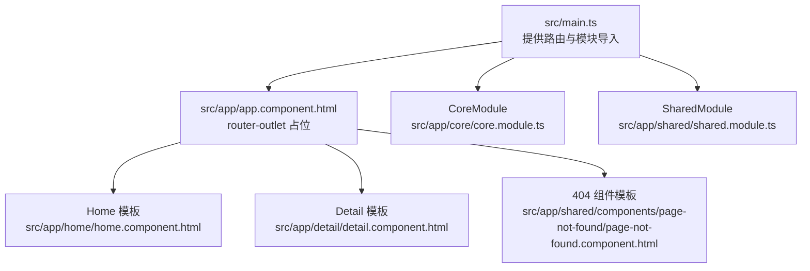
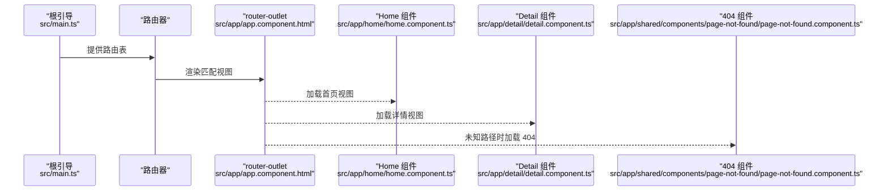
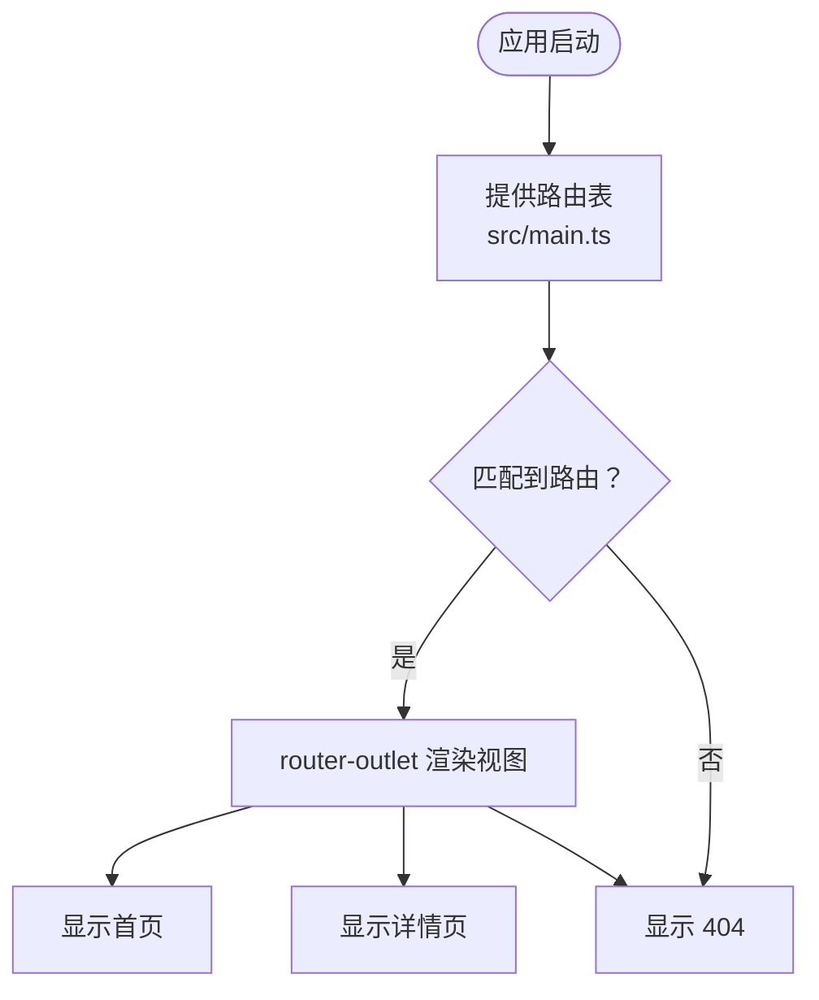
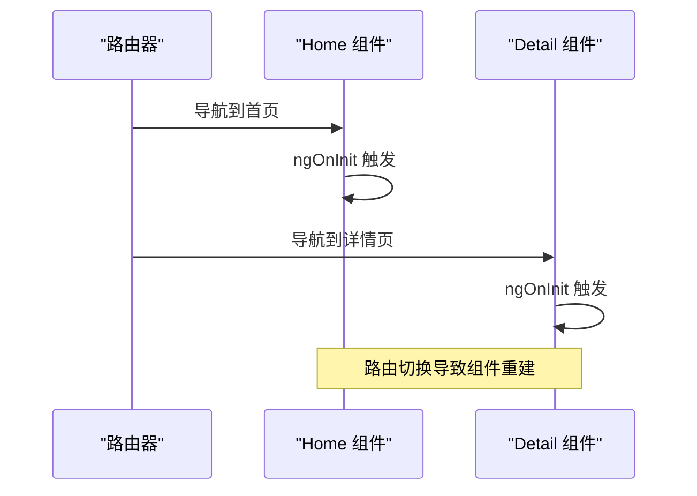
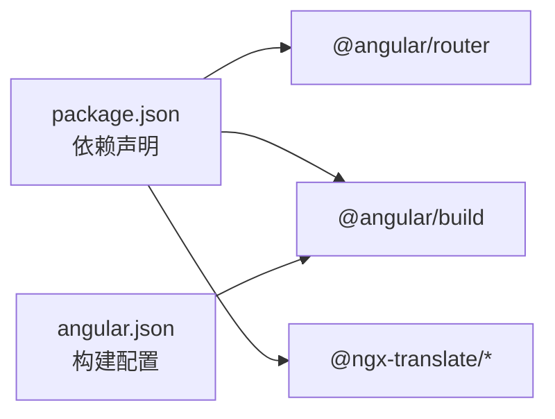

# 路由与导航系统

<cite>
**本文引用的文件**
- [src/main.ts](file://src/main.ts)
- [src/app/app.component.ts](file://src/app/app.component.ts)
- [src/app/app.component.html](file://src/app/app.component.html)
- [src/app/home/home.component.ts](file://src/app/home/home.component.ts)
- [src/app/home/home.component.html](file://src/app/home/home.component.html)
- [src/app/detail/detail.component.ts](file://src/app/detail/detail.component.ts)
- [src/app/detail/detail.component.html](file://src/app/detail/detail.component.html)
- [src/app/shared/components/page-not-found/page-not-found.component.ts](file://src/app/shared/components/page-not-found/page-not-found.component.ts)
- [src/app/shared/components/page-not-found/page-not-found.component.html](file://src/app/shared/components/page-not-found/page-not-found.component.html)
- [src/app/core/core.module.ts](file://src/app/core/core.module.ts)
- [src/app/shared/shared.module.ts](file://src/app/shared/shared.module.ts)
- [src/environments/environment.ts](file://src/environments/environment.ts)
- [angular.json](file://angular.json)
- [package.json](file://package.json)
</cite>

## 目录
1. [引言](#引言)
2. [项目结构](#项目结构)
3. [核心组件](#核心组件)
4. [架构总览](#架构总览)
5. [详细组件分析](#详细组件分析)
6. [依赖分析](#依赖分析)
7. [性能考虑](#性能考虑)
8. [故障排查指南](#故障排查指南)
9. [结论](#结论)
10. [附录](#附录)

## 引言
本文件围绕该 Angular 应用的“路由与导航系统”进行系统化说明，重点覆盖以下方面：
- 路由配置与导航策略：基于根引导（standalone）方式的路由注册与基础路由表。
- 导航实现：在模板中使用 routerLink 进行页面跳转。
- 路由守卫、懒加载与路由参数：现状分析与扩展建议。
- 用户体验与导航状态管理：当前实现与改进建议。
- 组件生命周期关系与路由变化影响：结合现有组件日志观察。
- 安全、SEO 与导航性能：实践要点与注意事项。
- 路由扩展与自定义导航行为：可落地的指导原则。

## 项目结构
该应用采用 Angular Standalone 引导方式，路由通过根引导函数集中提供。路由表包含首页、详情页与通配页（404），并通过一个兜底组件处理未知路径。

图表来源
- [src/main.ts:32-50](file://src/main.ts#L32-L50)
- [src/app/app.component.html:1-2](file://src/app/app.component.html#L1-L2)
- [src/app/home/home.component.html:1-8](file://src/app/home/home.component.html#L1-L8)
- [src/app/detail/detail.component.html:1-8](file://src/app/detail/detail.component.html#L1-L8)
- [src/app/shared/components/page-not-found/page-not-found.component.html:1-4](file://src/app/shared/components/page-not-found/page-not-found.component.html#L1-L4)
- [src/app/core/core.module.ts:1-11](file://src/app/core/core.module.ts#L1-L11)
- [src/app/shared/shared.module.ts:1-14](file://src/app/shared/shared.module.ts#L1-L14)

章节来源
- [src/main.ts:32-50](file://src/main.ts#L32-L50)
- [src/app/app.component.html:1-2](file://src/app/app.component.html#L1-L2)
- [src/app/home/home.component.html:1-8](file://src/app/home/home.component.html#L1-L8)
- [src/app/detail/detail.component.html:1-8](file://src/app/detail/detail.component.html#L1-L8)
- [src/app/shared/components/page-not-found/page-not-found.component.html:1-4](file://src/app/shared/components/page-not-found/page-not-found.component.html#L1-L4)
- [src/app/core/core.module.ts:1-11](file://src/app/core/core.module.ts#L1-L11)
- [src/app/shared/shared.module.ts:1-14](file://src/app/shared/shared.module.ts#L1-L14)

## 核心组件
- 根组件与路由出口
  - 根组件以 standalone 方式声明，并引入 RouterOutlet；模板中仅包含一个 router-outlet，用于承载匹配到的路由视图。
  - 参考路径：[src/app/app.component.ts:7-13](file://src/app/app.component.ts#L7-L13)、[src/app/app.component.html:1-2](file://src/app/app.component.html#L1-L2)

- 路由提供与路由表
  - 在根引导函数中通过 provideRouter 提供路由配置，包含默认重定向、首页、详情页与通配 404。
  - 参考路径：[src/main.ts:32-50](file://src/main.ts#L32-L50)

- 页面组件与导航
  - 首页与详情页均使用 RouterLink 导航至对方页面，体现基本的双向导航。
  - 参考路径：[src/app/home/home.component.html:6](file://src/app/home/home.component.html#L6)、[src/app/detail/detail.component.html:6](file://src/app/detail/detail.component.html#L6)

- 404 组件
  - 通配路由指向兜底组件，用于处理未匹配路径。
  - 参考路径：[src/app/shared/components/page-not-found/page-not-found.component.ts:1-16](file://src/app/shared/components/page-not-found/page-not-found.component.ts#L1-L16)

章节来源
- [src/app/app.component.ts:7-13](file://src/app/app.component.ts#L7-L13)
- [src/app/app.component.html:1-2](file://src/app/app.component.html#L1-L2)
- [src/main.ts:32-50](file://src/main.ts#L32-L50)
- [src/app/home/home.component.html:6](file://src/app/home/home.component.html#L6)
- [src/app/detail/detail.component.html:6](file://src/app/detail/detail.component.html#L6)
- [src/app/shared/components/page-not-found/page-not-found.component.ts:1-16](file://src/app/shared/components/page-not-found/page-not-found.component.ts#L1-L16)

## 架构总览
下图展示了从应用启动到页面渲染的关键流程：根引导提供路由配置，组件模板通过 routerLink 触发导航，router-outlet 展示对应视图，通配路由处理未知路径。

图表来源
- [src/main.ts:32-50](file://src/main.ts#L32-L50)
- [src/app/app.component.html:1-2](file://src/app/app.component.html#L1-L2)
- [src/app/home/home.component.ts:1-19](file://src/app/home/home.component.ts#L1-L19)
- [src/app/detail/detail.component.ts:1-21](file://src/app/detail/detail.component.ts#L1-L21)
- [src/app/shared/components/page-not-found/page-not-found.component.ts:1-16](file://src/app/shared/components/page-not-found/page-not-found.component.ts#L1-L16)

## 详细组件分析

### 路由配置与导航策略
- 路由表结构
  - 默认重定向：空路径重定向至首页。
  - 首页路由：匹配 '/home' 并渲染首页组件。
  - 详情路由：匹配 '/detail' 并渲染详情组件。
  - 通配路由：匹配任意未命中路径并渲染 404 组件。
- 导航策略
  - 使用 RouterLink 在模板中进行声明式导航，简洁直观。
- 扩展点
  - 当前未启用路由守卫、懒加载与路由参数解析器，后续可按需添加。

图表来源
- [src/main.ts:32-50](file://src/main.ts#L32-L50)
- [src/app/app.component.html:1-2](file://src/app/app.component.html#L1-L2)

章节来源
- [src/main.ts:32-50](file://src/main.ts#L32-L50)
- [src/app/home/home.component.html:6](file://src/app/home/home.component.html#L6)
- [src/app/detail/detail.component.html:6](file://src/app/detail/detail.component.html#L6)

### 路由守卫、懒加载与路由参数
- 现状
  - 当前路由表未包含守卫、懒加载分块或参数解析器。
- 建议扩展
  - 路由守卫：在路由元数据中加入 canActivate、canActivateChild、canDeactivate、canLoad 等守卫，以实现鉴权、预加载校验等。
  - 懒加载：将大型特性模块拆分为独立路由块，配合 loadChildren 或现代的 import() 动态导入，提升首屏性能。
  - 路由参数：使用 path 参数与查询参数，结合 paramMap/ queryParams 在组件内读取；必要时配合 resolve 预取数据。
- 影响与注意
  - 守卫可能阻塞导航，需考虑用户体验与错误提示。
  - 懒加载会增加网络请求与首次渲染时间，应结合预加载策略与骨架屏优化。
  - 参数变更不会触发组件重建，需监听参数变化并更新状态。

[本节为概念性扩展说明，不直接分析具体文件，故无“章节来源”]

### 用户体验与导航状态管理
- 当前实现
  - 使用 RouterLink 进行页面切换，简单直接。
  - 404 页面统一处理未知路径，避免白屏。
- 改进建议
  - 导航状态：在路由激活状态上添加样式类，增强视觉反馈。
  - 历史记录：结合浏览器历史 API 与服务，提供返回上一页能力。
  - 错误恢复：在 404 页面提供“回到首页”或“查看最近访问”的入口。
  - 加载态：在导航开始与结束时设置全局加载指示器，改善感知性能。

[本节为概念性改进说明，不直接分析具体文件，故无“章节来源”]

### 组件生命周期与路由变化
- 生命周期观察
  - 首页与详情组件在初始化阶段打印日志，便于验证路由切换是否触发组件生命周期。
- 关系说明
  - 路由切换会销毁旧组件并创建新组件，符合 Angular 的默认复用策略。
  - 若需保留状态，可使用路由复用策略或在服务中缓存状态。

图表来源
- [src/app/home/home.component.ts:14-16](file://src/app/home/home.component.ts#L14-L16)
- [src/app/detail/detail.component.ts:16-18](file://src/app/detail/detail.component.ts#L16-L18)

章节来源
- [src/app/home/home.component.ts:14-16](file://src/app/home/home.component.ts#L14-L16)
- [src/app/detail/detail.component.ts:16-18](file://src/app/detail/detail.component.ts#L16-L18)

### 路由安全、SEO 与导航性能
- 安全
  - 使用守卫控制访问权限，避免未授权用户进入受保护区域。
  - 对外部链接使用安全策略，防止 XSS 与点击劫持。
- SEO
  - 为每个页面提供语义化的标题与描述，结合服务端渲染或预渲染提升搜索引擎收录。
  - 使用 canonical 标签避免重复内容。
- 性能
  - 启用懒加载与代码分割，减少首屏体积。
  - 使用预取与预连接优化关键资源加载。
  - 控制路由动画与过渡效果，避免阻塞主线程。

[本节为通用实践说明，不直接分析具体文件，故无“章节来源”]

### 路由扩展与自定义导航行为
- 指南原则
  - 明确职责分离：路由负责路径与视图映射，业务逻辑放入服务。
  - 可测试性：将导航逻辑抽象为可注入的服务，便于单元测试。
  - 可维护性：统一的导航服务封装常见模式（如带参导航、返回上一页）。
- 实施建议
  - 封装导航服务：提供 goHome、goToDetail(id)、navigateBack 等方法。
  - 参数化导航：支持查询参数与路径参数，提供类型安全的参数构建器。
  - 自定义指令：基于 RouterLink 创建增强型导航指令，支持权限判断与加载态。

[本节为通用实践说明，不直接分析具体文件，故无“章节来源”]

## 依赖分析
- Angular 版本与构建工具
  - 应用使用 Angular 21.x 与 @angular/build:application 构建器，支持现代浏览器与生产优化。
- 路由相关依赖
  - @angular/router 已安装，版本与应用主版本保持一致。
- 国际化与翻译
  - 使用 @ngx-translate/core 与 http-loader，配合路由中的多语言文案展示。

图表来源
- [package.json:49-61](file://package.json#L49-L61)
- [package.json:62-95](file://package.json#L62-L95)
- [angular.json:24-83](file://angular.json#L24-L83)

章节来源
- [package.json:49-61](file://package.json#L49-L61)
- [package.json:62-95](file://package.json#L62-L95)
- [angular.json:24-83](file://angular.json#L24-L83)

## 性能考虑
- 首屏优化
  - 使用懒加载拆分大模块，降低初始包体。
  - 启用生产构建与输出哈希，便于长期缓存。
- 导航体验
  - 在导航开始时显示轻量级加载指示器，减少感知延迟。
  - 对高频页面启用预取，缩短二次访问等待时间。
- 资源管理
  - 合理使用 zone.js 与变更检测策略，避免不必要的重渲染。

[本节提供通用指导，不直接分析具体文件，故无“章节来源”]

## 故障排查指南
- 常见问题
  - 导航无效：检查 routerLink 是否正确绑定路径，确认路由表中是否存在对应路径。
  - 404 无法定位：确认通配路由是否正确配置，且 404 组件已正确导入。
  - 组件未刷新：若依赖路由参数，请确保在组件中监听参数变化并更新状态。
- 日志与调试
  - 利用组件 ngOnInit 中的日志确认路由切换是否触发组件初始化。
  - 结合浏览器开发者工具 Network 面板检查懒加载资源是否按需加载。

章节来源
- [src/app/home/home.component.ts:14-16](file://src/app/home/home.component.ts#L14-L16)
- [src/app/detail/detail.component.ts:16-18](file://src/app/detail/detail.component.ts#L16-L18)
- [src/app/shared/components/page-not-found/page-not-found.component.ts:12-14](file://src/app/shared/components/page-not-found/page-not-found.component.ts#L12-L14)

## 结论
该应用已具备基础的路由与导航能力：通过根引导提供路由表，使用 RouterLink 实现页面间跳转，404 统一兜底。为进一步提升安全性、SEO 与性能，建议引入路由守卫、懒加载与参数解析器，并在服务层封装统一的导航行为。同时，关注用户体验与状态管理，确保导航过程平滑、可回溯且可恢复。

[本节为总结性内容，不直接分析具体文件，故无“章节来源”]

## 附录
- 环境配置
  - 应用环境变量包含 production 与 environment 字段，可用于运行时行为控制。
  - 参考路径：[src/environments/environment.ts:1-5](file://src/environments/environment.ts#L1-L5)

章节来源
- [src/environments/environment.ts:1-5](file://src/environments/environment.ts#L1-L5)