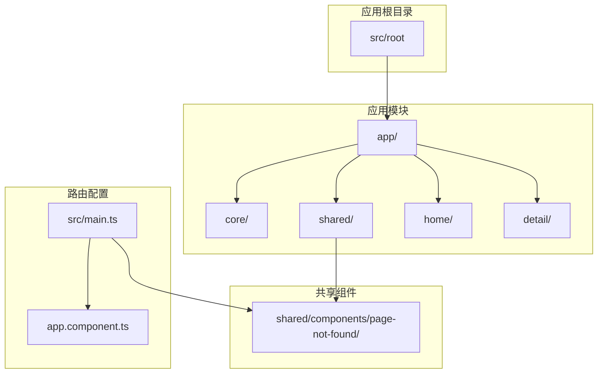
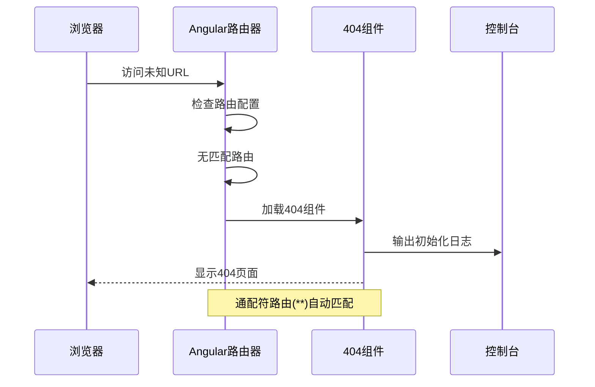
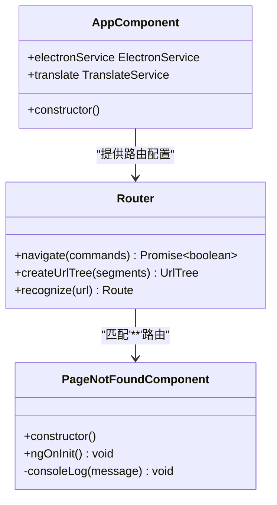
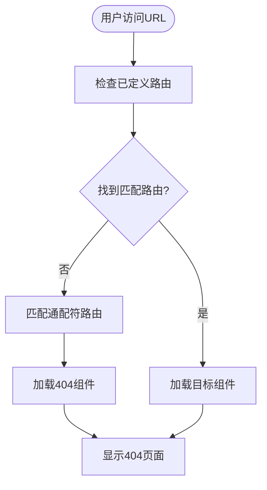
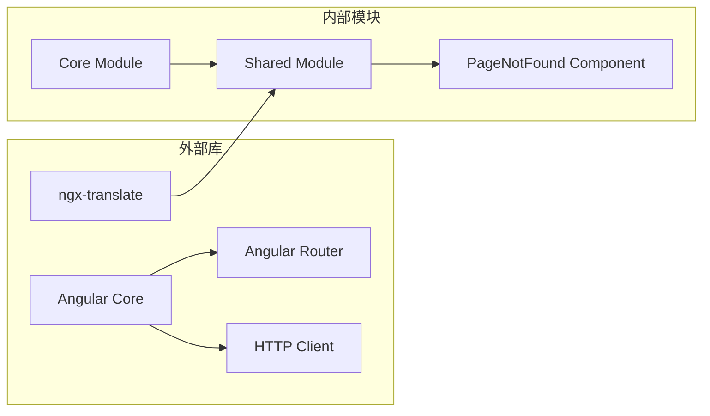

# 404页面组件

<cite>
**本文档引用的文件**
- [src/app/shared/components/page-not-found/page-not-found.component.ts](file://src/app/shared/components/page-not-found/page-not-found.component.ts)
- [src/app/shared/components/page-not-found/page-not-found.component.html](file://src/app/shared/components/page-not-found/page-not-found.component.html)
- [src/app/shared/components/page-not-found/page-not-found.component.spec.ts](file://src/app/shared/components/page-not-found/page-not-found.component.spec.ts)
- [src/app/shared/components/page-not-found/page-not-found.component.scss](file://src/app/shared/components/page-not-found/page-not-found.component.scss)
- [src/main.ts](file://src/main.ts)
- [src/app/app.component.ts](file://src/app/app.component.ts)
- [src/app/app.component.html](file://src/app/app.component.html)
- [src/app/home/home.component.ts](file://src/app/home/home.component.ts)
- [src/app/detail/detail.component.ts](file://src/app/detail/detail.component.ts)
- [src/app/shared/shared.module.ts](file://src/app/shared/shared.module.ts)
- [angular.json](file://angular.json)
</cite>

## 目录
1. [简介](#简介)
2. [项目结构](#项目结构)
3. [核心组件](#核心组件)
4. [架构概览](#架构概览)
5. [详细组件分析](#详细组件分析)
6. [依赖关系分析](#依赖关系分析)
7. [性能考虑](#性能考虑)
8. [故障排除指南](#故障排除指南)
9. [结论](#结论)
10. [附录](#附录)

## 简介

PageNotFoundComponent 是本项目中的404页面组件，负责处理所有未匹配的路由请求。该组件采用Angular 18的standalone组件模式实现，具有简洁的设计理念和良好的可扩展性。

该组件在路由系统中扮演着关键角色，作为通配符路由（**）的处理器，确保用户在访问不存在的URL时能够获得友好的错误体验。组件目前提供基础的初始化日志功能，并为后续的功能扩展预留了充分的空间。

## 项目结构

项目采用模块化的Angular架构设计，PageNotFoundComponent位于共享组件目录下，便于在整个应用中复用。

**图表来源**
- [src/main.ts:1-57](file://src/main.ts#L1-L57)
- [src/app/app.component.ts:1-35](file://src/app/app.component.ts#L1-L35)

**章节来源**
- [src/main.ts:1-57](file://src/main.ts#L1-L57)
- [angular.json:1-188](file://angular.json#L1-L188)

## 核心组件

PageNotFoundComponent是一个极简主义的404页面实现，具有以下核心特性：

### 组件元数据
- **选择器**: app-page-not-found
- **模板**: 基础的文本显示
- **样式**: 默认样式表
- **类型**: Standalone组件
- **生命周期**: 包含基本的初始化逻辑

### 设计目的
该组件的主要目的是为用户提供清晰的404错误指示，同时保持界面简洁。当前实现提供了基础的日志输出功能，用于调试和监控组件的加载情况。

### 错误处理机制
组件通过Angular路由系统的通配符路由自动触发，无需手动干预即可捕获所有未匹配的URL请求。这种设计确保了用户不会看到空白页面或技术错误信息。

**章节来源**
- [src/app/shared/components/page-not-found/page-not-found.component.ts:1-16](file://src/app/shared/components/page-not-found/page-not-found.component.ts#L1-L16)

## 架构概览

PageNotFoundComponent在整体架构中处于路由层的末端，作为错误处理的最后一道防线。

**图表来源**
- [src/main.ts:46-49](file://src/main.ts#L46-L49)
- [src/app/shared/components/page-not-found/page-not-found.component.ts:12-14](file://src/app/shared/components/page-not-found/page-not-found.component.ts#L12-L14)

## 详细组件分析

### 组件类结构

**图表来源**
- [src/app/shared/components/page-not-found/page-not-found.component.ts:9-15](file://src/app/shared/components/page-not-found/page-not-found.component.ts#L9-L15)
- [src/main.ts:32-50](file://src/main.ts#L32-L50)

### 路由集成分析

PageNotFoundComponent通过通配符路由配置实现全局拦截：

#### 路由配置模式
- **路径模式**: `**`（通配符）
- **匹配规则**: 匹配所有未明确声明的URL
- **优先级**: 在路由表末尾，确保其他路由优先匹配
- **组件绑定**: 自动加载PageNotFoundComponent

#### 路由匹配流程

**图表来源**
- [src/main.ts:32-50](file://src/main.ts#L32-L50)

**章节来源**
- [src/main.ts:46-49](file://src/main.ts#L46-L49)
- [src/app/shared/components/page-not-found/page-not-found.component.ts:12-14](file://src/app/shared/components/page-not-found/page-not-found.component.ts#L12-L14)

### 模板结构分析

当前模板采用极简设计，专注于核心功能展示：

#### 模板特点
- **结构简单**: 单一的段落元素
- **语义明确**: 清晰的404状态标识
- **可扩展性强**: 为后续功能增强预留空间

#### 样式实现
- **默认样式**: 使用空的SCSS文件作为占位符
- **主题兼容**: 遵循应用整体设计语言
- **响应式支持**: 自动适配不同屏幕尺寸

**章节来源**
- [src/app/shared/components/page-not-found/page-not-found.component.html:1-4](file://src/app/shared/components/page-not-found/page-not-found.component.html#L1-L4)
- [src/app/shared/components/page-not-found/page-not-found.component.scss:1-1](file://src/app/shared/components/page-not-found/page-not-found.component.scss#L1-L1)

### 用户引导策略

基于当前实现，建议的用户引导策略包括：

#### 导航增强
- **返回首页按钮**: 提供直观的导航选项
- **面包屑导航**: 显示用户当前位置
- **常用链接**: 展示热门页面链接

#### 错误信息优化
- **友好提示**: 使用用户易懂的语言
- **原因说明**: 简要解释可能的原因
- **解决方案**: 提供具体的解决步骤

## 依赖关系分析

### 外部依赖

**图表来源**
- [src/main.ts:1-57](file://src/main.ts#L1-L57)
- [src/app/shared/shared.module.ts:1-14](file://src/app/shared/shared.module.ts#L1-L14)

### 内部依赖关系

PageNotFoundComponent的依赖关系相对简单，主要依赖于Angular的核心功能：

#### 直接依赖
- **@angular/core**: 组件框架基础
- **@angular/router**: 路由系统集成

#### 间接依赖
- **共享模块**: 通过路由配置间接使用
- **应用模块**: 通过主模块提供服务

**章节来源**
- [src/main.ts:13-15](file://src/main.ts#L13-L15)
- [src/app/shared/shared.module.ts:8-13](file://src/app/shared/shared.module.ts#L8-L13)

## 性能考虑

### 加载性能
- **懒加载优势**: 作为404组件，通常不频繁访问
- **资源占用**: 极简模板减少渲染开销
- **缓存策略**: 可利用浏览器缓存机制

### 内存管理
- **生命周期**: 简短的组件生命周期
- **事件监听**: 避免不必要的事件绑定
- **资源清理**: 组件销毁时自动清理

## 故障排除指南

### 常见问题诊断

#### 组件未显示
1. **检查路由配置**: 确认通配符路由正确设置
2. **验证导入路径**: 确保组件正确导入
3. **检查控制台**: 查看是否有JavaScript错误

#### 样式问题
1. **样式隔离**: 确认组件样式正确加载
2. **主题冲突**: 检查全局样式影响
3. **响应式问题**: 验证移动端显示效果

**章节来源**
- [src/app/shared/components/page-not-found/page-not-found.component.spec.ts:1-24](file://src/app/shared/components/page-not-found/page-not-found.component.spec.ts#L1-L24)

## 结论

PageNotFoundComponent作为一个基础的404页面组件，展现了现代Angular应用中错误处理的最佳实践。其简洁的设计理念和良好的可扩展性为后续的功能增强奠定了坚实基础。

### 主要优势
- **设计简洁**: 避免了过度复杂的UI设计
- **易于维护**: 最小化的代码实现
- **可扩展性强**: 为功能增强预留空间
- **集成简便**: 与现有路由系统无缝集成

### 改进建议
- **增强用户体验**: 添加导航选项和错误提示
- **国际化支持**: 集成多语言错误消息
- **分析功能**: 添加访问统计和错误报告
- **视觉优化**: 设计更具吸引力的404页面

## 附录

### 开发最佳实践

#### 代码组织
- **单一职责**: 专注于404错误处理
- **命名规范**: 使用语义化组件名称
- **文件结构**: 保持与Angular约定一致

#### 用户体验设计
- **一致性**: 与应用整体设计风格保持一致
- **可访问性**: 确保屏幕阅读器友好
- **响应式**: 适配各种设备和屏幕尺寸

#### 测试策略
- **单元测试**: 验证组件基本功能
- **集成测试**: 测试路由集成效果
- **端到端测试**: 验证完整用户流程