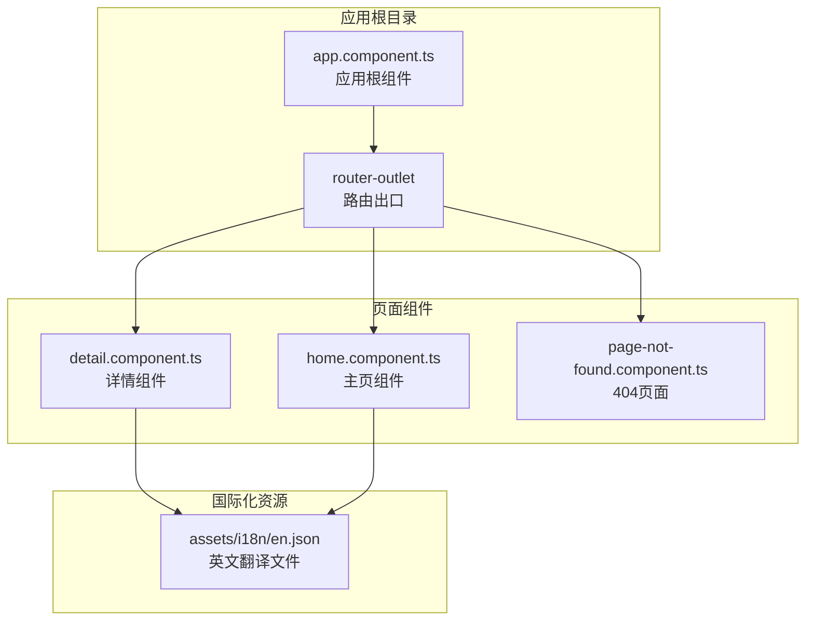
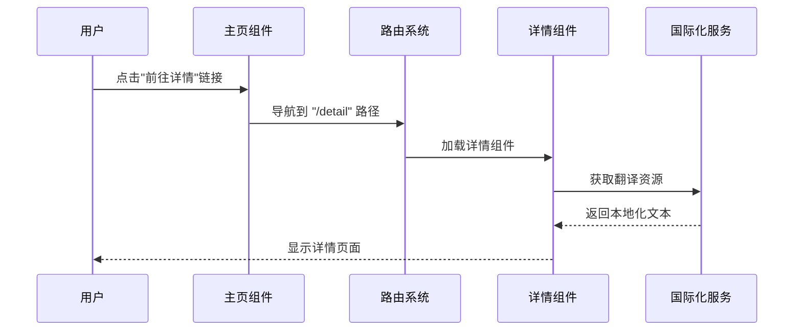
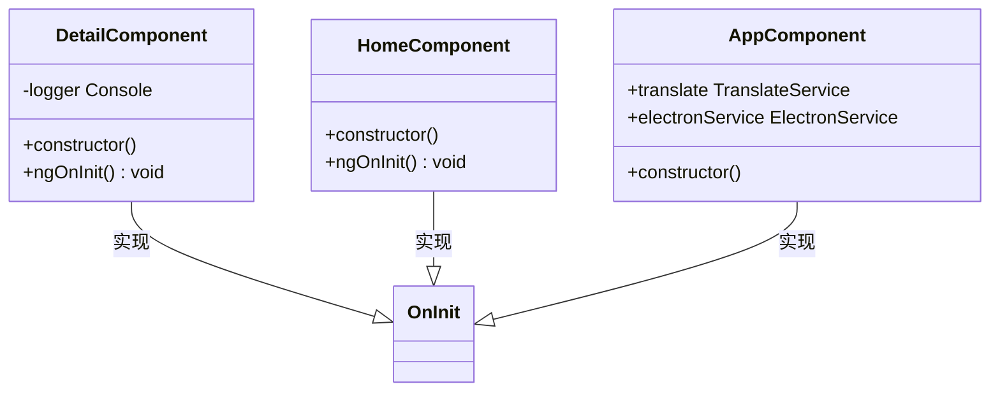
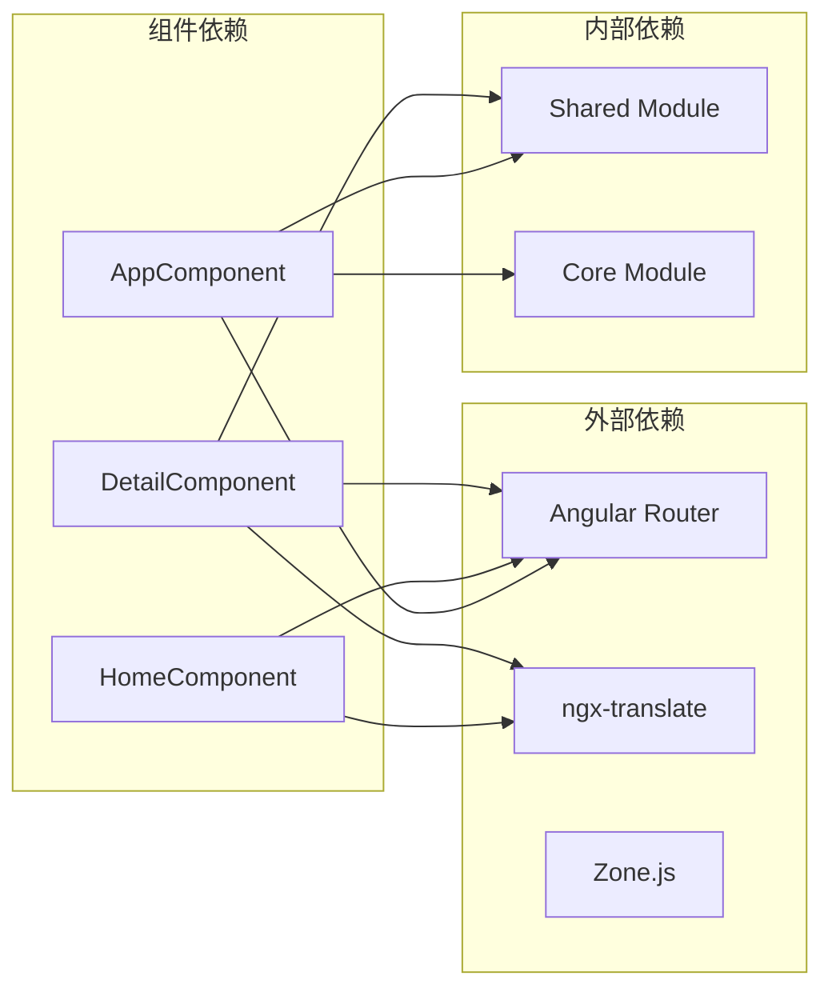

# 详情组件

<cite>
**本文档引用的文件**
- [detail.component.ts](file://src/app/detail/detail.component.ts)
- [detail.component.html](file://src/app/detail/detail.component.html)
- [detail.component.scss](file://src/app/detail/detail.component.scss)
- [detail.component.spec.ts](file://src/app/detail/detail.component.spec.ts)
- [home.component.ts](file://src/app/home/home.component.ts)
- [home.component.html](file://src/app/home/home.component.html)
- [app.component.ts](file://src/app/app.component.ts)
- [app.component.html](file://src/app/app.component.html)
- [main.ts](file://src/main.ts)
- [en.json](file://src/assets/i18n/en.json)
- [shared.module.ts](file://src/app/shared/shared.module.ts)
- [page-not-found.component.ts](file://src/app/shared/components/page-not-found/page-not-found.component.ts)
</cite>

## 目录
1. [简介](#简介)
2. [项目结构](#项目结构)
3. [核心组件](#核心组件)
4. [架构概览](#架构概览)
5. [详细组件分析](#详细组件分析)
6. [依赖关系分析](#依赖关系分析)
7. [性能考虑](#性能考虑)
8. [故障排除指南](#故障排除指南)
9. [结论](#结论)

## 简介

详情组件（DetailComponent）是 Angular 应用中的一个独立组件，负责显示详情页面的内容。该组件采用现代 Angular 架构模式，使用 standalone 组件设计，具备完整的国际化支持和路由导航功能。本文档将深入分析该组件的实现细节，包括组件装饰器配置、模板结构、样式设计、路由参数处理机制、数据绑定策略、用户交互逻辑以及状态管理方式。

## 项目结构

该项目采用模块化的 Angular 应用架构，详情组件位于 `src/app/detail/` 目录下，与主页组件并列组织。整个应用通过路由系统进行页面导航，详情组件通过路由配置与主页组件形成完整的导航体系。

**图表来源**
- [main.ts:32-50](file://src/main.ts#L32-L50)
- [app.component.html:1-2](file://src/app/app.component.html#L1-L2)

**章节来源**
- [main.ts:1-56](file://src/main.ts#L1-L56)
- [app.component.ts:1-35](file://src/app/app.component.ts#L1-L35)

## 核心组件

详情组件是一个功能简洁但结构完整的独立组件，具有以下核心特性：

### 组件装饰器配置
- **选择器**: `app-detail`
- **模板**: 使用独立的 HTML 文件
- **样式**: 使用 SCSS 样式文件
- **独立性**: 采用 standalone 设计模式
- **导入模块**: 集成 RouterLink 和 TranslateModule

### 基础功能实现
组件当前实现了基本的生命周期钩子，在初始化时输出调试信息，为后续功能扩展提供了基础框架。

**章节来源**
- [detail.component.ts:5-11](file://src/app/detail/detail.component.ts#L5-L11)
- [detail.component.ts:16-18](file://src/app/detail/detail.component.ts#L16-L18)

## 架构概览

详情组件在整个应用架构中扮演着重要的角色，它通过路由系统与主页组件形成完整的导航体验，并通过国际化服务提供多语言支持。

**图表来源**
- [home.component.html:6-6](file://src/app/home/home.component.html#L6-L6)
- [main.ts:42-44](file://src/main.ts#L42-L44)
- [detail.component.html:3-3](file://src/app/detail/detail.component.html#L3-L3)

## 详细组件分析

### 组件类结构分析

**图表来源**
- [detail.component.ts:12-18](file://src/app/detail/detail.component.ts#L12-L18)
- [home.component.ts:12-16](file://src/app/home/home.component.ts#L12-L16)
- [app.component.ts:14-33](file://src/app/app.component.ts#L14-L33)

### 模板结构分析

详情组件的模板采用了简洁的设计模式，包含以下关键元素：

#### 结构层次
- **容器元素**: 提供页面布局的基础结构
- **标题元素**: 使用国际化管道显示本地化标题
- **导航链接**: 提供返回主页的导航功能

#### 数据绑定策略
组件使用 Angular 的插值表达式和管道机制实现数据绑定：
- **插值表达式**: `{{ 'PAGES.DETAIL.TITLE' | translate }}`
- **管道操作**: `translate` 管道处理国际化文本
- **属性绑定**: `routerLink` 属性绑定导航路径

**章节来源**
- [detail.component.html:1-7](file://src/app/detail/detail.component.html#L1-L7)

### 样式设计分析

详情组件的样式文件采用了最小化的设计原则：

#### 样式特点
- **`:host` 容器**: 提供组件宿主元素的基础样式占位
- **SCSS 支持**: 利用现代 CSS 预处理器功能
- **模块化设计**: 独立的样式文件便于维护和复用

#### 扩展建议
虽然当前样式较为简单，但为未来的功能扩展预留了充足的空间。

**章节来源**
- [detail.component.scss:1-3](file://src/app/detail/detail.component.scss#L1-L3)

### 路由集成分析

详情组件通过应用的路由配置实现无缝集成：

#### 路由配置
- **路径定义**: `/detail` 路径映射到详情组件
- **组件关联**: 路由直接加载 DetailComponent
- **默认路由**: 应用启动时重定向到主页

#### 导航机制
- **程序化导航**: 通过 `routerLink` 指令实现声明式导航
- **路径参数**: 支持动态路由参数传递
- **导航守卫**: 可扩展的路由保护机制

**章节来源**
- [main.ts:42-44](file://src/main.ts#L42-L44)
- [home.component.html:6-6](file://src/app/home/home.component.html#L6-L6)

### 国际化集成分析

详情组件深度集成了 ngx-translate 国际化解决方案：

#### 翻译资源配置
- **翻译文件**: `src/assets/i18n/en.json`
- **键值结构**: `PAGES.DETAIL.TITLE` 和 `PAGES.DETAIL.BACK_TO_HOME`
- **默认语言**: 英语作为后备语言

#### 使用模式
- **模板内使用**: 在 HTML 模板中直接使用翻译管道
- **组件内使用**: 可在 TypeScript 代码中访问翻译服务
- **动态切换**: 支持运行时语言切换

**章节来源**
- [en.json:7-10](file://src/assets/i18n/en.json#L7-L10)
- [detail.component.html:3-3](file://src/app/detail/detail.component.html#L3-L3)

### 测试策略分析

详情组件配备了完整的测试套件：

#### 单元测试覆盖
- **组件创建**: 验证组件实例化成功
- **DOM 渲染**: 确保标题正确渲染到 h1 元素
- **依赖注入**: 测试路由和翻译模块的正确配置

#### 测试环境配置
- **Standalone 测试**: 使用 Angular 14+ 的独立组件测试模式
- **路由模拟**: 通过 provideRouter 提供路由服务
- **翻译服务**: 配置完整的翻译模块

**章节来源**
- [detail.component.spec.ts:11-21](file://src/app/detail/detail.component.spec.ts#L11-L21)

## 依赖关系分析

详情组件的依赖关系相对简单但功能完整：

**图表来源**
- [detail.component.ts:1-3](file://src/app/detail/detail.component.ts#L1-L3)
- [main.ts:14-15](file://src/main.ts#L14-L15)
- [shared.module.ts:8-11](file://src/app/shared/shared.module.ts#L8-L11)

### 直接依赖分析

详情组件的直接依赖包括：
- **@angular/core**: Angular 核心功能
- **@angular/router**: 路由导航功能
- **@ngx-translate/core**: 国际化支持

### 间接依赖分析

通过共享模块和核心模块提供的间接依赖：
- **CommonModule**: Angular 基础功能
- **FormsModule**: 表单处理能力
- **ElectronService**: 桌面应用集成

**章节来源**
- [detail.component.ts:1-3](file://src/app/detail/detail.component.ts#L1-L3)
- [shared.module.ts:8-11](file://src/app/shared/shared.module.ts#L8-L11)

## 性能考虑

基于当前实现的性能特征分析：

### 当前性能特点
- **懒加载**: 组件按需加载，无额外的懒加载配置
- **内存占用**: 简单组件，内存占用极低
- **渲染效率**: DOM 结构简单，渲染开销小

### 优化建议
针对未来功能扩展的性能优化方向：

#### 代码分割
- **路由级懒加载**: 为详情组件配置懒加载
- **按需导入**: 仅导入必要的模块和功能

#### 内存管理
- **生命周期优化**: 合理使用 ngOnDestroy 进行清理
- **订阅管理**: 注意取消异步订阅避免内存泄漏

#### 渲染优化
- **变更检测**: 考虑使用 OnPush 策略优化变更检测
- **虚拟滚动**: 对大量数据展示使用虚拟滚动技术

## 故障排除指南

### 常见问题诊断

#### 路由导航问题
**症状**: 点击导航链接无法跳转
**排查步骤**:
1. 检查路由配置是否正确
2. 验证 routerLink 路径格式
3. 确认路由出口存在

#### 国际化显示问题
**症状**: 页面显示翻译键而非实际文本
**排查步骤**:
1. 检查翻译文件路径配置
2. 验证翻译键值是否存在
3. 确认翻译服务初始化完成

#### 组件加载问题
**症状**: 控制台出现组件未找到错误
**排查步骤**:
1. 检查组件导入路径
2. 验证 standalone 组件配置
3. 确认模块导出声明

**章节来源**
- [main.ts:32-50](file://src/main.ts#L32-L50)
- [detail.component.spec.ts:27-32](file://src/app/detail/detail.component.spec.ts#L27-L32)

### 调试技巧

#### 开发工具使用
- **Angular DevTools**: 分析组件树和数据流
- **浏览器开发者工具**: 检查网络请求和控制台日志
- **路由调试**: 使用 Angular Router 仪表板

#### 日志记录
- **组件生命周期**: 利用 ngOnInit 输出调试信息
- **路由事件**: 监听路由变化事件
- **国际化状态**: 跟踪翻译服务状态

## 结论

详情组件展现了现代 Angular 应用的最佳实践：简洁的架构设计、完整的国际化支持、清晰的路由集成和全面的测试覆盖。该组件为复杂数据展示和交互功能提供了良好的基础框架。

### 主要优势
- **架构清晰**: 独立组件设计符合现代 Angular 开发规范
- **功能完整**: 集成了路由导航、国际化和测试支持
- **易于扩展**: 为复杂功能扩展预留了充足空间
- **维护友好**: 清晰的代码结构便于长期维护

### 发展方向
建议在现有基础上进一步增强：
- **数据绑定**: 添加响应式表单和数据验证
- **状态管理**: 集成 NgRx 或 RxJS 进行状态管理
- **性能优化**: 实施懒加载和变更检测优化
- **用户体验**: 增强交互反馈和加载状态处理

该组件为构建企业级 Angular 应用奠定了坚实的基础，其设计理念和实现模式值得在更大规模的应用中推广使用。