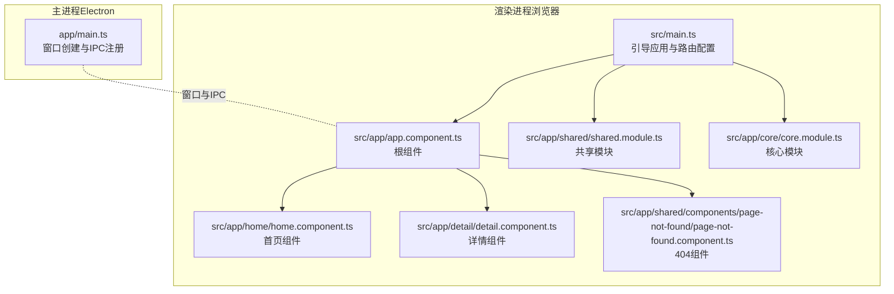
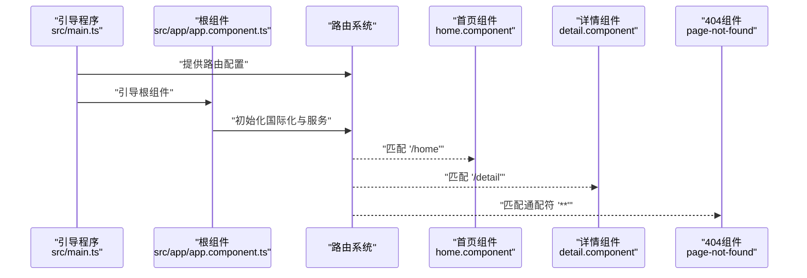
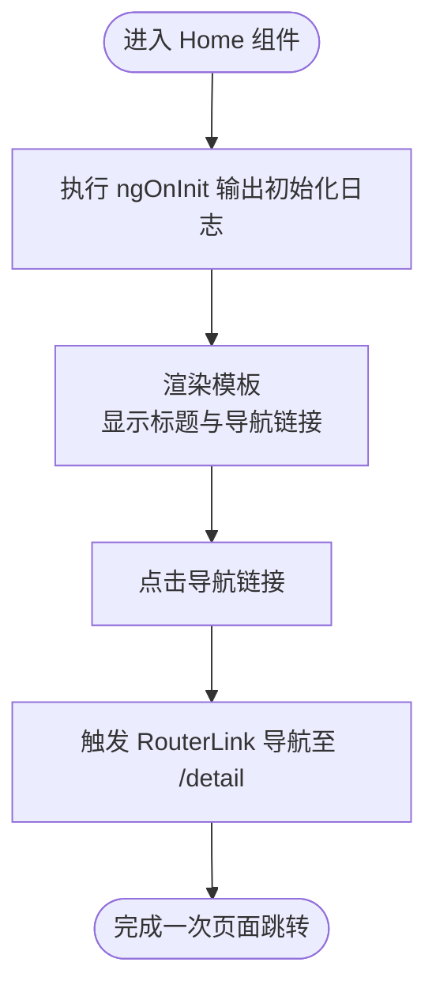
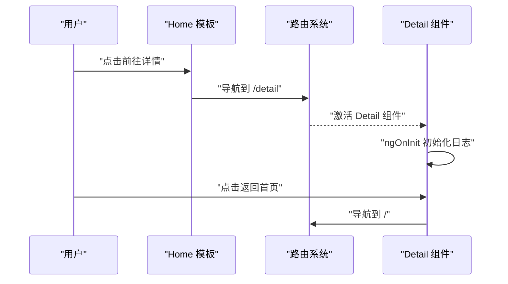
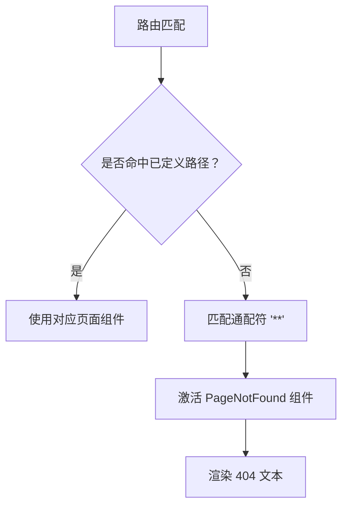
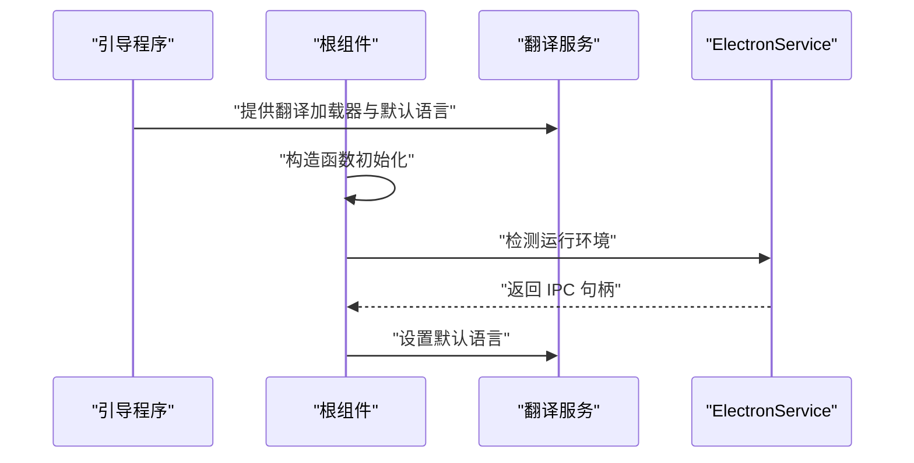
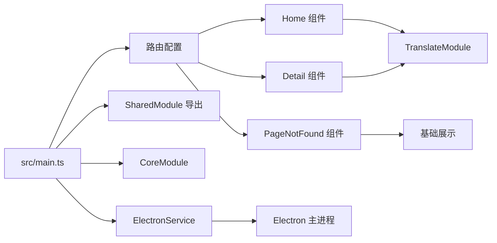

# 页面组件系统

<cite>
**本文引用的文件**
- [src/main.ts](file://src/main.ts)
- [src/app/app.component.ts](file://src/app/app.component.ts)
- [src/app/app.component.html](file://src/app/app.component.html)
- [src/app/home/home.component.ts](file://src/app/home/home.component.ts)
- [src/app/home/home.component.html](file://src/app/home/home.component.html)
- [src/app/detail/detail.component.ts](file://src/app/detail/detail.component.ts)
- [src/app/detail/detail.component.html](file://src/app/detail/detail.component.html)
- [src/app/shared/components/page-not-found/page-not-found.component.ts](file://src/app/shared/components/page-not-found/page-not-found.component.ts)
- [src/app/shared/components/page-not-found/page-not-found.component.html](file://src/app/shared/components/page-not-found/page-not-found.component.html)
- [src/app/shared/shared.module.ts](file://src/app/shared/shared.module.ts)
- [src/app/core/core.module.ts](file://src/app/core/core.module.ts)
- [src/app/core/services/electron/electron.service.ts](file://src/app/core/services/electron/electron.service.ts)
- [src/environments/environment.ts](file://src/environments/environment.ts)
- [angular.json](file://angular.json)
- [package.json](file://package.json)
- [app/main.ts](file://app/main.ts)
</cite>

## 目录
1. [简介](#简介)
2. [项目结构](#项目结构)
3. [核心组件](#核心组件)
4. [架构总览](#架构总览)
5. [详细组件分析](#详细组件分析)
6. [依赖分析](#依赖分析)
7. [性能考虑](#性能考虑)
8. [故障排查指南](#故障排查指南)
9. [结论](#结论)
10. [附录](#附录)

## 简介
本文件面向页面组件系统，围绕 Home 组件与 Detail 组件的功能实现、状态管理与用户交互进行深入解析；同时阐述 NotFound 页面组件的实现机制与路由配置策略，说明组件间导航模式、参数传递与状态同步方式，梳理生命周期管理、事件处理与数据绑定策略，并给出组件复用、扩展与自定义的指导原则，最后提供开发最佳实践与性能优化建议。

## 项目结构
该工程采用 Angular 应用与 Electron 主进程结合的架构：渲染进程通过 Angular 路由驱动页面切换，Electron 主进程负责窗口创建与 IPC 通信。路由在应用启动时集中配置，Home/Detail 为主页面，NotFound 作为兜底页。国际化通过 @ngx-translate 提供，模块化组织包括共享模块与核心模块。

图表来源
- [src/main.ts:32-50](file://src/main.ts#L32-L50)
- [src/app/app.component.ts:14-34](file://src/app/app.component.ts#L14-L34)
- [src/app/home/home.component.ts:12-18](file://src/app/home/home.component.ts#L12-L18)
- [src/app/detail/detail.component.ts:12-20](file://src/app/detail/detail.component.ts#L12-L20)
- [src/app/shared/components/page-not-found/page-not-found.component.ts:9-15](file://src/app/shared/components/page-not-found/page-not-found.component.ts#L9-L15)
- [app/main.ts:9-62](file://app/main.ts#L9-L62)

章节来源
- [src/main.ts:21-56](file://src/main.ts#L21-L56)
- [src/app/app.component.ts:7-34](file://src/app/app.component.ts#L7-L34)
- [angular.json:24-82](file://angular.json#L24-L82)
- [package.json:27-47](file://package.json#L27-L47)

## 核心组件
- 根组件与引导
  - 根组件负责初始化国际化服务、注入 Electron 服务与翻译服务，并在构造函数中打印运行环境信息。
  - 应用通过引导函数集中提供路由、HTTP 客户端、翻译加载器与模块导入。
- 页面组件
  - Home/Detail 均为独立组件，使用 standalone 模式，导入 RouterLink 与 TranslateModule，用于导航与本地化。
  - 两个页面通过模板中的 routerLink 实现互相跳转。
- NotFound 组件
  - 作为通配符路由的兜底页面，仅负责展示“page-not-found works!”文本。
- 共享与核心模块
  - 共享模块导出 TranslateModule 与 FormsModule，便于页面组件直接使用。
  - 核心模块为空模块，用于未来扩展核心服务或指令。

章节来源
- [src/app/app.component.ts:14-34](file://src/app/app.component.ts#L14-L34)
- [src/main.ts:21-56](file://src/main.ts#L21-L56)
- [src/app/home/home.component.ts:5-11](file://src/app/home/home.component.ts#L5-L11)
- [src/app/detail/detail.component.ts:5-11](file://src/app/detail/detail.component.ts#L5-L11)
- [src/app/shared/components/page-not-found/page-not-found.component.ts:3-8](file://src/app/shared/components/page-not-found/page-not-found.component.ts#L3-L8)
- [src/app/shared/shared.module.ts:8-13](file://src/app/shared/shared.module.ts#L8-L13)
- [src/app/core/core.module.ts:4-10](file://src/app/core/core.module.ts#L4-L10)

## 架构总览
应用采用“引导层 + 路由层 + 页面层 + 共享层”的分层设计。引导层在 src/main.ts 中完成路由与服务提供；路由层在 provideRouter 中声明路径映射；页面层由 Home/Detail/NotFound 组成；共享层提供国际化与表单支持。

图表来源
- [src/main.ts:32-50](file://src/main.ts#L32-L50)
- [src/app/app.component.ts:18-32](file://src/app/app.component.ts#L18-L32)
- [src/app/home/home.component.ts:12-18](file://src/app/home/home.component.ts#L12-L18)
- [src/app/detail/detail.component.ts:12-18](file://src/app/detail/detail.component.ts#L12-L18)
- [src/app/shared/components/page-not-found/page-not-found.component.ts:9-15](file://src/app/shared/components/page-not-found/page-not-found.component.ts#L9-L15)

## 详细组件分析

### Home 组件
- 功能与模板
  - 展示标题与“前往详情”链接，标题与按钮文案通过管道进行本地化。
- 导航与交互
  - 使用 RouterLink 导航到 /detail，实现页面间跳转。
- 生命周期
  - 在 ngOnInit 中输出初始化日志，便于调试与观测生命周期。
- 数据绑定
  - 使用管道进行本地化字符串绑定，未涉及复杂双向绑定。

图表来源
- [src/app/home/home.component.ts:12-18](file://src/app/home/home.component.ts#L12-L18)
- [src/app/home/home.component.html:1-7](file://src/app/home/home.component.html#L1-7)

章节来源
- [src/app/home/home.component.ts:5-18](file://src/app/home/home.component.ts#L5-L18)
- [src/app/home/home.component.html:1-7](file://src/app/home/home.component.html#L1-7)

### Detail 组件
- 功能与模板
  - 展示标题与“返回首页”链接，标题通过本地化管道绑定。
- 导航与交互
  - 使用 RouterLink 返回 /home。
- 生命周期
  - 在 ngOnInit 中输出初始化日志。
- 数据绑定
  - 本地化字符串绑定，无复杂数据流。

图表来源
- [src/app/detail/detail.component.ts:12-18](file://src/app/detail/detail.component.ts#L12-L18)
- [src/app/detail/detail.component.html:1-7](file://src/app/detail/detail.component.html#L1-7)
- [src/main.ts:32-50](file://src/main.ts#L32-L50)

章节来源
- [src/app/detail/detail.component.ts:5-20](file://src/app/detail/detail.component.ts#L5-L20)
- [src/app/detail/detail.component.html:1-7](file://src/app/detail/detail.component.html#L1-7)

### NotFound 组件（404）
- 实现机制
  - 作为通配符路由的兜底组件，当路径不匹配任何已定义路由时被激活。
- 模板与样式
  - 模板输出固定提示文本，用于标识 404 页面。
- 路由配置
  - 在路由配置中以通配符路径指向该组件，确保所有未匹配路径均能正确跳转。

图表来源
- [src/main.ts:46-49](file://src/main.ts#L46-L49)
- [src/app/shared/components/page-not-found/page-not-found.component.ts:9-15](file://src/app/shared/components/page-not-found/page-not-found.component.ts#L9-L15)
- [src/app/shared/components/page-not-found/page-not-found.component.html:1-4](file://src/app/shared/components/page-not-found/page-not-found.component.html#L1-4)

章节来源
- [src/main.ts:46-49](file://src/main.ts#L46-L49)
- [src/app/shared/components/page-not-found/page-not-found.component.ts:3-15](file://src/app/shared/components/page-not-found/page-not-found.component.ts#L3-L15)
- [src/app/shared/components/page-not-found/page-not-found.component.html:1-4](file://src/app/shared/components/page-not-found/page-not-found.component.html#L1-4)

### 根组件与国际化
- 根组件职责
  - 注入 ElectronService 与 TranslateService，在构造函数中设置默认语言并打印运行环境信息。
- 国际化配置
  - 引导程序提供翻译服务与加载器，指定资源前缀与后缀，支持多语言加载。
- Electron 集成
  - 通过 ElectronService 判断运行环境，调用 IPC 获取版本号等信息。

图表来源
- [src/app/app.component.ts:14-34](file://src/app/app.component.ts#L14-L34)
- [src/main.ts:21-31](file://src/main.ts#L21-L31)
- [src/app/core/services/electron/electron.service.ts:12-56](file://src/app/core/services/electron/electron.service.ts#L12-L56)

章节来源
- [src/app/app.component.ts:14-34](file://src/app/app.component.ts#L14-L34)
- [src/main.ts:21-31](file://src/main.ts#L21-L31)
- [src/app/core/services/electron/electron.service.ts:12-56](file://src/app/core/services/electron/electron.service.ts#L12-L56)

## 依赖分析
- 路由依赖
  - 路由在引导阶段集中提供，Home/Detail/NotFound 分别映射到不同路径，通配符兜底。
- 组件依赖
  - Home/Detail 依赖 RouterLink 与 TranslateModule；NotFound 为独立组件。
- 模块依赖
  - 共享模块导出 TranslateModule 与 FormsModule，供页面组件直接使用。
- 运行时依赖
  - Electron 主进程负责窗口创建与 IPC 注册，渲染进程通过 ElectronService 访问 IPC。

图表来源
- [src/main.ts:32-50](file://src/main.ts#L32-L50)
- [src/app/shared/shared.module.ts:8-13](file://src/app/shared/shared.module.ts#L8-L13)
- [src/app/core/core.module.ts:4-10](file://src/app/core/core.module.ts#L4-L10)
- [app/main.ts:64-93](file://app/main.ts#L64-L93)

章节来源
- [src/main.ts:32-50](file://src/main.ts#L32-L50)
- [src/app/shared/shared.module.ts:8-13](file://src/app/shared/shared.module.ts#L8-L13)
- [app/main.ts:64-93](file://app/main.ts#L64-L93)

## 性能考虑
- 启动与构建
  - 开发与生产配置分别控制优化级别、输出哈希与 SourceMap，建议在生产环境启用 AOT 与优化。
- 路由与懒加载
  - 当前路由为声明式配置，未见懒加载；随着页面增多可考虑按需加载以减少首屏体积。
- 国际化
  - 翻译资源按需加载，避免一次性加载全部语言包；建议对大体量文案进行拆分与延迟加载。
- 渲染与变更检测
  - 使用 standalone 组件降低模块开销；避免在模板中进行重型计算，尽量在组件中预处理数据。
- Electron 环境
  - 主进程与渲染进程分离，IPC 调用应避免频繁与大数据传输；必要时采用批量请求或缓存策略。

章节来源
- [angular.json:47-82](file://angular.json#L47-L82)
- [package.json:27-47](file://package.json#L27-L47)

## 故障排查指南
- 路由不生效或 404
  - 检查路由配置是否包含通配符兜底；确认路径大小写与重定向规则。
- 导航异常
  - 确认模板中 routerLink 的目标路径与路由配置一致；检查 RouterLink 是否正确导入。
- 国际化无效
  - 检查翻译资源路径与文件命名；确认引导程序提供的翻译加载器配置正确。
- Electron 环境问题
  - 确认 ElectronService 的 isElectron 判断与主进程 IPC 注册；检查主进程窗口加载 URL 与静态资源路径。
- 组件生命周期
  - 如需观察初始化顺序，可在各组件 ngOnInit 中添加日志；注意组件销毁时的清理逻辑。

章节来源
- [src/main.ts:32-50](file://src/main.ts#L32-L50)
- [src/app/home/home.component.ts:12-18](file://src/app/home/home.component.ts#L12-L18)
- [src/app/detail/detail.component.ts:12-18](file://src/app/detail/detail.component.ts#L12-L18)
- [src/app/shared/components/page-not-found/page-not-found.component.ts:9-15](file://src/app/shared/components/page-not-found/page-not-found.component.ts#L9-L15)
- [src/app/core/services/electron/electron.service.ts:12-56](file://src/app/core/services/electron/electron.service.ts#L12-L56)
- [app/main.ts:64-93](file://app/main.ts#L64-L93)

## 结论
本页面组件系统以简洁清晰的路由与组件结构为基础，结合 Electron 环境与国际化能力，提供了可扩展的页面层设计。Home/Detail 通过 RouterLink 实现简单导航，NotFound 作为兜底保障用户体验。建议后续引入懒加载、状态管理方案与更完善的错误边界，以进一步提升性能与可维护性。

## 附录
- 开发与构建脚本
  - 包含开发、构建、测试、E2E 与 Electron 打包脚本，便于本地与 CI/CD 流程集成。
- 环境配置
  - APP_CONFIG 控制生产模式与环境标识，配合环境文件实现差异化配置。

章节来源
- [package.json:27-47](file://package.json#L27-L47)
- [src/environments/environment.ts:1-5](file://src/environments/environment.ts#L1-L5)