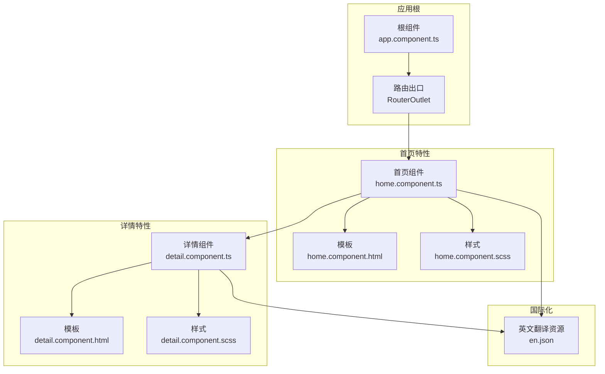
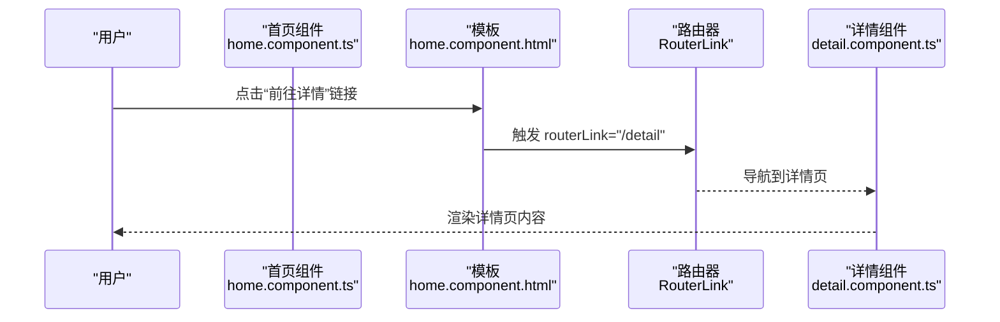
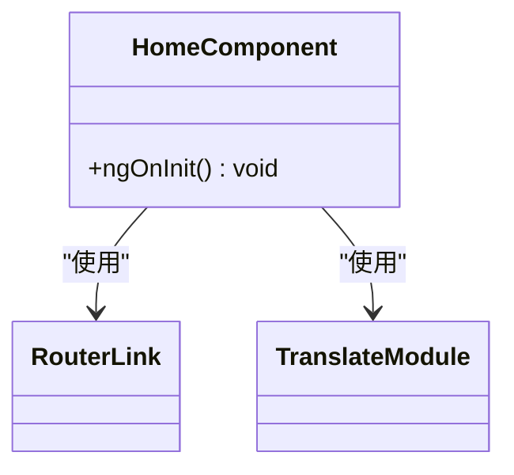
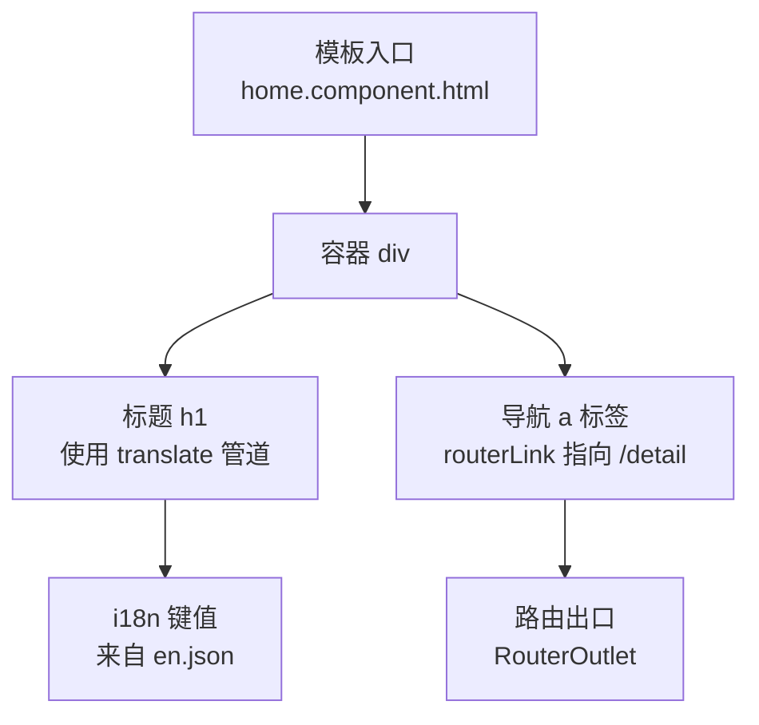
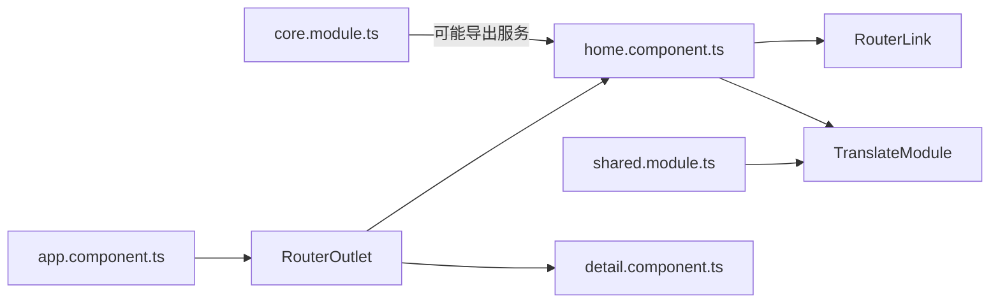

# 首页组件

<cite>
**本文引用的文件**
- [home.component.ts](file://src/app/home/home.component.ts)
- [home.component.html](file://src/app/home/home.component.html)
- [home.component.scss](file://src/app/home/home.component.scss)
- [home.component.spec.ts](file://src/app/home/home.component.spec.ts)
- [detail.component.ts](file://src/app/detail/detail.component.ts)
- [detail.component.html](file://src/app/detail/detail.component.html)
- [detail.component.scss](file://src/app/detail/detail.component.scss)
- [app.component.ts](file://src/app/app.component.ts)
- [shared.module.ts](file://src/app/shared/shared.module.ts)
- [core.module.ts](file://src/app/core/core.module.ts)
- [electron.service.ts](file://src/app/core/services/electron/electron.service.ts)
- [en.json](file://src/assets/i18n/en.json)
- [environment.ts](file://src/environments/environment.ts)
- [angular.json](file://angular.json)
</cite>

## 目录
1. [简介](#简介)
2. [项目结构](#项目结构)
3. [核心组件](#核心组件)
4. [架构总览](#架构总览)
5. [组件详细分析](#组件详细分析)
6. [依赖分析](#依赖分析)
7. [性能考虑](#性能考虑)
8. [故障排查指南](#故障排查指南)
9. [结论](#结论)
10. [附录](#附录)

## 简介
本文件围绕首页组件 HomeComponent 提供系统化、可操作的开发与维护指南。内容涵盖组件装饰器配置、导入模块与依赖注入、生命周期钩子执行时机与职责、RouterLink 导航指令与路由配置关系、模板结构与样式实现、扩展与自定义指导原则、最佳实践与性能优化建议等。目标是帮助开发者快速理解并高效迭代首页功能。

## 项目结构
首页组件位于应用的 home 特性目录下，采用独立组件（standalone）设计，直接声明所需依赖模块与指令，减少对共享模块的耦合。根组件负责承载路由出口，页面间通过 RouterLink 实现无刷新导航。

图表来源
- [app.component.ts:1-35](file://src/app/app.component.ts#L1-L35)
- [home.component.ts:1-19](file://src/app/home/home.component.ts#L1-L19)
- [home.component.html:1-8](file://src/app/home/home.component.html#L1-L8)
- [home.component.scss:1-3](file://src/app/home/home.component.scss#L1-L3)
- [detail.component.ts:1-21](file://src/app/detail/detail.component.ts#L1-L21)
- [detail.component.html:1-8](file://src/app/detail/detail.component.html#L1-L8)
- [detail.component.scss:1-3](file://src/app/detail/detail.component.scss#L1-L3)
- [en.json:1-13](file://src/assets/i18n/en.json#L1-L13)

章节来源
- [app.component.ts:1-35](file://src/app/app.component.ts#L1-L35)
- [home.component.ts:1-19](file://src/app/home/home.component.ts#L1-L19)
- [detail.component.ts:1-21](file://src/app/detail/detail.component.ts#L1-L21)
- [en.json:1-13](file://src/assets/i18n/en.json#L1-L13)

## 核心组件
本节聚焦 HomeComponent 的实现要点：装饰器配置、依赖导入、生命周期钩子与测试验证。

- 组件装饰器与配置
  - 选择器与模板/样式路径：用于在父级模板中以标签形式引入组件。
  - 独立组件声明：通过 standalone: true 与 imports 显式声明依赖的指令与模块，避免全局共享模块污染。
  - 导入依赖：RouterLink 用于导航；TranslateModule 用于国际化文本渲染。
- 生命周期钩子
  - ngOnInit：组件初始化时触发，适合进行一次性逻辑（如日志输出、初始化标志位等）。当前实现仅记录初始化信息。
- 测试用例
  - 使用 provideRouter([]) 提供空路由配置，确保 RouterLink 在测试环境中可用。
  - 断言标题文本包含预期键值，验证 i18n 管道与模板绑定工作正常。

章节来源
- [home.component.ts:1-19](file://src/app/home/home.component.ts#L1-L19)
- [home.component.spec.ts:1-34](file://src/app/home/home.component.spec.ts#L1-L34)

## 架构总览
首页与详情页通过 RouterLink 建立单页应用内的导航关系，根组件承载路由出口，形成“无刷新切换”的用户体验。国际化资源由 @ngx-translate 提供，键值在模板中通过管道进行解析。

图表来源
- [home.component.html:1-8](file://src/app/home/home.component.html#L1-L8)
- [detail.component.ts:1-21](file://src/app/detail/detail.component.ts#L1-L21)

章节来源
- [home.component.html:1-8](file://src/app/home/home.component.html#L1-L8)
- [detail.component.ts:1-21](file://src/app/detail/detail.component.ts#L1-L21)

## 组件详细分析

### 组件类与装饰器
- 装饰器配置要点
  - standalone: true：组件自足，无需通过 NgModule 声明即可运行。
  - imports: [RouterLink, TranslateModule]：显式声明模板中使用的指令与模块，降低全局依赖。
  - 模板与样式：分别指向同目录下的 HTML 与 SCSS 文件。
- 生命周期
  - ngOnInit：当前版本用于输出初始化日志，实际业务可在此处进行数据加载或状态初始化。

图表来源
- [home.component.ts:1-19](file://src/app/home/home.component.ts#L1-L19)

章节来源
- [home.component.ts:1-19](file://src/app/home/home.component.ts#L1-L19)

### 模板结构与国际化
- 结构组成
  - 容器层：外层容器用于布局与间距控制。
  - 标题层：使用 i18n 管道渲染多语言标题文本。
  - 导航层：使用 RouterLink 指令跳转至详情页。
- 国际化资源
  - 英文资源文件提供键值映射，模板中通过管道读取对应文案。

图表来源
- [home.component.html:1-8](file://src/app/home/home.component.html#L1-L8)
- [en.json:1-13](file://src/assets/i18n/en.json#L1-L13)

章节来源
- [home.component.html:1-8](file://src/app/home/home.component.html#L1-L8)
- [en.json:1-13](file://src/assets/i18n/en.json#L1-L13)

### 样式实现
- 当前样式文件为空，使用 Angular 的 :host 选择器可作为组件根元素的样式占位。
- 建议在实际项目中结合 SCSS 变量与主题规范，统一字体、间距与颜色体系。

章节来源
- [home.component.scss:1-3](file://src/app/home/home.component.scss#L1-L3)

### 依赖注入与服务集成
- 全局服务示例：根组件中注入 ElectronService 与 TranslateService，演示了依赖注入与平台能力检测的模式。
- 该模式可迁移至 HomeComponent：若需要访问系统能力或进行跨语言切换，可在构造函数中注入相应服务，并在 ngOnInit 中执行初始化逻辑。

章节来源
- [app.component.ts:1-35](file://src/app/app.component.ts#L1-L35)
- [electron.service.ts:1-57](file://src/app/core/services/electron/electron.service.ts#L1-L57)

### 测试与验证
- 测试配置
  - 使用 provideRouter([]) 提供空路由环境，确保 RouterLink 不抛错。
  - 使用 TranslateModule.forRoot() 注入翻译模块，保证模板中的 i18n 管道可用。
- 关键断言
  - 组件实例存在性验证。
  - 标题文本包含预期键值，间接验证 i18n 管道与模板绑定。

章节来源
- [home.component.spec.ts:1-34](file://src/app/home/home.component.spec.ts#L1-L34)

## 依赖分析
- 组件内依赖
  - RouterLink：用于模板中的导航指令。
  - TranslateModule：用于模板中的国际化管道。
- 模块与共享
  - SharedModule：集中导出 TranslateModule 与表单模块，便于复用。
  - CoreModule：基础模块，通常放置通用服务与工具。
- 根组件与路由
  - Root 组件使用 RouterOutlet 承载路由出口，Home/Detail 组件通过 RouterLink 进行导航。

图表来源
- [home.component.ts:1-19](file://src/app/home/home.component.ts#L1-L19)
- [shared.module.ts:1-14](file://src/app/shared/shared.module.ts#L1-L14)
- [core.module.ts:1-11](file://src/app/core/core.module.ts#L1-L11)
- [app.component.ts:1-35](file://src/app/app.component.ts#L1-L35)
- [detail.component.ts:1-21](file://src/app/detail/detail.component.ts#L1-L21)

章节来源
- [home.component.ts:1-19](file://src/app/home/home.component.ts#L1-L19)
- [shared.module.ts:1-14](file://src/app/shared/shared.module.ts#L1-L14)
- [core.module.ts:1-11](file://src/app/core/core.module.ts#L1-L11)
- [app.component.ts:1-35](file://src/app/app.component.ts#L1-L35)
- [detail.component.ts:1-21](file://src/app/detail/detail.component.ts#L1-L21)

## 性能考虑
- 独立组件的优势
  - 减少 NgModule 声明与编译负担，提升构建效率。
  - 明确依赖清单，便于 Tree-Shaking 与按需加载。
- 模板与样式
  - 将复杂计算移至组件逻辑，模板中尽量使用简单绑定与管道。
  - 样式使用 SCSS 变量与混入，避免重复定义。
- 国际化
  - 合理拆分翻译键值，避免过长字符串导致渲染压力。
  - 在高频更新场景中，优先使用静态键值与缓存策略。
- 路由与导航
  - 使用 RouterLink 替代编程式导航可减少不必要的变更检测。
  - 对于深层嵌套路由，建议在根组件集中管理路由出口，保持视图栈简洁。

## 故障排查指南
- RouterLink 未生效
  - 确认组件已导入 RouterLink 或在共享模块中导出。
  - 在测试环境中使用 provideRouter([]) 提供空路由配置。
- 国际化文本不显示
  - 检查 i18n 键值是否存在于 en.json。
  - 确保 TranslateModule 已正确导入并初始化。
- 初始化日志未出现
  - 确认组件已被正确挂载到路由出口。
  - 检查 ngOnInit 是否被调用（可通过测试用例验证）。
- 平台能力检测异常
  - 若涉及 Electron 能力，确认运行环境与服务注入逻辑一致。

章节来源
- [home.component.spec.ts:1-34](file://src/app/home/home.component.spec.ts#L1-L34)
- [en.json:1-13](file://src/assets/i18n/en.json#L1-L13)
- [app.component.ts:1-35](file://src/app/app.component.ts#L1-L35)

## 结论
HomeComponent 采用独立组件设计，明确声明依赖，具备良好的可维护性与可扩展性。通过 RouterLink 与 RouterOutlet 实现页面导航，配合 @ngx-translate 实现国际化文案展示。建议在实际开发中遵循“逻辑后移、模板简化、样式模块化”的原则，并结合测试用例保障关键行为的稳定性。

## 附录
- 开发与构建配置参考
  - 构建与开发服务器配置、测试运行器与覆盖率报告等，详见工程配置文件。

章节来源
- [angular.json:1-188](file://angular.json#L1-L188)