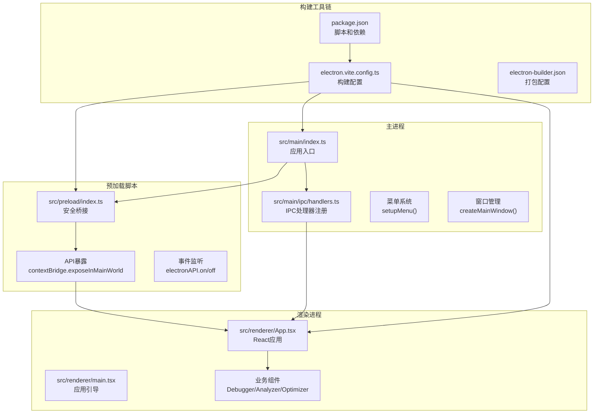
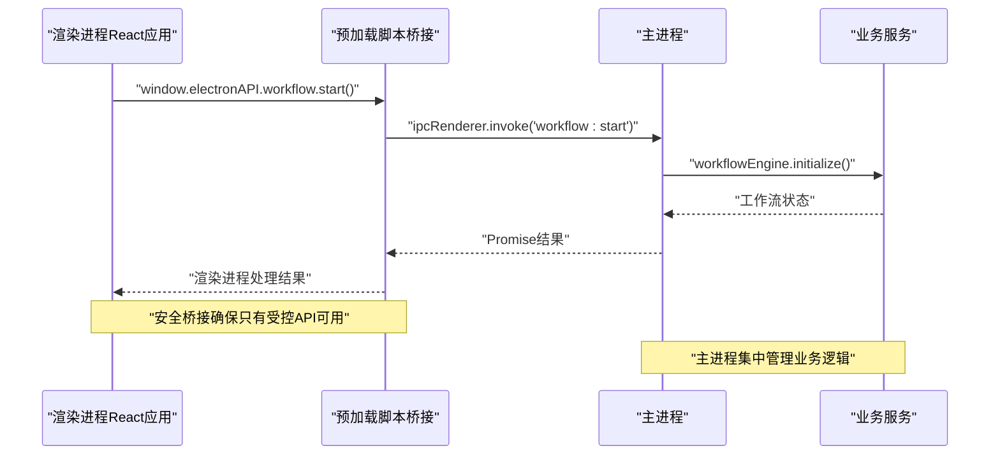
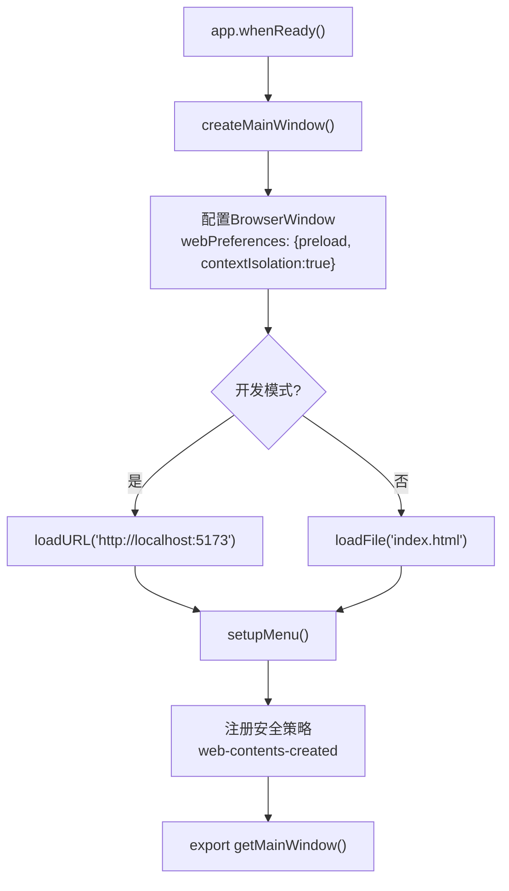
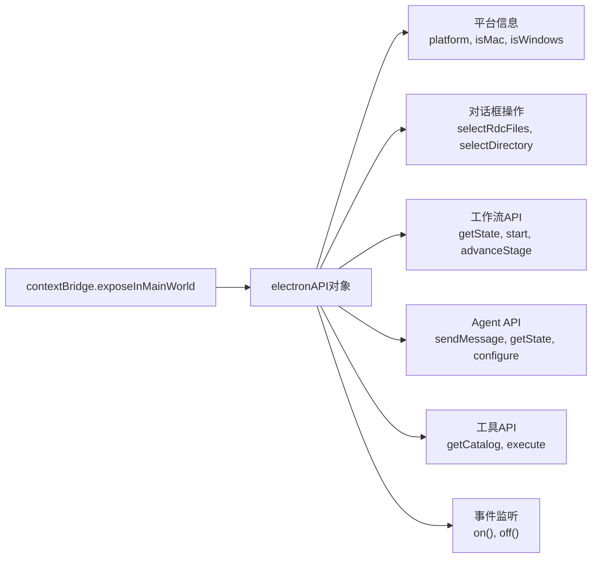
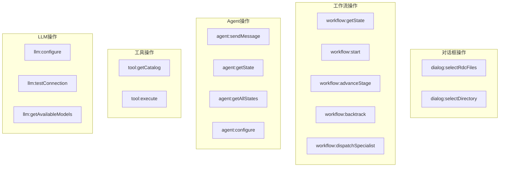
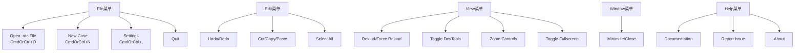
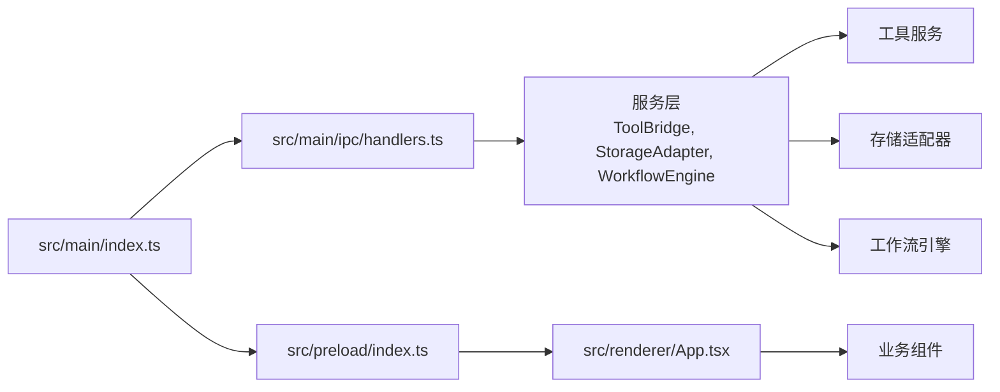

# Electron 集成

<cite>
**本文引用的文件**
- [src/main/index.ts](file://src/main/index.ts)
- [src/preload/index.ts](file://src/preload/index.ts)
- [src/main/ipc/handlers.ts](file://src/main/ipc/handlers.ts)
- [electron.vite.config.ts](file://electron.vite.config.ts)
- [src/renderer/App.tsx](file://src/renderer/App.tsx)
- [src/renderer/main.tsx](file://src/renderer/main.tsx)
- [src/shared/constants/agents.ts](file://src/shared/constants/agents.ts)
- [src/shared/constants/stages.ts](file://src/shared/constants/stages.ts)
- [src/shared/types/agent.ts](file://src/shared/types/agent.ts)
- [src/shared/types/workflow.ts](file://src/shared/types/workflow.ts)
- [src/shared/constants/blockers.ts](file://src/shared/constants/blockers.ts)
- [package.json](file://package.json)
</cite>

## 更新摘要
**所做更改**
- 更新了完整的双进程架构描述，包括主进程、渲染进程、预加载脚本的详细实现
- 新增了预加载脚本的安全桥接机制和API暴露策略
- 扩展了IPC通信机制，涵盖多种业务领域的处理器注册
- 增强了菜单系统和窗口管理的安全配置
- 添加了完整的类型定义和常量配置体系
- 更新了构建配置和开发工具链

## 目录
1. [简介](#简介)
2. [项目结构](#项目结构)
3. [核心组件](#核心组件)
4. [架构总览](#架构总览)
5. [详细组件分析](#详细组件分析)
6. [依赖关系分析](#依赖关系分析)
7. [性能考虑](#性能考虑)
8. [故障排查指南](#故障排查指南)
9. [结论](#结论)
10. [附录](#附录)

## 简介
本文件面向需要在 React/Angular 应用中集成 Electron 的开发者，系统性阐述完整的双进程架构，包括主进程、渲染进程、预加载脚本和IPC通信机制。详细解析预加载脚本如何通过安全桥接暴露受限API，以及主进程如何通过IPC处理器提供完整的业务能力。涵盖菜单系统、窗口管理、安全配置和类型定义体系，提供在渲染进程中调用Electron API的实践范式和最佳实践。

## 项目结构
该项目采用完整的四进程架构：主进程、预加载脚本、渲染进程和构建工具链。主进程负责应用生命周期和系统级功能，预加载脚本通过contextBridge安全暴露API，渲染进程承载React应用界面，构建工具链使用electron-vite提供开发和生产环境支持。

**图表来源**
- [src/main/index.ts:1-209](file://src/main/index.ts#L1-L209)
- [src/preload/index.ts:1-131](file://src/preload/index.ts#L1-L131)
- [src/main/ipc/handlers.ts:1-267](file://src/main/ipc/handlers.ts#L1-L267)
- [electron.vite.config.ts:1-54](file://electron.vite.config.ts#L1-L54)

**章节来源**
- [src/main/index.ts:1-209](file://src/main/index.ts#L1-L209)
- [src/preload/index.ts:1-131](file://src/preload/index.ts#L1-L131)
- [src/main/ipc/handlers.ts:1-267](file://src/main/ipc/handlers.ts#L1-L267)
- [electron.vite.config.ts:1-54](file://electron.vite.config.ts#L1-L54)
- [package.json:1-67](file://package.json#L1-L67)

## 核心组件
- **主进程入口**：负责应用生命周期管理、窗口创建、菜单系统、安全策略和IPC处理器注册
- **预加载脚本**：通过contextBridge安全暴露受限API，实现渲染进程与主进程的受控通信
- **IPC处理器**：注册各类业务相关的IPC通道，包括对话框操作、工作流管理、Agent协调、工具执行等
- **渲染进程应用**：基于React的用户界面，通过window.electronAPI访问主进程功能
- **构建配置**：使用electron-vite提供开发热重载和生产构建支持

**章节来源**
- [src/main/index.ts:1-209](file://src/main/index.ts#L1-L209)
- [src/preload/index.ts:1-131](file://src/preload/index.ts#L1-L131)
- [src/main/ipc/handlers.ts:1-267](file://src/main/ipc/handlers.ts#L1-L267)
- [src/renderer/App.tsx:1-112](file://src/renderer/App.tsx#L1-L112)

## 架构总览
下图展示了完整的四进程架构，包括安全桥接和双向通信机制：

**图表来源**
- [src/preload/index.ts:25-41](file://src/preload/index.ts#L25-L41)
- [src/main/ipc/handlers.ts:45-106](file://src/main/ipc/handlers.ts#L45-L106)

**章节来源**
- [src/preload/index.ts:1-131](file://src/preload/index.ts#L1-L131)
- [src/main/ipc/handlers.ts:1-267](file://src/main/ipc/handlers.ts#L1-L267)

## 详细组件分析

### 主进程架构与窗口管理
主进程采用模块化设计，通过单一入口文件管理整个应用生命周期。核心功能包括窗口创建、菜单系统、安全策略和IPC处理器注册。

**图表来源**
- [src/main/index.ts:23-73](file://src/main/index.ts#L23-L73)
- [src/main/index.ts:78-174](file://src/main/index.ts#L78-L174)

**章节来源**
- [src/main/index.ts:1-209](file://src/main/index.ts#L1-L209)

### 预加载脚本安全桥接机制
预加载脚本通过contextBridge.exposeInMainWorld暴露受限API，实现渲染进程与主进程的安全通信。API设计遵循最小权限原则，仅暴露必要的功能。

**图表来源**
- [src/preload/index.ts:8-127](file://src/preload/index.ts#L8-L127)

**章节来源**
- [src/preload/index.ts:1-131](file://src/preload/index.ts#L1-L131)

### IPC处理器注册与业务逻辑
IPC处理器采用模块化注册方式，按功能领域组织处理器，提供完整的业务能力。

**图表来源**
- [src/main/ipc/handlers.ts:22-37](file://src/main/ipc/handlers.ts#L22-L37)
- [src/main/ipc/handlers.ts:41-139](file://src/main/ipc/handlers.ts#L41-L139)
- [src/main/ipc/handlers.ts:143-178](file://src/main/ipc/handlers.ts#L143-L178)
- [src/main/ipc/handlers.ts:182-195](file://src/main/ipc/handlers.ts#L182-L195)
- [src/main/ipc/handlers.ts:227-238](file://src/main/ipc/handlers.ts#L227-L238)

**章节来源**
- [src/main/ipc/handlers.ts:1-267](file://src/main/ipc/handlers.ts#L1-L267)

### 菜单系统与用户体验
应用提供完整的菜单系统，支持文件操作、编辑功能、视图控制、窗口管理和帮助选项。

**图表来源**
- [src/main/index.ts:79-170](file://src/main/index.ts#L79-L170)

**章节来源**
- [src/main/index.ts:78-174](file://src/main/index.ts#L78-L174)

### 类型定义与常量配置
项目建立了完整的类型定义体系，包括Agent角色、工作流阶段、阻断码等核心概念。

**章节来源**
- [src/shared/types/agent.ts:1-116](file://src/shared/types/agent.ts#L1-L116)
- [src/shared/types/workflow.ts:1-80](file://src/shared/types/workflow.ts#L1-L80)
- [src/shared/constants/agents.ts:1-107](file://src/shared/constants/agents.ts#L1-L107)
- [src/shared/constants/stages.ts:1-65](file://src/shared/constants/stages.ts#L1-L65)
- [src/shared/constants/blockers.ts:1-157](file://src/shared/constants/blockers.ts#L1-L157)

### 构建配置与开发工具链
使用electron-vite提供现代化的开发体验，支持热重载和快速构建。

**章节来源**
- [electron.vite.config.ts:1-54](file://electron.vite.config.ts#L1-L54)
- [package.json:1-67](file://package.json#L1-L67)

## 依赖关系分析
项目采用模块化架构，各组件职责明确，通过预加载脚本实现松耦合通信。

**图表来源**
- [src/main/index.ts:10](file://src/main/index.ts#L10)
- [src/main/ipc/handlers.ts:8-13](file://src/main/ipc/handlers.ts#L8-L13)

**章节来源**
- [src/main/index.ts:1-209](file://src/main/index.ts#L1-L209)
- [src/preload/index.ts:1-131](file://src/preload/index.ts#L1-L131)
- [src/main/ipc/handlers.ts:1-267](file://src/main/ipc/handlers.ts#L1-L267)

## 性能考虑
- **预加载脚本优化**：通过contextBridge暴露必要API，避免渲染进程直接访问Node.js API
- **IPC通信优化**：合理设计IPC通道，避免频繁的双向通信，批量处理数据传输
- **窗口管理优化**：使用ready-to-show事件延迟显示，减少白屏时间
- **开发体验优化**：electron-vite提供快速热重载，提高开发效率
- **内存管理**：及时清理事件监听器和窗口引用，避免内存泄漏

## 故障排查指南
- **预加载脚本错误**：检查contextBridge.exposeInMainWorld调用和API暴露列表
- **IPC通信失败**：验证处理器注册和通道名称一致性，检查主进程日志
- **菜单功能异常**：确认Menu.setApplicationMenu调用和模板配置
- **窗口安全策略**：检查webPreferences配置和安全策略设置
- **构建问题**：验证electron-vite配置和依赖安装

**章节来源**
- [src/preload/index.ts:126-127](file://src/preload/index.ts#L126-L127)
- [src/main/ipc/handlers.ts:18](file://src/main/ipc/handlers.ts#L18)
- [src/main/index.ts:78-174](file://src/main/index.ts#L78-L174)

## 结论
本项目通过完整的四进程架构实现了安全、高效的Electron应用。预加载脚本的安全桥接机制确保了渲染进程只能访问受控API，主进程的模块化设计提供了清晰的业务逻辑分离。完整的IPC处理器体系支持复杂的工作流管理和Agent协调，菜单系统和窗口管理提供了良好的用户体验。结合现代化的构建工具链，为开发高质量的桌面应用奠定了坚实基础。

## 附录
- **类型定义**：完整的TypeScript类型定义确保开发时的类型安全
- **常量配置**：标准化的常量定义支持Agent角色、工作流阶段和阻断码管理
- **构建配置**：electron-vite提供现代化的开发和构建体验
- **安全策略**：严格的上下文隔离和API暴露控制确保应用安全

**章节来源**
- [src/shared/types/agent.ts:1-116](file://src/shared/types/agent.ts#L1-L116)
- [src/shared/types/workflow.ts:1-80](file://src/shared/types/workflow.ts#L1-L80)
- [src/shared/constants/agents.ts:1-107](file://src/shared/constants/agents.ts#L1-L107)
- [src/shared/constants/stages.ts:1-65](file://src/shared/constants/stages.ts#L1-L65)
- [src/shared/constants/blockers.ts:1-157](file://src/shared/constants/blockers.ts#L1-L157)
- [electron.vite.config.ts:1-54](file://electron.vite.config.ts#L1-L54)