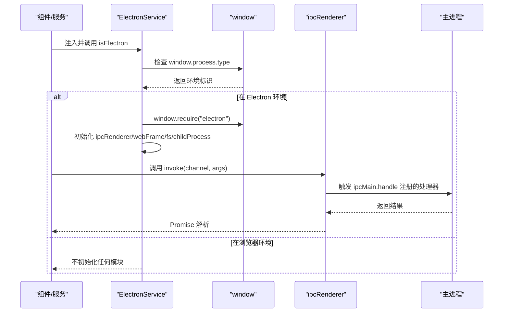
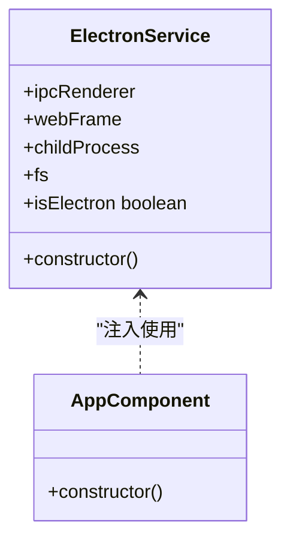
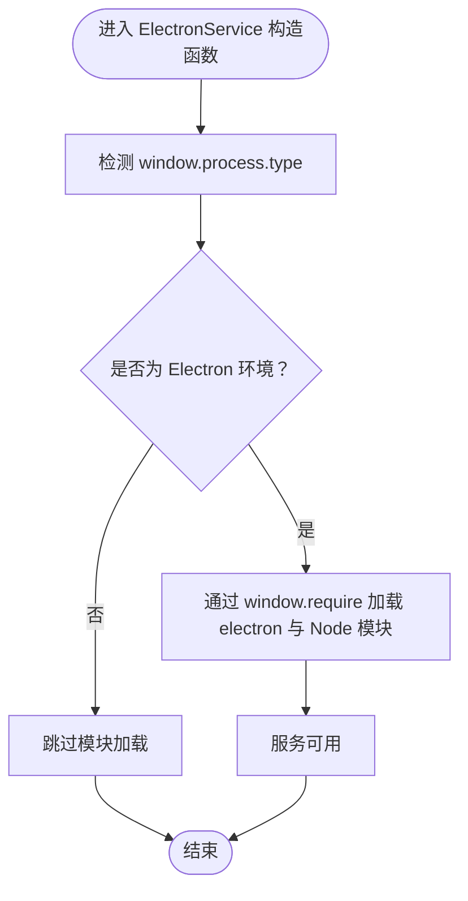
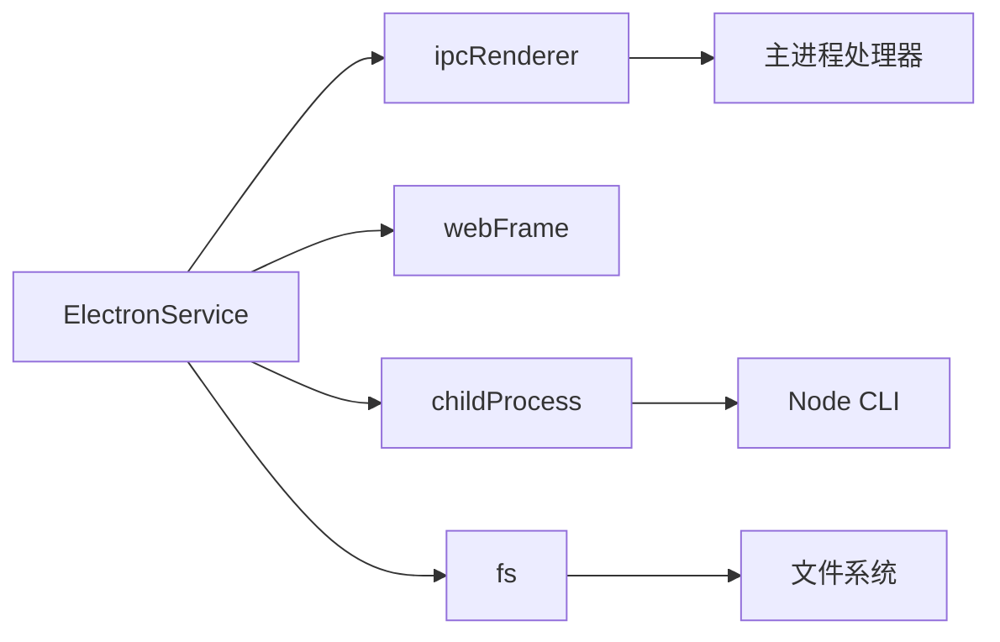

# ElectronService 服务

<cite>
**本文档引用的文件**
- [electron.service.ts](file://src/app/core/services/electron/electron.service.ts)
- [electron.service.spec.ts](file://src/app/core/services/electron/electron.service.spec.ts)
- [index.ts](file://src/app/core/services/index.ts)
- [core.module.ts](file://src/app/core/core.module.ts)
- [main.ts](file://src/main.ts)
- [app.component.ts](file://src/app/app.component.ts)
- [main.ts](file://app/main.ts)
- [environment.ts](file://src/environments/environment.ts)
- [package.json](file://package.json)
- [angular.json](file://angular.json)
</cite>

## 目录
1. [简介](#简介)
2. [项目结构](#项目结构)
3. [核心组件](#核心组件)
4. [架构总览](#架构总览)
5. [详细组件分析](#详细组件分析)
6. [依赖关系分析](#依赖关系分析)
7. [性能考虑](#性能考虑)
8. [故障排除指南](#故障排除指南)
9. [结论](#结论)
10. [附录](#附录)

## 简介
本文件围绕 ElectronService 服务展开，系统性阐述其在 Angular 应用中的设计与实现，重点包括：
- 条件导入机制：如何在渲染进程中安全地检测并加载 Electron 的 Node 集成模块（如 ipcRenderer、child_process、fs）。
- 在 Angular 组件中安全调用 Electron API 的方式：服务注入、方法封装与类型安全。
- 设计模式：单例模式的应用与依赖注入配置。
- 实际使用场景：文件操作、系统信息获取、窗口控制等。
- 扩展方法：新增 API 方法与自定义事件处理的最佳实践。

该服务位于核心模块中，通过根级依赖注入提供，确保在整个应用中可被任何组件或服务安全访问。

## 项目结构
该项目采用 Angular 单页面应用与 Electron 主进程结合的架构。核心服务位于 src/app/core/services/electron/ 目录下，配合主进程的 IPC 处理器实现前后端通信。

```mermaid
graph TB
subgraph "Angular 渲染进程"
A["app.component.ts<br/>应用入口组件"]
B["ElectronService<br/>核心服务"]
C["CoreModule<br/>核心模块"]
D["SharedModule<br/>共享模块"]
end
subgraph "Electron 主进程"
E["app/main.ts<br/>主进程入口"]
end
A --> B
C --> B
A --> D
B <- --> E
```

**图表来源**
- [app.component.ts:1-35](file://src/app/app.component.ts#L1-L35)
- [electron.service.ts:1-57](file://src/app/core/services/electron/electron.service.ts#L1-L57)
- [core.module.ts:1-11](file://src/app/core/core.module.ts#L1-L11)
- [main.ts:1-94](file://app/main.ts#L1-L94)

**章节来源**
- [main.ts:1-57](file://src/main.ts#L1-L57)
- [core.module.ts:1-11](file://src/app/core/core.module.ts#L1-L11)
- [angular.json:1-188](file://angular.json#L1-L188)

## 核心组件
ElectronService 是一个根级单例服务，负责在运行时判断是否处于 Electron 环境，并按需加载 Electron 的 Node 集成模块。其关键特性如下：
- 条件导入：仅在渲染进程检测到 Electron 环境时才执行 require 加载，避免浏览器环境报错。
- 模块暴露：将 ipcRenderer、webFrame、childProcess、fs 等模块以属性形式暴露给调用方。
- 类型安全：通过 TypeScript 类型声明确保编译期类型检查。
- 可扩展：基于 IPC 通道与主进程交互，支持新增 API 与事件处理。

**章节来源**
- [electron.service.ts:1-57](file://src/app/core/services/electron/electron.service.ts#L1-L57)

## 架构总览
ElectronService 的工作流分为“环境检测”和“模块加载”两个阶段，并通过 IPC 与主进程进行通信。



**图表来源**
- [electron.service.ts:18-55](file://src/app/core/services/electron/electron.service.ts#L18-L55)
- [app.component.ts:18-33](file://src/app/app.component.ts#L18-L33)
- [main.ts:64-71](file://app/main.ts#L64-L71)

## 详细组件分析

### ElectronService 类设计与实现
- 单例与注入：通过 @Injectable({ providedIn: 'root' }) 声明为根级单例，可在任意组件或服务中直接注入使用。
- 条件导入：构造函数内通过 isElectron 属性判断当前运行环境；仅在 Electron 环境下执行 window.require 加载模块。
- 模块初始化：成功加载后，将 electron 与 Node 内置模块赋值到服务实例属性，供上层调用。
- 环境检测：isElectron 基于 window.process.type 判断，避免在浏览器直接 require 导致异常。



**图表来源**
- [electron.service.ts:9-56](file://src/app/core/services/electron/electron.service.ts#L9-L56)
- [app.component.ts:14-33](file://src/app/app.component.ts#L14-L33)

**章节来源**
- [electron.service.ts:9-56](file://src/app/core/services/electron/electron.service.ts#L9-L56)
- [electron.service.spec.ts:1-13](file://src/app/core/services/electron/electron.service.spec.ts#L1-L13)

### 在 Angular 组件中安全调用 Electron API
- 服务注入：在组件构造函数或使用 inject() 中注入 ElectronService。
- 环境判断：通过 isElectron 属性决定是否启用 Electron 功能。
- IPC 调用：使用 ipcRenderer.invoke 与主进程通信，获取版本号等信息。
- 日志输出：在 Electron 环境打印模块对象与返回值，便于调试。

参考路径：
- [app.component.ts:14-33](file://src/app/app.component.ts#L14-L33)

**章节来源**
- [app.component.ts:14-33](file://src/app/app.component.ts#L14-L33)

### 条件导入机制详解
条件导入的核心在于运行时检测与延迟加载：
- 检测时机：在 ElectronService 构造函数中执行 isElectron 判断。
- 加载策略：仅在 Electron 环境下通过 window.require 动态加载 electron 与 Node 模块。
- 安全性：若非 Electron 环境，服务不初始化任何模块，避免浏览器报错。
- 注意事项：使用 window.require 引入的 Node 依赖必须同时存在于根目录与 app/package.json 的 dependencies 中，以确保打包与运行时均可加载。



**图表来源**
- [electron.service.ts:18-55](file://src/app/core/services/electron/electron.service.ts#L18-L55)

**章节来源**
- [electron.service.ts:18-55](file://src/app/core/services/electron/electron.service.ts#L18-L55)

### 设计模式与依赖注入配置
- 单例模式：ElectronService 使用根级注入，确保全局唯一实例，避免重复初始化。
- 依赖注入：在应用引导文件中引入 CoreModule，从而在全局范围内提供 ElectronService。
- 模块组织：CoreModule 作为核心模块，集中管理核心服务与工具类，保持应用结构清晰。

参考路径：
- [main.ts:51-54](file://src/main.ts#L51-L54)
- [core.module.ts:1-11](file://src/app/core/core.module.ts#L1-L11)
- [index.ts:1-2](file://src/app/core/services/index.ts#L1-L2)

**章节来源**
- [main.ts:51-54](file://src/main.ts#L51-L54)
- [core.module.ts:1-11](file://src/app/core/core.module.ts#L1-L11)
- [index.ts:1-2](file://src/app/core/services/index.ts#L1-L2)

### 具体使用示例（步骤说明）
以下示例展示如何在组件中使用 ElectronService 进行常见操作。请根据实际需求替换具体通道名与参数。

- 文件操作（读取/写入）
  - 在主进程注册对应的 ipcMain.handle 处理器，实现文件读写逻辑。
  - 在渲染进程通过 ElectronService.ipcRenderer.invoke 调用相应通道，等待 Promise 解析结果。
  - 参考路径：[main.ts:64-71](file://app/main.ts#L64-L71)、[electron.service.ts:20-26](file://src/app/core/services/electron/electron.service.ts#L20-L26)

- 系统信息获取（例如应用版本）
  - 主进程已注册 'app:get-version' 通道处理器，返回应用版本。
  - 渲染进程通过 ElectronService.ipcRenderer.invoke('app:get-version') 获取版本号。
  - 参考路径：[app.component.ts](file://src/app/app.component.ts#L29)

- 窗口控制（最大化/最小化/关闭）
  - 在主进程维护 BrowserWindow 实例，并在 ipcMain.handle 中实现窗口控制逻辑。
  - 渲染进程通过 ipcRenderer.invoke 触发对应通道，完成窗口状态变更。
  - 参考路径：[main.ts:9-62](file://app/main.ts#L9-L62)

- 自定义事件处理
  - 使用 ipcRenderer.send 或 ipcRenderer.invoke 发送消息到主进程。
  - 主进程通过 ipcMain.on 或 ipcMain.handle 接收并处理事件，必要时向渲染进程回发消息。
  - 参考路径：[main.ts:64-71](file://app/main.ts#L64-L71)、[electron.service.ts:20-26](file://src/app/core/services/electron/electron.service.ts#L20-L26)

**章节来源**
- [app.component.ts:24-32](file://src/app/app.component.ts#L24-L32)
- [main.ts:64-71](file://app/main.ts#L64-L71)

### 扩展方法：新增 API 与自定义事件
- 新增主进程处理器
  - 在主进程的 ipcMain 上注册新的 handle 或 on 处理器，实现业务逻辑。
  - 确保通道名称语义明确，参数与返回值类型一致。
  - 参考路径：[main.ts:64-71](file://app/main.ts#L64-L71)

- 在渲染进程调用新通道
  - 通过 ElectronService.ipcRenderer.invoke 或 send 调用新通道。
  - 对返回值进行 Promise 处理，捕获错误并记录日志。
  - 参考路径：[electron.service.ts:20-26](file://src/app/core/services/electron/electron.service.ts#L20-L26)

- 添加新的 Node 模块支持
  - 若需要使用新的 Node 模块，需在根目录 package.json 与 app/package.json 的 dependencies 中同时声明。
  - 在 ElectronService 构造函数中通过 window.require 加载并赋值到服务属性。
  - 参考路径：[electron.service.ts:24-26](file://src/app/core/services/electron/electron.service.ts#L24-L26)

**章节来源**
- [electron.service.ts:24-26](file://src/app/core/services/electron/electron.service.ts#L24-L26)
- [main.ts:64-71](file://app/main.ts#L64-L71)

## 依赖关系分析
ElectronService 的依赖关系主要体现在模块加载与 IPC 通信两个方面：



**图表来源**
- [electron.service.ts:13-26](file://src/app/core/services/electron/electron.service.ts#L13-L26)
- [main.ts:64-71](file://app/main.ts#L64-L71)

**章节来源**
- [electron.service.ts:13-26](file://src/app/core/services/electron/electron.service.ts#L13-L26)
- [main.ts:64-71](file://app/main.ts#L64-L71)

## 性能考虑
- 模块懒加载：仅在 Electron 环境下加载模块，避免在浏览器环境中产生不必要的开销。
- IPC 优化：合理设计通道名称与数据结构，减少序列化与传输成本；批量请求合并以降低往返次数。
- 错误处理：对子进程执行与文件操作等异步任务进行错误捕获与降级处理，提升稳定性。
- 构建与打包：确保 Node 依赖正确声明，避免运行时动态 require 失败导致的性能回退。

## 故障排除指南
- 浏览器环境报错 require 不存在
  - 现象：在浏览器直接打开页面时报错，提示 require 未定义。
  - 原因：window.require 仅在 Electron 渲染进程可用。
  - 解决：确保通过 ElectronService.isElectron 判断后再调用相关功能。
  - 参考路径：[electron.service.ts:53-55](file://src/app/core/services/electron/electron.service.ts#L53-L55)

- 子进程执行失败
  - 现象：child_process.exec 执行失败或无输出。
  - 原因：Node 环境不可用或命令不存在。
  - 解决：检查 Node 安装与 PATH，确认命令可用；在主进程注册对应通道替代子进程调用。
  - 参考路径：[electron.service.ts:27-37](file://src/app/core/services/electron/electron.service.ts#L27-L37)

- IPC 通道未响应
  - 现象：调用 ipcRenderer.invoke 后无返回。
  - 原因：主进程未注册对应 handle 或通道名不匹配。
  - 解决：核对通道名称与参数；在主进程注册 ipcMain.handle 并返回期望结果。
  - 参考路径：[main.ts:64-71](file://app/main.ts#L64-L71)

**章节来源**
- [electron.service.ts:27-37](file://src/app/core/services/electron/electron.service.ts#L27-L37)
- [main.ts:64-71](file://app/main.ts#L64-L71)

## 结论
ElectronService 通过条件导入与根级单例设计，在 Angular 渲染进程中提供了安全、统一且可扩展的 Electron API 访问能力。结合 IPC 机制与主进程处理器，开发者可以便捷地实现文件操作、系统信息获取与窗口控制等功能，并在此基础上轻松扩展新的 API 与事件处理。遵循本文档的实践建议，可有效提升应用的稳定性与可维护性。

## 附录
- 关键配置与入口
  - 应用引导：在 src/main.ts 中引入 CoreModule 与 SharedModule，确保 ElectronService 可用。
  - 环境变量：通过 src/environments/environment.ts 控制生产与开发环境。
  - 构建配置：angular.json 定义了构建、测试与 lint 的配置项。
  - 参考路径：
    - [main.ts:51-54](file://src/main.ts#L51-L54)
    - [environment.ts:1-5](file://src/environments/environment.ts#L1-L5)
    - [angular.json:25-82](file://angular.json#L25-L82)

**章节来源**
- [main.ts:51-54](file://src/main.ts#L51-L54)
- [environment.ts:1-5](file://src/environments/environment.ts#L1-L5)
- [angular.json:25-82](file://angular.json#L25-L82)