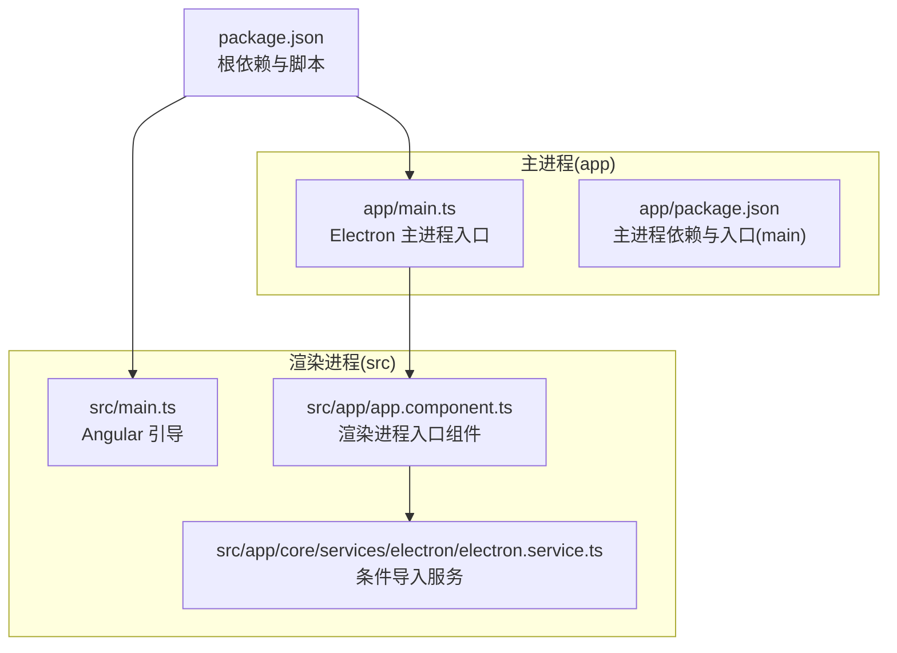
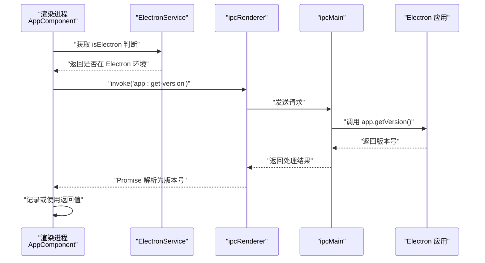
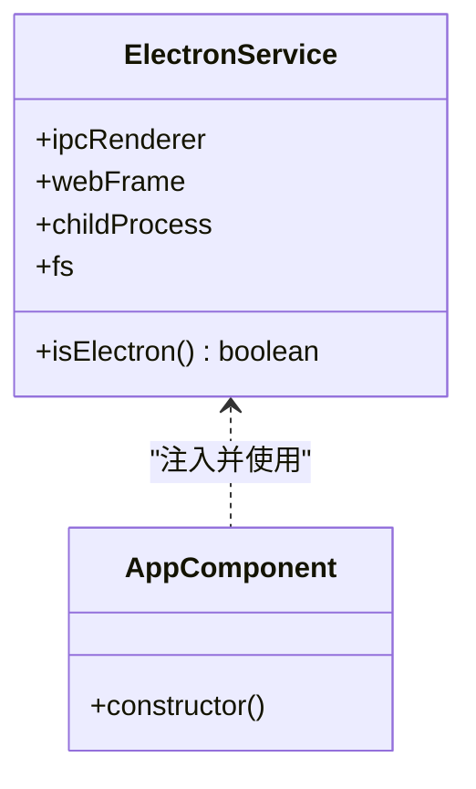
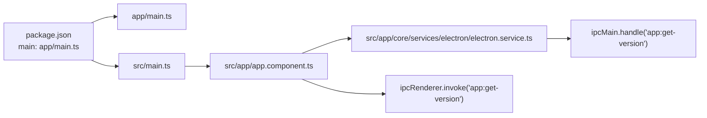

# IPC 通信机制

<cite>
**本文引用的文件**
- [app/main.ts](file://app/main.ts)
- [src/app/core/services/electron/electron.service.ts](file://src/app/core/services/electron/electron.service.ts)
- [src/app/app.component.ts](file://src/app/app.component.ts)
- [src/main.ts](file://src/main.ts)
- [package.json](file://package.json)
- [app/package.json](file://app/package.json)
- [README.md](file://README.md)
</cite>

## 目录
1. [简介](#简介)
2. [项目结构](#项目结构)
3. [核心组件](#核心组件)
4. [架构总览](#架构总览)
5. [详细组件分析](#详细组件分析)
6. [依赖关系分析](#依赖关系分析)
7. [性能考量](#性能考量)
8. [故障排查指南](#故障排查指南)
9. [结论](#结论)
10. [附录](#附录)

## 简介
本文件系统性阐述该 Electron + Angular 桌面应用中的 IPC（进程间通信）机制，重点覆盖以下方面：
- 主进程与渲染进程之间的双向通信实现
- 使用 ipcMain.handle() 注册异步处理器与 ipcRenderer.invoke() 进行调用的完整流程
- 渲染进程中通过条件导入安全访问 Electron API 的机制，避免直接导入导致的运行时错误
- 同步与异步 IPC 操作的实现范式
- 错误处理策略与异常场景的稳健性保障

## 项目结构
该项目采用“双 package.json”结构：主进程代码位于 app/ 目录，渲染进程代码位于 src/ 目录。主进程入口由根目录 package.json 的 main 字段指定，渲染进程通过 Angular 引导启动。

图表来源
- [app/main.ts:1-94](file://app/main.ts#L1-L94)
- [src/main.ts:1-57](file://src/main.ts#L1-L57)
- [src/app/app.component.ts:1-35](file://src/app/app.component.ts#L1-L35)
- [src/app/core/services/electron/electron.service.ts:1-57](file://src/app/core/services/electron/electron.service.ts#L1-L57)
- [package.json:25](file://package.json#L25)
- [app/package.json:8](file://app/package.json#L8)

章节来源
- [package.json:25](file://package.json#L25)
- [app/main.ts:1-94](file://app/main.ts#L1-L94)
- [src/main.ts:1-57](file://src/main.ts#L1-L57)

## 核心组件
- 主进程 IPC 处理器
  - 在主进程入口中注册异步处理器，用于响应渲染进程的调用请求。例如，注册名为 “app:get-version” 的处理器以返回应用版本号。
- 渲染进程 IPC 客户端
  - ElectronService 提供条件导入能力，仅在 Electron 环境下加载 ipcRenderer、webFrame、fs 等模块，避免浏览器环境下的运行时错误。
  - 应用组件在构造函数中通过 ElectronService 调用 ipcRenderer.invoke() 发起异步请求，并处理返回值。
- Angular 引导与路由
  - 渲染进程由 Angular 引导启动，应用组件作为根组件，负责触发 IPC 请求。

章节来源
- [app/main.ts:64-66](file://app/main.ts#L64-L66)
- [src/app/core/services/electron/electron.service.ts:18-51](file://src/app/core/services/electron/electron.service.ts#L18-L51)
- [src/app/app.component.ts:18-33](file://src/app/app.component.ts#L18-L33)
- [src/main.ts:21-56](file://src/main.ts#L21-L56)

## 架构总览
下图展示了从渲染进程发起 IPC 请求到主进程处理并返回结果的完整流程。

图表来源
- [src/app/app.component.ts:24-29](file://src/app/app.component.ts#L24-L29)
- [src/app/core/services/electron/electron.service.ts:18-51](file://src/app/core/services/electron/electron.service.ts#L18-L51)
- [app/main.ts:64-66](file://app/main.ts#L64-L66)

## 详细组件分析

### 主进程 IPC 处理器（ipcMain.handle）
- 注册位置：主进程入口文件中注册处理器，键名约定为 “app:get-version”，返回值为应用版本号。
- 设计要点：
  - 使用 ipcMain.handle() 注册异步处理器，避免直接暴露同步阻塞接口
  - 返回值通过 Promise 自动封装，便于渲染进程以异步方式消费
- 扩展建议：
  - 可按功能拆分多个处理器键名，如 “app:get-path”、“fs:read-file” 等
  - 对于需要上下文信息的请求，可将参数对象化，提升可维护性

章节来源
- [app/main.ts:64-66](file://app/main.ts#L64-L66)

### 渲染进程条件导入与安全访问（ElectronService）
- 条件导入机制：
  - 通过检测 window.process.type 判断当前是否处于 Electron 环境
  - 在 Electron 环境下，使用 window.require 动态加载 electron、fs、child_process 等模块
- 安全性保障：
  - 避免在浏览器环境下直接 import Electron 模块，防止构建期或运行时报错
  - 将第三方 Node 模块的依赖声明在根 package.json 与 app/package.json 中，确保打包与运行时均可加载
- 使用建议：
  - 将 Electron 特有 API 封装在 ElectronService 内部，对外暴露统一接口
  - 对于常用功能（如读取文件、执行子进程），优先通过 ipcRenderer.invoke() 与主进程协作，减少渲染进程直接使用 Node API 的风险

章节来源
- [src/app/core/services/electron/electron.service.ts:18-51](file://src/app/core/services/electron/electron.service.ts#L18-L51)
- [README.md:82-94](file://README.md#L82-L94)

### 渲染进程发起 IPC 请求（ipcRenderer.invoke）
- 触发时机：应用组件在构造函数中判断 Electron 环境后，调用 ElectronService.ipcRenderer.invoke() 发送请求
- 参数与返回：
  - 请求键名与主进程处理器一致
  - 返回值为 Promise，解析后得到主进程处理器的返回结果
- 最佳实践：
  - 将 IPC 请求封装在服务层，避免在组件中直接耦合 IPC 逻辑
  - 对 Promise 的 reject 场景进行捕获与降级处理，保证 UI 不崩溃

章节来源
- [src/app/app.component.ts:24-29](file://src/app/app.component.ts#L24-L29)

### 类关系与职责划分

图表来源
- [src/app/core/services/electron/electron.service.ts:12-56](file://src/app/core/services/electron/electron.service.ts#L12-L56)
- [src/app/app.component.ts:14-33](file://src/app/app.component.ts#L14-L33)

## 依赖关系分析
- 主进程入口与渲染进程引导
  - 根 package.json 的 main 指向 app/main.ts，渲染进程由 src/main.ts 引导
- ElectronService 与主进程 IPC 的耦合
  - ElectronService 仅在 Electron 环境下加载 ipcRenderer；渲染进程通过它间接调用 ipcRenderer.invoke()
- 双包结构与依赖声明
  - README 明确指出 Node 模块需同时出现在根 package.json 与 app/package.json，以确保主进程与渲染进程均可加载

图表来源
- [package.json:25](file://package.json#L25)
- [src/main.ts:21-56](file://src/main.ts#L21-L56)
- [src/app/app.component.ts:18-33](file://src/app/app.component.ts#L18-L33)
- [src/app/core/services/electron/electron.service.ts:18-51](file://src/app/core/services/electron/electron.service.ts#L18-L51)
- [app/main.ts:64-66](file://app/main.ts#L64-L66)

章节来源
- [package.json:25](file://package.json#L25)
- [README.md:82-94](file://README.md#L82-L94)

## 性能考量
- 异步处理优先
  - 使用 ipcRenderer.invoke() 与 ipcMain.handle() 组合，避免阻塞渲染线程
- 请求合并与缓存
  - 对频繁查询的只读数据（如版本号）可在渲染进程侧做缓存，减少 IPC 调用次数
- 参数最小化
  - 将复杂参数序列化为轻量对象，降低传输开销
- 错误快速失败
  - 对不可用的 Electron 环境提前短路，避免无效 IPC 调用

## 故障排查指南
- 浏览器环境运行报错
  - 现象：直接 import electron 导致构建或运行时错误
  - 原因：未使用条件导入机制
  - 解决：确保通过 ElectronService 的 isElectron 判断后再加载 Electron 模块
- IPC 请求无响应
  - 现象：渲染进程调用 invoke 后无返回
  - 排查：确认主进程已注册同名处理器；检查通道名称拼写；验证返回值类型
- 版本号为空或异常
  - 现象：返回空字符串或抛出异常
  - 排查：检查主进程 app.getVersion() 是否可用；确认应用打包后版本号正确写入
- 第三方模块无法加载
  - 现象：fs 或 child_process 在渲染进程报错
  - 排查：确认模块同时存在于根 package.json 与 app/package.json 的 dependencies；确保打包配置允许在渲染进程加载

章节来源
- [src/app/core/services/electron/electron.service.ts:18-51](file://src/app/core/services/electron/electron.service.ts#L18-L51)
- [app/main.ts:64-66](file://app/main.ts#L64-L66)
- [README.md:82-94](file://README.md#L82-L94)

## 结论
本项目通过清晰的双包结构与条件导入机制，实现了主进程与渲染进程之间安全、可靠的 IPC 通信。主进程以 ipcMain.handle() 提供异步处理器，渲染进程通过 ElectronService 与 ipcRenderer.invoke() 安全发起请求。结合 README 的依赖声明规范与本文的错误处理建议，可进一步提升系统的稳定性与可维护性。

## 附录
- 示例流程（概念性）
  - 渲染进程检测环境 -> 加载 ElectronService -> 调用 invoke -> 主进程 handle 处理 -> 返回结果 -> 渲染进程消费
- 关键路径参考
  - 主进程处理器注册：[app/main.ts:64-66](file://app/main.ts#L64-L66)
  - 条件导入与 Electron API 访问：[src/app/core/services/electron/electron.service.ts:18-51](file://src/app/core/services/electron/electron.service.ts#L18-L51)
  - 渲染进程发起请求：[src/app/app.component.ts:24-29](file://src/app/app.component.ts#L24-L29)
  - Angular 引导入口：[src/main.ts:21-56](file://src/main.ts#L21-L56)
  - 双包结构与入口指向：[package.json:25](file://package.json#L25)，[app/package.json:8](file://app/package.json#L8)