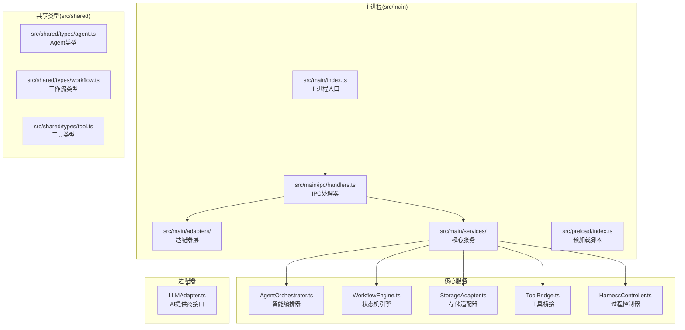
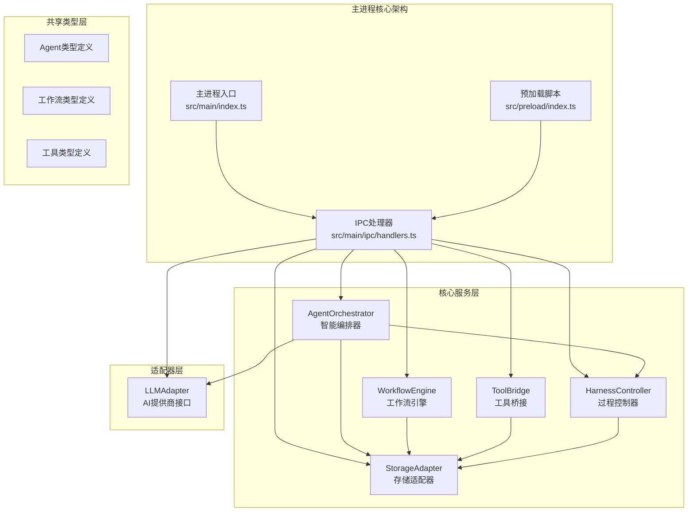
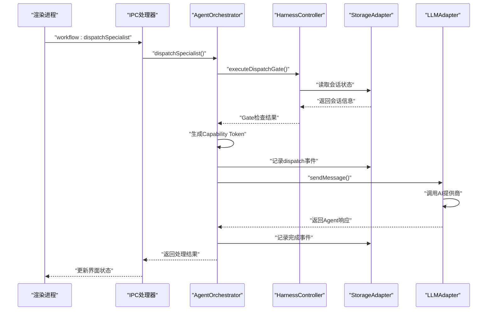
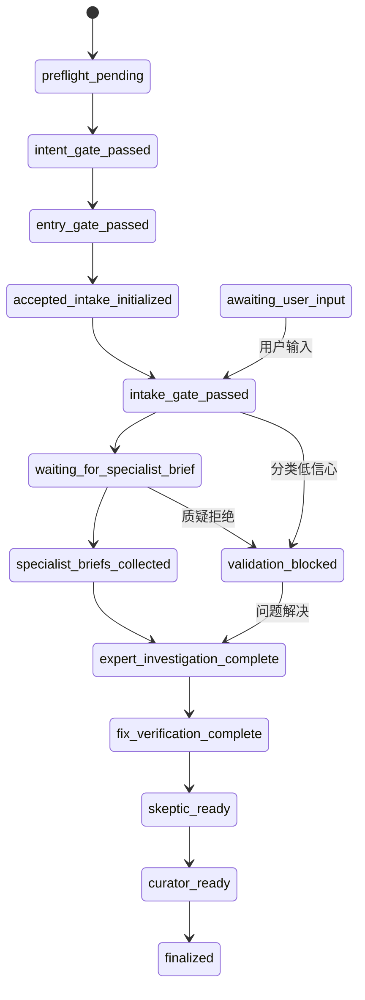
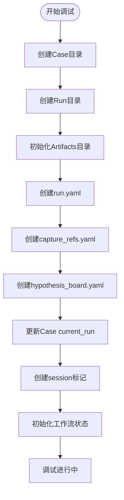
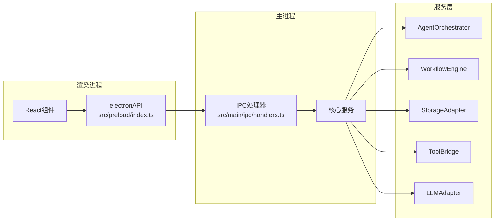
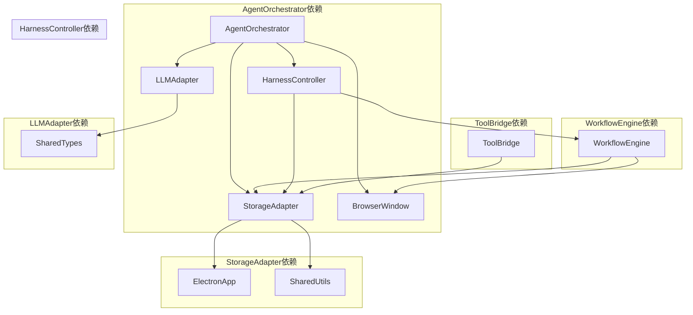
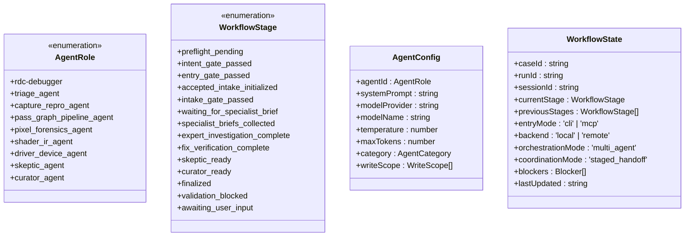

# 主进程架构

<cite>
**本文档引用的文件**
- [src/main/index.ts](file://src/main/index.ts)
- [src/main/ipc/handlers.ts](file://src/main/ipc/handlers.ts)
- [src/main/services/AgentOrchestrator.ts](file://src/main/services/AgentOrchestrator.ts)
- [src/main/services/WorkflowEngine.ts](file://src/main/services/WorkflowEngine.ts)
- [src/main/services/StorageAdapter.ts](file://src/main/services/StorageAdapter.ts)
- [src/main/services/ToolBridge.ts](file://src/main/services/ToolBridge.ts)
- [src/main/adapters/LLMAdapter.ts](file://src/main/adapters/LLMAdapter.ts)
- [src/main/services/HarnessController.ts](file://src/main/services/HarnessController.ts)
- [src/preload/index.ts](file://src/preload/index.ts)
- [src/shared/types/agent.ts](file://src/shared/types/agent.ts)
- [src/shared/types/workflow.ts](file://src/shared/types/workflow.ts)
- [src/shared/types/tool.ts](file://src/shared/types/tool.ts)
</cite>

## 更新摘要
**变更内容**
- 主进程架构完全重构，从简单的窗口管理升级为复杂的AI驱动调试代理系统
- 新增AgentOrchestrator智能代理编排器，支持9个专业Agent角色
- 引入WorkflowEngine工作流状态机引擎，实现12阶段调试流程
- 集成StorageAdapter统一存储适配器，管理workspace目录结构
- 构建ToolBridge工具桥接服务，连接RDC-Agent-Tools CLI
- 实现LLMAdapter统一AI提供商接口，支持多供应商模型
- 采用HarnessController过程控制器，替代传统的结尾审计器

## 目录
1. [简介](#简介)
2. [项目结构](#项目结构)
3. [核心组件](#核心组件)
4. [架构概览](#架构概览)
5. [详细组件分析](#详细组件分析)
6. [依赖关系分析](#依赖关系分析)
7. [性能考虑](#性能考虑)
8. [故障排除指南](#故障排除指南)
9. [结论](#结论)

## 简介

本文件详细阐述了基于 Electron 的 RDC-Agent 主进程架构设计与实现。该应用采用主进程-渲染进程分离的架构模式，主进程负责AI驱动的调试代理系统、工作流管理、工具桥接和存储管理。文档重点分析重构后的核心服务架构，包括 AgentOrchestrator 智能编排器、WorkflowEngine 状态机引擎、StorageAdapter 统一存储、ToolBridge 工具桥接和 LLMAdapter AI接口适配层。

## 项目结构

该项目采用现代化的 Electron + TypeScript 架构，主要目录组织如下：
- src/main/: 主进程核心代码，包含服务层、适配器和IPC处理器
- src/preload/: 预加载脚本，提供安全的渲染进程API
- src/shared/: 共享类型定义和工具函数
- src/renderer/: React前端应用源码
- resources/tools/: RDC-Agent-Tools CLI工具集



**图表来源**
- [src/main/index.ts:1-209](file://src/main/index.ts#L1-L209)
- [src/main/ipc/handlers.ts:1-267](file://src/main/ipc/handlers.ts#L1-L267)
- [src/main/services/AgentOrchestrator.ts:1-401](file://src/main/services/AgentOrchestrator.ts#L1-L401)
- [src/main/services/WorkflowEngine.ts:1-369](file://src/main/services/WorkflowEngine.ts#L1-L369)
- [src/main/services/StorageAdapter.ts:1-442](file://src/main/services/StorageAdapter.ts#L1-L442)
- [src/main/services/ToolBridge.ts:1-308](file://src/main/services/ToolBridge.ts#L1-L308)
- [src/main/services/HarnessController.ts:1-444](file://src/main/services/HarnessController.ts#L1-L444)
- [src/main/adapters/LLMAdapter.ts:1-425](file://src/main/adapters/LLMAdapter.ts#L1-L425)
- [src/preload/index.ts:1-131](file://src/preload/index.ts#L1-L131)

**章节来源**
- [src/main/index.ts:1-209](file://src/main/index.ts#L1-L209)
- [src/main/ipc/handlers.ts:1-267](file://src/main/ipc/handlers.ts#L1-L267)

## 核心组件

### 主进程入口与生命周期管理

主进程通过 src/main/index.ts 实现完整的生命周期管理：
- 应用启动：监听 'ready' 事件，创建主窗口并设置菜单
- 窗口管理：处理 'window-all-closed' 和 'activate' 事件
- 菜单系统：实现完整的文件、编辑、视图、窗口、帮助菜单
- 安全策略：限制外部链接导航，防止恶意URL访问
- 开发模式：集成Vite开发服务器，支持热重载

关键实现要点：
- 使用 Vite 开发服务器进行实时页面加载
- 实现完整的应用菜单系统，支持快捷键操作
- 安全的窗口打开策略，仅允许受信任的URL
- 开发模式自动开启开发者工具

**章节来源**
- [src/main/index.ts:176-209](file://src/main/index.ts#L176-L209)

### AgentOrchestrator 智能编排器

AgentOrchestrator 是整个系统的智能中枢，负责协调9个专业Agent角色：
- **Orchestrator 角色**：rdc-debugger - 主入口协调员
- **Investigator 角色**：triage_agent、capture_repro_agent、pass_graph_pipeline_agent、pixel_forensics_agent、shader_ir_agent、driver_device_agent - 证据收集专家
- **Verifier 角色**：skeptic_agent - 质疑验证者
- **Reporter 角色**：curator_agent - 报告整理员

核心功能：
- Agent状态管理：跟踪每个Agent的运行状态和活动时间
- 配置管理：支持自定义System Prompt和模型配置
- Prompt加载：从workspace或默认模板加载Agent提示词
- 消息路由：通过LLMAdapter与AI提供商交互
- 事件通知：向渲染进程推送Agent状态变化

**章节来源**
- [src/main/services/AgentOrchestrator.ts:29-401](file://src/main/services/AgentOrchestrator.ts#L29-L401)

### WorkflowEngine 工作流状态机引擎

实现12阶段调试流程的状态机引擎：
- **预检阶段**：preflight_pending → intent_gate_passed
- **入口阶段**：entry_gate_passed → accepted_intake_initialized
- **受理阶段**：intake_gate_passed → waiting_for_specialist_brief
- **调查阶段**：specialist_briefs_collected → expert_investigation_complete
- **验证阶段**：fix_verification_complete → skeptic_ready → curator_ready → finalized
- **阻断阶段**：validation_blocked（新增）
- **等待阶段**：awaiting_user_input（新增）

支持受控回转机制，包括：
- specialist_timeout：专家超时回转
- skeptic_rejected：质疑拒绝回转  
- triage_low_confidence：分类低信心回转

**章节来源**
- [src/main/services/WorkflowEngine.ts:62-369](file://src/main/services/WorkflowEngine.ts#L62-L369)

### StorageAdapter 统一存储适配器

负责管理复杂的workspace目录结构和文件读写：
- **Case管理**：创建和管理调试案例目录结构
- **Run管理**：跟踪每次调试会话的运行状态
- **Artifact管理**：存储调试产生的各种工件文件
- **Action Chain**：记录完整的操作事件链
- **Session管理**：维护当前会话标识和状态

目录结构示例：
```
workspace/
├── cases/
│   └── [case_id]/
│       ├── artifacts/
│       ├── inputs/
│       │   ├── captures/
│       │   └── references/
│       └── runs/
│           └── [run_id]/
│               ├── artifacts/
│               ├── notes/
│               ├── screenshots/
│               └── reports/
└── common/
    ├── knowledge/
    │   ├── library/
    │   │   ├── sessions/
    │   │   └── bugcards/
    │   └── spec/
    └── config/
```

**章节来源**
- [src/main/services/StorageAdapter.ts:22-442](file://src/main/services/StorageAdapter.ts#L22-L442)

### ToolBridge 工具桥接服务

连接RDC-Agent-Tools CLI工具集的核心服务：
- **工具目录**：自动定位和加载工具目录
- **CLI执行**：封装cmd.exe进程调用，支持超时控制
- **工具调用**：提供统一的工具调用接口
- **进程管理**：跟踪和管理活跃的工具进程
- **错误处理**：完整的错误捕获和报告机制

支持的工具类型：
- **Capture工具**：文件打开、重放会话
- **Session工具**：会话上下文获取、状态查询
- **Core工具**：工具目录列表、核心功能
- **Live工具**：实时调试和分析功能

**章节来源**
- [src/main/services/ToolBridge.ts:13-308](file://src/main/services/ToolBridge.ts#L13-L308)

### LLMAdapter AI提供商适配层

统一的AI模型接口适配器，支持多个提供商：
- **OpenRouter**：必须支持，提供多种模型选择
- **OpenAI**：支持GPT系列模型
- **Anthropic**：支持Claude系列模型
- **Google Gemini**：支持Gemini Pro/Fast模型
- **Kimi**：支持Moonshot AI模型
- **xAI**：支持Grok模型

核心特性：
- **统一接口**：提供一致的chat和streamChat方法
- **模型路由**：根据Agent角色自动选择最佳模型
- **流式处理**：支持实时AI响应流
- **多模态支持**：处理文本和图像内容
- **错误处理**：完整的API错误处理和重试机制

**章节来源**
- [src/main/adapters/LLMAdapter.ts:325-425](file://src/main/adapters/LLMAdapter.ts#L325-L425)

### HarnessController 过程控制器

从传统"结尾审计器"升级为"过程控制器"：
- **前置Gate层**：入口闸门、Intake闸门、分派闸门、验证闸门
- **运行时监控**：模式一致性检查、阶段一致性验证
- **工具执行包装**：所有rd.*调用的统一包装器
- **早期Blocker检测**：实时检测和处理阻断问题

核心闸门功能：
- **EntryGate**：检查.rdc文件存在性和平台支持
- **IntakeGate**：验证数据完整性和参考契约
- **DispatchGate**：确保分派流程的正确性
- **VerifyGate**：验证修复方案的有效性

**章节来源**
- [src/main/services/HarnessController.ts:43-444](file://src/main/services/HarnessController.ts#L43-L444)

## 架构概览

该应用采用企业级的微服务架构模式，主进程包含多个独立的服务组件，通过IPC进行通信。



**图表来源**
- [src/main/index.ts:1-209](file://src/main/index.ts#L1-L209)
- [src/main/ipc/handlers.ts:1-267](file://src/main/ipc/handlers.ts#L1-L267)
- [src/main/services/AgentOrchestrator.ts:1-401](file://src/main/services/AgentOrchestrator.ts#L1-L401)
- [src/main/services/WorkflowEngine.ts:1-369](file://src/main/services/WorkflowEngine.ts#L1-L369)
- [src/main/services/StorageAdapter.ts:1-442](file://src/main/services/StorageAdapter.ts#L1-L442)
- [src/main/services/ToolBridge.ts:1-308](file://src/main/services/ToolBridge.ts#L1-L308)
- [src/main/services/HarnessController.ts:1-444](file://src/main/services/HarnessController.ts#L1-L444)
- [src/main/adapters/LLMAdapter.ts:1-425](file://src/main/adapters/LLMAdapter.ts#L1-L425)

## 详细组件分析

### Agent编排流程



**图表来源**
- [src/main/services/AgentOrchestrator.ts:258-343](file://src/main/services/AgentOrchestrator.ts#L258-L343)
- [src/main/services/HarnessController.ts:148-191](file://src/main/services/HarnessController.ts#L148-L191)
- [src/main/ipc/handlers.ts:128-139](file://src/main/ipc/handlers.ts#L128-L139)

### 工作流状态机转换



**图表来源**
- [src/main/services/WorkflowEngine.ts:44-60](file://src/main/services/WorkflowEngine.ts#L44-L60)
- [src/main/services/WorkflowEngine.ts:192-247](file://src/main/services/WorkflowEngine.ts#L192-L247)

### 存储适配器工作流程



**图表来源**
- [src/main/services/StorageAdapter.ts:77-236](file://src/main/services/StorageAdapter.ts#L77-L236)

### IPC通信架构



**图表来源**
- [src/preload/index.ts:8-131](file://src/preload/index.ts#L8-L131)
- [src/main/ipc/handlers.ts:18-267](file://src/main/ipc/handlers.ts#L18-L267)

**章节来源**
- [src/main/ipc/handlers.ts:18-267](file://src/main/ipc/handlers.ts#L18-L267)
- [src/preload/index.ts:8-131](file://src/preload/index.ts#L8-L131)

## 依赖关系分析

### 服务依赖图



**图表来源**
- [src/main/services/AgentOrchestrator.ts:24-27](file://src/main/services/AgentOrchestrator.ts#L24-L27)
- [src/main/services/WorkflowEngine.ts:16-17](file://src/main/services/WorkflowEngine.ts#L16-L17)
- [src/main/services/HarnessController.ts:13-14](file://src/main/services/HarnessController.ts#L13-L14)
- [src/main/services/ToolBridge.ts:9-11](file://src/main/services/ToolBridge.ts#L9-L11)
- [src/main/adapters/LLMAdapter.ts:6-14](file://src/main/adapters/LLMAdapter.ts#L6-L14)
- [src/main/services/StorageAdapter.ts:8-18](file://src/main/services/StorageAdapter.ts#L8-L18)

### 类型定义关系



**图表来源**
- [src/shared/types/agent.ts:6-116](file://src/shared/types/agent.ts#L6-L116)
- [src/shared/types/workflow.ts:6-80](file://src/shared/types/workflow.ts#L6-L80)

**章节来源**
- [src/shared/types/agent.ts:1-116](file://src/shared/types/agent.ts#L1-L116)
- [src/shared/types/workflow.ts:1-80](file://src/shared/types/workflow.ts#L1-L80)
- [src/shared/types/tool.ts:1-121](file://src/shared/types/tool.ts#L1-L121)

## 性能考虑

### 服务启动优化

- **延迟初始化**：IPC处理器按需初始化，减少启动时间
- **单例模式**：所有核心服务采用单例模式，避免重复实例化
- **异步加载**：存储适配器初始化使用Promise，不影响主进程启动

### 内存管理

- **对象池**：Agent状态和工作流状态使用Map结构，便于内存回收
- **事件清理**：工具进程结束后自动清理，防止内存泄漏
- **文件句柄**：JSONL文件使用流式读写，避免大文件内存占用

### 网络性能

- **模型缓存**：LLM提供商配置缓存，避免重复网络请求
- **连接复用**：同一会话内复用AI提供商连接
- **超时控制**：工具调用设置合理超时，防止长时间阻塞

### 存储优化

- **目录预创建**：启动时预创建常用目录，避免运行时创建开销
- **批量写入**：action_chain使用批量JSONL写入，提高I/O效率
- **增量更新**：工作流状态只更新必要字段，减少磁盘写入

## 故障排除指南

### 常见问题与解决方案

1. **Agent编排失败**
   - 症状：dispatchSpecialist返回错误
   - 检查：HarnessController.executeDispatchGate()的阻断器
   - 解决：检查前一个dispatch是否已完成，或Agent角色是否有效
   - 参考：src/main/services/AgentOrchestrator.ts 第268-271行

2. **工作流状态异常**
   - 症状：工作流卡在某个阶段无法前进
   - 检查：WorkflowEngine.canAdvance()返回的阻断原因
   - 解决：清除相关阻断器或检查action_chain一致性
   - 参考：src/main/services/WorkflowEngine.ts 第282-303行

3. **存储适配器错误**
   - 症状：workspace目录创建失败或文件写入异常
   - 检查：StorageAdapter.initializeWorkspace()权限和路径
   - 解决：确保应用具有写入权限，检查磁盘空间
   - 参考：src/main/services/StorageAdapter.ts 第45-64行

4. **工具调用超时**
   - 症状：ToolBridge.executeCLI()抛出超时错误
   - 检查：工具目录是否存在，Python环境配置
   - 解决：验证resources/tools目录完整性，检查环境变量
   - 参考：src/main/services/ToolBridge.ts 第84-134行

5. **LLM提供商连接失败**
   - 症状：LLMAdapter.chat()抛出配置错误
   - 检查：API密钥配置和网络连接
   - 解决：验证API密钥有效性，检查防火墙设置
   - 参考：src/main/adapters/LLMAdapter.ts 第339-370行

**章节来源**
- [src/main/services/AgentOrchestrator.ts:258-343](file://src/main/services/AgentOrchestrator.ts#L258-L343)
- [src/main/services/WorkflowEngine.ts:282-303](file://src/main/services/WorkflowEngine.ts#L282-L303)
- [src/main/services/StorageAdapter.ts:45-64](file://src/main/services/StorageAdapter.ts#L45-L64)
- [src/main/services/ToolBridge.ts:84-134](file://src/main/services/ToolBridge.ts#L84-L134)
- [src/main/adapters/LLMAdapter.ts:339-370](file://src/main/adapters/LLMAdapter.ts#L339-L370)

## 结论

该重构后的主进程架构实现了从简单窗口管理到复杂AI驱动调试代理系统的重大升级。主要特点包括：

1. **模块化设计**：采用微服务架构，每个核心服务职责明确，便于维护和扩展
2. **智能编排**：AgentOrchestrator提供9个专业Agent角色的智能调度和协调
3. **严格流程控制**：WorkflowEngine实现12阶段调试流程，支持受控回转机制
4. **统一存储**：StorageAdapter管理复杂的workspace目录结构，确保数据一致性
5. **工具集成**：ToolBridge无缝连接RDC-Agent-Tools CLI，提供丰富的调试功能
6. **AI抽象**：LLMAdapter统一AI提供商接口，支持多供应商模型选择
7. **过程控制**：HarnessController替代传统审计器，实现实时过程监控
8. **安全架构**：完整的IPC通信和安全策略，保护系统免受恶意攻击

该架构为RDC-Agent提供了强大的AI驱动调试能力，支持复杂的RenderDoc调试场景，为后续功能扩展奠定了坚实的技术基础。建议在实际项目中继续遵循模块化设计原则，保持代码的可维护性和可扩展性。