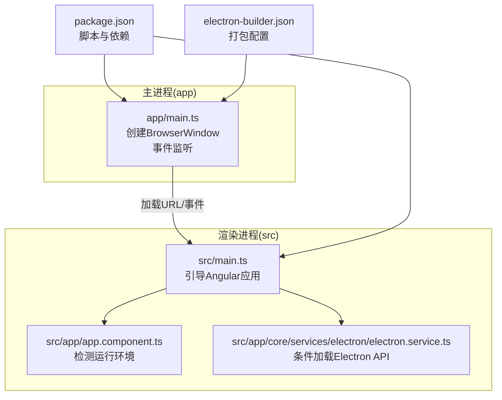
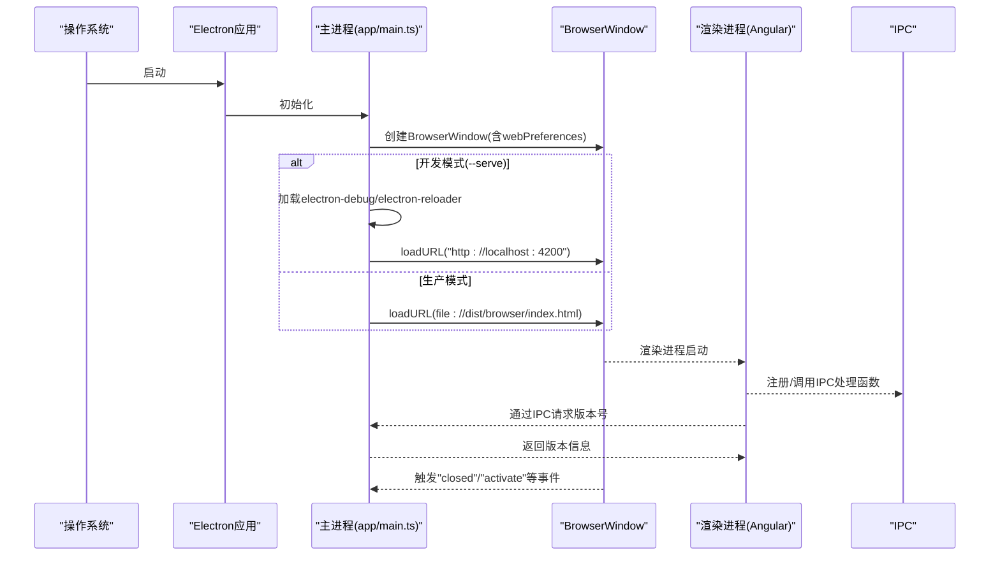
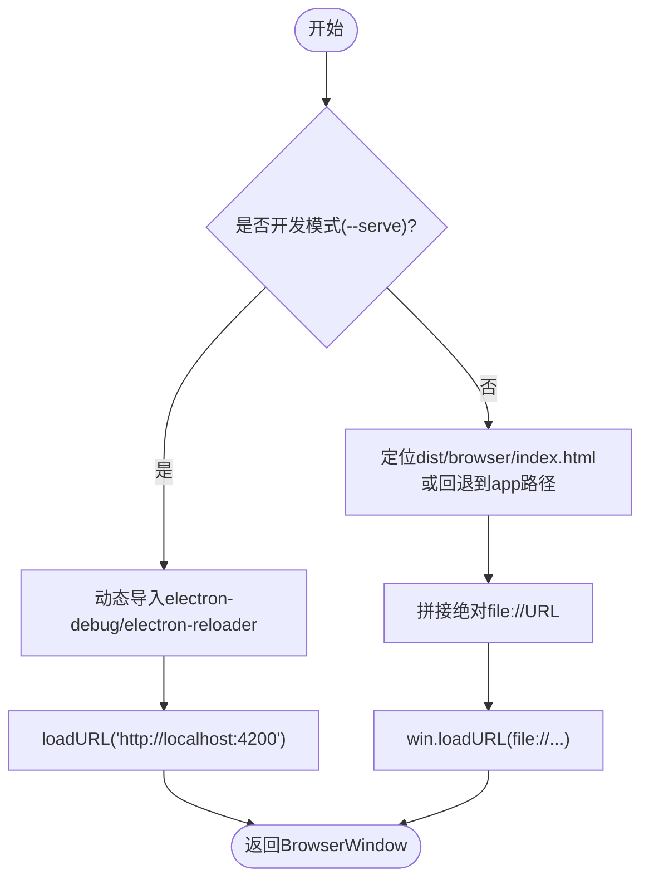
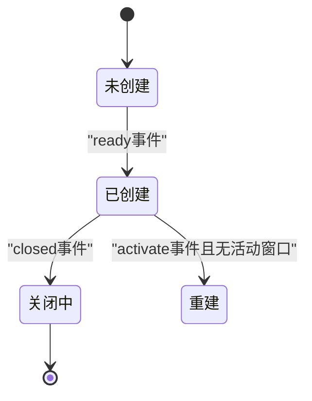
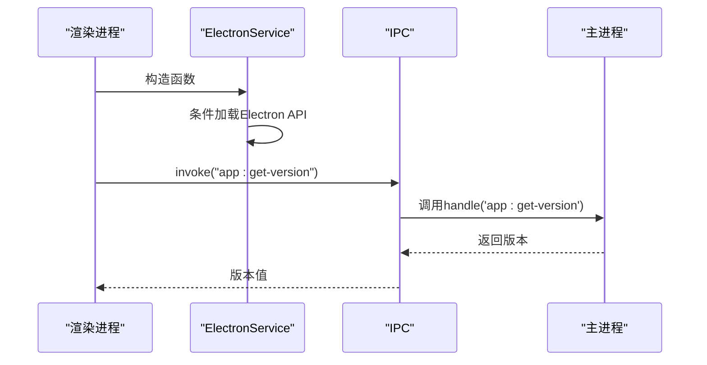
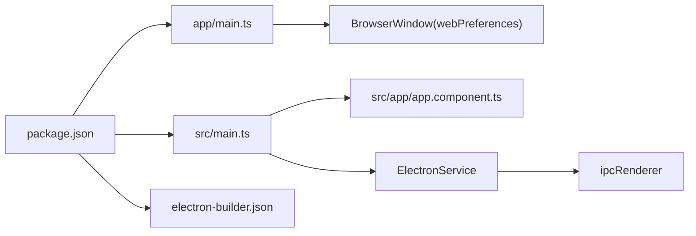

# 窗口管理系统

<cite>
**本文引用的文件**
- [app/main.ts](file://app/main.ts)
- [src/app/core/services/electron/electron.service.ts](file://src/app/core/services/electron/electron.service.ts)
- [package.json](file://package.json)
- [electron-builder.json](file://electron-builder.json)
- [src/environments/environment.dev.ts](file://src/environments/environment.dev.ts)
- [src/app/app.component.ts](file://src/app/app.component.ts)
- [src/main.ts](file://src/main.ts)
- [angular.json](file://angular.json)
- [src/typings.d.ts](file://src/typings.d.ts)
</cite>

## 目录
1. [简介](#简介)
2. [项目结构](#项目结构)
3. [核心组件](#核心组件)
4. [架构总览](#架构总览)
5. [详细组件分析](#详细组件分析)
6. [依赖关系分析](#依赖关系分析)
7. [性能考量](#性能考量)
8. [故障排查指南](#故障排查指南)
9. [结论](#结论)
10. [附录](#附录)

## 简介
本文件系统性阐述该 Electron 应用的窗口管理系统，覆盖以下主题：
- BrowserWindow 的创建与配置（尺寸、位置、显示属性、安全设置）
- 开发模式下的热重载与调试工具集成（electron-debug、electron-reloader）
- 窗口事件处理（关闭、激活、尺寸调整等）
- 窗口状态管理最佳实践（多窗口与持久化）
- 跨平台兼容性与平台特定差异

## 项目结构
该项目采用 Angular 与 Electron 的混合架构，主进程负责创建和管理 BrowserWindow，渲染进程承载 Angular 应用。关键目录与职责如下：
- app：Electron 主进程入口与打包构建脚本
- src：Angular 源码，包含应用模块、服务、组件与环境配置
- electron-builder.json：打包与分发配置
- angular.json：Angular 构建与开发服务器配置

图表来源
- [app/main.ts:1-94](file://app/main.ts#L1-L94)
- [src/main.ts:1-57](file://src/main.ts#L1-L57)
- [src/app/app.component.ts:1-35](file://src/app/app.component.ts#L1-L35)
- [src/app/core/services/electron/electron.service.ts:1-57](file://src/app/core/services/electron/electron.service.ts#L1-L57)
- [package.json:1-108](file://package.json#L1-L108)
- [electron-builder.json:1-61](file://electron-builder.json#L1-L61)

章节来源
- [app/main.ts:1-94](file://app/main.ts#L1-L94)
- [src/main.ts:1-57](file://src/main.ts#L1-L57)
- [package.json:1-108](file://package.json#L1-L108)
- [electron-builder.json:1-61](file://electron-builder.json#L1-L61)

## 核心组件
- 主进程窗口控制器：在主进程中创建 BrowserWindow，配置窗口参数与安全策略，处理 ready、window-all-closed、activate 等事件，并在开发模式下启用调试与热重载。
- 渲染进程服务层：通过 ElectronService 条件加载 Electron 渲染进程 API，为 Angular 组件提供 IPC、子进程与文件系统能力。
- Angular 引导层：在渲染进程中初始化 Angular 应用，注册路由与翻译服务。

章节来源
- [app/main.ts:9-62](file://app/main.ts#L9-L62)
- [src/app/core/services/electron/electron.service.ts:12-56](file://src/app/core/services/electron/electron.service.ts#L12-L56)
- [src/main.ts:21-56](file://src/main.ts#L21-L56)

## 架构总览
主进程负责窗口生命周期与安全策略，渲染进程负责业务逻辑与 UI 呈现；两者通过 IPC 进行通信。

图表来源
- [app/main.ts:64-93](file://app/main.ts#L64-L93)
- [src/app/app.component.ts:18-33](file://src/app/app.component.ts#L18-L33)
- [src/app/core/services/electron/electron.service.ts:18-50](file://src/app/core/services/electron/electron.service.ts#L18-L50)

## 详细组件分析

### 主进程窗口创建与配置
- 窗口尺寸与位置：根据主显示器工作区尺寸设置窗口宽高，初始位置位于屏幕左上角。
- 安全与集成设置：开启 Node 集成、禁用上下文隔离、在开发模式下允许不安全内容与禁用 webSecurity，在生产模式下启用 webSecurity 并保持上下文隔离。
- 开发模式特性：动态导入 electron-debug 以启用开发者工具；动态导入 electron-reloader 并禁用其对渲染进程的监视，避免与 Angular DevServer 的 HMR 冲突。
- URL 加载策略：开发模式加载本地 4200 端口；生产模式优先 dist/browser 下的 index.html，否则回退到 app 目录。
- 生命周期事件：监听 ready、window-all-closed、activate；在 ready 中延时创建窗口以规避透明窗口黑屏问题；在 activate 中按需重建窗口。

图表来源
- [app/main.ts:27-51](file://app/main.ts#L27-L51)
- [app/main.ts:9-25](file://app/main.ts#L9-L25)

章节来源
- [app/main.ts:9-62](file://app/main.ts#L9-L62)
- [app/main.ts:64-93](file://app/main.ts#L64-L93)

### BrowserWindow 配置详解
- 尺寸与位置：基于主显示器工作区尺寸设置窗口大小，初始坐标为(0,0)。
- 显示属性：未显式设置 frame、transparent、backgroundColor 等，遵循 Electron 默认行为。
- 安全设置：
  - nodeIntegration: true（开发模式）
  - contextIsolation: false（开发模式）
  - webSecurity: false（开发模式），true（生产模式）
  - allowRunningInsecureContent: true（开发模式）

章节来源
- [app/main.ts:11-25](file://app/main.ts#L11-L25)
- [app/main.ts:27-38](file://app/main.ts#L27-L38)

### 开发模式热重载与调试集成
- electron-debug：启用后自动打开开发者工具，便于调试渲染进程。
- electron-reloader：监听主进程与资源文件变化；为避免与 Angular DevServer 的 HMR 冲突，禁用对渲染进程的监视。
- Angular DevServer：独立提供 HMR，无需 electron-reloader 重复触发。

章节来源
- [app/main.ts:27-38](file://app/main.ts#L27-L38)
- [package.json:27-47](file://package.json#L27-L47)

### 窗口事件处理机制
- 关闭事件(closed)：窗口关闭时将引用置空，释放内存。
- 激活事件(activate)：在 macOS 上当无活动窗口时重新创建。
- 全部窗口关闭(window-all-closed)：非 macOS 平台退出应用。
- ready 事件：应用准备就绪后延时创建窗口，解决透明窗口黑屏问题。

图表来源
- [app/main.ts:74-88](file://app/main.ts#L74-L88)
- [app/main.ts:53-59](file://app/main.ts#L53-L59)

章节来源
- [app/main.ts:53-59](file://app/main.ts#L53-L59)
- [app/main.ts:74-88](file://app/main.ts#L74-L88)

### 渲染进程与主进程交互
- ElectronService：在渲染进程中条件加载 Electron API，提供 ipcRenderer、webFrame、fs、child_process 等能力。
- 版本查询：通过 ipcRenderer.invoke 调用主进程 ipcMain.handle 注册的处理器，获取应用版本。

图表来源
- [src/app/core/services/electron/electron.service.ts:18-50](file://src/app/core/services/electron/electron.service.ts#L18-L50)
- [app/main.ts:65](file://app/main.ts#L65)
- [src/app/app.component.ts:29](file://src/app/app.component.ts#L29)

章节来源
- [src/app/core/services/electron/electron.service.ts:12-56](file://src/app/core/services/electron/electron.service.ts#L12-L56)
- [src/app/app.component.ts:18-33](file://src/app/app.component.ts#L18-L33)
- [app/main.ts:65](file://app/main.ts#L65)

### 多窗口支持与窗口状态管理最佳实践
- 当前实现：单窗口模式，关闭即置空引用。
- 推荐实践（概念性建议）：
  - 使用数组维护窗口集合，键名为唯一标识符。
  - 在关闭事件中移除对应元素，避免内存泄漏。
  - 利用持久化存储保存窗口几何信息（位置、尺寸、最大化状态），应用启动时恢复。
  - 对于多显示器场景，记录显示器序号或工作区，确保窗口在正确显示器恢复。
  - macOS 上利用 activate 事件重建窗口，遵循平台行为。
  - 跨平台注意：不同平台的菜单栏、dock 行为与窗口行为存在差异，需分别测试与适配。

[本节为通用实践指导，不直接分析具体文件，故无“章节来源”]

### 跨平台兼容性与平台特定配置
- 平台差异：
  - macOS：点击 dock 图标无窗口时会触发 activate 事件；window-all-closed 时默认保持活跃。
  - Windows/Linux：关闭最后一个窗口通常退出应用。
- 打包目标：Windows 便携版、macOS dmg、Linux AppImage 与 Flatpak，不同目标具有不同的图标与权限配置。
- 构建与脚本：通过 package.json 的 scripts 组合 Angular 构建与 Electron 启动流程；electron-builder.json 控制输出目录与目标。

章节来源
- [app/main.ts:77-78](file://app/main.ts#L77-L78)
- [app/main.ts:82-87](file://app/main.ts#L82-L87)
- [electron-builder.json:17-61](file://electron-builder.json#L17-L61)
- [package.json:27-47](file://package.json#L27-L47)

## 依赖关系分析
- 主进程依赖：Electron 核心 API（app、BrowserWindow、screen、ipcMain）、文件系统与路径解析。
- 渲染进程依赖：Angular 运行时、ElectronService 提供的条件 API 访问。
- 开发依赖：electron-debug、electron-reloader、electron-builder、Angular CLI 与构建器。
- 脚本链路：开发模式下同时启动 Angular DevServer 与 Electron 主进程，通过 wait-on 等工具协调端口可用性。

图表来源
- [package.json:1-108](file://package.json#L1-L108)
- [app/main.ts:1-94](file://app/main.ts#L1-L94)
- [src/main.ts:1-57](file://src/main.ts#L1-L57)
- [src/app/app.component.ts:1-35](file://src/app/app.component.ts#L1-L35)
- [src/app/core/services/electron/electron.service.ts:1-57](file://src/app/core/services/electron/electron.service.ts#L1-L57)
- [electron-builder.json:1-61](file://electron-builder.json#L1-L61)

章节来源
- [package.json:1-108](file://package.json#L1-L108)
- [app/main.ts:1-94](file://app/main.ts#L1-L94)
- [src/main.ts:1-57](file://src/main.ts#L1-L57)
- [electron-builder.json:1-61](file://electron-builder.json#L1-L61)

## 性能考量
- 开发模式下启用 electron-debug 与 electron-reloader 会增加少量开销，但显著提升开发效率。
- 生产模式启用 webSecurity 与上下文隔离可降低安全风险，但可能影响某些需要 Node 集成的场景。
- 延时创建窗口（ready 事件后 400ms）有助于规避透明窗口黑屏问题，属于 UI 稳定性优化。
- 多窗口场景建议延迟加载与懒初始化，避免一次性创建过多窗口导致内存压力。

[本节为通用性能建议，不直接分析具体文件，故无“章节来源”]

## 故障排查指南
- 窗口黑屏：确认 ready 事件后存在延时创建窗口的逻辑，避免过早加载透明窗口。
- 开发模式无法热重载：检查 electron-reloader 是否被正确禁用对渲染进程的监视，确保 Angular DevServer 正常运行。
- 调试工具未弹出：确认 electron-debug 已在开发模式下被动态导入并启用。
- 版本查询失败：检查主进程 ipcMain.handle 是否已注册，渲染进程 ipcRenderer.invoke 调用是否正确。
- 跨平台行为异常：针对 macOS 的 activate 与 window-all-closed 行为进行专项测试。

章节来源
- [app/main.ts:70-71](file://app/main.ts#L70-L71)
- [app/main.ts:27-38](file://app/main.ts#L27-L38)
- [app/main.ts:65](file://app/main.ts#L65)
- [src/app/app.component.ts:29](file://src/app/app.component.ts#L29)

## 结论
该窗口管理系统以最小实现满足开发与生产需求：主进程负责窗口创建与安全策略，渲染进程承载 Angular 应用并通过 ElectronService 提供必要的原生能力。开发模式下通过 electron-debug 与 electron-reloader 实现高效调试与热重载；生产模式下严格的安全配置保障应用稳定运行。建议在多窗口与持久化方面进一步扩展，以满足更复杂的应用场景。

[本节为总结性内容，不直接分析具体文件，故无“章节来源”]

## 附录
- 环境配置：开发环境标志由环境文件提供，用于控制 Angular 的运行模式与日志输出。
- 类型声明：为 NodeModule 与 Window 增加类型声明，辅助 Electron 与 Node 集成。

章节来源
- [src/environments/environment.dev.ts:1-5](file://src/environments/environment.dev.ts#L1-L5)
- [src/typings.d.ts:1-9](file://src/typings.d.ts#L1-L9)