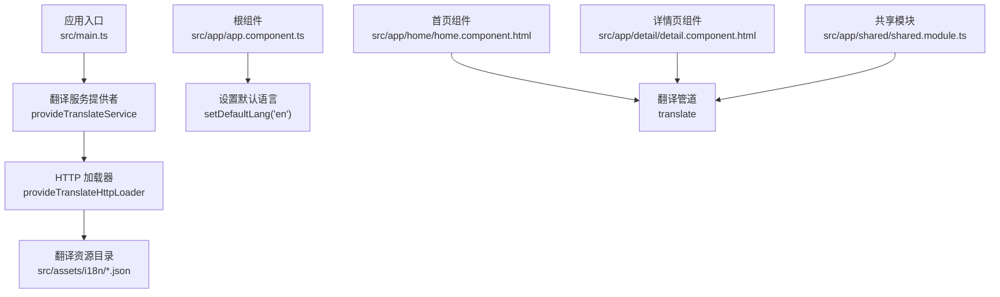
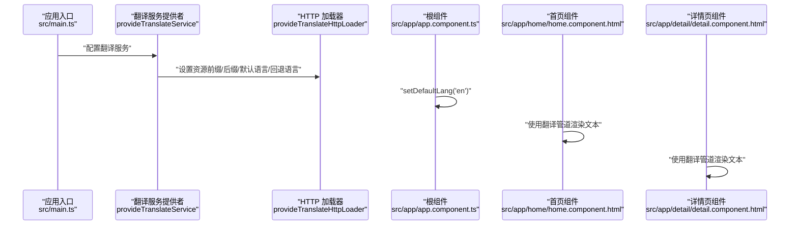
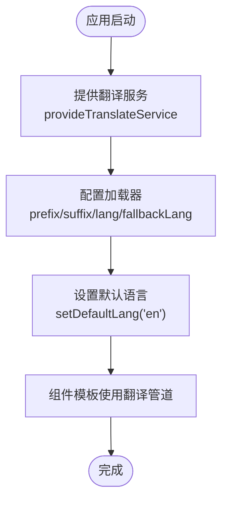
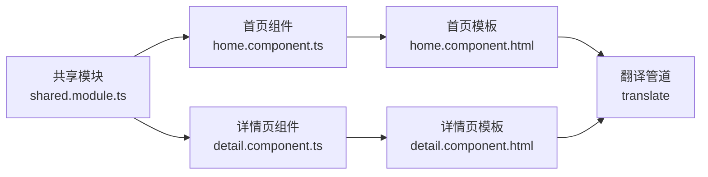
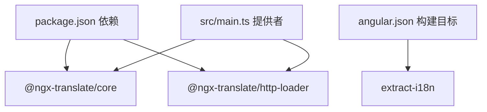

# 国际化支持

<cite>
**本文引用的文件**
- [package.json](file://package.json)
- [angular.json](file://angular.json)
- [src/main.ts](file://src/main.ts)
- [src/app/app.component.ts](file://src/app/app.component.ts)
- [src/app/app.component.html](file://src/app/app.component.html)
- [src/app/home/home.component.ts](file://src/app/home/home.component.ts)
- [src/app/home/home.component.html](file://src/app/home/home.component.html)
- [src/app/detail/detail.component.ts](file://src/app/detail/detail.component.ts)
- [src/app/detail/detail.component.html](file://src/app/detail/detail.component.html)
- [src/app/shared/shared.module.ts](file://src/app/shared/shared.module.ts)
- [src/assets/i18n/en.json](file://src/assets/i18n/en.json)
- [src/environments/environment.ts](file://src/environments/environment.ts)
- [src/environments/environment.dev.ts](file://src/environments/environment.dev.ts)
- [src/environments/environment.prod.ts](file://src/environments/environment.prod.ts)
</cite>

## 目录
1. [简介](#简介)
2. [项目结构](#项目结构)
3. [核心组件](#核心组件)
4. [架构总览](#架构总览)
5. [详细组件分析](#详细组件分析)
6. [依赖关系分析](#依赖关系分析)
7. [性能考虑](#性能考虑)
8. [故障排查指南](#故障排查指南)
9. [结论](#结论)
10. [附录](#附录)

## 简介
本项目基于 Angular 与 @ngx-translate 实现国际化（i18n）支持。通过 HTTP 加载器从 assets 目录加载 JSON 翻译文件，并在应用启动时设置默认语言与回退语言。页面中的文本通过管道直接进行翻译渲染，组件与共享模块均引入了翻译模块以启用翻译功能。

## 项目结构
国际化相关的关键位置与职责如下：
- 配置与引导：在应用入口提供翻译服务与 HTTP 加载器，设置默认语言与回退语言。
- 翻译资源：位于 assets/i18n 目录，按语言命名 JSON 文件。
- 组件与模板：在组件中引入翻译模块，并在模板中使用翻译管道渲染文本。
- 共享模块：集中导出翻译模块，便于复用。

**图表来源**
- [src/main.ts:21-31](file://src/main.ts#L21-L31)
- [src/main.ts:24-28](file://src/main.ts#L24-L28)
- [src/app/app.component.ts:20-21](file://src/app/app.component.ts#L20-L21)
- [src/app/home/home.component.html:3](file://src/app/home/home.component.html#L3)
- [src/app/detail/detail.component.html:3](file://src/app/detail/detail.component.html#L3)
- [src/app/shared/shared.module.ts:8-11](file://src/app/shared/shared.module.ts#L8-L11)

**章节来源**
- [src/main.ts:21-31](file://src/main.ts#L21-L31)
- [src/app/app.component.ts:20-21](file://src/app/app.component.ts#L20-L21)
- [src/app/home/home.component.html:3](file://src/app/home/home.component.html#L3)
- [src/app/detail/detail.component.html:3](file://src/app/detail/detail.component.html#L3)
- [src/app/shared/shared.module.ts:8-11](file://src/app/shared/shared.module.ts#L8-L11)

## 核心组件
- 应用入口提供翻译服务与 HTTP 加载器，指定翻译资源前缀、后缀、默认语言与回退语言。
- 根组件设置默认语言为英文。
- 组件模板通过翻译管道渲染文本；组件与共享模块引入翻译模块以启用翻译能力。

**章节来源**
- [src/main.ts:21-31](file://src/main.ts#L21-L31)
- [src/app/app.component.ts:20-21](file://src/app/app.component.ts#L20-L21)
- [src/app/home/home.component.ts:10](file://src/app/home/home.component.ts#L10)
- [src/app/detail/detail.component.ts:10](file://src/app/detail/detail.component.ts#L10)
- [src/app/shared/shared.module.ts:8-11](file://src/app/shared/shared.module.ts#L8-L11)

## 架构总览
下图展示了应用启动时的国际化初始化流程以及运行期的翻译渲染路径。

**图表来源**
- [src/main.ts:21-31](file://src/main.ts#L21-L31)
- [src/app/app.component.ts:20-21](file://src/app/app.component.ts#L20-L21)
- [src/app/home/home.component.html:3](file://src/app/home/home.component.html#L3)
- [src/app/detail/detail.component.html:3](file://src/app/detail/detail.component.html#L3)

## 详细组件分析

### 应用入口与翻译服务提供
- 在应用引导阶段，通过提供者配置翻译服务，指定 HTTP 加载器的资源前缀与后缀，设置默认语言与回退语言。
- 提供路由与共享模块，确保翻译模块在整个应用范围内可用。

**图表来源**
- [src/main.ts:21-31](file://src/main.ts#L21-L31)
- [src/app/app.component.ts:20-21](file://src/app/app.component.ts#L20-L21)

**章节来源**
- [src/main.ts:21-31](file://src/main.ts#L21-L31)
- [src/app/app.component.ts:20-21](file://src/app/app.component.ts#L20-L21)

### 根组件与默认语言设置
- 根组件注入翻译服务并在构造函数中设置默认语言为英文，确保应用启动时具备可显示的文本内容。

**章节来源**
- [src/app/app.component.ts:14-34](file://src/app/app.component.ts#L14-L34)

### 组件与模板中的翻译使用
- 首页与详情页组件在模板中通过翻译管道渲染文本，组件本身引入翻译模块以启用翻译功能。
- 共享模块导出翻译模块，便于全局复用。

**图表来源**
- [src/app/shared/shared.module.ts:8-11](file://src/app/shared/shared.module.ts#L8-L11)
- [src/app/home/home.component.ts:10](file://src/app/home/home.component.ts#L10)
- [src/app/detail/detail.component.ts:10](file://src/app/detail/detail.component.ts#L10)
- [src/app/home/home.component.html:3](file://src/app/home/home.component.html#L3)
- [src/app/detail/detail.component.html:3](file://src/app/detail/detail.component.html#L3)

**章节来源**
- [src/app/home/home.component.html:3](file://src/app/home/home.component.html#L3)
- [src/app/detail/detail.component.html:3](file://src/app/detail/detail.component.html#L3)
- [src/app/shared/shared.module.ts:8-11](file://src/app/shared/shared.module.ts#L8-L11)

### 翻译资源组织与命名规范
- 翻译文件位于 assets/i18n 目录，按语言代码命名（例如 en.json）。
- 当前仓库包含英文资源文件，用于演示与基础使用。

**章节来源**
- [src/assets/i18n/en.json:1-12](file://src/assets/i18n/en.json#L1-L12)

## 依赖关系分析
- @ngx-translate/core 与 @ngx-translate/http-loader 已作为依赖安装，应用入口通过提供者配置翻译服务与加载器。
- Angular CLI 的 extract-i18n 构建目标已配置，可用于提取翻译键。

**图表来源**
- [package.json:71-72](file://package.json#L71-L72)
- [src/main.ts:11-12](file://src/main.ts#L11-L12)
- [angular.json:98-103](file://angular.json#L98-L103)

**章节来源**
- [package.json:71-72](file://package.json#L71-L72)
- [src/main.ts:11-12](file://src/main.ts#L11-L12)
- [angular.json:98-103](file://angular.json#L98-L103)

## 性能考虑
- 资源加载：HTTP 加载器从 assets 目录加载 JSON 文件，建议保持文件体积适中，避免一次性加载过多语言导致首屏延迟。
- 默认语言与回退语言：设置合理的默认语言与回退语言，减少首次渲染时的闪烁或空白。
- 按需加载：若未来扩展多语言，可结合路由或特性模块按需加载对应语言包，降低初始内存占用。

## 故障排查指南
- 翻译键未生效
  - 检查模板中使用的翻译键是否与资源文件中的键一致。
  - 确认组件已引入翻译模块。
- 语言未切换
  - 确认调用设置默认语言或切换语言的方法是否被执行。
  - 检查资源文件是否存在且命名正确。
- 资源路径问题
  - 确认提供者中配置的资源前缀与后缀与实际文件路径一致。

**章节来源**
- [src/app/home/home.component.html:3](file://src/app/home/home.component.html#L3)
- [src/app/detail/detail.component.html:3](file://src/app/detail/detail.component.html#L3)
- [src/app/shared/shared.module.ts:8-11](file://src/app/shared/shared.module.ts#L8-L11)
- [src/main.ts:24-28](file://src/main.ts#L24-L28)

## 结论
本项目已完整集成 @ngx-translate，通过应用入口提供翻译服务与 HTTP 加载器，设置默认语言与回退语言，并在组件模板中使用翻译管道渲染文本。当前仅包含英文资源，后续可按语言代码新增 JSON 文件并维护键值对，以实现多语言支持。

## 附录

### 多语言配置步骤
- 新增语言包
  - 在 assets/i18n 目录下新增对应语言代码的 JSON 文件（如 fr.json、zh.json）。
  - 保持键结构与现有文件一致，确保翻译键覆盖所有使用场景。
- 设置默认语言与回退语言
  - 在应用入口提供者中配置默认语言与回退语言，确保缺失翻译时有可读文本。
- 动态切换语言
  - 在组件中注入翻译服务，调用设置默认语言的方法以切换语言。
- 语言检测与本地化存储
  - 可结合浏览器语言检测与本地存储实现自动语言选择与持久化。
- 回退机制
  - 当目标语言资源缺失时，系统将回退到回退语言资源，保证界面正常显示。

**章节来源**
- [src/main.ts:24-31](file://src/main.ts#L24-L31)
- [src/app/app.component.ts:20-21](file://src/app/app.component.ts#L20-L21)
- [src/assets/i18n/en.json:1-12](file://src/assets/i18n/en.json#L1-L12)

### 环境配置与构建
- 环境变量
  - 通过环境文件控制生产/开发模式，不影响翻译配置。
- 构建与提取
  - 使用 Angular CLI 的 extract-i18n 目标提取翻译键，辅助翻译维护与校验。

**章节来源**
- [src/environments/environment.ts:1-4](file://src/environments/environment.ts#L1-L4)
- [src/environments/environment.dev.ts:1-4](file://src/environments/environment.dev.ts#L1-L4)
- [src/environments/environment.prod.ts:1-4](file://src/environments/environment.prod.ts#L1-L4)
- [angular.json:98-103](file://angular.json#L98-L103)