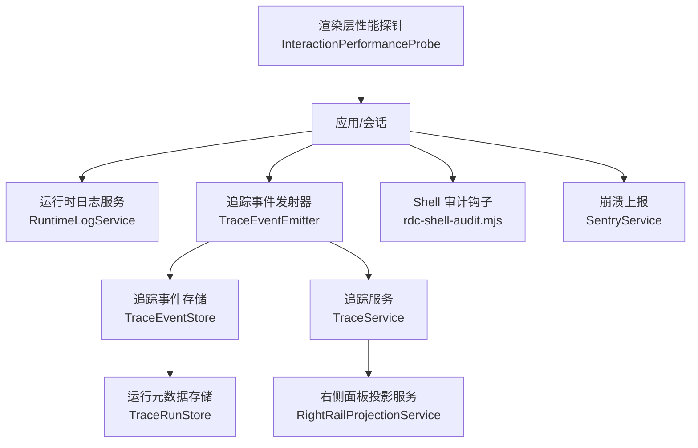
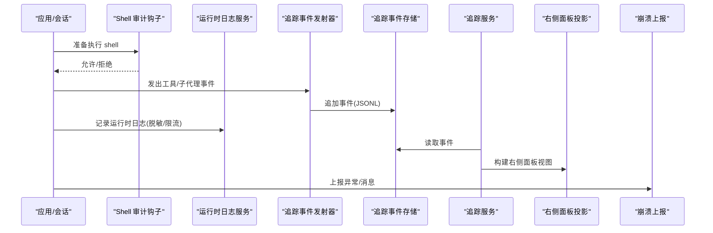
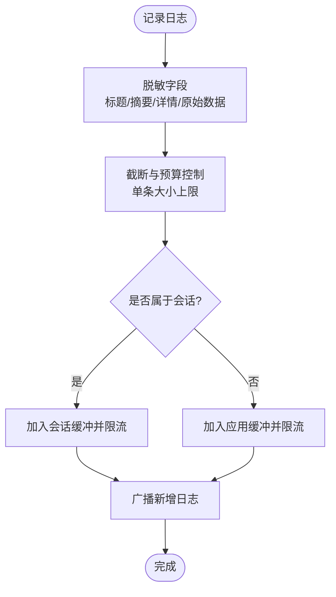
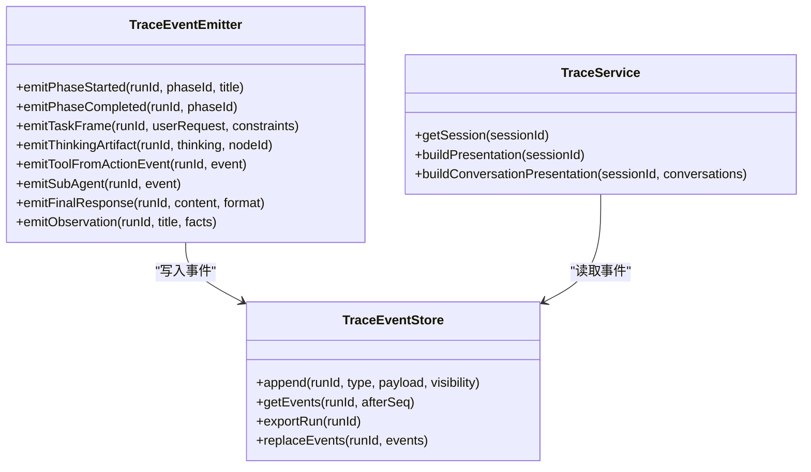
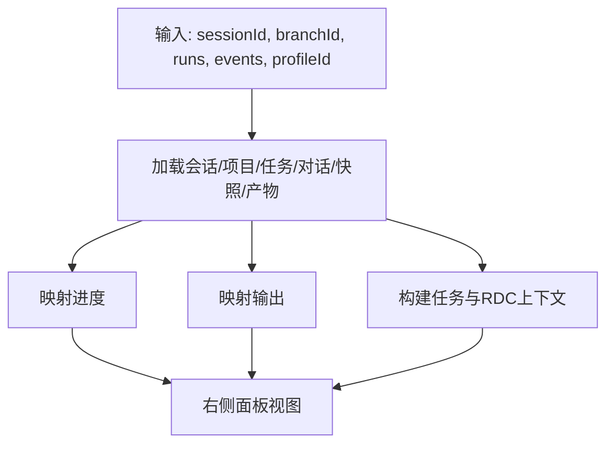
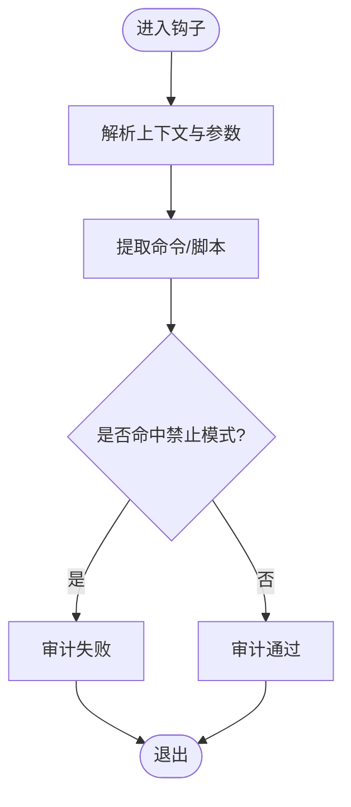
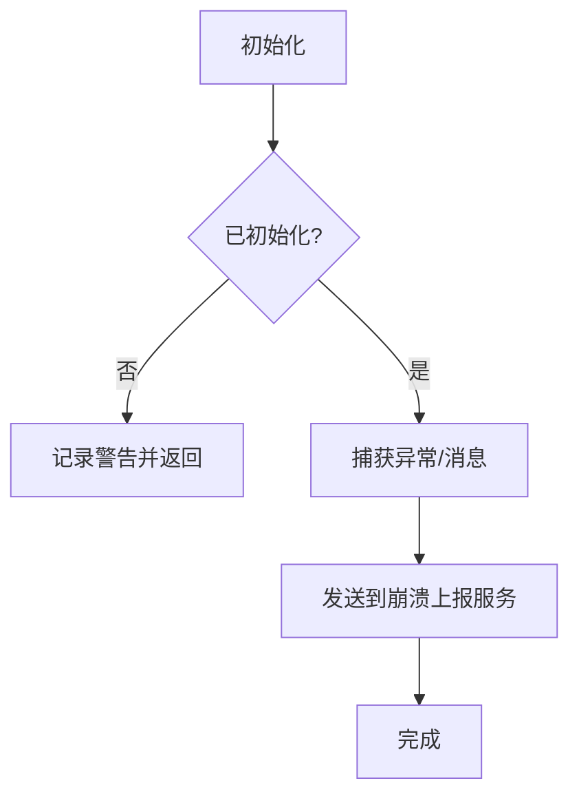
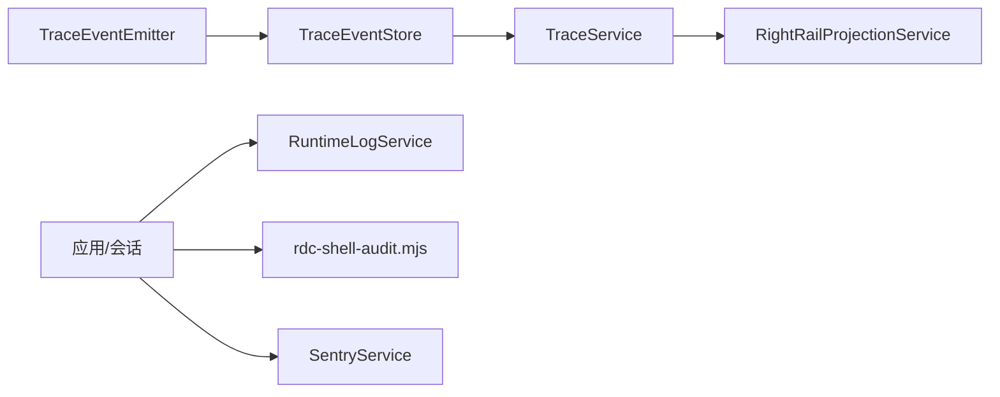

# 安全审计与监控

<cite>
**本文引用的文件**
- [SentryService.ts](file://src/main/telemetry/SentryService.ts)
- [TraceService.ts](file://src/main/agent-trace/TraceService.ts)
- [TraceEventEmitter.ts](file://src/main/agent-trace/TraceEventEmitter.ts)
- [TraceEventStore.ts](file://src/main/agent-trace/TraceEventStore.ts)
- [RightRailProjectionService.ts](file://src/main/agent-trace/RightRailProjectionService.ts)
- [RuntimeLogService.ts](file://src/main/runtime/RuntimeLogService.ts)
- [rdc-shell-audit.mjs](file://resources/agent-runtime/hooks/rdc-shell-audit.mjs)
- [RequestEnvelopeBuilder.test.ts](file://src/main/agent-runtime/prompt/RequestEnvelopeBuilder.test.ts)
- [RequestSnapshotStore.test.ts](file://src/main/agent-runtime/prompt/RequestSnapshotStore.test.ts)
- [ConversationRoutePreflight.ts](file://src/main/conversation/ConversationRoutePreflight.ts)
- [InteractionPerformanceProbe.ts](file://src/renderer/platform/performance/InteractionPerformanceProbe.ts)
</cite>

## 目录
1. [简介](#简介)
2. [项目结构](#项目结构)
3. [核心组件](#核心组件)
4. [架构总览](#架构总览)
5. [详细组件分析](#详细组件分析)
6. [依赖关系分析](#依赖关系分析)
7. [性能考量](#性能考量)
8. [故障排查指南](#故障排查指南)
9. [结论](#结论)
10. [附录](#附录)

## 简介
本文件面向 RDC-Agent 的安全审计与监控，覆盖以下方面：
- 安全事件日志记录、访问审计、操作追踪等机制
- 错误跟踪、性能监控、安全告警等工具的使用方式
- 自动化审计流程（安全扫描、漏洞检测、合规检查）的集成点
- 审计输出（安全仪表板、审计报告、合规报告）的数据来源与呈现
- 安全事件响应、故障排除、性能优化的最佳实践

## 项目结构
RDC-Agent 在“主进程”中实现安全审计与监控的核心能力，包括：
- 运行时日志服务：统一收集、脱敏、限流并广播日志
- 可观测性追踪：将工具调用、子代理、思考片段、最终结果等事件持久化到 JSONL，并构建可视化时间线
- 右侧面板投影：聚合任务上下文、进度、产出与资源，形成审计视图
- 钩子审计：在执行 shell 前对命令进行白名单/黑名单校验，防止硬编码路径或不受控执行
- 崩溃与错误上报：通过 Sentry 上报异常与消息
- 前端性能探针：采集交互性能指标，辅助定位卡顿与体验问题

图表来源
- [RuntimeLogService.ts:1-156](file://src/main/runtime/RuntimeLogService.ts#L1-L156)
- [TraceEventEmitter.ts:1-176](file://src/main/agent-trace/TraceEventEmitter.ts#L1-L176)
- [TraceEventStore.ts:1-144](file://src/main/agent-trace/TraceEventStore.ts#L1-L144)
- [TraceService.ts:1-439](file://src/main/agent-trace/TraceService.ts#L1-L439)
- [RightRailProjectionService.ts:1-97](file://src/main/agent-trace/RightRailProjectionService.ts#L1-L97)
- [rdc-shell-audit.mjs:1-39](file://resources/agent-runtime/hooks/rdc-shell-audit.mjs#L1-L39)
- [SentryService.ts:1-48](file://src/main/telemetry/SentryService.ts#L1-L48)
- [InteractionPerformanceProbe.ts:79-101](file://src/renderer/platform/performance/InteractionPerformanceProbe.ts#L79-L101)

章节来源
- [RuntimeLogService.ts:1-156](file://src/main/runtime/RuntimeLogService.ts#L1-L156)
- [TraceEventEmitter.ts:1-176](file://src/main/agent-trace/TraceEventEmitter.ts#L1-L176)
- [TraceEventStore.ts:1-144](file://src/main/agent-trace/TraceEventStore.ts#L1-L144)
- [TraceService.ts:1-439](file://src/main/agent-trace/TraceService.ts#L1-L439)
- [RightRailProjectionService.ts:1-97](file://src/main/agent-trace/RightRailProjectionService.ts#L1-L97)
- [rdc-shell-audit.mjs:1-39](file://resources/agent-runtime/hooks/rdc-shell-audit.mjs#L1-L39)
- [SentryService.ts:1-48](file://src/main/telemetry/SentryService.ts#L1-L48)
- [InteractionPerformanceProbe.ts:79-101](file://src/renderer/platform/performance/InteractionPerformanceProbe.ts#L79-L101)

## 核心组件
- 运行时日志服务：负责日志条目构造、敏感信息脱敏、大小限制、内存缓冲与跨窗口广播。支持按应用级与会话级范围查询。
- 追踪事件系统：以事件驱动的方式记录工具调用、子代理、思考片段、阶段切换与最终响应；提供导出与重建能力。
- 右侧面板投影：整合会话、任务、上下文、产物与进度，为审计与调查提供统一视图。
- Shell 审计钩子：在执行 shell 之前对命令进行模式匹配校验，阻止硬编码路径或不受控程序调用。
- 崩溃上报：初始化并捕获异常与消息，便于集中式错误追踪。
- 前端性能探针：采集事件时序与长任务样本，生成性能摘要供诊断使用。

章节来源
- [RuntimeLogService.ts:1-156](file://src/main/runtime/RuntimeLogService.ts#L1-L156)
- [TraceEventEmitter.ts:1-176](file://src/main/agent-trace/TraceEventEmitter.ts#L1-L176)
- [TraceEventStore.ts:1-144](file://src/main/agent-trace/TraceEventStore.ts#L1-L144)
- [TraceService.ts:1-439](file://src/main/agent-trace/TraceService.ts#L1-L439)
- [RightRailProjectionService.ts:1-97](file://src/main/agent-trace/RightRailProjectionService.ts#L1-L97)
- [rdc-shell-audit.mjs:1-39](file://resources/agent-runtime/hooks/rdc-shell-audit.mjs#L1-L39)
- [SentryService.ts:1-48](file://src/main/telemetry/SentryService.ts#L1-L48)
- [InteractionPerformanceProbe.ts:79-101](file://src/renderer/platform/performance/InteractionPerformanceProbe.ts#L79-L101)

## 架构总览
下图展示了从业务动作到审计输出的关键数据流：
- 业务动作触发工具调用或子代理执行
- TraceEventEmitter 将动作转换为标准化事件并写入 TraceEventStore
- TraceService 读取事件与对话历史，构建运行视图与右侧面板投影
- RuntimeLogService 记录结构化日志，用于实时诊断与审计
- rdc-shell-audit.mjs 在执行 shell 前进行安全校验
- SentryService 上报崩溃与错误
- 前端 InteractionPerformanceProbe 采集性能指标

图表来源
- [TraceEventEmitter.ts:1-176](file://src/main/agent-trace/TraceEventEmitter.ts#L1-L176)
- [TraceEventStore.ts:1-144](file://src/main/agent-trace/TraceEventStore.ts#L1-L144)
- [TraceService.ts:1-439](file://src/main/agent-trace/TraceService.ts#L1-L439)
- [RightRailProjectionService.ts:1-97](file://src/main/agent-trace/RightRailProjectionService.ts#L1-L97)
- [RuntimeLogService.ts:1-156](file://src/main/runtime/RuntimeLogService.ts#L1-L156)
- [rdc-shell-audit.mjs:1-39](file://resources/agent-runtime/hooks/rdc-shell-audit.mjs#L1-L39)
- [SentryService.ts:1-48](file://src/main/telemetry/SentryService.ts#L1-L48)

## 详细组件分析

### 运行时日志服务（RuntimeLogService）
- 功能要点
  - 日志条目包含作用域、命名空间、严重级别、标题、摘要、详情、原始数据与关联标识（会话/项目/运行）
  - 自动对标题、摘要、详情与原始数据进行敏感信息脱敏
  - 单条日志大小上限控制，避免过大条目影响性能
  - 应用级与会话级双缓冲，限制最大条目数
  - 通过事件总线与窗口消息广播新增日志，便于 UI 实时展示
- 适用场景
  - 安全审计：记录 LLM 诊断、权限相关警告、配置变更等
  - 故障排查：快速定位错误上下文与调用链
  - 合规留痕：保留带时间戳的结构化日志用于审计

图表来源
- [RuntimeLogService.ts:1-156](file://src/main/runtime/RuntimeLogService.ts#L1-L156)

章节来源
- [RuntimeLogService.ts:1-156](file://src/main/runtime/RuntimeLogService.ts#L1-L156)

### 追踪事件系统（TraceEventEmitter / TraceEventStore / TraceService）
- 事件类型
  - 阶段开始/完成：理解、工作、总结等阶段
  - 任务帧：本次任务的用户请求与约束
  - 思考片段：显式推理摘要（可见性控制）
  - 工具调用：输入预览、输出摘要、观察项、耗时、状态
  - 子代理：目标代理、输入摘要、状态
  - 最终响应：任务结束的最终内容
- 存储与一致性
  - 每个运行对应一个 JSONL 事件文件
  - 序列号单调递增，结合锁文件与磁盘最大值，避免并发冲突
  - 提供导出与替换能力，便于离线分析与修复
- 视图构建
  - TraceService 读取会话、对话、事件与状态，构建运行视图与右侧面板投影
  - 支持历史回合与当前运行的统一呈现

图表来源
- [TraceEventEmitter.ts:1-176](file://src/main/agent-trace/TraceEventEmitter.ts#L1-L176)
- [TraceEventStore.ts:1-144](file://src/main/agent-trace/TraceEventStore.ts#L1-L144)
- [TraceService.ts:1-439](file://src/main/agent-trace/TraceService.ts#L1-L439)

章节来源
- [TraceEventEmitter.ts:1-176](file://src/main/agent-trace/TraceEventEmitter.ts#L1-L176)
- [TraceEventStore.ts:1-144](file://src/main/agent-trace/TraceEventStore.ts#L1-L144)
- [TraceService.ts:1-439](file://src/main/agent-trace/TraceService.ts#L1-L439)

### 右侧面板投影（RightRailProjectionService）
- 职责
  - 聚合会话、任务、上下文、产物与进度，形成审计与调查所需的右侧面板视图
  - 整合会话快照、可用捕获、任务资源、权限模式等信息
- 数据来源
  - 会话与项目信息、任务注册表、对话历史、请求快照、调查产物
- 输出
  - 进度列表、产物行、上下文（任务与 RDC）、输出集合

图表来源
- [RightRailProjectionService.ts:1-97](file://src/main/agent-trace/RightRailProjectionService.ts#L1-L97)

章节来源
- [RightRailProjectionService.ts:1-97](file://src/main/agent-trace/RightRailProjectionService.ts#L1-L97)

### Shell 审计钩子（rdc-shell-audit.mjs）
- 目的
  - 在执行 shell 前对命令进行安全审计，禁止硬编码路径或不受控程序调用
- 机制
  - 解析钩子上下文，提取工具名与命令参数
  - 对命令与脚本内容进行模式匹配，命中则失败
  - 未命中则放行
- 审计价值
  - 防止绕过受控执行通道
  - 强制使用设置中配置的 RDC shell 动作

图表来源
- [rdc-shell-audit.mjs:1-39](file://resources/agent-runtime/hooks/rdc-shell-audit.mjs#L1-L39)

章节来源
- [rdc-shell-audit.mjs:1-39](file://resources/agent-runtime/hooks/rdc-shell-audit.mjs#L1-L39)

### 崩溃与错误上报（SentryService）
- 功能
  - 初始化崩溃上报客户端（可选环境、版本）
  - 捕获异常与消息，附带上下文
  - 若依赖缺失则降级为控制台警告
- 使用建议
  - 在应用启动时初始化
  - 在关键路径捕获异常并附加必要上下文
  - 区分 info/warning/error 级别

图表来源
- [SentryService.ts:1-48](file://src/main/telemetry/SentryService.ts#L1-L48)

章节来源
- [SentryService.ts:1-48](file://src/main/telemetry/SentryService.ts#L1-L48)

### 前端性能探针（InteractionPerformanceProbe）
- 功能
  - 采集事件时序与长任务样本
  - 计算交互性能摘要并注入文档属性，便于后续分析
- 用途
  - 识别卡顿与性能瓶颈
  - 配合后端日志与追踪进行端到端诊断

章节来源
- [InteractionPerformanceProbe.ts:79-101](file://src/renderer/platform/performance/InteractionPerformanceProbe.ts#L79-L101)

## 依赖关系分析
- 耦合与内聚
  - TraceEventEmitter 与 TraceEventStore 高内聚，专注于事件生命周期
  - TraceService 作为协调者，组合多个服务构建视图
  - RightRailProjectionService 聚合多源数据，降低上层复杂度
  - RuntimeLogService 独立于追踪系统，提供通用日志能力
  - rdc-shell-audit.mjs 作为前置钩子，与执行链路解耦
  - SentryService 作为外部依赖的封装，保持内部接口稳定
- 外部依赖
  - Electron 窗口与事件总线（日志广播）
  - 文件系统（JSONL 事件与运行元数据）
  - Sentry（崩溃上报）
- 潜在风险
  - 事件文件过大导致读取与序列化开销
  - 并发写入需依赖锁文件与序列号保护
  - 日志原始数据可能包含敏感信息，需严格脱敏

图表来源
- [TraceEventEmitter.ts:1-176](file://src/main/agent-trace/TraceEventEmitter.ts#L1-L176)
- [TraceEventStore.ts:1-144](file://src/main/agent-trace/TraceEventStore.ts#L1-L144)
- [TraceService.ts:1-439](file://src/main/agent-trace/TraceService.ts#L1-L439)
- [RightRailProjectionService.ts:1-97](file://src/main/agent-trace/RightRailProjectionService.ts#L1-L97)
- [RuntimeLogService.ts:1-156](file://src/main/runtime/RuntimeLogService.ts#L1-L156)
- [rdc-shell-audit.mjs:1-39](file://resources/agent-runtime/hooks/rdc-shell-audit.mjs#L1-L39)
- [SentryService.ts:1-48](file://src/main/telemetry/SentryService.ts#L1-L48)

章节来源
- [TraceEventEmitter.ts:1-176](file://src/main/agent-trace/TraceEventEmitter.ts#L1-L176)
- [TraceEventStore.ts:1-144](file://src/main/agent-trace/TraceEventStore.ts#L1-L144)
- [TraceService.ts:1-439](file://src/main/agent-trace/TraceService.ts#L1-L439)
- [RightRailProjectionService.ts:1-97](file://src/main/agent-trace/RightRailProjectionService.ts#L1-L97)
- [RuntimeLogService.ts:1-156](file://src/main/runtime/RuntimeLogService.ts#L1-L156)
- [rdc-shell-audit.mjs:1-39](file://resources/agent-runtime/hooks/rdc-shell-audit.mjs#L1-L39)
- [SentryService.ts:1-48](file://src/main/telemetry/SentryService.ts#L1-L48)

## 性能考量
- 日志大小控制
  - 单条日志字节上限与字段截断策略，避免内存与传输压力
  - 应用级与会话级缓冲限制，防止无限增长
- 事件存储
  - JSONL 追加写入，顺序读取，减少随机 IO
  - 序列号冲突检测与修复，保证一致性
- 视图构建
  - 右侧面板投影批量聚合数据，减少重复计算
  - 仅加载必要上下文，降低渲染负担
- 前端性能
  - 事件时序与长任务采样，帮助定位卡顿
  - 将性能摘要注入文档属性，便于外部工具采集

[本节为通用指导，不直接分析具体文件]

## 故障排查指南
- 常见问题定位
  - 工具调用失败：查看追踪事件中的工具状态、输入预览与输出摘要
  - 会话状态异常：检查运行元数据与阶段事件，确认阶段切换是否符合预期
  - Shell 执行被拒绝：核对 rdc-shell-audit.mjs 的模式匹配规则，调整命令或配置
  - 崩溃与错误：通过 SentryService 上报的异常与消息进行根因分析
  - 性能问题：结合前端性能探针与运行时日志，定位慢调用与阻塞点
- 建议步骤
  - 启用并收集运行时日志，关注命名空间与严重级别
  - 导出运行事件，离线分析事件序列与节点关系
  - 检查右侧面板投影的进度与产物，确认任务上下文完整性
  - 在关键路径添加更细粒度的日志与追踪事件
  - 对高频或大体积数据进行采样与压缩

章节来源
- [TraceEventEmitter.ts:1-176](file://src/main/agent-trace/TraceEventEmitter.ts#L1-L176)
- [TraceEventStore.ts:1-144](file://src/main/agent-trace/TraceEventStore.ts#L1-L144)
- [TraceService.ts:1-439](file://src/main/agent-trace/TraceService.ts#L1-L439)
- [RuntimeLogService.ts:1-156](file://src/main/runtime/RuntimeLogService.ts#L1-L156)
- [rdc-shell-audit.mjs:1-39](file://resources/agent-runtime/hooks/rdc-shell-audit.mjs#L1-L39)
- [SentryService.ts:1-48](file://src/main/telemetry/SentryService.ts#L1-L48)

## 结论
RDC-Agent 通过运行时日志、追踪事件、右侧面板投影、Shell 审计钩子与崩溃上报，构建了完整的安全审计与监控体系。该体系既能满足日常故障排查与性能优化需求，也能支撑安全事件响应与合规审计。建议在持续交付中强化自动化审计与合规检查，并将审计输出纳入统一仪表板与报告体系。

[本节为总结，不直接分析具体文件]

## 附录

### 安全事件日志记录与访问审计
- 运行时日志
  - 记录 LLM 诊断、权限相关警告、配置变更等
  - 通过命名空间与严重级别进行分类与过滤
- 访问审计
  - 基于追踪事件的工具调用与子代理执行记录
  - 右侧面板投影提供上下文与产物，便于追溯访问路径

章节来源
- [RuntimeLogService.ts:1-156](file://src/main/runtime/RuntimeLogService.ts#L1-L156)
- [TraceEventEmitter.ts:1-176](file://src/main/agent-trace/TraceEventEmitter.ts#L1-L176)
- [RightRailProjectionService.ts:1-97](file://src/main/agent-trace/RightRailProjectionService.ts#L1-L97)

### 操作追踪与可视化
- 追踪事件
  - 阶段、任务帧、思考片段、工具调用、子代理、最终响应
- 可视化
  - 右侧面板投影聚合进度、产物与上下文
  - 支持导出与离线分析

章节来源
- [TraceEventEmitter.ts:1-176](file://src/main/agent-trace/TraceEventEmitter.ts#L1-L176)
- [TraceService.ts:1-439](file://src/main/agent-trace/TraceService.ts#L1-L439)
- [RightRailProjectionService.ts:1-97](file://src/main/agent-trace/RightRailProjectionService.ts#L1-L97)

### 错误跟踪、性能监控与安全告警
- 错误跟踪
  - SentryService 上报异常与消息，支持环境与版本标记
- 性能监控
  - 前端性能探针采集事件时序与长任务样本
- 安全告警
  - Shell 审计钩子阻止不受控执行
  - 运行时日志记录安全相关警告

章节来源
- [SentryService.ts:1-48](file://src/main/telemetry/SentryService.ts#L1-L48)
- [InteractionPerformanceProbe.ts:79-101](file://src/renderer/platform/performance/InteractionPerformanceProbe.ts#L79-L101)
- [rdc-shell-audit.mjs:1-39](file://resources/agent-runtime/hooks/rdc-shell-audit.mjs#L1-L39)
- [RuntimeLogService.ts:1-156](file://src/main/runtime/RuntimeLogService.ts#L1-L156)

### 自动化审计流程（安全扫描、漏洞检测、合规检查）
- 集成点
  - 钩子审计：shell 执行前模式匹配校验
  - 运行时日志：记录配置与权限相关变更
  - 追踪事件：记录工具调用与执行结果
- 建议
  - 将钩子审计纳入 CI/CD 门禁
  - 定期导出运行事件进行离线分析
  - 结合运行时日志与追踪事件生成合规报告

章节来源
- [rdc-shell-audit.mjs:1-39](file://resources/agent-runtime/hooks/rdc-shell-audit.mjs#L1-L39)
- [RuntimeLogService.ts:1-156](file://src/main/runtime/RuntimeLogService.ts#L1-L156)
- [TraceEventEmitter.ts:1-176](file://src/main/agent-trace/TraceEventEmitter.ts#L1-L176)

### 审计输出（安全仪表板、审计报告、合规报告）
- 数据来源
  - 运行时日志：结构化日志条目
  - 追踪事件：事件序列与节点关系
  - 右侧面板投影：进度、产物与上下文
- 呈现方式
  - 仪表板：实时日志与事件流
  - 报告：导出运行事件与日志摘要
  - 合规：基于钩子审计与日志的合规证据

章节来源
- [RuntimeLogService.ts:1-156](file://src/main/runtime/RuntimeLogService.ts#L1-L156)
- [TraceEventStore.ts:1-144](file://src/main/agent-trace/TraceEventStore.ts#L1-L144)
- [RightRailProjectionService.ts:1-97](file://src/main/agent-trace/RightRailProjectionService.ts#L1-L97)

### 安全事件响应、故障排除与性能优化最佳实践
- 事件响应
  - 快速定位：通过追踪事件与运行时日志缩小范围
  - 隔离与恢复：利用右侧面板投影确认上下文与产物
- 故障排除
  - 检查 Shell 审计结果与日志
  - 导出运行事件进行离线分析
- 性能优化
  - 结合前端性能探针与后端日志定位瓶颈
  - 对大体积数据进行采样与压缩

章节来源
- [TraceEventEmitter.ts:1-176](file://src/main/agent-trace/TraceEventEmitter.ts#L1-L176)
- [TraceEventStore.ts:1-144](file://src/main/agent-trace/TraceEventStore.ts#L1-L144)
- [RuntimeLogService.ts:1-156](file://src/main/runtime/RuntimeLogService.ts#L1-L156)
- [InteractionPerformanceProbe.ts:79-101](file://src/renderer/platform/performance/InteractionPerformanceProbe.ts#L79-L101)

### 敏感信息与请求信封脱敏
- 请求信封构建
  - 测试用例表明会脱敏凭证、图像载荷与不透明推理，同时保留请求结构
- 请求快照存储
  - 测试用例显示系统提示中的凭证会被脱敏，并记录脱敏原因
- 建议
  - 在所有落盘与上报路径中强制脱敏
  - 记录脱敏元数据以便审计

章节来源
- [RequestEnvelopeBuilder.test.ts:1-28](file://src/main/agent-runtime/prompt/RequestEnvelopeBuilder.test.ts#L1-L28)
- [RequestSnapshotStore.test.ts:36-81](file://src/main/agent-runtime/prompt/RequestSnapshotStore.test.ts#L36-L81)

### LLM 诊断与运行时日志集成
- 诊断记录
  - 将 LLM 诊断记录为运行时日志，包含会话、项目、运行标识与原始元数据
- 建议
  - 使用合适的命名空间与严重级别
  - 在报告中聚合诊断统计与趋势

章节来源
- [ConversationRoutePreflight.ts:499-521](file://src/main/conversation/ConversationRoutePreflight.ts#L499-L521)