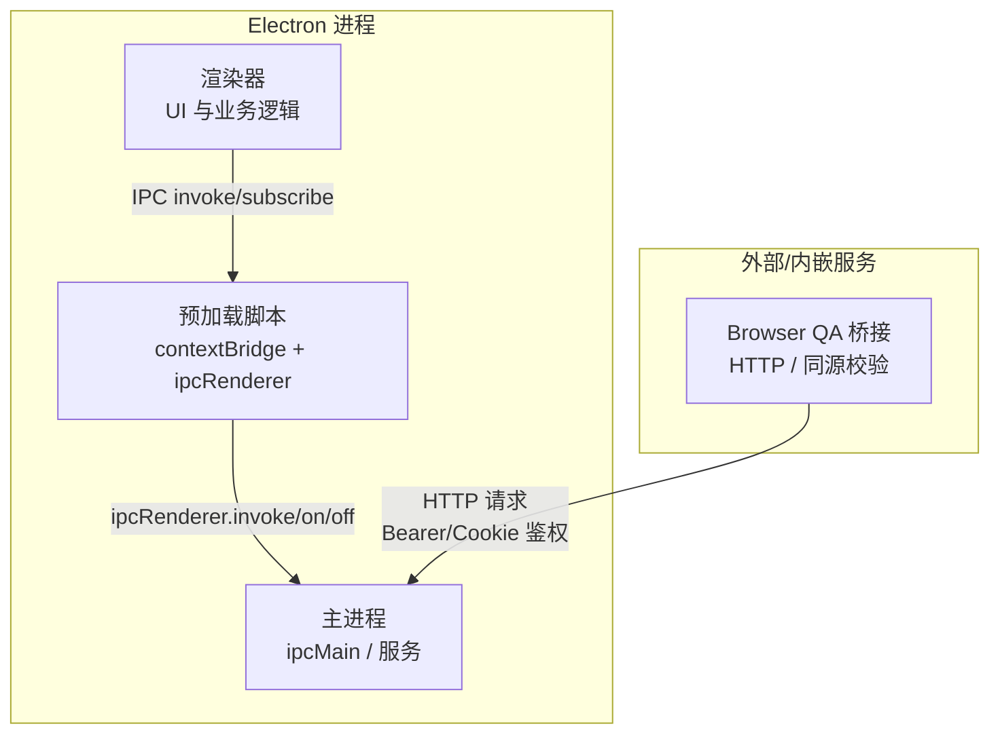
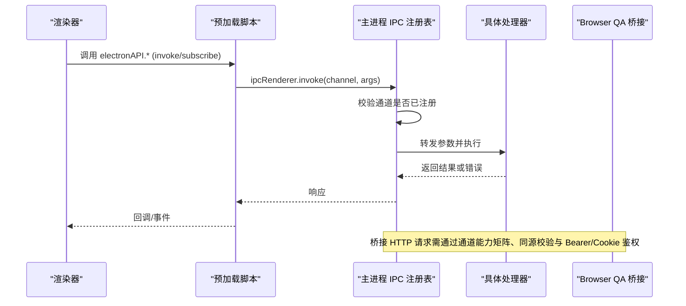
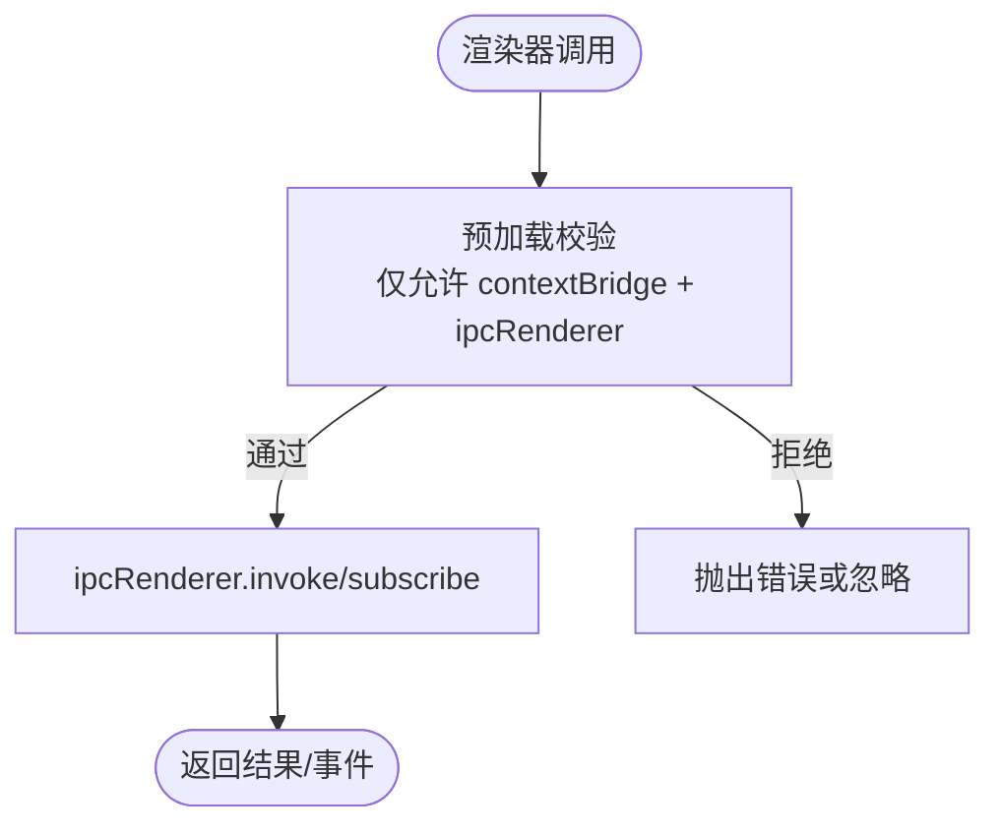
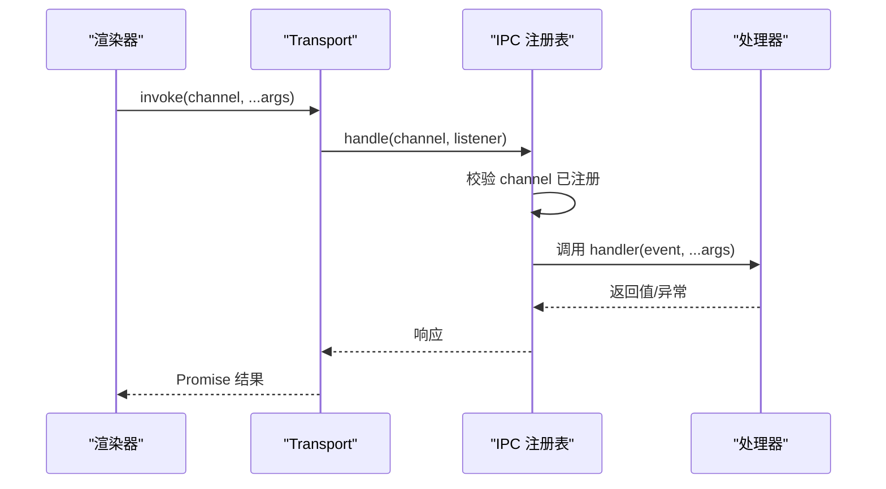
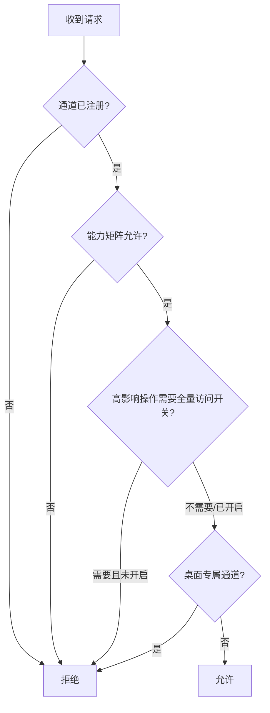
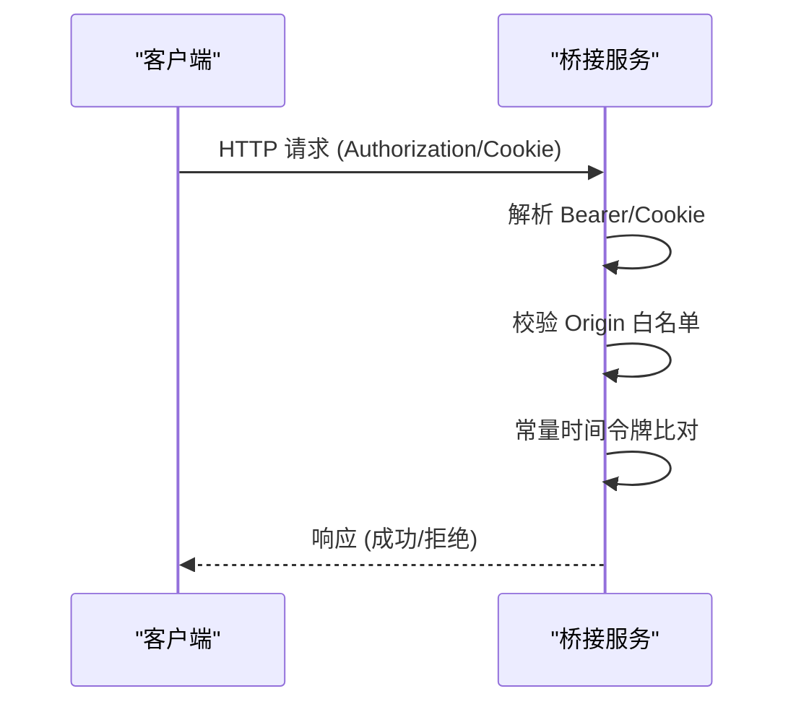
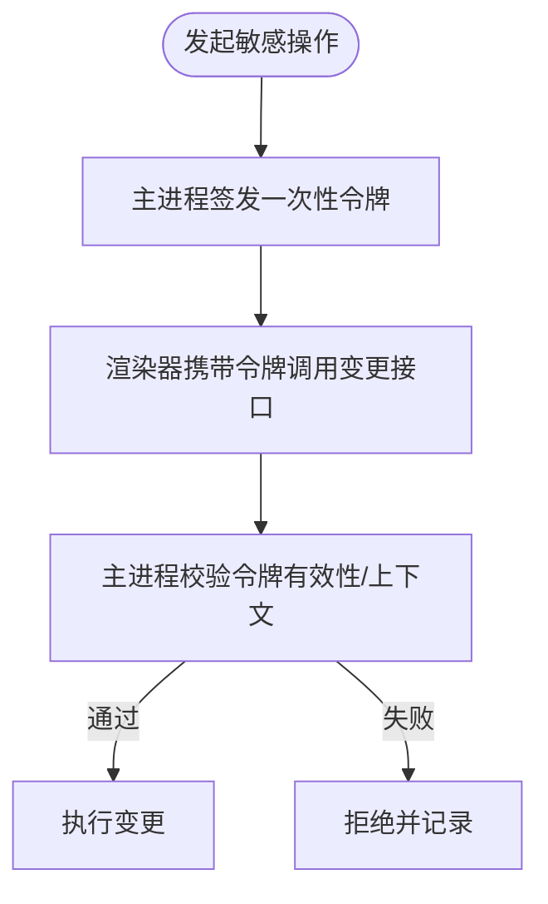
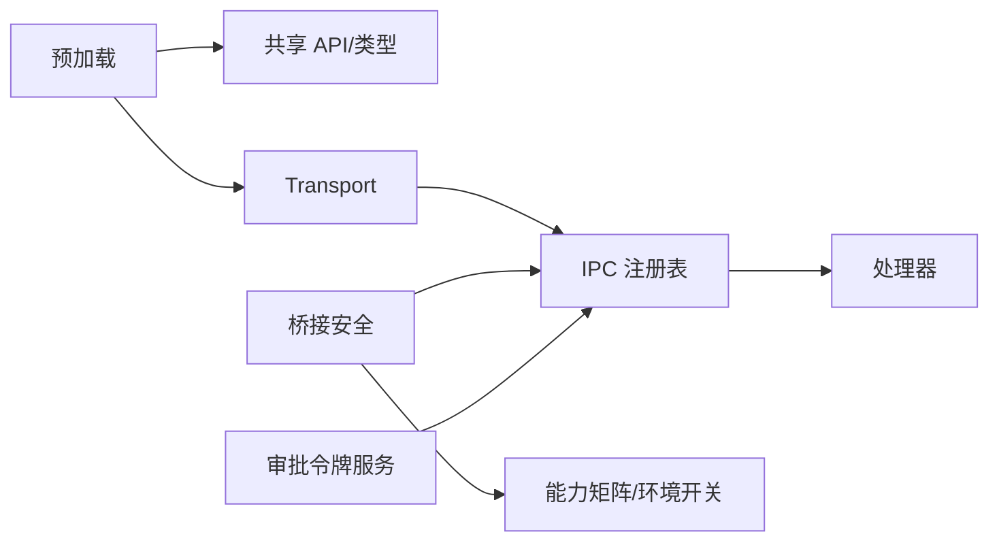

# 安全架构设计

<cite>
**本文引用的文件**
- [src/preload/index.ts](file://src/preload/index.ts)
- [src/preload/rendererTransport.ts](file://src/preload/rendererTransport.ts)
- [src/main/ipc/README.md](file://src/main/ipc/README.md)
- [src/main/ipc/invokeRegistry.ts](file://src/main/ipc/invokeRegistry.ts)
- [src/main/ipc/handlers.ts](file://src/main/ipc/handlers.ts)
- [src/main/browserAppBridge/bridgeSecurity.ts](file://src/main/browserAppBridge/bridgeSecurity.ts)
- [src/main/ipc/validation/IpcApprovalTokenService.ts](file://src/main/ipc/validation/IpcApprovalTokenService.ts)
- [electron.vite.config.ts](file://electron.vite.config.ts)
- [scripts/launch-rdc-agent.mjs](file://scripts/launch-rdc-agent.mjs)
</cite>

## 目录
1. [简介](#简介)
2. [项目结构](#项目结构)
3. [核心组件](#核心组件)
4. [架构总览](#架构总览)
5. [详细组件分析](#详细组件分析)
6. [依赖关系分析](#依赖关系分析)
7. [性能与安全权衡](#性能与安全权衡)
8. [故障排查指南](#故障排查指南)
9. [结论](#结论)
10. [附录](#附录)

## 简介
本文件面向 RDC-Agent 的安全架构设计，聚焦 Electron 应用的主进程、预加载脚本与渲染器之间的安全边界，系统化的 IPC 通信安全机制（消息验证、权限检查、沙箱隔离），安全令牌系统与请求签名/认证，以及传输加密与配置策略。文档同时给出最佳实践与常见威胁的防护建议，帮助开发者在保持功能完整性的前提下构建可审计、可演进的安全体系。

## 项目结构
RDC-Agent 采用典型的 Electron 三进程模型：主进程负责系统能力与资源管理；预加载脚本通过 contextBridge 暴露最小化 API；渲染器仅持有 UI 逻辑并通过预加载访问受限能力。IPC 通道集中注册与校验，浏览器 QA 桥接提供受控的 Web 入口并复用同一套安全策略。

图示来源
- [src/preload/index.ts:1-26](file://src/preload/index.ts#L1-L26)
- [src/preload/rendererTransport.ts:1-45](file://src/preload/rendererTransport.ts#L1-L45)
- [src/main/ipc/invokeRegistry.ts:1-51](file://src/main/ipc/invokeRegistry.ts#L1-L51)
- [src/main/browserAppBridge/bridgeSecurity.ts:1-120](file://src/main/browserAppBridge/bridgeSecurity.ts#L1-L120)

章节来源
- [src/main/ipc/README.md:1-10](file://src/main/ipc/README.md#L1-L10)
- [electron.vite.config.ts:1-63](file://electron.vite.config.ts#L1-L63)

## 核心组件
- 预加载脚本：以沙箱兼容方式仅使用 contextBridge 与 ipcRenderer，不引入 Node 内置模块，对外暴露最小化 API。
- IPC 注册表：统一拦截 ipcMain.handle，集中注册与校验调用通道，保证渲染端与主进程通道一致性。
- 桥接安全：对 Browser QA 入口实施通道能力矩阵、环境开关、同源校验与 Bearer/Cookie 双模式鉴权。
- 审批令牌：针对敏感写操作发放一次性令牌，强制由主进程授权，防止渲染器自声明权限。
- 启动与环境：通过启动脚本注入运行模式与环境变量，控制开发/生产/无头模式及能力开关。

章节来源
- [src/preload/index.ts:1-26](file://src/preload/index.ts#L1-L26)
- [src/main/ipc/invokeRegistry.ts:1-51](file://src/main/ipc/invokeRegistry.ts#L1-L51)
- [src/main/browserAppBridge/bridgeSecurity.ts:1-120](file://src/main/browserAppBridge/bridgeSecurity.ts#L1-L120)
- [src/main/ipc/validation/IpcApprovalTokenService.ts:1-80](file://src/main/ipc/validation/IpcApprovalTokenService.ts#L1-L80)
- [scripts/launch-rdc-agent.mjs:387-407](file://scripts/launch-rdc-agent.mjs#L387-L407)

## 架构总览
下图展示从渲染器到主进程的受控调用路径，以及 Browser QA 桥接的鉴权流程。所有跨进程调用必须经过预加载与 IPC 注册表，桥接请求需满足通道能力与环境白名单。

图示来源
- [src/preload/rendererTransport.ts:1-45](file://src/preload/rendererTransport.ts#L1-L45)
- [src/main/ipc/invokeRegistry.ts:1-51](file://src/main/ipc/invokeRegistry.ts#L1-L51)
- [src/main/browserAppBridge/bridgeSecurity.ts:1-120](file://src/main/browserAppBridge/bridgeSecurity.ts#L1-L120)

## 详细组件分析

### 预加载脚本与渲染器边界
- 安全边界：预加载脚本仅暴露 contextBridge 方法，禁止直接导入 Node 内置模块，避免渲染器获得任意 Node API 访问。
- 最小化 API：通过 createRendererApi 封装平台差异，并以 transport 抽象 ipcRenderer 的 invoke/subscribe，便于替换与测试。
- 文件路径能力：通过 webUtils.getPathForFile 安全地获取文件路径，异常时回退为 null，降低信息泄露风险。

图示来源
- [src/preload/index.ts:1-26](file://src/preload/index.ts#L1-L26)
- [src/preload/rendererTransport.ts:1-45](file://src/preload/rendererTransport.ts#L1-L45)

章节来源
- [src/preload/index.ts:1-26](file://src/preload/index.ts#L1-L26)
- [src/preload/rendererTransport.ts:1-45](file://src/preload/rendererTransport.ts#L1-L45)

### IPC 通信安全机制
- 通道注册与一致性：installIpcInvokeRegistry 拦截 ipcMain.handle，集中记录所有已注册通道；assertRendererIpcParity 确保渲染端声明的通道全部在主进程有实现，防止未实现通道被调用。
- 调用路由：invokeRegisteredIpcChannel 根据 channel 查找 handler 并构造 IpcMainInvokeEvent 进行调用，保证调用上下文一致。
- 域与清单：IPC 文档强调新增通道需登记域并同步 preload/shared/types/electron 与浏览器 fallback，确保类型与行为一致。

图示来源
- [src/main/ipc/invokeRegistry.ts:1-51](file://src/main/ipc/invokeRegistry.ts#L1-L51)
- [src/main/ipc/handlers.ts:1-7](file://src/main/ipc/handlers.ts#L1-L7)
- [src/main/ipc/README.md:1-10](file://src/main/ipc/README.md#L1-L10)

章节来源
- [src/main/ipc/invokeRegistry.ts:1-51](file://src/main/ipc/invokeRegistry.ts#L1-L51)
- [src/main/ipc/handlers.ts:1-7](file://src/main/ipc/handlers.ts#L1-L7)
- [src/main/ipc/README.md:1-10](file://src/main/ipc/README.md#L1-L10)

### 权限检查与沙箱隔离
- 通道能力矩阵：isBridgeChannelAllowed 基于通道能力（read/mutation/high-impact/desktop-only）与环境开关（如 RDC_AGENT_BROWSER_QA_FULL_ACCESS）决定请求是否允许。
- 同源校验：isOriginAllowed 区分 Cookie 与 Bearer 两种鉴权模式，Cookie 模式要求 Origin 严格等于 bridgeOrigin，防止跨站伪造。
- 沙箱限制：预加载脚本禁用 Node 内置模块，渲染器仅能通过 contextBridge 暴露的有限 API 访问系统能力。

图示来源
- [src/main/browserAppBridge/bridgeSecurity.ts:1-120](file://src/main/browserAppBridge/bridgeSecurity.ts#L1-L120)

章节来源
- [src/main/browserAppBridge/bridgeSecurity.ts:1-120](file://src/main/browserAppBridge/bridgeSecurity.ts#L1-L120)

### 安全令牌系统与请求认证
- 桥接令牌：createBridgeBearerToken 生成随机 Bearer 令牌；extractBearerToken 解析 Authorization 头；resolveBridgeCookieToken 解析 HttpOnly Cookie；buildBridgeAuthCookie 生成安全 Cookie（HttpOnly、SameSite=Strict、可选 Secure）。
- 令牌比对：tokensMatch 使用 timingSafeEqual 进行常量时间比较，防止时序攻击。
- 来源白名单：resolveBridgeAllowedOrigins 限定允许的 Origin；cookieOriginRequiredForPath 指定必须同源的路径集合。

图示来源
- [src/main/browserAppBridge/bridgeSecurity.ts:1-120](file://src/main/browserAppBridge/bridgeSecurity.ts#L1-L120)

章节来源
- [src/main/browserAppBridge/bridgeSecurity.ts:1-120](file://src/main/browserAppBridge/bridgeSecurity.ts#L1-L120)

### 敏感操作的审批令牌
- 一次性令牌：IpcApprovalTokenService.issue 生成短期有效的随机令牌，绑定 action/scope/name/projectRoot 等上下文。
- 消费校验：consume 删除令牌并校验动作、范围与上下文完全匹配，过期则拒绝。
- 用途：用于 memory/knowledge 等敏感写操作，强制渲染器先向主进程申请批准，再携带令牌完成变更，避免自授权。

图示来源
- [src/main/ipc/validation/IpcApprovalTokenService.ts:1-80](file://src/main/ipc/validation/IpcApprovalTokenService.ts#L1-L80)

章节来源
- [src/main/ipc/validation/IpcApprovalTokenService.ts:1-80](file://src/main/ipc/validation/IpcApprovalTokenService.ts#L1-L80)

### 传输加密与配置策略
- 传输加密：当前仓库未包含端到端 TLS 配置代码片段；建议在部署层启用 HTTPS（反向代理/网关），并在桥接 Cookie 中设置 Secure 标志以强制 HTTPS 传输。
- 配置选项：通过启动脚本注入环境变量控制运行模式（desktop/browser/headless）、QA 开关与用户数据路径，减少运行时配置漂移。
- 构建与入口：electron-vite 配置明确 main/preload/renderer 入口，便于静态分析与安全扫描。

章节来源
- [scripts/launch-rdc-agent.mjs:387-407](file://scripts/launch-rdc-agent.mjs#L387-L407)
- [electron.vite.config.ts:1-63](file://electron.vite.config.ts#L1-L63)

## 依赖关系分析
- 预加载依赖共享 API 与 Transport 抽象，屏蔽底层 ipcRenderer 细节。
- 主进程 IPC 注册表依赖共享通道枚举，确保两端一致性。
- 桥接安全依赖通道能力矩阵与注册表，形成“通道+能力+环境”的三重校验。
- 审批令牌服务独立于其他模块，通过 IPC 通道被调用，降低耦合度。

图示来源
- [src/preload/rendererTransport.ts:1-45](file://src/preload/rendererTransport.ts#L1-L45)
- [src/main/ipc/invokeRegistry.ts:1-51](file://src/main/ipc/invokeRegistry.ts#L1-L51)
- [src/main/browserAppBridge/bridgeSecurity.ts:1-120](file://src/main/browserAppBridge/bridgeSecurity.ts#L1-L120)
- [src/main/ipc/validation/IpcApprovalTokenService.ts:1-80](file://src/main/ipc/validation/IpcApprovalTokenService.ts#L1-L80)

章节来源
- [src/main/ipc/invokeRegistry.ts:1-51](file://src/main/ipc/invokeRegistry.ts#L1-L51)
- [src/main/browserAppBridge/bridgeSecurity.ts:1-120](file://src/main/browserAppBridge/bridgeSecurity.ts#L1-L120)

## 性能与安全权衡
- 预加载最小化：减少 Node 模块导入可降低攻击面，但可能增加桥接调用开销；建议批量事件订阅与按需 invoke。
- 通道注册表：集中校验带来额外 Map 查找成本，但换来强一致性与可观测性；可通过缓存热点通道映射优化。
- 令牌生命周期：审批令牌 TTL 较短可减少重放风险，但频繁申请会增加交互延迟；建议结合用户意图合并批处理。
- 桥接鉴权：同源校验与常量时间比对开销较低，但在高并发下需注意锁竞争与内存占用；建议限流与连接池管理。

[本节为通用指导，无需特定文件引用]

## 故障排查指南
- 通道缺失：若出现“未注册的 IPC 通道”错误，检查 assertRendererIpcParity 是否通过，确认渲染端与主进程通道定义一致。
- 桥接拒绝：若桥接请求被拒，检查通道能力矩阵、环境开关（如 RDC_AGENT_BROWSER_QA_FULL_ACCESS）、Origin 白名单与 Cookie/Bearer 是否正确。
- 令牌无效：若审批令牌被拒，确认令牌未过期、action/scope/name/projectRoot 与签发时一致，并检查是否已被消费。
- 预加载报错：若预加载无法访问 Node 模块，确认未引入 fs/path/child_process 等内置模块，改用 contextBridge 暴露的能力。

章节来源
- [src/main/ipc/invokeRegistry.ts:1-51](file://src/main/ipc/invokeRegistry.ts#L1-L51)
- [src/main/browserAppBridge/bridgeSecurity.ts:1-120](file://src/main/browserAppBridge/bridgeSecurity.ts#L1-L120)
- [src/main/ipc/validation/IpcApprovalTokenService.ts:1-80](file://src/main/ipc/validation/IpcApprovalTokenService.ts#L1-L80)
- [src/preload/index.ts:1-26](file://src/preload/index.ts#L1-L26)

## 结论
RDC-Agent 通过“预加载最小化 API + IPC 注册表 + 通道能力矩阵 + 审批令牌 + 同源与 Bearer/Cookie 鉴权”的组合，构建了清晰的 Electron 安全边界与可控的跨进程通信机制。建议在部署层配合 HTTPS 与反向代理，完善日志与监控，持续收敛攻击面并提升可观测性。

[本节为总结性内容，无需特定文件引用]

## 附录
- 最佳实践
  - 始终通过 contextBridge 暴露最小必要能力，禁止在预加载中引入 Node 内置模块。
  - 所有 IPC 通道必须在注册表中显式声明，并使用断言保障两端一致性。
  - 对高影响操作启用审批令牌，限制作用域与有效期，避免自授权。
  - 桥接入口强制同源校验，优先使用 HttpOnly Cookie 并启用 Secure 标志。
  - 使用环境变量控制运行模式与能力开关，避免硬编码敏感配置。
- 常见威胁与防护
  - XSS/注入：限制预加载能力，严格校验 IPC 参数类型与范围。
  - 跨站请求伪造：桥接启用 SameSite=Strict 与同源校验。
  - 令牌重放：审批令牌一次性使用并短 TTL。
  - 权限提升：通道能力矩阵与环境开关双重约束。
  - 信息泄露：最小化返回数据，敏感字段脱敏与红acted。

[本节为通用指导，无需特定文件引用]