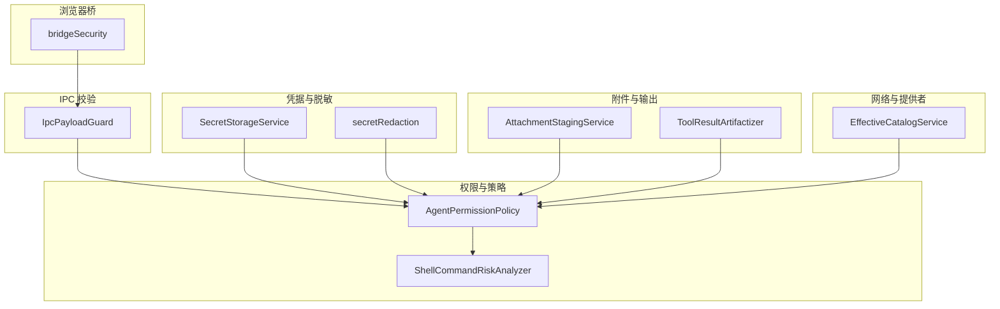
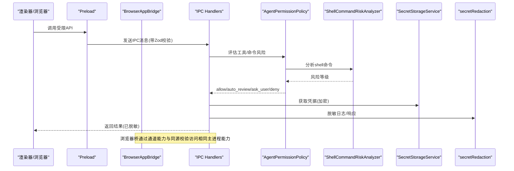
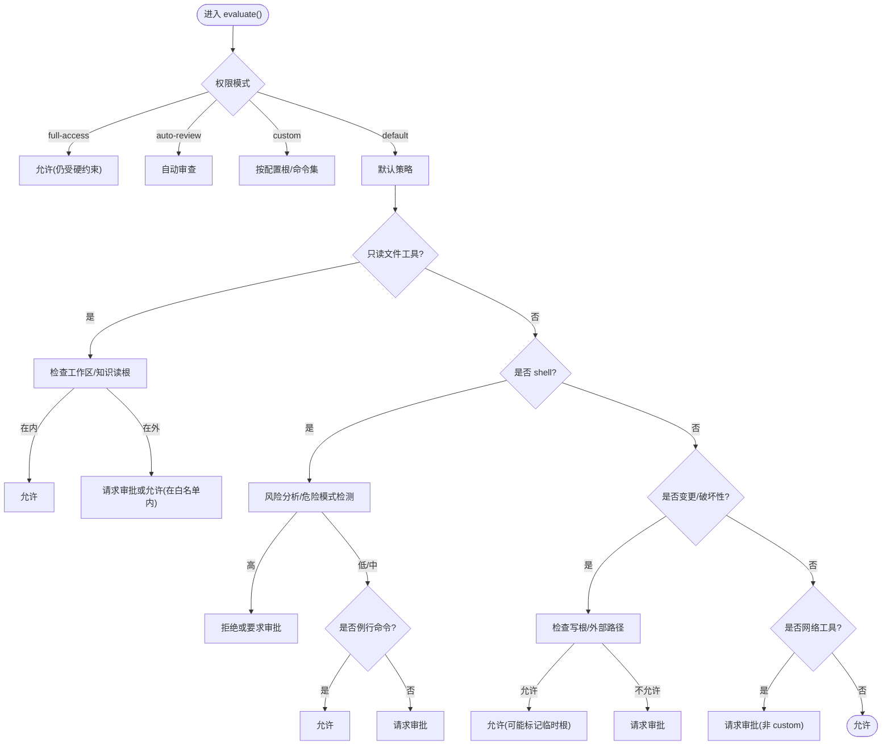
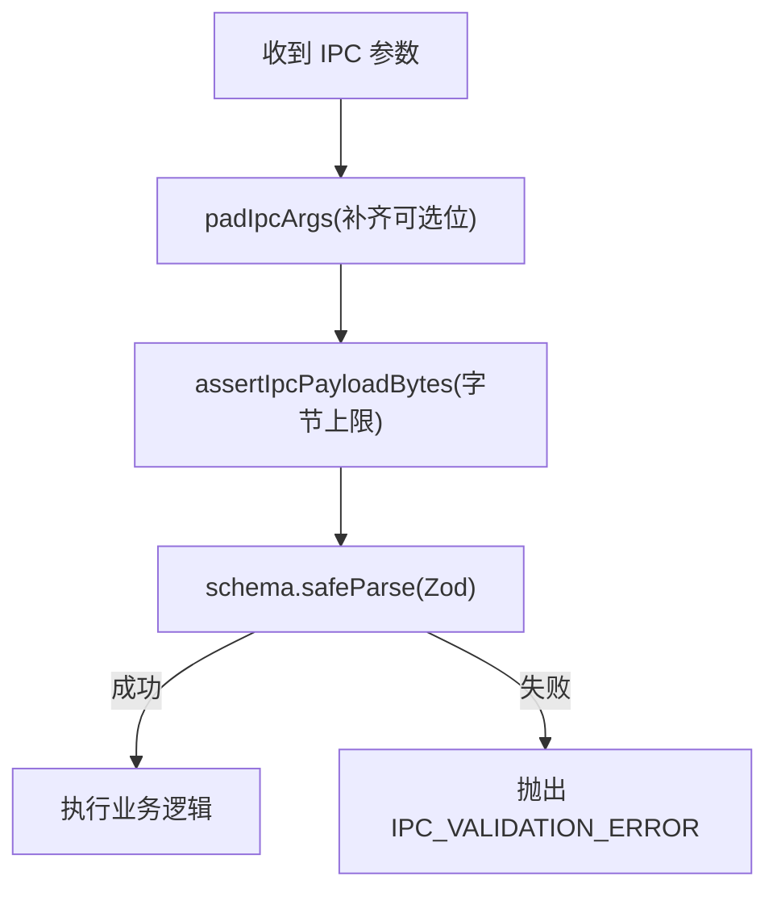
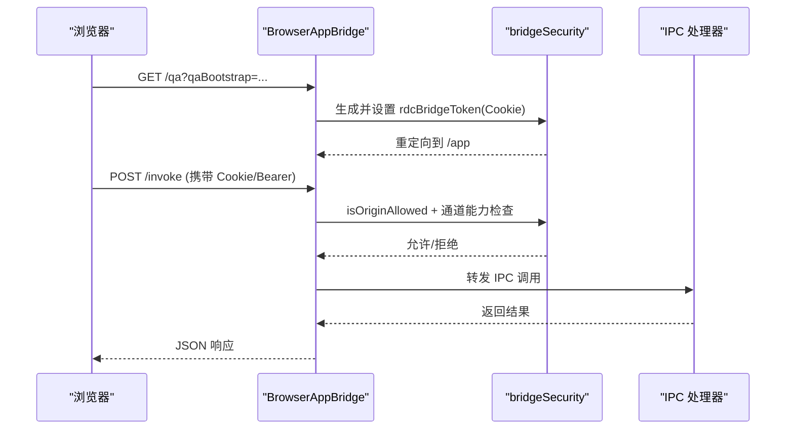
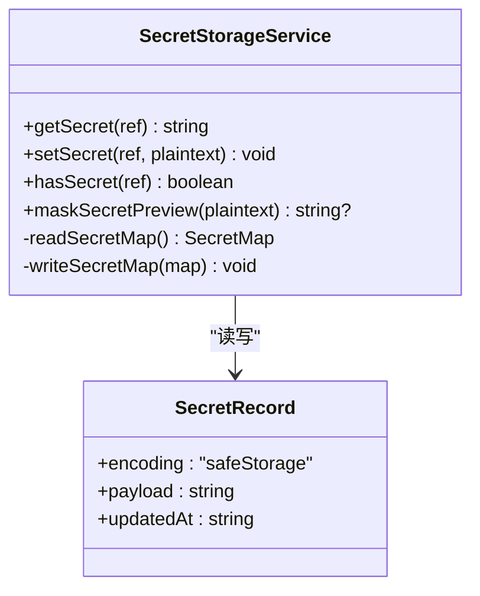
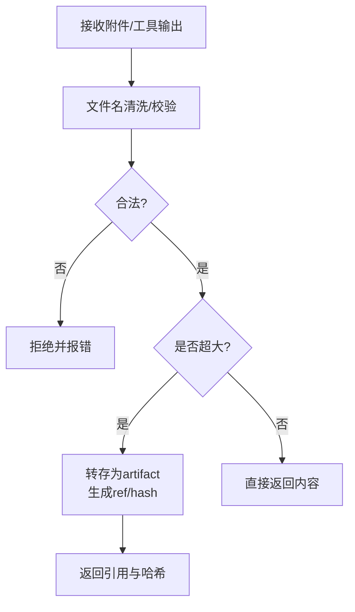
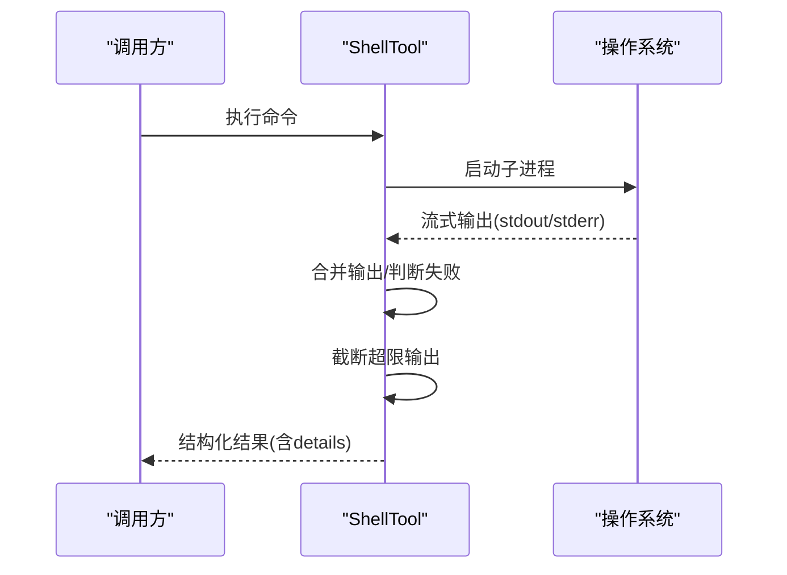
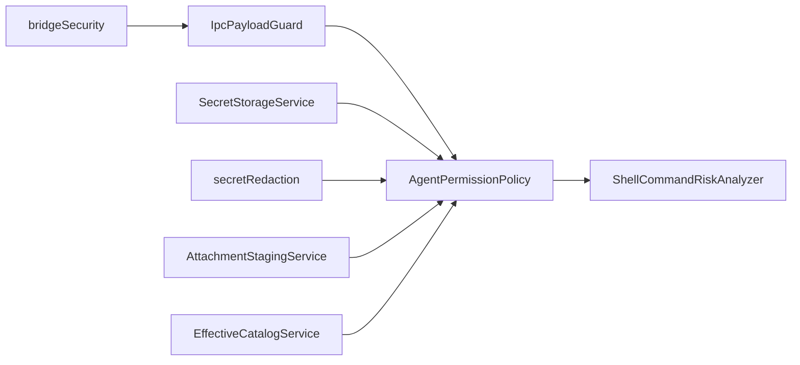

# 安全考虑

<cite>
**本文引用的文件**
- [AgentPermissionPolicy.ts](file://src/main/agent-runtime/permissions/AgentPermissionPolicy.ts)
- [ShellCommandRiskAnalyzer.ts](file://src/main/agent-runtime/permissions/ShellCommandRiskAnalyzer.ts)
- [IpcPayloadGuard.ts](file://src/main/ipc/validation/IpcPayloadGuard.ts)
- [bridgeSecurity.ts](file://src/main/browserAppBridge/bridgeSecurity.ts)
- [SecretStorageService.ts](file://src/main/settings/SecretStorageService.ts)
- [secretRedaction.ts](file://src/main/runtime/secretRedaction.ts)
- [AttachmentStagingService.ts](file://src/main/conversation/AttachmentStagingService.ts)
- [ToolResultArtifactizer.test.ts](file://src/main/agent-runtime/tools/ToolResultArtifactizer.test.ts)
- [ShellTool.ts](file://src/main/agent-runtime/tools/primitives/ShellTool.ts)
- [EffectiveCatalogService.ts](file://src/main/settings/EffectiveCatalogService.ts)
- [permissions.md](file://docs/contracts/permissions.md)
</cite>

## 目录
1. [简介](#简介)
2. [项目结构](#项目结构)
3. [核心组件](#核心组件)
4. [架构总览](#架构总览)
5. [详细组件分析](#详细组件分析)
6. [依赖关系分析](#依赖关系分析)
7. [性能与安全权衡](#性能与安全权衡)
8. [故障排查指南](#故障排查指南)
9. [结论](#结论)
10. [附录：配置与审计清单](#附录配置与审计清单)

## 简介
本文件面向 RDC-Agent 的安全设计，聚焦权限模型、沙箱机制、输入验证、输出清理、敏感信息处理、网络安全、数据传输加密与存储安全，并提供安全配置、漏洞扫描与安全审计的最佳实践，以及常见威胁防护方法与应急响应流程。文档基于仓库中已实现的安全边界与策略进行说明，避免臆测未实现的特性。

## 项目结构
RDC-Agent 的安全能力分布在主进程（main）的多个子系统：
- 权限与策略：AgentPermissionPolicy、ShellCommandRiskAnalyzer、PolicyCompiler（编译策略）
- IPC 校验：IpcPayloadGuard（Zod 模式 + 大小限制）
- 浏览器桥安全：bridgeSecurity（通道能力矩阵、令牌与同源校验）
- 密钥与凭据：SecretStorageService（safeStorage 加密）、secretRedaction（脱敏）
- 会话附件与工具输出：AttachmentStagingService（文件名清洗、Base64 严格校验）、ToolResultArtifactizer（大输出隔离与引用）
- 网络与提供者：EffectiveCatalogService（发现条目净化）
- 协议与契约：permissions.md 定义稳定安全边界

图表来源
- [AgentPermissionPolicy.ts:23-30](file://src/main/agent-runtime/permissions/AgentPermissionPolicy.ts#L23-L30)
- [ShellCommandRiskAnalyzer.ts:1-7](file://src/main/agent-runtime/permissions/ShellCommandRiskAnalyzer.ts#L1-L7)
- [IpcPayloadGuard.ts:1-88](file://src/main/ipc/validation/IpcPayloadGuard.ts#L1-L88)
- [bridgeSecurity.ts:6-15](file://src/main/browserAppBridge/bridgeSecurity.ts#L6-L15)
- [SecretStorageService.ts:18-42](file://src/main/settings/SecretStorageService.ts#L18-L42)
- [secretRedaction.ts:1-15](file://src/main/runtime/secretRedaction.ts#L1-L15)
- [AttachmentStagingService.ts:43-70](file://src/main/conversation/AttachmentStagingService.ts#L43-L70)
- [EffectiveCatalogService.ts:35-66](file://src/main/settings/EffectiveCatalogService.ts#L35-L66)

章节来源
- [permissions.md:1-113](file://docs/contracts/permissions.md#L1-L113)

## 核心组件
- 权限策略与风险分类
  - AgentPermissionPolicy：对工具调用与 shell 命令进行风险评估，输出 allow / auto_review / ask_user / deny 决策，并维护临时路径根白名单。非沙箱边界，真正强制由硬拒绝列表、OS 权限、Electron 沙箱与 IPC 校验完成。
  - ShellCommandRiskAnalyzer：解析命令结构、匹配高危模式与危险命令名，用于审批路由。
- IPC 载荷校验
  - IpcPayloadGuard：对所有 IPC handler 参数进行 Zod 模式校验与字节长度限制，非法即 fail-closed。
- 浏览器桥安全
  - bridgeSecurity：通道能力矩阵、Bearer/Cookie 鉴权、同源校验、高影响操作需显式环境变量放行。
- 凭据与脱敏
  - SecretStorageService：使用 safeStorage 加密存储凭据，损坏隔离，文件权限收紧；对外仅暴露 has/masked 预览。
  - secretRedaction：递归脱敏请求体与日志中的敏感键与文本模式，记录脱敏轨迹。
- 附件与工具输出
  - AttachmentStagingService：文件名清洗、保留字符过滤、Windows 保留名拒绝、严格 Base64 解码。
  - ToolResultArtifactizer：超大工具输出转存为受控 artifact，通过引用与哈希精确读取，防止内存与传输膨胀。
- 网络与提供者
  - EffectiveCatalogService：持久化目录状态净化，过滤不受信任的发现条目。

章节来源
- [AgentPermissionPolicy.ts:23-30](file://src/main/agent-runtime/permissions/AgentPermissionPolicy.ts#L23-L30)
- [ShellCommandRiskAnalyzer.ts:1-7](file://src/main/agent-runtime/permissions/ShellCommandRiskAnalyzer.ts#L1-L7)
- [IpcPayloadGuard.ts:1-88](file://src/main/ipc/validation/IpcPayloadGuard.ts#L1-L88)
- [bridgeSecurity.ts:6-15](file://src/main/browserAppBridge/bridgeSecurity.ts#L6-L15)
- [SecretStorageService.ts:18-42](file://src/main/settings/SecretStorageService.ts#L18-L42)
- [secretRedaction.ts:1-15](file://src/main/runtime/secretRedaction.ts#L1-L15)
- [AttachmentStagingService.ts:43-70](file://src/main/conversation/AttachmentStagingService.ts#L43-L70)
- [ToolResultArtifactizer.test.ts:108-130](file://src/main/agent-runtime/tools/ToolResultArtifactizer.test.ts#L108-L130)
- [EffectiveCatalogService.ts:35-66](file://src/main/settings/EffectiveCatalogService.ts#L35-L66)

## 架构总览
下图展示从渲染器到主进程的关键安全路径：渲染器通过 preload 暴露受限 API，所有 IPC 经 IpcPayloadGuard 校验；主进程根据权限策略与 shell 风险分析决定执行或审批；浏览器桥在 QA/调试模式下提供受限 HTTP/SSE 入口，具备通道能力与同源校验；凭据通过 safeStorage 加密存储，输出与日志经脱敏。

图表来源
- [IpcPayloadGuard.ts:39-57](file://src/main/ipc/validation/IpcPayloadGuard.ts#L39-L57)
- [AgentPermissionPolicy.ts:323-374](file://src/main/agent-runtime/permissions/AgentPermissionPolicy.ts#L323-L374)
- [ShellCommandRiskAnalyzer.ts:83-121](file://src/main/agent-runtime/permissions/ShellCommandRiskAnalyzer.ts#L83-L121)
- [SecretStorageService.ts:182-227](file://src/main/settings/SecretStorageService.ts#L182-L227)
- [secretRedaction.ts:31-102](file://src/main/runtime/secretRedaction.ts#L31-L102)
- [bridgeSecurity.ts:16-31](file://src/main/browserAppBridge/bridgeSecurity.ts#L16-L31)

## 详细组件分析

### 权限策略与审批流
- 决策强度格：allow < auto_review < ask_user < deny。策略层与模式共同决定最终动作。
- 工作区边界：只读工具允许在工作区内自动；外部路径需显式许可或审批。
- Shell 命令：高风险组合直接拒绝；常规命令可自动；未知/外部路径/破坏性命令需审批。
- 临时路径根：针对外部读写的临时授权仅在当次上下文有效。

图表来源
- [AgentPermissionPolicy.ts:323-476](file://src/main/agent-runtime/permissions/AgentPermissionPolicy.ts#L323-L476)
- [ShellCommandRiskAnalyzer.ts:83-121](file://src/main/agent-runtime/permissions/ShellCommandRiskAnalyzer.ts#L83-L121)

章节来源
- [AgentPermissionPolicy.ts:23-30](file://src/main/agent-runtime/permissions/AgentPermissionPolicy.ts#L23-L30)
- [AgentPermissionPolicy.ts:323-476](file://src/main/agent-runtime/permissions/AgentPermissionPolicy.ts#L323-L476)
- [ShellCommandRiskAnalyzer.ts:83-121](file://src/main/agent-runtime/permissions/ShellCommandRiskAnalyzer.ts#L83-L121)

### IPC 输入验证与尺寸保护
- 所有 IPC handler 必须通过 parseIpcArgs 进行 Zod 模式校验与字节上限限制，失败关闭。
- 提供字符串、ID、数组等常用安全构造器，统一长度与格式约束。
- 支持可选尾部参数补齐，确保零参调用也能被 schema 接受。

图表来源
- [IpcPayloadGuard.ts:26-57](file://src/main/ipc/validation/IpcPayloadGuard.ts#L26-L57)
- [IpcPayloadGuard.ts:67-87](file://src/main/ipc/validation/IpcPayloadGuard.ts#L67-L87)

章节来源
- [IpcPayloadGuard.ts:1-88](file://src/main/ipc/validation/IpcPayloadGuard.ts#L1-L88)

### 浏览器桥安全（QA/调试）
- 通道能力矩阵：read/mutation 默认允许；high-impact 需要显式环境变量；desktop-only 永远拒绝。
- 认证：支持 Bearer 头或 HttpOnly Cookie；Cookie 路径与 SameSite 严格；Origin 校验对 cookie 认证接口强制同源。
- 入口：/qa 一次性引导后签发 Cookie，重定向至干净 /app；/invoke、/events、/api/* 需同源。

图表来源
- [bridgeSecurity.ts:16-31](file://src/main/browserAppBridge/bridgeSecurity.ts#L16-L31)
- [bridgeSecurity.ts:46-76](file://src/main/browserAppBridge/bridgeSecurity.ts#L46-L76)
- [bridgeSecurity.ts:99-119](file://src/main/browserAppBridge/bridgeSecurity.ts#L99-L119)

章节来源
- [bridgeSecurity.ts:6-15](file://src/main/browserAppBridge/bridgeSecurity.ts#L6-L15)
- [bridgeSecurity.ts:16-31](file://src/main/browserAppBridge/bridgeSecurity.ts#L16-L31)
- [bridgeSecurity.ts:46-76](file://src/main/browserAppBridge/bridgeSecurity.ts#L46-L76)
- [bridgeSecurity.ts:99-119](file://src/main/browserAppBridge/bridgeSecurity.ts#L99-L119)

### 凭据存储与脱敏
- 存储：使用 safeStorage 加密，不可用则 fail-closed；损坏文件隔离；文件权限 0600/ACL；写入原子化（临时文件+rename）。
- 访问：对外仅提供 has/masked 预览，不返回明文；支持多类密钥引用（provider/account/connection）。
- 脱敏：递归替换敏感键与文本模式（Bearer、JWT、Google Key、前缀密钥等），记录脱敏路径与哈希。

图表来源
- [SecretStorageService.ts:72-227](file://src/main/settings/SecretStorageService.ts#L72-L227)
- [SecretStorageService.ts:249-258](file://src/main/settings/SecretStorageService.ts#L249-L258)

章节来源
- [SecretStorageService.ts:18-42](file://src/main/settings/SecretStorageService.ts#L18-L42)
- [SecretStorageService.ts:182-227](file://src/main/settings/SecretStorageService.ts#L182-L227)
- [secretRedaction.ts:22-29](file://src/main/runtime/secretRedaction.ts#L22-L29)
- [secretRedaction.ts:31-102](file://src/main/runtime/secretRedaction.ts#L31-L102)

### 附件与工具输出安全
- 附件上传：文件名清洗，拒绝控制字符与 Windows 保留名；严格 Base64 校验，非法立即拒绝。
- 工具输出：超大输出转存为 artifact，通过 ref/hash 精确读取；无 session 时拒绝；错误输出保留关键尾部片段。

图表来源
- [AttachmentStagingService.ts:43-70](file://src/main/conversation/AttachmentStagingService.ts#L43-L70)
- [ToolResultArtifactizer.test.ts:108-130](file://src/main/agent-runtime/tools/ToolResultArtifactizer.test.ts#L108-L130)

章节来源
- [AttachmentStagingService.ts:43-70](file://src/main/conversation/AttachmentStagingService.ts#L43-L70)
- [ToolResultArtifactizer.test.ts:108-130](file://src/main/agent-runtime/tools/ToolResultArtifactizer.test.ts#L108-L130)

### Shell 执行与输出裁剪
- 执行：通过 ShellInvocationService 调用本机 shell；exitCode 规范化。
- 输出：合并 stdout/stderr，超过阈值截断，标记 truncated；错误路径同样裁剪并保留诊断信息。

图表来源
- [ShellTool.ts:245-264](file://src/main/agent-runtime/tools/primitives/ShellTool.ts#L245-L264)
- [ShellTool.ts:286-307](file://src/main/agent-runtime/tools/primitives/ShellTool.ts#L286-L307)

章节来源
- [ShellTool.ts:245-264](file://src/main/agent-runtime/tools/primitives/ShellTool.ts#L245-L264)
- [ShellTool.ts:286-307](file://src/main/agent-runtime/tools/primitives/ShellTool.ts#L286-L307)

### 网络与提供者数据净化
- 发现条目净化：对 catalog 持久化状态进行 sanitize，移除不受信任的模型条目，保证最小暴露面。

章节来源
- [EffectiveCatalogService.ts:35-66](file://src/main/settings/EffectiveCatalogService.ts#L35-L66)

## 依赖关系分析
- 松耦合与职责分离：权限策略专注风险评估，IPC 负责输入边界，桥负责通道能力与同源，凭据与脱敏独立于业务流。
- 强约束点：
  - IPC 校验：所有跨进程通信必经 Zod + 字节限制。
  - 权限策略：工具与 shell 审批的核心决策点。
  - 浏览器桥：通道能力矩阵与环境变量开关。
  - 凭据存储：safeStorage 与文件权限。
- 潜在循环依赖：未发现明显循环；各模块通过明确接口交互。

图表来源
- [IpcPayloadGuard.ts:39-57](file://src/main/ipc/validation/IpcPayloadGuard.ts#L39-L57)
- [AgentPermissionPolicy.ts:323-374](file://src/main/agent-runtime/permissions/AgentPermissionPolicy.ts#L323-L374)
- [ShellCommandRiskAnalyzer.ts:83-121](file://src/main/agent-runtime/permissions/ShellCommandRiskAnalyzer.ts#L83-L121)
- [bridgeSecurity.ts:16-31](file://src/main/browserAppBridge/bridgeSecurity.ts#L16-L31)
- [SecretStorageService.ts:182-227](file://src/main/settings/SecretStorageService.ts#L182-L227)
- [secretRedaction.ts:31-102](file://src/main/runtime/secretRedaction.ts#L31-L102)
- [AttachmentStagingService.ts:43-70](file://src/main/conversation/AttachmentStagingService.ts#L43-L70)
- [EffectiveCatalogService.ts:35-66](file://src/main/settings/EffectiveCatalogService.ts#L35-L66)

## 性能与安全权衡
- IPC 字节限制：防止超大 payload 导致内存压力与 DoS；建议结合业务场景调整 maxBytes。
- 工具输出裁剪：避免大输出阻塞渲染与传输；必要时使用 artifact 引用按需读取。
- 权限审批：默认更保守，减少误操作风险；可通过 policy 与 mode 精细调优。
- 凭据加密：safeStorage 增加少量开销，但显著提升安全性；损坏隔离避免级联失败。

## 故障排查指南
- IPC 校验失败
  - 现象：抛出 IPC_VALIDATION_ERROR，包含字段路径与问题摘要。
  - 排查：确认 schema 定义与实际参数一致；检查 padTo 与可选参数；核对字符串/ID/数组长度限制。
  - 参考：[IpcPayloadGuard.ts:39-57](file://src/main/ipc/validation/IpcPayloadGuard.ts#L39-L57)
- 权限拒绝或审批
  - 现象：工具或 shell 被 deny/ask_user/auto_review。
  - 排查：查看策略模式、工作区根、读写根、命令白/黑名单、policy floor；确认是否为灾难 shell 硬拒绝。
  - 参考：[AgentPermissionPolicy.ts:323-476](file://src/main/agent-runtime/permissions/AgentPermissionPolicy.ts#L323-L476)、[ShellCommandRiskAnalyzer.ts:83-121](file://src/main/agent-runtime/permissions/ShellCommandRiskAnalyzer.ts#L83-L121)
- 浏览器桥鉴权失败
  - 现象：401/403；/invoke、/events、/api/* 需同源。
  - 排查：确认 Cookie/Bearer 正确；Origin 与 bridge origin 一致；high-impact 通道需环境变量；未知 channel 会被拒绝。
  - 参考：[bridgeSecurity.ts:16-31](file://src/main/browserAppBridge/bridgeSecurity.ts#L16-L31)、[bridgeSecurity.ts:99-119](file://src/main/browserAppBridge/bridgeSecurity.ts#L99-L119)
- 凭据解密失败
  - 现象：无法解密或返回空值。
  - 排查：确认 safeStorage 可用；检查密钥引用是否正确；查看损坏文件隔离位置。
  - 参考：[SecretStorageService.ts:182-227](file://src/main/settings/SecretStorageService.ts#L182-L227)
- 附件上传失败
  - 现象：文件名非法或 Base64 无效。
  - 排查：检查文件名清洗规则；确认 Base64 严格校验通过。
  - 参考：[AttachmentStagingService.ts:43-70](file://src/main/conversation/AttachmentStagingService.ts#L43-L70)

章节来源
- [IpcPayloadGuard.ts:39-57](file://src/main/ipc/validation/IpcPayloadGuard.ts#L39-L57)
- [AgentPermissionPolicy.ts:323-476](file://src/main/agent-runtime/permissions/AgentPermissionPolicy.ts#L323-L476)
- [ShellCommandRiskAnalyzer.ts:83-121](file://src/main/agent-runtime/permissions/ShellCommandRiskAnalyzer.ts#L83-L121)
- [bridgeSecurity.ts:16-31](file://src/main/browserAppBridge/bridgeSecurity.ts#L16-L31)
- [bridgeSecurity.ts:99-119](file://src/main/browserAppBridge/bridgeSecurity.ts#L99-L119)
- [SecretStorageService.ts:182-227](file://src/main/settings/SecretStorageService.ts#L182-L227)
- [AttachmentStagingService.ts:43-70](file://src/main/conversation/AttachmentStagingService.ts#L43-L70)

## 结论
RDC-Agent 采用分层安全架构：以 IPC 校验为第一道边界，权限策略为核心决策点，浏览器桥通道能力与环境变量作为二次控制，凭据与脱敏保障敏感数据安全，附件与工具输出通过严格清洗与隔离降低风险。配合策略编译与契约文档，形成可审计、可演进的安全体系。

## 附录：配置与审计清单
- 安全配置要点
  - 权限模式：Default/Auto-review/Full access/Custom，按项目需求选择；Custom 需明确读写根与命令集。
  - 浏览器桥：仅在 QA/调试启用；high-impact 通道需显式环境变量；/invoke、/events、/api/* 强制同源。
  - IPC：统一使用 parseIpcArgs；合理设置 maxBytes；为可选参数配置 padTo。
  - 凭据：确保 safeStorage 可用；定期轮换密钥；监控损坏隔离文件。
  - 输出：启用 artifact 转存；限制 shell 输出大小；保留关键错误尾部。
- 漏洞扫描与审计
  - 静态扫描：关注 IPC schema 覆盖、权限策略变更、shell 硬拒绝表更新。
  - 动态测试：模拟非法 IPC、越界路径、危险 shell、桥鉴权绕过。
  - 审计项：通道能力矩阵、origin 白名单、cookie 属性、凭据存储权限、脱敏覆盖率。
- 常见威胁防护
  - 注入与命令执行：通过 shellHardDeny 与风险分类拦截；禁止 eval/base64|sh 等高危链。
  - 路径穿越与越权：工作区边界与读写根校验；临时路径根绑定单次上下文。
  - 数据泄露：脱敏敏感键与令牌；artifact 精确引用；附件严格校验。
  - 网络攻击：桥同源校验；通道能力矩阵；禁用 desktop-only 通道。
- 应急响应流程
  - 事件分级：权限滥用、凭据泄露、桥劫持、恶意 shell。
  - 处置步骤：立即阻断通道/权限；隔离凭据文件；回滚策略；取证与复盘。
  - 恢复措施：重置策略与凭据；修复 schema 与通道能力；补充测试用例。

章节来源
- [permissions.md:1-113](file://docs/contracts/permissions.md#L1-L113)