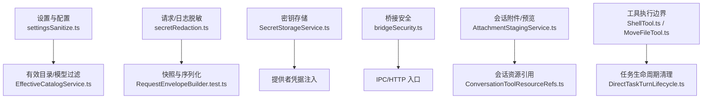
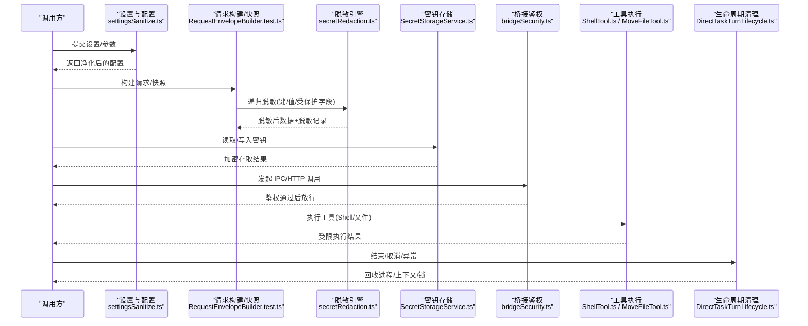
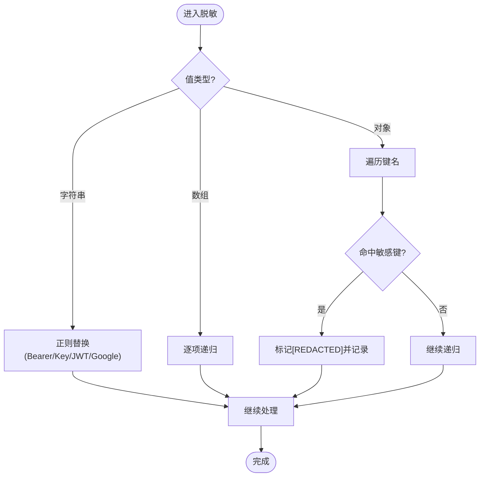
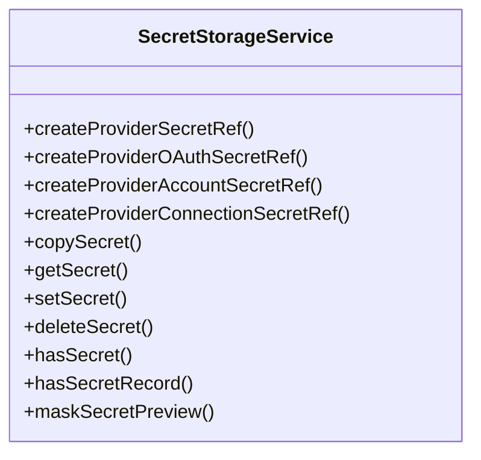
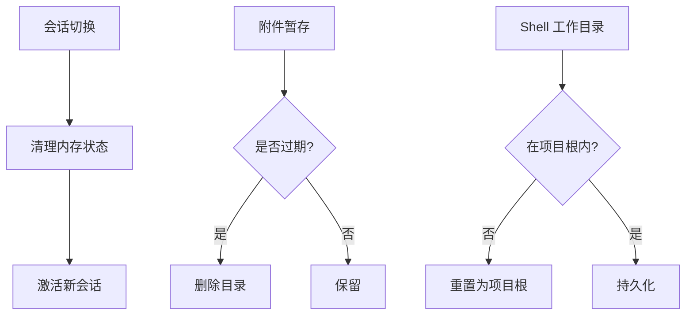
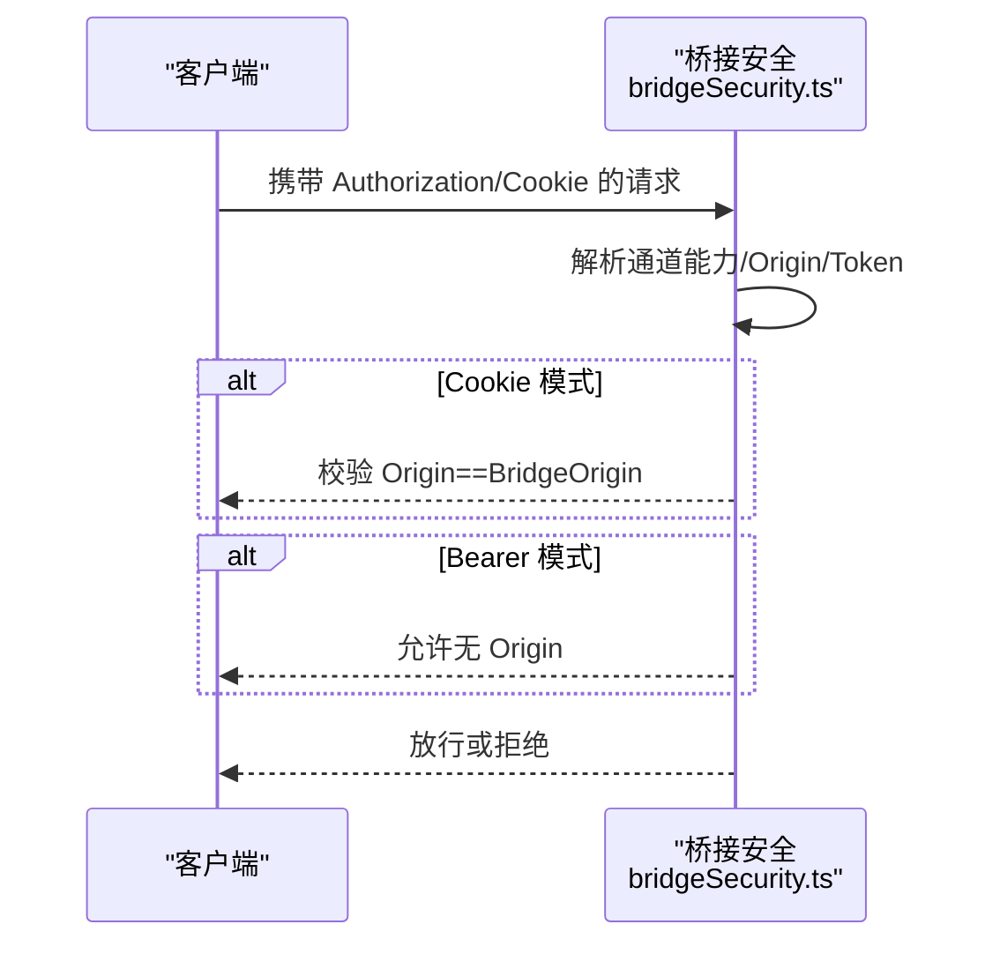
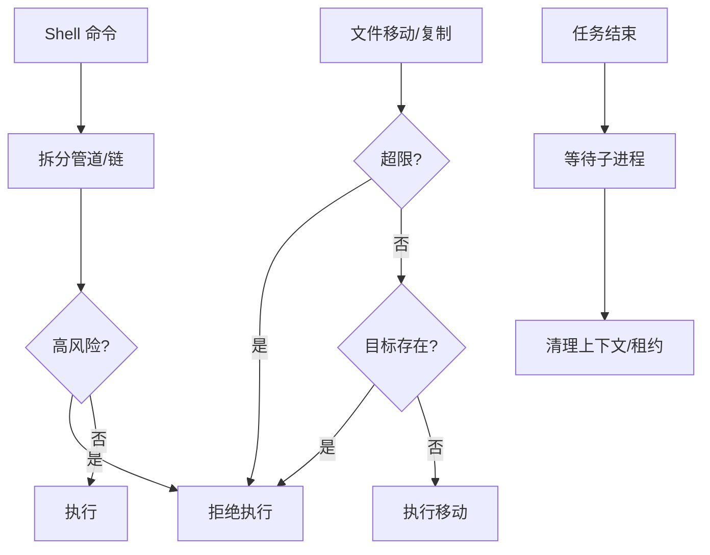
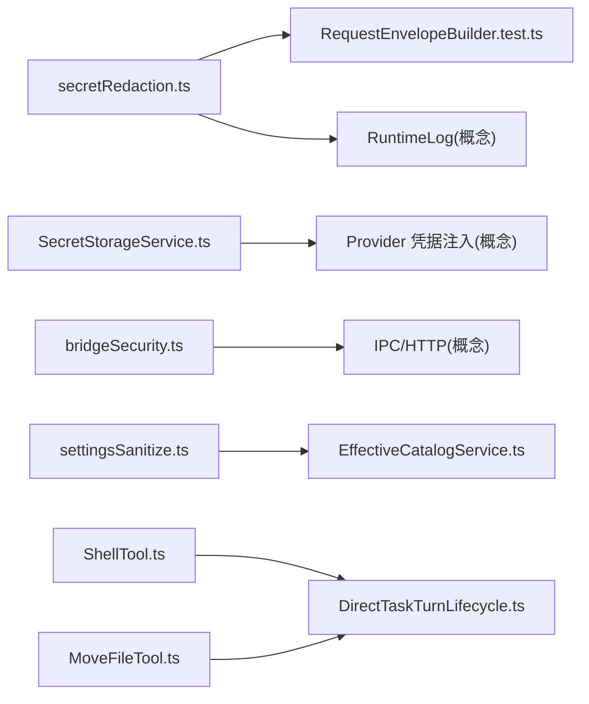

# 数据安全保护

<cite>
**本文引用的文件**
- [secretRedaction.ts](file://src/main/runtime/secretRedaction.ts)
- [SecretStorageService.ts](file://src/main/settings/SecretStorageService.ts)
- [bridgeSecurity.ts](file://src/main/browserAppBridge/bridgeSecurity.ts)
- [settingsSanitize.ts](file://src/main/settings/settingsSanitize.ts)
- [EffectiveCatalogService.ts](file://src/main/settings/EffectiveCatalogService.ts)
- [AttachmentStagingService.ts](file://src/main/conversation/AttachmentStagingService.ts)
- [ConversationToolResourceRefs.ts](file://src/main/conversation/ConversationToolResourceRefs.ts)
- [MoveFileTool.ts](file://src/main/agent-runtime/tools/file/MoveFileTool.ts)
- [ShellTool.ts](file://src/main/agent-runtime/tools/primitives/ShellTool.ts)
- [DirectTaskTurnLifecycle.ts](file://src/main/workflow/debugger/DirectTaskTurnLifecycle.ts)
- [RequestEnvelopeBuilder.test.ts](file://src/main/agent-runtime/prompt/RequestEnvelopeBuilder.test.ts)
- [RequestSnapshotStore.test.ts](file://src/main/agent-runtime/prompt/RequestSnapshotStore.test.ts)
- [providerWireFixture.test.ts](file://src/main/testing/contracts/providerWireFixture.test.ts)
- [check-tool-system.mjs](file://scripts/check-tool-system.mjs)
</cite>

## 目录
1. [简介](#简介)
2. [项目结构](#项目结构)
3. [核心组件](#核心组件)
4. [架构总览](#架构总览)
5. [详细组件分析](#详细组件分析)
6. [依赖关系分析](#依赖关系分析)
7. [性能与安全权衡](#性能与安全权衡)
8. [故障排查指南](#故障排查指南)
9. [结论](#结论)
10. [附录：数据生命周期与处置流程](#附录数据生命周期与处置流程)

## 简介
本文件聚焦 RDC-Agent 的数据安全保护体系，覆盖敏感信息识别、处理与存储；密钥管理、密码加密、会话数据保护；数据脱敏、日志清理、临时文件管理；数据库与文件系统、内存安全；以及备份恢复、迁移与销毁的安全方法。文档以代码级实现为依据，提供可视化图示与可操作的排障建议，帮助读者在不深入源码的情况下理解并落地安全实践。

## 项目结构
RDC-Agent 将安全能力分散在多个模块中，形成“输入净化—运行时脱敏—持久化加密—访问控制—生命周期清理”的闭环：
- 输入净化与配置校验：settingsSanitize.ts、EffectiveCatalogService.ts
- 运行时敏感信息脱敏：secretRedaction.ts（贯穿请求包、日志等）
- 密钥与凭据存储：SecretStorageService.ts（基于 Electron safeStorage）
- 跨进程/浏览器桥接鉴权：bridgeSecurity.ts（Bearer/Cookie、同源校验）
- 会话与附件临时数据：AttachmentStagingService.ts、ConversationToolResourceRefs.ts
- 工具执行边界与权限：ShellTool.ts、MoveFileTool.ts、DirectTaskTurnLifecycle.ts
- 测试与契约保障：RequestEnvelopeBuilder.test.ts、providerWireFixture.test.ts、check-tool-system.mjs

**图表来源**
- [settingsSanitize.ts:156-216](file://src/main/settings/settingsSanitize.ts#L156-L216)
- [EffectiveCatalogService.ts:35-74](file://src/main/settings/EffectiveCatalogService.ts#L35-L74)
- [secretRedaction.ts:22-102](file://src/main/runtime/secretRedaction.ts#L22-L102)
- [SecretStorageService.ts:72-262](file://src/main/settings/SecretStorageService.ts#L72-L262)
- [bridgeSecurity.ts:16-120](file://src/main/browserAppBridge/bridgeSecurity.ts#L16-L120)
- [AttachmentStagingService.ts:145-182](file://src/main/conversation/AttachmentStagingService.ts#L145-L182)
- [ConversationToolResourceRefs.ts:1-34](file://src/main/conversation/ConversationToolResourceRefs.ts#L1-L34)
- [ShellTool.ts:44-81](file://src/main/agent-runtime/tools/primitives/ShellTool.ts#L44-L81)
- [MoveFileTool.ts:34-51](file://src/main/agent-runtime/tools/file/MoveFileTool.ts#L34-L51)
- [DirectTaskTurnLifecycle.ts:75-102](file://src/main/workflow/debugger/DirectTaskTurnLifecycle.ts#L75-L102)

**章节来源**
- [settingsSanitize.ts:156-216](file://src/main/settings/settingsSanitize.ts#L156-L216)
- [EffectiveCatalogService.ts:35-74](file://src/main/settings/EffectiveCatalogService.ts#L35-L74)
- [secretRedaction.ts:22-102](file://src/main/runtime/secretRedaction.ts#L22-L102)
- [SecretStorageService.ts:72-262](file://src/main/settings/SecretStorageService.ts#L72-L262)
- [bridgeSecurity.ts:16-120](file://src/main/browserAppBridge/bridgeSecurity.ts#L16-L120)
- [AttachmentStagingService.ts:145-182](file://src/main/conversation/AttachmentStagingService.ts#L145-L182)
- [ConversationToolResourceRefs.ts:1-34](file://src/main/conversation/ConversationToolResourceRefs.ts#L1-L34)
- [ShellTool.ts:44-81](file://src/main/agent-runtime/tools/primitives/ShellTool.ts#L44-L81)
- [MoveFileTool.ts:34-51](file://src/main/agent-runtime/tools/file/MoveFileTool.ts#L34-L51)
- [DirectTaskTurnLifecycle.ts:75-102](file://src/main/workflow/debugger/DirectTaskTurnLifecycle.ts#L75-L102)

## 核心组件
- 敏感信息识别与脱敏：通过模式匹配与键名规则对 API Key、令牌、JWT、Google Key 等进行替换，并对受保护的推理内容、二进制图片载荷进行标记与摘要记录。
- 密钥管理：使用 Electron safeStorage 对凭据进行加密存储，落盘为受限权限的文件，支持复制、删除、存在性检查与预览掩码。
- 会话数据保护：会话切换时清理内存状态；附件暂存区按 TTL 清理；会话工作目录限制在项目根内。
- 访问控制：桥接通道基于能力矩阵与白名单放行；Cookie/Bearer 双通道鉴权；严格同源校验。
- 工具执行边界：Shell 命令风险分级与硬拒绝；文件移动/写入前校验大小与目标存在性；任务生命周期结束时回收进程与上下文。

**章节来源**
- [secretRedaction.ts:22-102](file://src/main/runtime/secretRedaction.ts#L22-L102)
- [SecretStorageService.ts:72-262](file://src/main/settings/SecretStorageService.ts#L72-L262)
- [bridgeSecurity.ts:16-120](file://src/main/browserAppBridge/bridgeSecurity.ts#L16-L120)
- [ShellTool.ts:44-81](file://src/main/agent-runtime/tools/primitives/ShellTool.ts#L44-L81)
- [MoveFileTool.ts:34-51](file://src/main/agent-runtime/tools/file/MoveFileTool.ts#L34-L51)
- [DirectTaskTurnLifecycle.ts:75-102](file://src/main/workflow/debugger/DirectTaskTurnLifecycle.ts#L75-L102)

## 架构总览
下图展示从用户输入到持久化的安全路径：配置净化→请求构建→脱敏→加密存储→访问控制→执行边界→生命周期清理。

**图表来源**
- [settingsSanitize.ts:156-216](file://src/main/settings/settingsSanitize.ts#L156-L216)
- [RequestEnvelopeBuilder.test.ts:32-51](file://src/main/agent-runtime/prompt/RequestEnvelopeBuilder.test.ts#L32-L51)
- [secretRedaction.ts:22-102](file://src/main/runtime/secretRedaction.ts#L22-L102)
- [SecretStorageService.ts:182-227](file://src/main/settings/SecretStorageService.ts#L182-L227)
- [bridgeSecurity.ts:16-120](file://src/main/browserAppBridge/bridgeSecurity.ts#L16-L120)
- [ShellTool.ts:44-81](file://src/main/agent-runtime/tools/primitives/ShellTool.ts#L44-L81)
- [MoveFileTool.ts:34-51](file://src/main/agent-runtime/tools/file/MoveFileTool.ts#L34-L51)
- [DirectTaskTurnLifecycle.ts:75-102](file://src/main/workflow/debugger/DirectTaskTurnLifecycle.ts#L75-L102)

## 详细组件分析

### 敏感信息识别与脱敏
- 识别策略：
  - 键名匹配：api-key、authorization、password、secret、access-token、refresh-token 等。
  - 文本模式：Bearer 令牌、特定前缀密钥、Google API Key、JWT。
  - 受保护字段：thinking 类型 opaque/hidden、image/data 大载荷、provider protected payload。
- 输出：
  - 将敏感值替换为占位符，并生成脱敏记录（路径、原因、哈希），便于审计与去重。
- 适用场景：
  - 请求包序列化、运行时日志、快照持久化。

**图表来源**
- [secretRedaction.ts:22-102](file://src/main/runtime/secretRedaction.ts#L22-L102)

**章节来源**
- [secretRedaction.ts:22-102](file://src/main/runtime/secretRedaction.ts#L22-L102)
- [RequestEnvelopeBuilder.test.ts:32-51](file://src/main/agent-runtime/prompt/RequestEnvelopeBuilder.test.ts#L32-L51)
- [RequestSnapshotStore.test.ts:36-81](file://src/main/agent-runtime/prompt/RequestSnapshotStore.test.ts#L36-L81)
- [providerWireFixture.test.ts:49-69](file://src/main/testing/contracts/providerWireFixture.test.ts#L49-L69)

### 密钥管理与加密存储
- 存储介质：Electron safeStorage，仅在可用时允许写入/读取。
- 文件安全：
  - 写入采用原子 rename 临时文件，落盘后设置严格权限（POSIX 600，Windows ACL 仅当前用户）。
  - 损坏检测：解析失败或结构非法时隔离文件并抛出错误。
- 操作接口：
  - 生成标准化密钥引用（API Key/OAuth/Account/Connection）。
  - 复制、读取、写入、删除、存在性检查、预览掩码。
- 错误处理：
  - 不可用时抛出专用错误；解密失败静默降级并告警。

**图表来源**
- [SecretStorageService.ts:72-262](file://src/main/settings/SecretStorageService.ts#L72-L262)

**章节来源**
- [SecretStorageService.ts:72-262](file://src/main/settings/SecretStorageService.ts#L72-L262)

### 会话数据保护与临时文件管理
- 会话切换清理：前端在切换会话时重置对话、时间线、工作流状态、捕获与用量快照，避免跨会话数据泄漏。
- 附件暂存：
  - 按会话作用域组织，过期自动扫描清理。
  - 删除时递归移除目录，确保无残留。
- 会话工作目录：
  - Shell 工具维护会话级工作目录，限制在项目根内，越界则回退并持久化。

**图表来源**
- [AttachmentStagingService.ts:145-182](file://src/main/conversation/AttachmentStagingService.ts#L145-L182)
- [ShellTool.ts:44-81](file://src/main/agent-runtime/tools/primitives/ShellTool.ts#L44-L81)

**章节来源**
- [AttachmentStagingService.ts:145-182](file://src/main/conversation/AttachmentStagingService.ts#L145-L182)
- [ConversationToolResourceRefs.ts:1-34](file://src/main/conversation/ConversationToolResourceRefs.ts#L1-L34)
- [ShellTool.ts:44-81](file://src/main/agent-runtime/tools/primitives/ShellTool.ts#L44-L81)

### 访问控制与桥接安全
- 通道能力矩阵：仅放行已注册且具备能力的通道；高影响通道需显式环境变量授权；桌面专属通道一律拒绝。
- 认证方式：
  - Bearer Token：从 Authorization 头提取。
  - Cookie：HttpOnly、SameSite=Strict，短链接入口使用 Cookie 避免地址栏泄露。
- 同源校验：Cookie 模式强制 Origin 必须等于桥接源；Bearer 模式允许省略 Origin。
- 安全比较：使用常量时间比较防止时序攻击。

**图表来源**
- [bridgeSecurity.ts:16-120](file://src/main/browserAppBridge/bridgeSecurity.ts#L16-L120)

**章节来源**
- [bridgeSecurity.ts:16-120](file://src/main/browserAppBridge/bridgeSecurity.ts#L16-L120)

### 工具执行边界与权限
- Shell 命令风险：
  - 管道/链式命令拆分，危险命令前缀硬拒绝。
  - 禁止后台运行参数；通过 agent-shell 进程所有者执行。
- 文件操作：
  - 移动/复制前校验文件大小上限，拒绝覆盖已有目标。
- 任务生命周期：
  - 会话结束后等待子进程退出，清理未返回的手动/委托执行。

**图表来源**
- [ShellTool.ts:44-81](file://src/main/agent-runtime/tools/primitives/ShellTool.ts#L44-L81)
- [MoveFileTool.ts:34-51](file://src/main/agent-runtime/tools/file/MoveFileTool.ts#L34-L51)
- [DirectTaskTurnLifecycle.ts:75-102](file://src/main/workflow/debugger/DirectTaskTurnLifecycle.ts#L75-L102)
- [check-tool-system.mjs:317-369](file://scripts/check-tool-system.mjs#L317-L369)

**章节来源**
- [ShellTool.ts:44-81](file://src/main/agent-runtime/tools/primitives/ShellTool.ts#L44-L81)
- [MoveFileTool.ts:34-51](file://src/main/agent-runtime/tools/file/MoveFileTool.ts#L34-L51)
- [DirectTaskTurnLifecycle.ts:75-102](file://src/main/workflow/debugger/DirectTaskTurnLifecycle.ts#L75-L102)
- [check-tool-system.mjs:317-369](file://scripts/check-tool-system.mjs#L317-L369)

### 配置净化与目录/模型准入
- 配置净化：对路径、超时、布尔开关、枚举值进行严格校验与裁剪，避免越界与非法配置。
- 目录/模型发现：
  - 对发现的模型/目录贡献进行准入过滤，剔除不受信或超集项。
  - 缓存键包含 providerId、accountId、protocol，避免混淆。

**章节来源**
- [settingsSanitize.ts:156-216](file://src/main/settings/settingsSanitize.ts#L156-L216)
- [EffectiveCatalogService.ts:35-74](file://src/main/settings/EffectiveCatalogService.ts#L35-L74)

## 依赖关系分析
- 低耦合高内聚：
  - secretRedaction.ts 被多处消费（请求、日志、快照），但自身不依赖上层业务。
  - SecretStorageService.ts 封装平台加密细节，对外暴露稳定接口。
  - bridgeSecurity.ts 作为统一鉴权网关，屏蔽具体通道差异。
- 外部依赖：
  - Electron safeStorage（加密）、Node fs/crypto（文件与随机数）、child_process（ACL 设置）。
- 潜在循环：
  - 各模块通过共享类型与常量解耦，未见直接循环导入。

**图表来源**
- [secretRedaction.ts:22-102](file://src/main/runtime/secretRedaction.ts#L22-L102)
- [RequestEnvelopeBuilder.test.ts:32-51](file://src/main/agent-runtime/prompt/RequestEnvelopeBuilder.test.ts#L32-L51)
- [SecretStorageService.ts:72-262](file://src/main/settings/SecretStorageService.ts#L72-L262)
- [bridgeSecurity.ts:16-120](file://src/main/browserAppBridge/bridgeSecurity.ts#L16-L120)
- [settingsSanitize.ts:156-216](file://src/main/settings/settingsSanitize.ts#L156-L216)
- [EffectiveCatalogService.ts:35-74](file://src/main/settings/EffectiveCatalogService.ts#L35-L74)
- [ShellTool.ts:44-81](file://src/main/agent-runtime/tools/primitives/ShellTool.ts#L44-L81)
- [MoveFileTool.ts:34-51](file://src/main/agent-runtime/tools/file/MoveFileTool.ts#L34-L51)
- [DirectTaskTurnLifecycle.ts:75-102](file://src/main/workflow/debugger/DirectTaskTurnLifecycle.ts#L75-L102)

**章节来源**
- [secretRedaction.ts:22-102](file://src/main/runtime/secretRedaction.ts#L22-L102)
- [SecretStorageService.ts:72-262](file://src/main/settings/SecretStorageService.ts#L72-L262)
- [bridgeSecurity.ts:16-120](file://src/main/browserAppBridge/bridgeSecurity.ts#L16-L120)
- [settingsSanitize.ts:156-216](file://src/main/settings/settingsSanitize.ts#L156-L216)
- [EffectiveCatalogService.ts:35-74](file://src/main/settings/EffectiveCatalogService.ts#L35-L74)
- [ShellTool.ts:44-81](file://src/main/agent-runtime/tools/primitives/ShellTool.ts#L44-L81)
- [MoveFileTool.ts:34-51](file://src/main/agent-runtime/tools/file/MoveFileTool.ts#L34-L51)
- [DirectTaskTurnLifecycle.ts:75-102](file://src/main/workflow/debugger/DirectTaskTurnLifecycle.ts#L75-L102)

## 性能与安全权衡
- 脱敏开销：递归遍历与正则匹配带来 CPU 成本，建议在批量日志/快照场景下复用脱敏记录以减少重复计算。
- 加密存储：safeStorage 加解密有延迟，适合低频写、高频读；可通过缓存最近使用的密钥引用减少重复 IO。
- 临时文件：TTL 清理与配额统计避免磁盘膨胀；删除采用同步 rm 保证快速释放句柄。
- 执行边界：Shell 命令拆分与风险判定增加前置开销，但显著降低破坏性风险。

[本节为通用指导，无需特定文件来源]

## 故障排查指南
- 无法解密密钥：
  - 现象：读取返回空串并告警。
  - 可能原因：safeStorage 不可用、密文损坏、编码非 safeStorage。
  - 处理：确认系统环境；若文件损坏，查看隔离文件并重建凭据。
- 桥接请求被拒：
  - 现象：/invoke、/events、/api/* 返回 403。
  - 可能原因：Origin 不匹配、Cookie 缺失、通道能力不足、高影响通道未授权。
  - 处理：检查 Origin、Cookie、环境变量与通道能力表。
- 工具执行失败：
  - 现象：Shell 命令被拒绝或文件操作报错。
  - 可能原因：高风险命令、目标已存在、超出大小限制、不在项目根。
  - 处理：调整命令、清理目标文件或修正工作目录。
- 会话切换后数据残留：
  - 现象：新会话看到旧会话内容。
  - 可能原因：前端状态未完全清理。
  - 处理：确认会话切换函数调用完整，必要时重启应用。

**章节来源**
- [SecretStorageService.ts:182-227](file://src/main/settings/SecretStorageService.ts#L182-L227)
- [bridgeSecurity.ts:16-120](file://src/main/browserAppBridge/bridgeSecurity.ts#L16-L120)
- [ShellTool.ts:44-81](file://src/main/agent-runtime/tools/primitives/ShellTool.ts#L44-L81)
- [MoveFileTool.ts:34-51](file://src/main/agent-runtime/tools/file/MoveFileTool.ts#L34-L51)

## 结论
RDC-Agent 通过“输入净化—运行时脱敏—加密存储—访问控制—执行边界—生命周期清理”的全链路设计，实现了从敏感信息识别到数据销毁的闭环安全。其关键优势在于：
- 明确的脱敏策略与可审计记录
- 基于平台安全原语的密钥存储
- 严格的桥接鉴权与同源控制
- 工具执行的细粒度边界与风险拦截
- 会话与临时数据的自动清理

建议在生产环境中结合日志审计、最小权限原则与定期安全巡检，持续强化数据安全基线。

[本节为总结，无需特定文件来源]

## 附录：数据生命周期与处置流程

### 数据备份与恢复
- 备份范围：
  - 密钥存储文件（provider-secrets.json）及其隔离副本。
  - 会话附件暂存目录（按会话 ID 组织）。
  - 会话工作目录（仅限项目根内变更）。
- 恢复步骤：
  - 停止相关进程，避免句柄占用。
  - 还原密钥文件并校验权限。
  - 恢复附件目录并重建索引。
  - 验证会话上下文与工作目录一致性。

[本节为通用流程，无需特定文件来源]

### 数据迁移
- 迁移目标：跨实例或跨版本的密钥与会话数据。
- 注意事项：
  - 密钥文件在不同机器上需重新绑定 safeStorage 环境。
  - 会话附件需保持相对路径一致或更新映射。
  - 迁移前后进行完整性校验（哈希比对）。

[本节为通用流程，无需特定文件来源]

### 数据销毁
- 销毁触发：
  - 会话结束、任务取消、异常终止。
  - 配置要求或合规策略到期。
- 销毁范围：
  - 附件暂存目录（TTL 清理与主动删除）。
  - 密钥记录（按需删除或清空）。
  - 临时文件与进程上下文（生命周期清理）。
- 验证：
  - 确认目录为空、文件句柄释放、进程退出。

**章节来源**
- [AttachmentStagingService.ts:145-182](file://src/main/conversation/AttachmentStagingService.ts#L145-L182)
- [DirectTaskTurnLifecycle.ts:75-102](file://src/main/workflow/debugger/DirectTaskTurnLifecycle.ts#L75-L102)
- [SecretStorageService.ts:229-247](file://src/main/settings/SecretStorageService.ts#L229-L247)