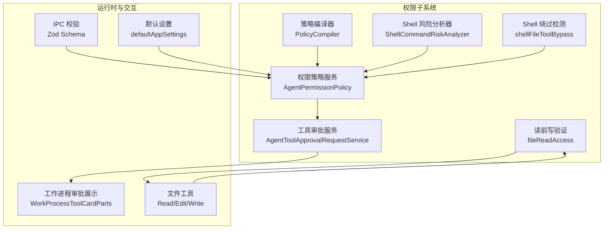
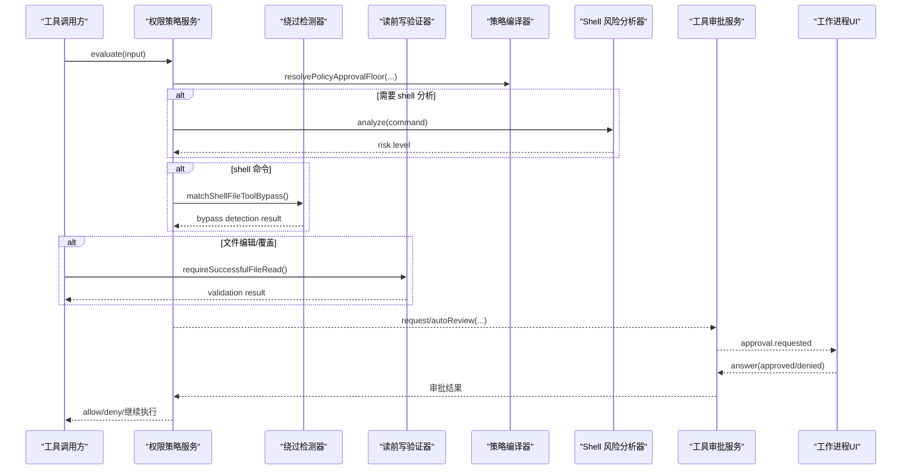
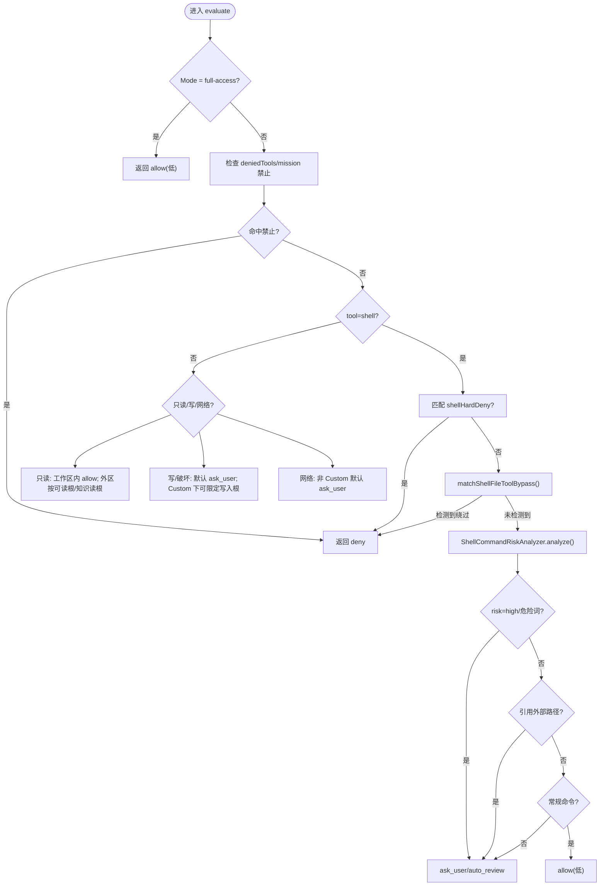
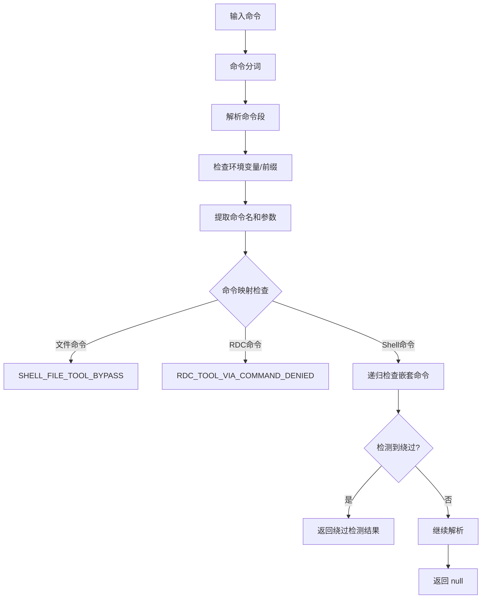
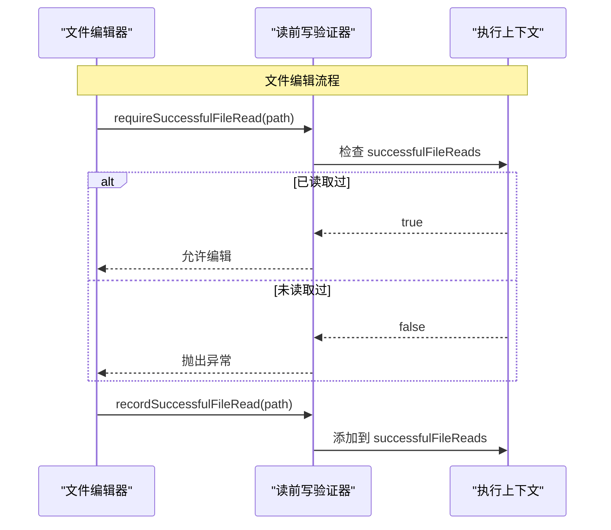
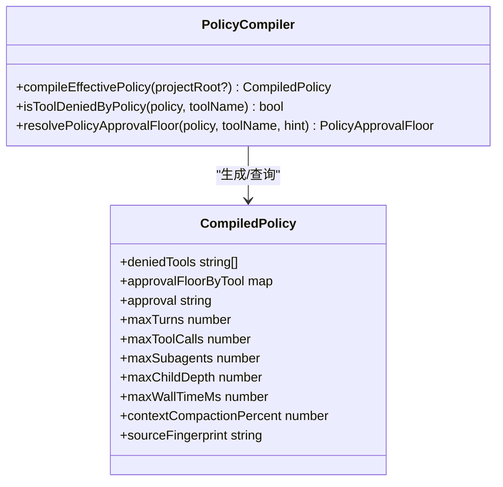
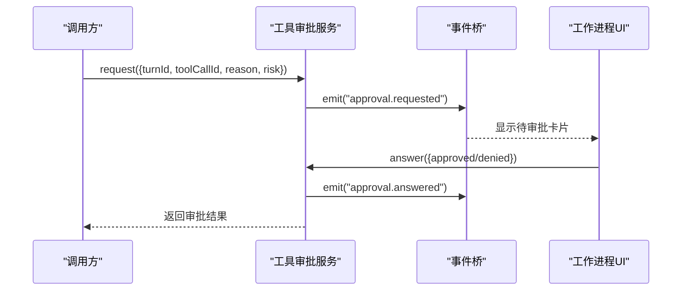
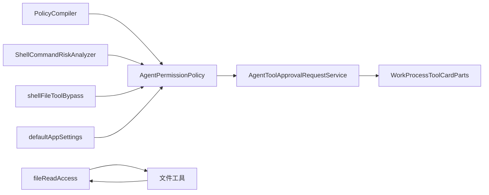

# 权限控制系统

<cite>
**本文引用的文件**
- [permissions.md](file://docs/contracts/permissions.md)
- [AgentPermissionPolicy.ts](file://src/main/agent-runtime/permissions/AgentPermissionPolicy.ts)
- [PolicyCompiler.ts](file://src/main/agent-runtime/permissions/PolicyCompiler.ts)
- [ShellCommandRiskAnalyzer.ts](file://src/main/agent-runtime/permissions/ShellCommandRiskAnalyzer.ts)
- [shellFileToolBypass.ts](file://src/main/agent-runtime/permissions/shellFileToolBypass.ts)
- [fileReadAccess.ts](file://src/main/agent-runtime/tools/primitives/fileReadAccess.ts)
- [AgentToolApprovalRequestService.ts](file://src/main/agent-runtime/permissions/AgentToolApprovalRequestService.ts)
- [rdcRuntimeSchemas.ts](file://src/main/ipc/validation/rdcRuntimeSchemas.ts)
- [defaultAppSettings.ts](file://src/renderer/stores/defaultAppSettings.ts)
- [WorkProcessToolCardParts.tsx](file://src/renderer/features/transcript/WorkProcessToolCardParts.tsx)
- [check-tool-system.mjs](file://scripts/check-tool-system.mjs)
- [EditFileTool.ts](file://src/main/agent-runtime/tools/primitives/EditFileTool.ts)
- [WriteFileTool.ts](file://src/main/agent-runtime/tools/primitives/WriteFileTool.ts)
- [ReadFileTool.ts](file://src/main/agent-runtime/tools/primitives/ReadFileTool.ts)
- [AgentTool.ts](file://src/main/agent-runtime/agent/AgentTool.ts)
</cite>

## 更新摘要
**变更内容**
- 新增 shell 命令文件操作绕过检测模块（shellFileToolBypass.ts）
- 实现读前写强制验证机制（fileReadAccess.ts）
- 增强权限系统对通过 shell 命令进行的文件操作绕过的防护能力
- 完善文件编辑前的读取验证流程，确保数据一致性

## 目录
1. [简介](#简介)
2. [项目结构](#项目结构)
3. [核心组件](#核心组件)
4. [架构总览](#架构总览)
5. [详细组件分析](#详细组件分析)
6. [依赖关系分析](#依赖关系分析)
7. [性能与可扩展性](#性能与可扩展性)
8. [故障排查指南](#故障排查指南)
9. [结论](#结论)
10. [附录：配置与最佳实践](#附录配置与最佳实践)

## 简介
本文件系统性说明 RDC-Agent 的权限控制系统，覆盖基于角色的访问控制（RBAC）与基于能力的权限模型、工具执行权限、文件访问权限、网络请求权限的管理机制；并完整描述权限声明、权限检查、权限审计流程。同时给出权限配置格式、动态授权与撤销的实现要点，以及常见问题的排障建议与最佳实践。

**最新更新**：增强了权限控制系统的安全边界，新增了 shell 命令文件操作绕过检测和读前写强制验证机制，进一步提升了系统的安全性。

## 项目结构
权限相关代码集中在主进程的 agent-runtime 权限子系统，配合 IPC 校验、设置项与 UI 展示形成端到端闭环：
- 策略编译：读取用户/项目策略文件，合并为不可变编译策略
- 权限判定：根据工具类型、路径范围、命令风险、模式等计算决策
- **新增**：Shell 命令绕过检测：识别通过 shell 命令进行的文件操作绕过尝试
- **新增**：读前写验证：确保文件编辑前已成功读取目标文件
- 审批流：支持用户审批与自动审查，事件化记录审计
- 安全边界：Electron 沙箱、IPC Schema 校验、Shell 灾难拒绝、MCP/Hook 信任
- 配置与展示：默认权限设置、工作进程中的审批状态展示

**图表来源**
- [PolicyCompiler.ts:145-212](file://src/main/agent-runtime/permissions/PolicyCompiler.ts#L145-L212)
- [AgentPermissionPolicy.ts:323-476](file://src/main/agent-runtime/permissions/AgentPermissionPolicy.ts#L323-L476)
- [shellFileToolBypass.ts:39-80](file://src/main/agent-runtime/permissions/shellFileToolBypass.ts#L39-L80)
- [fileReadAccess.ts:9-17](file://src/main/agent-runtime/tools/primitives/fileReadAccess.ts#L9-L17)
- [AgentToolApprovalRequestService.ts:43-208](file://src/main/agent-runtime/permissions/AgentToolApprovalRequestService.ts#L43-L208)

**章节来源**
- [permissions.md:5-13](file://docs/contracts/permissions.md#L5-L13)
- [permissions.md:29-46](file://docs/contracts/permissions.md#L29-L46)
- [permissions.md:86-91](file://docs/contracts/permissions.md#L86-L91)

## 核心组件
- 策略编译器（PolicyCompiler）
  - 负责加载用户与项目的 .policy.yml，进行严格校验、合并与冻结，生成 CompiledPolicy
  - 提供 deniedTools、approvalFloorByTool、limits 等能力约束与预算上限
- 权限策略服务（AgentPermissionPolicy）
  - 对每次工具调用进行风险评估与决策：allow / auto_review / ask_user / deny
  - 结合 Permission Mode、readable/writable roots、会话附件根、知识读根、命令白黑名单、shell 灾难拒绝等
  - **新增**：集成 shell 命令文件操作绕过检测，防止通过 shell 命令绕过文件工具权限控制
- Shell 风险分析器（ShellCommandRiskAnalyzer）
  - 对 shell 命令做结构化分析与高危模式匹配，输出风险等级用于审批路由
- **新增**：Shell 命令绕过检测器（shellFileToolBypass）
  - 检测通过 cat、grep、sed、PowerShell Get-Content 等命令进行的文件操作绕过尝试
  - 识别嵌套 shell 调用和特殊字符转义场景
  - 阻止通过 rdc CLI、Python 脚本等方式绕过权限控制
- **新增**：读前写验证器（fileReadAccess）
  - 在文件编辑和覆盖操作前强制验证已成功读取目标文件
  - 维护会话级别的 successfulFileReads 集合，确保数据一致性
- 工具审批服务（AgentToolApprovalRequestService）
  - 管理待审批请求的生命周期，支持用户审批与自动审查，并通过事件桥上报审计
- IPC 校验与 Browser Bridge 安全
  - 所有 IPC 参数经 Zod 校验，非法载荷 fail-closed；Bridge 仅 QA/Debug 暴露且具备强鉴权
- 设置与默认值
  - 默认权限模式、读写根、命令前缀白名单/黑名单等通过设置持久化

**章节来源**
- [PolicyCompiler.ts:145-212](file://src/main/agent-runtime/permissions/PolicyCompiler.ts#L145-L212)
- [AgentPermissionPolicy.ts:323-476](file://src/main/agent-runtime/permissions/AgentPermissionPolicy.ts#L323-L476)
- [shellFileToolBypass.ts:39-80](file://src/main/agent-runtime/permissions/shellFileToolBypass.ts#L39-L80)
- [fileReadAccess.ts:9-17](file://src/main/agent-runtime/tools/primitives/fileReadAccess.ts#L9-L17)
- [AgentToolApprovalRequestService.ts:43-208](file://src/main/agent-runtime/permissions/AgentToolApprovalRequestService.ts#L43-L208)

## 架构总览
权限系统采用"策略编译 + 运行时评估 + 审批流 + 安全边界"的分层设计：
- 策略层：将用户/项目策略编译为不可变策略，定义工具禁用、最低审批级别、资源预算
- 评估层：依据工具类别、路径范围、命令风险、模式等计算决策强度
- **新增**：绕过检测层：在 shell 命令执行前检测潜在的文件操作绕过尝试
- **新增**：数据一致性层：通过读前写验证确保文件操作的原子性和一致性
- 审批层：低危可自动审查，中高危需用户审批；审批事件统一上报审计
- 安全边界：Electron 沙箱、IPC Schema 校验、Shell 灾难拒绝、MCP/Hook 信任、Secret 隔离

**图表来源**
- [AgentPermissionPolicy.ts:323-476](file://src/main/agent-runtime/permissions/AgentPermissionPolicy.ts#L323-L476)
- [shellFileToolBypass.ts:39-80](file://src/main/agent-runtime/permissions/shellFileToolBypass.ts#L39-L80)
- [fileReadAccess.ts:9-17](file://src/main/agent-runtime/tools/primitives/fileReadAccess.ts#L9-L17)
- [PolicyCompiler.ts:179-195](file://src/main/agent-runtime/permissions/PolicyCompiler.ts#L179-L195)

## 详细组件分析

### 权限策略服务（AgentPermissionPolicy）
- 职责
  - 规范化工具名、解析目标路径、判断是否在工作区或允许根内
  - 区分只读文件工具、写操作工具、网络工具、shell 命令
  - 结合 Permission Mode（Default/Auto-review/Full access/Custom）与策略地板（approval floor）得出最终决策
  - **新增**：集成 shell 命令文件操作绕过检测，在 shell 命令执行前进行安全检查
- 关键规则
  - 任务计划专属代理禁止的工具不可被 Full access 绕过
  - shell 命令命中灾难拒绝表直接 deny
  - **新增**：shell 命令命中绕过检测直接拒绝，返回 SHELL_FILE_TOOL_BYPASS 或 RDC_TOOL_VIA_COMMAND_DENIED
  - 只读文件工具在 workspace 内自动允许；跨工作区但位于可读根或知识读根时自动允许
  - 写操作与破坏性工具默认要求审批；Custom 模式下可限定写入根
  - 网络工具在非 Custom 模式下默认要求审批
- 决策强度格：allow < auto_review < ask_user < deny

**图表来源**
- [AgentPermissionPolicy.ts:323-476](file://src/main/agent-runtime/permissions/AgentPermissionPolicy.ts#L323-L476)
- [shellFileToolBypass.ts:39-80](file://src/main/agent-runtime/permissions/shellFileToolBypass.ts#L39-L80)
- [ShellCommandRiskAnalyzer.ts:83-125](file://src/main/agent-runtime/permissions/ShellCommandRiskAnalyzer.ts#L83-L125)

**章节来源**
- [AgentPermissionPolicy.ts:323-476](file://src/main/agent-runtime/permissions/AgentPermissionPolicy.ts#L323-L476)

### Shell 命令绕过检测器（shellFileToolBypass）
- 职责
  - **新增**：检测通过 shell 命令进行的文件操作绕过尝试
  - 识别常见的文件操作命令：cat、grep、sed、PowerShell Get-Content、cmd type 等
  - 处理嵌套 shell 调用（如 pwsh -Command、cmd /c）
  - 阻止通过 rdc CLI、Python 脚本等方式绕过权限控制
  - 支持多种 shell 环境：PowerShell、cmd、bash、zsh
- 检测逻辑
  - 命令分词：正确处理引号、转义字符、管道符
  - 命令映射：将 shell 命令映射到对应的文件工具名称
  - 深度限制：防止无限递归检测（最大深度 8）
  - 环境变量跳过：忽略变量赋值和 call/command/exec/sudo/env 等前缀
- 返回值
  - null：未检测到绕过尝试
  - SHELL_FILE_TOOL_BYPASS：检测到文件操作绕过，建议使用专用工具
  - RDC_TOOL_VIA_COMMAND_DENIED：检测到通过 rdc CLI 绕过，直接拒绝

**图表来源**
- [shellFileToolBypass.ts:15-80](file://src/main/agent-runtime/permissions/shellFileToolBypass.ts#L15-L80)

**章节来源**
- [shellFileToolBypass.ts:39-80](file://src/main/agent-runtime/permissions/shellFileToolBypass.ts#L39-L80)

### 读前写验证器（fileReadAccess）
- 职责
  - **新增**：实现文件编辑前的读取验证机制
  - 维护会话级别的 successfulFileReads 集合，记录成功读取的文件路径
  - 在文件编辑和覆盖操作前强制验证已成功读取目标文件
  - 处理跨平台路径大小写问题（Windows 不区分大小写）
- 工作流程
  - recordSuccessfulFileRead：记录成功的文件读取操作
  - requireSuccessfulFileRead：验证文件编辑前已成功读取
  - 路径规范化：使用 fs.realpathSync 获取真实路径
- 应用场景
  - EditFileTool：编辑文件前必须已成功读取
  - WriteFileTool：覆盖现有文件前必须已成功读取
  - 确保文件操作的原子性和数据一致性

**图表来源**
- [fileReadAccess.ts:9-17](file://src/main/agent-runtime/tools/primitives/fileReadAccess.ts#L9-L17)
- [EditFileTool.ts:71-71](file://src/main/agent-runtime/tools/primitives/EditFileTool.ts#L71-L71)
- [WriteFileTool.ts:75-75](file://src/main/agent-runtime/tools/primitives/WriteFileTool.ts#L75-L75)

**章节来源**
- [fileReadAccess.ts:9-17](file://src/main/agent-runtime/tools/primitives/fileReadAccess.ts#L9-L17)
- [EditFileTool.ts:71-71](file://src/main/agent-runtime/tools/primitives/EditFileTool.ts#L71-L71)
- [WriteFileTool.ts:75-75](file://src/main/agent-runtime/tools/primitives/WriteFileTool.ts#L75-L75)

### 策略编译器（PolicyCompiler）
- 职责
  - 加载用户与项目 .policy.yml，严格校验字段与取值
  - 合并策略（项目只能收紧不能放宽），生成不可变的 CompiledPolicy
  - 提供 isToolDeniedByPolicy、resolvePolicyApprovalFloor 等查询接口
- 关键点
  - limits 必须为非负整数，未知键将被拒绝
  - approvalFloorByTool 可为每个工具设定最低审批级别
  - 策略指纹用于缓存与变更检测

**图表来源**
- [PolicyCompiler.ts:145-212](file://src/main/agent-runtime/permissions/PolicyCompiler.ts#L145-L212)
- [PolicyCompiler.ts:179-195](file://src/main/agent-runtime/permissions/PolicyCompiler.ts#L179-L195)

**章节来源**
- [PolicyCompiler.ts:145-212](file://src/main/agent-runtime/permissions/PolicyCompiler.ts#L145-L212)

### Shell 风险分析器（ShellCommandRiskAnalyzer）
- 职责
  - 将命令拆分为段，提取首命令基名，匹配高危模式与高危命令集合
  - 输出风险等级（none/low/medium/high）供审批路由使用
- 注意
  - 仅为分类器，不是安全边界；真正的强制拒绝在 shellHardDeny 与 OS/沙箱

**章节来源**
- [ShellCommandRiskAnalyzer.ts:83-125](file://src/main/agent-runtime/permissions/ShellCommandRiskAnalyzer.ts#L83-L125)

### 工具审批服务（AgentToolApprovalRequestService）
- 职责
  - 维护待审批请求映射，支持 request/autoReview/answer/cancel
  - 通过事件桥发出 approval.requested/approval.answered 事件，供审计与工作进程展示
  - 支持子代理委派场景下的会话归属校验
- 工作流
  - 低危可自动审查通过；中高危需用户明确批准或拒绝
  - 同一 turnId+approvalId 的请求可被新请求覆盖或取消

**图表来源**
- [AgentToolApprovalRequestService.ts:43-208](file://src/main/agent-runtime/permissions/AgentToolApprovalRequestService.ts#L43-L208)
- [WorkProcessToolCardParts.tsx:208-223](file://src/renderer/features/transcript/WorkProcessToolCardParts.tsx#L208-L223)

**章节来源**
- [AgentToolApprovalRequestService.ts:43-208](file://src/main/agent-runtime/permissions/AgentToolApprovalRequestService.ts#L43-L208)
- [WorkProcessToolCardParts.tsx:208-223](file://src/renderer/features/transcript/WorkProcessToolCardParts.tsx#L208-L223)

### IPC 与 Browser Bridge 安全
- IPC 全量参数经 Zod 校验，非法载荷 fail-closed
- Browser Bridge 仅在 QA/Debug 模式启用，具备强鉴权与同源限制
- Hook/MCP 信任与撤销通过专用 IPC handler 处理

**章节来源**
- [permissions.md:29-46](file://docs/contracts/permissions.md#L29-L46)
- [rdcRuntimeSchemas.ts:49-83](file://src/main/ipc/validation/rdcRuntimeSchemas.ts#L49-L83)

## 依赖关系分析
- AgentPermissionPolicy 依赖：
  - PolicyCompiler 提供的策略地板与工具禁用列表
  - ShellCommandRiskAnalyzer 的命令风险分类
  - **新增**：shellFileToolBypass 的绕过检测能力
  - 设置服务获取当前权限模式与根配置
- 审批服务依赖：
  - 事件桥与委派上下文，确保跨会话/子代理的正确归属
- **新增**：文件工具依赖：
  - fileReadAccess 的读前写验证能力
  - ToolExecutionContext 的 successfulFileReads 集合
- 构建期门禁：
  - check-tool-system.mjs 断言 READ_ONLY_FILE_TOOLS 常量与 shellHardDeny 的使用，保证关键安全点不被误改

**图表来源**
- [check-tool-system.mjs:326-337](file://scripts/check-tool-system.mjs#L326-L337)
- [AgentPermissionPolicy.ts:323-476](file://src/main/agent-runtime/permissions/AgentPermissionPolicy.ts#L323-L476)
- [shellFileToolBypass.ts:39-80](file://src/main/agent-runtime/permissions/shellFileToolBypass.ts#L39-L80)
- [fileReadAccess.ts:9-17](file://src/main/agent-runtime/tools/primitives/fileReadAccess.ts#L9-L17)

**章节来源**
- [check-tool-system.mjs:326-337](file://scripts/check-tool-system.mjs#L326-L337)

## 性能与可扩展性
- 策略编译一次性完成并冻结，避免重复解析与合并开销
- 决策过程以字符串/集合匹配为主，时间复杂度近似 O(1)~O(n)（n 为命令片段数）
- 审批事件异步发送，不阻塞主执行路径
- **新增**：绕过检测优化
  - 命令分词和解析采用单次遍历，避免重复扫描
  - 嵌套 shell 调用限制最大深度为 8，防止性能问题
  - 文件路径比较使用 Set 存储，查找时间复杂度 O(1)
- 可扩展点：
  - 新增工具类别只需扩展工具名集合与路径提取逻辑
  - 新增命令风险模式可在风险分析器中追加正则/集合
  - 新增绕过检测命令可在 FILE_COMMANDS 映射中添加
  - 策略层可通过 approvalFloorByTool 精细控制不同工具的最低审批级别

[本节为通用指导，无需具体文件来源]

## 故障排查指南
- 策略文件损坏或非法
  - 现象：编译失败，fail-closed
  - 处理：修正 .policy.yml 语法与字段类型，重新编译
- 命令被拒绝
  - 现象：shell 命令命中灾难拒绝或被自定义 deny 前缀拦截
  - 处理：调整命令或使用允许的白名单前缀；确认不在灾难拒绝集
- **新增**：绕过检测触发
  - 现象：shell 命令被标记为 SHELL_FILE_TOOL_BYPASS 或 RDC_TOOL_VIA_COMMAND_DENIED
  - 处理：使用专用的文件工具替代 shell 命令；避免通过 rdc CLI 绕过权限
- 审批卡住
  - 现象：出现 pending 审批无响应
  - 处理：检查 turnId 与 approvalId 是否正确；确认对应会话未关闭；必要时取消并重试
- **新增**：读前写验证失败
  - 现象：文件编辑时报错 "READ_BEFORE_EDIT_REQUIRED"
  - 处理：先使用 read_file 工具读取目标文件，再进行编辑操作
- 网络工具被拒
  - 现象：web_fetch/web_search 在非 Custom 模式下要求审批
  - 处理：切换到 Custom 模式或在审批界面批准
- 只读文件越界
  - 现象：跨工作区读取被要求审批
  - 处理：将目标加入 readableRoots 或知识读根；或在工作区内操作

**章节来源**
- [permissions.md:86-91](file://docs/contracts/permissions.md#L86-L91)
- [AgentPermissionPolicy.ts:323-476](file://src/main/agent-runtime/permissions/AgentPermissionPolicy.ts#L323-L476)
- [shellFileToolBypass.ts:39-80](file://src/main/agent-runtime/permissions/shellFileToolBypass.ts#L39-L80)
- [fileReadAccess.ts:13-17](file://src/main/agent-runtime/tools/primitives/fileReadAccess.ts#L13-L17)
- [AgentToolApprovalRequestService.ts:43-208](file://src/main/agent-runtime/permissions/AgentToolApprovalRequestService.ts#L43-L208)

## 结论
RDC-Agent 的权限控制系统以"策略编译 + 运行时评估 + 审批流 + 安全边界"为核心，既保证了灵活性（多模式、策略地板、读写根、命令白黑名单），又确保了安全性（沙箱、IPC 校验、灾难拒绝、信任管理）。通过事件化的审批与审计，系统实现了可观测、可追溯、可回滚的权限治理体系。

**最新更新**：通过新增的 shell 命令绕过检测和读前写验证机制，系统进一步增强了对文件操作的安全防护，有效防止了通过 shell 命令绕过权限控制的攻击向量，同时确保了文件编辑操作的原子性和数据一致性。

[本节为总结性内容，无需具体文件来源]

## 附录：配置与最佳实践

### 权限配置格式（.policy.yml）
- deniedTools：禁用工具列表（标准化后去重排序）
- approval：全局审批级别（none/destructive/mutation/all）
- approvalFloorByTool：按工具指定最低审批级别（none/auto_review/user）
- limits：预算上限（maxTurns、maxToolCalls、maxSubagents、maxChildDepth、maxWallTimeMs、contextCompactionPercent），必须为非负整数
- enabled：false 表示禁用该策略文件

**章节来源**
- [PolicyCompiler.ts:57-110](file://src/main/agent-runtime/permissions/PolicyCompiler.ts#L57-L110)
- [PolicyCompiler.ts:145-172](file://src/main/agent-runtime/permissions/PolicyCompiler.ts#L145-L172)

### 权限模式与行为
- Default：工作区内只读自动允许；外部文件、网络、破坏性 shell、未知命令需审批
- Auto-review：记录 reviewer 决策后继续
- Full access：显式信任本地文件与命令；仍受 primitive 硬约束
- Custom：按配置的根与命令列表

**章节来源**
- [permissions.md:5-13](file://docs/contracts/permissions.md#L5-L13)

### 动态授权与撤销
- 动态授权：通过策略文件的 approvalFloorByTool 与 limits 实现细粒度收紧；运行时通过 Permission Mode 切换基线
- 撤销：修改策略文件或关闭策略文件生效；对于 MCP/Hook 信任，通过专用 IPC handler 撤销并触发 re-trust 检查

**章节来源**
- [PolicyCompiler.ts:145-212](file://src/main/agent-runtime/permissions/PolicyCompiler.ts#L145-L212)
- [permissions.md:63-76](file://docs/contracts/permissions.md#L63-L76)
- [rdcRuntimeSchemas.ts:53-66](file://src/main/ipc/validation/rdcRuntimeSchemas.ts#L53-L66)

### 最佳实践
- 尽量使用工作区内的只读操作以降低审批成本
- 对写操作与破坏性工具设置更严格的 approvalFloorByTool
- 谨慎添加外部路径到 readableRoots/writableRoots，遵循最小权限原则
- 使用 Custom 模式精确限定允许的命令前缀与写入根
- 定期审查策略文件与审批日志，及时收敛权限
- **新增**：避免通过 shell 命令进行文件操作，使用专用的文件工具
- **新增**：在编辑文件前先使用 read_file 工具读取目标文件
- **新增**：监控绕过检测日志，及时发现潜在的权限绕过尝试

[本节为通用指导，无需具体文件来源]