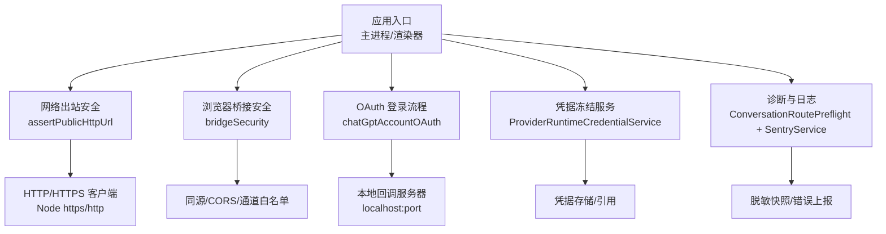
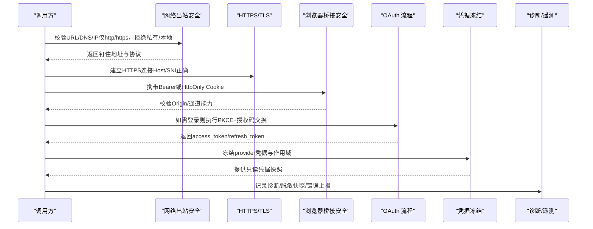
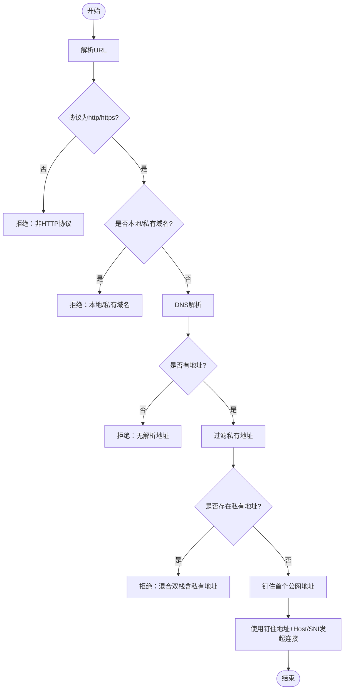
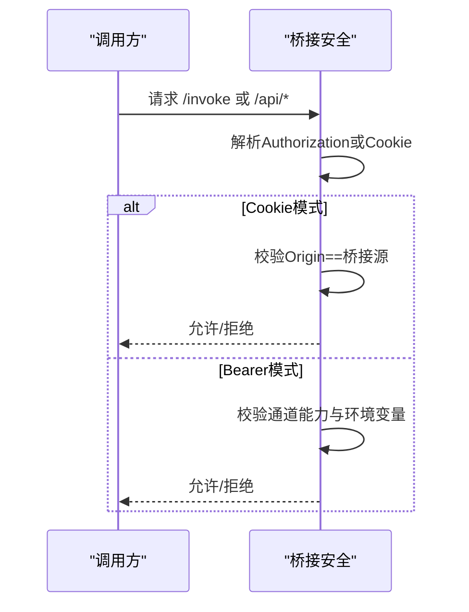
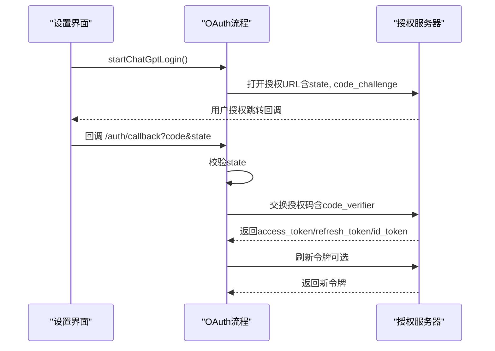
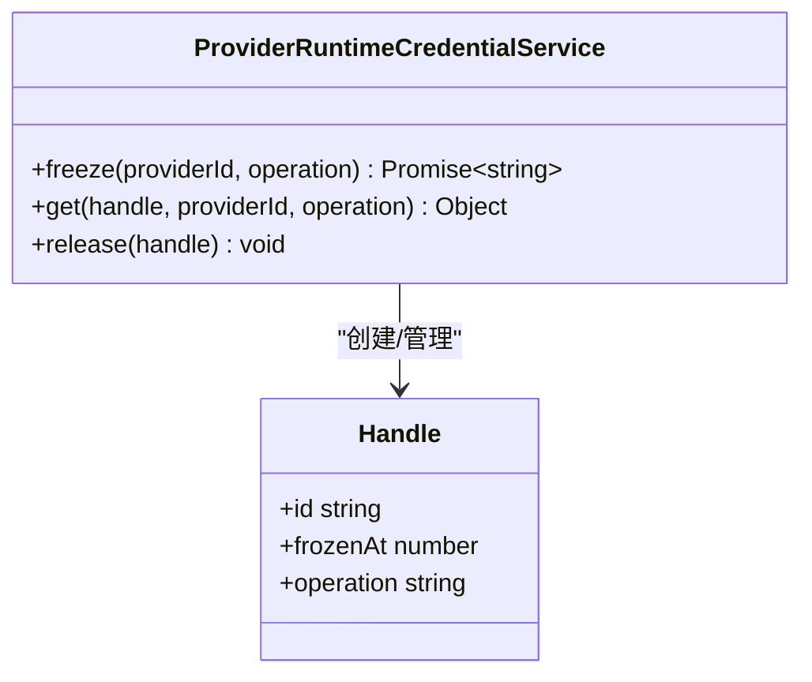
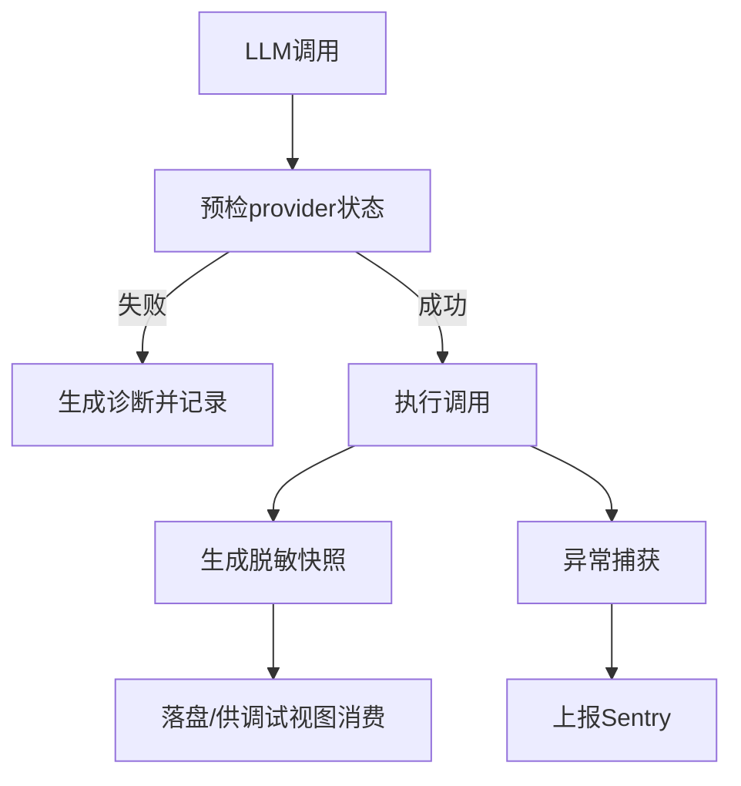
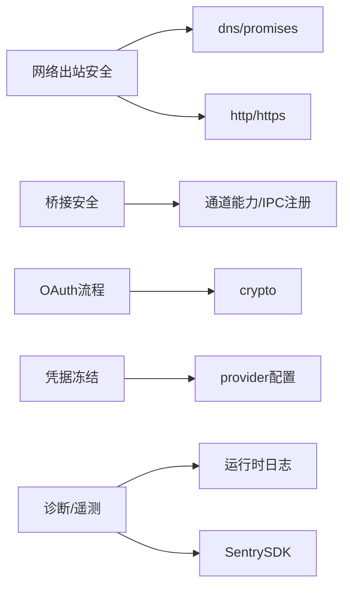

# 网络安全防护

<cite>
**本文引用的文件**
- [src/main/agent-runtime/net/assertPublicHttpUrl.ts](file://src/main/agent-runtime/net/assertPublicHttpUrl.ts)
- [src/main/browserAppBridge/bridgeSecurity.ts](file://src/main/browserAppBridge/bridgeSecurity.ts)
- [src/main/settings/oauth/chatGptAccountOAuth.ts](file://src/main/settings/oauth/chatGptAccountOAuth.ts)
- [src/main/settings/oauth/oauthTypes.ts](file://src/main/settings/oauth/oauthTypes.ts)
- [src/main/settings/ProviderRuntimeCredentialService.test.ts](file://src/main/settings/ProviderRuntimeCredentialService.test.ts)
- [src/main/conversation/ConversationRoutePreflight.ts](file://src/main/conversation/ConversationRoutePreflight.ts)
- [src/main/telemetry/SentryService.ts](file://src/main/telemetry/SentryService.ts)
- [docs/architecture/rdc-runtime.md](file://docs/architecture/rdc-runtime.md)
</cite>

## 目录
1. [简介](#简介)
2. [项目结构](#项目结构)
3. [核心组件](#核心组件)
4. [架构总览](#架构总览)
5. [详细组件分析](#详细组件分析)
6. [依赖关系分析](#依赖关系分析)
7. [性能与安全考量](#性能与安全考量)
8. [故障排查指南](#故障排查指南)
9. [结论](#结论)
10. [附录](#附录)

## 简介
本文件聚焦 RDC-Agent 的网络安全防护实现，覆盖网络请求安全验证、URL 白名单与出站限制、CORS/同源策略、HTTPS/TLS 连接与证书校验、OAuth 认证流程与令牌管理、会话保持、以及针对 DDoS、中间人攻击等威胁的防护策略。同时给出网络监控、日志记录与异常检测的最佳实践建议，帮助读者在开发与运维中构建纵深防御体系。

## 项目结构
RDC-Agent 的安全能力分布在多个模块：
- 网络出站安全：对 URL、DNS、IP 进行严格校验与“钉住”目标地址，防止 DNS 重绑定与内网访问。
- 浏览器桥接安全：基于 Bearer Token 或 HttpOnly Cookie 的身份校验、Origin/CORS 控制、通道能力矩阵。
- OAuth 认证：本地回调服务、PKCE、授权码交换、刷新令牌、账户发现。
- 运行时凭据：凭据冻结、作用域限定、一次性释放。
- 诊断与遥测：LLM 路由预检失败诊断、脱敏快照、崩溃上报。

**图表来源**
- [src/main/agent-runtime/net/assertPublicHttpUrl.ts:1-225](file://src/main/agent-runtime/net/assertPublicHttpUrl.ts#L1-L225)
- [src/main/browserAppBridge/bridgeSecurity.ts:1-120](file://src/main/browserAppBridge/bridgeSecurity.ts#L1-L120)
- [src/main/settings/oauth/chatGptAccountOAuth.ts:1-147](file://src/main/settings/oauth/chatGptAccountOAuth.ts#L1-L147)
- [src/main/settings/ProviderRuntimeCredentialService.test.ts:1-93](file://src/main/settings/ProviderRuntimeCredentialService.test.ts#L1-L93)
- [src/main/conversation/ConversationRoutePreflight.ts:385-521](file://src/main/conversation/ConversationRoutePreflight.ts#L385-L521)
- [src/main/telemetry/SentryService.ts:1-48](file://src/main/telemetry/SentryService.ts#L1-L48)

**章节来源**
- [src/main/agent-runtime/net/assertPublicHttpUrl.ts:1-225](file://src/main/agent-runtime/net/assertPublicHttpUrl.ts#L1-L225)
- [src/main/browserAppBridge/bridgeSecurity.ts:1-120](file://src/main/browserAppBridge/bridgeSecurity.ts#L1-L120)
- [src/main/settings/oauth/chatGptAccountOAuth.ts:1-147](file://src/main/settings/oauth/chatGptAccountOAuth.ts#L1-L147)
- [src/main/settings/ProviderRuntimeCredentialService.test.ts:1-93](file://src/main/settings/ProviderRuntimeCredentialService.test.ts#L1-L93)
- [src/main/conversation/ConversationRoutePreflight.ts:385-521](file://src/main/conversation/ConversationRoutePreflight.ts#L385-L521)
- [src/main/telemetry/SentryService.ts:1-48](file://src/main/telemetry/SentryService.ts#L1-L48)

## 核心组件
- 网络出站安全（URL/DNS/IP 白名单与钉住）
  - 仅允许 http/https；拒绝 localhost、私有 IP、多栈混用中的私有地址；DNS 解析后选择首个公网地址并钉住，后续连接强制使用钉住地址与 Host/SNI，避免 DNS 重绑定。
- 浏览器桥接安全（CORS/同源/通道能力）
  - 通过 Bearer 头或 HttpOnly Cookie 鉴权；Cookie 模式要求 Origin 必须与桥接源一致；通道能力矩阵限制高影响操作需显式环境变量开启。
- OAuth 认证（PKCE、授权码、刷新、本地回调）
  - 使用 PKCE 生成 challenge；本地回调服务监听特定端口；授权码交换获取 access_token/refresh_token/id_token；支持刷新令牌续期。
- 凭据冻结与作用域
  - 将 provider 配置、连接值、连接头冻结为不可变快照，按操作类型（如 chat/embed）限定作用域，支持一次性释放，降低泄露面。
- 诊断与遥测
  - LLM 路由预检失败时记录结构化诊断；每次 llm_turn 保存脱敏信封快照（不含凭据与受保护载荷），结合 Sentry 上报崩溃与关键事件。

**章节来源**
- [src/main/agent-runtime/net/assertPublicHttpUrl.ts:1-225](file://src/main/agent-runtime/net/assertPublicHttpUrl.ts#L1-L225)
- [src/main/browserAppBridge/bridgeSecurity.ts:1-120](file://src/main/browserAppBridge/bridgeSecurity.ts#L1-L120)
- [src/main/settings/oauth/chatGptAccountOAuth.ts:1-147](file://src/main/settings/oauth/chatGptAccountOAuth.ts#L1-L147)
- [src/main/settings/ProviderRuntimeCredentialService.test.ts:1-93](file://src/main/settings/ProviderRuntimeCredentialService.test.ts#L1-L93)
- [src/main/conversation/ConversationRoutePreflight.ts:385-521](file://src/main/conversation/ConversationRoutePreflight.ts#L385-L521)
- [src/main/telemetry/SentryService.ts:1-48](file://src/main/telemetry/SentryService.ts#L1-L48)
- [docs/architecture/rdc-runtime.md:50-52](file://docs/architecture/rdc-runtime.md#L50-L52)

## 架构总览
下图展示了从发起网络请求到安全校验、认证、凭据注入、再到日志与遥测的整体链路。

**图表来源**
- [src/main/agent-runtime/net/assertPublicHttpUrl.ts:1-225](file://src/main/agent-runtime/net/assertPublicHttpUrl.ts#L1-L225)
- [src/main/browserAppBridge/bridgeSecurity.ts:1-120](file://src/main/browserAppBridge/bridgeSecurity.ts#L1-L120)
- [src/main/settings/oauth/chatGptAccountOAuth.ts:1-147](file://src/main/settings/oauth/chatGptAccountOAuth.ts#L1-L147)
- [src/main/settings/ProviderRuntimeCredentialService.test.ts:1-93](file://src/main/settings/ProviderRuntimeCredentialService.test.ts#L1-L93)
- [src/main/conversation/ConversationRoutePreflight.ts:385-521](file://src/main/conversation/ConversationRoutePreflight.ts#L385-L521)
- [src/main/telemetry/SentryService.ts:1-48](file://src/main/telemetry/SentryService.ts#L1-L48)

## 详细组件分析

### 网络出站安全：URL 白名单与 DNS 钉住
- 功能要点
  - 仅允许 http/https；拒绝 localhost、私有 IPv4/IPv6、回环地址、映射地址。
  - DNS 解析后过滤私有地址；若存在任何私有地址则直接拒绝（防双栈混用风险）。
  - 选择首个公网地址作为“钉住地址”，并在后续连接中使用该地址与原始 Host/SNI，避免 DNS 重绑定。
  - 提供 fetchPinnedPublic 封装，确保连接阶段仍受白名单约束。
- 复杂度与性能
  - DNS 查询一次，过滤与判定线性于解析结果数量；整体 O(n)。
  - 钉住机制减少后续连接阶段的 DNS 开销，提升稳定性。
- 安全影响
  - 有效阻断内网探测、DNS 重绑定、协议降级（非 http/https）。
  - 通过 setHost=false 与显式 Host/SNI 保证服务端虚拟主机匹配正确。

**图表来源**
- [src/main/agent-runtime/net/assertPublicHttpUrl.ts:1-225](file://src/main/agent-runtime/net/assertPublicHttpUrl.ts#L1-L225)

**章节来源**
- [src/main/agent-runtime/net/assertPublicHttpUrl.ts:1-225](file://src/main/agent-runtime/net/assertPublicHttpUrl.ts#L1-L225)

### 浏览器桥接安全：CORS、同源与通道能力
- 功能要点
  - 通道白名单：仅允许已注册且具备能力的 IPC 通道；高影响通道需显式环境变量开启。
  - 鉴权方式：支持 Authorization: Bearer 或 HttpOnly Cookie（rdcBridgeToken）。
  - CORS/同源：Cookie 模式要求 Origin 必须等于桥接源；Bearer 模式可省略 Origin（自动化场景）。
  - 路径限制：/invoke、/events、/api/* 等敏感路径必须使用 Cookie 同源校验。
- 安全影响
  - 防止跨站脚本滥用桥接能力；最小化暴露面；避免在地址栏留存凭证。

**图表来源**
- [src/main/browserAppBridge/bridgeSecurity.ts:1-120](file://src/main/browserAppBridge/bridgeSecurity.ts#L1-L120)

**章节来源**
- [src/main/browserAppBridge/bridgeSecurity.ts:1-120](file://src/main/browserAppBridge/bridgeSecurity.ts#L1-L120)

### OAuth 认证流程：PKCE、授权码与刷新
- 功能要点
  - 启动登录：生成 state 与 code_verifier，构造授权 URL，打开外部浏览器。
  - 本地回调：在 127.0.0.1 指定端口监听 /auth/callback，校验 state 并提取 code。
  - 令牌交换：向授权端点提交 authorization_code + code_verifier，获取 access_token/refresh_token/id_token。
  - 刷新令牌：使用 refresh_token 续期，更新过期时间。
  - 模型发现：使用 access_token 拉取后端模型目录，用于后续路由。
- 安全影响
  - PKCE 防止授权码拦截；本地回调仅监听本机，降低劫持风险；state 校验防 CSRF。

**图表来源**
- [src/main/settings/oauth/chatGptAccountOAuth.ts:1-147](file://src/main/settings/oauth/chatGptAccountOAuth.ts#L1-L147)
- [src/main/settings/oauth/oauthTypes.ts:1-75](file://src/main/settings/oauth/oauthTypes.ts#L1-L75)

**章节来源**
- [src/main/settings/oauth/chatGptAccountOAuth.ts:1-147](file://src/main/settings/oauth/chatGptAccountOAuth.ts#L1-L147)
- [src/main/settings/oauth/oauthTypes.ts:1-75](file://src/main/settings/oauth/oauthTypes.ts#L1-L75)

### 凭据冻结与作用域隔离
- 功能要点
  - freeze：将 provider 配置、连接值、连接头冻结为不可变快照，并生成句柄。
  - get：按 providerId 与 operation（如 chat/embed）校验作用域一致性，越界即拒绝。
  - release：释放句柄，使凭据失效，防止长期持有。
- 安全影响
  - 降低凭据泄露后的可用窗口；按操作最小权限原则限制凭据用途。

**图表来源**
- [src/main/settings/ProviderRuntimeCredentialService.test.ts:1-93](file://src/main/settings/ProviderRuntimeCredentialService.test.ts#L1-L93)

**章节来源**
- [src/main/settings/ProviderRuntimeCredentialService.test.ts:1-93](file://src/main/settings/ProviderRuntimeCredentialService.test.ts#L1-L93)

### 诊断与脱敏快照、异常上报
- 功能要点
  - 路由预检失败：当 provider 未启用、未验证或不可用时，生成结构化诊断并记录。
  - 脱敏快照：每次 llm_turn 保存 RequestEnvelopeSnapshot，包含指令、消息、工具、资源溯源、用量与脱敏元数据；凭据与受保护载荷不落盘，仅保留哈希与原因。
  - 崩溃上报：SentryService 初始化并捕获异常/消息，便于集中追踪。
- 安全影响
  - 避免敏感信息落盘；统一诊断格式便于定位问题；崩溃上报提升可观测性。

**图表来源**
- [src/main/conversation/ConversationRoutePreflight.ts:385-521](file://src/main/conversation/ConversationRoutePreflight.ts#L385-L521)
- [docs/architecture/rdc-runtime.md:50-52](file://docs/architecture/rdc-runtime.md#L50-L52)
- [src/main/telemetry/SentryService.ts:1-48](file://src/main/telemetry/SentryService.ts#L1-L48)

**章节来源**
- [src/main/conversation/ConversationRoutePreflight.ts:385-521](file://src/main/conversation/ConversationRoutePreflight.ts#L385-L521)
- [docs/architecture/rdc-runtime.md:50-52](file://docs/architecture/rdc-runtime.md#L50-L52)
- [src/main/telemetry/SentryService.ts:1-48](file://src/main/telemetry/SentryService.ts#L1-L48)

## 依赖关系分析
- 网络出站安全依赖 Node 的 dns、http、https、net 模块，实现 DNS 解析与连接控制。
- 浏览器桥接安全依赖共享通道能力定义与 IPC 注册表，确保仅暴露必要能力。
- OAuth 流程依赖 HTTP 客户端与服务端回调，使用 crypto 生成随机 state 与 PKCE。
- 凭据冻结依赖 provider 配置与连接服务，按操作类型隔离凭据作用域。
- 诊断与遥测依赖运行时日志服务与 Sentry SDK。

**图表来源**
- [src/main/agent-runtime/net/assertPublicHttpUrl.ts:1-225](file://src/main/agent-runtime/net/assertPublicHttpUrl.ts#L1-L225)
- [src/main/browserAppBridge/bridgeSecurity.ts:1-120](file://src/main/browserAppBridge/bridgeSecurity.ts#L1-L120)
- [src/main/settings/oauth/chatGptAccountOAuth.ts:1-147](file://src/main/settings/oauth/chatGptAccountOAuth.ts#L1-L147)
- [src/main/settings/ProviderRuntimeCredentialService.test.ts:1-93](file://src/main/settings/ProviderRuntimeCredentialService.test.ts#L1-L93)
- [src/main/telemetry/SentryService.ts:1-48](file://src/main/telemetry/SentryService.ts#L1-L48)

**章节来源**
- [src/main/agent-runtime/net/assertPublicHttpUrl.ts:1-225](file://src/main/agent-runtime/net/assertPublicHttpUrl.ts#L1-L225)
- [src/main/browserAppBridge/bridgeSecurity.ts:1-120](file://src/main/browserAppBridge/bridgeSecurity.ts#L1-L120)
- [src/main/settings/oauth/chatGptAccountOAuth.ts:1-147](file://src/main/settings/oauth/chatGptAccountOAuth.ts#L1-L147)
- [src/main/settings/ProviderRuntimeCredentialService.test.ts:1-93](file://src/main/settings/ProviderRuntimeCredentialService.test.ts#L1-L93)
- [src/main/telemetry/SentryService.ts:1-48](file://src/main/telemetry/SentryService.ts#L1-L48)

## 性能与安全考量
- 性能
  - DNS 钉住减少重复解析；本地回调仅监听本机，开销低；凭据冻结避免重复解析云凭据。
  - 建议在批量请求前复用钉住结果，减少多次 DNS 查询。
- 安全
  - 严格白名单与钉住机制可有效缓解 DNS 重绑定与内网访问。
  - Cookie 模式强制同源，避免跨站滥用；高影响通道需显式开关。
  - 凭据冻结与作用域隔离降低泄露面；脱敏快照避免敏感信息持久化。
  - 建议增加速率限制、连接超时、重试退避与熔断策略以增强韧性。

[本节为通用指导，不直接分析具体文件]

## 故障排查指南
- 常见问题
  - 网络请求被拒：检查 URL 是否为 http/https；域名是否为本地或私有；DNS 是否解析为空或仅私有地址。
  - 桥接请求被拒：确认是否携带正确的 Bearer 或 HttpOnly Cookie；Origin 是否与桥接源一致；通道是否在能力白名单内。
  - OAuth 登录失败：检查本地回调端口是否被占用；state 是否匹配；授权码是否有效；刷新令牌是否过期。
  - 凭据作用域错误：确认 freeze 时指定的 operation 与 get 时一致；及时 release 句柄。
  - 诊断与上报：查看 LLM 路由预检诊断；检查脱敏快照内容；确认 Sentry 已初始化并上报。
- 建议步骤
  - 启用更详细的日志与诊断输出；复现问题时收集上下文（sessionId、providerId、modelId）。
  - 使用测试用例或最小复现脚本验证网络连通性与鉴权流程。
  - 逐步关闭非必要通道与能力，缩小攻击面。

**章节来源**
- [src/main/agent-runtime/net/assertPublicHttpUrl.ts:1-225](file://src/main/agent-runtime/net/assertPublicHttpUrl.ts#L1-L225)
- [src/main/browserAppBridge/bridgeSecurity.ts:1-120](file://src/main/browserAppBridge/bridgeSecurity.ts#L1-L120)
- [src/main/settings/oauth/chatGptAccountOAuth.ts:1-147](file://src/main/settings/oauth/chatGptAccountOAuth.ts#L1-L147)
- [src/main/settings/ProviderRuntimeCredentialService.test.ts:1-93](file://src/main/settings/ProviderRuntimeCredentialService.test.ts#L1-L93)
- [src/main/conversation/ConversationRoutePreflight.ts:385-521](file://src/main/conversation/ConversationRoutePreflight.ts#L385-L521)
- [src/main/telemetry/SentryService.ts:1-48](file://src/main/telemetry/SentryService.ts#L1-L48)

## 结论
RDC-Agent 在网络出站、浏览器桥接、OAuth 认证、凭据管理与诊断遥测等方面实现了较为完善的安全防护。通过 URL/DNS/IP 白名单与钉住、同源/CORS 控制、PKCE 授权码与刷新、凭据冻结与作用域隔离、脱敏快照与崩溃上报，构建了多层防御。建议在生产环境中进一步引入速率限制、超时与熔断、密钥轮换与审计，持续强化网络安全态势。

[本节为总结，不直接分析具体文件]

## 附录
- 术语
  - 钉住（Pin）：将 DNS 解析得到的公网地址固定用于后续连接，避免动态解析带来的风险。
  - PKCE：用于增强授权码流程的安全性，防止授权码被拦截。
  - 凭据冻结：将凭据与上下文快照化为不可变对象，限制使用范围与生命周期。
- 参考实现位置
  - 网络出站安全：src/main/agent-runtime/net/assertPublicHttpUrl.ts
  - 桥接安全：src/main/browserAppBridge/bridgeSecurity.ts
  - OAuth：src/main/settings/oauth/chatGptAccountOAuth.ts、oauthTypes.ts
  - 凭据冻结：src/main/settings/ProviderRuntimeCredentialService.test.ts
  - 诊断与快照：src/main/conversation/ConversationRoutePreflight.ts、docs/architecture/rdc-runtime.md
  - 崩溃上报：src/main/telemetry/SentryService.ts

[本节为补充说明，不直接分析具体文件]