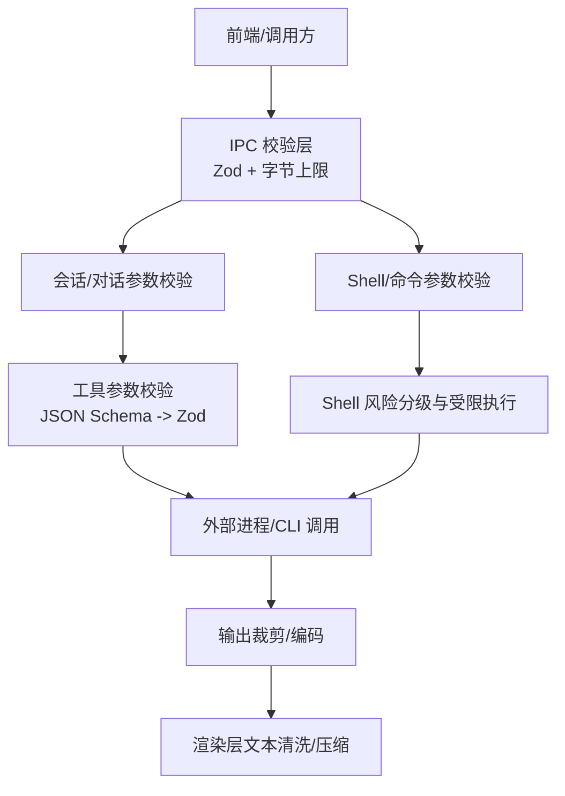
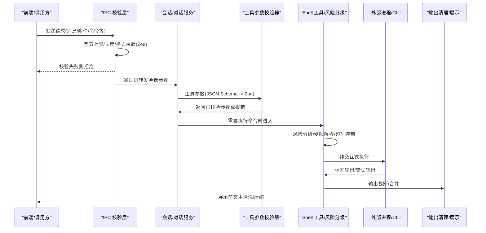
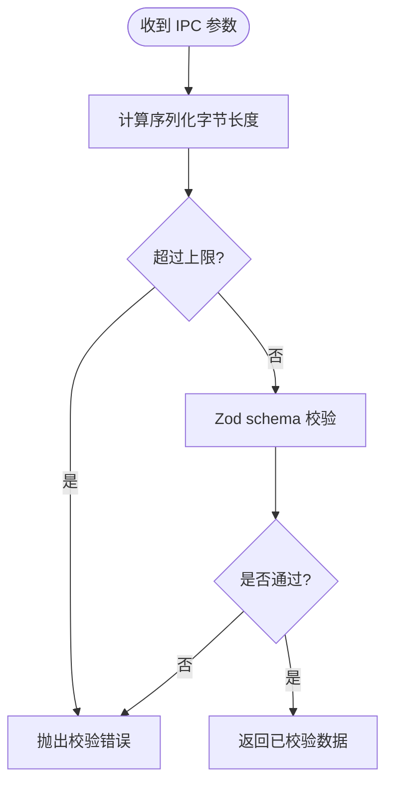
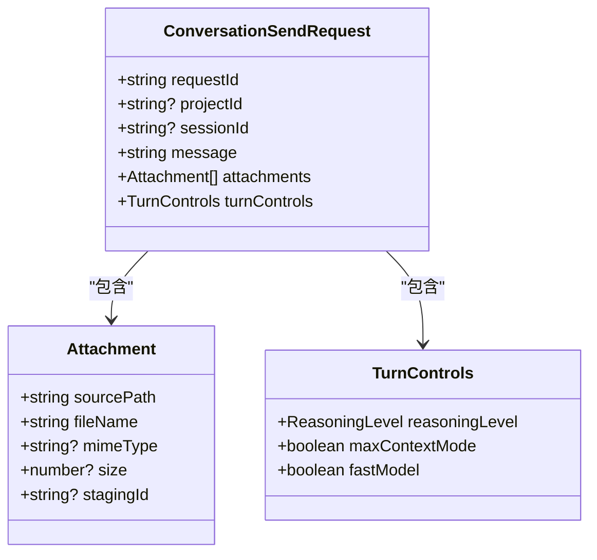
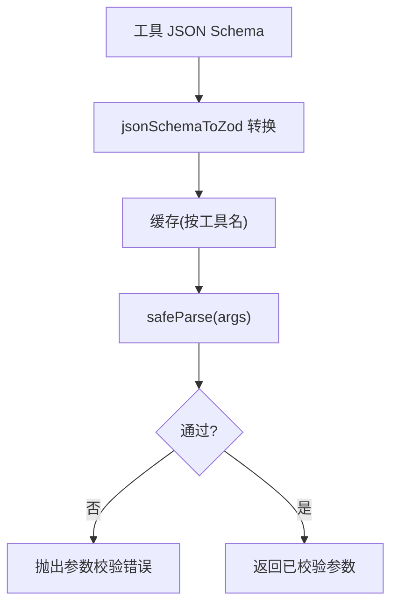
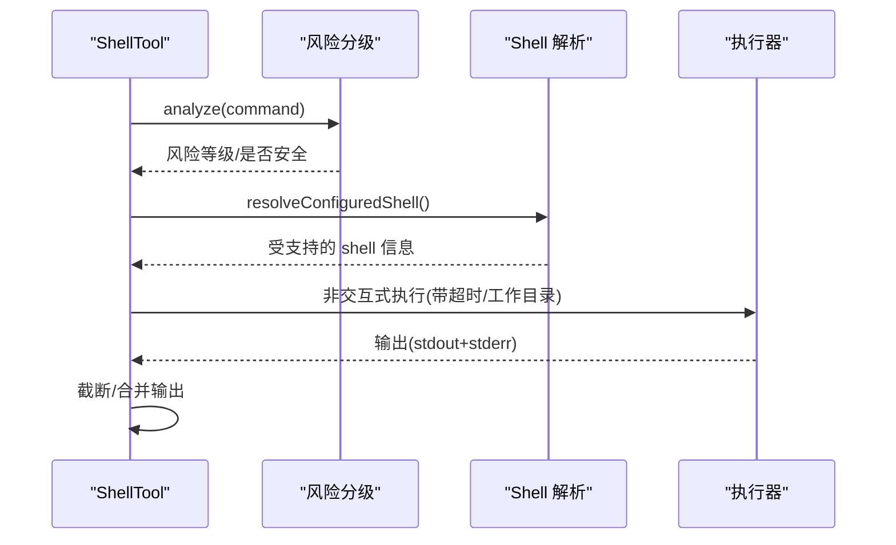
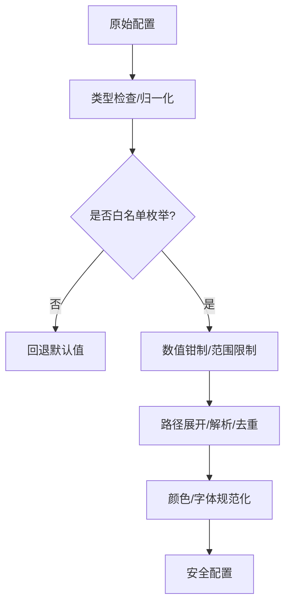
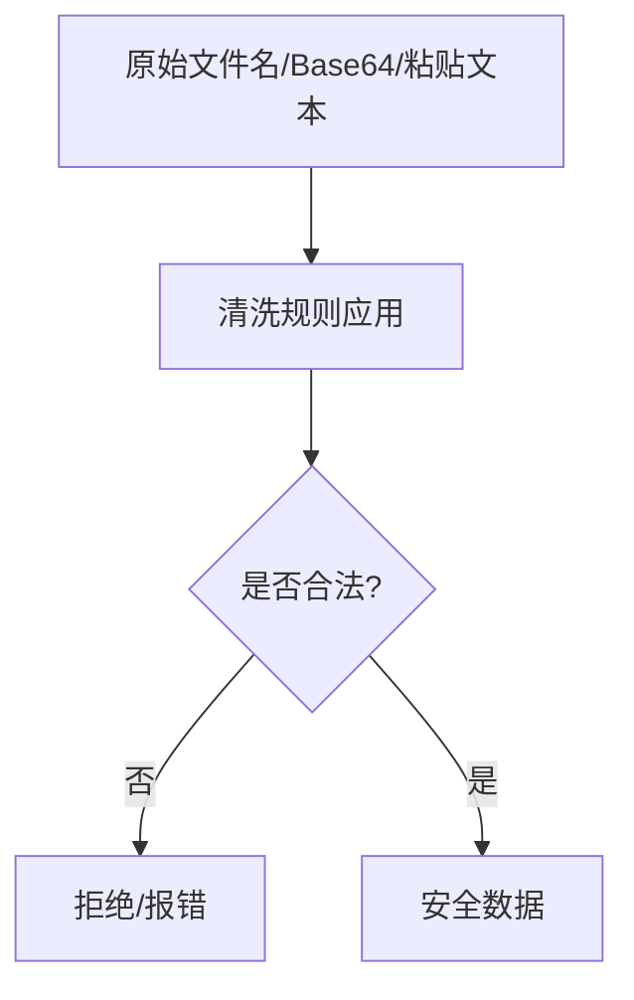
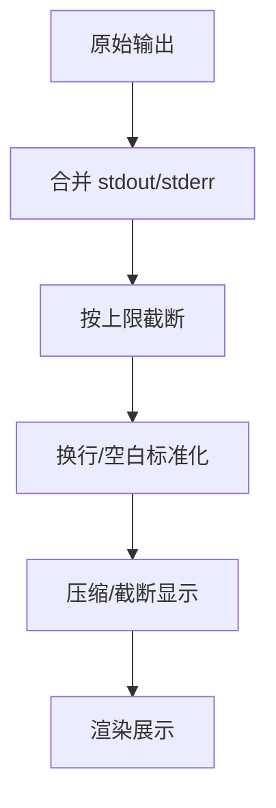
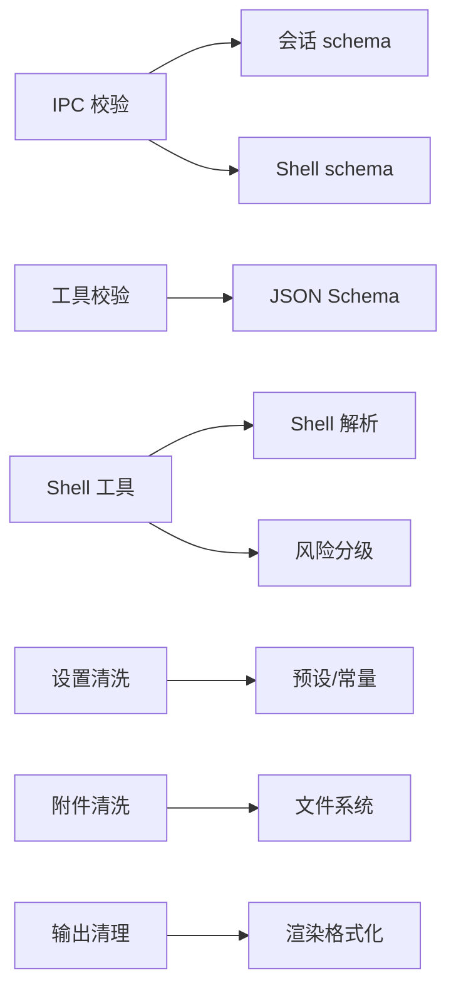

# 输入验证与输出清理

<cite>
**本文引用的文件**
- [src/main/ipc/validation/IpcPayloadGuard.ts](file://src/main/ipc/validation/IpcPayloadGuard.ts)
- [src/main/ipc/validation/conversationSchemas.ts](file://src/main/ipc/validation/conversationSchemas.ts)
- [src/main/ipc/validation/shellSchemas.ts](file://src/main/ipc/validation/shellSchemas.ts)
- [src/main/agent-runtime/validation/ToolSchemaValidator.ts](file://src/main/agent-runtime/validation/ToolSchemaValidator.ts)
- [src/main/agent-runtime/tools/primitives/ShellTool.ts](file://src/main/agent-runtime/tools/primitives/ShellTool.ts)
- [src/main/settings/settingsSanitize.ts](file://src/main/settings/settingsSanitize.ts)
- [src/shared/theme/sanitize.ts](file://src/shared/theme/sanitize.ts)
- [src/renderer/lib/contextMenuSanitize.ts](file://src/renderer/lib/contextMenuSanitize.ts)
- [src/main/conversation/AttachmentStagingService.ts](file://src/main/conversation/AttachmentStagingService.ts)
- [src/main/runtime/ShellResolver.ts](file://src/main/runtime/ShellResolver.ts)
- [src/main/agent-runtime/permissions/ShellCommandRiskAnalyzer.test.ts](file://src/main/agent-runtime/permissions/ShellCommandRiskAnalyzer.test.ts)
- [src/main/tools/RdcCliInvokerService.ts](file://src/main/tools/RdcCliInvokerService.ts)
- [src/renderer/features/transcript/workProcessFormat.ts](file://src/renderer/features/transcript/workProcessFormat.ts)
</cite>

## 目录
1. [简介](#简介)
2. [项目结构](#项目结构)
3. [核心组件](#核心组件)
4. [架构总览](#架构总览)
5. [详细组件分析](#详细组件分析)
6. [依赖关系分析](#依赖关系分析)
7. [性能考虑](#性能考虑)
8. [故障排查指南](#故障排查指南)
9. [结论](#结论)
10. [附录](#附录)

## 简介
本文件系统性梳理 RDC-Agent 的输入验证与输出清理机制，覆盖用户输入的类型校验、长度限制、白名单/黑名单策略，以及 XSS、SQL 注入、命令注入等常见攻击的防御思路。同时说明输出数据的裁剪、编码与过滤流程，并给出表单、API 参数、文件上传等场景的具体实现要点与最佳实践。

## 项目结构
RDC-Agent 在“入口边界”集中进行输入校验，在“工具执行层”进行安全加固，在“渲染/展示层”进行输出清理：
- IPC 边界：使用 Zod schema 与字节大小限制对入参做严格校验，统一错误码与失败关闭策略。
- 工具参数：将 JSON Schema 转换为运行时 Zod 校验器，缓存以提升性能。
- Shell/命令：通过风险分级、受限 shell 解析、超时与输出截断等手段降低命令注入风险。
- 设置与主题：对配置项进行类型归一化、范围钳制与枚举白名单校验。
- 附件与文本：文件名清洗、Base64 严格解码、粘贴文本规范化。
- 输出展示：文本压缩、换行标准化、超长内容截断，避免 UI 异常与潜在注入。

**图示来源**
- [src/main/ipc/validation/IpcPayloadGuard.ts:1-88](file://src/main/ipc/validation/IpcPayloadGuard.ts#L1-L88)
- [src/main/ipc/validation/conversationSchemas.ts:1-158](file://src/main/ipc/validation/conversationSchemas.ts#L1-L158)
- [src/main/ipc/validation/shellSchemas.ts:1-15](file://src/main/ipc/validation/shellSchemas.ts#L1-L15)
- [src/main/agent-runtime/validation/ToolSchemaValidator.ts:1-71](file://src/main/agent-runtime/validation/ToolSchemaValidator.ts#L1-L71)
- [src/main/agent-runtime/tools/primitives/ShellTool.ts:112-176](file://src/main/agent-runtime/tools/primitives/ShellTool.ts#L112-L176)
- [src/main/tools/RdcCliInvokerService.ts:320-366](file://src/main/tools/RdcCliInvokerService.ts#L320-L366)
- [src/renderer/features/transcript/workProcessFormat.ts:1-28](file://src/renderer/features/transcript/workProcessFormat.ts#L1-L28)

**章节来源**
- [src/main/ipc/validation/IpcPayloadGuard.ts:1-88](file://src/main/ipc/validation/IpcPayloadGuard.ts#L1-L88)
- [src/main/ipc/validation/conversationSchemas.ts:1-158](file://src/main/ipc/validation/conversationSchemas.ts#L1-L158)
- [src/main/ipc/validation/shellSchemas.ts:1-15](file://src/main/ipc/validation/shellSchemas.ts#L1-L15)
- [src/main/agent-runtime/validation/ToolSchemaValidator.ts:1-71](file://src/main/agent-runtime/validation/ToolSchemaValidator.ts#L1-L71)
- [src/main/agent-runtime/tools/primitives/ShellTool.ts:112-176](file://src/main/agent-runtime/tools/primitives/ShellTool.ts#L112-L176)
- [src/main/tools/RdcCliInvokerService.ts:320-366](file://src/main/tools/RdcCliInvokerService.ts#L320-L366)
- [src/renderer/features/transcript/workProcessFormat.ts:1-28](file://src/renderer/features/transcript/workProcessFormat.ts#L1-L28)

## 核心组件
- IPC 载荷守卫：统一的参数解析、字节上限、字符串/数组长度限制、ID 格式校验，失败关闭。
- 会话/对话参数模式：消息、附件、预览、分支切换等强约束 schema。
- 工具参数校验器：JSON Schema 到 Zod 的转换与缓存，确保工具调用参数安全。
- Shell 工具与风险分级：命令拆分、危险前缀匹配、受限 shell 解析、超时与输出截断。
- 设置与主题清洗：枚举白名单、数值钳制、路径展开与去重、颜色与字体规范化。
- 附件与文本清洗：文件名净化、严格 Base64 解码、粘贴文本规范化。
- 输出展示清洗：文本标准化、压缩与截断，避免 UI 溢出与潜在注入。

**章节来源**
- [src/main/ipc/validation/IpcPayloadGuard.ts:1-88](file://src/main/ipc/validation/IpcPayloadGuard.ts#L1-L88)
- [src/main/ipc/validation/conversationSchemas.ts:1-158](file://src/main/ipc/validation/conversationSchemas.ts#L1-L158)
- [src/main/agent-runtime/validation/ToolSchemaValidator.ts:1-71](file://src/main/agent-runtime/validation/ToolSchemaValidator.ts#L1-L71)
- [src/main/agent-runtime/tools/primitives/ShellTool.ts:112-176](file://src/main/agent-runtime/tools/primitives/ShellTool.ts#L112-L176)
- [src/main/settings/settingsSanitize.ts:1-278](file://src/main/settings/settingsSanitize.ts#L1-L278)
- [src/shared/theme/sanitize.ts:1-103](file://src/shared/theme/sanitize.ts#L1-L103)
- [src/renderer/lib/contextMenuSanitize.ts:1-33](file://src/renderer/lib/contextMenuSanitize.ts#L1-L33)
- [src/main/conversation/AttachmentStagingService.ts:43-70](file://src/main/conversation/AttachmentStagingService.ts#L43-L70)
- [src/renderer/features/transcript/workProcessFormat.ts:1-28](file://src/renderer/features/transcript/workProcessFormat.ts#L1-L28)

## 架构总览
下图展示了从前端到后端再到输出的完整输入验证与输出清理链路。

**图示来源**
- [src/main/ipc/validation/IpcPayloadGuard.ts:1-88](file://src/main/ipc/validation/IpcPayloadGuard.ts#L1-L88)
- [src/main/ipc/validation/conversationSchemas.ts:1-158](file://src/main/ipc/validation/conversationSchemas.ts#L1-L158)
- [src/main/agent-runtime/validation/ToolSchemaValidator.ts:1-71](file://src/main/agent-runtime/validation/ToolSchemaValidator.ts#L1-L71)
- [src/main/agent-runtime/tools/primitives/ShellTool.ts:112-176](file://src/main/agent-runtime/tools/primitives/ShellTool.ts#L112-L176)
- [src/main/tools/RdcCliInvokerService.ts:320-366](file://src/main/tools/RdcCliInvokerService.ts#L320-L366)
- [src/renderer/features/transcript/workProcessFormat.ts:1-28](file://src/renderer/features/transcript/workProcessFormat.ts#L1-L28)

## 详细组件分析

### IPC 载荷校验（类型、长度、ID 格式）
- 统一解析：提供 parseIpcArgs，结合 Zod schema 与字节上限，失败关闭。
- 长度限制：字符串最大长度、数组最大项数、整体 JSON 序列化字节上限。
- ID 规范：仅允许字母数字及少量分隔符，拒绝路径穿越字符。
- 适用场景：会话消息、附件、预览、分支切换、系统命令等所有 IPC 入口。

**图示来源**
- [src/main/ipc/validation/IpcPayloadGuard.ts:26-57](file://src/main/ipc/validation/IpcPayloadGuard.ts#L26-L57)
- [src/main/ipc/validation/IpcPayloadGuard.ts:67-87](file://src/main/ipc/validation/IpcPayloadGuard.ts#L67-L87)

**章节来源**
- [src/main/ipc/validation/IpcPayloadGuard.ts:1-88](file://src/main/ipc/validation/IpcPayloadGuard.ts#L1-L88)

### 会话与对话参数校验（表单/API 参数）
- 消息字段：限定最大长度，防止过大负载。
- 附件：限制数量与单项大小，支持路径与字节两种提交方式，严格校验 MIME 与 base64。
- 控制项：推理级别、上下文模式、快速模型等枚举/布尔值严格校验。
- 历史/分支：会话 ID、分支 ID 等采用严格 ID 格式。

**图示来源**
- [src/main/ipc/validation/conversationSchemas.ts:17-92](file://src/main/ipc/validation/conversationSchemas.ts#L17-L92)

**章节来源**
- [src/main/ipc/validation/conversationSchemas.ts:1-158](file://src/main/ipc/validation/conversationSchemas.ts#L1-L158)

### 工具参数校验（JSON Schema -> Zod）
- 动态转换：将工具声明的 JSON Schema 子集转换为 Zod schema，支持对象、字符串、数字、整数、布尔、数组、枚举与必填字段。
- 缓存优化：按工具名缓存 Zod schema，减少重复转换开销。
- 失败关闭：校验失败直接抛错，阻止非法参数进入执行层。

**图示来源**
- [src/main/agent-runtime/validation/ToolSchemaValidator.ts:8-49](file://src/main/agent-runtime/validation/ToolSchemaValidator.ts#L8-L49)
- [src/main/agent-runtime/validation/ToolSchemaValidator.ts:51-71](file://src/main/agent-runtime/validation/ToolSchemaValidator.ts#L51-L71)

**章节来源**
- [src/main/agent-runtime/validation/ToolSchemaValidator.ts:1-71](file://src/main/agent-runtime/validation/ToolSchemaValidator.ts#L1-L71)

### Shell 与命令执行防护（命令注入防护）
- 风险分级：拆分管道/链式命令，提取命令基名，匹配危险前缀（如 curl|bash、PowerShell iex），标记高风险。
- 受限 Shell：仅允许安全的 POSIX 或 Windows PowerShell 变体，拒绝不支持的交互型 shell。
- 执行隔离：非交互式执行、工作目录固定、超时限制、临时脚本隔离（POSIX）。
- 输出保护：合并 stdout/stderr，按上限截断，记录是否被截断。

**图示来源**
- [src/main/agent-runtime/tools/primitives/ShellTool.ts:112-176](file://src/main/agent-runtime/tools/primitives/ShellTool.ts#L112-L176)
- [src/main/runtime/ShellResolver.ts:1-287](file://src/main/runtime/ShellResolver.ts#L1-L287)
- [src/main/agent-runtime/permissions/ShellCommandRiskAnalyzer.test.ts:1-51](file://src/main/agent-runtime/permissions/ShellCommandRiskAnalyzer.test.ts#L1-L51)

**章节来源**
- [src/main/agent-runtime/tools/primitives/ShellTool.ts:112-176](file://src/main/agent-runtime/tools/primitives/ShellTool.ts#L112-L176)
- [src/main/runtime/ShellResolver.ts:1-287](file://src/main/runtime/ShellResolver.ts#L1-L287)
- [src/main/agent-runtime/permissions/ShellCommandRiskAnalyzer.test.ts:1-51](file://src/main/agent-runtime/permissions/ShellCommandRiskAnalyzer.test.ts#L1-L51)

### 设置与主题清洗（配置安全）
- 枚举白名单：权限模式、JSON 模式、减少动效等仅接受预定义值。
- 数值钳制：窗口尺寸、终端高度、对比度等限制在合理区间。
- 路径处理：展开 home 路径、绝对路径解析、去重与空值过滤。
- 颜色/字体：十六进制颜色规范化、字体名称修剪与回退。

**图示来源**
- [src/main/settings/settingsSanitize.ts:42-278](file://src/main/settings/settingsSanitize.ts#L42-L278)
- [src/shared/theme/sanitize.ts:16-103](file://src/shared/theme/sanitize.ts#L16-L103)

**章节来源**
- [src/main/settings/settingsSanitize.ts:1-278](file://src/main/settings/settingsSanitize.ts#L1-L278)
- [src/shared/theme/sanitize.ts:1-103](file://src/shared/theme/sanitize.ts#L1-L103)

### 附件与文本清洗（XSS/恶意文件名防护）
- 文件名清洗：去除末尾点空格、过滤控制字符与危险符号、拒绝保留名与空名、限制长度。
- Base64 严格解码：去除空白、正则校验、二次编解码一致性校验，拒绝畸形数据。
- 粘贴文本清洗：移除零宽字符、替换不间断空格、智能引号与全角标点规范化，降低富文本注入风险。

**图示来源**
- [src/main/conversation/AttachmentStagingService.ts:43-70](file://src/main/conversation/AttachmentStagingService.ts#L43-L70)
- [src/renderer/lib/contextMenuSanitize.ts:1-33](file://src/renderer/lib/contextMenuSanitize.ts#L1-L33)

**章节来源**
- [src/main/conversation/AttachmentStagingService.ts:43-70](file://src/main/conversation/AttachmentStagingService.ts#L43-L70)
- [src/renderer/lib/contextMenuSanitize.ts:1-33](file://src/renderer/lib/contextMenuSanitize.ts#L1-L33)

### 输出清理与展示（输出编码/过滤）
- 文本标准化：统一换行、压缩多余空白、行尾修剪。
- 长度控制：短文本压缩显示，避免过长内容破坏布局。
- 工具输出：合并标准输出与错误输出，按上限截断，记录截断状态。

**图示来源**
- [src/main/agent-runtime/tools/primitives/ShellTool.ts:245-307](file://src/main/agent-runtime/tools/primitives/ShellTool.ts#L245-L307)
- [src/renderer/features/transcript/workProcessFormat.ts:1-28](file://src/renderer/features/transcript/workProcessFormat.ts#L1-L28)

**章节来源**
- [src/main/agent-runtime/tools/primitives/ShellTool.ts:245-307](file://src/main/agent-runtime/tools/primitives/ShellTool.ts#L245-L307)
- [src/renderer/features/transcript/workProcessFormat.ts:1-28](file://src/renderer/features/transcript/workProcessFormat.ts#L1-L28)

## 依赖关系分析
- IPC 校验依赖 Zod 与共享常量；会话/对话 schema 依赖材料上下文类型。
- 工具参数校验依赖 JSON Schema 描述与 Zod 转换逻辑。
- Shell 工具依赖 ShellResolver 与风险分级模块，最终调用外部 CLI。
- 设置/主题清洗依赖共享常量与预设。
- 附件/文本清洗依赖文件系统与正则表达式。
- 输出清理依赖工具执行结果与渲染层格式化。

**图示来源**
- [src/main/ipc/validation/IpcPayloadGuard.ts:1-88](file://src/main/ipc/validation/IpcPayloadGuard.ts#L1-L88)
- [src/main/ipc/validation/conversationSchemas.ts:1-158](file://src/main/ipc/validation/conversationSchemas.ts#L1-L158)
- [src/main/ipc/validation/shellSchemas.ts:1-15](file://src/main/ipc/validation/shellSchemas.ts#L1-L15)
- [src/main/agent-runtime/validation/ToolSchemaValidator.ts:1-71](file://src/main/agent-runtime/validation/ToolSchemaValidator.ts#L1-L71)
- [src/main/agent-runtime/tools/primitives/ShellTool.ts:112-176](file://src/main/agent-runtime/tools/primitives/ShellTool.ts#L112-L176)
- [src/main/runtime/ShellResolver.ts:1-287](file://src/main/runtime/ShellResolver.ts#L1-L287)
- [src/main/settings/settingsSanitize.ts:1-278](file://src/main/settings/settingsSanitize.ts#L1-L278)
- [src/shared/theme/sanitize.ts:1-103](file://src/shared/theme/sanitize.ts#L1-L103)
- [src/main/conversation/AttachmentStagingService.ts:43-70](file://src/main/conversation/AttachmentStagingService.ts#L43-L70)
- [src/renderer/features/transcript/workProcessFormat.ts:1-28](file://src/renderer/features/transcript/workProcessFormat.ts#L1-L28)

**章节来源**
- [src/main/ipc/validation/IpcPayloadGuard.ts:1-88](file://src/main/ipc/validation/IpcPayloadGuard.ts#L1-L88)
- [src/main/ipc/validation/conversationSchemas.ts:1-158](file://src/main/ipc/validation/conversationSchemas.ts#L1-L158)
- [src/main/ipc/validation/shellSchemas.ts:1-15](file://src/main/ipc/validation/shellSchemas.ts#L1-L15)
- [src/main/agent-runtime/validation/ToolSchemaValidator.ts:1-71](file://src/main/agent-runtime/validation/ToolSchemaValidator.ts#L1-L71)
- [src/main/agent-runtime/tools/primitives/ShellTool.ts:112-176](file://src/main/agent-runtime/tools/primitives/ShellTool.ts#L112-L176)
- [src/main/runtime/ShellResolver.ts:1-287](file://src/main/runtime/ShellResolver.ts#L1-L287)
- [src/main/settings/settingsSanitize.ts:1-278](file://src/main/settings/settingsSanitize.ts#L1-L278)
- [src/shared/theme/sanitize.ts:1-103](file://src/shared/theme/sanitize.ts#L1-L103)
- [src/main/conversation/AttachmentStagingService.ts:43-70](file://src/main/conversation/AttachmentStagingService.ts#L43-L70)
- [src/renderer/features/transcript/workProcessFormat.ts:1-28](file://src/renderer/features/transcript/workProcessFormat.ts#L1-L28)

## 性能考虑
- 校验缓存：工具参数 Zod schema 按工具名缓存，避免重复转换。
- 字节上限：IPC 载荷在解析前先估算序列化字节，快速拒绝超大负载。
- 输出截断：Shell 输出按上限截断，避免内存占用与渲染卡顿。
- 枚举/范围：设置项通过枚举与范围钳制减少后续分支判断成本。

[本节为通用指导，不直接分析具体文件]

## 故障排查指南
- IPC 校验失败：检查参数类型、长度、ID 格式是否符合 schema；关注字节上限与数组项数限制。
- 工具参数错误：核对 JSON Schema 中 required/enum/类型定义；查看工具名对应的缓存 schema。
- Shell 执行失败：确认 shell 可用性与版本；检查命令是否触发风险分级；查看超时与退出码。
- 附件无效：检查文件名是否包含危险字符或被拒绝；确认 base64 是否严格有效。
- 输出异常：检查输出是否被截断；确认文本标准化与压缩逻辑。

**章节来源**
- [src/main/ipc/validation/IpcPayloadGuard.ts:1-88](file://src/main/ipc/validation/IpcPayloadGuard.ts#L1-L88)
- [src/main/agent-runtime/validation/ToolSchemaValidator.ts:1-71](file://src/main/agent-runtime/validation/ToolSchemaValidator.ts#L1-L71)
- [src/main/agent-runtime/tools/primitives/ShellTool.ts:112-176](file://src/main/agent-runtime/tools/primitives/ShellTool.ts#L112-L176)
- [src/main/conversation/AttachmentStagingService.ts:43-70](file://src/main/conversation/AttachmentStagingService.ts#L43-L70)
- [src/main/tools/RdcCliInvokerService.ts:320-366](file://src/main/tools/RdcCliInvokerService.ts#L320-L366)

## 结论
RDC-Agent 通过“边界强校验 + 执行层加固 + 输出端清理”的分层策略，全面覆盖类型、长度、枚举、路径与命令安全风险。IPC 层以 Zod 与字节上限保障入参安全；工具与 Shell 层通过风险分级、受限解析与超时截断降低命令注入；设置与主题清洗确保配置安全；附件与文本清洗抵御文件名与富文本注入；输出清理保证展示稳定与安全。建议持续完善 schema 覆盖、强化风险规则与增加自动化测试用例，以应对新威胁。

## 附录
- 表单验证建议：在前端与后端均进行 schema 校验；对敏感字段进行最小必要暴露。
- API 参数验证：统一使用 parseIpcArgs；对 ID、路径、MIME、base64 等字段实施严格规则。
- 文件上传验证：文件名清洗、扩展名白名单、大小限制、内容类型校验、二次解码一致性检查。
- 常见漏洞修复：
  - XSS：输出前进行文本标准化与转义；避免直接插入 HTML。
  - SQL 注入：不在 Agent 侧拼接 SQL；如需数据库操作，使用参数化查询与只读权限。
  - 命令注入：限制 shell 种类、禁用危险命令前缀、使用非交互式执行与超时控制。

[本节为通用指导，不直接分析具体文件]