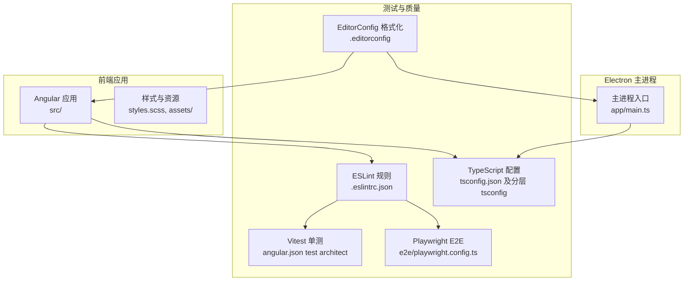
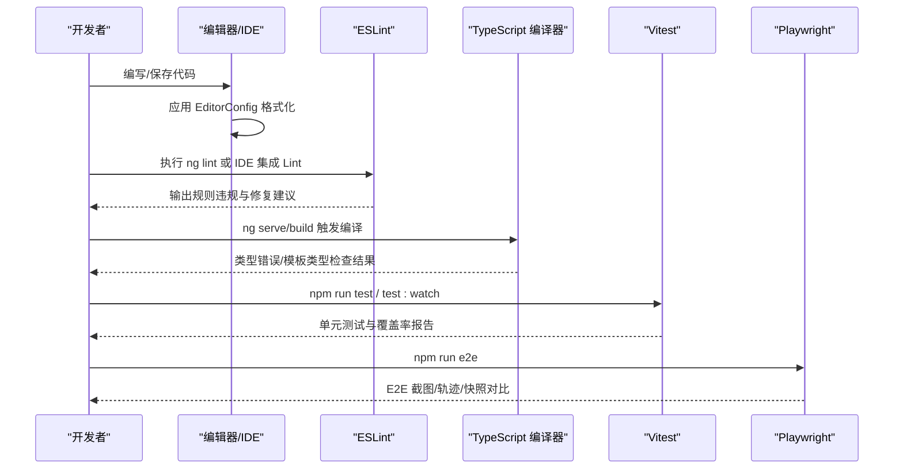
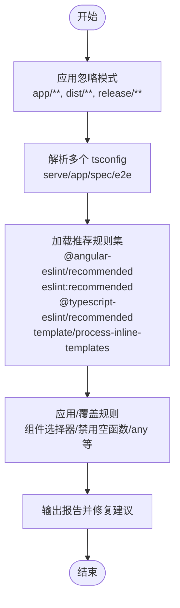
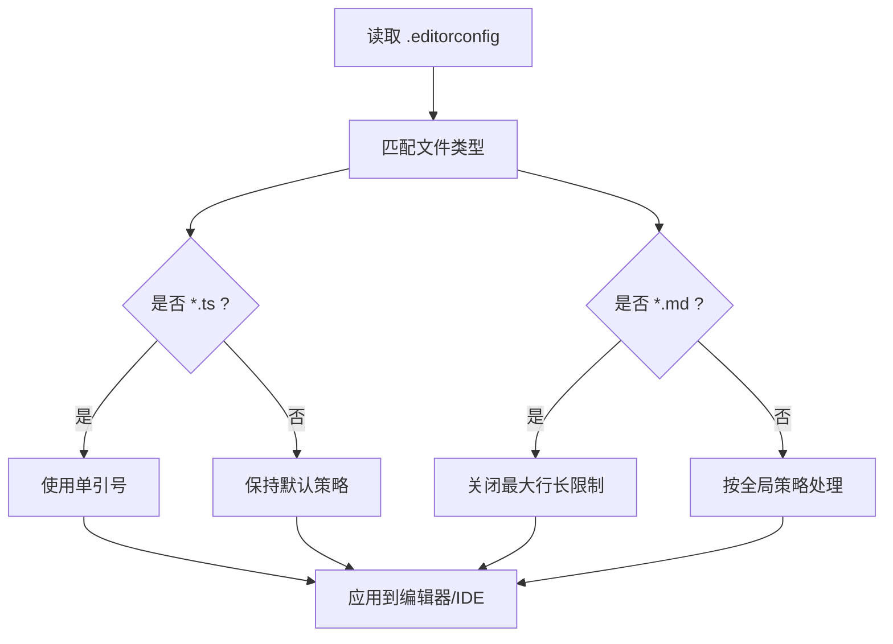
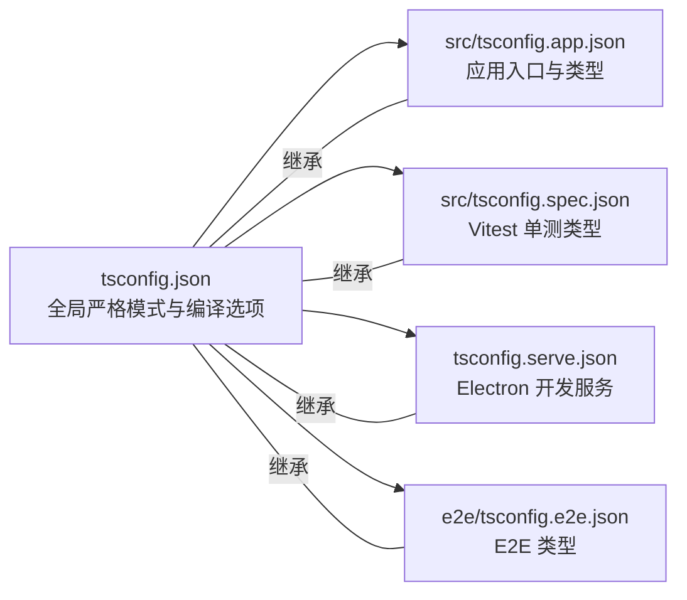
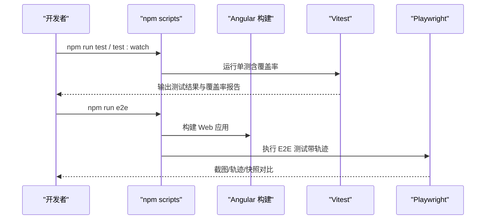
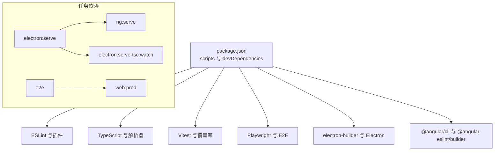

# 开发工具与质量保证

<cite>
**本文引用的文件**
- [.eslintrc.json](file://.eslintrc.json)
- [.editorconfig](file://.editorconfig)
- [tsconfig.json](file://tsconfig.json)
- [src/tsconfig.app.json](file://src/tsconfig.app.json)
- [src/tsconfig.spec.json](file://src/tsconfig.spec.json)
- [tsconfig.serve.json](file://tsconfig.serve.json)
- [e2e/tsconfig.e2e.json](file://e2e/tsconfig.e2e.json)
- [angular.json](file://angular.json)
- [package.json](file://package.json)
- [CODE_OF_CONDUCT.md](file://CODE_OF_CONDUCT.md)
- [e2e/playwright.config.ts](file://e2e/playwright.config.ts)
</cite>

## 目录
1. [简介](#简介)
2. [项目结构](#项目结构)
3. [核心组件](#核心组件)
4. [架构总览](#架构总览)
5. [详细组件分析](#详细组件分析)
6. [依赖分析](#依赖分析)
7. [性能考虑](#性能考虑)
8. [故障排查指南](#故障排查指南)
9. [结论](#结论)
10. [附录](#附录)

## 简介
本文件系统性梳理本项目的开发工具链与质量保证机制，覆盖以下方面：
- ESLint 配置与规则策略：包括插件扩展、类型检查启用、忽略模式、自定义规则与团队规范落地方式
- EditorConfig 统一格式化：缩进、字符集、换行、空白处理等
- TypeScript 类型检查：严格模式、编译器选项、模板类型检查、多 tsconfig 分层配置
- 测试与端到端（E2E）：Vitest 单测、Playwright E2E、覆盖率与报告
- 代码审查与贡献者行为准则：PR 模板、审查流程与社区规范
- 开发环境与 IDE 建议：脚本命令、调试工具、工作流
- 质量度量与持续改进：覆盖率、Lint 报告、CI 可集成点

## 项目结构
本项目采用 Angular + Electron 架构，配合 TypeScript、ESLint、EditorConfig、Vitest 与 Playwright，形成从开发到构建、测试、打包的一体化质量保障体系。

图示来源
- [angular.json:104-137](file://angular.json#L104-L137)
- [.eslintrc.json:1-60](file://.eslintrc.json#L1-L60)
- [.editorconfig:1-17](file://.editorconfig#L1-L17)
- [tsconfig.json:1-34](file://tsconfig.json#L1-L34)
- [src/tsconfig.app.json:1-25](file://src/tsconfig.app.json#L1-L25)
- [src/tsconfig.spec.json:1-21](file://src/tsconfig.spec.json#L1-L21)
- [tsconfig.serve.json:1-28](file://tsconfig.serve.json#L1-L28)
- [e2e/tsconfig.e2e.json:1-14](file://e2e/tsconfig.e2e.json#L1-L14)
- [e2e/playwright.config.ts:1-21](file://e2e/playwright.config.ts#L1-L21)

章节来源
- [angular.json:1-188](file://angular.json#L1-L188)
- [package.json:1-108](file://package.json#L1-L108)

## 核心组件
- ESLint 与 Angular/TypeScript 插件：通过 overrides 对 TS 与 HTML 文件分别应用推荐规则集，并启用类型感知规则；同时对部分规则进行降级或关闭以平衡团队规范与开发效率。
- EditorConfig：统一缩进风格、字符集、换行与尾随空白处理，确保跨编辑器一致性。
- TypeScript 编译配置：全局 strict 与 Angular 编译器严格模板选项；多 tsconfig 分层管理应用、单测、E2E 与 Electron 开发服务场景。
- 测试与 E2E：Vitest 作为单元测试运行器，结合覆盖率与 HTML 报告；Playwright 用于端到端测试，支持慢动作与快照阈值配置。
- 行为准则：采用 Contributor Covenant v2.0，明确正向行为标准、执行流程与联系方式。

章节来源
- [.eslintrc.json:1-60](file://.eslintrc.json#L1-L60)
- [.editorconfig:1-17](file://.editorconfig#L1-L17)
- [tsconfig.json:1-34](file://tsconfig.json#L1-L34)
- [angular.json:104-137](file://angular.json#L104-L137)
- [e2e/playwright.config.ts:1-21](file://e2e/playwright.config.ts#L1-L21)
- [CODE_OF_CONDUCT.md:1-129](file://CODE_OF_CONDUCT.md#L1-L129)

## 架构总览
下图展示从开发到质量保障的关键路径：编辑器读取 EditorConfig 进行格式化；Angular CLI/Lint 触发 ESLint；TypeScript 编译器依据多份 tsconfig 进行类型检查；Vitest/Playwright 执行测试并生成报告。

图示来源
- [angular.json:129-137](file://angular.json#L129-L137)
- [.eslintrc.json:8-58](file://.eslintrc.json#L8-L58)
- [tsconfig.json:1-34](file://tsconfig.json#L1-L34)
- [src/tsconfig.app.json:1-25](file://src/tsconfig.app.json#L1-L25)
- [src/tsconfig.spec.json:1-21](file://src/tsconfig.spec.json#L1-L21)
- [e2e/playwright.config.ts:1-21](file://e2e/playwright.config.ts#L1-L21)

## 详细组件分析

### ESLint 配置与规则策略
- 忽略模式：根目录忽略 app/**、dist/**、release/**，避免对已构建产物与 NodeJS 文件进行重复检查。
- 多 tsconfig 解析：为 serve、app、spec、e2e 各自提供 tsconfig，确保类型检查在不同上下文下准确。
- 推荐规则集：
  - Angular 官方推荐：提升组件/指令一致性与可维护性
  - ESLint 原生推荐：基础语法与最佳实践
  - TypeScript ESLint 推荐与“需要类型”的推荐：强化类型安全
  - Angular 模板内联处理：对内联模板进行额外处理
- 关键规则调整：
  - 空函数、any 使用、不安全赋值/调用/成员访问等规则降级或关闭，便于渐进式迁移与团队协作
  - 组件选择器强制使用 kebab-case 并以 app 前缀命名，HTML 模板使用官方推荐规则
  - JS 文档注释换行规则关闭，减少对文档风格的强制约束
- 团队规范落地：
  - 通过 overrides 将规则与文件类型解耦，便于后续扩展
  - 在 CI 中统一执行 ng lint，确保提交前质量门槛一致

图示来源
- [.eslintrc.json:1-60](file://.eslintrc.json#L1-L60)

章节来源
- [.eslintrc.json:1-60](file://.eslintrc.json#L1-L60)
- [angular.json:129-137](file://angular.json#L129-L137)

### EditorConfig 统一格式化
- 全局设置：
  - 字符集：UTF-8
  - 缩进：空格，大小为 2
  - 末尾换行：开启
  - 尾随空白：清理
- 语言特定：
  - *.ts：单引号
  - *.md：关闭最大行长限制，保留尾随空白（便于 Markdown 编辑体验）

图示来源
- [.editorconfig:1-17](file://.editorconfig#L1-L17)

章节来源
- [.editorconfig:1-17](file://.editorconfig#L1-L17)

### TypeScript 类型检查与配置
- 全局严格模式：启用严格类型检查，提升代码健壮性
- 编译器选项要点：
  - 模块与目标：ES2022，模块解析使用 bundler
  - 装饰器与元数据：启用实验性装饰器与元数据发射
  - 源映射与声明：开启 sourceMap，关闭 declaration 以便开发期快速迭代
  - 目标库：包含 DOM 与 ES2015+ 能力
- Angular 编译器严格模板：
  - 严格模板、完整模板类型检查、注入参数严格校验
  - 保留空白与元数据发射，便于调试与生产构建
- 分层 tsconfig：
  - app：应用入口与类型，排除 spec/test/vitest 相关文件
  - spec：Vitest 类型与 polyfill，包含 spec 文件
  - serve：Electron 开发服务 commonjs 目标与 node 类型
  - e2e：E2E commonjs 目标与 node 类型

图示来源
- [tsconfig.json:1-34](file://tsconfig.json#L1-L34)
- [src/tsconfig.app.json:1-25](file://src/tsconfig.app.json#L1-L25)
- [src/tsconfig.spec.json:1-21](file://src/tsconfig.spec.json#L1-L21)
- [tsconfig.serve.json:1-28](file://tsconfig.serve.json#L1-L28)
- [e2e/tsconfig.e2e.json:1-14](file://e2e/tsconfig.e2e.json#L1-L14)

章节来源
- [tsconfig.json:1-34](file://tsconfig.json#L1-L34)
- [src/tsconfig.app.json:1-25](file://src/tsconfig.app.json#L1-L25)
- [src/tsconfig.spec.json:1-21](file://src/tsconfig.spec.json#L1-L21)
- [tsconfig.serve.json:1-28](file://tsconfig.serve.json#L1-L28)
- [e2e/tsconfig.e2e.json:1-14](file://e2e/tsconfig.e2e.json#L1-L14)

### 测试与端到端（E2E）
- 单元测试（Vitest）：
  - 运行器：vitest
  - 构建目标：testing 配置，启用 polyfills 与 zone.js/testing
  - 覆盖率：开启，报告器包含 html 与 lcovonly
  - 报告：默认总结与 HTML 报告输出至 test-results/vitest/index.html
- 端到端（Playwright）：
  - 超时：45 秒
  - 输出：截图目录 screenshots
  - 运行参数：headless=false、viewport 1280x720、slowMo 1000ms
  - 快照：toMatchSnapshot 阈值 0.2
  - 命令：npm run e2e，先构建 Web 再执行测试

图示来源
- [angular.json:104-127](file://angular.json#L104-L127)
- [e2e/playwright.config.ts:1-21](file://e2e/playwright.config.ts#L1-L21)
- [package.json:42-46](file://package.json#L42-L46)

章节来源
- [angular.json:104-127](file://angular.json#L104-L127)
- [e2e/playwright.config.ts:1-21](file://e2e/playwright.config.ts#L1-L21)
- [package.json:42-46](file://package.json#L42-L46)

### 代码审查流程与贡献者行为准则
- 行为准则：
  - 采用 Contributor Covenant v2.0，明确正向行为与不可接受行为
  - 明确执行职责、适用范围与举报渠道（邮箱）
  - 提供影响等级与相应后果（纠正、警告、临时封禁、永久封禁）
- 代码审查建议（基于仓库现状的通用实践）：
  - PR 必须通过 ng lint 与单测
  - E2E 通过后方可合并
  - 至少一名维护者批准
  - 保持小步提交与清晰变更说明

章节来源
- [CODE_OF_CONDUCT.md:1-129](file://CODE_OF_CONDUCT.md#L1-L129)

### 开发环境配置与 IDE 建议
- Node/TypeScript 版本要求：满足 engines 字段
- 常用脚本：
  - 启动开发：同时启动 Angular 与 Electron 开发服务
  - 构建：Web 产物与 Electron 打包
  - 测试：单测与 E2E
  - Lint：统一执行 ng lint
- IDE 建议：
  - 安装 ESLint 与 Angular/TypeScript 支持插件
  - 启用 EditorConfig 插件，确保自动应用缩进与空白策略
  - 使用内置终端执行 npm 脚本，避免环境差异

章节来源
- [package.json:27-47](file://package.json#L27-L47)
- [.editorconfig:1-17](file://.editorconfig#L1-L17)
- [.eslintrc.json:1-60](file://.eslintrc.json#L1-L60)

## 依赖分析
- 工具链依赖：
  - Angular CLI 与 @angular-eslint/builder：提供 lint 架构与推荐规则
  - TypeScript 与 @typescript-eslint/*：提供类型感知规则与解析
  - Vitest 与 @vitest/*：提供单元测试与覆盖率
  - Playwright 与 @playwright/test：提供 E2E 测试与截图/轨迹
  - Electron 与 electron-builder：提供桌面应用打包与分发
- 脚本与任务耦合：
  - electron:serve 依赖 ng serve 与 tsc watch
  - e2e 依赖 web:prod 构建
  - test 依赖 testing 配置与覆盖率报告

图示来源
- [package.json:62-95](file://package.json#L62-L95)
- [package.json:27-47](file://package.json#L27-L47)
- [angular.json:129-137](file://angular.json#L129-L137)

章节来源
- [package.json:62-95](file://package.json#L62-L95)
- [package.json:27-47](file://package.json#L27-L47)
- [angular.json:129-137](file://angular.json#L129-L137)

## 性能考虑
- Lint 性能：
  - 多 tsconfig 解析会增加开销，建议在 CI 中缓存依赖与使用增量检查
  - 对于大型项目，可考虑拆分 lint 任务并行执行
- 编译性能：
  - 严格模式与模板类型检查会增加编译时间，可在本地开发时适度放宽（如仅在 CI 强制）
  - Electron serve 使用 commonjs 与较小 lib 集，缩短编译路径
- 测试性能：
  - Vitest 默认并发运行，合理组织测试文件与依赖可减少重跑
  - Playwright headless=false 与 slowMo 仅用于调试，CI 中应设为 headless 并缩短等待
- 资源与网络：
  - electron-builder 与依赖版本需关注安全更新，定期升级以降低风险

## 故障排查指南
- ESLint 报错与规则冲突
  - 检查 overrides 是否正确匹配文件类型
  - 确认 project 路径指向有效的 tsconfig
  - 逐步启用被降级的规则，观察影响范围
- TypeScript 编译失败
  - 核对各 tsconfig 的 include/exclude 是否覆盖到目标文件
  - 检查 Angular 编译器选项（严格模板、注入参数等）是否导致报错
  - 在 serve 模式下确认 Electron 主进程 tsconfig 与 lib 配置
- 单测/覆盖率异常
  - 确认 Vitest 报告器与输出目录权限
  - 检查 testing 配置中的 polyfills 与浏览器列表
- E2E 失败
  - 检查 Playwright 配置（超时、视口、慢动作）
  - 确保先完成 web:prod 构建再执行 e2e
  - 使用 show-trace 查看交互轨迹定位问题

章节来源
- [.eslintrc.json:8-58](file://.eslintrc.json#L8-L58)
- [tsconfig.json:23-32](file://tsconfig.json#L23-L32)
- [tsconfig.serve.json:1-28](file://tsconfig.serve.json#L1-L28)
- [angular.json:104-127](file://angular.json#L104-L127)
- [e2e/playwright.config.ts:1-21](file://e2e/playwright.config.ts#L1-L21)

## 结论
本项目通过 ESLint、EditorConfig、TypeScript 多层配置与 Vitest/Playwright 测试体系，构建了从开发到交付的闭环质量保障。建议在现有基础上：
- 在 CI 中固定 ESLint 与 TypeScript 版本，确保一致性
- 逐步收紧被降级的规则，提升长期可维护性
- 优化 E2E 与单测的并行与缓存策略，缩短反馈周期
- 将覆盖率与快照阈值纳入 CI 合并策略，提升质量门槛

## 附录
- 贡献者行为准则：参见 [CODE_OF_CONDUCT.md:1-129](file://CODE_OF_CONDUCT.md#L1-L129)
- Lint 与测试脚本：参见 [package.json:27-47](file://package.json#L27-L47)
- Angular 架构与测试配置：参见 [angular.json:104-137](file://angular.json#L104-L137)