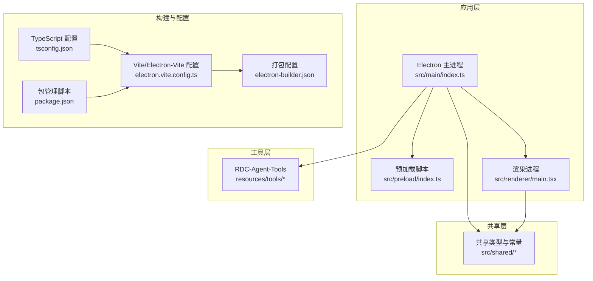
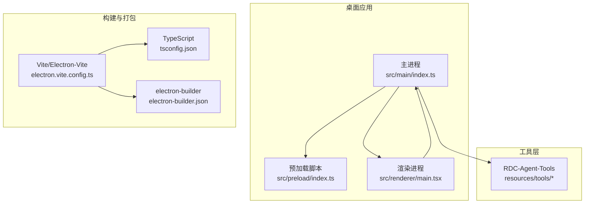
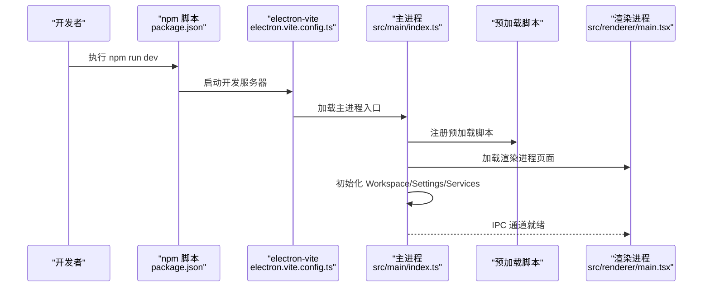
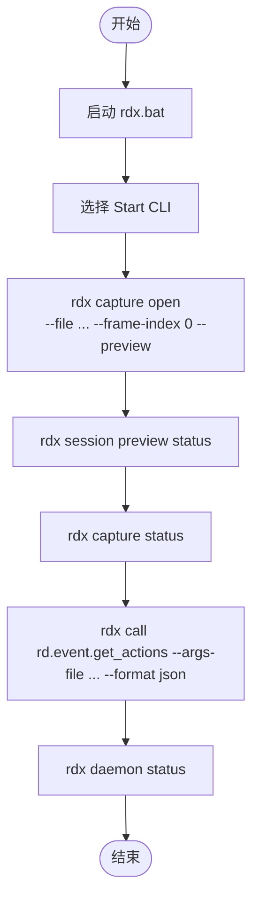
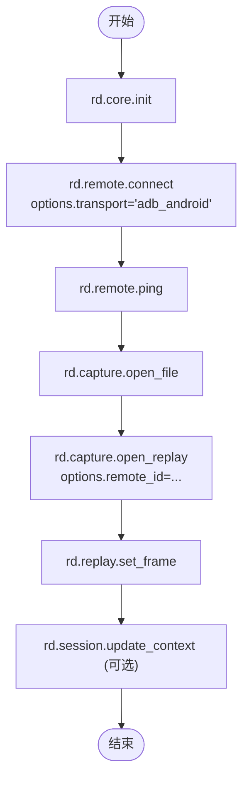
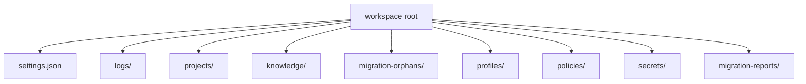
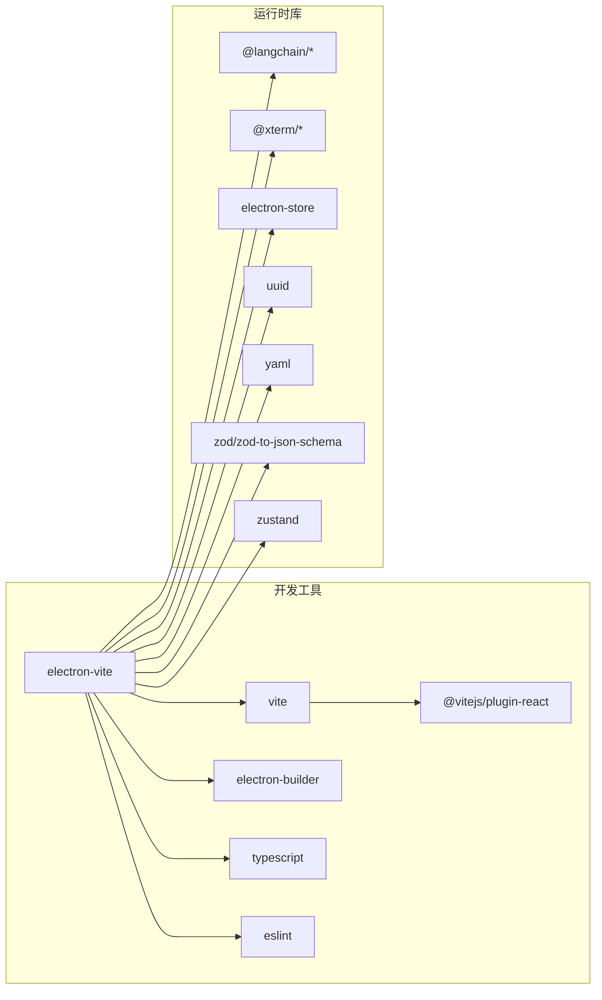

# 快速开始

<cite>
**本文引用的文件**
- [README.md](file://README.md)
- [package.json](file://package.json)
- [electron.vite.config.ts](file://electron.vite.config.ts)
- [tsconfig.json](file://tsconfig.json)
- [electron-builder.json](file://electron-builder.json)
- [src/main/index.ts](file://src/main/index.ts)
- [src/renderer/main.tsx](file://src/renderer/main.tsx)
- [resources/tools/README.md](file://resources/tools/README.md)
- [resources/tools/docs/quickstart.md](file://resources/tools/docs/quickstart.md)
- [scripts/start-rdc-agent.cmd](file://scripts/start-rdc-agent.cmd)
- [docs/README.md](file://docs/README.md)
- [docs/product/vertical-debugger-overview.md](file://docs/product/vertical-debugger-overview.md)
</cite>

## 目录
1. [简介](#简介)
2. [项目结构](#项目结构)
3. [核心组件](#核心组件)
4. [架构总览](#架构总览)
5. [详细组件分析](#详细组件分析)
6. [依赖分析](#依赖分析)
7. [性能考虑](#性能考虑)
8. [故障排查指南](#故障排查指南)
9. [结论](#结论)
10. [附录](#附录)

## 简介
RDC-Agent 是一个面向 RenderDoc .rdc capture 的 Electron 桌面应用，使用 Electron + React + TypeScript 构建。其产品目标是把自然协作式对话入口与严格的垂直调试主链放在同一个工作台中，使 Debugger 模式以可审计、可回放的方式执行 RenderDoc 调试流程。

- 当前能力概览
  - 管理本地项目，并约定 <project-root>/.resource/inputs/ 作为 .rdc 输入目录
  - 在工作台内浏览、导入、打开和切换 capture
  - 维护 workspace root，统一承载设置、日志和应用级运行数据
  - 配置 provider/model/agent route，并把真实 LLM 路由视为 Debugger 主链的一部分
  - 执行 Plan/Intake -> 用户批准 -> execution loop -> verification/skeptic/curator -> report 主链
  - 展示会话、运行状态、证据链、报告和中间产物

- 仓库结构
  - src/main：Electron 主进程，负责窗口、菜单、IPC、工作流编排和外部能力接入
  - src/preload：向渲染层暴露受控 API
  - src/renderer：界面、交互、状态展示和用户入口
  - src/shared：跨层共享的常量、类型与工具函数
  - docs：产品、架构、工作流和 UI 文档
  - resources：随应用分发或运行时依赖的资源
  - scripts：开发辅助脚本
  - e2e：Playwright 端到端测试

- 运行期目录映射
  - 应用运行时会在 workspace root 下管理本地数据，默认位于系统 userData 派生目录
  - settings.json、logs/、projects/、knowledge/、migration-orphans/、profiles/、policies/、secrets/、migration-reports/ 等

- 开发运行
  - 安装依赖后，执行开发服务器即可启动应用
  - 常用命令：typecheck、build、pack、dist、test:e2e

**章节来源**
- [README.md:1-86](file://README.md#L1-L86)

## 项目结构
本项目采用标准 Electron 应用布局，结合 Vite 与 electron-vite 进行开发与构建。TypeScript 作为主要语言，配合 React 作为前端框架。项目还包含一套工具层（resources/tools），用于与 RenderDoc 生态进行交互。

**图表来源**
- [src/main/index.ts:1-377](file://src/main/index.ts#L1-L377)
- [src/renderer/main.tsx:1-15](file://src/renderer/main.tsx#L1-L15)
- [tsconfig.json:1-28](file://tsconfig.json#L1-L28)
- [electron.vite.config.ts:1-56](file://electron.vite.config.ts#L1-L56)
- [electron-builder.json:1-58](file://electron-builder.json#L1-L58)
- [package.json:1-83](file://package.json#L1-L83)

**章节来源**
- [README.md:14-25](file://README.md#L14-L25)
- [docs/README.md:1-21](file://docs/README.md#L1-L21)

## 核心组件
- Electron 主进程
  - 负责创建主窗口、菜单、快捷键、导航白名单、IPC 注册与服务初始化
  - 初始化 Workspace、Settings、Tool Catalog、Workflow Graph、Replay Device 等服务
  - 提供全局日志记录与错误上报

- 预加载脚本
  - 为渲染进程提供受控 API，隔离 Node.js 能力，保证安全上下文

- 渲染进程
  - React 应用入口，挂载 App 组件，注入设计系统样式
  - 通过 IPC 与主进程通信，驱动工作流与工具调用

- 工具层（RDC-Agent-Tools）
  - 提供 CLI/MCP/rd.* 工具能力，支持本地与远程 Android replay
  - 通过 rdx.bat 统一入口，支持交互式与非交互式模式
  - 提供最小工具链路与 Android remote 最小链路，便于快速上手

**章节来源**
- [src/main/index.ts:1-377](file://src/main/index.ts#L1-L377)
- [src/renderer/main.tsx:1-15](file://src/renderer/main.tsx#L1-L15)
- [resources/tools/README.md:1-237](file://resources/tools/README.md#L1-L237)
- [resources/tools/docs/quickstart.md:1-224](file://resources/tools/docs/quickstart.md#L1-L224)

## 架构总览
RDC-Agent 采用 Electron + React + TypeScript 的桌面应用架构，主进程负责系统级能力与服务编排，渲染进程负责 UI 与用户交互，工具层通过 CLI/MCP 与 RenderDoc 生态对接。开发与构建通过 electron-vite 与 Vite 配置，打包通过 electron-builder。

**图表来源**
- [src/main/index.ts:1-377](file://src/main/index.ts#L1-L377)
- [src/renderer/main.tsx:1-15](file://src/renderer/main.tsx#L1-L15)
- [electron.vite.config.ts:1-56](file://electron.vite.config.ts#L1-L56)
- [tsconfig.json:1-28](file://tsconfig.json#L1-L28)
- [electron-builder.json:1-58](file://electron-builder.json#L1-L58)

## 详细组件分析

### 开发服务器启动流程
从仓库根目录执行开发命令，electron-vite 会启动开发服务器并加载渲染进程页面。主进程负责创建窗口、注册菜单与快捷键、初始化服务，并通过 IPC 与渲染进程通信。

**图表来源**
- [package.json:6-15](file://package.json#L6-L15)
- [electron.vite.config.ts:1-56](file://electron.vite.config.ts#L1-L56)
- [src/main/index.ts:256-295](file://src/main/index.ts#L256-L295)
- [src/renderer/main.tsx:1-15](file://src/renderer/main.tsx#L1-L15)

**章节来源**
- [README.md:52-57](file://README.md#L52-L57)
- [package.json:6-15](file://package.json#L6-L15)
- [electron.vite.config.ts:1-56](file://electron.vite.config.ts#L1-L56)
- [src/main/index.ts:256-295](file://src/main/index.ts#L256-L295)

### 工具层最小链路（本地优先）
通过 rdx.bat 启动交互式入口，选择 Start CLI 后进入持续可用的 CLI shell。最小链路包括打开 capture、预览、查询状态、调用工具与查看 daemon 状态。

**图表来源**
- [resources/tools/docs/quickstart.md:21-50](file://resources/tools/docs/quickstart.md#L21-L50)

**章节来源**
- [resources/tools/docs/quickstart.md:1-224](file://resources/tools/docs/quickstart.md#L1-L224)
- [resources/tools/README.md:66-138](file://resources/tools/README.md#L66-L138)

### Android 远程最小链路
当目标是 Android remote replay/debug 时，按顺序执行初始化、连接远程设备、心跳检查、打开文件与 replay、设置帧号、更新上下文等步骤。

**图表来源**
- [resources/tools/docs/quickstart.md:190-212](file://resources/tools/docs/quickstart.md#L190-L212)

**章节来源**
- [resources/tools/docs/quickstart.md:190-212](file://resources/tools/docs/quickstart.md#L190-L212)

### 目录结构与运行时目录映射
- 仓库顶层保持标准 Electron 应用布局，运行期或构建期产物（Config/Saved/Intermediate/Binaries）不作为仓库顶层目录
- 运行时在 workspace root 下管理本地数据，包含 settings.json、logs/、projects/、knowledge/、migration-orphans/、profiles/、policies/、secrets/、migration-reports/

**图表来源**
- [README.md:27-51](file://README.md#L27-L51)

**章节来源**
- [README.md:27-51](file://README.md#L27-L51)

## 依赖分析
- 开发与构建
  - electron-vite：开发与构建 Electron 应用
  - vite/react：前端构建与热更新
  - @vitejs/plugin-react：React 插件
  - electron：桌面应用框架
  - electron-builder：打包与分发
  - typescript：类型检查与编译
  - eslint：代码质量与风格检查

- 运行时依赖
  - @langchain/core/langgraph/langgraph-checkpoint：工作流与 LLM 集成
  - @xterm/xterm/@xterm/addon-fit：终端能力
  - electron-store：设置持久化
  - uuid/yaml/zod/zod-to-json-schema：数据与配置处理
  - zustand：状态管理

**图表来源**
- [package.json:17-49](file://package.json#L17-L49)
- [electron.vite.config.ts:1-56](file://electron.vite.config.ts#L1-L56)

**章节来源**
- [package.json:17-49](file://package.json#L17-L49)
- [electron.vite.config.ts:1-56](file://electron.vite.config.ts#L1-L56)

## 性能考虑
- 开发体验
  - electron-vite 提供快速热更新与开发服务器，缩短迭代周期
  - TypeScript 严格模式与 ESLint 规则有助于早期发现潜在问题
- 运行时性能
  - React + TypeScript 组合在 Electron 环境下表现稳定
  - 工具层通过 CLI/MCP 与 RenderDoc 交互，避免不必要的进程间通信开销
- 打包与分发
  - electron-builder 支持多平台打包，配置中包含图标与产物命名规则，便于分发

[本节为通用指导，无需特定文件分析]

## 故障排查指南
- 开发服务器启动失败
  - 确认已安装依赖并执行 npm install
  - 检查端口占用情况，确保开发服务器可正常启动
  - 查看主进程日志，确认 Workspace 初始化与服务注册是否成功

- 工具层入口不可用
  - 通过 rdx.bat --non-interactive cli --help 与 rdx.bat --non-interactive mcp --ensure-env 验证入口
  - 若维护者需要回归，可使用 python cli/run_cli.py --help 与 python mcp/run_mcp.py --help

- 运行期目录权限问题
  - 确认 workspace root 的读写权限
  - 检查 logs/、projects/ 等目录是否可正常创建与写入

**章节来源**
- [README.md:52-57](file://README.md#L52-L57)
- [resources/tools/README.md:227-237](file://resources/tools/README.md#L227-L237)

## 结论
RDC-Agent 提供了一个完整的 RenderDoc 调试工作台，结合 Electron + React + TypeScript 的技术栈，实现了从 .rdc 文件导入、工具链调用到报告生成的完整流程。通过工具层的 CLI/MCP 能力与最小链路，开发者可以快速上手并集成到自己的调试主链中。建议初学者从工具层最小链路开始，逐步熟悉工作流与工具调用，再深入主进程与渲染进程的交互机制。

[本节为总结性内容，无需特定文件分析]

## 附录

### 安装与运行步骤
- 环境要求
  - Node.js 与 npm（版本要求以项目配置为准）
- 安装依赖
  - 在仓库根目录执行 npm install
- 启动开发服务器
  - 执行 npm run dev
- 常用开发命令
  - typecheck：类型检查
  - build：构建生产版本
  - pack：打包为目录
  - dist：打包为发行包
  - test:e2e：运行端到端测试

**章节来源**
- [README.md:52-66](file://README.md#L52-L66)
- [package.json:6-15](file://package.json#L6-L15)

### 目录与脚本说明
- scripts/start-rdc-agent.cmd
  - 自动检测 node_modules 并执行 npm run dev，便于一键启动应用
- docs/README.md
  - 文档索引与分类，包含产品、架构、工作流与 UI 文档

**章节来源**
- [scripts/start-rdc-agent.cmd:1-20](file://scripts/start-rdc-agent.cmd#L1-L20)
- [docs/README.md:1-21](file://docs/README.md#L1-L21)

### 学习路径建议
- 第一步：阅读产品与架构文档，理解垂直框架的设计意图
- 第二步：通过工具层快速开始，掌握最小链路与 Android remote 最小链路
- 第三步：深入主进程与渲染进程的交互，理解 IPC 与服务编排
- 第四步：探索工作流引擎与证据链管理，理解调试主链的执行与回转机制

**章节来源**
- [docs/product/vertical-debugger-overview.md:1-347](file://docs/product/vertical-debugger-overview.md#L1-L347)