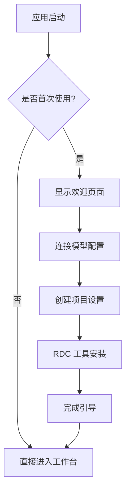

# 快速开始

<cite>
**本文引用的文件**
- [package.json](file://package.json)
- [README.md](file://README.md)
- [scripts/start-rdc-agent.sh](file://scripts/start-rdc-agent.sh)
- [scripts/start-rdc-agent.cmd](file://scripts/start-rdc-agent.cmd)
- [scripts/run-rdc-launcher.sh](file://scripts/run-rdc-launcher.sh)
- [scripts/run-rdc-launcher.cmd](file://scripts/run-rdc-launcher.cmd)
- [scripts/launch-rdc-agent.mjs](file://scripts/launch-rdc-agent.mjs)
- [electron.vite.config.ts](file://electron.vite.config.ts)
- [pnpm-workspace.yaml](file://pnpm-workspace.yaml)
- [GettingStartedDialog.tsx](file://src/renderer/features/onboarding/GettingStartedDialog.tsx)
- [GuideIllustration.tsx](file://src/renderer/features/onboarding/GuideIllustration.tsx)
- [GettingStartedState.ts](file://src/main/runtime/GettingStartedState.ts)
- [onboarding.ts（英文）](file://src/renderer/i18n/locales/en/onboarding.ts)
- [onboarding.ts（中文）](file://src/renderer/i18n/locales/zh-CN/onboarding.ts)
- [App.tsx](file://src/renderer/app/App.tsx)
</cite>

## 更新摘要
**变更内容**
- 新增四步引导体验：欢迎、模型配置、项目设置、RDC 工具安装
- 支持英语和中文双语界面
- 集成到应用启动流程，首次使用时自动显示引导对话框
- 添加本地图示与步骤指示器，提升新用户上手体验

## 目录
1. [简介](#简介)
2. [环境要求](#环境要求)
3. [依赖安装](#依赖安装)
4. [开发环境搭建](#开发环境搭建)
5. [启动模式说明](#启动模式说明)
6. [新引导体验功能](#新引导体验功能)
7. [常见问题与故障排除](#常见问题与故障排除)
8. [性能注意事项](#性能注意事项)
9. [结论](#结论)
10. [附录](#附录)

## 简介
本指南面向首次接触 RDC-Agent 的开发者与用户，目标是帮助你在最短时间内完成环境准备、依赖安装、开发环境搭建，并理解不同启动模式的用途与区别。RDC-Agent 是一个基于 Electron 的桌面应用，用于 RenderDoc .rdc 捕获分析与 Agent 协作调试工作流。

**更新** 新增了四步引导体验，帮助用户快速了解应用功能，包括欢迎页面、模型配置指导、项目设置说明和 RDC 工具安装指引。

## 环境要求
- Node.js：>=22.13.0
- pnpm：11.7.0（仓库锁定）
- 操作系统：Windows/macOS/Linux（Electron 支持的平台）

章节来源
- [package.json:16-18](file://package.json#L16-L18)
- [README.md:48-51](file://README.md#L48-L51)

## 依赖安装
安装依赖并准备构建：
```bash
pnpm install
```

该命令会：
- 解析 pnpm workspace 配置
- 使用锁文件确保依赖一致性
- 将包存储到固定位置避免污染项目目录
- 验证 Node.js 版本兼容性

章节来源
- [pnpm-workspace.yaml:1-2](file://pnpm-workspace.yaml#L1-L2)
- [scripts/launch-rdc-agent.mjs:299-343](file://scripts/launch-rdc-agent.mjs#L299-L343)

## 开发环境搭建
### 启动开发模式（桌面应用，带热更新）
```bash
pnpm run dev
```

### 启动浏览器模式（无头，用于真实会话验证）
```bash
pnpm run start:agent-browser
```

### 启动浏览器开发模式（渲染热更新 + 无头主进程）
```bash
pnpm run start:agent-browser:dev
```

### 仅准备依赖与构建（不启动应用）
```bash
pnpm run start:prepare
```

### 平台快捷方式
- Windows：`scripts/start-rdc-agent.cmd`
- macOS/Linux：`sh scripts/start-rdc-agent.sh`

章节来源
- [package.json:19-71](file://package.json#L19-L71)
- [README.md:48-81](file://README.md#L48-L81)
- [scripts/start-rdc-agent.cmd:1-4](file://scripts/start-rdc-agent.cmd#L1-L4)
- [scripts/start-rdc-agent.sh:1-5](file://scripts/start-rdc-agent.sh#L1-L5)

## 启动模式说明
- **desktop**：生产型桌面应用，直接运行构建产物
- **desktop-dev**：开发型桌面应用，启用热更新与开发服务器
- **browser**：无头模式，适合自动化验证与质量检查
- **browser-dev**：无头模式 + 渲染开发服务器，便于前端调试
- **prepare-only**：仅完成依赖与构建准备，便于 CI 或离线环境

章节来源
- [scripts/launch-rdc-agent.mjs:23-25](file://scripts/launch-rdc-agent.mjs#L23-L25)
- [scripts/launch-rdc-agent.mjs:387-407](file://scripts/launch-rdc-agent.mjs#L387-L407)
- [scripts/launch-rdc-agent.mjs:490-527](file://scripts/launch-rdc-agent.mjs#L490-L527)

## 新引导体验功能

### 四步引导流程
RDC-Agent 现在提供了全新的四步引导体验，帮助用户快速上手：



**图表来源**
- [GettingStartedDialog.tsx:9](file://src/renderer/features/onboarding/GettingStartedDialog.tsx#L9)
- [GettingStartedState.ts:6-14](file://src/main/runtime/GettingStartedState.ts#L6-L14)

### 引导步骤详解

#### 第一步：欢迎页面
- 介绍应用核心功能
- 展示三个主要入口点
- 提供概览性说明

#### 第二步：模型配置
- 指导如何连接 AI 模型供应商
- 演示 API Key 配置过程
- 验证连接状态

#### 第三步：项目设置
- 创建新的工作项目
- 导入 .rdc 捕获文件
- 配置项目资源

#### 第四步：RDC 工具安装
- 下载官方 RDC-Tool
- 解压并配置工具路径
- 验证工具可用性

### 国际化支持
引导体验完全支持英语和中文：

**英文界面**：
- "Start here" - 从这里开始
- "Get oriented" - 准备开始  
- "Connect a model" - 连接模型
- "Create a project" - 创建项目
- "RDC tools" - RDC 工具

**中文界面**：
- "从这里开始" - Start here
- "准备开始" - Get oriented
- "连接模型" - Connect a model
- "创建项目" - Create a project
- "RDC 工具" - RDC tools

章节来源
- [GettingStartedDialog.tsx:12-52](file://src/renderer/features/onboarding/GettingStartedDialog.tsx#L12-L52)
- [GuideIllustration.tsx:4-30](file://src/renderer/features/onboarding/GuideIllustration.tsx#L4-L30)
- [onboarding.ts（英文）:1-62](file://src/renderer/i18n/locales/en/onboarding.ts#L1-L62)
- [onboarding.ts（中文）:1-62](file://src/renderer/i18n/locales/zh-CN/onboarding.ts#L1-L62)

### 引导状态管理
应用通过文件系统跟踪引导状态：
- 首次使用时自动显示引导对话框
- 完成后在应用状态目录创建标记文件
- 支持随时重新打开引导界面

章节来源
- [GettingStartedState.ts:5-14](file://src/main/runtime/GettingStartedState.ts#L5-L14)
- [App.tsx:230](file://src/renderer/app/App.tsx#L230)

## 常见问题与故障排除

### Node.js 版本不满足
- **现象**：启动时报错提示需要 Node.js >=22.13.0
- **处理**：升级 Node.js 或通过环境变量 RDC_AGENT_NODE 指定可执行路径
- **参考**：[scripts/launch-rdc-agent.mjs:74-83](file://scripts/launch-rdc-agent.mjs#L74-L83)、[scripts/run-rdc-launcher.sh:5-21](file://scripts/run-rdc-launcher.sh#L5-L21)、[scripts/run-rdc-launcher.cmd:5-27](file://scripts/run-rdc-launcher.cmd#L5-L27)

### pnpm 未找到或版本不符
- **现象**：提示 pnpm 相关命令失败或锁文件不一致
- **处理**：确保系统安装了 pnpm 11.7.0，或在项目根目录重新执行依赖同步
- **参考**：[scripts/launch-rdc-agent.mjs:102-123](file://scripts/launch-rdc-agent.mjs#L102-L123)、[scripts/launch-rdc-agent.mjs:299-343](file://scripts/launch-rdc-agent.mjs#L299-L343)

### Electron 二进制缺失或损坏
- **现象**：无法启动 Electron，或构建后缺少 path.txt
- **处理**：使用 --force-prepare 强制恢复依赖与构建；必要时清理 node_modules 后重试
- **参考**：[scripts/launch-rdc-agent.mjs:125-224](file://scripts/launch-rdc-agent.mjs#L125-L224)、[scripts/launch-rdc-agent.mjs:299-343](file://scripts/launch-rdc-agent.mjs#L299-L343)

### 渲染开发服务器不可达
- **现象**：启动后长时间等待端口或报超时错误
- **处理**：确认 5173 端口未被占用；若使用非标准 Node 安装，检查 PATH 与权限
- **参考**：[electron.vite.config.ts:40-54](file://electron.vite.config.ts#L40-L54)、[scripts/launch-rdc-agent.mjs:420-467](file://scripts/launch-rdc-agent.mjs#L420-L467)

### 浏览器模式异常
- **现象**：无头模式启动失败或渲染页面无法加载
- **处理**：切换到 desktop-dev 模式定位问题；或使用 --prepare-only 先完成准备阶段
- **参考**：[scripts/launch-rdc-agent.mjs:490-527](file://scripts/launch-rdc-agent.mjs#L490-L527)

### 引导体验相关问题
- **现象**：引导对话框无法正常显示或语言切换无效
- **处理**：检查应用状态目录权限；确认 i18n 配置文件完整性；重启应用重新触发引导
- **参考**：[GettingStartedState.ts:5-14](file://src/main/runtime/GettingStartedState.ts#L5-L14)、[GettingStartedDialog.tsx:12-52](file://src/renderer/features/onboarding/GettingStartedDialog.tsx#L12-L52)

章节来源
- [scripts/launch-rdc-agent.mjs:74-83](file://scripts/launch-rdc-agent.mjs#L74-L83)
- [scripts/launch-rdc-agent.mjs:102-123](file://scripts/launch-rdc-agent.mjs#L102-L123)
- [scripts/launch-rdc-agent.mjs:125-224](file://scripts/launch-rdc-agent.mjs#L125-L224)
- [scripts/launch-rdc-agent.mjs:299-343](file://scripts/launch-rdc-agent.mjs#L299-L343)
- [scripts/launch-rdc-agent.mjs:420-467](file://scripts/launch-rdc-agent.mjs#L420-L467)
- [scripts/launch-rdc-agent.mjs:490-527](file://scripts/launch-rdc-agent.mjs#L490-L527)
- [electron.vite.config.ts:40-54](file://electron.vite.config.ts#L40-L54)

## 性能注意事项
- 依赖安装使用 --frozen-lockfile 与 prefer-offline，减少网络波动影响
- 依赖与构建状态通过指纹缓存，避免重复安装与编译
- 渲染开发服务器使用本地回环地址，降低跨域与端口冲突风险
- pnpm store 固定到用户缓存目录，避免写入项目根目录造成磁盘压力
- 引导体验使用轻量级组件，不影响应用启动性能

章节来源
- [scripts/launch-rdc-agent.mjs:299-343](file://scripts/launch-rdc-agent.mjs#L299-L343)
- [scripts/launch-rdc-agent.mjs:363-385](file://scripts/launch-rdc-agent.mjs#L363-L385)
- [electron.vite.config.ts:40-54](file://electron.vite.config.ts#L40-L54)
- [pnpm-workspace.yaml:1-2](file://pnpm-workspace.yaml#L1-L2)

## 结论
通过统一的启动器与清晰的模式划分，RDC-Agent 提供了稳定且高效的开发与验证体验。新增的四步引导体验进一步降低了新用户的学习成本，帮助用户快速掌握应用的核心功能。遵循本文的环境要求与步骤，你可以在几分钟内完成安装与运行，并根据场景选择合适的启动模式进行开发与测试。

## 附录

### 环境要求
- Node.js：>=22.13.0
- pnpm：11.7.0（仓库锁定）
- 操作系统：Windows/macOS/Linux（Electron 支持的平台）

章节来源
- [package.json:16-18](file://package.json#L16-L18)
- [README.md:48-51](file://README.md#L48-L51)

### 依赖安装与开发环境搭建
- 安装依赖并准备构建：
  - `pnpm install`
- 启动开发模式（桌面应用，带热更新）：
  - `pnpm run dev`
- 启动浏览器模式（无头，用于真实会话验证）：
  - `pnpm run start:agent-browser`
- 启动浏览器开发模式（渲染热更新 + 无头主进程）：
  - `pnpm run start:agent-browser:dev`
- 仅准备依赖与构建（不启动应用）：
  - `pnpm run start:prepare`
- 平台快捷方式：
  - Windows：`scripts/start-rdc-agent.cmd`
  - macOS/Linux：`sh scripts/start-rdc-agent.sh`

章节来源
- [package.json:19-71](file://package.json#L19-L71)
- [README.md:48-81](file://README.md#L48-L81)
- [scripts/start-rdc-agent.cmd:1-4](file://scripts/start-rdc-agent.cmd#L1-L4)
- [scripts/start-rdc-agent.sh:1-5](file://scripts/start-rdc-agent.sh#L1-L5)

### 启动模式对比
- **desktop**：生产型桌面应用，直接运行构建产物
- **desktop-dev**：开发型桌面应用，启用热更新与开发服务器
- **browser**：无头模式，适合自动化验证与质量检查
- **browser-dev**：无头模式 + 渲染开发服务器，便于前端调试
- **prepare-only**：仅完成依赖与构建准备，便于 CI 或离线环境

章节来源
- [scripts/launch-rdc-agent.mjs:23-25](file://scripts/launch-rdc-agent.mjs#L23-L25)
- [scripts/launch-rdc-agent.mjs:387-407](file://scripts/launch-rdc-agent.mjs#L387-L407)
- [scripts/launch-rdc-agent.mjs:490-527](file://scripts/launch-rdc-agent.mjs#L490-L527)

### 新引导体验特性
- **四步引导流程**：欢迎 → 模型配置 → 项目设置 → RDC 工具安装
- **双语支持**：完整的英语和中文界面翻译
- **本地图示**：每个步骤配有详细的操作示意图
- **状态持久化**：记录引导完成状态，避免重复显示
- **随时重开**：可通过右上角问号按钮重新访问引导界面

章节来源
- [GettingStartedDialog.tsx:9-52](file://src/renderer/features/onboarding/GettingStartedDialog.tsx#L9-L52)
- [GuideIllustration.tsx:4-30](file://src/renderer/features/onboarding/GuideIllustration.tsx#L4-L30)
- [GettingStartedState.ts:5-14](file://src/main/runtime/GettingStartedState.ts#L5-L14)
- [onboarding.ts（英文）:1-62](file://src/renderer/i18n/locales/en/onboarding.ts#L1-L62)
- [onboarding.ts（中文）:1-62](file://src/renderer/i18n/locales/zh-CN/onboarding.ts#L1-L62)