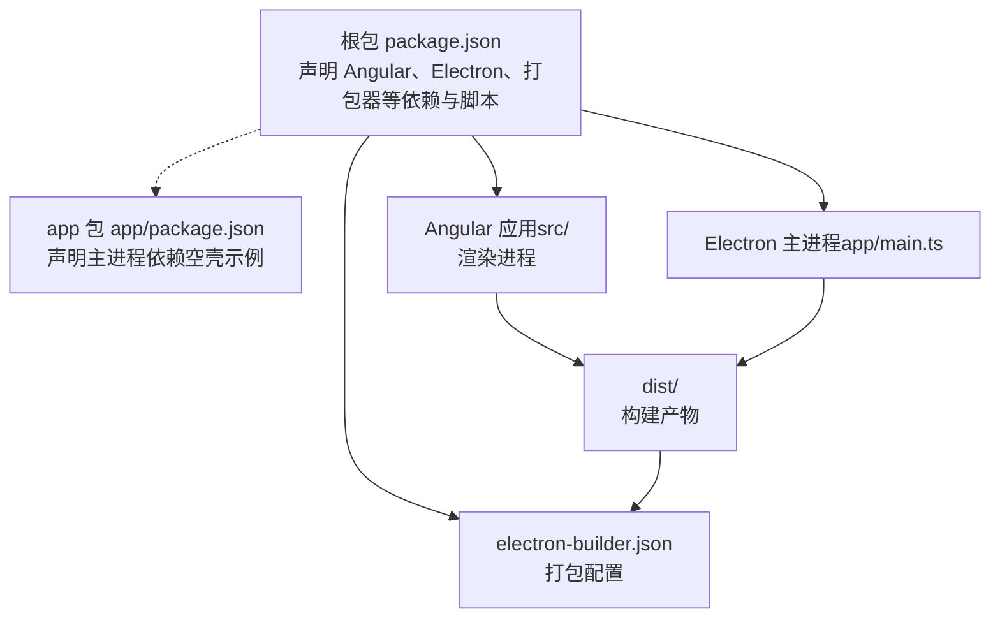
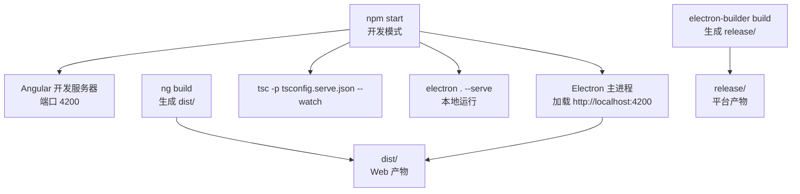
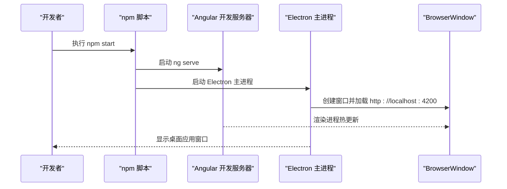
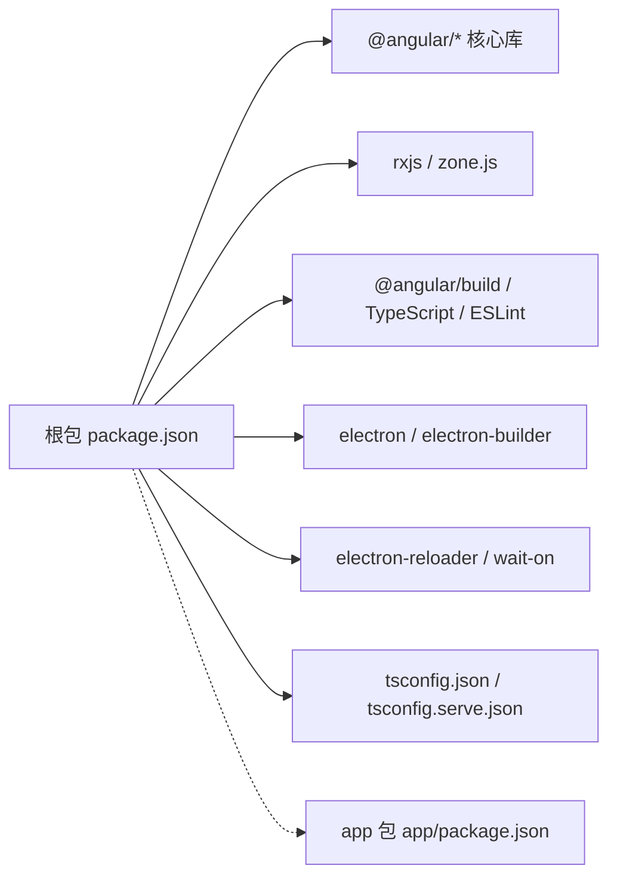

# 快速开始

<cite>
**本文引用的文件**
- [package.json](file://package.json)
- [app/package.json](file://app/package.json)
- [angular.json](file://angular.json)
- [electron-builder.json](file://electron-builder.json)
- [README.md](file://README.md)
- [HOW_TO.md](file://HOW_TO.md)
- [tsconfig.json](file://tsconfig.json)
- [tsconfig.serve.json](file://tsconfig.serve.json)
- [src/environments/environment.ts](file://src/environments/environment.ts)
- [src/environments/environment.dev.ts](file://src/environments/environment.dev.ts)
- [src/environments/environment.prod.ts](file://src/environments/environment.prod.ts)
- [app/main.ts](file://app/main.ts)
- [src/app/core/services/electron/electron.service.ts](file://src/app/core/services/electron/electron.service.ts)
- [e2e/playwright.config.ts](file://e2e/playwright.config.ts)
- [.gitignore](file://.gitignore)
- [.npmrc](file://.npmrc)
</cite>

## 目录
1. [简介](#简介)
2. [项目结构](#项目结构)
3. [核心组件](#核心组件)
4. [架构总览](#架构总览)
5. [详细组件分析](#详细组件分析)
6. [依赖关系分析](#依赖关系分析)
7. [性能注意事项](#性能注意事项)
8. [故障排查指南](#故障排查指南)
9. [结论](#结论)
10. [附录](#附录)

## 简介
本指南面向首次接触 Angular + Electron 桌面应用的开发者，目标是帮助你在最短时间内完成环境准备、依赖安装与项目初始化，并理解双包管理模式的设计初衷与优势。你将学到：
- 完整的环境要求（Node.js、TypeScript、操作系统）
- 双包管理结构（根包与 app 包）的由来与好处
- 多种运行模式（开发、生产、浏览器模式）的启动命令
- 常见初始配置问题与解决方案
- 如何验证环境是否正确搭建

## 项目结构
该项目采用“双包管理”结构：
- 根目录 package.json：用于 Angular 构建、测试、打包与脚本编排，同时声明 Electron 主进程所需的构建工具与打包器。
- app/package.json：仅包含 Electron 主进程（主进程 Node.js 运行时）所需依赖，避免将渲染进程依赖打入主进程包，减小体积并提升安全性。

图表来源
- [package.json:1-108](file://package.json#L1-L108)
- [app/package.json:1-13](file://app/package.json#L1-L13)
- [angular.json:1-188](file://angular.json#L1-L188)
- [electron-builder.json:1-61](file://electron-builder.json#L1-L61)

章节来源
- [package.json:1-108](file://package.json#L1-L108)
- [app/package.json:1-13](file://app/package.json#L1-L13)
- [angular.json:1-188](file://angular.json#L1-L188)
- [electron-builder.json:1-61](file://electron-builder.json#L1-L61)

## 核心组件
- 双包管理结构
  - 根包负责 Angular 构建链路、测试与打包；主进程依赖放在 app 包中，确保最终包体更小、安全边界更清晰。
  - 该结构来自 Electron Builder 的“两包结构”建议，既优化打包体积，又保留 Angular CLI 的生态能力（如 ng add）。
- 脚本与命令
  - 开发模式：同时启动 Angular 开发服务器与 Electron 主进程，实现渲染进程热重载与主进程自动重启。
  - 生产模式：先构建 Angular 产物，再使用 electron-builder 打包为各平台可执行文件或便携包。
  - 浏览器模式：仅构建并运行 Web 产物，便于在浏览器中调试。
- 构建配置
  - Angular 使用 @angular/build:application 与自定义配置，支持多环境（dev/prod/testing）。
  - TypeScript 配置分别服务于 Web 构建与 Electron 主进程编译。
- 打包配置
  - electron-builder 统一配置跨平台产物（Windows、macOS、Linux），含 Flatpak 支持。

章节来源
- [README.md:63](file://README.md#L63)
- [package.json:27-48](file://package.json#L27-L48)
- [angular.json:24-137](file://angular.json#L24-L137)
- [tsconfig.json:1-34](file://tsconfig.json#L1-L34)
- [tsconfig.serve.json:1-28](file://tsconfig.serve.json#L1-L28)
- [electron-builder.json:1-61](file://electron-builder.json#L1-L61)

## 架构总览
下图展示了从开发到打包的关键流程与模块交互：

图表来源
- [package.json:30-41](file://package.json#L30-L41)
- [tsconfig.serve.json:1-28](file://tsconfig.serve.json#L1-L28)
- [electron-builder.json:1-61](file://electron-builder.json#L1-L61)

章节来源
- [package.json:27-48](file://package.json#L27-L48)
- [tsconfig.serve.json:1-28](file://tsconfig.serve.json#L1-L28)
- [electron-builder.json:1-61](file://electron-builder.json#L1-L61)

## 详细组件分析

### 环境要求与版本约束
- Node.js 与 TypeScript
  - Node.js：需满足 engines 字段中的版本范围，以保证 Electron 与构建工具兼容。
  - TypeScript：需满足版本范围，确保类型系统与 Angular 生态协同工作。
- 操作系统支持
  - Windows、macOS、Linux 均有官方支持与 CI 覆盖，打包配置覆盖 dmg、AppImage、Flatpak 等格式。
- 其他工具
  - 推荐使用 npm 作为包管理器，避免与打包器在 node_modules 结构上的冲突。
  - 若需使用 Angular CLI，需全局安装 @angular/cli。

章节来源
- [package.json:96-99](file://package.json#L96-L99)
- [README.md:19-29](file://README.md#L19-L29)
- [README.md:47-54](file://README.md#L47-L54)

### 双包管理结构：原因与优势
- 设计原因
  - Electron Builder 建议采用“两包结构”，将主进程依赖与渲染进程依赖分离，避免将 Web 依赖打入主进程包。
- 优势
  - 更小的主进程包体，更快的启动与更低的攻击面。
  - 渲染进程仍可享受 Angular CLI 的完整生态（如 ng add）。
- 依赖放置策略
  - Node.js 核心模块与第三方库：若需在渲染进程运行，应同时放入根包与 app 包的 dependencies，以确保主进程与渲染进程均可访问。
  - Web 第三方库（如 UI 框架）：仅放入根包即可。

章节来源
- [README.md:63](file://README.md#L63)
- [src/app/core/services/electron/electron.service.ts:39-46](file://src/app/core/services/electron/electron.service.ts#L39-L46)

### 运行模式与启动命令
- 开发模式（本地联调）
  - 同时启动 Angular 开发服务器与 Electron 主进程，渲染进程热重载，主进程自动重启。
  - 关键命令：npm start
- 生产模式（打包发布）
  - 先构建 Web 产物，再使用 electron-builder 打包为各平台可执行文件或便携包。
  - 关键命令：npm run electron:build
- 浏览器模式（纯 Web）
  - 仅构建 Web 产物，便于在浏览器中调试。
  - 关键命令：npm run web:dev 或 npm run web:prod
- 本地 Electron 运行
  - 先构建 Web 产物，再通过 electron . 启动本地 Electron 实例。
  - 关键命令：npm run electron:local
- 单独编译主进程
  - 使用 tsconfig.serve.json 编译主进程入口，配合监听模式进行开发。
  - 关键命令：npm run electron:serve-tsc 与 npm run electron:serve-tsc:watch

章节来源
- [README.md:65-69](file://README.md#L65-L69)
- [README.md:100-113](file://README.md#L100-L113)
- [package.json:30-41](file://package.json#L30-L41)
- [tsconfig.serve.json:1-28](file://tsconfig.serve.json#L1-L28)

### Electron 主进程与渲染进程交互
- 主进程职责
  - 创建窗口、加载页面（开发时加载 http://localhost:4200，生产时加载 dist/browser/index.html）、处理生命周期事件。
  - 提供 IPC 能力（示例：获取应用版本）。
- 渲染进程职责
  - 通过 ElectronService 条件性地访问 Electron 与 Node.js API，实现跨进程通信与系统能力调用。
- 加载策略
  - 开发模式：加载本地 Angular 开发服务器。
  - 生产模式：优先加载打包后的 dist/browser/index.html，回退到 app 目录下的相对路径。

图表来源
- [package.json:30-39](file://package.json#L30-L39)
- [app/main.ts:27-51](file://app/main.ts#L27-L51)

章节来源
- [app/main.ts:1-94](file://app/main.ts#L1-L94)
- [src/app/core/services/electron/electron.service.ts:1-57](file://src/app/core/services/electron/electron.service.ts#L1-L57)

### 打包与分发配置
- 打包目标
  - Windows：便携包（portable）等。
  - macOS：dmg 等。
  - Linux：AppImage、Flatpak 等。
- 打包策略
  - 仅包含 dist/ 与必要的 Node.js 依赖，排除源码与映射文件。
  - Flatpak 需要额外运行时与工具链支持。
- 输出位置
  - release/ 下生成各平台可执行文件或便携包。

章节来源
- [electron-builder.json:1-61](file://electron-builder.json#L1-L61)
- [README.md:115-132](file://README.md#L115-L132)

### 测试与 E2E
- 单元测试
  - 使用 Vitest 运行，支持覆盖率与报告输出。
- E2E 测试
  - 使用 Playwright，提供截图、慢动作与追踪能力，适合跨平台自动化测试。

章节来源
- [angular.json:104-128](file://angular.json#L104-L128)
- [e2e/playwright.config.ts:1-21](file://e2e/playwright.config.ts#L1-L21)

## 依赖关系分析
- 根包依赖
  - Angular 核心库与 RxJS、Zone.js 等运行时依赖。
  - 开发期工具：@angular/build、TypeScript、ESLint、Vitest、Playwright 等。
  - 构建期工具：electron、electron-builder、electron-reloader、wait-on 等。
- app 包依赖
  - 示例为空，实际项目按需添加主进程依赖（如 Node.js 第三方库）。
- TypeScript 配置
  - tsconfig.json 用于 Web 构建与严格类型检查。
  - tsconfig.serve.json 用于主进程编译，目标为 ES2015/CommonJS 并启用 node 类型。

图表来源
- [package.json:49-95](file://package.json#L49-L95)
- [app/package.json:1-13](file://app/package.json#L1-L13)
- [tsconfig.json:1-34](file://tsconfig.json#L1-L34)
- [tsconfig.serve.json:1-28](file://tsconfig.serve.json#L1-L28)

章节来源
- [package.json:49-95](file://package.json#L49-L95)
- [app/package.json:1-13](file://app/package.json#L1-L13)
- [tsconfig.json:1-34](file://tsconfig.json#L1-L34)
- [tsconfig.serve.json:1-28](file://tsconfig.serve.json#L1-L28)

## 性能注意事项
- 双包结构降低主进程包体，缩短启动时间并减少内存占用。
- 开发模式下，主进程监听 tsc 输出，渲染进程由 Angular 开发服务器热重载，提升迭代效率。
- 生产构建开启 AOT 与优化，减少运行时开销。
- Linux Flatpak 打包需预装运行时，避免首次构建耗时过长。

## 故障排查指南
- 使用 yarn 导致打包异常
  - 请改用 npm，避免 node_modules 结构与打包器不兼容的问题。
- 无法运行 ng add
  - 项目未使用默认构建器，参考 HOW_TO.md 中的临时替换与恢复步骤。
- E2E 在代理环境下失败
  - 设置代理例外：no_proxy/NO_PROXY 包含 127.0.0.1 与 localhost。
- 热重载仅限渲染进程
  - 主进程修改后需重启 Electron，这是预期行为。
- 验证环境
  - 成功运行 npm start 后，确认出现 Electron 窗口并加载 http://localhost:4200。
  - 成功运行 npm run electron:build 后，release/ 生成对应平台产物。

章节来源
- [README.md:47](file://README.md#L47)
- [HOW_TO.md:17-39](file://HOW_TO.md#L17-L39)
- [README.md:148-149](file://README.md#L148-L149)
- [README.md:31](file://README.md#L31)
- [README.md:113](file://README.md#L113)

## 结论
通过遵循本指南，你可以快速完成 Angular + Electron 开发环境的搭建与运行。双包管理结构兼顾了打包体积与开发体验，结合完善的脚本与打包配置，能够覆盖从开发到生产的全流程。遇到问题时，可依据“故障排查指南”逐项验证与修复。

## 附录

### 环境要求清单
- Node.js：满足 engines.node 要求
- TypeScript：满足 engines.typescript 要求
- 包管理器：推荐 npm
- 操作系统：Windows/macOS/Linux
- 可选：Linux 下构建 Flatpak 需要额外运行时与工具链

章节来源
- [package.json:96-99](file://package.json#L96-L99)
- [README.md:19-29](file://README.md#L19-L29)

### 初始化与安装步骤
- 克隆仓库并安装根包依赖
- 切换至 app/ 目录安装主进程依赖
- 运行 npm start 进入开发模式
- 如需打包，运行 npm run electron:build

章节来源
- [README.md:35-61](file://README.md#L35-L61)
- [package.json:27-48](file://package.json#L27-L48)

### 多种运行模式说明
- 开发模式：npm start
- 生产模式：npm run electron:build
- 浏览器模式：npm run web:dev / npm run web:prod
- 本地 Electron：npm run electron:local
- 主进程编译：npm run electron:serve-tsc / electron:serve-tsc:watch

章节来源
- [README.md:65-113](file://README.md#L65-L113)
- [package.json:30-41](file://package.json#L30-L41)

### 验证环境是否正确搭建
- 开发模式：打开 http://localhost:4200，确认渲染进程热重载正常。
- 主进程：确认 Electron 窗口创建成功，IPC 能力可用。
- 打包：release/ 生成对应平台产物，且应用可正常启动。

章节来源
- [app/main.ts:64-94](file://app/main.ts#L64-L94)
- [electron-builder.json:1-61](file://electron-builder.json#L1-L61)