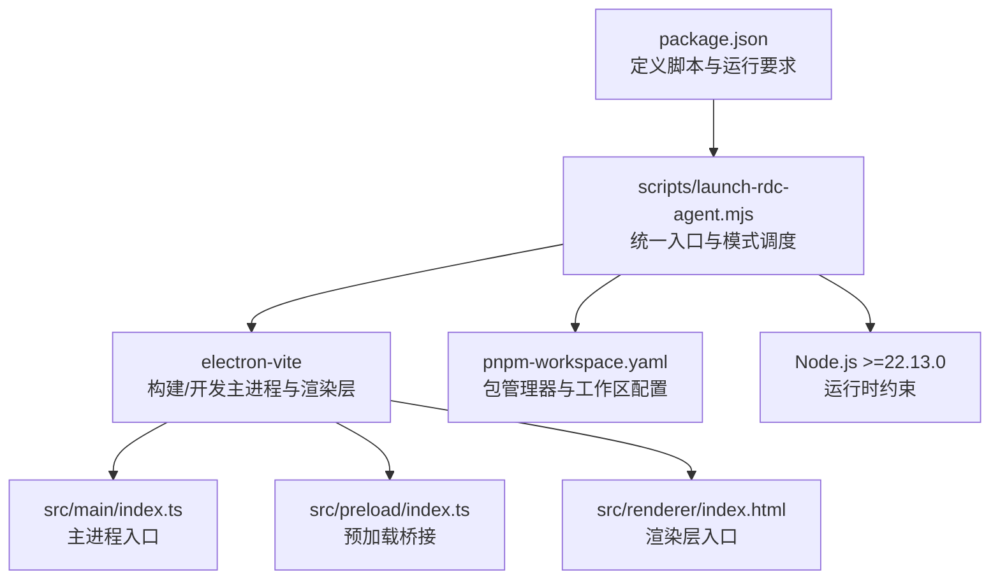
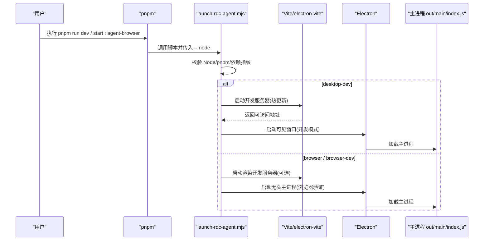
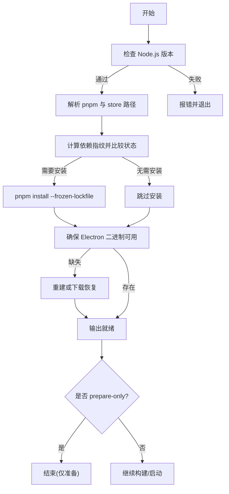
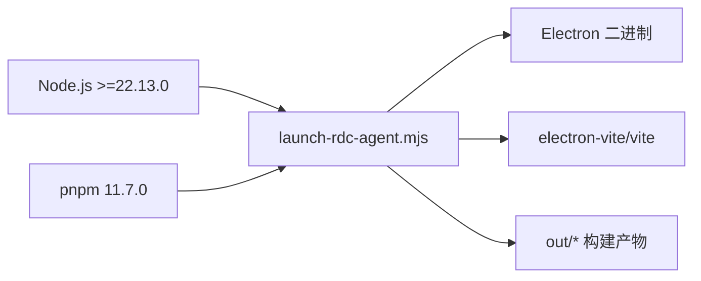

# 快速开始

<cite>
**本文引用的文件**
- [package.json](file://package.json)
- [README.md](file://README.md)
- [scripts/start-rdc-agent.sh](file://scripts/start-rdc-agent.sh)
- [scripts/start-rdc-agent.cmd](file://scripts/start-rdc-agent.cmd)
- [scripts/run-rdc-launcher.sh](file://scripts/run-rdc-launcher.sh)
- [scripts/run-rdc-launcher.cmd](file://scripts/run-rdc-launcher.cmd)
- [scripts/launch-rdc-agent.mjs](file://scripts/launch-rdc-agent.mjs)
- [electron.vite.config.ts](file://electron.vite.config.ts)
- [pnpm-workspace.yaml](file://pnpm-workspace.yaml)
</cite>

## 目录
1. [简介](#简介)
2. [项目结构](#项目结构)
3. [核心组件](#核心组件)
4. [架构总览](#架构总览)
5. [详细组件分析](#详细组件分析)
6. [依赖关系分析](#依赖关系分析)
7. [性能注意事项](#性能注意事项)
8. [故障排除指南](#故障排除指南)
9. [结论](#结论)
10. [附录](#附录)

## 简介
本指南面向首次接触 RDC-Agent 的开发者与用户，目标是帮助你在最短时间内完成环境准备、依赖安装、开发环境搭建，并理解不同启动模式的用途与区别。RDC-Agent 是一个基于 Electron 的桌面应用，用于 RenderDoc .rdc 捕获分析与 Agent 协作调试工作流。

## 项目结构
仓库采用分层组织：主进程逻辑在 src/main，渲染层在 src/renderer，预加载脚本在 src/preload，共享类型与工具在 src/shared；资源与文档分别位于 resources 与 docs；启动与构建由 scripts 中的脚本统一编排。

图表来源
- [package.json:14-23](file://package.json#L14-L23)
- [scripts/launch-rdc-agent.mjs:23-25](file://scripts/launch-rdc-agent.mjs#L23-L25)
- [electron.vite.config.ts:8-23](file://electron.vite.config.ts#L8-L23)
- [pnpm-workspace.yaml:1-2](file://pnpm-workspace.yaml#L1-L2)

章节来源
- [README.md:38-46](file://README.md#L38-L46)
- [package.json:14-23](file://package.json#L14-L23)

## 核心组件
- 启动器与模式管理：scripts/launch-rdc-agent.mjs 负责 Node/pnpm/Electron 校验、依赖同步、构建缓存、模式切换（desktop/desktop-dev/browser/browser-dev/prepare-only）。
- 构建与开发服务器：electron-vite 同时管理主进程、预加载与渲染层的开发与构建；Vite 渲染服务默认监听 127.0.0.1:5173。
- 包管理与存储：pnpm 11.7.0，storeDir 固定到 ~/.cache/rdc-agent/pnpm-store，避免污染项目磁盘根目录。
- 平台启动壳：start-rdc-agent.{sh,cmd} 通过 run-rdc-launcher.{sh,cmd} 调用统一入口，便于跨平台一致体验。

章节来源
- [scripts/launch-rdc-agent.mjs:23-25](file://scripts/launch-rdc-agent.mjs#L23-L25)
- [scripts/launch-rdc-agent.mjs:387-407](file://scripts/launch-rdc-agent.mjs#L387-L407)
- [scripts/launch-rdc-agent.mjs:420-448](file://scripts/launch-rdc-agent.mjs#L420-L448)
- [scripts/launch-rdc-agent.mjs:490-527](file://scripts/launch-rdc-agent.mjs#L490-L527)
- [electron.vite.config.ts:40-54](file://electron.vite.config.ts#L40-L54)
- [pnpm-workspace.yaml:1-2](file://pnpm-workspace.yaml#L1-L2)
- [scripts/start-rdc-agent.sh:1-5](file://scripts/start-rdc-agent.sh#L1-L5)
- [scripts/start-rdc-agent.cmd:1-4](file://scripts/start-rdc-agent.cmd#L1-L4)

## 架构总览
下图展示了从命令行到应用运行的完整链路：pnpm 触发 package.json 脚本，进入 launch-rdc-agent.mjs，根据模式决定是启动开发服务器还是构建后运行 Electron；浏览器模式会启动无头主进程以进行真实会话验证。

图表来源
- [package.json:19-71](file://package.json#L19-L71)
- [scripts/launch-rdc-agent.mjs:476-527](file://scripts/launch-rdc-agent.mjs#L476-L527)
- [electron.vite.config.ts:8-23](file://electron.vite.config.ts#L8-L23)

## 详细组件分析

### 启动模式与用途
- desktop：生产型桌面应用，使用已构建输出运行。
- desktop-dev：开发型桌面应用，启用热更新与开发服务器。
- browser：无头模式，用于浏览器端质量验证。
- browser-dev：无头模式 + 渲染开发服务器，便于前端调试。
- prepare-only：仅完成依赖同步与构建，不启动应用。

章节来源
- [scripts/launch-rdc-agent.mjs:23-25](file://scripts/launch-rdc-agent.mjs#L23-L25)
- [scripts/launch-rdc-agent.mjs:387-407](file://scripts/launch-rdc-agent.mjs#L387-L407)
- [scripts/launch-rdc-agent.mjs:490-527](file://scripts/launch-rdc-agent.mjs#L490-L527)

### 环境与依赖准备流程

图表来源
- [scripts/launch-rdc-agent.mjs:74-112](file://scripts/launch-rdc-agent.mjs#L74-L112)
- [scripts/launch-rdc-agent.mjs:125-224](file://scripts/launch-rdc-agent.mjs#L125-L224)
- [scripts/launch-rdc-agent.mjs:299-343](file://scripts/launch-rdc-agent.mjs#L299-L343)
- [scripts/launch-rdc-agent.mjs:363-385](file://scripts/launch-rdc-agent.mjs#L363-L385)

章节来源
- [scripts/launch-rdc-agent.mjs:74-112](file://scripts/launch-rdc-agent.mjs#L74-L112)
- [scripts/launch-rdc-agent.mjs:299-343](file://scripts/launch-rdc-agent.mjs#L299-L343)
- [scripts/launch-rdc-agent.mjs:363-385](file://scripts/launch-rdc-agent.mjs#L363-L385)

### 开发服务器与渲染层
- 渲染开发服务器默认绑定 127.0.0.1:5173，支持严格端口与非严格端口策略。
- 开发模式下，主进程通过 electron-vite 启动，自动注入渲染地址以实现热更新。

章节来源
- [electron.vite.config.ts:40-54](file://electron.vite.config.ts#L40-L54)
- [scripts/launch-rdc-agent.mjs:420-448](file://scripts/launch-rdc-agent.mjs#L420-L448)
- [scripts/launch-rdc-agent.mjs:490-494](file://scripts/launch-rdc-agent.mjs#L490-L494)

### 平台启动壳
- Windows/macOS/Linux 均提供快捷启动脚本，内部统一调用 run-rdc-launcher.*，再进入 launch-rdc-agent.mjs。
- Windows 可直接运行 scripts/start-rdc-agent.cmd；macOS/Linux 使用 sh scripts/start-rdc-agent.sh。

章节来源
- [scripts/start-rdc-agent.cmd:1-4](file://scripts/start-rdc-agent.cmd#L1-L4)
- [scripts/start-rdc-agent.sh:1-5](file://scripts/start-rdc-agent.sh#L1-L5)
- [scripts/run-rdc-launcher.cmd:1-29](file://scripts/run-rdc-launcher.cmd#L1-L29)
- [scripts/run-rdc-launcher.sh:1-22](file://scripts/run-rdc-launcher.sh#L1-L22)

## 依赖关系分析
- Node.js 版本要求：>=22.13.0，由启动器与 package.json 共同约束。
- pnpm 版本：11.7.0，通过 workspace 固定 store 位置，提升多项目隔离性与稳定性。
- Electron：作为运行时被动态发现与恢复，必要时重建或下载二进制。
- 构建工具链：electron-vite 与 vite 为关键 CLI，启动器会校验其可用性。

图表来源
- [package.json:16-18](file://package.json#L16-L18)
- [scripts/launch-rdc-agent.mjs:23-25](file://scripts/launch-rdc-agent.mjs#L23-L25)
- [scripts/launch-rdc-agent.mjs:125-224](file://scripts/launch-rdc-agent.mjs#L125-L224)
- [scripts/launch-rdc-agent.mjs:363-385](file://scripts/launch-rdc-agent.mjs#L363-L385)
- [pnpm-workspace.yaml:1-2](file://pnpm-workspace.yaml#L1-L2)

章节来源
- [package.json:16-18](file://package.json#L16-L18)
- [scripts/launch-rdc-agent.mjs:23-25](file://scripts/launch-rdc-agent.mjs#L23-L25)
- [pnpm-workspace.yaml:1-2](file://pnpm-workspace.yaml#L1-L2)

## 性能注意事项
- 依赖安装使用 --frozen-lockfile 与 prefer-offline，减少网络波动影响。
- 依赖与构建状态通过指纹缓存，避免重复安装与编译。
- 渲染开发服务器使用本地回环地址，降低跨域与端口冲突风险。
- pnpm store 固定到用户缓存目录，避免写入项目根目录造成磁盘压力。

章节来源
- [scripts/launch-rdc-agent.mjs:299-343](file://scripts/launch-rdc-agent.mjs#L299-L343)
- [scripts/launch-rdc-agent.mjs:363-385](file://scripts/launch-rdc-agent.mjs#L363-L385)
- [electron.vite.config.ts:40-54](file://electron.vite.config.ts#L40-L54)
- [pnpm-workspace.yaml:1-2](file://pnpm-workspace.yaml#L1-L2)

## 故障排除指南
- Node.js 版本不满足：
  - 现象：启动时报错提示需要 Node.js >=22.13.0。
  - 处理：升级 Node.js 或通过环境变量 RDC_AGENT_NODE 指定可执行路径。
  - 参考：[scripts/launch-rdc-agent.mjs:74-83](file://scripts/launch-rdc-agent.mjs#L74-L83)、[scripts/run-rdc-launcher.sh:5-21](file://scripts/run-rdc-launcher.sh#L5-L21)、[scripts/run-rdc-launcher.cmd:5-27](file://scripts/run-rdc-launcher.cmd#L5-L27)

- pnpm 未找到或版本不符：
  - 现象：提示 pnpm 相关命令失败或锁文件不一致。
  - 处理：确保系统安装了 pnpm 11.7.0，或在项目根目录重新执行依赖同步。
  - 参考：[scripts/launch-rdc-agent.mjs:102-123](file://scripts/launch-rdc-agent.mjs#L102-L123)、[scripts/launch-rdc-agent.mjs:299-343](file://scripts/launch-rdc-agent.mjs#L299-L343)

- Electron 二进制缺失或损坏：
  - 现象：无法启动 Electron，或构建后缺少 path.txt。
  - 处理：使用 --force-prepare 强制恢复依赖与构建；必要时清理 node_modules 后重试。
  - 参考：[scripts/launch-rdc-agent.mjs:125-224](file://scripts/launch-rdc-agent.mjs#L125-L224)、[scripts/launch-rdc-agent.mjs:299-343](file://scripts/launch-rdc-agent.mjs#L299-L343)

- 渲染开发服务器不可达：
  - 现象：启动后长时间等待端口或报超时错误。
  - 处理：确认 5173 端口未被占用；若使用非标准 Node 安装，检查 PATH 与权限。
  - 参考：[electron.vite.config.ts:40-54](file://electron.vite.config.ts#L40-L54)、[scripts/launch-rdc-agent.mjs:420-467](file://scripts/launch-rdc-agent.mjs#L420-L467)

- 浏览器模式异常：
  - 现象：无头模式启动失败或渲染页面无法加载。
  - 处理：切换到 desktop-dev 模式定位问题；或使用 --prepare-only 先完成准备阶段。
  - 参考：[scripts/launch-rdc-agent.mjs:490-527](file://scripts/launch-rdc-agent.mjs#L490-L527)

章节来源
- [scripts/launch-rdc-agent.mjs:74-83](file://scripts/launch-rdc-agent.mjs#L74-L83)
- [scripts/launch-rdc-agent.mjs:102-123](file://scripts/launch-rdc-agent.mjs#L102-L123)
- [scripts/launch-rdc-agent.mjs:125-224](file://scripts/launch-rdc-agent.mjs#L125-L224)
- [scripts/launch-rdc-agent.mjs:299-343](file://scripts/launch-rdc-agent.mjs#L299-L343)
- [scripts/launch-rdc-agent.mjs:420-467](file://scripts/launch-rdc-agent.mjs#L420-L467)
- [scripts/launch-rdc-agent.mjs:490-527](file://scripts/launch-rdc-agent.mjs#L490-L527)
- [electron.vite.config.ts:40-54](file://electron.vite.config.ts#L40-L54)

## 结论
通过统一的启动器与清晰的模式划分，RDC-Agent 提供了稳定且高效的开发与验证体验。遵循本文的环境要求与步骤，你可以在几分钟内完成安装与运行，并根据场景选择合适的启动模式进行开发与测试。

## 附录

### 环境要求
- Node.js：>=22.13.0
- pnpm：11.7.0（仓库锁定）
- 操作系统：Windows/macOS/Linux（Electron 支持的平台）

章节来源
- [package.json:16-18](file://package.json#L16-L18)
- [README.md:48-51](file://README.md#L48-L51)

### 依赖安装与开发环境搭建
- 安装依赖并准备构建：
  - pnpm install
- 启动开发模式（桌面应用，带热更新）：
  - pnpm run dev
- 启动浏览器模式（无头，用于真实会话验证）：
  - pnpm run start:agent-browser
- 启动浏览器开发模式（渲染热更新 + 无头主进程）：
  - pnpm run start:agent-browser:dev
- 仅准备依赖与构建（不启动应用）：
  - pnpm run start:prepare
- 平台快捷方式：
  - Windows：scripts/start-rdc-agent.cmd
  - macOS/Linux：sh scripts/start-rdc-agent.sh

章节来源
- [package.json:19-71](file://package.json#L19-L71)
- [README.md:48-81](file://README.md#L48-L81)
- [scripts/start-rdc-agent.cmd:1-4](file://scripts/start-rdc-agent.cmd#L1-L4)
- [scripts/start-rdc-agent.sh:1-5](file://scripts/start-rdc-agent.sh#L1-L5)

### 启动模式对比
- desktop：生产型桌面应用，直接运行构建产物。
- desktop-dev：开发型桌面应用，启用热更新与开发服务器。
- browser：无头模式，适合自动化验证与质量检查。
- browser-dev：无头模式 + 渲染开发服务器，便于前端调试。
- prepare-only：仅完成依赖与构建准备，便于 CI 或离线环境。

章节来源
- [scripts/launch-rdc-agent.mjs:23-25](file://scripts/launch-rdc-agent.mjs#L23-L25)
- [scripts/launch-rdc-agent.mjs:387-407](file://scripts/launch-rdc-agent.mjs#L387-L407)
- [scripts/launch-rdc-agent.mjs:490-527](file://scripts/launch-rdc-agent.mjs#L490-L527)